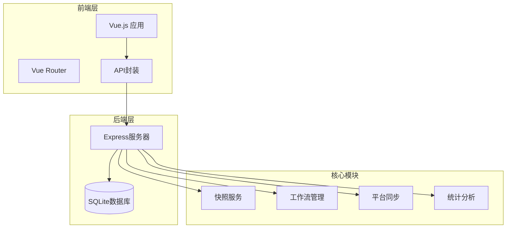
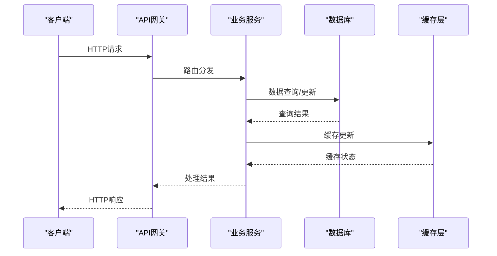
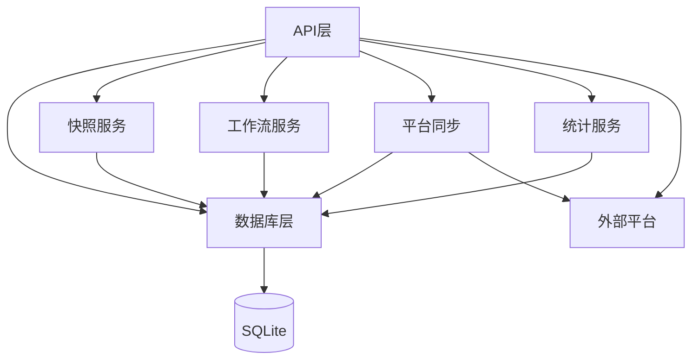
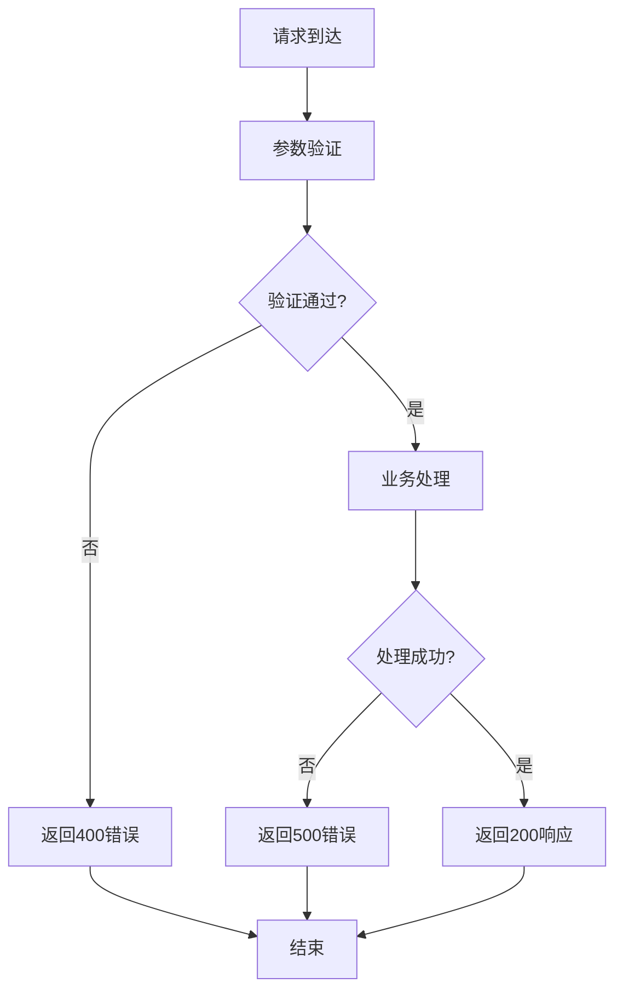

# API接口文档

<cite>
**本文档引用的文件**
- [server/index.js](file://server/index.js)
- [server/db.js](file://server/db.js)
- [server/snapshot-service.js](file://server/snapshot-service.js)
- [server/sector-workflow.js](file://server/sector-workflow.js)
- [server/platform-sync.js](file://server/platform-sync.js)
- [server/timesheet-stats.js](file://server/timesheet-stats.js)
- [server/cost-stats.js](file://server/cost-stats.js)
- [server/cost-categories.js](file://server/cost-categories.js)
- [database-schema.sql](file://database-schema.sql)
- [package.json](file://package.json)
- [test/snapshot-change-log.test.js](file://test/snapshot-change-log.test.js)
- [test/archive-workflow-reset.test.js](file://test/archive-workflow-reset.test.js)
</cite>

## 目录
1. [简介](#简介)
2. [项目结构](#项目结构)
3. [核心组件](#核心组件)
4. [架构概览](#架构概览)
5. [详细组件分析](#详细组件分析)
6. [依赖关系分析](#依赖关系分析)
7. [性能考虑](#性能考虑)
8. [故障排除指南](#故障排除指南)
9. [结论](#结论)
10. [附录](#附录)

## 简介
本项目是一个基于Express + SQLite的项目执行追踪平台，提供完整的项目管理、审批流程、数据统计和系统管理API。系统采用轻量级架构，无需构建工具，通过CDN引入依赖，支持多角色权限管理和工作流审批。

## 项目结构
项目采用前后端分离的单页应用架构，后端提供RESTful API，前端通过Vue.js + Element UI构建用户界面。



**图表来源**
- [server/index.js:88-100](file://server/index.js#L88-L100)
- [server/db.js:11-60](file://server/db.js#L11-L60)

**章节来源**
- [server/index.js:1-775](file://server/index.js#L1-L775)
- [package.json:1-19](file://package.json#L1-L19)

## 核心组件
系统包含以下核心组件：

### 数据库层
- **项目主表**：存储项目核心信息和计算字段
- **快照表**：存储审批过程中的数据快照
- **审计日志表**：记录所有数据变更历史
- **工时表**：存储项目工时明细
- **成本表**：存储项目成本中心数据

### 服务层
- **快照服务**：管理项目数据快照和版本控制
- **工作流服务**：处理审批流程状态管理
- **平台同步**：与外部工程平台数据同步
- **统计分析**：提供工时和成本统计数据

**章节来源**
- [database-schema.sql:8-87](file://database-schema.sql#L8-L87)
- [server/db.js:11-60](file://server/db.js#L11-L60)

## 架构概览
系统采用模块化设计，各API端点通过Express路由分发到相应的业务服务。



**图表来源**
- [server/index.js:112-124](file://server/index.js#L112-L124)
- [server/db.js:268-283](file://server/db.js#L268-L283)

## 详细组件分析

### 项目管理API
提供项目数据的CRUD操作和批量管理功能。

#### 项目批量导入
- **HTTP方法**: POST
- **URL模式**: `/api/projects`
- **请求参数**: 
  ```javascript
  {
    "projects": Array // 项目对象数组
  }
  ```
- **响应格式**: 
  ```javascript
  {
    "ok": Boolean,
    "count": Number
  }
  ```
- **错误码**: 400(请求参数错误), 500(服务器错误)

#### 项目单条更新
- **HTTP方法**: PUT
- **URL模式**: `/api/projects/:projectNo`
- **路径参数**: `projectNo` - 项目编号
- **请求参数**: 项目对象，必须包含`project_no`字段
- **响应格式**: `{ "ok": true }`
- **错误码**: 400(参数不匹配), 500(服务器错误)

#### 项目工时统计
- **HTTP方法**: GET
- **URL模式**: `/api/projects/:projectNo/timesheet`
- **路径参数**: `projectNo` - 项目编号
- **查询参数**: 
  - `year` - 年份，默认为系统年份
- **响应格式**: 包含工时统计信息的对象
- **错误码**: 500(服务器错误)

#### 项目成本中心统计
- **HTTP方法**: GET
- **URL模式**: `/api/projects/:projectNo/cost-center`
- **路径参数**: `projectNo` - 项目编号
- **查询参数**: 
  - `year` - 年份，默认为系统年份
- **响应格式**: 包含成本统计信息的对象
- **错误码**: 500(服务器错误)

**章节来源**
- [server/index.js:112-168](file://server/index.js#L112-L168)
- [server/timesheet-stats.js:60-80](file://server/timesheet-stats.js#L60-L80)
- [server/cost-stats.js:20-76](file://server/cost-stats.js#L20-L76)

### 审批流程API
处理项目审批流程的状态管理和快照生成。

#### 创建审批快照
- **HTTP方法**: POST
- **URL模式**: `/api/snapshots/:version`
- **路径参数**: `version` - 快照版本号
- **请求参数**: 快照对象
- **响应格式**: `{ "ok": true }`
- **错误码**: 400(空请求体), 500(服务器错误)

#### 获取审批快照
- **HTTP方法**: GET
- **URL模式**: `/api/snapshots/:version`
- **路径参数**: `version` - 快照版本号
- **响应格式**: 快照对象
- **错误码**: 404(快照不存在), 500(服务器错误)

#### 板块提交审批
- **HTTP方法**: POST
- **URL模式**: `/api/sectors/:code/submit-approval`
- **路径参数**: `code` - 板块代码
- **请求参数**: 
  ```javascript
  {
    "userName": String,
    "role": String
  }
  ```
- **响应格式**: 
  ```javascript
  {
    "ok": true,
    "version": String,
    "snapshot": Object,
    "state": Object
  }
  ```

#### 推进审批流程
- **HTTP方法**: POST
- **URL模式**: `/api/sectors/:code/advance-approval`
- **路径参数**: `code` - 板块代码
- **请求参数**: 
  ```javascript
  {
    "userName": String,
    "role": String
  }
  ```
- **响应格式**: `{ "ok": true, "state": Object }`

#### 驳回审批流程
- **HTTP方法**: POST
- **URL模式**: `/api/sectors/:code/reject-approval`
- **路径参数**: `code` - 板块代码
- **请求参数**: 
  ```javascript
  {
    "userName": String,
    "role": String,
    "reason": String
  }
  ```
- **响应格式**: `{ "ok": true, "state": Object }`

#### 公司归档
- **HTTP方法**: POST
- **URL模式**: `/api/company/archive`
- **请求参数**: 
  ```javascript
  {
    "userName": String,
    "role": String
  }
  ```
- **响应格式**: 
  ```javascript
  {
    "ok": true,
    "version": String,
    "snapshot": Object,
    "state": Object
  }
  ```

**章节来源**
- [server/index.js:184-446](file://server/index.js#L184-L446)
- [server/snapshot-service.js:88-158](file://server/snapshot-service.js#L88-L158)
- [server/sector-workflow.js:188-230](file://server/sector-workflow.js#L188-L230)

### 数据统计API
提供项目相关的统计分析功能。

#### 工时统计分析
- **HTTP方法**: GET
- **URL模式**: `/api/projects/:projectNo/timesheet`
- **路径参数**: `projectNo` - 项目编号
- **查询参数**: `year` - 年份
- **响应格式**: 
  ```javascript
  {
    "year": Number,
    "empty": Boolean,
    "detailCount": Number,
    "byProfession": Object,
    "bySector": Object,
    "details": Array
  }
  ```

#### 成本中心统计
- **HTTP方法**: GET
- **URL模式**: `/api/projects/:projectNo/cost-center`
- **路径参数**: `projectNo` - 项目编号
- **查询参数**: `year` - 年份
- **响应格式**: 
  ```javascript
  {
    "year": Number,
    "empty": Boolean,
    "detailCount": Number,
    "categories": Array,
    "rows": Array,
    "details": Array
  }
  ```

**章节来源**
- [server/timesheet-stats.js:60-80](file://server/timesheet-stats.js#L60-L80)
- [server/cost-stats.js:20-76](file://server/cost-stats.js#L20-L76)
- [server/cost-categories.js:4-13](file://server/cost-categories.js#L4-L13)

### 系统管理API
提供系统配置、用户管理和数据导入功能。

#### 系统引导状态
- **HTTP方法**: GET
- **URL模式**: `/api/bootstrap`
- **响应格式**: 包含系统状态的完整对象
- **错误码**: 500(服务器错误)

#### 字段字典管理
- **HTTP方法**: GET
- **URL模式**: `/api/fields`
- **响应格式**: `{ "fields": Array, "count": Number }`

#### 审计日志记录
- **HTTP方法**: POST
- **URL模式**: `/api/audit`
- **请求参数**: 审计记录对象
- **响应格式**: 审计记录对象
- **错误码**: 500(服务器错误)

#### 元数据更新
- **HTTP方法**: PATCH
- **URL模式**: `/api/meta`
- **请求参数**: 
  ```javascript
  {
    "periodConfig": Object,
    "reportingMonth": String,
    "approvalStatus": String,
    "lockStatus": Boolean,
    "reportingSubmitted": Boolean
  }
  ```
- **响应格式**: 系统引导状态对象

#### PM提交管理
- **HTTP方法**: POST
- **URL模式**: `/api/pm-submissions/submit`
- **请求参数**: 
  ```javascript
  {
    "pmName": String,
    "reportingMonth": String,
    "userName": String,
    "projectNos": Array
  }
  ```
- **响应格式**: `{ "ok": true, "projectCount": Number }`

#### 管理员重置
- **HTTP方法**: POST
- **URL模式**: `/api/admin/reseed`
- **响应格式**: 包含重置结果的完整对象

#### 工时数据导入
- **HTTP方法**: POST
- **URL模式**: `/api/admin/timesheet-import`
- **请求参数**: 
  ```javascript
  {
    "user": Object,
    "actor": Object
  }
  ```
- **响应格式**: 包含导入结果的对象

#### 成本数据导入
- **HTTP方法**: POST
- **URL模式**: `/api/admin/cost-import`
- **请求参数**: 
  ```javascript
  {
    "user": Object,
    "actor": Object
  }
  ```
- **响应格式**: 包含导入结果的对象

#### 平台数据同步
- **HTTP方法**: POST
- **URL模式**: `/api/editor/refresh-data`
- **请求参数**: 
  ```javascript
  {
    "user": Object,
    "actor": Object
  }
  ```
- **响应格式**: 包含同步结果的对象

#### 用户权限管理
- **HTTP方法**: GET
- **URL模式**: `/api/admin/users`
- **响应格式**: 
  ```javascript
  {
    "users": Array,
    "groupRegistry": Object,
    "sectorAdmins": Object,
    "sectorRegistry": Array
  }
  ```

#### 字段字典写入
- **HTTP方法**: PUT
- **URL模式**: `/api/admin/fields`
- **请求参数**: `{ "fields": Array, "user": Object }`
- **响应格式**: `{ "ok": true, "count": Number, "fields": Array }`

**章节来源**
- [server/index.js:91-741](file://server/index.js#L91-L741)
- [server/db.js:194-266](file://server/db.js#L194-L266)

## 依赖关系分析



**图表来源**
- [server/index.js:8-20](file://server/index.js#L8-L20)
- [server/db.js:11-60](file://server/db.js#L11-L60)

### 错误处理机制
系统采用统一的错误处理策略：



**图表来源**
- [server/index.js:112-124](file://server/index.js#L112-L124)
- [server/index.js:184-196](file://server/index.js#L184-L196)

**章节来源**
- [server/index.js:112-196](file://server/index.js#L112-L196)

## 性能考虑
- **数据库优化**: 使用SQLite WAL模式提高并发性能
- **索引设计**: 为常用查询字段建立索引
- **缓存策略**: 快照数据采用内存缓存
- **批量操作**: 支持批量项目导入减少网络往返
- **数据压缩**: 工时和成本数据采用聚合存储

## 故障排除指南

### 常见问题
1. **数据库连接失败**: 检查SQLite文件权限和路径
2. **快照版本冲突**: 确认版本号唯一性
3. **权限验证失败**: 验证用户角色和权限配置
4. **数据同步异常**: 检查外部平台API可用性

### 调试技巧
- 使用审计日志追踪数据变更
- 启用详细错误信息
- 检查系统状态端点
- 验证JSON数据格式

**章节来源**
- [server/db.js:306-308](file://server/db.js#L306-L308)
- [server/index.js:448-450](file://server/index.js#L448-L450)

## 结论
本API接口文档涵盖了项目执行追踪平台的所有核心功能，包括项目管理、审批流程、数据统计和系统管理。系统采用模块化设计，具有良好的扩展性和维护性。通过清晰的API规范和完善的错误处理机制，为前端应用提供了稳定可靠的数据服务。

## 附录

### API版本管理
- **版本号**: 1.0.0
- **向后兼容性**: 保持现有API不变
- **废弃接口**: 已标记为废弃的接口会返回明确的错误信息

### 认证机制
系统采用基于角色的访问控制(RBAC)，通过用户角色决定API访问权限。

### 请求限制
- **请求大小**: 默认80MB
- **并发连接**: SQLite支持多进程并发
- **超时设置**: 根据操作类型设置合理的超时时间

**章节来源**
- [package.json:4](file://package.json#L4)
- [server/index.js:89](file://server/index.js#L89)