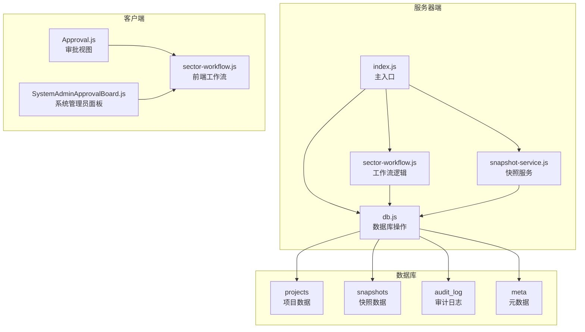
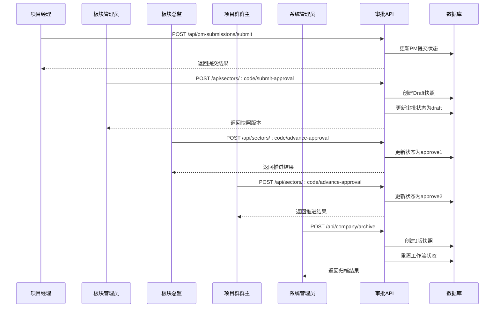
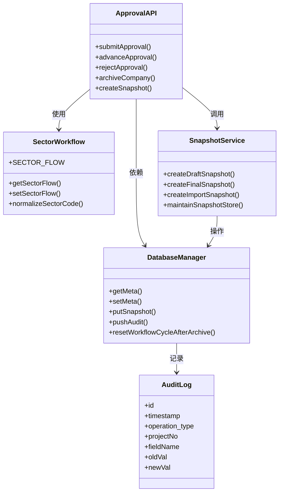
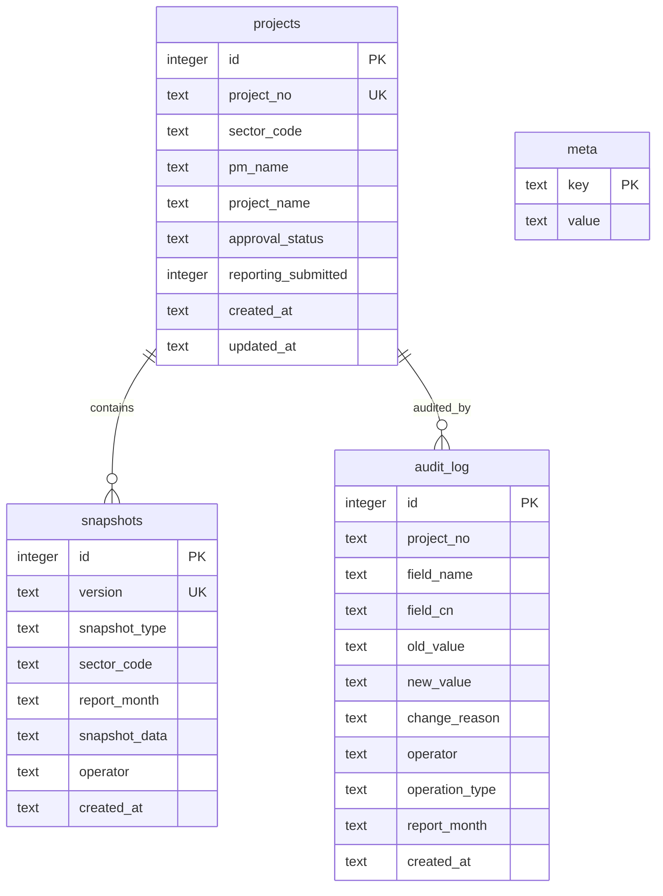

# 审批流程API

<cite>
**本文档引用的文件**
- [server/index.js](file://server/index.js)
- [server/sector-workflow.js](file://server/sector-workflow.js)
- [server/snapshot-service.js](file://server/snapshot-service.js)
- [server/db.js](file://server/db.js)
- [js/views/Approval.js](file://js/views/Approval.js)
- [js/sector-workflow.js](file://js/sector-workflow.js)
- [js/components/SystemAdminApprovalBoard.js](file://js/components/SystemAdminApprovalBoard.js)
- [database-schema.sql](file://database-schema.sql)
</cite>

## 目录
1. [简介](#简介)
2. [项目结构](#项目结构)
3. [核心组件](#核心组件)
4. [架构概览](#架构概览)
5. [详细组件分析](#详细组件分析)
6. [依赖关系分析](#依赖关系分析)
7. [性能考虑](#性能考虑)
8. [故障排除指南](#故障排除指南)
9. [结论](#结论)

## 简介

审批流程API是项目追踪表线上化系统的核心功能模块，负责管理多层级审批流程的完整生命周期。该系统实现了从项目经理提交、板块管理员审批到公司归档的完整工作流，支持12个执行板块的并行审批管理。

系统采用SQLite数据库存储项目数据、审批快照和审计日志，通过RESTful API提供完整的审批管理能力。每个审批节点都会生成不可变的数据快照，确保审计追溯性和数据完整性。

## 项目结构

审批流程相关的代码主要分布在以下模块中：

**图表来源**
- [server/index.js:1-775](file://server/index.js#L1-L775)
- [server/sector-workflow.js:1-273](file://server/sector-workflow.js#L1-L273)
- [server/snapshot-service.js:1-292](file://server/snapshot-service.js#L1-L292)
- [server/db.js:1-525](file://server/db.js#L1-L525)

**章节来源**
- [server/index.js:1-775](file://server/index.js#L1-L775)
- [server/sector-workflow.js:1-273](file://server/sector-workflow.js#L1-L273)
- [server/snapshot-service.js:1-292](file://server/snapshot-service.js#L1-L292)
- [server/db.js:1-525](file://server/db.js#L1-L525)

## 核心组件

### 审批工作流状态

系统定义了四级审批状态：
- **draft**: 填报/草稿阶段
- **approve1**: 板块总监初审
- **approve2**: 项目群群主复审
- **final**: 公司归档完成

### 板块管理

系统支持12个执行板块（SAS170-SAS720），每个板块都有独立的审批流程状态。板块代码支持标准化处理，自动将简写代码转换为完整格式。

### 快照管理

每个审批节点都会生成不可变的数据快照，包含：
- 版本标识符
- 操作员信息
- 审批时间戳
- 项目数据快照
- 报告月信息

**章节来源**
- [server/sector-workflow.js:50-82](file://server/sector-workflow.js#L50-L82)
- [server/sector-workflow.js:3-7](file://server/sector-workflow.js#L3-L7)
- [server/snapshot-service.js:6-158](file://server/snapshot-service.js#L6-L158)

## 架构概览

**图表来源**
- [server/index.js:230-446](file://server/index.js#L230-L446)
- [server/sector-workflow.js:198-221](file://server/sector-workflow.js#L198-L221)

## 详细组件分析

### 快照管理接口

#### GET /api/snapshots/:version
用于获取指定版本的快照数据。

**请求参数:**
- `version`: 快照版本标识符（URL路径参数）

**响应数据:**
- `ok`: 操作状态
- `snap`: 快照对象，包含：
  - `version`: 版本号
  - `user`: 操作员
  - `time`: 操作时间
  - `projects`: 项目数据快照
  - `reportingMonth`: 报告月

**错误处理:**
- 404: 快照不存在
- 500: 服务器内部错误

#### PUT /api/snapshots/:version
用于更新指定版本的快照数据。

**请求体参数:**
- `snap`: 快照对象（必填）
- `projects`: 项目数据数组
- `user`: 操作员信息
- `time`: 操作时间

**响应数据:**
- `ok`: 操作状态

**错误处理:**
- 400: 空body
- 500: 服务器内部错误

**章节来源**
- [server/index.js:184-196](file://server/index.js#L184-L196)
- [server/index.js:287-300](file://server/index.js#L287-L300)

### 板块提交审批接口

#### POST /api/sectors/:code/submit-approval
板块管理员提交审批申请，生成Draft快照并启动审批流程。

**请求参数:**
- `userName`: 操作员姓名（必填）
- `role`: 操作员角色（默认：sector_admin）

**响应数据:**
- `ok`: 操作状态
- `version`: 生成的快照版本号
- `snapshot`: 快照对象
- `state`: 当前系统状态

**状态转换:**
- 如果板块管理员同时具备总监权限：直接进入approve1
- 否则：进入draft状态

**错误处理:**
- 409: 板块已提交审批
- 500: 服务器内部错误

**章节来源**
- [server/index.js:302-346](file://server/index.js#L302-L346)

### 审批状态推进接口

#### POST /api/sectors/:code/advance-approval
推进审批状态到下一个节点。

**请求参数:**
- `userName`: 操作员姓名（必填）
- `role`: 操作员角色（必填）

**状态转换规则:**
- draft + reportingSubmitted = approve1
- approve1 = approve2

**响应数据:**
- `ok`: 操作状态
- `state`: 更新后的系统状态

**错误处理:**
- 409: 当前状态不可推进
- 500: 服务器内部错误

**章节来源**
- [server/index.js:348-385](file://server/index.js#L348-L385)

### 审批驳回接口

#### POST /api/sectors/:code/reject-approval
驳回审批申请，返回到板块管理员。

**请求参数:**
- `userName`: 操作员姓名（必填）
- `role`: 操作员角色（必填）
- `reason`: 驳回原因（可选）

**状态转换:**
- approve1 → draft
- approve2 → draft

**响应数据:**
- `ok`: 操作状态
- `state`: 更新后的系统状态

**错误处理:**
- 500: 服务器内部错误

**章节来源**
- [server/index.js:387-417](file://server/index.js#L387-L417)

### 公司归档接口

#### POST /api/company/archive
系统管理员执行公司级归档，生成最终的J版快照。

**请求参数:**
- `userName`: 操作员姓名（可选）
- `role`: 操作员角色（可选）

**功能特性:**
- 创建最终快照（J版）
- 清除项目变更跟踪
- 重置工作流程循环
- 生成审计日志

**响应数据:**
- `ok`: 操作状态
- `version`: 生成的快照版本号
- `snapshot`: 快照对象
- `state`: 更新后的系统状态

**错误处理:**
- 500: 服务器内部错误

**章节来源**
- [server/index.js:419-446](file://server/index.js#L419-L446)

### PM提交接口

#### POST /api/pm-submissions/submit
项目经理提交当月项目数据。

**请求参数:**
- `pmName`: 项目经理姓名（必填）
- `reportingMonth`: 报告月（必填）
- `userName`: 操作员姓名（可选）
- `projectNos`: 项目编号数组（可选）

**响应数据:**
- `ok`: 操作状态
- `projectCount`: 提交的项目数量

**错误处理:**
- 400: 缺少必需参数
- 409: 板块已正式提交审批
- 500: 服务器内部错误

**章节来源**
- [server/index.js:230-285](file://server/index.js#L230-L285)

## 依赖关系分析

**图表来源**
- [server/index.js:12-19](file://server/index.js#L12-L19)
- [server/sector-workflow.js:250-272](file://server/sector-workflow.js#L250-L272)
- [server/snapshot-service.js:276-291](file://server/snapshot-service.js#L276-L291)
- [server/db.js:490-525](file://server/db.js#L490-L525)

### 数据库模式

系统使用SQLite作为数据存储，核心表包括：

**图表来源**
- [database-schema.sql:12-87](file://database-schema.sql#L12-L87)
- [database-schema.sql:279-286](file://database-schema.sql#L279-L286)
- [database-schema.sql:254-268](file://database-schema.sql#L254-L268)

**章节来源**
- [server/db.js:11-60](file://server/db.js#L11-L60)
- [database-schema.sql:12-286](file://database-schema.sql#L12-L286)

## 性能考虑

### 数据库优化
- 使用WAL模式提高并发性能
- 为常用查询字段建立索引
- 事务批量操作减少磁盘I/O

### 快照存储
- 快照数据不可变，支持高效查询
- 清理旧版快照避免存储膨胀
- 版本号包含时间戳便于快速检索

### 工作流优化
- 状态同步采用增量更新
- 审计日志异步写入
- 前端状态缓存减少API调用

## 故障排除指南

### 常见错误及解决方案

**409 冲突错误**
- 板块已提交审批：等待系统管理员归档后再提交
- PM重复提交：检查PM提交状态，避免重复操作

**400 参数错误**
- 缺少必需参数：检查请求体中的必填字段
- 参数格式错误：验证数据类型和格式

**500 服务器错误**
- 数据库连接异常：检查数据库文件权限
- 快照创建失败：验证磁盘空间和权限

### 审计追踪

所有审批操作都会记录到审计日志中，包括：
- 操作时间戳
- 操作员信息
- 操作类型
- 影响的数据范围
- 操作前后值对比

**章节来源**
- [server/index.js:369-412](file://server/index.js#L369-L412)
- [server/db.js:306-308](file://server/db.js#L306-L308)

## 结论

审批流程API提供了完整的多层级审批管理能力，具有以下特点：

1. **完整的生命周期管理**：从PM提交到公司归档的全流程覆盖
2. **不可变快照**：每个审批节点都生成不可变的数据快照
3. **严格的权限控制**：基于角色的访问控制和操作权限
4. **完善的审计追踪**：完整的操作日志和数据变更记录
5. **高可用性设计**：数据库优化和错误处理机制

该系统支持12个执行板块的并行审批管理，能够满足大型组织的复杂审批需求，同时保持系统的可维护性和扩展性。