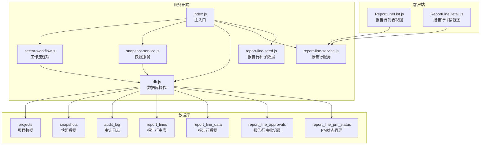
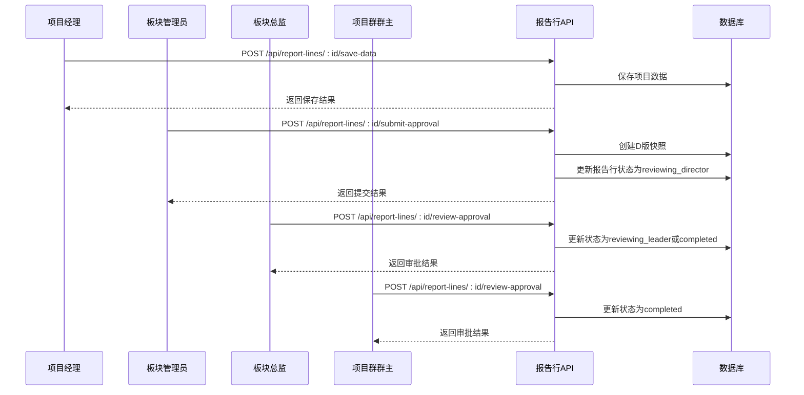
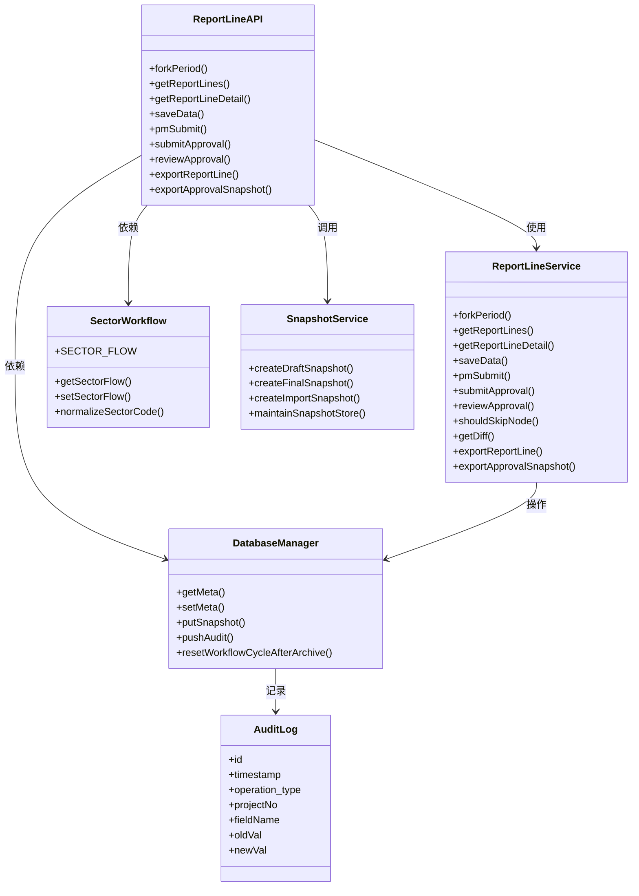
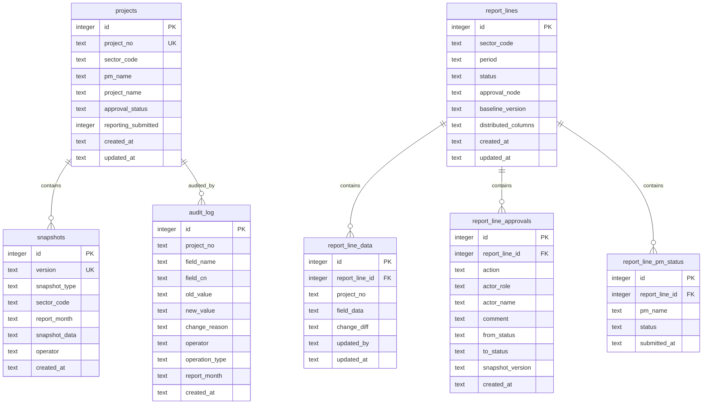

# 审批流程API

<cite>
**本文档引用的文件**
- [server/index.js](file://server/index.js)
- [server/sector-workflow.js](file://server/sector-workflow.js)
- [server/snapshot-service.js](file://server/snapshot-service.js)
- [server/db.js](file://server/db.js)
- [server/report-line-service.js](file://server/report-line-service.js)
- [server/report-line-seed.js](file://server/report-line-seed.js)
- [js/views/ReportLineDetail.js](file://js/views/ReportLineDetail.js)
- [js/views/ReportLineList.js](file://js/views/ReportLineList.js)
- [database-schema.sql](file://database-schema.sql)
</cite>

## 目录
1. [简介](#简介)
2. [项目结构](#项目结构)
3. [核心组件](#核心组件)
4. [架构概览](#架构概览)
5. [详细组件分析](#详细组件分析)
6. [依赖关系分析](#依赖关系分析)
7. [性能考虑](#性能考虑)
8. [故障排除指南](#故障排除指南)
9. [结论](#结论)

## 简介

审批流程API是项目追踪表线上化系统的核心功能模块，负责管理多层级审批流程的完整生命周期。该系统实现了从项目经理提交、板块管理员审批到公司归档的完整工作流，支持12个执行板块的并行审批管理。

**重要变更**：系统已从传统的审批工作流完全转向报告行管理模式。新的报告行管理API提供了更精细的项目数据填报、审批和管理工作流，支持按板块维度的独立数据管理。

系统采用SQLite数据库存储项目数据、报告行数据、审批快照和审计日志，通过RESTful API提供完整的报告行管理能力。每个审批节点都会生成不可变的数据快照，确保审计追溯性和数据完整性。

## 项目结构

报告行管理相关的代码主要分布在以下模块中：

**图表来源**
- [server/index.js:1-1094](file://server/index.js#L1-L1094)
- [server/sector-workflow.js:1-298](file://server/sector-workflow.js#L1-L298)
- [server/snapshot-service.js:1-292](file://server/snapshot-service.js#L1-L292)
- [server/db.js:1-851](file://server/db.js#L1-L851)
- [server/report-line-service.js:1-1099](file://server/report-line-service.js#L1-L1099)
- [server/report-line-seed.js:1-424](file://server/report-line-seed.js#L1-L424)

**章节来源**
- [server/index.js:1-1094](file://server/index.js#L1-L1094)
- [server/sector-workflow.js:1-298](file://server/sector-workflow.js#L1-L298)
- [server/snapshot-service.js:1-292](file://server/snapshot-service.js#L1-L292)
- [server/db.js:1-851](file://server/db.js#L1-L851)
- [server/report-line-service.js:1-1099](file://server/report-line-service.js#L1-L1099)
- [server/report-line-seed.js:1-424](file://server/report-line-seed.js#L1-L424)

## 核心组件

### 报告行管理状态

系统定义了五级报告行状态：
- **open**: 待填报状态
- **submitted**: PM已提交
- **reviewing_director**: 总监审批中
- **reviewing_leader**: 项目群主审批中
- **completed**: 审批完成
- **closed**: 已关闭

### 板块管理

系统支持12个执行板块（SAS170-SAS720），每个板块都有独立的报告行管理流程。板块代码支持标准化处理，自动将简写代码转换为完整格式。

### 快照管理

每个审批节点都会生成不可变的数据快照，包含：
- 版本标识符（RL_D:YYYYMMDD:sectorCode:seq）
- 操作员信息
- 审批时间戳
- 项目数据快照
- 报告月信息

**章节来源**
- [server/sector-workflow.js:50-82](file://server/sector-workflow.js#L50-L82)
- [server/sector-workflow.js:3-7](file://server/sector-workflow.js#L3-L7)
- [server/snapshot-service.js:6-158](file://server/snapshot-service.js#L6-L158)
- [server/report-line-service.js:21-53](file://server/report-line-service.js#L21-L53)

## 架构概览

**图表来源**
- [server/index.js:250-472](file://server/index.js#L250-L472)
- [server/report-line-service.js:641-779](file://server/report-line-service.js#L641-L779)

## 详细组件分析

### 报告行管理接口

#### GET /api/report-lines
获取报告行列表，支持按权限过滤。

**请求参数:**
- `status`: 报告行状态（可选）
- `sector`: 板块代码（可选）
- `period`: 报告周期（可选）

**响应数据:**
- `ok`: 操作状态
- `reportLines`: 报告行数组，包含：
  - `id`: 报告行ID
  - `sector_code`: 板块代码
  - `period`: 报告周期
  - `status`: 当前状态
  - `approval_node`: 审批节点
  - `projects_count`: 项目数量

**章节来源**
- [server/report-line-service.js:343-411](file://server/report-line-service.js#L343-L411)

#### GET /api/report-lines/:id
获取报告行详情。

**请求参数:**
- `id`: 报告行ID（URL路径参数）

**响应数据:**
- `ok`: 操作状态
- `reportLine`: 报告行对象，包含：
  - `id`: 报告行ID
  - `sector_code`: 板块代码
  - `period`: 报告周期
  - `status`: 当前状态
  - `approval_node`: 审批节点
  - `projects`: 项目数据数组
  - `pmStatuses`: PM状态数组
  - `approvals`: 审批记录数组

**章节来源**
- [server/report-line-service.js:417-490](file://server/report-line-service.js#L417-L490)

#### POST /api/report-lines/:id/save-data
保存项目数据。

**请求参数:**
- `id`: 报告行ID（URL路径参数）
- `projectNo`: 项目编号（必填）
- `fieldData`: 字段数据对象（必填）

**响应数据:**
- `ok`: 操作状态
- `project_no`: 项目编号
- `change_diff`: 字段变更差异

**章节来源**
- [server/report-line-service.js:496-524](file://server/report-line-service.js#L496-L524)

#### POST /api/report-lines/:id/pm-submit
PM提交报告行。

**请求参数:**
- `id`: 报告行ID（URL路径参数）
- `pmName`: PM姓名（必填）

**响应数据:**
- `ok`: 操作状态
- `pm_name`: PM姓名
- `status`: 提交状态
- `submitted_at`: 提交时间

**章节来源**
- [server/report-line-service.js:595-635](file://server/report-line-service.js#L595-L635)

#### POST /api/report-lines/:id/submit-approval
板块管理员提交审批。

**请求参数:**
- `id`: 报告行ID（URL路径参数）
- `sectorAdminName`: 板块管理员姓名（必填）

**响应数据:**
- `ok`: 操作状态
- `id`: 报告行ID
- `status`: 更新后的状态
- `approval_node`: 审批节点
- `skip_director`: 是否跳过总监节点

**状态转换:**
- open → reviewing_director
- 可能跳过总监节点直接到reviewing_leader

**章节来源**
- [server/report-line-service.js:641-703](file://server/report-line-service.js#L641-L703)

#### POST /api/report-lines/:id/review-approval
审批操作（总监/群主）。

**请求参数:**
- `id`: 报告行ID（URL路径参数）
- `action`: 审批动作（approve/reject，必填）
- `reviewerRole`: 审批人角色（必填）
- `reviewerName`: 审批人姓名（必填）
- `comment`: 审批意见（可选）

**响应数据:**
- `ok`: 操作状态
- `id`: 报告行ID
- `status`: 更新后的状态
- `approval_node`: 审批节点

**状态转换规则:**
- reviewing_director + approve → reviewing_leader 或 completed
- reviewing_leader + approve → completed
- reviewing_director/reviewing_leader + reject → open

**章节来源**
- [server/report-line-service.js:709-779](file://server/report-line-service.js#L709-L779)

### 报告行发起接口

#### POST /api/report-lines/fork-period
为各板块创建新周期报告行。

**请求参数:**
- `period`: 报告周期（必填）
- `distributedColumns`: 分发列配置（可选）

**响应数据:**
- `ok`: 操作状态
- `created`: 新创建的报告行数组
- `skipped`: 已存在的报告行数组
- `baselineVersion`: 基线版本
- `period`: 报告周期

**功能特性:**
- 基于J版快照创建报告行
- 自动分配PM状态
- 支持分发列配置

**章节来源**
- [server/report-line-service.js:241-337](file://server/report-line-service.js#L241-L337)

#### GET /api/report-lines/fork-preview
发起前预览。

**响应数据:**
- `ok`: 操作状态
- `period`: 报告周期
- `baselineVersion`: 基线版本
- `baselineAvailable`: 基线可用性
- `sectors`: 板块预览数组
- `summary`: 统计摘要

**章节来源**
- [server/report-line-service.js:155-220](file://server/report-line-service.js#L155-L220)

### 报告行导出接口

#### GET /api/report-lines/:id/export
导出报告行数据为Excel。

**请求参数:**
- `id`: 报告行ID（URL路径参数）
- `role`: 角色（可选：pm）
- `pmName`: PM姓名（可选）

**响应数据:**
- `buffer`: Excel文件缓冲区
- `filename`: 文件名
- `projectCount`: 项目数量

**章节来源**
- [server/report-line-service.js:905-1006](file://server/report-line-service.js#L905-L1006)

#### GET /api/report-lines/:id/export-approval-snapshot/:approvalId
导出审批时刻的快照数据。

**请求参数:**
- `id`: 报告行ID（URL路径参数）
- `approvalId`: 审批记录ID（URL路径参数）

**响应数据:**
- `buffer`: Excel文件缓冲区
- `filename`: 文件名

**章节来源**
- [server/report-line-service.js:1012-1078](file://server/report-line-service.js#L1012-L1078)

### 快照管理接口

#### GET /api/snapshots/:version
用于获取指定版本的快照数据。

**请求参数:**
- `version`: 快照版本标识符（URL路径参数）

**响应数据:**
- `ok`: 操作状态
- `snap`: 快照对象，包含：
  - `version`: 版本号
  - `user`: 操作员
  - `time`: 操作时间
  - `projects`: 项目数据快照
  - `reportingMonth`: 报告月

**错误处理:**
- 404: 快照不存在
- 500: 服务器内部错误

#### PUT /api/snapshots/:version
用于更新指定版本的快照数据。

**请求体参数:**
- `snap`: 快照对象（必填）
- `projects`: 项目数据数组
- `user`: 操作员信息
- `time`: 操作时间

**响应数据:**
- `ok`: 操作状态

**错误处理:**
- 400: 空body
- 500: 服务器内部错误

**章节来源**
- [server/index.js:204-216](file://server/index.js#L204-L216)
- [server/index.js:307-320](file://server/index.js#L307-L320)

### PM提交接口

#### POST /api/pm-submissions/submit
项目经理提交当月项目数据。

**请求参数:**
- `pmName`: 项目经理姓名（必填）
- `reportingMonth`: 报告月（必填）
- `userName`: 操作员姓名（可选）
- `projectNos`: 项目编号数组（可选）

**响应数据:**
- `ok`: 操作状态
- `projectCount`: 提交的项目数量

**错误处理:**
- 400: 缺少必需参数
- 409: 板块已正式提交审批
- 500: 服务器内部错误

**章节来源**
- [server/index.js:250-305](file://server/index.js#L250-L305)

## 依赖关系分析

**图表来源**
- [server/index.js:12-22](file://server/index.js#L12-L22)
- [server/sector-workflow.js:274-298](file://server/sector-workflow.js#L274-L298)
- [server/snapshot-service.js:276-292](file://server/snapshot-service.js#L276-L292)
- [server/db.js:490-525](file://server/db.js#L490-L525)
- [server/report-line-service.js:1084-1099](file://server/report-line-service.js#L1084-L1099)

### 数据库模式

系统使用SQLite作为数据存储，核心表包括：

**图表来源**
- [database-schema.sql:12-87](file://database-schema.sql#L12-L87)
- [database-schema.sql:279-286](file://database-schema.sql#L279-L286)
- [database-schema.sql:254-268](file://database-schema.sql#L254-L268)
- [server/db.js:83-136](file://server/db.js#L83-L136)

**章节来源**
- [server/db.js:11-60](file://server/db.js#L11-L60)
- [database-schema.sql:12-286](file://database-schema.sql#L12-L286)
- [server/db.js:83-136](file://server/db.js#L83-L136)

## 性能考虑

### 数据库优化
- 使用WAL模式提高并发性能
- 为常用查询字段建立索引
- 事务批量操作减少磁盘I/O

### 快照存储
- 快照数据不可变，支持高效查询
- 清理旧版快照避免存储膨胀
- 版本号包含时间戳便于快速检索

### 报告行优化
- 分发列配置减少导出数据量
- 权限过滤减少查询结果集
- 审计日志异步写入
- 前端状态缓存减少API调用

## 故障排除指南

### 常见错误及解决方案

**409 冲突错误**
- 板块已提交审批：等待系统管理员归档后再提交
- PM重复提交：检查PM提交状态，避免重复操作

**400 参数错误**
- 缺少必需参数：检查请求体中的必填字段
- 参数格式错误：验证数据类型和格式

**500 服务器错误**
- 数据库连接异常：检查数据库文件权限
- 快照创建失败：验证磁盘空间和权限

### 审计追踪

所有审批操作都会记录到审计日志中，包括：
- 操作时间戳
- 操作员信息
- 操作类型
- 影响的数据范围
- 操作前后值对比

**章节来源**
- [server/index.js:369-412](file://server/index.js#L369-L412)
- [server/db.js:506-508](file://server/db.js#L506-L508)

## 结论

审批流程API提供了完整的多层级审批管理能力，具有以下特点：

1. **完整的生命周期管理**：从PM提交到公司归档的全流程覆盖
2. **不可变快照**：每个审批节点都生成不可变的数据快照
3. **严格的权限控制**：基于角色的访问控制和操作权限
4. **完善的审计追踪**：完整的操作日志和数据变更记录
5. **高可用性设计**：数据库优化和错误处理机制

该系统支持12个执行板块的并行审批管理，能够满足大型组织的复杂审批需求，同时保持系统的可维护性和扩展性。

**重要变更总结**：
- 从传统审批工作流转向报告行管理模式
- 新增报告行相关的完整API端点集合
- 支持按板块维度的独立数据管理
- 增强的权限控制和审计功能
- 更灵活的分发列配置机制