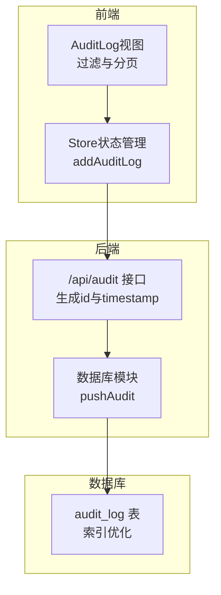
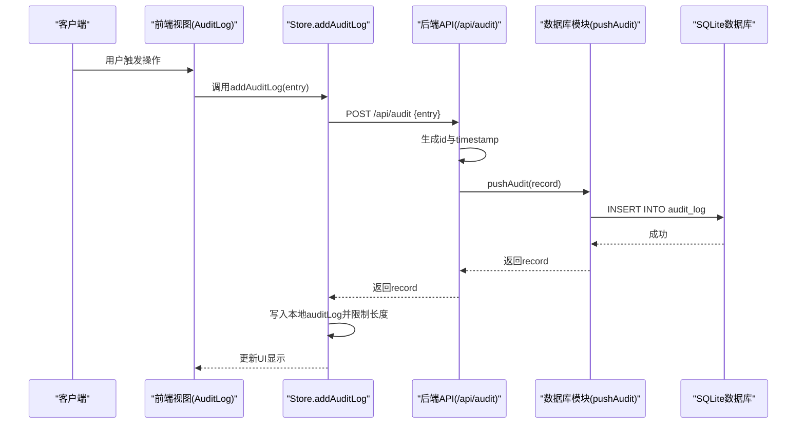
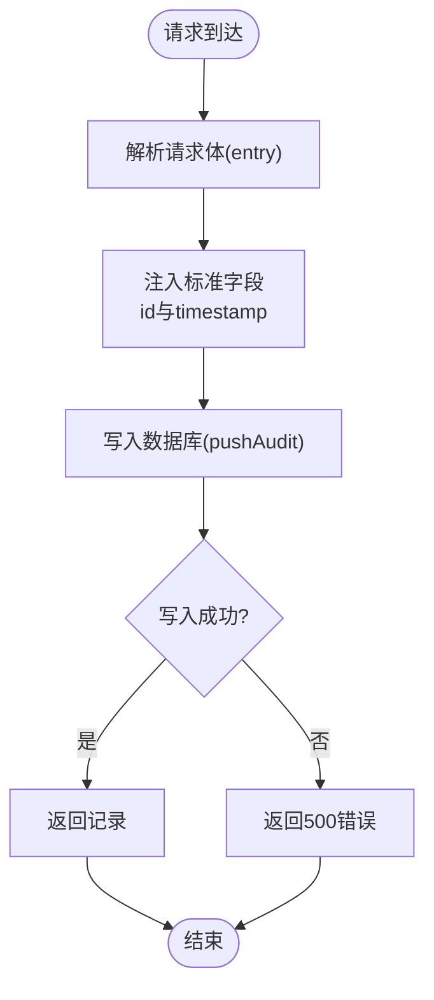
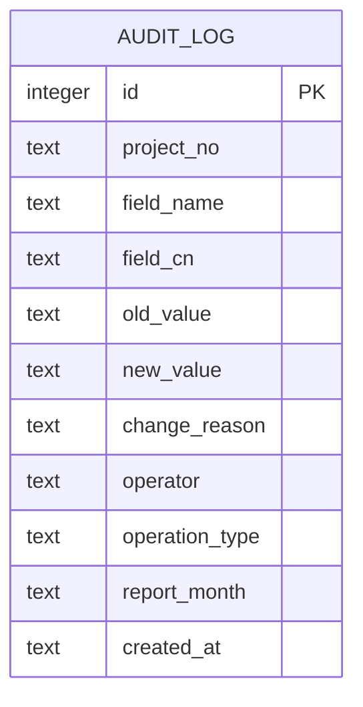
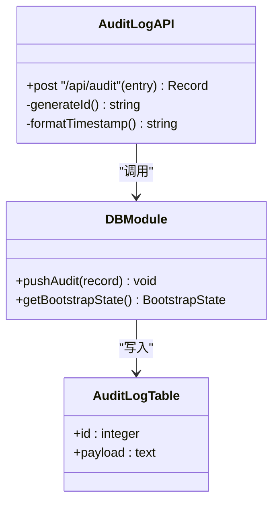
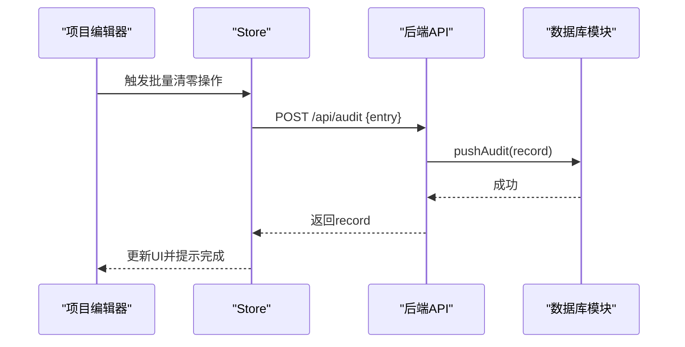

# 审计日志API

<cite>
**本文档引用的文件**
- [server/index.js](file://server/index.js)
- [server/db.js](file://server/db.js)
- [database-schema.sql](file://database-schema.sql)
- [js/views/AuditLog.js](file://js/views/AuditLog.js)
- [js/store.js](file://js/store.js)
- [js/views/ProjectEditor.js](file://js/views/ProjectEditor.js)
- [js/change-meta.js](file://js/change-meta.js)
</cite>

## 目录
1. [简介](#简介)
2. [项目结构](#项目结构)
3. [核心组件](#核心组件)
4. [架构概览](#架构概览)
5. [详细组件分析](#详细组件分析)
6. [依赖关系分析](#依赖关系分析)
7. [性能考虑](#性能考虑)
8. [故障排除指南](#故障排除指南)
9. [结论](#结论)

## 简介
本文件详细说明项目追踪表系统的审计日志API，重点覆盖数据变更追踪与审计记录的接口规范。系统通过统一的审计记录提交接口（POST /api/audit）实现对各类操作的完整记录，包括数据修改、审批流程、系统配置变更等场景。审计记录采用标准化结构，包含时间戳、唯一标识符、操作人信息、项目关联、字段变更详情以及操作类型等关键字段，确保满足财务与运营审计要求。

## 项目结构
审计日志功能涉及前端视图层、应用状态管理、后端API与数据库存储四个层面：

- 前端视图层：提供审计日志查询界面，支持多维筛选、分页与导出功能
- 应用状态管理：负责将审计记录持久化到本地状态，并限制最大条目数
- 后端API：接收审计记录，生成唯一标识符与时间戳，写入数据库
- 数据库存储：采用SQLite存储审计记录，提供索引优化查询性能

**图表来源**
- [js/views/AuditLog.js:1-239](file://js/views/AuditLog.js#L1-L239)
- [js/store.js:338-342](file://js/store.js#L338-L342)
- [server/index.js:170-182](file://server/index.js#L170-L182)
- [server/db.js:306-308](file://server/db.js#L306-L308)
- [database-schema.sql:254-273](file://database-schema.sql#L254-L273)

**章节来源**
- [js/views/AuditLog.js:1-239](file://js/views/AuditLog.js#L1-L239)
- [js/store.js:338-342](file://js/store.js#L338-L342)
- [server/index.js:170-182](file://server/index.js#L170-L182)
- [server/db.js:306-308](file://server/db.js#L306-L308)
- [database-schema.sql:254-273](file://database-schema.sql#L254-L273)

## 核心组件
- 审计记录提交接口（POST /api/audit）
  - 功能：接收客户端提交的审计记录，自动生成唯一标识符与时间戳，写入数据库并返回记录
  - 请求体：任意JSON对象，系统会注入标准字段
  - 响应：返回完整的审计记录对象
- 审计日志存储机制
  - 数据库表：audit_log（SQLite）
  - 字段：id、payload（JSON字符串）
  - 查询：启动时读取最近500条记录，支持按项目号、报告月、操作人、时间排序
- 审计日志查询与展示
  - 前端：提供多维筛选（操作人、项目号/名称、字段名、时间范围）、分页与导出Excel功能
  - 后端：提供快照查询接口（/api/snapshots/:version），用于审批流程中的数据快照检索

**章节来源**
- [server/index.js:170-182](file://server/index.js#L170-L182)
- [server/db.js:212-215](file://server/db.js#L212-L215)
- [js/views/AuditLog.js:20-87](file://js/views/AuditLog.js#L20-L87)
- [server/index.js:287-300](file://server/index.js#L287-L300)

## 架构概览
审计日志系统遵循前后端分离架构，前端负责用户交互与数据展示，后端负责业务逻辑与数据持久化，数据库提供高性能查询能力。

**图表来源**
- [js/views/AuditLog.js:1-239](file://js/views/AuditLog.js#L1-L239)
- [js/store.js:338-342](file://js/store.js#L338-L342)
- [server/index.js:170-182](file://server/index.js#L170-L182)
- [server/db.js:306-308](file://server/db.js#L306-L308)

## 详细组件分析

### 审计记录提交接口（POST /api/audit）
- 接口路径：/api/audit
- 方法：POST
- 请求体：任意JSON对象（例如字段变更详情、系统配置变更、审批流程状态变更等）
- 处理逻辑：
  - 从请求体提取entry对象
  - 注入标准字段：id（时间戳+随机字符串）、timestamp（ISO 8601）
  - 调用数据库模块写入audit_log表
  - 返回完整的记录对象
- 错误处理：捕获异常并返回500错误

**图表来源**
- [server/index.js:170-182](file://server/index.js#L170-L182)
- [server/db.js:306-308](file://server/db.js#L306-L308)

**章节来源**
- [server/index.js:170-182](file://server/index.js#L170-L182)
- [server/db.js:306-308](file://server/db.js#L306-L308)

### 审计记录标准结构与字段定义
- 标准字段（由系统注入或接口自动填充）
  - id：字符串，唯一标识符（时间戳+随机字符串）
  - timestamp：字符串，ISO 8601时间戳
- 常用业务字段（由调用方传入）
  - projectNo：项目编号
  - projectName：项目名称
  - fieldName：字段英文名
  - fieldCN：字段中文名
  - oldVal：修改前值
  - newVal：修改后值
  - changeReason：修改原因（可选）
  - userId：操作人ID
  - userName：操作人姓名
  - operationType：操作类型（如insert、update、delete、import、unlock_edit等）
  - reportMonth：所属报告月
  - operator：操作人标识
  - created_at：记录创建时间（数据库默认值）

**图表来源**
- [database-schema.sql:254-268](file://database-schema.sql#L254-L268)

**章节来源**
- [database-schema.sql:254-268](file://database-schema.sql#L254-L268)

### 时间戳处理与唯一标识符生成
- 唯一标识符：基于当前时间戳与随机字符串拼接，确保高并发下的唯一性
- 时间戳：使用ISO 8601格式，便于跨时区一致性与排序
- 数据库默认时间：created_at字段使用数据库本地时间，默认值为当前时间

**章节来源**
- [server/index.js:173-176](file://server/index.js#L173-L176)
- [database-schema.sql:265](file://database-schema.sql#L265)

### 审计日志存储机制
- 存储位置：SQLite数据库（data/ptrack.sqlite）
- 表结构：audit_log（id为主键，payload为JSON字符串）
- 写入流程：前端调用addAuditLog → 后端生成id与timestamp → 数据库模块写入
- 读取策略：启动时读取最近500条记录，避免内存膨胀

**图表来源**
- [server/index.js:170-182](file://server/index.js#L170-L182)
- [server/db.js:306-308](file://server/db.js#L306-L308)
- [server/db.js:212-215](file://server/db.js#L212-L215)

**章节来源**
- [server/db.js:306-308](file://server/db.js#L306-L308)
- [server/db.js:212-215](file://server/db.js#L212-L215)

### 审计日志查询方式
- 前端查询与展示
  - 支持按操作人、项目号/名称、字段名、时间范围筛选
  - 分页显示，每页固定条目数
  - 导出为Excel，包含操作时间、操作人、角色、项目号、项目名称、字段、原值、新值
- 后端查询
  - 快照查询接口：/api/snapshots/:version，用于审批流程中的数据快照检索

**章节来源**
- [js/views/AuditLog.js:20-87](file://js/views/AuditLog.js#L20-L87)
- [js/views/AuditLog.js:61-81](file://js/views/AuditLog.js#L61-L81)
- [server/index.js:287-300](file://server/index.js#L287-L300)

### 数据保留策略
- 本地保留：前端Store.auditLog最多保留500条记录，超出则截断
- 数据库保留：当前实现未设置数据库级清理策略，建议结合业务需求制定定期清理规则

**章节来源**
- [js/store.js:338-342](file://js/store.js#L338-L342)
- [server/db.js:212-215](file://server/db.js#L212-L215)

### 审计日志应用场景
- 审批流程
  - 板块提交审批、推进审批、驳回审批等操作均生成审计记录，记录操作人、角色、状态变化
- 数据修改
  - 项目数据字段变更、批量清零等操作生成审计记录，记录字段名、原值、新值
- 系统配置变更
  - 用户权限配置、板块管理员配置、成本中心数据导入、工时数据导入等系统级操作生成审计记录

**图表来源**
- [js/views/ProjectEditor.js:1241-1243](file://js/views/ProjectEditor.js#L1241-L1243)
- [server/index.js:170-182](file://server/index.js#L170-L182)
- [server/db.js:306-308](file://server/db.js#L306-L308)

**章节来源**
- [server/index.js:330-341](file://server/index.js#L330-L341)
- [server/index.js:369-380](file://server/index.js#L369-L380)
- [server/index.js:399-412](file://server/index.js#L399-L412)
- [server/index.js:525-537](file://server/index.js#L525-L537)
- [server/index.js:555-568](file://server/index.js#L555-L568)
- [js/views/ProjectEditor.js:1241-1243](file://js/views/ProjectEditor.js#L1241-L1243)

## 依赖关系分析
- 前端依赖
  - Store.addAuditLog：封装API调用，负责本地状态更新与长度限制
  - AuditLog视图：提供筛选、分页与导出功能
- 后端依赖
  - /api/audit：统一入口，集中注入标准字段并写入数据库
  - 数据库模块：提供pushAudit方法，封装SQL写入逻辑
- 数据库依赖
  - audit_log表：存储审计记录，建立多字段索引提升查询性能

**图表来源**
- [js/views/AuditLog.js:1-239](file://js/views/AuditLog.js#L1-L239)
- [js/store.js:338-342](file://js/store.js#L338-L342)
- [server/index.js:170-182](file://server/index.js#L170-L182)
- [server/db.js:306-308](file://server/db.js#L306-L308)
- [database-schema.sql:254-273](file://database-schema.sql#L254-L273)

**章节来源**
- [js/views/AuditLog.js:1-239](file://js/views/AuditLog.js#L1-L239)
- [js/store.js:338-342](file://js/store.js#L338-L342)
- [server/index.js:170-182](file://server/index.js#L170-L182)
- [server/db.js:306-308](file://server/db.js#L306-L308)
- [database-schema.sql:254-273](file://database-schema.sql#L254-L273)

## 性能考虑
- 前端性能
  - 本地只保留最近500条审计记录，避免内存占用过高
  - 使用虚拟滚动与分页减少DOM渲染压力
- 数据库性能
  - audit_log表建立多字段索引（项目号、报告月、操作人、创建时间），提升查询效率
  - 启动时仅读取最近500条记录，降低I/O开销
- 网络性能
  - 审计记录以JSON形式传输，字段精简，减少带宽占用

## 故障排除指南
- 审计记录未显示
  - 检查前端Store.auditLog是否正确写入
  - 确认筛选条件是否过于严格导致无结果
- 导出失败
  - 确认浏览器已加载SheetJS库
  - 检查是否有足够的内存空间
- 数据库写入异常
  - 查看后端错误日志，确认SQL执行是否成功
  - 检查数据库文件是否存在且有写权限

**章节来源**
- [js/views/AuditLog.js:61-81](file://js/views/AuditLog.js#L61-L81)
- [server/index.js:179-181](file://server/index.js#L179-L181)

## 结论
审计日志API通过统一的提交接口与标准化的数据结构，实现了对项目追踪表系统中各类操作的完整记录。前端提供灵活的查询与导出能力，后端保证数据一致性与可追溯性，数据库层面通过索引优化提升了查询性能。建议结合业务场景制定长期的数据保留策略，并持续监控审计日志的完整性与可用性。