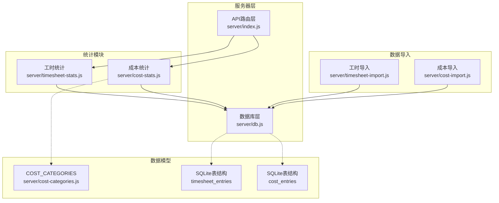
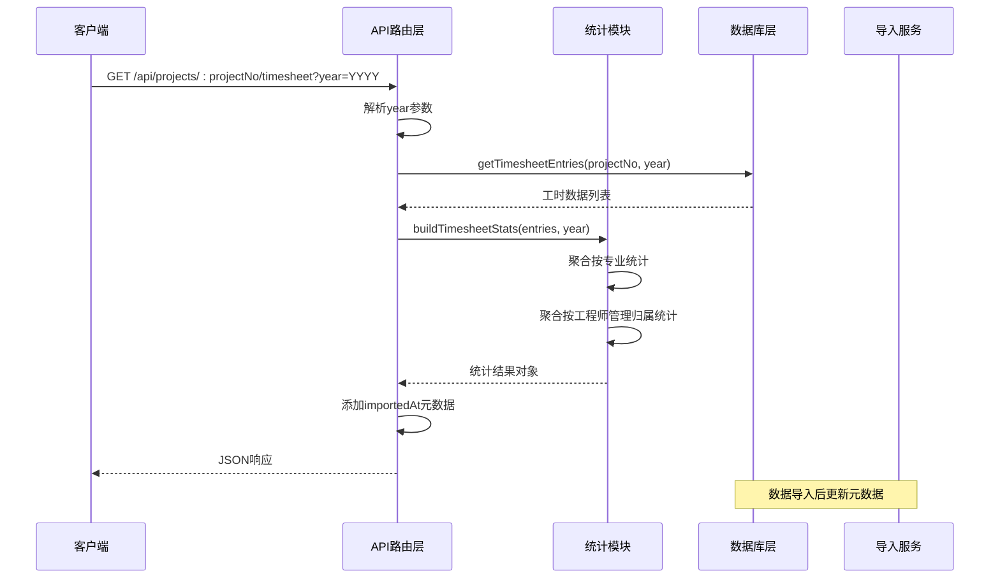
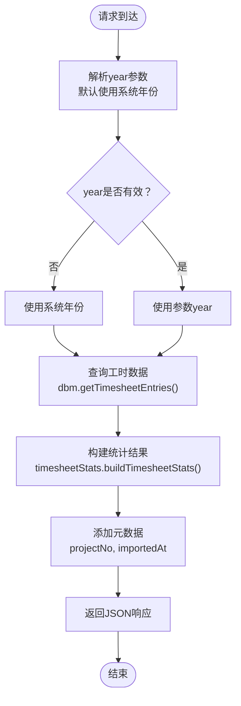
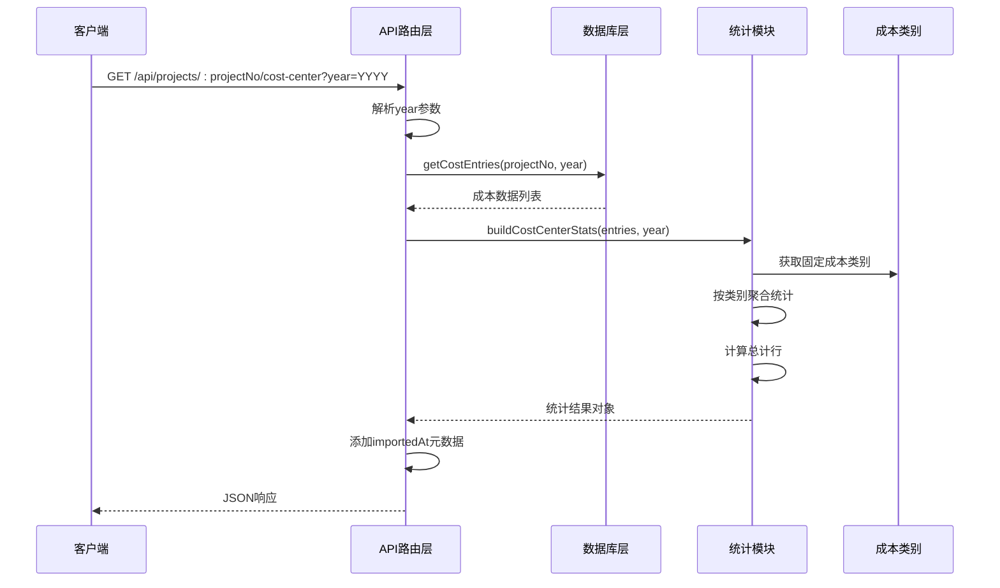
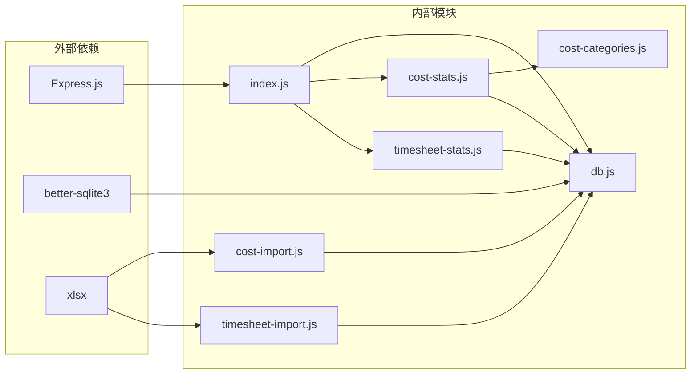

# 数据统计API

<cite>
**本文档引用的文件**
- [server/index.js](file://server/index.js)
- [server/timesheet-stats.js](file://server/timesheet-stats.js)
- [server/cost-stats.js](file://server/cost-stats.js)
- [server/db.js](file://server/db.js)
- [server/cost-categories.js](file://server/cost-categories.js)
- [server/timesheet-import.js](file://server/timesheet-import.js)
- [server/cost-import.js](file://server/cost-import.js)
</cite>

## 目录
1. [简介](#简介)
2. [项目结构](#项目结构)
3. [核心组件](#核心组件)
4. [架构概览](#架构概览)
5. [详细组件分析](#详细组件分析)
6. [依赖关系分析](#依赖关系分析)
7. [性能考虑](#性能考虑)
8. [故障排除指南](#故障排除指南)
9. [结论](#结论)

## 简介

本项目提供两个核心的数据统计API接口，用于查询项目相关的统计数据。这些接口基于SQLite数据库存储的工时数据和成本中心数据，为项目管理和财务分析提供实时的数据支持。

主要功能包括：
- 工时统计接口：按专业和工程师管理归属维度统计项目工时
- 成本中心统计接口：按固定成本类别统计项目成本数据

所有统计数据均支持按年份查询，默认使用系统配置的会计年度。

## 项目结构

项目采用模块化的服务器架构，统计API位于server目录下：

**图表来源**
- [server/index.js:140-168](file://server/index.js#L140-L168)
- [server/db.js:33-56](file://server/db.js#L33-L56)

**章节来源**
- [server/index.js:140-168](file://server/index.js#L140-L168)
- [server/db.js:33-56](file://server/db.js#L33-L56)

## 核心组件

### API路由层

系统提供了两个主要的统计API端点：

1. **工时统计接口**：`GET /api/projects/:projectNo/timesheet`
2. **成本中心统计接口**：`GET /api/projects/:projectNo/cost-center`

每个接口都支持可选的`year`查询参数，用于指定统计的会计年度。

### 统计模块

#### 工时统计模块
- 负责处理工时数据的聚合和统计
- 支持按专业和工程师管理归属两个维度的统计
- 提供详细的工时明细列表

#### 成本统计模块  
- 负责处理成本中心数据的聚合和统计
- 使用固定的成本类别定义
- 提供成本明细和分类汇总

**章节来源**
- [server/index.js:140-168](file://server/index.js#L140-L168)
- [server/timesheet-stats.js:60-80](file://server/timesheet-stats.js#L60-L80)
- [server/cost-stats.js:20-76](file://server/cost-stats.js#L20-L76)

## 架构概览

**图表来源**
- [server/index.js:140-153](file://server/index.js#L140-L153)
- [server/db.js:415-437](file://server/db.js#L415-L437)
- [server/timesheet-stats.js:60-80](file://server/timesheet-stats.js#L60-L80)

## 详细组件分析

### 工时统计接口

#### 接口定义
- **方法**：GET
- **路径**：`/api/projects/:projectNo/timesheet`
- **参数**：
  - `projectNo`：路径参数，项目编号
  - `year`：查询参数，会计年度（可选）

#### 请求处理流程

**图表来源**
- [server/index.js:140-153](file://server/index.js#L140-L153)
- [server/db.js:415-437](file://server/db.js#L415-L437)
- [server/timesheet-stats.js:60-80](file://server/timesheet-stats.js#L60-L80)

#### 数据结构说明

**响应对象结构**：
- `year`：统计年份
- `empty`：是否为空数据集
- `detailCount`：明细记录数量
- `byProfession`：按专业统计
- `bySector`：按工程师管理归属统计
- `details`：原始明细列表
- `projectNo`：项目编号（附加）
- `importedAt`：数据导入时间戳（附加）

**按专业统计结构**：
- `rows`：统计行数组（包含总计行）
- 每行包含：
  - `key`：专业名称
  - `months`：12个月的统计数据数组
  - `totalHours`：年度总工时
  - `totalCost`：年度总成本

**按工程师管理归属统计结构**：
- 结构与按专业统计相同，但按工程师管理归属维度分组

**明细数据结构**：
- `date`：工作日期
- `engineer`：工程师姓名
- `engineerSector`：工程师管理归属
- `profession`：专业
- `unitName`：单元名称
- `approvedHours`：已审工时
- `approvedCost`：已审成本
- `remark`：备注

#### 计算逻辑

1. **月份索引计算**：从工作日期提取月份索引（0-11）
2. **数据聚合**：按专业和工程师管理归属维度分别统计
3. **排序规则**：按总工时降序，再按名称升序
4. **总计行**：自动计算每列的合计值

**章节来源**
- [server/timesheet-stats.js:33-54](file://server/timesheet-stats.js#L33-L54)
- [server/timesheet-stats.js:60-80](file://server/timesheet-stats.js#L60-L80)

### 成本中心统计接口

#### 接口定义
- **方法**：GET  
- **路径**：`/api/projects/:projectNo/cost-center`
- **参数**：
  - `projectNo`：路径参数，项目编号
  - `year`：查询参数，会计年度（可选）

#### 请求处理流程

**图表来源**
- [server/index.js:155-168](file://server/index.js#L155-L168)
- [server/db.js:462-476](file://server/db.js#L462-L476)
- [server/cost-stats.js:20-76](file://server/cost-stats.js#L20-L76)

#### 数据结构说明

**响应对象结构**：
- `year`：统计年份
- `empty`：是否为空数据集
- `detailCount`：明细记录数量
- `categories`：成本类别数组
- `rows`：统计行数组（包含总计行）
- `details`：原始明细列表
- `projectNo`：项目编号（附加）
- `importedAt`：数据导入时间戳（附加）

**成本类别定义**：
- 差旅及报销
- 人力成本  
- 一般付款
- 涉外支付
- 设计服务分包
- 采购
- 施工分包
- 其他

**统计行结构**：
- `key`：类别名称或"总计"
- `months`：12个月的金额数组
- `totalAmount`：年度总金额
- `isTotal`：是否为总计行

**明细数据结构**：
- `costMonth`：成本月份（格式：YYYY-MM）
- `category`：成本类别
- `amount`：金额

#### 计算逻辑

1. **年份过滤**：根据成本月份筛选指定年份的数据
2. **类别映射**：确保所有固定成本类别都有对应的统计行
3. **月份索引**：从成本月份提取月份索引（0-11）
4. **数据验证**：过滤掉金额绝对值小于1e-9的无效数据
5. **排序规则**：按成本月份降序，再按类别名称升序

**章节来源**
- [server/cost-stats.js:20-76](file://server/cost-stats.js#L20-L76)
- [server/cost-categories.js:4-13](file://server/cost-categories.js#L4-L13)

### 数据来源和存储

#### 数据库表结构

**工时数据表（timesheet_entries）**：
- `id`：自增主键
- `project_no`：项目编号
- `work_date`：工作日期
- `profession`：专业
- `engineer_sector`：工程师管理归属
- `engineer`：工程师
- `unit_no`：单元号
- `unit_name`：单元名称
- `approved_hours`：已审工时
- `approved_cost`：已审成本
- `rate`：费率
- `remark`：备注

**成本数据表（cost_entries）**：
- `id`：自增主键
- `project_no`：项目编号
- `cost_month`：成本月份（YYYY-MM）
- `category`：成本类别
- `amount`：金额

#### 元数据管理

系统使用元数据表存储导入时间戳：
- `timesheetImportedAt`：工时数据导入时间
- `costImportedAt`：成本数据导入时间

**章节来源**
- [server/db.js:33-56](file://server/db.js#L33-L56)
- [server/db.js:482-488](file://server/db.js#L482-L488)

## 依赖关系分析

**图表来源**
- [server/index.js:5-19](file://server/index.js#L5-L19)
- [server/db.js:5](file://server/db.js#L5)
- [server/timesheet-import.js:5](file://server/timesheet-import.js#L5)
- [server/cost-import.js:5](file://server/cost-import.js#L5)

### 关键依赖关系

1. **API路由依赖**：`server/index.js`依赖统计模块和数据库模块
2. **统计模块依赖**：统计模块直接操作数据库，不依赖API层
3. **成本类别依赖**：成本统计模块依赖固定的成本类别定义
4. **导入服务依赖**：导入服务独立运行，不依赖API层

**章节来源**
- [server/index.js:140-168](file://server/index.js#L140-L168)
- [server/timesheet-stats.js:82-86](file://server/timesheet-stats.js#L82-L86)
- [server/cost-stats.js:78-81](file://server/cost-stats.js#L78-L81)

## 性能考虑

### 查询优化

1. **索引使用**：
   - 工时数据表：`(project_no, work_date)`复合索引
   - 成本数据表：`(project_no, cost_month)`复合索引

2. **查询范围限制**：
   - 使用`substr()`函数进行年份过滤，避免全表扫描
   - 按日期和ID排序确保稳定的查询顺序

3. **内存管理**：
   - 统计模块使用Map进行数据聚合，避免重复遍历
   - 分别处理不同维度的统计，减少内存占用

### 缓存机制

系统采用以下缓存策略：

1. **导入时间戳缓存**：通过元数据表存储最后导入时间
2. **统计结果缓存**：统计模块在内存中处理数据，避免重复计算
3. **配置缓存**：系统配置存储在内存中，减少数据库访问

### 性能建议

1. **批量查询**：对于大量项目查询，建议使用批量API调用
2. **合理使用year参数**：明确指定年份可以减少数据量
3. **监控导入状态**：定期检查`importedAt`字段确认数据新鲜度

## 故障排除指南

### 常见错误和解决方案

#### 1. 年份参数错误
**问题**：`year`参数不是有效数字
**解决方案**：API会自动回退到系统配置的会计年度

#### 2. 项目编号不存在
**问题**：指定的`projectNo`在数据库中不存在
**解决方案**：检查项目编号是否正确，确认项目已在系统中存在

#### 3. 数据导入时间戳缺失
**问题**：`importedAt`字段为空
**解决方案**：确认数据导入已完成，检查导入服务状态

#### 4. 统计结果为空
**问题**：返回的统计数据显示`empty: true`
**解决方案**：检查指定年份是否有对应的数据，确认数据导入成功

### 调试方法

1. **检查数据库连接**：确认SQLite数据库文件存在且可访问
2. **验证数据完整性**：检查相关表中是否存在预期的数据
3. **查看导入状态**：通过元数据表确认数据导入时间戳
4. **启用日志**：观察服务器控制台输出的错误信息

**章节来源**
- [server/index.js:140-168](file://server/index.js#L140-L168)
- [server/db.js:93-106](file://server/db.js#L93-L106)

## 结论

本项目的数据统计API提供了完整的企业级统计功能，具有以下特点：

1. **模块化设计**：统计逻辑独立于API路由，便于维护和扩展
2. **灵活的查询参数**：支持按年份精确查询，满足不同业务需求
3. **标准化的数据结构**：统一的响应格式便于前端处理
4. **完善的错误处理**：提供清晰的错误信息和回退机制
5. **高效的数据库设计**：合理的索引和查询策略保证性能

这些API为项目管理和财务分析提供了可靠的数据基础，支持日常的统计分析和决策制定需求。