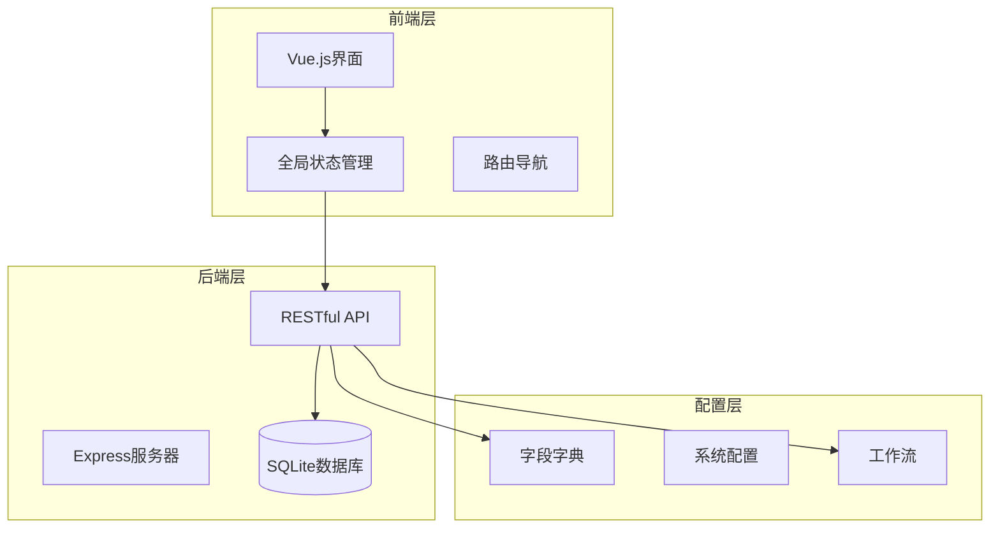
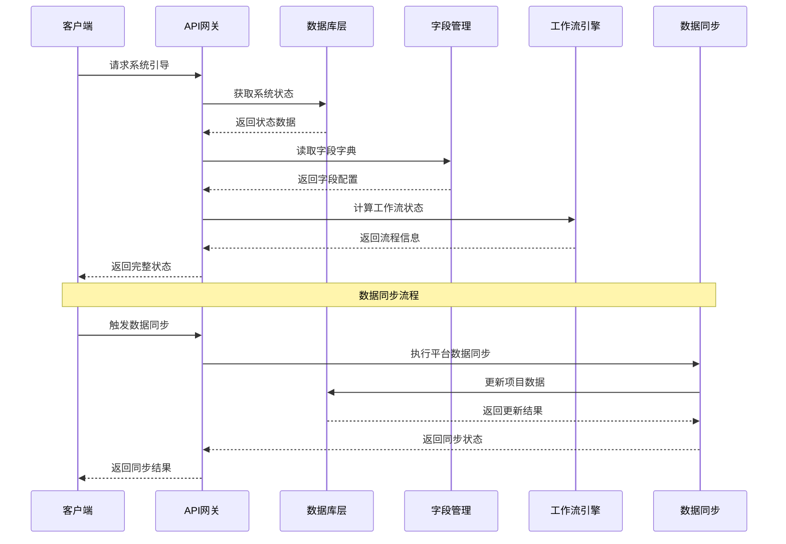
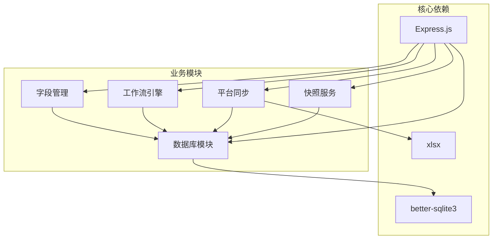

# 系统管理API

<cite>
**本文档引用的文件**
- [server/index.js](file://server/index.js)
- [server/db.js](file://server/db.js)
- [server/fields/dictionary.js](file://server/fields/dictionary.js)
- [server/platform-sync.js](file://server/platform-sync.js)
- [server/snapshot-service.js](file://server/snapshot-service.js)
- [server/sector-workflow.js](file://server/sector-workflow.js)
- [js/store.js](file://js/store.js)
- [js/field-config.js](file://js/field-config.js)
- [js/views/AdminSettings.js](file://js/views/AdminSettings.js)
- [js/components/SystemAdminApprovalBoard.js](file://js/components/SystemAdminApprovalBoard.js)
- [config/fields/fields.json](file://config/fields/fields.json)
- [package.json](file://package.json)
</cite>

## 目录
1. [简介](#简介)
2. [项目结构](#项目结构)
3. [核心组件](#核心组件)
4. [架构概览](#架构概览)
5. [详细组件分析](#详细组件分析)
6. [依赖关系分析](#依赖关系分析)
7. [性能考虑](#性能考虑)
8. [故障排除指南](#故障排除指南)
9. [结论](#结论)

## 简介

系统管理API是一个基于Express.js和SQLite的项目追踪管理系统，提供了完整的系统配置、用户管理、数据维护和工作流管理功能。该系统支持多角色权限控制、数据同步、快照管理、审批流程等功能，适用于项目执行追踪和管理场景。

## 项目结构

该项目采用前后端分离的架构设计，主要分为以下层次：



**图表来源**
- [server/index.js:1-775](file://server/index.js#L1-L775)
- [js/store.js:1-602](file://js/store.js#L1-L602)

**章节来源**
- [server/index.js:1-775](file://server/index.js#L1-L775)
- [package.json:1-19](file://package.json#L1-L19)

## 核心组件

系统管理API的核心组件包括：

### 1. 系统引导组件
- **系统引导接口**：提供系统启动时的完整状态信息
- **字段字典管理**：管理83列字段配置
- **元数据管理**：配置系统运行参数

### 2. 用户管理组件
- **用户权限管理**：支持多种角色权限控制
- **板块管理员配置**：管理各板块的管理员设置
- **权限验证机制**：基于角色的访问控制

### 3. 数据维护组件
- **项目数据管理**：支持项目数据的增删改查
- **快照管理**：支持导入、草稿、最终版本快照
- **数据同步**：与工程平台的数据同步

### 4. 工作流管理组件
- **审批流程**：支持多级审批流程
- **状态管理**：管理系统的审批状态
- **流程控制**：控制工作流的推进和回退

**章节来源**
- [server/db.js:194-266](file://server/db.js#L194-L266)
- [server/sector-workflow.js:1-273](file://server/sector-workflow.js#L1-L273)

## 架构概览

系统采用模块化的架构设计，各个组件之间通过清晰的接口进行交互：



**图表来源**
- [server/index.js:91-100](file://server/index.js#L91-L100)
- [server/platform-sync.js:214-262](file://server/platform-sync.js#L214-L262)

**章节来源**
- [server/index.js:88-100](file://server/index.js#L88-L100)
- [server/platform-sync.js:1-272](file://server/platform-sync.js#L1-L272)

## 详细组件分析

### 系统引导接口（GET /api/bootstrap）

系统引导接口是整个系统的核心入口，负责提供系统启动时的完整状态信息。

#### 接口定义
- **方法**：GET
- **路径**：/api/bootstrap
- **权限**：公开访问

#### 功能特性
- 获取完整的系统状态信息
- 包含项目数据、审计日志、快照信息
- 返回工作流状态和配置参数
- 提供字段字典信息

#### 响应数据结构
```javascript
{
  "projects": [],           // 项目数据数组
  "auditLog": [],          // 审计日志
  "snapshots": {},         // 快照信息
  "periodConfig": {},      // 周期配置
  "reportingMonth": "",    // 报告月份
  "approvalStatus": "",    // 审批状态
  "lockStatus": "",        // 锁定状态
  "financeReviewReminder": false, // 财务审查提醒
  "reportingSubmitted": false, // 提交状态
  "pmSubmissions": {},     // PM提交状态
  "sectorFlows": {},       // 板块流程
  "sectorRegistry": [],    // 板块注册表
  "fieldDictionary": []    // 字段字典
}
```

**章节来源**
- [server/index.js:91-100](file://server/index.js#L91-L100)
- [server/db.js:194-266](file://server/db.js#L194-L266)

### 字段字典接口

字段字典接口提供83列字段的管理功能，支持只读查询和管理员写入。

#### GET /api/fields
- **功能**：获取字段字典的只读副本
- **响应**：包含字段数组和数量信息

#### PUT /api/admin/fields *(系统管理员)*
- **功能**：更新字段字典配置
- **权限**：系统管理员
- **参数**：字段数组
- **验证**：确保字段配置的有效性

#### 字段配置验证规则
- 字段必须为非空数组
- 每个字段必须包含 `col` 和 `name_cn`
- 列号必须唯一且为大写字母
- `source_type` 必须为有效的类型

**章节来源**
- [server/index.js:102-110](file://server/index.js#L102-L110)
- [server/index.js:714-741](file://server/index.js#L714-L741)
- [server/fields/dictionary.js:20-41](file://server/fields/dictionary.js#L20-L41)

### 元数据管理（PATCH /api/meta）

元数据管理接口提供系统配置参数的动态修改功能。

#### 支持的配置参数
- **periodConfig**：周期配置（提醒日、锁定日、解锁日等）
- **reportingMonth**：报告月份
- **approvalStatus**：审批状态
- **lockStatus**：锁定状态
- **reportingSubmitted**：提交状态

#### 状态转换规则
- 修改周期配置时自动重置锁定状态
- 锁定状态受周期配置影响
- 审批状态与锁定状态相互关联

**章节来源**
- [server/index.js:198-218](file://server/index.js#L198-L218)
- [server/db.js:121-142](file://server/db.js#L121-L142)

### PM提交接口（POST /api/pm-submissions/submit）

PM提交接口处理项目经理的项目数据提交流程。

#### 提交流程
1. 验证PM所属板块是否已提交审批
2. 检查本月是否已提交
3. 创建提交记录
4. 写入审计日志

#### 参数要求
- `pmName`：项目经理姓名（必填）
- `reportingMonth`：报告月份（必填）
- `userName`：提交人姓名（可选）

#### 状态管理
- 提交后锁定PM的编辑权限
- 更新PM提交状态
- 记录提交时间和项目数量

**章节来源**
- [server/index.js:230-285](file://server/index.js#L230-L285)

### 审批流程管理

系统支持多级审批流程，包括板块审批和公司归档。

#### 板块审批接口
- **POST /api/sectors/:code/submit-approval**：提交板块审批
- **POST /api/sectors/:code/advance-approval**：推进审批流程
- **POST /api/sectors/:code/reject-approval**：驳回审批

#### 公司归档接口
- **POST /api/company/archive**：执行公司归档

#### 流程状态
- `draft`：草稿状态
- `approve1`：一级审批
- `approve2`：二级审批
- `final`：最终归档

**章节来源**
- [server/index.js:302-446](file://server/index.js#L302-L446)
- [server/sector-workflow.js:50-273](file://server/sector-workflow.js#L50-L273)

### 数据同步接口

系统提供与工程平台的数据同步功能。

#### 手动同步接口
- **POST /api/editor/refresh-data**：刷新编辑器数据
- **POST /api/admin/sync-platform-data**：同步平台数据

#### 自动同步机制
- 定时任务在指定时间自动执行
- 支持手动触发
- 同步完成后更新系统状态

#### 同步内容
- 工程平台引用数据
- 项目状态更新
- 快照版本管理

**章节来源**
- [server/index.js:580-625](file://server/index.js#L580-L625)
- [server/platform-sync.js:214-262](file://server/platform-sync.js#L214-L262)

### 管理员功能接口

管理员接口提供系统级别的管理功能。

#### 系统重置
- **POST /api/admin/reseed**：从初始Excel重新导入数据
- **POST /api/admin/reset-dev**：重置开发环境

#### 数据导入
- **POST /api/admin/timesheet-import**：导入工时数据
- **POST /api/admin/cost-import**：导入成本数据

#### 用户管理
- **GET /api/admin/users**：获取用户配置
- **PATCH /api/admin/users**：更新用户配置

**章节来源**
- [server/index.js:492-578](file://server/index.js#L492-L578)
- [server/index.js:647-702](file://server/index.js#L647-L702)

## 依赖关系分析

系统各组件之间的依赖关系如下：



**图表来源**
- [package.json:13-17](file://package.json#L13-L17)
- [server/index.js:1-25](file://server/index.js#L1-L25)

**章节来源**
- [package.json:1-19](file://package.json#L1-L19)
- [server/index.js:1-25](file://server/index.js#L1-L25)

## 性能考虑

### 数据库优化
- 使用SQLite作为轻量级数据库，适合中小型项目
- 采用WAL模式提高并发性能
- 合理的索引设计优化查询性能

### 缓存策略
- 前端使用Vuex进行状态缓存
- 字段字典缓存在内存中
- 最近使用的快照进行缓存

### API性能
- 批量操作减少网络往返
- 分页查询避免大数据量传输
- 合理的错误处理减少重试

## 故障排除指南

### 常见问题及解决方案

#### 1. 系统启动失败
**症状**：应用无法启动
**可能原因**：
- 数据库文件损坏
- 字段字典配置错误
- 端口被占用

**解决方法**：
- 检查数据库文件完整性
- 验证字段字典JSON格式
- 更换端口号

#### 2. 权限访问错误
**症状**：403权限错误
**可能原因**：
- 用户角色不正确
- 权限配置错误
- 会话过期

**解决方法**：
- 检查用户角色配置
- 验证权限矩阵
- 重新登录系统

#### 3. 数据同步失败
**症状**：平台数据不同步
**可能原因**：
- 平台API不可用
- 网络连接问题
- 配置参数错误

**解决方法**：
- 检查平台API配置
- 验证网络连接
- 重新配置同步参数

**章节来源**
- [js/store.js:66-93](file://js/store.js#L66-L93)
- [server/index.js:745-775](file://server/index.js#L745-L775)

## 结论

系统管理API提供了一个功能完整、架构清晰的项目追踪管理系统。通过模块化的组件设计和严格的权限控制，系统能够满足不同角色的使用需求。主要特点包括：

1. **完整的功能覆盖**：从系统配置到数据管理，从用户管理到工作流控制
2. **灵活的权限模型**：支持多角色权限控制和细粒度的字段级权限
3. **强大的数据管理**：支持快照管理、数据同步和批量操作
4. **良好的扩展性**：模块化设计便于功能扩展和维护

该系统适用于需要项目执行追踪和管理的企业环境，能够有效提升项目管理效率和透明度。