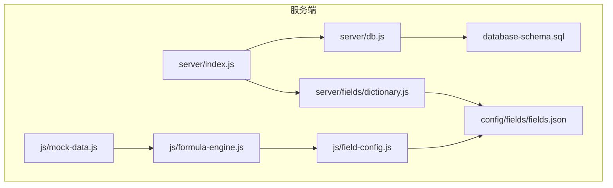
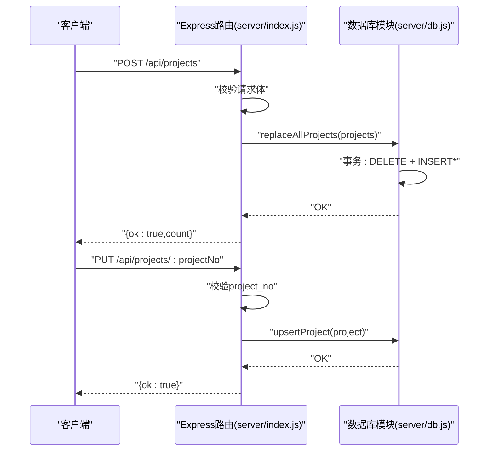
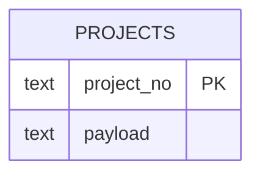
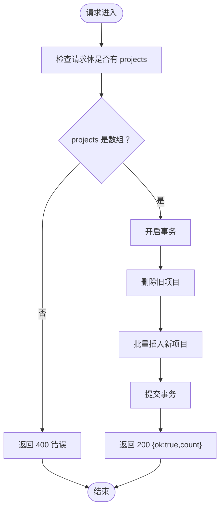
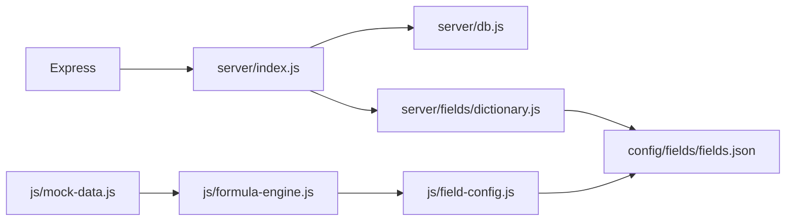

# 项目管理API

<cite>
**本文引用的文件**
- [server/index.js](file://server/index.js)
- [server/db.js](file://server/db.js)
- [server/fields/dictionary.js](file://server/fields/dictionary.js)
- [config/fields/fields.json](file://config/fields/fields.json)
- [database-schema.sql](file://database-schema.sql)
- [js/field-config.js](file://js/field-config.js)
- [js/formula-engine.js](file://js/formula-engine.js)
- [js/mock-data.js](file://js/mock-data.js)
- [package.json](file://package.json)
</cite>

## 目录
1. [简介](#简介)
2. [项目结构](#项目结构)
3. [核心组件](#核心组件)
4. [架构总览](#架构总览)
5. [详细组件分析](#详细组件分析)
6. [依赖关系分析](#依赖关系分析)
7. [性能考量](#性能考量)
8. [故障排查指南](#故障排查指南)
9. [结论](#结论)
10. [附录](#附录)

## 简介
本项目管理API基于Express + SQLite，提供项目数据的CRUD能力，重点围绕以下接口：
- 获取项目列表：GET /api/projects
- 批量替换项目：POST /api/projects
- 单个更新项目：PUT /api/projects/:projectNo

同时，系统内置字段字典、公式计算引擎、权限控制与审计日志，确保数据一致性与可追溯性。本文将详细说明接口定义、请求/响应格式、错误码、数据模型、字段约束、业务规则、事务处理与错误处理策略，并提供常见使用场景与示例。

## 项目结构
后端采用模块化组织：
- server/index.js：HTTP路由与业务入口
- server/db.js：数据库访问与事务封装
- server/fields/dictionary.js：字段字典读写
- config/fields/fields.json：字段元数据
- database-schema.sql：数据库表结构
- js/field-config.js：字段权限与列映射
- js/formula-engine.js：项目字段计算
- js/mock-data.js：示例项目数据
- package.json：依赖与脚本

图表来源
- [server/index.js:1-775](file://server/index.js#L1-L775)
- [server/db.js:1-525](file://server/db.js#L1-L525)
- [server/fields/dictionary.js:1-70](file://server/fields/dictionary.js#L1-L70)
- [config/fields/fields.json:1-1101](file://config/fields/fields.json#L1-L1101)
- [database-schema.sql:1-286](file://database-schema.sql#L1-L286)
- [js/field-config.js:1-262](file://js/field-config.js#L1-L262)
- [js/formula-engine.js:1-105](file://js/formula-engine.js#L1-L105)
- [js/mock-data.js:1-748](file://js/mock-data.js#L1-L748)

章节来源
- [server/index.js:1-775](file://server/index.js#L1-L775)
- [server/db.js:1-525](file://server/db.js#L1-L525)
- [package.json:1-19](file://package.json#L1-L19)

## 核心组件
- 项目数据模型：以JSON形式存储在projects表的payload字段中，主键为project_no
- 字段字典：定义列号、数据类型、来源类型、枚举值等
- 权限控制：基于角色与报告月的字段可编辑性
- 公式计算：根据月度完成/开票/回款等输入，计算派生字段
- 事务处理：批量替换使用SQLite事务保证原子性

章节来源
- [server/db.js:16-57](file://server/db.js#L16-L57)
- [server/db.js:268-283](file://server/db.js#L268-L283)
- [server/fields/dictionary.js:11-60](file://server/fields/dictionary.js#L11-L60)
- [js/field-config.js:104-122](file://js/field-config.js#L104-L122)
- [js/formula-engine.js:19-83](file://js/formula-engine.js#L19-L83)

## 架构总览
项目管理API的请求处理流程如下：
- 客户端发送HTTP请求到Express路由
- 路由函数解析请求体/路径参数
- 调用数据库模块执行CRUD操作（事务/单条插入/替换）
- 返回标准化JSON响应或错误信息

图表来源
- [server/index.js:112-138](file://server/index.js#L112-L138)
- [server/db.js:268-283](file://server/db.js#L268-L283)

## 详细组件分析

### 项目数据模型与字段约束
- 主键：project_no（字符串）
- 存储：JSON字符串payload，包含所有字段
- 字段来源类型：
  - system_sync：来自工程平台同步（只读）
  - manual_input：项目经理手工填报
  - auto_calc：由公式引擎计算得出
- 字段字典来源于config/fields/fields.json，包含列号、中文名、数据类型、来源类型、枚举值等

图表来源
- [server/db.js:16-20](file://server/db.js#L16-L20)
- [database-schema.sql:12-87](file://database-schema.sql#L12-L87)

章节来源
- [server/db.js:16-57](file://server/db.js#L16-L57)
- [config/fields/fields.json:1-1101](file://config/fields/fields.json#L1-L1101)
- [database-schema.sql:12-87](file://database-schema.sql#L12-L87)

### 字段字典与权限控制
- 字段字典读写：读取/写入fields.json，并同步到前端资源
- 权限规则：
  - auto_calc/system_sync：只读
  - system_sync：工程平台引用列，除system_admin外只读
  - manual_input：按角色与报告月决定可编辑范围
  - 月度完成（AV–BG）：报告月当月及之后可写
  - 月度开票/回款（BH–CE）：仅报告月之后可写
  - 高管/总监/群主：只读
  - system_admin：在锁定期也可写（除特定字段）

章节来源
- [server/fields/dictionary.js:11-60](file://server/fields/dictionary.js#L11-L60)
- [js/field-config.js:104-122](file://js/field-config.js#L104-L122)
- [js/field-config.js:196-240](file://js/field-config.js#L196-L240)

### 公式计算引擎
- 输入：原始项目对象 + 报告月索引（0=1月，4=5月）
- 输出：补算所有派生字段的新对象
- 关键计算：
  - 合同额：P=N+O；不含税：Q=P/(1+Y)
  - 年度完成：X=SUM(1月..当月)，W=当月完成，Z=X/(1+Y)
  - 始累完成：U=T+X，V=N−T
  - 开票/回款：AB=SUM开票，AC=AA+AB，AE=SUM回款，AF=AD+AE
  - 合同差值：R=P−AC，S=P−U
  - WIP/应收：AG=U−AC，AH=AG/(1+Y)，AI=AC−AF
  - 催收/催开票：AJ=MAX(AI,0)，AK=MAX(AA−AD,0)，AL=MAX(AG,0)
  - 期初WIP：AP=MAX(T−AA,0)
  - 3个月以上WIP：AQ=MAX(AG−最近3月产值,0)

章节来源
- [js/formula-engine.js:19-83](file://js/formula-engine.js#L19-L83)

### 接口定义与行为

#### GET /api/projects
- 功能：获取所有项目数据
- 方法：GET
- 路径参数：无
- 查询参数：无
- 请求体：无
- 响应：
  - 200：返回项目数组
  - 500：服务器内部错误
- 业务规则：
  - 项目数据来自数据库projects表payload字段
  - 未做分页，一次性返回全部

章节来源
- [server/index.js:220-227](file://server/index.js#L220-L227)
- [server/db.js:209-210](file://server/db.js#L209-L210)

#### POST /api/projects
- 功能：批量替换项目数据（全量替换）
- 方法：POST
- 路径参数：无
- 查询参数：无
- 请求体：{ projects: Project[] }
- 响应：
  - 200：{ ok: true, count: number }
  - 400：{ error: string }（projects不是数组）
  - 500：{ error: string }
- 事务处理：
  - 使用SQLite事务：先删除再批量插入
  - 原子性：要么全部成功，要么全部失败
- 错误处理：
  - 参数校验失败返回400
  - 服务器异常返回500

图表来源
- [server/index.js:112-124](file://server/index.js#L112-L124)
- [server/db.js:268-278](file://server/db.js#L268-L278)

章节来源
- [server/index.js:112-124](file://server/index.js#L112-L124)
- [server/db.js:268-278](file://server/db.js#L268-L278)

#### PUT /api/projects/:projectNo
- 功能：单个更新项目
- 方法：PUT
- 路径参数：projectNo（字符串）
- 查询参数：无
- 请求体：Project（必须包含project_no且与路径一致）
- 响应：
  - 200：{ ok: true }
  - 400：{ error: string }（project_no不匹配）
  - 500：{ error: string }
- 业务规则：
  - 使用INSERT OR REPLACE，按主键project_no更新
  - 更新payload为新的JSON

章节来源
- [server/index.js:126-138](file://server/index.js#L126-L138)
- [server/db.js:280-283](file://server/db.js#L280-L283)

### 数据验证机制
- 请求体验证：
  - POST /api/projects：校验projects为数组
  - PUT /api/projects/:projectNo：校验project_no与路径一致
- 字段字典验证：
  - 写入字段字典时校验字段数组有效性、列号唯一性、来源类型合法性
- 前端编辑校验（补充说明）：
  - 月度完成额编辑时仅校验数值格式；合同差值约束在提交时校验

章节来源
- [server/index.js:115-130](file://server/index.js#L115-L130)
- [server/fields/dictionary.js:20-41](file://server/fields/dictionary.js#L20-L41)

### 批量操作的事务处理
- 批量替换使用db.replaceAllProjects：
  - 删除旧数据（DELETE）
  - 批量插入新数据（INSERT*）
  - 事务包裹，保证原子性
- 单个更新使用db.upsertProject：
  - INSERT OR REPLACE，按主键更新

章节来源
- [server/db.js:268-278](file://server/db.js#L268-L278)
- [server/db.js:280-283](file://server/db.js#L280-L283)

### 错误处理策略
- 400：请求体格式错误（如projects非数组、project_no不匹配）
- 500：服务器内部错误（数据库异常、文件读写异常等）
- 404：快照查询不存在时返回（与项目管理API相关接口无关，但体现错误处理风格）

章节来源
- [server/index.js:115-123](file://server/index.js#L115-L123)
- [server/index.js:129-137](file://server/index.js#L129-L137)

### 常见使用场景与示例

- 场景1：首次导入项目数据
  - 使用POST /api/projects传入项目数组，完成全量替换
  - 响应：{ ok: true, count: N }

- 场景2：更新单个项目
  - 使用PUT /api/projects/:projectNo，请求体包含完整项目对象
  - 响应：{ ok: true }

- 场景3：获取项目列表
  - 使用GET /api/projects
  - 响应：项目数组（未分页）

- 示例数据参考：
  - js/mock-data.js提供20条示例项目，可用于测试与集成

章节来源
- [js/mock-data.js:16-736](file://js/mock-data.js#L16-L736)

## 依赖关系分析
- 依赖组件：
  - Express：HTTP框架
  - better-sqlite3：SQLite驱动
  - xlsx：Excel导入工具
- 模块耦合：
  - server/index.js依赖server/db.js与server/fields/dictionary.js
  - js/field-config.js依赖config/fields/fields.json
  - js/formula-engine.js依赖js/field-config.js

图表来源
- [package.json:13-17](file://package.json#L13-L17)
- [server/index.js:1-25](file://server/index.js#L1-L25)
- [server/db.js:1-10](file://server/db.js#L1-L10)
- [server/fields/dictionary.js:1-10](file://server/fields/dictionary.js#L1-L10)

章节来源
- [package.json:1-19](file://package.json#L1-L19)

## 性能考量
- 数据库事务：批量替换使用事务，减少多次写入开销
- 索引：projects表按project_no主键存储，适合按主键更新
- 前端渲染：GET /api/projects返回全部项目，建议在前端做分页或虚拟滚动
- 公式计算：批量计算在前端FormulaEngine中进行，避免后端重复计算

## 故障排查指南
- 400错误（请求体不合法）
  - POST /api/projects：确认请求体包含projects且为数组
  - PUT /api/projects/:projectNo：确认请求体project_no与路径一致
- 500错误（服务器异常）
  - 检查数据库连接与权限
  - 检查字段字典文件读写权限
- 数据不一致
  - 批量替换后确认事务是否提交
  - 检查字段字典是否正确同步

章节来源
- [server/index.js:115-137](file://server/index.js#L115-L137)
- [server/db.js:268-283](file://server/db.js#L268-L283)

## 结论
本项目管理API提供了简洁明确的CRUD接口，结合字段字典、权限控制与公式计算，能够支撑项目数据的全生命周期管理。批量替换接口通过事务保证原子性，单个更新接口支持按主键精确更新。建议在生产环境中配合前端分页与缓存策略，提升用户体验与系统性能。

## 附录

### 字段字典结构说明
- 字段数组：每项包含列号、中文名、英文名、数据类型、来源类型、枚举值等
- 校验规则：列号唯一、来源类型合法、必填字段齐全

章节来源
- [server/fields/dictionary.js:20-41](file://server/fields/dictionary.js#L20-L41)
- [config/fields/fields.json:1-1101](file://config/fields/fields.json#L1-L1101)

### 权限矩阵摘要
- auto_calc/system_sync：只读
- system_sync：工程平台引用列，除system_admin外只读
- manual_input：
  - 月度完成（AV–BG）：报告月当月及之后可写
  - 月度开票/回款（BH–CE）：仅报告月之后可写
  - 其他手工列：按角色与lockStatus决定
- system_admin：在锁定期也可写（除特定字段）
- 高管/总监/群主：只读

章节来源
- [js/field-config.js:104-122](file://js/field-config.js#L104-L122)