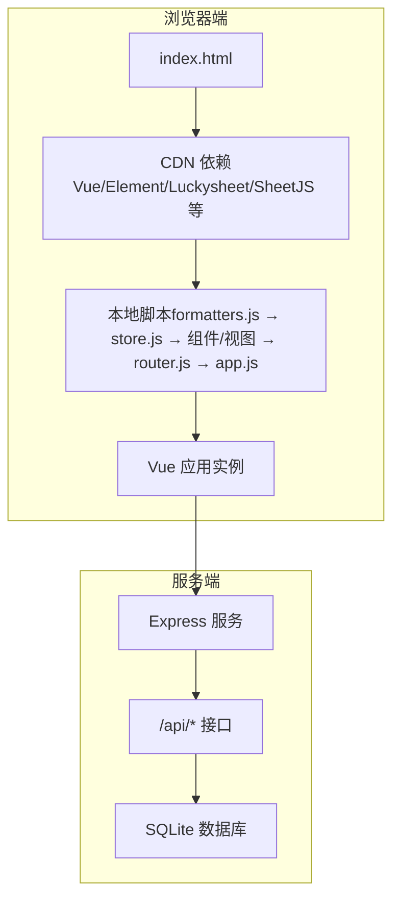
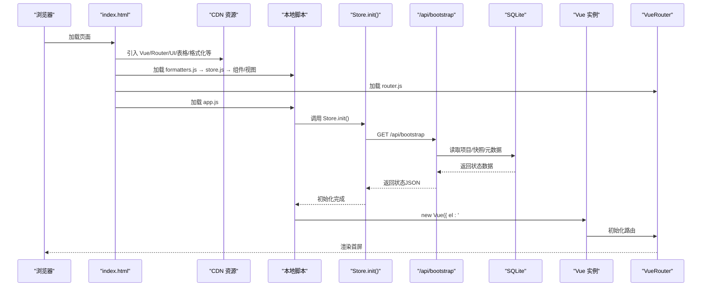
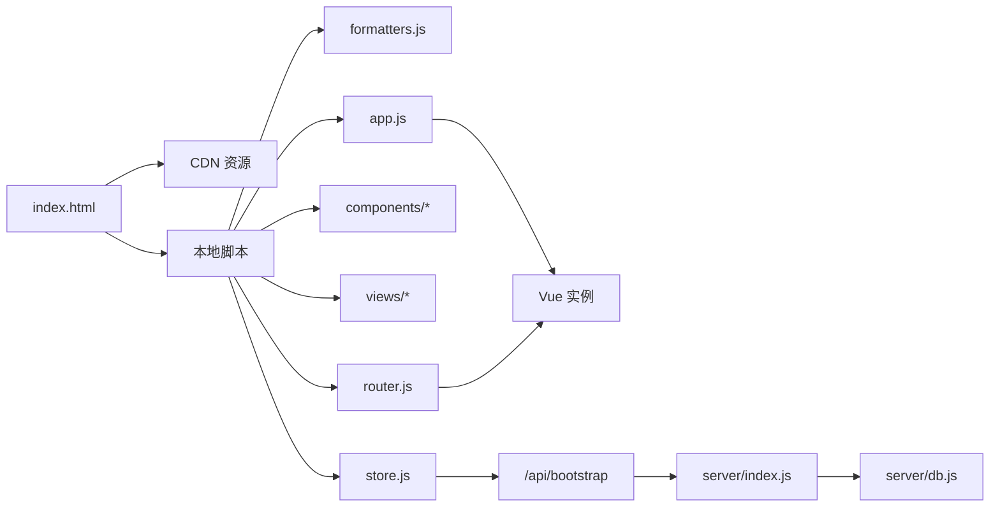

# Vue应用初始化

<cite>
**本文档引用的文件**
- [index.html](file://index.html)
- [app.js](file://js/app.js)
- [router.js](file://js/router.js)
- [store.js](file://js/store.js)
- [formatters.js](file://js/formatters.js)
- [AppLayout.js](file://js/components/AppLayout.js)
- [Login.js](file://js/views/Login.js)
- [package.json](file://package.json)
- [db.js](file://server/db.js)
- [index.js](file://server/index.js)
- [platform-sync.js](file://server/platform-sync.js)
- [fields.json](file://config/fields/fields.json)
</cite>

## 目录
1. [简介](#简介)
2. [项目结构](#项目结构)
3. [核心组件](#核心组件)
4. [架构总览](#架构总览)
5. [详细组件分析](#详细组件分析)
6. [依赖关系分析](#依赖关系分析)
7. [性能考量](#性能考量)
8. [故障排查指南](#故障排查指南)
9. [结论](#结论)
10. [附录](#附录)

## 简介
本文件面向“项目执行追踪平台”的前端初始化流程，系统性阐述从HTML模板到Vue应用启动、组件注册、过滤器配置、路由导航守卫、状态管理、SQLite数据同步与降级处理的完整链路。文档同时给出运行环境要求、CDN依赖引入方式、调试方法以及常见初始化问题的解决方案，帮助开发者快速定位与解决问题。

## 项目结构
应用采用前后端分离架构：
- 前端：单页应用（SPA），通过index.html加载CDN依赖与本地脚本，最终在DOM中挂载Vue实例。
- 后端：基于Express + better-sqlite3，提供REST API，负责SQLite数据库初始化、业务数据读写与定时同步。

图表来源
- [index.html:47-107](file://index.html#L47-L107)
- [app.js:22-44](file://js/app.js#L22-L44)
- [store.js:268-275](file://js/store.js#L268-L275)
- [index.js:88-100](file://server/index.js#L88-L100)

章节来源
- [index.html:1-110](file://index.html#L1-L110)
- [package.json:1-19](file://package.json#L1-L19)

## 核心组件
- HTML模板与CDN依赖：index.html定义了基础样式与脚本加载顺序，确保Vue、路由、UI库、表格库与数据层脚本按序加载。
- Vue实例与挂载：app.js在初始化阶段先注册全局组件与过滤器，再调用Store.init()拉取后端状态，最后挂载到#app。
- 路由与导航守卫：router.js定义路由表与权限控制，支持公开页面、认证页面与受控页面的分流。
- 全局状态管理：store.js封装了API请求、状态计算、字段字典加载与SQLite同步元数据管理。
- 格式化工具：formatters.js提供金额、百分比、日期等格式化能力，供过滤器与组件使用。
- 主布局与登录视图：AppLayout.js与Login.js分别提供主界面骨架与登录流程。

章节来源
- [app.js:7-28](file://js/app.js#L7-L28)
- [router.js:12-69](file://js/router.js#L12-L69)
- [store.js:97-128](file://js/store.js#L97-L128)
- [formatters.js:8-165](file://js/formatters.js#L8-L165)
- [AppLayout.js:31-238](file://js/components/AppLayout.js#L31-L238)
- [Login.js:52-129](file://js/views/Login.js#L52-L129)

## 架构总览
应用启动的关键时序如下：

图表来源
- [index.html:70-107](file://index.html#L70-L107)
- [app.js:30-32](file://js/app.js#L30-L32)
- [store.js:268-275](file://js/store.js#L268-L275)
- [index.js:91-100](file://server/index.js#L91-L100)

## 详细组件分析

### HTML模板与CDN依赖
- 模板结构：在<body>中预留#app挂载点，随后按顺序引入Tailwind、Element UI、Luckysheet、SheetJS等CDN资源，再加载本地数据层脚本、组件与视图，最后加载router.js与app.js。
- 依赖顺序：数据层脚本（formatters.js → store.js → 各模块）必须在组件/视图之前加载，以保证全局过滤器与Store可用；路由与应用初始化脚本位于最后，确保路由表与Vue实例在所有组件注册之后创建。
- 运行环境：index.html明确使用CDN引入Vue 2与相关生态，需在可访问外网的环境中运行；静态资源通过本地路径加载。

章节来源
- [index.html:47-107](file://index.html#L47-L107)

### Vue实例创建与组件注册
- 组件注册：app.js在立即执行函数中注册全局组件（如app-layout），确保后续路由视图可直接使用。
- 过滤器配置：注册金额、金额短格式、百分比、日期等过滤器，均委托给Formatters工具集。
- 挂载策略：先执行Store.init()，成功后再挂载Vue实例；若初始化失败，则在#app内渲染降级提示，避免白屏。

章节来源
- [app.js:7-28](file://js/app.js#L7-L28)
- [formatters.js:8-165](file://js/formatters.js#L8-L165)

### 路由与导航守卫
- 路由表：包含登录页（公开）、主布局（含子路由：编辑器、审批、审计、字段配置、管理设置）与兜底重定向。
- 导航守卫：区分公开页面与需要认证的页面；校验用户角色与权限，限制访问范围；支持按角色重定向至首页。
- 路由模式：采用hash模式，便于静态部署与本地开发。

章节来源
- [router.js:12-69](file://js/router.js#L12-L69)
- [router.js:84-132](file://js/router.js#L84-L132)

### 全局状态管理与SQLite同步
- Store.init()：调用/api/bootstrap获取初始状态，包括项目列表、快照、审批状态、锁定期、财务提醒、字段字典等；随后确保字段字典加载成功。
- 字段字典加载策略：优先尝试/api/fields或/api/admin/fields，其次读取静态config/fields/fields.json，最后回退到动态加载config/fields/fields-data.js。
- SQLite初始化：服务端启动时自动创建SQLite数据库与表结构，若检测到空库则尝试从根目录的“初始数据.xlsx”导入项目数据，并生成演示快照与开发种子。

章节来源
- [store.js:268-275](file://js/store.js#L268-L275)
- [store.js:186-235](file://js/store.js#L186-L235)
- [index.js:30-65](file://server/index.js#L30-L65)
- [db.js:16-57](file://server/db.js#L16-L57)

### 应用挂载机制与错误处理
- 挂载流程：mountVue()创建Vue实例，绑定router与#app挂载点，使用<router-view>渲染当前路由组件。
- 错误处理：Store.init()失败时，app.js捕获异常并在#app内渲染降级提示，包含错误信息与引导步骤（安装依赖、启动服务、放置初始数据等）。
- 降级提示内容：包含错误消息、建议命令（npm install、npm start）、服务地址与初始数据放置指引。

章节来源
- [app.js:22-44](file://js/app.js#L22-L44)

### 异步初始化流程与SQLite同步状态检查
- 异步初始化：Store.init()返回Promise，内部先拉取/api/bootstrap，再加载字段字典；若字段字典为空则抛错，触发降级。
- SQLite同步状态：服务端在启动时检查systemDataSyncedAt与systemDataSyncMeta，记录平台数据同步时间与元信息；支持手动刷新与定时同步。
- 平台数据同步：platform-sync.js合并工程平台数据到本地项目，更新_system_ref与显示字段，支持按报告月索引的月度发票/回款数据。

章节来源
- [store.js:268-275](file://js/store.js#L268-L275)
- [index.js:580-604](file://server/index.js#L580-L604)
- [platform-sync.js:214-262](file://server/platform-sync.js#L214-L262)

### HTML模板结构与运行环境要求
- 模板结构：#app为根容器；CDN引入Vue 2与相关UI/表格库；本地脚本按顺序加载，确保依赖满足。
- 运行环境：需可访问外网以加载CDN资源；服务端需运行Node.js与Express，数据库文件位于/data/ptrack.sqlite；初始数据.xlsx需放置于项目根目录以完成首次导入。

章节来源
- [index.html:47-107](file://index.html#L47-L107)
- [package.json:6-17](file://package.json#L6-L17)
- [db.js:8-9](file://server/db.js#L8-L9)

## 依赖关系分析

图表来源
- [index.html:70-107](file://index.html#L70-L107)
- [app.js:22-28](file://js/app.js#L22-L28)
- [router.js:71-75](file://js/router.js#L71-L75)
- [store.js:268-275](file://js/store.js#L268-L275)
- [index.js:91-100](file://server/index.js#L91-L100)

章节来源
- [index.html:70-107](file://index.html#L70-L107)
- [app.js:22-28](file://js/app.js#L22-L28)
- [router.js:71-75](file://js/router.js#L71-L75)
- [store.js:268-275](file://js/store.js#L268-L275)
- [index.js:91-100](file://server/index.js#L91-L100)

## 性能考量
- 脚本加载顺序：确保数据层脚本在组件/视图之前加载，减少运行时依赖查找成本。
- 路由懒加载：可在大型应用中考虑按路由拆分打包，降低首屏体积（当前项目为单页直连CDN，未采用懒加载）。
- SQLite查询优化：服务端对timesheet_entries与cost_entries建立索引，提升按项目与月份的查询性能。
- 格式化工具：集中于formatters.js，避免重复计算，提高渲染效率。

## 故障排查指南
- 初始化失败降级提示
  - 现象：页面显示“无法加载数据”，包含错误信息与引导步骤。
  - 处理：检查服务端是否启动（npm start）、是否放置初始数据.xlsx、是否正确访问http://127.0.0.1:3000/。
  - 参考：app.js在Store.init()失败时的降级分支。
  
  章节来源
  - [app.js:32-44](file://js/app.js#L32-L44)

- 字段字典加载失败
  - 现象：/api/bootstrap返回后，Store.ensureFieldDictionary()校验失败，抛出错误。
  - 处理：确认config/fields/fields.json存在且可被服务端读取；或确保fields-data.js已生成并可被加载。
  - 参考：store.js中ensureFieldDictionary()与字段字典回退逻辑。
  
  章节来源
  - [store.js:186-235](file://js/store.js#L186-L235)

- SQLite数据库未初始化
  - 现象：首次启动无项目数据，控制台提示未找到初始xlsx或导入失败。
  - 处理：将“初始数据.xlsx”放置于项目根目录并重启服务；或调用POST /api/admin/reseed触发导入。
  - 参考：server/index.js中的seedFromXlsxIfEmpty()与reseed端点。
  
  章节来源
  - [index.js:30-65](file://server/index.js#L30-L65)
  - [index.js:492-516](file://server/index.js#L492-L516)

- 平台数据同步异常
  - 现象：刷新编辑器数据失败或定时同步未执行。
  - 处理：检查PTRACK_PLATFORM_API_URL是否配置（当前为stub模式）；确认服务端日志输出；必要时手动调用POST /api/editor/refresh-data。
  - 参考：platform-sync.js与server/index.js中的相关端点。
  
  章节来源
  - [platform-sync.js:200-206](file://server/platform-sync.js#L200-L206)
  - [index.js:580-604](file://server/index.js#L580-L604)

- 浏览器环境问题
  - 现象：使用file://协议打开index.html导致跨域或资源加载失败。
  - 处理：通过npm start启动本地服务，访问http://127.0.0.1:3000/。
  - 参考：app.js降级提示中的建议命令与服务地址。
  
  章节来源
  - [app.js:39-42](file://js/app.js#L39-L42)

## 结论
本应用通过清晰的HTML模板与CDN依赖组织、严格的脚本加载顺序、完善的路由与权限控制、可靠的全局状态管理与SQLite同步机制，实现了从启动到首屏渲染的完整闭环。初始化失败时的降级提示与引导步骤，显著降低了运维与调试成本。建议在生产环境中固定CDN版本、启用HTTPS与缓存策略，并对关键端点增加鉴权与限流保护。

## 附录
- 运行环境要求
  - Node.js与npm：用于启动服务端（npm start）。
  - 浏览器：支持Vue 2与相关CDN资源的现代浏览器。
  - 数据库：SQLite文件位于/data/ptrack.sqlite，由better-sqlite3驱动。
- 关键端点
  - GET /api/bootstrap：返回初始状态（项目、快照、元数据、字段字典等）。
  - POST /api/admin/reseed：从初始xlsx导入数据并重置开发环境。
  - POST /api/editor/refresh-data：刷新工程平台引用与本地项目数据。
- 字段字典来源
  - 优先：/api/fields 或 /api/admin/fields。
  - 其次：静态config/fields/fields.json。
  - 最后：动态加载config/fields/fields-data.js。

章节来源
- [index.js:91-100](file://server/index.js#L91-L100)
- [index.js:492-516](file://server/index.js#L492-L516)
- [index.js:580-604](file://server/index.js#L580-L604)
- [fields.json:1-800](file://config/fields/fields.json#L1-L800)