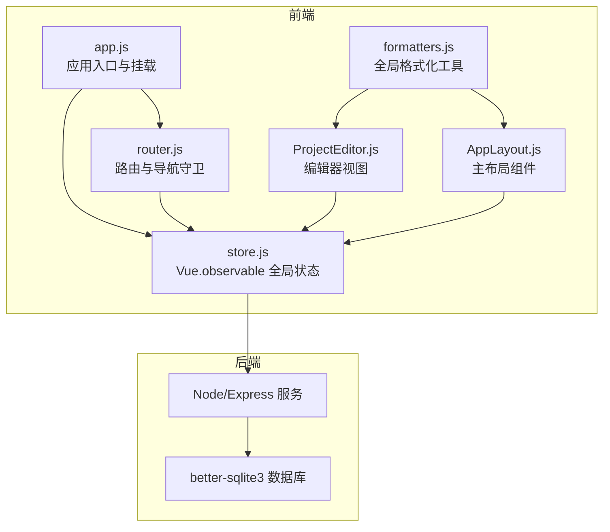
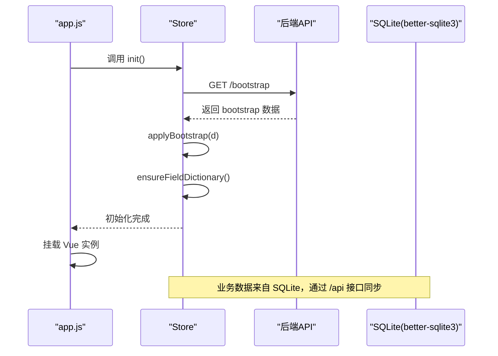
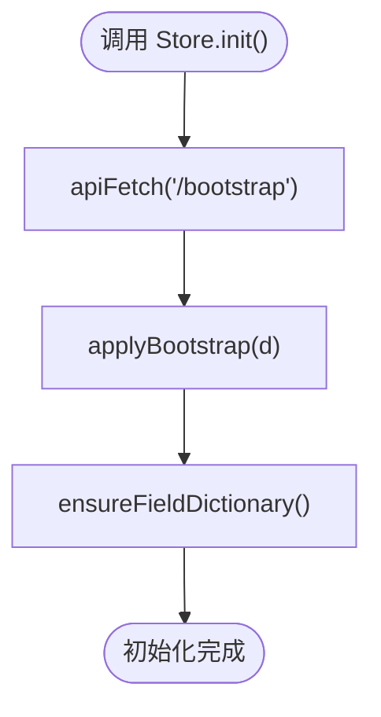
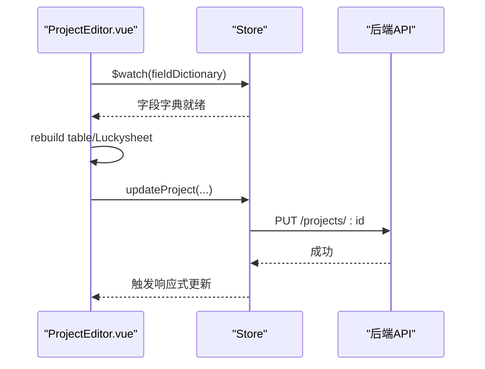
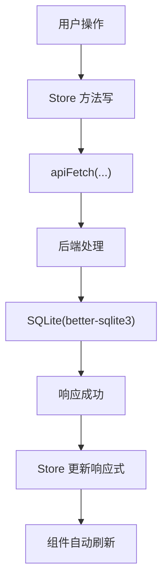
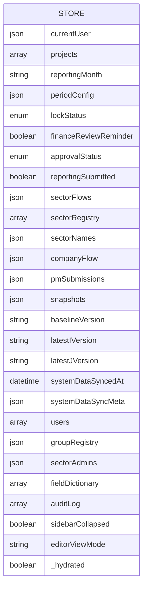
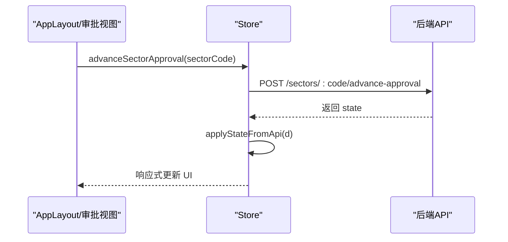
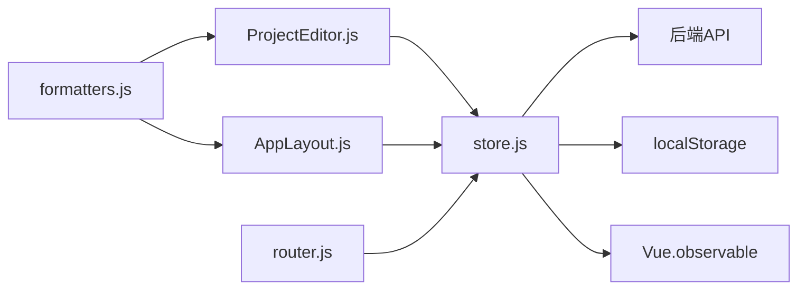

# 全局状态管理

<cite>
**本文引用的文件**
- [store.js](file://js/store.js)
- [app.js](file://js/app.js)
- [router.js](file://js/router.js)
- [ProjectEditor.js](file://js/views/ProjectEditor.js)
- [AppLayout.js](file://js/components/AppLayout.js)
- [formatters.js](file://js/formatters.js)
</cite>

## 目录
1. [简介](#简介)
2. [项目结构](#项目结构)
3. [核心组件](#核心组件)
4. [架构总览](#架构总览)
5. [详细组件分析](#详细组件分析)
6. [依赖关系分析](#依赖关系分析)
7. [性能考量](#性能考量)
8. [故障排查指南](#故障排查指南)
9. [结论](#结论)
10. [附录](#附录)

## 简介
本文件系统性阐述本项目的全局状态管理方案，围绕基于 Vue.observable 的状态中心 Store 展开，涵盖：
- Store 初始化流程与状态结构
- 响应式数据绑定、状态订阅与组件通信模式
- 状态持久化策略（localStorage 与 SQLite 同步）
- 数据同步机制与 API 交互
- 性能优化建议、最佳实践、调试技巧与常见问题

## 项目结构
本项目采用“单页应用 + 前端状态中心 + Node/SQLite 后端”的架构。前端通过 Store 维护全局状态，并通过 API 与后端进行数据同步；应用启动时先拉取后端状态并注入 Store，随后挂载 Vue 实例。

图表来源
- [app.js:1-47](file://js/app.js#L1-L47)
- [router.js:1-137](file://js/router.js#L1-L137)
- [store.js:1-602](file://js/store.js#L1-L602)
- [ProjectEditor.js:1-200](file://js/views/ProjectEditor.js#L1-L200)
- [AppLayout.js:1-200](file://js/components/AppLayout.js#L1-L200)
- [formatters.js:1-167](file://js/formatters.js#L1-L167)

章节来源
- [app.js:1-47](file://js/app.js#L1-L47)
- [router.js:1-137](file://js/router.js#L1-L137)
- [store.js:1-602](file://js/store.js#L1-L602)

## 核心组件
- Store（全局状态中心）：以 Vue.observable 创建响应式对象，集中管理用户、项目、报表周期、快照、流程状态、字段字典、审计日志等。
- 应用入口 app.js：在挂载 Vue 实例前调用 Store.init() 拉取后端状态，确保组件渲染时具备可用数据。
- 路由 router.js：基于 Store.currentUser 进行权限校验与导航守卫，控制页面访问范围。
- 视图组件：如 ProjectEditor 与 AppLayout 通过 $watch 订阅 Store 的变化，实现响应式更新与 UI 同步。
- 格式化工具 formatters.js：为视图层提供统一的数据格式化能力，减少模板复杂度。

章节来源
- [store.js:97-128](file://js/store.js#L97-L128)
- [app.js:30-31](file://js/app.js#L30-L31)
- [router.js:85-132](file://js/router.js#L85-L132)
- [ProjectEditor.js:112-127](file://js/views/ProjectEditor.js#L112-L127)
- [AppLayout.js:36-87](file://js/components/AppLayout.js#L36-L87)
- [formatters.js:9-21](file://js/formatters.js#L9-L21)

## 架构总览
Store 作为单一真相源，负责：
- 初始化：拉取后端 bootstrap 数据，注入字段字典与业务状态
- 响应式更新：通过 Vue.observable 与 Vue.set/Vue.delete 管理数组/对象变更
- API 同步：所有写操作均通过 apiFetch 发送请求，成功后再更新 Store
- 持久化：用户登录信息使用 localStorage，界面偏好（侧边栏折叠）也持久化到 localStorage
- 与组件通信：组件通过 $watch 订阅 Store 的关键字段，实现 UI 自动更新

图表来源
- [app.js:30-31](file://js/app.js#L30-L31)
- [store.js:268-275](file://js/store.js#L268-L275)
- [store.js:130-168](file://js/store.js#L130-L168)
- [store.js:186-235](file://js/store.js#L186-L235)

## 详细组件分析

### Store 初始化流程与状态结构
- 初始化入口：app.js 在挂载前调用 Store.init()，后者通过 apiFetch 拉取 /bootstrap，随后调用 applyBootstrap 注入数据。
- 状态结构：Store 以 Vue.observable 包裹的对象形式存在，包含用户、项目列表、报表周期配置、锁定期状态、审批状态、快照集合、字段字典、审计日志、侧边栏状态等。
- 字段字典加载：优先尝试 /api/fields 与 /api/admin/fields，若失败则回退到静态资源或动态脚本注入，最终写入 Store.fieldDictionary 并暴露给全局 window.FIELD_DICTIONARY。

图表来源
- [store.js:268-275](file://js/store.js#L268-L275)
- [store.js:130-168](file://js/store.js#L130-L168)
- [store.js:186-235](file://js/store.js#L186-L235)

章节来源
- [app.js:30-31](file://js/app.js#L30-L31)
- [store.js:97-128](file://js/store.js#L97-L128)
- [store.js:130-168](file://js/store.js#L130-L168)
- [store.js:186-235](file://js/store.js#L186-L235)

### 响应式数据绑定、状态订阅与组件通信
- 组件订阅：ProjectEditor 在 mounted/activated 中通过 $watch 订阅 Store.fieldDictionary 与 Store.sidebarCollapsed，实现字段字典就绪后的表格重建与布局调整。
- 布尔开关：AppLayout 通过 computed 直接读取 Store.sidebarCollapsed，实现侧边栏折叠状态的双向绑定。
- 数据流：组件通过 Store 的方法（如 updateProject、createSnapshot、advanceSectorApproval 等）触发 API 请求，成功后更新 Store，进而驱动视图自动刷新。

图表来源
- [ProjectEditor.js:112-127](file://js/views/ProjectEditor.js#L112-L127)
- [ProjectEditor.js:193-207](file://js/views/ProjectEditor.js#L193-L207)
- [store.js:325-336](file://js/store.js#L325-L336)

章节来源
- [ProjectEditor.js:112-127](file://js/views/ProjectEditor.js#L112-L127)
- [ProjectEditor.js:193-207](file://js/views/ProjectEditor.js#L193-L207)
- [AppLayout.js:86-86](file://js/components/AppLayout.js#L86-L86)
- [store.js:325-336](file://js/store.js#L325-L336)

### 状态持久化策略与数据同步机制
- 用户登录信息：存储于 localStorage，键为 ptrack_user，Store.login/logout 会读写该键。
- 界面偏好：侧边栏折叠状态存储于 localStorage，键为 ptrack_sidebar_collapsed，Store.toggleSidebar/setSidebarCollapsed 会持久化。
- 业务数据：来自 SQLite（better-sqlite3），通过 /api 接口与前端交互；所有写操作均先发送请求，成功后再更新 Store，保证前后端一致性。
- 字段字典：优先从后端 /api/fields 或 /api/admin/fields 获取，若失败则回退到静态资源或动态脚本注入，最终写入 Store.fieldDictionary。

图表来源
- [store.js:290-308](file://js/store.js#L290-L308)
- [store.js:310-318](file://js/store.js#L310-L318)
- [store.js:325-336](file://js/store.js#L325-L336)
- [store.js:186-235](file://js/store.js#L186-L235)

章节来源
- [store.js:8-19](file://js/store.js#L8-L19)
- [store.js:290-308](file://js/store.js#L290-L308)
- [store.js:310-318](file://js/store.js#L310-L318)
- [store.js:325-336](file://js/store.js#L325-L336)
- [store.js:186-235](file://js/store.js#L186-L235)

### 状态树结构与数据流向
- 状态树（节选）：包含 currentUser、projects、reportingMonth、periodConfig、lockStatus、financeReviewReminder、approvalStatus、reportingSubmitted、sectorFlows、sectorRegistry、sectorNames、companyFlow、pmSubmissions、snapshots、baselineVersion、latestIVersion、latestJVersion、systemDataSyncedAt、systemDataSyncMeta、users、groupRegistry、sectorAdmins、fieldDictionary、auditLog、sidebarCollapsed、editorViewMode、_hydrated 等。
- 数据流向：组件通过 Store 的方法发起请求，后端返回数据后，Store 通过 applyBootstrap/applyStateFromApi 等函数合并到状态树，Vue 基于响应式机制自动通知订阅者。

图表来源
- [store.js:97-128](file://js/store.js#L97-L128)

章节来源
- [store.js:97-128](file://js/store.js#L97-L128)

### 关键流程：审批与快照
- 审批推进：Store.advanceSectorApproval/Store.rejectSectorApproval 通过 POST 请求推进或驳回审批，成功后调用 applyStateFromApi 合并后端返回的状态。
- 快照管理：Store.createSnapshot 生成快照并写入后端；Store.fetchSnapshot 支持内存优先、缺失时从后端拉取。
- PM 提交流程：Store.submitPmReporting 更新 pmSubmissions 状态，Store.syncPmProjectsToServer 在提交前将当前 PM 的项目计算结果同步到后端。

图表来源
- [store.js:396-405](file://js/store.js#L396-L405)
- [store.js:237-241](file://js/store.js#L237-L241)

章节来源
- [store.js:396-405](file://js/store.js#L396-L405)
- [store.js:237-241](file://js/store.js#L237-L241)
- [store.js:344-359](file://js/store.js#L344-L359)
- [store.js:382-393](file://js/store.js#L382-L393)
- [store.js:472-495](file://js/store.js#L472-L495)
- [store.js:498-508](file://js/store.js#L498-L508)

## 依赖关系分析
- Store 对外依赖：apiFetch（封装 fetch）、localStorage（用户与界面偏好）、Vue.observable（响应式）、后端 API（/bootstrap、/projects、/snapshots、/sectors、/company、/meta、/fields 等）。
- 组件依赖：ProjectEditor 依赖 Store.fieldDictionary 与 Store.projects；AppLayout 依赖 Store.currentUser、Store.lockStatus、Store.reportingMonth、Store.sidebarCollapsed。
- 路由依赖：router.js 依赖 Store.currentUser 进行权限控制。

图表来源
- [store.js:66-93](file://js/store.js#L66-L93)
- [store.js:8-19](file://js/store.js#L8-L19)
- [ProjectEditor.js:112-127](file://js/views/ProjectEditor.js#L112-L127)
- [AppLayout.js:36-87](file://js/components/AppLayout.js#L36-L87)
- [router.js:85-132](file://js/router.js#L85-L132)
- [formatters.js:152-165](file://js/formatters.js#L152-L165)

章节来源
- [store.js:66-93](file://js/store.js#L66-L93)
- [store.js:8-19](file://js/store.js#L8-L19)
- [ProjectEditor.js:112-127](file://js/views/ProjectEditor.js#L112-L127)
- [AppLayout.js:36-87](file://js/components/AppLayout.js#L36-L87)
- [router.js:85-132](file://js/router.js#L85-L132)
- [formatters.js:152-165](file://js/formatters.js#L152-L165)

## 性能考量
- 响应式更新粒度：使用 Vue.set/Vue.delete 精准更新数组/对象元素，避免不必要的整树替换。
- 列表渲染优化：在组件中根据 Store.projects 或快照 projects 构建表格数据，尽量减少重复计算与 DOM 操作。
- 事件与定时器清理：组件销毁时及时清理 ResizeObserver、定时器与 $watch，防止内存泄漏。
- 字段字典缓存：Store.ensureFieldDictionary 优先从内存读取，避免重复网络请求。
- 格式化工具：统一使用 formatters.js，减少模板中的计算逻辑，提升渲染性能。

章节来源
- [store.js:134-136](file://js/store.js#L134-L136)
- [store.js:186-235](file://js/store.js#L186-L235)
- [ProjectEditor.js:148-167](file://js/views/ProjectEditor.js#L148-L167)
- [formatters.js:9-21](file://js/formatters.js#L9-L21)

## 故障排查指南
- 初始化失败：检查后端 /bootstrap 是否可达，确认数据库已导入初始数据；查看 app.js 的错误提示与堆栈。
- 字段字典加载失败：确认 /api/fields 或 /api/admin/fields 是否可用，或静态资源 /config/fields/fields.json 与 /config/fields/fields-data.js 是否存在。
- 写操作未生效：确认 apiFetch 返回状态码与响应体，检查 Store.updateProject/Store.createSnapshot 等方法是否正确调用并更新 Store。
- 权限问题：检查 router.js 的导航守卫逻辑，确认 Store.currentUser 的角色与目标路由是否匹配。
- 侧边栏状态异常：确认 localStorage 键 ptrack_sidebar_collapsed 是否被意外清空，或是否被其他逻辑覆盖。

章节来源
- [app.js:30-44](file://js/app.js#L30-L44)
- [store.js:186-235](file://js/store.js#L186-L235)
- [store.js:325-336](file://js/store.js#L325-L336)
- [router.js:85-132](file://js/router.js#L85-L132)
- [store.js:8-19](file://js/store.js#L8-L19)

## 结论
本项目采用 Vue.observable 构建轻量、清晰的全局状态中心，结合 localStorage 与后端 API，实现了从前端到 SQLite 的闭环数据流。通过组件对 Store 的订阅与响应式更新，实现了高效、直观的组件通信与状态同步。配合完善的权限控制、格式化工具与生命周期清理，整体具备良好的可维护性与扩展性。

## 附录
- 最佳实践
  - 严格区分“纯 UI 状态”与“业务状态”，UI 状态使用组件内部 data，业务状态放入 Store。
  - 写操作必须先请求后端，成功后再更新 Store，保持前后端一致。
  - 使用 Vue.set/Vue.delete 精准更新响应式数据，避免整树替换。
  - 在组件销毁时清理 $watch、定时器与观察者，防止内存泄漏。
  - 对关键状态（如字段字典）进行缓存与降级加载策略。
- 调试技巧
  - 在浏览器控制台直接访问 window.Store 查看当前状态。
  - 在组件中添加 console.log($watch 回调)，定位响应式更新触发点。
  - 使用 Vue DevTools 观察 Store 的变更与组件的响应式更新。
- 常见问题
  - “无法加载数据”：检查后端服务是否启动、/bootstrap 是否返回有效数据、初始数据是否导入。
  - “字段字典为空”：确认 /api/fields 与静态资源路径是否存在，必要时手动刷新或重启服务。
  - “侧边栏状态不同步”：检查 localStorage 键是否被覆盖，或 Store.toggleSidebar/setSidebarCollapsed 是否被调用。