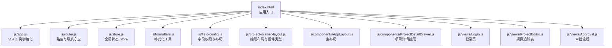
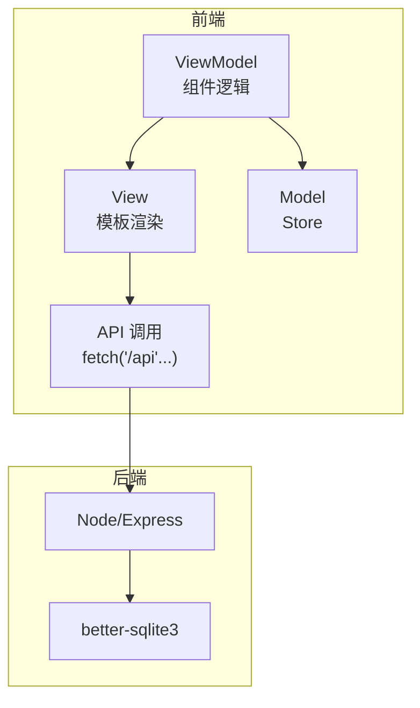
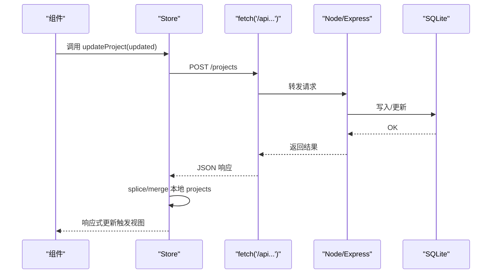
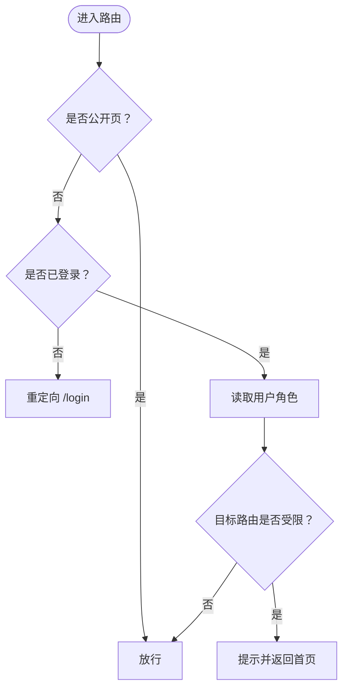
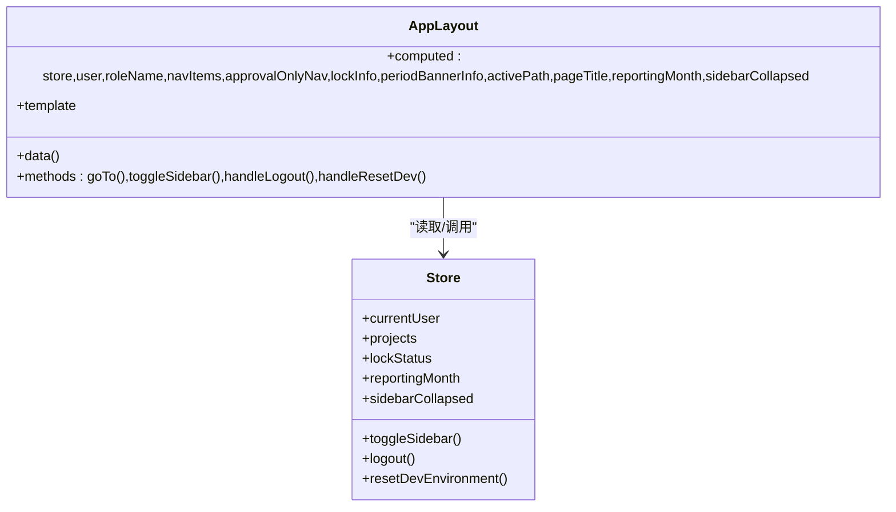
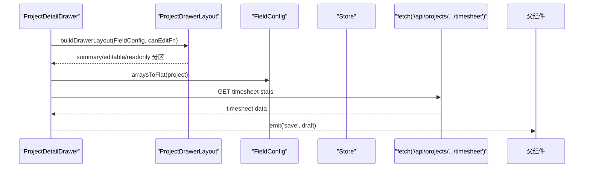
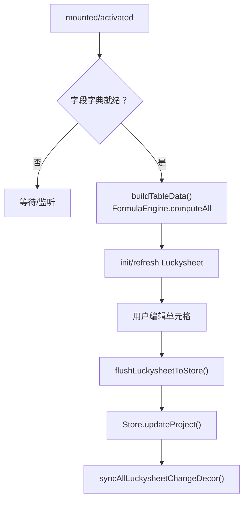
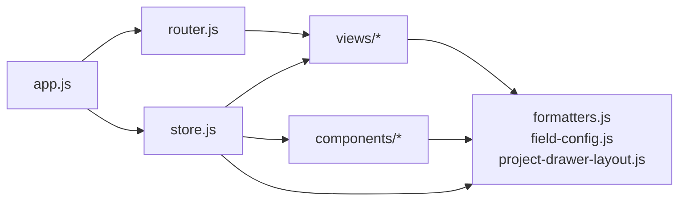

# 前端架构

<cite>
**本文引用的文件**
- [index.html](file://index.html)
- [js/app.js](file://js/app.js)
- [js/router.js](file://js/router.js)
- [js/store.js](file://js/store.js)
- [js/formatters.js](file://js/formatters.js)
- [js/field-config.js](file://js/field-config.js)
- [js/project-drawer-layout.js](file://js/project-drawer-layout.js)
- [js/components/AppLayout.js](file://js/components/AppLayout.js)
- [js/components/ProjectDetailDrawer.js](file://js/components/ProjectDetailDrawer.js)
- [js/views/Login.js](file://js/views/Login.js)
- [js/views/ProjectEditor.js](file://js/views/ProjectEditor.js)
- [js/views/Approval.js](file://js/views/Approval.js)
- [package.json](file://package.json)
</cite>

## 目录
1. [简介](#简介)
2. [项目结构](#项目结构)
3. [核心组件](#核心组件)
4. [架构总览](#架构总览)
5. [详细组件分析](#详细组件分析)
6. [依赖分析](#依赖分析)
7. [性能考量](#性能考量)
8. [故障排查指南](#故障排查指南)
9. [结论](#结论)
10. [附录](#附录)

## 简介
本项目是一个基于 Vue 2 的前端应用，采用 MVVM 架构模式，围绕“项目执行追踪平台”构建。前端通过全局状态 Store 管理业务数据与 UI 状态，结合 Vue Router 实现多角色权限驱动的页面导航与权限控制；核心功能包括项目数据录入与校验、审批流程、快照版本管理、以及与后端 Node/Express + better-sqlite3 的数据同步。

## 项目结构
前端以“模块化脚本 + 组件化视图”的方式组织，HTML 作为入口，按依赖顺序加载各类工具模块、组件与视图，最后初始化应用与路由。

图表来源
- [index.html:70-107](file://index.html#L70-L107)
- [js/app.js:1-47](file://js/app.js#L1-L47)
- [js/router.js:1-137](file://js/router.js#L1-L137)
- [js/store.js:1-602](file://js/store.js#L1-L602)
- [js/formatters.js:1-167](file://js/formatters.js#L1-L167)
- [js/field-config.js:1-262](file://js/field-config.js#L1-L262)
- [js/project-drawer-layout.js:1-154](file://js/project-drawer-layout.js#L1-L154)
- [js/components/AppLayout.js:1-240](file://js/components/AppLayout.js#L1-L240)
- [js/components/ProjectDetailDrawer.js:1-846](file://js/components/ProjectDetailDrawer.js#L1-L846)
- [js/views/Login.js:1-215](file://js/views/Login.js#L1-L215)
- [js/views/ProjectEditor.js:1-3101](file://js/views/ProjectEditor.js#L1-L3101)
- [js/views/Approval.js:1-475](file://js/views/Approval.js#L1-L475)

章节来源
- [index.html:1-110](file://index.html#L1-L110)

## 核心组件
- 全局状态 Store：集中管理用户、项目、快照、流程、字段字典、锁定状态等，提供 CRUD 与同步方法。
- 路由 Router：定义页面与权限，实现导航守卫与角色导向的首页重定向。
- 主布局 AppLayout：侧边导航、顶部用户信息、周期状态与菜单折叠控制。
- 项目详情抽屉 ProjectDetailDrawer：项目字段编辑、月度数据输入、辅助参考与预警提示。
- 登录页 Login：角色与用户选择，模拟登录并写入 Store。
- 项目编辑器 ProjectEditor：Luckysheet 表格、字段权限、变更高亮、版本对比、导入导出。
- 审批流程 Approval：流程节点、版本快照、审批/驳回、差异对比。

章节来源
- [js/store.js:97-128](file://js/store.js#L97-L128)
- [js/router.js:12-69](file://js/router.js#L12-L69)
- [js/components/AppLayout.js:31-87](file://js/components/AppLayout.js#L31-L87)
- [js/components/ProjectDetailDrawer.js:23-56](file://js/components/ProjectDetailDrawer.js#L23-L56)
- [js/views/Login.js:52-78](file://js/views/Login.js#L52-L78)
- [js/views/ProjectEditor.js:64-111](file://js/views/ProjectEditor.js#L64-L111)
- [js/views/Approval.js:52-94](file://js/views/Approval.js#L52-L94)

## 架构总览
前端采用 MVVM 模式：
- Model：Store（Vue.observable）承载业务模型与持久化 API。
- View：Vue 组件模板与 Element UI/Luckysheet 渲染。
- ViewModel：组件的 data/computed/methods 与路由/过滤器桥接 Store。

图表来源
- [js/store.js:66-93](file://js/store.js#L66-L93)
- [js/app.js:22-28](file://js/app.js#L22-L28)
- [package.json:13-17](file://package.json#L13-L17)

## 详细组件分析

### 全局状态 Store（MVVM 的 Model）
- 设计理念
  - 使用 Vue.observable 维护响应式全局状态，结合 localStorage 管理用户与侧边栏状态。
  - 业务数据来自 SQLite（经 /api 同步），字段字典与静态资源路径通过多路加载策略保证可用性。
- 状态更新机制
  - 初始化：/bootstrap → applyBootstrap → ensureFieldDictionary → Store._hydrated=true。
  - 写入：updateProject/replaceProjects/post/put → 本地合并 + 服务端持久化。
  - 流程推进：advanceSectorApproval/rejectSectorApproval/archiveCompany → applyStateFromApi。
- 组件通信模式
  - 组件通过 window.Store 直接读取/调用方法，形成单向数据流：Store → 组件 computed → 视图。
  - 事件：组件通过 emit 或 Element UI 事件回调触发 Store 方法（如抽屉保存）。

图表来源
- [js/store.js:320-336](file://js/store.js#L320-L336)
- [js/store.js:66-93](file://js/store.js#L66-L93)

章节来源
- [js/store.js:97-128](file://js/store.js#L97-L128)
- [js/store.js:268-275](file://js/store.js#L268-L275)
- [js/store.js:320-336](file://js/store.js#L320-L336)
- [js/store.js:396-405](file://js/store.js#L396-L405)
- [js/store.js:418-437](file://js/store.js#L418-L437)

### 路由系统（MVVM 的 ViewModel 导航）
- 配置
  - hash 模式，定义登录页（公开）、主布局子路由（editor/approval/audit/fields/admin）。
  - 首页根据角色重定向：sector_director/group_leader → /approval；否则 → /editor。
- 权限控制
  - requiresAuth/public 元信息配合 beforeEach 守卫：
    - system_admin：可访问 /admin 与 /fields。
    - 审计日志 /audit 仅 system_admin。
    - pm/executive_viewer 限制访问审批/审计/管理/字段配置。
    - sector_director/group_leader 仅审批流程。

图表来源
- [js/router.js:85-132](file://js/router.js#L85-L132)

章节来源
- [js/router.js:12-69](file://js/router.js#L12-L69)
- [js/router.js:77-132](file://js/router.js#L77-L132)

### 主布局 AppLayout（MVVM 的 ViewModel）
- 职责
  - 侧边导航菜单（根据角色过滤）。
  - 顶部用户信息、周期状态与锁定状态提示。
  - 侧边栏折叠状态与本地存储同步。
  - 开发重置环境（reseed/reset）。
- 交互
  - 导航跳转 goTo。
  - 退出登录 handleLogout。
  - 重置环境 handleResetDev（调用 Store.resetDevEnvironment）。

图表来源
- [js/components/AppLayout.js:31-133](file://js/components/AppLayout.js#L31-L133)
- [js/store.js:310-318](file://js/store.js#L310-L318)
- [js/store.js:290-308](file://js/store.js#L290-L308)
- [js/store.js:283-288](file://js/store.js#L283-L288)

章节来源
- [js/components/AppLayout.js:31-87](file://js/components/AppLayout.js#L31-L87)
- [js/components/AppLayout.js:88-133](file://js/components/AppLayout.js#L88-L133)

### 项目详情抽屉 ProjectDetailDrawer（MVVM 的 ViewModel）
- 职责
  - 基于字段字典与权限矩阵构建抽屉布局（summary/editable/readonly 三类分区）。
  - 月度数据输入（完成额/开票/回款），支持焦点态与辅助参考（工时/成本）。
  - 项目预警与库存风险提示。
  - 保存事件向上抛出（save），关闭事件（close）。
- 交互
  - resetDraft：基于 FieldConfig.arraysToFlat 生成草稿副本。
  - 月度输入聚焦/失焦处理，数值解析与格式化。
  - timesheetStats 加载与错误处理。
  - 导航 prev/next 事件。

图表来源
- [js/components/ProjectDetailDrawer.js:57-176](file://js/components/ProjectDetailDrawer.js#L57-L176)
- [js/project-drawer-layout.js:68-126](file://js/project-drawer-layout.js#L68-L126)
- [js/field-config.js:234-240](file://js/field-config.js#L234-L240)
- [js/components/ProjectDetailDrawer.js:427-452](file://js/components/ProjectDetailDrawer.js#L427-L452)

章节来源
- [js/components/ProjectDetailDrawer.js:23-56](file://js/components/ProjectDetailDrawer.js#L23-L56)
- [js/components/ProjectDetailDrawer.js:177-203](file://js/components/ProjectDetailDrawer.js#L177-L203)
- [js/components/ProjectDetailDrawer.js:427-452](file://js/components/ProjectDetailDrawer.js#L427-L452)

### 登录页 Login（MVVM 的 ViewModel）
- 职责
  - 角色与用户列表展示，支持 fallback 用户。
  - 选择角色/用户后写入 Store.currentUser，随后按角色重定向。
- 交互
  - selectRole/backToRoles 步骤切换。
  - confirmLogin 调用 Store.login 并导航。

章节来源
- [js/views/Login.js:52-129](file://js/views/Login.js#L52-L129)

### 项目编辑器 ProjectEditor（MVVM 的 ViewModel）
- 职责
  - Luckysheet 表格渲染与工作表保护、列宽/冻结、样式。
  - 字段字典就绪后重建表格，按角色/锁定期动态显示/编辑。
  - 变更高亮、基线对比、版本查看、导入导出、提交归档。
- 生命周期
  - mounted：监听字段字典变化，初始化/刷新 Luckysheet。
  - activated：根据角色同步 PM 工作流或初始化 Store。
  - beforeDestroy：清理定时器/观察者/ResizeObserver/销毁 Luckysheet。
- 事件处理
  - flushLuckysheetToStore：结束编辑态，批量写入 Store.updateProject。
  - handleSave/handleSubmitArchive：保存/提交归档。
  - onImportFileChange：Excel 导入合并更新。

图表来源
- [js/views/ProjectEditor.js:112-167](file://js/views/ProjectEditor.js#L112-L167)
- [js/views/ProjectEditor.js:192-247](file://js/views/ProjectEditor.js#L192-L247)
- [js/views/ProjectEditor.js:454-495](file://js/views/ProjectEditor.js#L454-L495)

章节来源
- [js/views/ProjectEditor.js:64-111](file://js/views/ProjectEditor.js#L64-L111)
- [js/views/ProjectEditor.js:112-167](file://js/views/ProjectEditor.js#L112-L167)
- [js/views/ProjectEditor.js:192-247](file://js/views/ProjectEditor.js#L192-L247)
- [js/views/ProjectEditor.js:454-495](file://js/views/ProjectEditor.js#L454-L495)

### 审批流程 Approval（MVVM 的 ViewModel）
- 职责
  - 时间轴展示流程节点与状态（done/current/pending）。
  - 版本快照列表与差异对比（DiffUtils）。
  - 审批/驳回按钮与操作日志记录。
- 交互
  - handleApprove：根据角色调用 advanceSectorApproval 或 archiveCompany。
  - handleReject：填写原因并记录审计日志。

章节来源
- [js/views/Approval.js:52-155](file://js/views/Approval.js#L52-L155)
- [js/views/Approval.js:183-227](file://js/views/Approval.js#L183-L227)

## 依赖分析
- 外部依赖
  - Vue 2、Vue Router 3、Element UI、Luckysheet、SheetJS（xlsx）。
  - better-sqlite3、express（后端，运行时通过 /api 访问）。
- 内部模块耦合
  - Store 为全局单例，被所有组件/视图读取。
  - AppLayout 依赖 Store 的用户/锁定状态/周期配置。
  - ProjectDetailDrawer 依赖 FieldConfig/ProjectDrawerLayout/Formatters。
  - ProjectEditor 依赖 FormulaEngine/FieldConfig/ChangeMeta/BaselineDiff/DiffUtils/StockValidation 等。

图表来源
- [js/app.js:22-28](file://js/app.js#L22-L28)
- [js/router.js:71-75](file://js/router.js#L71-L75)
- [js/store.js:600-601](file://js/store.js#L600-L601)

章节来源
- [package.json:13-17](file://package.json#L13-L17)
- [index.html:70-107](file://index.html#L70-L107)

## 性能考量
- 渲染性能
  - Luckysheet 表格：使用 refresh/jfrefreshgrid，ResizeObserver 控制尺寸变化，避免频繁重绘。
  - 变更高亮与基线对比：仅在需要时计算，避免全量重算。
- 网络与状态
  - Store.init 与 ensureFieldDictionary 串行加载，减少重复请求。
  - 抽屉 timesheetStats 加载失败降级为空，避免阻塞主流程。
- 输入体验
  - 数值输入焦点态与失焦解析，减少无效写入。
  - 单元格保存链式 Promise（_cellSaveChain）串行化，避免并发写入冲突。

章节来源
- [js/views/ProjectEditor.js:674-709](file://js/views/ProjectEditor.js#L674-L709)
- [js/views/ProjectEditor.js:444-452](file://js/views/ProjectEditor.js#L444-L452)
- [js/components/ProjectDetailDrawer.js:242-269](file://js/components/ProjectDetailDrawer.js#L242-L269)
- [js/views/ProjectEditor.js:444-452](file://js/views/ProjectEditor.js#L444-L452)

## 故障排查指南
- 初始化失败
  - 现象：页面显示“无法加载数据”，提示安装依赖与启动服务。
  - 排查：确保已执行 npm install 与 npm start，且 /api/bootstrap 可用。
- 字段字典加载失败
  - 现象：Store.init 后 fieldDictionary 为空。
  - 排查：确认 /api/fields 或 /config/fields/fields.json / fields-data.js 存在并可访问。
- 抽屉 timesheet 加载失败
  - 现象：抽屉显示加载失败，timesheetLoadFailed=true。
  - 排查：检查 /api/projects/:no/timesheet 接口与网络连通性。
- 权限不足
  - 现象：导航被拒绝并返回首页。
  - 排查：确认用户角色与目标路由权限匹配，检查路由守卫逻辑。

章节来源
- [js/app.js:30-44](file://js/app.js#L30-L44)
- [js/store.js:268-275](file://js/store.js#L268-L275)
- [js/components/ProjectDetailDrawer.js:427-452](file://js/components/ProjectDetailDrawer.js#L427-L452)
- [js/router.js:77-132](file://js/router.js#L77-L132)

## 结论
本项目以 Store 为核心的数据层，结合 Vue Router 的权限守卫与组件化的视图层，实现了面向多角色的项目追踪与审批流程。通过字段字典与权限矩阵，系统在编辑期严格控制可写范围；通过快照与基线对比，保障数据可追溯与一致性。建议后续在大型表格场景引入虚拟滚动与增量刷新，进一步提升渲染性能。

## 附录
- 最佳实践
  - 组件间通信尽量通过 Store 的响应式属性与事件，避免深层嵌套。
  - 输入处理统一走格式化/解析工具，保持一致性。
  - 路由守卫集中维护权限规则，避免分散逻辑。
  - 大数据量渲染优先考虑懒加载与节流。
- 代码组织原则
  - 模块化：工具函数（formatters/field-config）独立封装。
  - 单向数据流：组件仅消费 Store，副作用通过 Store 方法触发。
  - 可测试性：将复杂算法（公式/对比/权限）抽取为纯函数，便于单元测试。