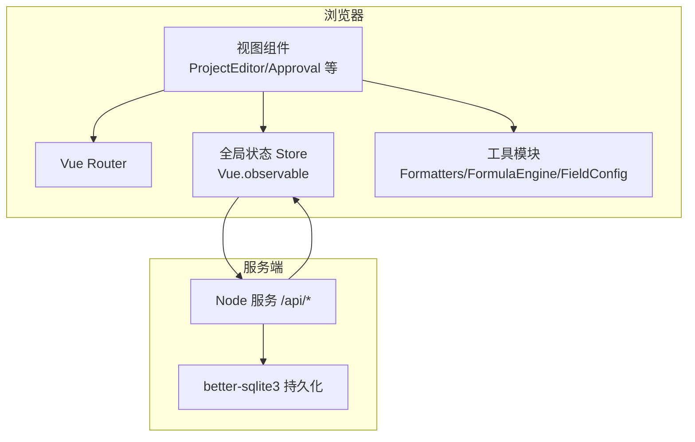
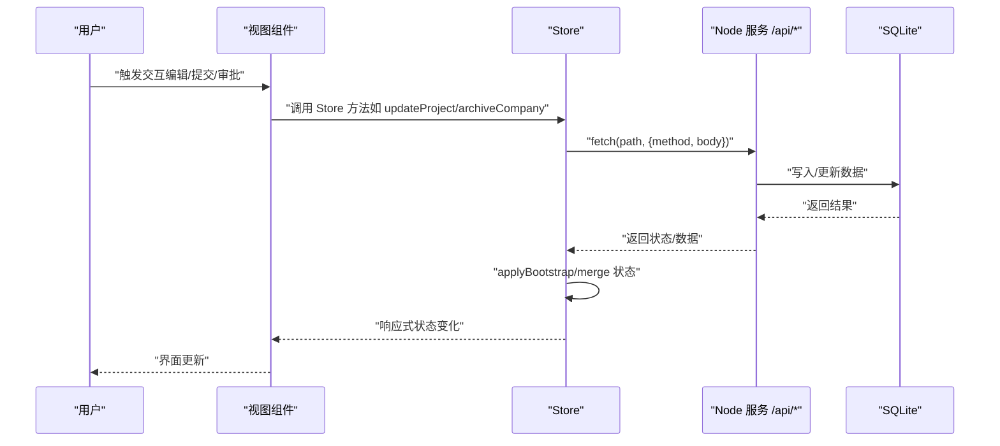
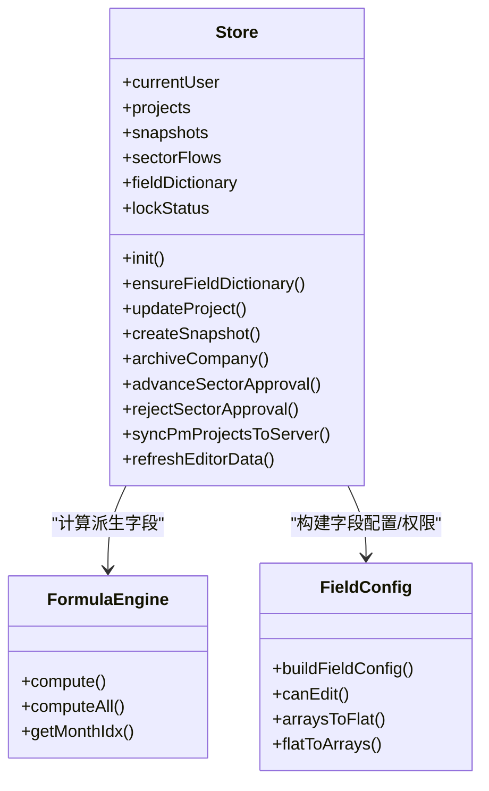
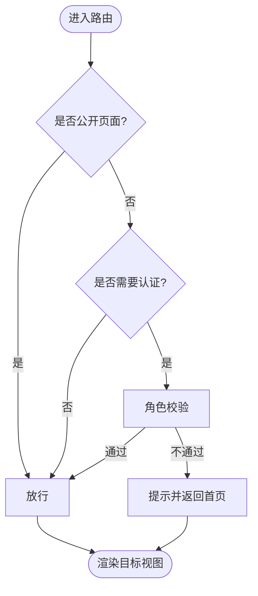
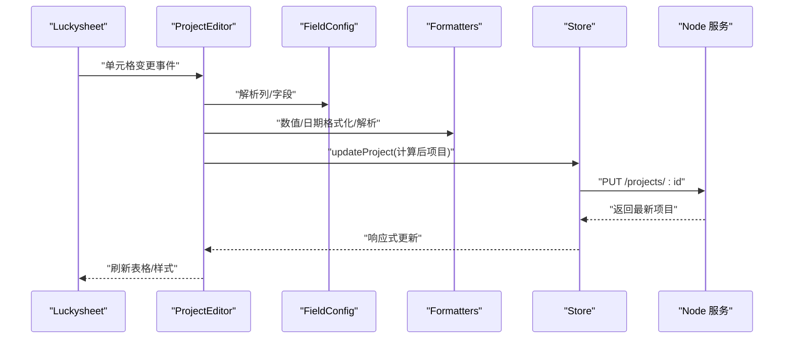
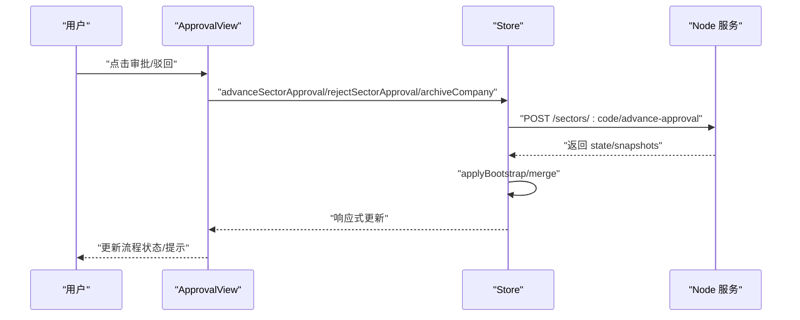
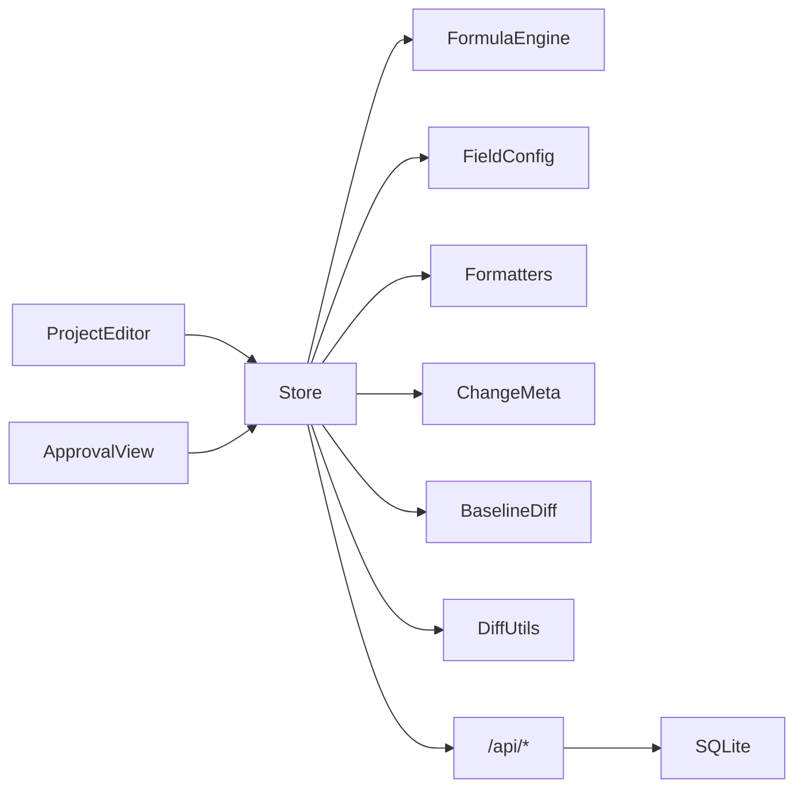

# 数据流架构

<cite>
**本文引用的文件**
- [index.html](file://index.html)
- [app.js](file://js/app.js)
- [store.js](file://js/store.js)
- [router.js](file://js/router.js)
- [formatters.js](file://js/formatters.js)
- [formula-engine.js](file://js/formula-engine.js)
- [field-config.js](file://js/field-config.js)
- [sector-workflow.js](file://js/sector-workflow.js)
- [data-scope.js](file://js/data-scope.js)
- [change-meta.js](file://js/change-meta.js)
- [baseline-diff.js](file://js/baseline-diff.js)
- [diff-utils.js](file://js/diff-utils.js)
- [ProjectEditor.js](file://js/views/ProjectEditor.js)
- [Approval.js](file://js/views/Approval.js)
- [ProjectDetailDrawer.js](file://js/components/ProjectDetailDrawer.js)
</cite>

## 目录
1. [简介](#简介)
2. [项目结构](#项目结构)
3. [核心组件](#核心组件)
4. [架构总览](#架构总览)
5. [详细组件分析](#详细组件分析)
6. [依赖关系分析](#依赖关系分析)
7. [性能考量](#性能考量)
8. [故障排查指南](#故障排查指南)
9. [结论](#结论)
10. [附录](#附录)

## 简介
本文件系统性梳理前端数据流架构，围绕“从用户交互到数据更新”的完整链路，解释全局状态管理、组件间数据传递、响应式绑定与计算属性、侦听器使用、缓存策略、异步处理与错误恢复，并给出数据流图与典型场景示例，帮助开发者与产品人员共同理解与优化数据流。

## 项目结构
前端采用“单页应用 + Vue 2 + Vue Router”架构，数据层基于 Vue.observable 的全局状态 Store，配合后端 Node 服务通过 /api 交互，SQLite 作为持久化存储。页面通过路由切换视图，视图组件通过 Store 读取/写入状态，公式引擎与格式化工具贯穿数据加工与展示。

图表来源
- [index.html:70-107](file://index.html#L70-L107)
- [router.js:12-69](file://js/router.js#L12-L69)
- [store.js:97-128](file://js/store.js#L97-L128)
- [formatters.js:152-165](file://js/formatters.js#L152-L165)
- [formula-engine.js:103-104](file://js/formula-engine.js#L103-L104)
- [field-config.js:242-260](file://js/field-config.js#L242-L260)

章节来源
- [index.html:70-107](file://index.html#L70-L107)
- [router.js:12-69](file://js/router.js#L12-L69)

## 核心组件
- 全局状态 Store：集中管理用户、项目、快照、流程、字段字典、锁定状态等，提供初始化、登录登出、项目增删改、快照管理、审批推进、字段字典加载等方法。
- 路由与导航守卫：根据角色与权限控制页面访问，决定首页路径与页面可见性。
- 视图组件：项目编辑器（Luckysheet/抽屉）、审批流程页等，负责渲染与交互。
- 工具模块：格式化、公式计算、字段配置、变更元数据、基线对比、差异工具等。

章节来源
- [store.js:97-128](file://js/store.js#L97-L128)
- [router.js:7-136](file://js/router.js#L7-L136)
- [ProjectEditor.js:64-111](file://js/views/ProjectEditor.js#L64-L111)
- [Approval.js:52-68](file://js/views/Approval.js#L52-L68)
- [formatters.js:152-165](file://js/formatters.js#L152-L165)
- [formula-engine.js:103-104](file://js/formula-engine.js#L103-L104)
- [field-config.js:242-260](file://js/field-config.js#L242-L260)
- [change-meta.js:241-258](file://js/change-meta.js#L241-L258)
- [baseline-diff.js:104-113](file://js/baseline-diff.js#L104-L113)
- [diff-utils.js:51-54](file://js/diff-utils.js#L51-L54)

## 架构总览
数据流以 Store 为中心，形成“请求-响应-状态更新-视图渲染”的闭环。用户在视图层发起交互（如编辑单元格、点击按钮），视图通过 Store 方法调用 API，服务端更新 SQLite，随后 Store 以响应数据更新状态，Vue 响应式地驱动视图刷新。

图表来源
- [store.js:320-336](file://js/store.js#L320-L336)
- [store.js:418-437](file://js/store.js#L418-L437)
- [store.js:268-275](file://js/store.js#L268-L275)
- [ProjectEditor.js:501-514](file://js/views/ProjectEditor.js#L501-L514)
- [Approval.js:183-197](file://js/views/Approval.js#L183-L197)

## 详细组件分析

### 全局状态 Store（数据中枢）
- 初始化与引导：启动时拉取 /bootstrap，应用基础状态，确保字段字典可用。
- 用户与权限：登录/登出、侧边栏状态持久化、角色相关数据范围过滤。
- 业务数据：项目列表、快照、PM 提交状态、审批流程、锁定状态、提醒状态等。
- API 交互：封装 fetch，统一错误处理；提供项目增删改、快照创建/获取、审批推进、归档、刷新平台数据等方法。
- 字段字典：动态加载/应用，支持静态资源与服务端接口回退。
- 计算与派生：结合公式引擎与字段配置，计算派生字段并注入视图。

图表来源
- [store.js:97-128](file://js/store.js#L97-L128)
- [formula-engine.js:19-83](file://js/formula-engine.js#L19-L83)
- [field-config.js:134-155](file://js/field-config.js#L134-L155)

章节来源
- [store.js:97-128](file://js/store.js#L97-L128)
- [store.js:268-275](file://js/store.js#L268-L275)
- [store.js:320-336](file://js/store.js#L320-L336)
- [store.js:344-359](file://js/store.js#L344-L359)
- [store.js:418-437](file://js/store.js#L418-L437)
- [store.js:558-577](file://js/store.js#L558-L577)
- [formula-engine.js:19-83](file://js/formula-engine.js#L19-L83)
- [field-config.js:134-155](file://js/field-config.js#L134-L155)

### 路由与导航守卫（权限与页面流转）
- 根据角色决定首页路径与页面可见性。
- 对特定路由（管理、字段字典、审计日志）进行角色校验。
- 未登录或权限不足时，提示并返回首页。

图表来源
- [router.js:84-132](file://js/router.js#L84-L132)

章节来源
- [router.js:7-136](file://js/router.js#L7-L136)

### 项目编辑器（数据输入与渲染）
- 字段字典就绪后重建表格/Luckysheet，避免空表头。
- 根据角色/锁定期/报告月构建可编辑列与只读列，应用样式与提示。
- 单元格变更链路：捕获 Luckysheet 输入，转换为 Store 字段，调用 Store.updateProject，写入服务端，更新本地状态，刷新视图。
- 快照浏览：支持按版本查看历史数据，对比基线差异。
- 导入/导出：Excel 导入合并策略，批量更新项目并记录审计日志。

图表来源
- [ProjectEditor.js:444-495](file://js/views/ProjectEditor.js#L444-L495)
- [ProjectEditor.js:716-770](file://js/views/ProjectEditor.js#L716-L770)
- [field-config.js:242-260](file://js/field-config.js#L242-L260)
- [formatters.js:152-165](file://js/formatters.js#L152-L165)
- [store.js:325-336](file://js/store.js#L325-L336)

章节来源
- [ProjectEditor.js:64-111](file://js/views/ProjectEditor.js#L64-L111)
- [ProjectEditor.js:193-207](file://js/views/ProjectEditor.js#L193-L207)
- [ProjectEditor.js:208-247](file://js/views/ProjectEditor.js#L208-L247)
- [ProjectEditor.js:444-495](file://js/views/ProjectEditor.js#L444-L495)
- [ProjectEditor.js:501-514](file://js/views/ProjectEditor.js#L501-L514)
- [ProjectEditor.js:516-540](file://js/views/ProjectEditor.js#L516-L540)
- [ProjectEditor.js:542-611](file://js/views/ProjectEditor.js#L542-L611)
- [ProjectEditor.js:613-637](file://js/views/ProjectEditor.js#L613-L637)
- [ProjectEditor.js:716-770](file://js/views/ProjectEditor.js#L716-L770)
- [ProjectEditor.js:772-799](file://js/views/ProjectEditor.js#L772-L799)

### 审批流程页（流程推进与版本对比）
- 根据角色与板块流程状态显示审批节点与操作按钮。
- 支持“初审通过/复审通过/归档确认”，推进流程并生成对应快照。
- 版本对比：选择两个版本，按字段级比较差异，支持导出与提示。

图表来源
- [Approval.js:156-227](file://js/views/Approval.js#L156-L227)
- [store.js:395-405](file://js/store.js#L395-L405)
- [store.js:407-416](file://js/store.js#L407-L416)
- [store.js:418-437](file://js/store.js#L418-L437)

章节来源
- [Approval.js:52-68](file://js/views/Approval.js#L52-L68)
- [Approval.js:69-155](file://js/views/Approval.js#L69-L155)
- [Approval.js:156-227](file://js/views/Approval.js#L156-L227)
- [Approval.js:228-246](file://js/views/Approval.js#L228-L246)

### 抽屉式详情（字段级编辑与辅助）
- 基于字段配置构建可编辑/只读区域，支持月度字段聚焦与辅助提示。
- 数值输入焦点态与失焦态格式化，避免格式抖动。
- 与工时/成本辅助数据联动，提供填报参考。

章节来源
- [ProjectDetailDrawer.js:23-56](file://js/components/ProjectDetailDrawer.js#L23-L56)
- [ProjectDetailDrawer.js:57-176](file://js/components/ProjectDetailDrawer.js#L57-L176)
- [ProjectDetailDrawer.js:204-277](file://js/components/ProjectDetailDrawer.js#L204-L277)
- [ProjectDetailDrawer.js:427-452](file://js/components/ProjectDetailDrawer.js#L427-L452)

### 工具模块（格式化、公式、字段配置、变更元数据、基线对比）
- 格式化：金额、百分比、日期、布尔、缩写等，统一展示与输入解析。
- 公式引擎：按报告月索引计算派生字段，批量/单项目计算。
- 字段配置：构建字段配置、权限矩阵、月度列索引、数组/扁平转换。
- 变更元数据：记录字段变更日志、去重、批注样式、与审计联动。
- 基线对比：新增项目标记、字段级差异合并、版本可见性控制。

章节来源
- [formatters.js:152-165](file://js/formatters.js#L152-L165)
- [formula-engine.js:19-83](file://js/formula-engine.js#L19-L83)
- [field-config.js:134-155](file://js/field-config.js#L134-L155)
- [change-meta.js:241-258](file://js/change-meta.js#L241-L258)
- [baseline-diff.js:104-113](file://js/baseline-diff.js#L104-L113)
- [diff-utils.js:51-54](file://js/diff-utils.js#L51-L54)

## 依赖关系分析
- 组件耦合：视图组件强依赖 Store 与工具模块；Store 依赖 API 与 SQLite；工具模块彼此独立但被 Store/视图共享。
- 关键依赖链：
  - ProjectEditor → Store.updateProject → /api/projects → SQLite
  - Store.init → /bootstrap → Store.applyBootstrap
  - ApprovalView → Store.advanceSectorApproval → /api/sectors → Store.applyBootstrap
  - ProjectEditor → FormulaEngine.computeAll → Store.projects
  - ProjectEditor → FieldConfig.canEdit → 视图可编辑性
  - ProjectEditor → ChangeMeta.attachChangeTracking → 审计联动

图表来源
- [ProjectEditor.js:208-247](file://js/views/ProjectEditor.js#L208-L247)
- [Approval.js:156-197](file://js/views/Approval.js#L156-L197)
- [store.js:97-128](file://js/store.js#L97-L128)
- [formula-engine.js:88-90](file://js/formula-engine.js#L88-L90)
- [field-config.js:134-155](file://js/field-config.js#L134-L155)
- [change-meta.js:209-216](file://js/change-meta.js#L209-L216)
- [baseline-diff.js:17-32](file://js/baseline-diff.js#L17-L32)
- [diff-utils.js:14-49](file://js/diff-utils.js#L14-L49)

章节来源
- [ProjectEditor.js:208-247](file://js/views/ProjectEditor.js#L208-L247)
- [Approval.js:156-197](file://js/views/Approval.js#L156-L197)
- [store.js:97-128](file://js/store.js#L97-L128)

## 性能考量
- 响应式更新粒度：使用 Vue.set/Vue.delete 与 splice 替换数组/对象，减少不必要的重渲染。
- 批量计算：FormulaEngine.computeAll 批量计算派生字段，降低重复计算成本。
- 缓存策略：
  - Store.snapshots 内存缓存快照，按需从服务端拉取。
  - 字段字典优先内存，回退静态资源与脚本加载。
  - 侧边栏折叠状态与用户信息本地持久化。
- 异步串行化：单元格保存链路通过 _cellSaveChain 串行化，避免并发写入冲突。
- 渲染优化：Luckysheet 刷新节流与 ResizeObserver，避免频繁重排。
- 数据范围过滤：DataScope 按角色与数据范围裁剪项目列表，减少渲染与计算。

章节来源
- [store.js:134-136](file://js/store.js#L134-L136)
- [store.js:383-393](file://js/store.js#L383-L393)
- [store.js:186-235](file://js/store.js#L186-L235)
- [store.js:310-318](file://js/store.js#L310-L318)
- [ProjectEditor.js:444-452](file://js/views/ProjectEditor.js#L444-L452)
- [ProjectEditor.js:674-709](file://js/views/ProjectEditor.js#L674-L709)
- [data-scope.js:13-42](file://js/data-scope.js#L13-L42)

## 故障排查指南
- 初始化失败：检查 /bootstrap 与字段字典加载，确认 config/fields/fields.json 存在与可访问。
- API 错误：统一错误处理会提取服务端错误消息，必要时重启服务并检查接口存在性。
- 权限问题：导航守卫会拦截未授权访问，检查用户角色与路由元信息。
- 数据不同步：使用 refreshEditorData 刷新平台引用与项目状态；核对 systemDataSyncedAt 与 syncMeta。
- 快照缺失：Store.fetchSnapshot 会尝试从服务端拉取，若失败则提示版本不存在或过期。

章节来源
- [store.js:268-275](file://js/store.js#L268-L275)
- [store.js:66-93](file://js/store.js#L66-L93)
- [router.js:97-130](file://js/router.js#L97-L130)
- [store.js:558-577](file://js/store.js#L558-L577)
- [store.js:383-393](file://js/store.js#L383-L393)

## 结论
本项目以 Store 为核心，结合 Vue 响应式与工具模块，实现了清晰的数据流：从用户交互到服务端写入再到状态更新与视图渲染。通过公式引擎与字段配置保障数据一致性与可编辑性，通过快照与基线对比支撑版本管理与审计。建议在复杂交互场景下继续强化异步串行化与缓存命中率，持续优化渲染性能与用户体验。

## 附录
- 典型场景示例
  - 项目经理编辑月度完成额：ProjectEditor 捕获输入 → FieldConfig 校验 → FormulaEngine 计算 → Store.updateProject → 服务端写入 → 视图刷新。
  - 板块总监审批：ApprovalView 调用 advanceSectorApproval → 生成 D 版快照 → 更新 Store.sectorFlows → 流程节点推进。
  - 系统管理员归档：archiveCompany 生成 J 版快照 → 更新 Store.latestJVersion 与 baselineVersion → 触发视图更新。

章节来源
- [ProjectEditor.js:444-495](file://js/views/ProjectEditor.js#L444-L495)
- [Approval.js:183-197](file://js/views/Approval.js#L183-L197)
- [store.js:418-437](file://js/store.js#L418-L437)