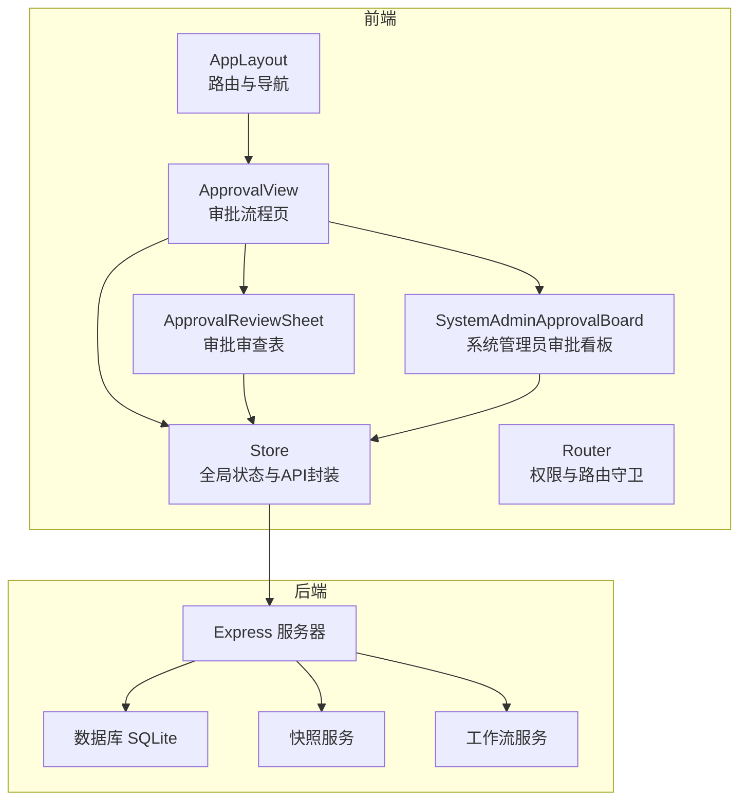
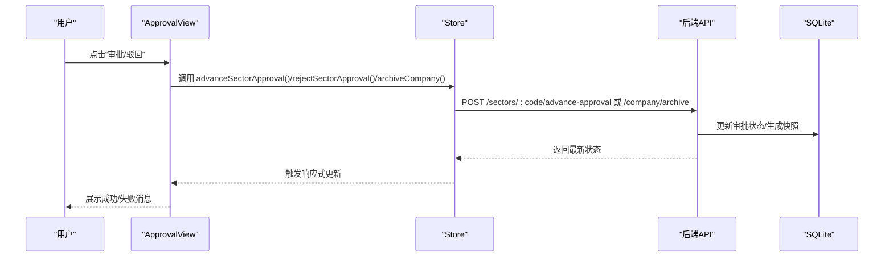
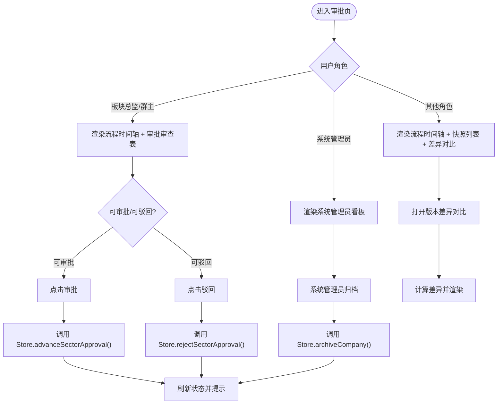
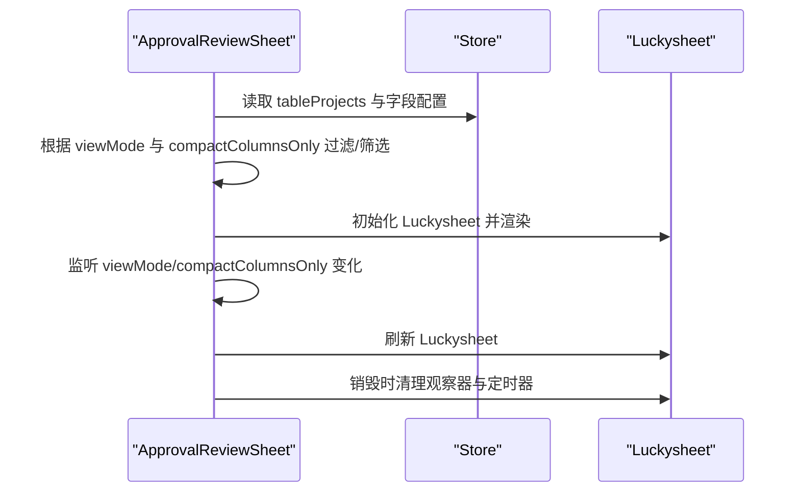
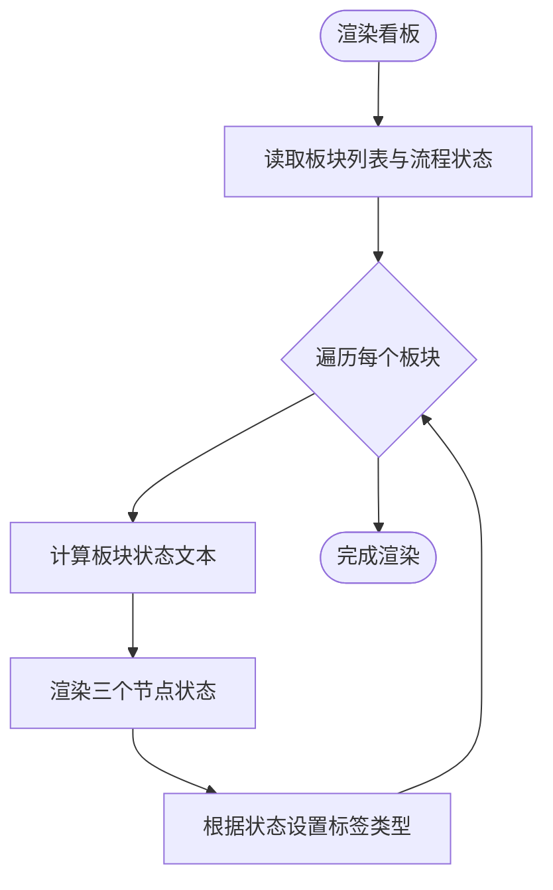
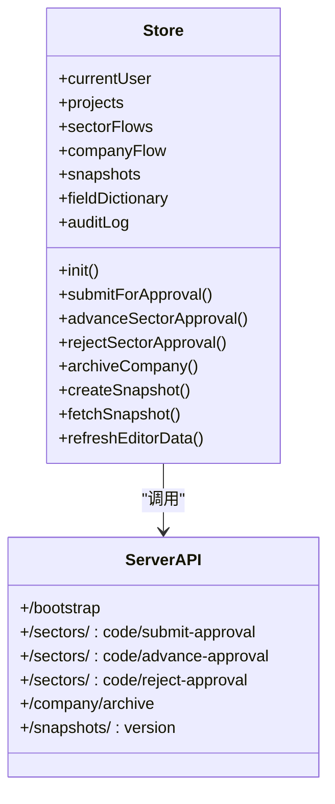
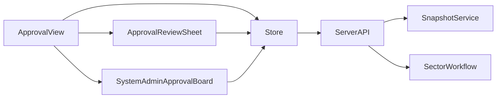

# 审批相关组件

<cite>
**本文引用的文件**
- [ApprovalReviewSheet.js](file://js/components/ApprovalReviewSheet.js)
- [SystemAdminApprovalBoard.js](file://js/components/SystemAdminApprovalBoard.js)
- [Approval.js](file://js/views/Approval.js)
- [store.js](file://js/store.js)
- [index.js](file://server/index.js)
- [sector-workflow.js](file://js/sector-workflow.js)
- [sector-workflow.js](file://server/sector-workflow.js)
- [router.js](file://js/router.js)
- [app.js](file://js/app.js)
</cite>

## 目录
1. [简介](#简介)
2. [项目结构](#项目结构)
3. [核心组件](#核心组件)
4. [架构总览](#架构总览)
5. [组件详解](#组件详解)
6. [依赖关系分析](#依赖关系分析)
7. [性能考量](#性能考量)
8. [故障排查指南](#故障排查指南)
9. [结论](#结论)
10. [附录](#附录)

## 简介
本文件围绕“审批相关组件”进行系统化文档化，重点覆盖：
- 审批审查表（板块总监/群主视角）：本板块当月全部项目、筛选、只读展示与可编辑列提示
- 系统管理员审批看板：十二板块并行流程状态总览
- 审批流程中的数据展示、状态管理与操作控制机制
- 不同角色（板块管理员、系统管理员、板块总监、项目群群主、PM、经营管理者）的权限差异与功能限制
- 审批数据的实时更新、状态同步与通知机制
- 交互设计、用户体验优化与错误处理策略
- 典型使用场景与操作指导

## 项目结构
审批相关功能主要由前端视图与组件、全局状态管理、路由与权限控制以及后端服务端点组成。前端通过 Store 与后端 API 交互，后端基于 SQLite 存储状态与快照，并提供审批推进、驳回、归档等关键端点。

图表来源
- [Approval.js:52-474](file://js/views/Approval.js#L52-L474)
- [ApprovalReviewSheet.js:7-171](file://js/components/ApprovalReviewSheet.js#L7-L171)
- [SystemAdminApprovalBoard.js:7-86](file://js/components/SystemAdminApprovalBoard.js#L7-L86)
- [store.js:97-602](file://js/store.js#L97-L602)
- [index.js:88-775](file://server/index.js#L88-L775)
- [router.js:7-137](file://js/router.js#L7-L137)

章节来源
- [Approval.js:52-474](file://js/views/Approval.js#L52-L474)
- [store.js:97-602](file://js/store.js#L97-L602)
- [index.js:88-775](file://server/index.js#L88-L775)
- [router.js:7-137](file://js/router.js#L7-L137)

## 核心组件
- 审批流程页（ApprovalView）：根据用户角色渲染不同的界面与操作能力，包含流程进度时间轴、版本快照列表、版本差异对比、审批/驳回操作等。
- 审批审查表（ApprovalReviewSheet）：板块总监/群主视角的本板块项目表格，支持筛选（全部/新增/变更）、只读展示、可编辑列提示等。
- 系统管理员审批看板（SystemAdminApprovalBoard）：系统管理员视角的十二板块并行流程卡片，展示各板块当前所处节点与状态。
- 全局状态（Store）：封装了用户、项目、快照、审批流、锁期、字段字典、审计日志等状态，并提供与后端 API 的交互方法。
- 路由与权限（Router）：基于角色的导航守卫，限制不同角色对特定页面的访问。

章节来源
- [Approval.js:52-474](file://js/views/Approval.js#L52-L474)
- [ApprovalReviewSheet.js:7-171](file://js/components/ApprovalReviewSheet.js#L7-L171)
- [SystemAdminApprovalBoard.js:7-86](file://js/components/SystemAdminApprovalBoard.js#L7-L86)
- [store.js:97-602](file://js/store.js#L97-L602)
- [router.js:7-137](file://js/router.js#L7-L137)

## 架构总览
审批系统采用“前端 Vue + 全局 Store + 后端 Express + SQLite”的架构。前端通过 Store 发起 API 请求，后端处理业务逻辑（工作流推进、状态同步、快照生成），并将变更写入 SQLite，前端再通过 Store 的状态更新实现界面刷新。

图表来源
- [Approval.js:183-227](file://js/views/Approval.js#L183-L227)
- [store.js:395-437](file://js/store.js#L395-L437)
- [index.js:348-446](file://server/index.js#L348-L446)

## 组件详解

### 审批流程页（ApprovalView）
- 功能特性
  - 流程进度时间轴：展示四个节点（提交填报、总监初审、群主复审、管理员确认归档），并根据当前状态与角色动态显示“进行中/已完成/未完成”。
  - 角色差异化界面：
    - 板块总监/群主：右侧展示 Luckysheet 表格（本板块项目，筛选与只读），并提供“初审通过/复审通过/驳回”操作。
    - 系统管理员：展示十二板块并行看板，无表格。
    - 其他角色：展示流程进度、版本快照列表与版本差异对比。
  - 操作控制：根据当前状态与角色判断“可审批/可驳回/当前无待处理”。
  - 版本差异对比：支持选择两个版本进行项目级字段差异对比。
- 关键逻辑
  - 当前状态与索引：根据角色与公司归档状态计算当前节点索引，控制时间轴节点状态与按钮显示。
  - 审批/驳回：调用 Store 的推进或驳回方法，弹窗确认后发起 API 请求，成功后提示消息。
  - 版本对比：构建版本选项，计算差异并渲染结果。

图表来源
- [Approval.js:69-155](file://js/views/Approval.js#L69-L155)
- [Approval.js:183-246](file://js/views/Approval.js#L183-L246)

章节来源
- [Approval.js:52-474](file://js/views/Approval.js#L52-L474)

### 审批审查表（ApprovalReviewSheet）
- 功能特性
  - 本板块项目筛选：全部/新增/变更三种模式，支持“仅显示项目信息与可编辑列”。
  - 只读展示：板块总监/群主在此组件中不可编辑，仅查看。
  - 可编辑列提示：通过图例与样式提示哪些列为可编辑列。
  - 数据来源：基于全局 Store 的 tableProjects 与字段配置，结合板块代码进行筛选。
- 关键逻辑
  - 板块代码解析与流程状态：根据用户所在板块与流程状态，判断“是否可编辑”与“提示文本”。
  - 表格构建与刷新：监听筛选模式与列显示模式变化，重建表格数据并刷新 Luckysheet。
  - 生命周期：初始化 Luckysheet、监听侧边栏变化以适配布局、销毁时清理定时器与观察器。

图表来源
- [ApprovalReviewSheet.js:10-136](file://js/components/ApprovalReviewSheet.js#L10-L136)

章节来源
- [ApprovalReviewSheet.js:7-171](file://js/components/ApprovalReviewSheet.js#L7-L171)

### 系统管理员审批看板（SystemAdminApprovalBoard）
- 功能特性
  - 十二板块并行看板：每个板块一个卡片，展示板块显示名、当前状态文本与三步流程节点。
  - 节点状态：根据公司归档状态与板块流程状态，动态标注“已完成/进行中/未完成”，并设置标签类型。
  - 节点样式：通过“当前/完成/待完成”三态类名控制节点外观。
- 关键逻辑
  - 板块列表：从 Store 获取板块注册表与流程状态，生成卡片列表。
  - 节点状态计算：根据当前板块流程状态与公司归档状态，计算节点的当前/完成/待完成状态。
  - 标签类型：根据状态与归档状态返回不同类型的标签（成功/警告/信息）。

图表来源
- [SystemAdminApprovalBoard.js:14-56](file://js/components/SystemAdminApprovalBoard.js#L14-L56)

章节来源
- [SystemAdminApprovalBoard.js:7-86](file://js/components/SystemAdminApprovalBoard.js#L7-L86)

### 全局状态（Store）
- 功能特性
  - 用户与项目：currentUser、projects、users、groupRegistry、sectorAdmins 等。
  - 审批与快照：sectorFlows、companyFlow、snapshots、latestJVersion、baselineVersion 等。
  - 字段字典：fieldDictionary，支持从 API 或静态资源加载。
  - 审计日志：auditLog，支持追加与上限控制。
  - API 封装：提供 submitForApproval、advanceSectorApproval、rejectSectorApproval、archiveCompany、createSnapshot、fetchSnapshot、refreshEditorData 等方法。
- 关键逻辑
  - 初始化：调用 /bootstrap 拉取初始状态，加载字段字典，设置锁期与提醒。
  - 状态同步：后端返回 state 后，通过 applyBootstrap 合并到 Store。
  - 审批 API：根据角色路由到不同后端端点，推进流程或生成快照。

图表来源
- [store.js:97-602](file://js/store.js#L97-L602)
- [index.js:91-446](file://server/index.js#L91-L446)

章节来源
- [store.js:97-602](file://js/store.js#L97-L602)

### 路由与权限（Router）
- 功能特性
  - 角色到首页的映射：板块总监/群主默认跳转审批页，其他角色默认跳转编辑器。
  - 导航守卫：
    - 公开页（登录）直接放行
    - 需认证但未登录重定向到登录
    - 系统管理员专属页（管理设置、字段字典、审计日志）仅系统管理员可访问
    - PM 与经营管理者对审批、审计、管理、字段字典等页面受限
    - 板块总监/群主仅允许访问审批页
- 关键逻辑
  - denyAccess：权限不足时提示并返回首页

章节来源
- [router.js:7-137](file://js/router.js#L7-L137)

## 依赖关系分析
- 前端组件依赖
  - ApprovalView 依赖 ApprovalReviewSheet 与 SystemAdminApprovalBoard，依赖 Store 的状态与方法。
  - ApprovalReviewSheet 依赖 Store 的项目数据与字段配置，依赖 Luckysheet 渲染。
  - SystemAdminApprovalBoard 依赖 Store 的板块列表与流程状态，依赖 SectorWorkflow 的展示辅助函数。
- 后端服务依赖
  - /sectors/* 与 /company/* 端点依赖快照服务与工作流服务，更新 SQLite 元数据与生成快照。
  - /bootstrap 端点聚合状态并返回给前端。
- 路由与权限
  - Router 在前端层面限制页面访问，配合后端端点的权限控制（如刷新数据仅系统/板块管理员）。

图表来源
- [Approval.js:54-57](file://js/views/Approval.js#L54-L57)
- [store.js:395-437](file://js/store.js#L395-L437)
- [index.js:302-446](file://server/index.js#L302-L446)

章节来源
- [Approval.js:52-474](file://js/views/Approval.js#L52-L474)
- [store.js:97-602](file://js/store.js#L97-L602)
- [index.js:88-775](file://server/index.js#L88-L775)

## 性能考量
- 前端渲染
  - 审批审查表使用 Luckysheet 渲染大型表格，需在视图模式切换与列显示模式切换时及时刷新，避免重复渲染造成卡顿。
  - 版本差异对比仅对部分字段进行对比，避免全量字段对比带来的性能压力。
- 状态更新
  - Store 通过响应式更新驱动视图，避免不必要的重渲染。
- 后端处理
  - 快照生成与工作流推进在 SQLite 中进行，注意批量写入与事务使用，避免阻塞。
  - 定时平台同步在开放锁期时运行，避免在锁定期执行耗时任务。

[本节为通用性能建议，不直接分析具体文件]

## 故障排查指南
- 无法加载数据
  - 现象：应用初始化失败，提示无法加载数据。
  - 排查：确认已安装依赖并启动服务，确保项目根目录存在“初始数据.xlsx”，重启服务后自动导入。
  - 参考：[app.js:30-44](file://js/app.js#L30-L44)
- 审批操作失败
  - 现象：审批/驳回/归档失败，提示错误信息。
  - 排查：检查当前状态是否允许推进；确认网络连接与后端服务状态；查看后端日志定位具体错误。
  - 参考：[Approval.js:183-227](file://js/views/Approval.js#L183-L227)，[store.js:395-437](file://js/store.js#L395-L437)，[index.js:348-446](file://server/index.js#L348-L446)
- 权限不足
  - 现象：访问管理设置/审计日志/字段字典等页面被拒绝。
  - 排查：确认当前用户角色是否为系统管理员；检查路由守卫逻辑。
  - 参考：[router.js:97-131](file://js/router.js#L97-L131)
- 快照缺失
  - 现象：版本差异对比或查看快照时报错。
  - 排查：确认快照版本是否存在；必要时从后端重新获取快照。
  - 参考：[store.js:382-393](file://js/store.js#L382-L393)，[index.js:287-300](file://server/index.js#L287-L300)

章节来源
- [app.js:30-44](file://js/app.js#L30-L44)
- [Approval.js:183-227](file://js/views/Approval.js#L183-L227)
- [store.js:382-437](file://js/store.js#L382-L437)
- [index.js:287-300](file://server/index.js#L287-L300)
- [router.js:97-131](file://js/router.js#L97-L131)

## 结论
审批相关组件通过清晰的角色分工与状态管理，实现了从板块到公司的多级审批流程。前端组件与全局状态紧密协作，后端通过工作流与快照服务保障数据一致性与可追溯性。权限控制贯穿前端路由与后端端点，确保不同角色只能访问与其职责相符的功能。建议在后续迭代中进一步优化表格渲染性能、增强错误提示与日志记录，并完善通知机制以提升用户体验。

[本节为总结性内容，不直接分析具体文件]

## 附录

### 审批流程与状态管理
- 四个节点：提交填报（draft）、总监初审（approve1）、群主复审（approve2）、管理员确认归档（final）
- 状态迁移：根据当前状态与角色判断是否可推进或驳回
- 归档条件：所有板块完成 approve2 后，系统管理员可执行归档并生成 J 版快照

章节来源
- [Approval.js:9-46](file://js/views/Approval.js#L9-L46)
- [index.js:302-446](file://server/index.js#L302-L446)

### 角色与权限矩阵
- 系统管理员：可查看/操作所有板块，执行公司归档
- 板块总监/群主：仅可操作本板块，推进/驳回审批
- PM：仅可提交本板块项目数据，不可审批/审计/管理
- 经营管理（只读）：仅可查看，不可审批/审计/管理
- 其他角色：查看流程进度、版本快照与差异对比

章节来源
- [router.js:7-137](file://js/router.js#L7-L137)
- [index.js:581-625](file://server/index.js#L581-L625)

### 典型使用场景与操作指导
- 板块管理员提交审批
  - 在审批页点击“提交填报”，生成 D 版快照并推进到“总监初审”
  - 参考：[store.js:515-528](file://js/store.js#L515-L528)，[index.js:302-346](file://server/index.js#L302-L346)
- 板块总监/群主审批
  - 在审批页查看流程进度与审查表，点击“初审通过/复审通过”推进流程
  - 参考：[Approval.js:183-198](file://js/views/Approval.js#L183-L198)，[index.js:348-385](file://server/index.js#L348-L385)
- 系统管理员归档
  - 在系统管理员看板或审批页执行“归档确认”，生成 J 版快照并完成公司归档
  - 参考：[Approval.js:183-198](file://js/views/Approval.js#L183-L198)，[index.js:419-446](file://server/index.js#L419-L446)
- 版本差异对比
  - 在其他角色页面打开“版本差异对比”，选择两个版本进行对比
  - 参考：[Approval.js:228-246](file://js/views/Approval.js#L228-L246)，[store.js:382-393](file://js/store.js#L382-L393)