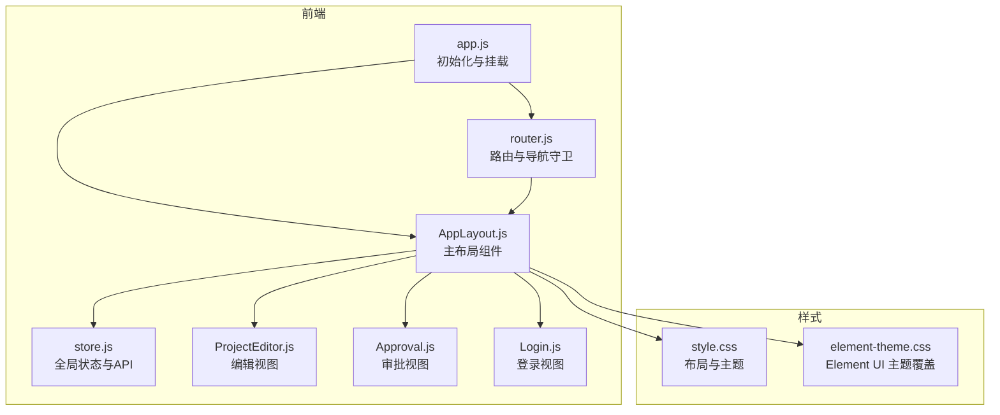
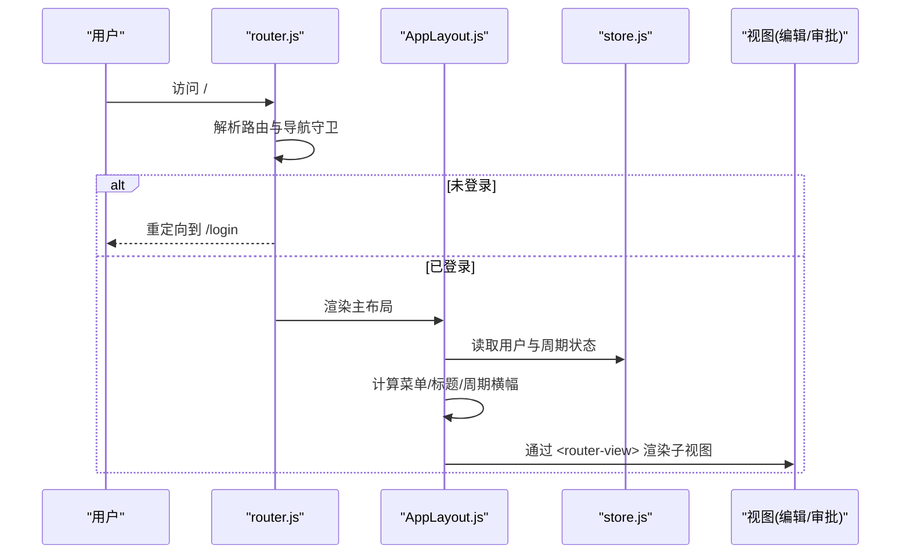
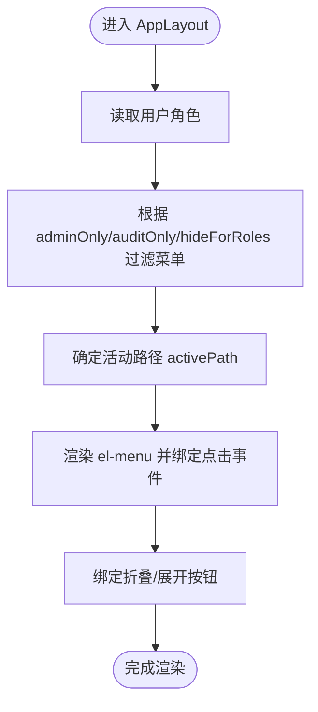
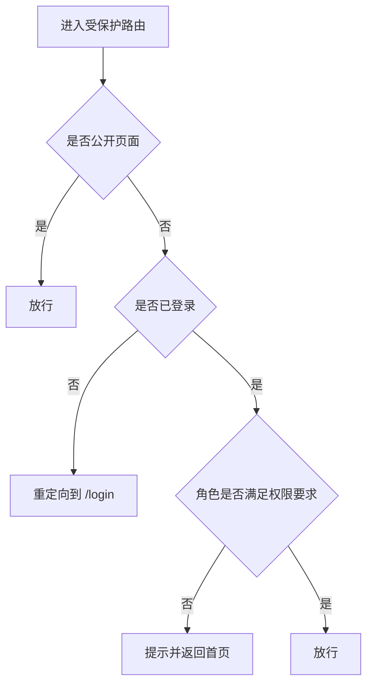
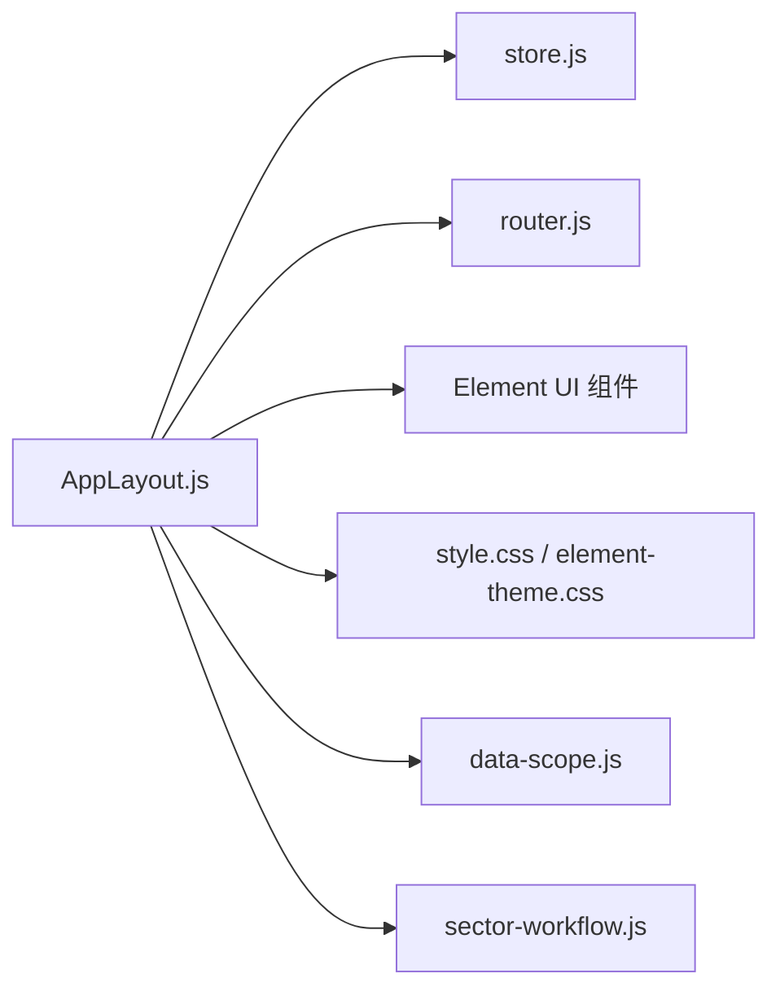

# 布局组件

<cite>
**本文引用的文件**
- [AppLayout.js](file://js/components/AppLayout.js)
- [app.js](file://js/app.js)
- [router.js](file://js/router.js)
- [store.js](file://js/store.js)
- [Login.js](file://js/views/Login.js)
- [ProjectEditor.js](file://js/views/ProjectEditor.js)
- [Approval.js](file://js/views/Approval.js)
- [style.css](file://css/style.css)
- [element-theme.css](file://css/element-theme.css)
- [data-scope.js](file://js/data-scope.js)
- [sector-workflow.js](file://js/sector-workflow.js)
</cite>

## 目录
1. [简介](#简介)
2. [项目结构](#项目结构)
3. [核心组件](#核心组件)
4. [架构总览](#架构总览)
5. [详细组件分析](#详细组件分析)
6. [依赖关系分析](#依赖关系分析)
7. [性能考量](#性能考量)
8. [故障排查指南](#故障排查指南)
9. [结论](#结论)
10. [附录](#附录)

## 简介
本文件聚焦于主布局组件 AppLayout 的设计与实现，系统性阐述其在项目执行追踪平台中的职责与交互方式。AppLayout 作为应用的“骨架”，负责：
- 侧边栏导航系统：根据用户角色动态呈现菜单项，并支持折叠/展开
- 顶栏用户信息展示：显示用户姓名、角色标签与操作入口
- 内容区域路由渲染：承载各视图（编辑、审批、审计、管理等）的渲染
- 角色权限控制：通过路由守卫与组件计算属性共同实现菜单与页面访问限制
- 响应式布局与折叠状态管理：基于全局状态与样式变量实现流畅的交互体验

此外，文档还提供 props 配置、事件处理、模板结构分析，以及不同角色下的行为差异与配置选项说明，帮助开发者快速理解与扩展布局能力。

## 项目结构
AppLayout 所在的前端采用“组件 + 视图 + 状态 + 样式”的分层组织方式：
- 组件层：AppLayout.js 定义主布局组件
- 视图层：ProjectEditor.js、Approval.js 等承载具体业务页面
- 状态层：store.js 提供全局状态与 API 交互
- 路由层：router.js 定义路由与导航守卫
- 初始化：app.js 注册组件、挂载 Vue 实例
- 样式层：style.css 定义布局与主题样式，element-theme.css 覆盖 Element UI 主题

图表来源
- [app.js:1-47](file://js/app.js#L1-L47)
- [router.js:1-137](file://js/router.js#L1-L137)
- [store.js:1-602](file://js/store.js#L1-L602)
- [AppLayout.js:1-240](file://js/components/AppLayout.js#L1-L240)
- [ProjectEditor.js:1-800](file://js/views/ProjectEditor.js#L1-L800)
- [Approval.js:1-475](file://js/views/Approval.js#L1-L475)
- [Login.js:1-215](file://js/views/Login.js#L1-L215)
- [style.css:1-800](file://css/style.css#L1-L800)
- [element-theme.css:1-406](file://css/element-theme.css#L1-L406)

章节来源
- [app.js:1-47](file://js/app.js#L1-L47)
- [router.js:1-137](file://js/router.js#L1-L137)
- [store.js:1-602](file://js/store.js#L1-L602)
- [AppLayout.js:1-240](file://js/components/AppLayout.js#L1-L240)

## 核心组件
AppLayout 是一个基于 Vue 的单文件组件，采用函数式封装并通过 window 暴露给全局使用。其核心特性包括：
- 角色标签与导航菜单：通过 ROLE_LABELS 与 NAV_ITEMS 定义角色标签与菜单项，并结合用户角色进行过滤
- 填报期状态与周期横幅：根据锁定期与财务核查期显示不同的周期横幅提示
- 侧边栏折叠状态：通过 Store.sidebarCollapsed 控制折叠/展开，并持久化到 localStorage
- 顶栏用户下拉菜单：提供切换角色、重置开发环境、退出登录等操作
- 内容区路由渲染：通过 <router-view> 承载子视图

章节来源
- [AppLayout.js:31-133](file://js/components/AppLayout.js#L31-L133)
- [AppLayout.js:134-238](file://js/components/AppLayout.js#L134-L238)

## 架构总览
AppLayout 的运行时架构围绕“组件 + 路由 + 状态”三者协作展开：
- 组件层：AppLayout 负责布局与交互，计算属性驱动菜单、标题、周期横幅与折叠状态
- 路由层：router.js 定义主布局路由与子视图，并在导航守卫中实施权限控制
- 状态层：store.js 提供用户、报表周期、锁定期、快照等全局状态，并维护侧边栏折叠状态

图表来源
- [router.js:71-132](file://js/router.js#L71-L132)
- [AppLayout.js:36-86](file://js/components/AppLayout.js#L36-L86)
- [store.js:97-128](file://js/store.js#L97-L128)

## 详细组件分析

### AppLayout 组件结构与模板
- 布局容器：.app-layout 使用 flex 布局，主区域占满剩余空间
- 侧边栏：.app-sidebar 包含 logo、导航菜单、底部状态与折叠按钮；支持折叠状态切换
- 顶栏：.app-header 展示页面标题与用户下拉菜单
- 内容区：.app-content 承载 <router-view>，在特定路径下移除内边距以适配编辑器

章节来源
- [AppLayout.js:134-238](file://js/components/AppLayout.js#L134-L238)
- [style.css:88-311](file://css/style.css#L88-L311)

### 侧边栏导航系统
- 菜单项定义：NAV_ITEMS 列表包含路径、图标、标签与权限控制字段（adminOnly、auditOnly、hideForRoles）
- 动态过滤：navItems 计算属性依据用户角色过滤菜单项，确保仅显示允许访问的页面
- 活动状态：activePath 基于当前路由与用户角色决定默认激活项
- 折叠逻辑：toggleSidebar 与 sidebarCollapsed 控制侧边栏宽度与过渡动画

图表来源
- [AppLayout.js:18-24](file://js/components/AppLayout.js#L18-L24)
- [AppLayout.js:47-58](file://js/components/AppLayout.js#L47-L58)
- [AppLayout.js:77-86](file://js/components/AppLayout.js#L77-L86)
- [AppLayout.js:88-90](file://js/components/AppLayout.js#L88-L90)

章节来源
- [AppLayout.js:18-58](file://js/components/AppLayout.js#L18-L58)
- [AppLayout.js:88-90](file://js/components/AppLayout.js#L88-L90)

### 顶栏用户信息展示
- 用户头像：首字母徽标，圆角背景与品牌色
- 角色标签：roleName 计算属性根据角色与数据范围生成标签文本
- 下拉菜单：提供“切换角色”、“重置为初始状态（开发）”、“退出登录”等入口
- 登出流程：handleLogout 使用确认对话框，确认后调用 Store.logout 并跳转到登录页

章节来源
- [AppLayout.js:39-46](file://js/components/AppLayout.js#L39-L46)
- [AppLayout.js:202-229](file://js/components/AppLayout.js#L202-L229)
- [AppLayout.js:91-98](file://js/components/AppLayout.js#L91-L98)

### 内容区域路由渲染
- 路由结构：主路由 / 挂载 AppLayout，子路由包含 editor、approval、audit、fields、admin
- 首页重定向：根据用户角色重定向到 editor 或 approval
- 子视图：ProjectEditor.js 与 Approval.js 分别承载编辑与审批视图

章节来源
- [router.js:12-69](file://js/router.js#L12-L69)
- [router.js:7-10](file://js/router.js#L7-L10)
- [ProjectEditor.js:64-111](file://js/views/ProjectEditor.js#L64-L111)
- [Approval.js:52-68](file://js/views/Approval.js#L52-L68)

### 角色权限控制机制
- 组件级控制：navItems 计算属性基于角色过滤菜单项
- 路由级控制：router.js 在导航守卫中对 admin、audit、approval、fields 等路径进行角色校验
- 特殊角色：executive_viewer（经营管理只读）、sector_director/group_leader（仅审批）

图表来源
- [router.js:85-132](file://js/router.js#L85-L132)
- [AppLayout.js:47-58](file://js/components/AppLayout.js#L47-L58)

章节来源
- [router.js:77-132](file://js/router.js#L77-L132)
- [AppLayout.js:47-58](file://js/components/AppLayout.js#L47-L58)

### 响应式布局与折叠状态管理
- 布局变量：style.css 定义了 --sidebar-width、--sidebar-width-collapsed、--header-height 等变量
- 折叠状态：Store.sidebarCollapsed 控制侧边栏宽度与过渡动画；toggleSidebar 与 setSidebarCollapsed 提供切换与设置接口
- 本地存储：localStorage 持久化折叠状态，保证刷新后保持一致

章节来源
- [style.css:6-49](file://css/style.css#L6-L49)
- [style.css:95-108](file://css/style.css#L95-L108)
- [store.js:310-318](file://js/store.js#L310-L318)
- [store.js:125](file://js/store.js#L125)

### 用户体验优化策略
- 周期横幅：根据 lockStatus 与 financeReviewReminder 显示“填报中/已锁定/财务核查期”等提示
- 页面标题：根据当前路径匹配 NAV_ITEMS 的 label 作为页面标题
- 内容区适配：在 editor 与审批仅读场景下移除内边距，最大化编辑器可用空间

章节来源
- [AppLayout.js:59-86](file://js/components/AppLayout.js#L59-L86)
- [AppLayout.js:232-234](file://js/components/AppLayout.js#L232-L234)

### 不同角色的行为差异与配置选项
- 系统管理员：可访问 fields、admin、audit；navItems 过滤后包含“表头配置”、“管理设置”、“审计日志”
- 经营管理（只读）：navItems 过滤后仅包含“项目追踪表”；roleName 会附加数据范围标签
- 板块管理员：可访问 editor；在编辑页会同步 PM 工作流
- 项目经理：仅能访问 editor；可提交 PM 报表
- 板块总监/项目群群主：仅能访问 approval；可推进审批流程

章节来源
- [AppLayout.js:7-14](file://js/components/AppLayout.js#L7-L14)
- [AppLayout.js:18-24](file://js/components/AppLayout.js#L18-L24)
- [router.js:97-129](file://js/router.js#L97-L129)
- [Login.js:7-50](file://js/views/Login.js#L7-L50)
- [data-scope.js:44-60](file://js/data-scope.js#L44-L60)
- [sector-workflow.js:159-178](file://js/sector-workflow.js#L159-L178)

## 依赖关系分析
AppLayout 的关键依赖与耦合关系如下：
- 依赖 store.js：读取用户、周期、锁定期、快照、侧边栏状态等
- 依赖 router.js：通过 $route/$router 获取当前路径与跳转
- 依赖 Element UI：使用 el-menu、el-dropdown、el-button 等组件
- 依赖样式：style.css 与 element-theme.css 提供布局与主题

图表来源
- [AppLayout.js:36-86](file://js/components/AppLayout.js#L36-L86)
- [store.js:97-128](file://js/store.js#L97-L128)
- [router.js:71-75](file://js/router.js#L71-L75)
- [style.css:1-800](file://css/style.css#L1-L800)
- [element-theme.css:1-406](file://css/element-theme.css#L1-L406)
- [data-scope.js:66-71](file://js/data-scope.js#L66-L71)
- [sector-workflow.js:159-178](file://js/sector-workflow.js#L159-L178)

章节来源
- [AppLayout.js:36-86](file://js/components/AppLayout.js#L36-L86)
- [store.js:97-128](file://js/store.js#L97-L128)
- [router.js:71-75](file://js/router.js#L71-L75)

## 性能考量
- 计算属性缓存：navItems、roleName、lockInfo 等计算属性基于 Store 与路由状态，避免重复计算
- 路由守卫：在导航阶段进行权限判断，减少无效渲染
- 折叠状态持久化：通过 localStorage 缓存侧边栏状态，避免每次刷新重新计算
- 样式变量：使用 CSS 变量统一管理尺寸与颜色，便于主题切换与性能优化

[本节为通用指导，不直接分析具体文件]

## 故障排查指南
- 登录后无法进入主布局
  - 检查 Store.currentUser 是否存在
  - 确认路由守卫未拦截（requiresAuth 且已登录）
- 菜单显示异常
  - 检查用户角色是否正确传入
  - 确认 navItems 过滤逻辑与 hideForRoles/adminOnly/auditOnly 配置
- 侧边栏无法折叠/展开
  - 检查 toggleSidebar 是否被调用
  - 确认 localStorage 中的折叠状态键值是否存在
- 周期横幅不显示
  - 检查 Store.lockStatus 与 Store.financeReviewReminder 的计算结果
  - 确认 periodBannerInfo 的分支逻辑

章节来源
- [store.js:97-128](file://js/store.js#L97-L128)
- [router.js:85-132](file://js/router.js#L85-L132)
- [AppLayout.js:47-76](file://js/components/AppLayout.js#L47-L76)
- [store.js:310-318](file://js/store.js#L310-L318)

## 结论
AppLayout 通过清晰的角色权限控制、灵活的侧边栏折叠与响应式布局，构建了稳定高效的主界面骨架。其与 store.js、router.js 的紧密协作，确保了菜单可见性、页面访问控制与用户体验的一致性。对于后续扩展，建议：
- 将菜单配置迁移到外部配置文件，便于非开发人员维护
- 增加更多角色的可视化标签与数据范围提示
- 优化折叠状态的动画与过渡，提升交互流畅度

[本节为总结性内容，不直接分析具体文件]

## 附录

### Props 配置与事件处理
- 组件名称：AppLayout
- 计算属性
  - store：全局状态引用
  - user：当前用户对象
  - roleName：角色标签（含数据范围标签）
  - navItems：根据角色过滤后的菜单项
  - approvalOnlyNav：是否仅审批角色
  - lockInfo：锁定期状态
  - periodBannerInfo：周期横幅信息
  - activePath：当前激活路径
  - pageTitle：页面标题
  - reportingMonth：当前报告月
  - sidebarCollapsed：侧边栏折叠状态
- 方法
  - goTo(path)：跳转到指定路径
  - toggleSidebar()：切换侧边栏折叠状态
  - handleLogout()：退出登录
  - handleResetDev()：开发环境重置

章节来源
- [AppLayout.js:31-133](file://js/components/AppLayout.js#L31-L133)

### 模板结构要点
- 侧边栏
  - logo 区域：展开/折叠两种形态
  - 导航菜单：el-menu + el-menu-item，绑定点击事件
  - 底部状态：显示填报月份与周期横幅
  - 折叠按钮：展开/收起菜单
- 顶栏
  - 页面标题：根据当前路径动态显示
  - 用户下拉菜单：包含角色信息、切换角色、重置开发、退出登录
- 内容区
  - <router-view> 承载子视图
  - 在特定路径下移除内边距以适配编辑器

章节来源
- [AppLayout.js:134-238](file://js/components/AppLayout.js#L134-L238)