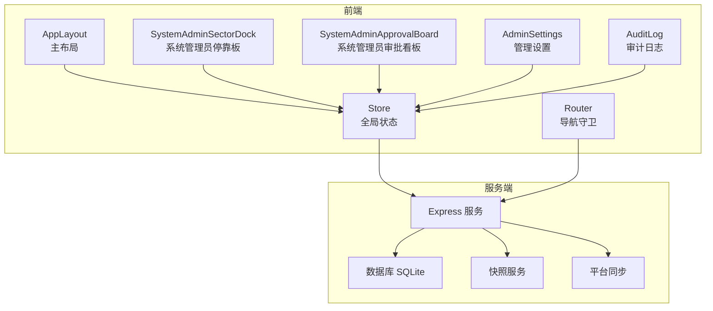
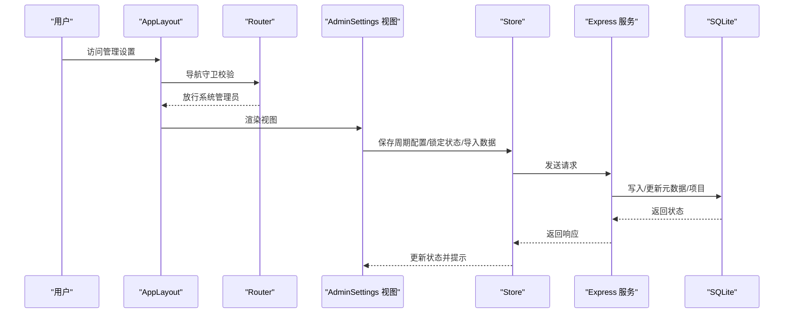
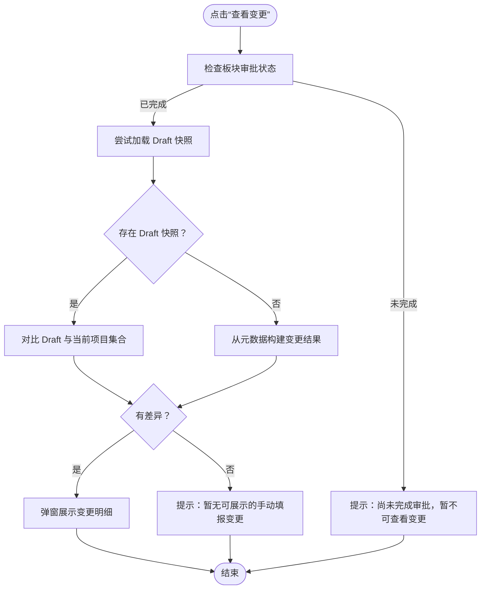
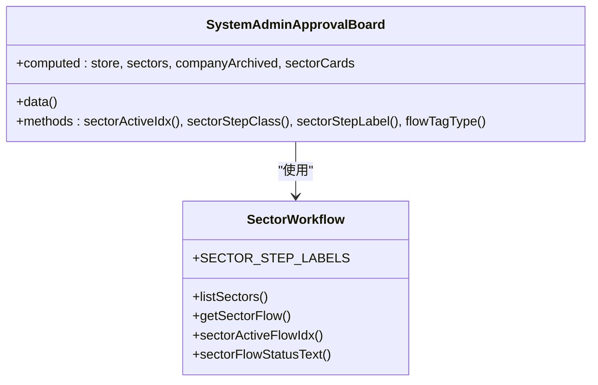
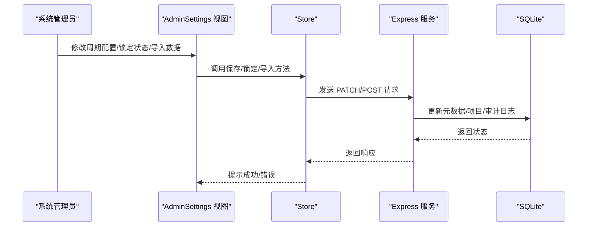
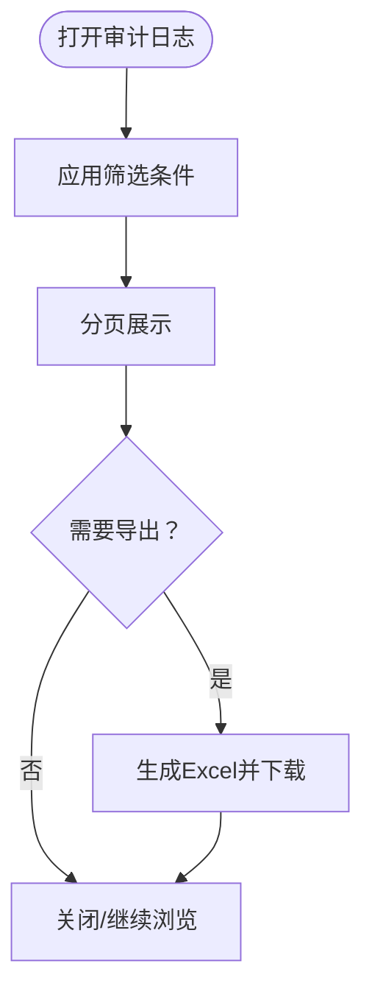
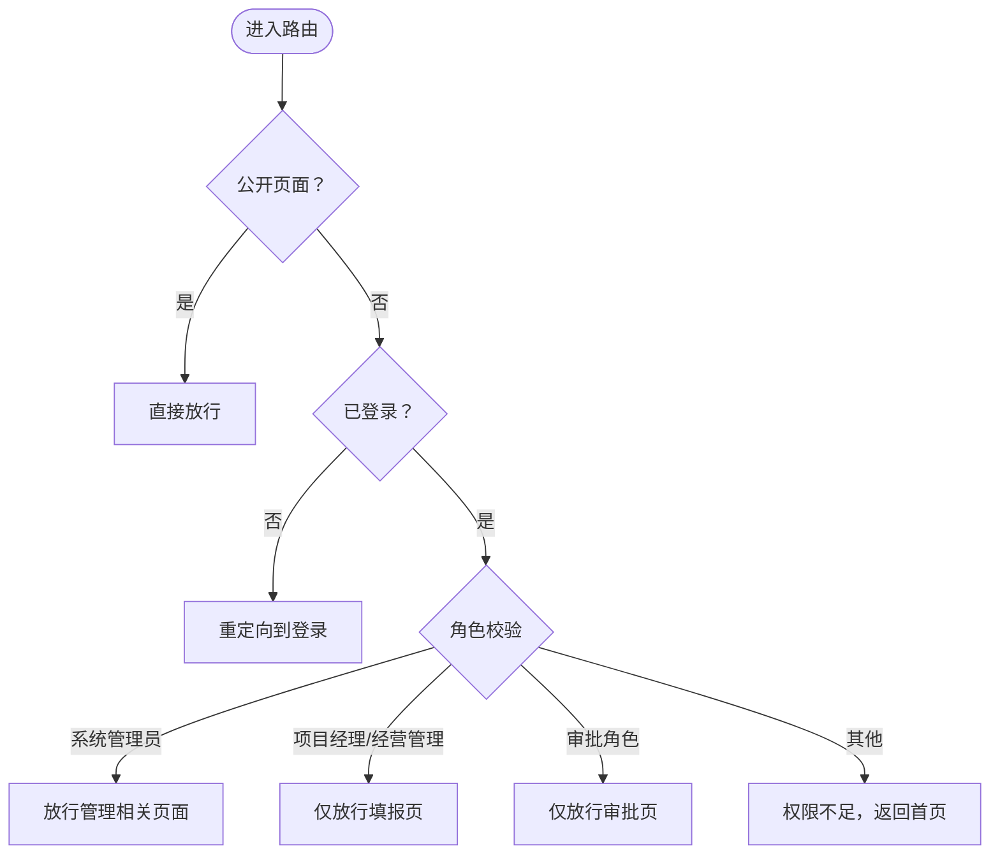
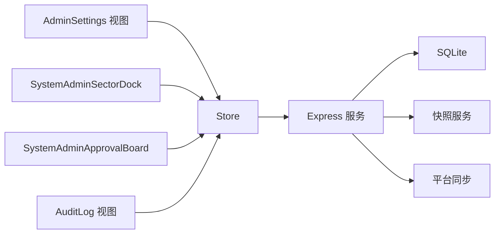

# 系统管理组件

<cite>
**本文档引用的文件**
- [SystemAdminSectorDock.js](file://js/components/SystemAdminSectorDock.js)
- [SystemAdminApprovalBoard.js](file://js/components/SystemAdminApprovalBoard.js)
- [AdminSettings.js](file://js/views/AdminSettings.js)
- [AppLayout.js](file://js/components/AppLayout.js)
- [AuditLog.js](file://js/views/AuditLog.js)
- [store.js](file://js/store.js)
- [router.js](file://js/router.js)
- [index.js](file://server/index.js)
- [sector-workflow.js](file://js/sector-workflow.js)
- [diff-utils.js](file://js/diff-utils.js)
- [package.json](file://package.json)
</cite>

## 目录
1. [简介](#简介)
2. [项目结构](#项目结构)
3. [核心组件](#核心组件)
4. [架构总览](#架构总览)
5. [详细组件分析](#详细组件分析)
6. [依赖关系分析](#依赖关系分析)
7. [性能考量](#性能考量)
8. [故障排除指南](#故障排除指南)
9. [结论](#结论)
10. [附录](#附录)

## 简介
本文件系统性梳理“系统管理组件”的设计与实现，聚焦系统管理员在平台管理中的特殊权限与功能边界，涵盖系统配置、用户管理、数据维护等后台管理能力，并深入分析安全控制机制、操作审计与权限验证。文档还提供界面设计要点、操作流程图示、故障排除方法以及最佳实践建议，帮助读者快速理解并高效使用系统管理功能。

## 项目结构
系统管理组件主要分布在前端视图层与服务端 API 层：
- 前端组件与视图：系统管理员停靠板、审批看板、管理设置、审计日志、主布局与导航守卫
- 状态与路由：全局状态 Store、Vue Router 导航守卫
- 服务端 API：系统管理端点（用户配置、字段字典、数据导入/重置、快照与归档、平台数据同步等）

图表来源
- [AppLayout.js:134-237](file://js/components/AppLayout.js#L134-L237)
- [SystemAdminSectorDock.js:172-208](file://js/components/SystemAdminSectorDock.js#L172-L208)
- [SystemAdminApprovalBoard.js:57-79](file://js/components/SystemAdminApprovalBoard.js#L57-L79)
- [AdminSettings.js:193-401](file://js/views/AdminSettings.js#L193-L401)
- [AuditLog.js:88-236](file://js/views/AuditLog.js#L88-L236)
- [store.js:97-128](file://js/store.js#L97-L128)
- [router.js:71-136](file://js/router.js#L71-L136)
- [index.js:88-100](file://server/index.js#L88-L100)

章节来源
- [package.json:1-19](file://package.json#L1-L19)

## 核心组件
- 系统管理员停靠板：展示各板块进度、审批状态与变更对比，支持查看手动填报变更详情
- 系统管理员审批看板：并行展示十二板块审批流程步骤与状态
- 管理设置：系统配置（周期、锁定）、数据导入/重置、用户与板块管理员配置
- 审计日志：多维筛选、分页、导出
- 主布局与导航守卫：基于角色的权限控制与页面可见性

章节来源
- [SystemAdminSectorDock.js:7-214](file://js/components/SystemAdminSectorDock.js#L7-L214)
- [SystemAdminApprovalBoard.js:7-85](file://js/components/SystemAdminApprovalBoard.js#L7-L85)
- [AdminSettings.js:8-403](file://js/views/AdminSettings.js#L8-L403)
- [AuditLog.js:8-238](file://js/views/AuditLog.js#L8-L238)
- [AppLayout.js:31-239](file://js/components/AppLayout.js#L31-L239)
- [router.js:7-136](file://js/router.js#L7-L136)

## 架构总览
系统采用前后端分离架构：
- 前端通过 Store 发起 API 请求，服务端以 Express 提供 REST 接口，数据持久化于 SQLite
- 系统管理员拥有最高权限，可执行配置变更、数据导入/重置、快照与归档、平台数据同步等操作
- 审计日志贯穿所有关键操作，确保可追溯性

图表来源
- [router.js:84-132](file://js/router.js#L84-L132)
- [AdminSettings.js:81-191](file://js/views/AdminSettings.js#L81-L191)
- [store.js:541-552](file://js/store.js#L541-L552)
- [index.js:198-218](file://server/index.js#L198-L218)

## 详细组件分析

### 系统管理员停靠板（SystemAdminSectorDock）
- 功能概述
  - 展示各板块的审批状态与进度标签
  - 支持展开/收起面板
  - 查看手动填报变更：对比 Draft 提交时与当前追踪表差异
- 关键逻辑
  - 计算板块卡片列表与审批状态文本
  - 仅当板块完成审批后才允许查看变更
  - 使用快照对比与字段级差异工具生成变更明细
- 安全与权限
  - 仅系统管理员可见并可操作
  - 变更查看受“板块审批完成”条件限制

图表来源
- [SystemAdminSectorDock.js:115-170](file://js/components/SystemAdminSectorDock.js#L115-L170)
- [sector-workflow.js:109-124](file://js/sector-workflow.js#L109-L124)
- [diff-utils.js:14-49](file://js/diff-utils.js#L14-L49)

章节来源
- [SystemAdminSectorDock.js:47-171](file://js/components/SystemAdminSectorDock.js#L47-L171)
- [sector-workflow.js:76-133](file://js/sector-workflow.js#L76-L133)
- [diff-utils.js:7-49](file://js/diff-utils.js#L7-L49)

### 系统管理员审批看板（SystemAdminApprovalBoard）
- 功能概述
  - 展示十二板块的审批流程步骤（提交填报、总监初审、群主复审）
  - 根据审批状态与归档状态动态渲染步骤状态
- 关键逻辑
  - 计算每个板块的活动步骤索引
  - 根据状态渲染步骤标签类型与文字

图表来源
- [SystemAdminApprovalBoard.js:7-56](file://js/components/SystemAdminApprovalBoard.js#L7-L56)
- [sector-workflow.js:159-178](file://js/sector-workflow.js#L159-L178)

章节来源
- [SystemAdminApprovalBoard.js:14-56](file://js/components/SystemAdminApprovalBoard.js#L14-L56)
- [sector-workflow.js:109-124](file://js/sector-workflow.js#L109-L124)

### 管理设置（AdminSettings）
- 功能概述
  - 填报周期配置：报告月、提醒日、锁定日、解禁日、自动解锁
  - 数据锁定控制：立即锁定/解除锁定，财务核查提醒期提示
  - 初始数据导入：上传 Excel，覆盖当前项目数据，写入审计日志
  - 从初始 Excel 恢复：重置流程与数据，保留历史快照
  - 系统用户：板块管理员配置（姓名、用户ID、跳过总监初审）
  - 系统信息：项目数、审计日志数、快照数、报告月、存储位置
- 权限与安全
  - 仅系统管理员可修改设置、导入数据、配置用户
  - 操作均写入审计日志，便于追溯
- 关键交互
  - 保存周期配置：弹窗确认、写入审计日志
  - 锁定/解锁：弹窗确认、写入审计日志
  - 导入：文件选择、确认覆盖、替换项目、写入审计日志
  - 保存用户配置：合并更新、写入审计日志

图表来源
- [AdminSettings.js:81-191](file://js/views/AdminSettings.js#L81-L191)
- [store.js:541-552](file://js/store.js#L541-L552)
- [index.js:198-218](file://server/index.js#L198-L218)

章节来源
- [AdminSettings.js:59-191](file://js/views/AdminSettings.js#L59-L191)
- [store.js:530-552](file://js/store.js#L530-L552)
- [index.js:198-218](file://server/index.js#L198-L218)

### 审计日志（AuditLog）
- 功能概述
  - 多维筛选：日期范围、操作人、项目号/名称、字段名
  - 分页展示：每页固定条目
  - 导出：导出为 Excel 文件
- 安全与权限
  - 仅系统管理员可访问审计日志页面
  - 日志记录包含时间戳、操作人、角色、项目、字段、原值、新值等

图表来源
- [AuditLog.js:23-86](file://js/views/AuditLog.js#L23-L86)
- [router.js:103-107](file://js/router.js#L103-L107)

章节来源
- [AuditLog.js:20-86](file://js/views/AuditLog.js#L20-L86)
- [router.js:103-107](file://js/router.js#L103-L107)

### 主布局与导航守卫（AppLayout + Router）
- 功能概述
  - 基于角色的侧边栏导航与页面可见性
  - 系统管理员专属入口：管理设置、审计日志、表头配置
  - 页面标题、当前角色、周期状态提示
- 权限控制
  - 系统管理员：可访问管理设置、审计日志、表头配置
  - 项目经理/经营管理（只读）：仅可访问填报页
  - 审批角色（板块总监/群主）：仅可访问审批流程

图表来源
- [router.js:84-132](file://js/router.js#L84-L132)
- [AppLayout.js:18-54](file://js/components/AppLayout.js#L18-L54)

章节来源
- [AppLayout.js:36-86](file://js/components/AppLayout.js#L36-L86)
- [router.js:84-132](file://js/router.js#L84-L132)

## 依赖关系分析
- 前端依赖
  - Vue 生态：组件化、响应式状态、模板渲染
  - Element UI：表单、表格、对话框、按钮、标签等
  - SheetJS：审计日志导出
- 后端依赖
  - Express：Web 服务框架
  - better-sqlite3：SQLite 数据库驱动
  - xlsx：Excel 文件处理
- 关键依赖链
  - AdminSettings -> Store -> Express API -> SQLite
  - SystemAdminSectorDock -> SectorWorkflow + DiffUtils -> Store -> Express API
  - AuditLog -> Store -> Express API

图表来源
- [AdminSettings.js:81-191](file://js/views/AdminSettings.js#L81-L191)
- [SystemAdminSectorDock.js:115-170](file://js/components/SystemAdminSectorDock.js#L115-L170)
- [SystemAdminApprovalBoard.js:14-56](file://js/components/SystemAdminApprovalBoard.js#L14-L56)
- [AuditLog.js:61-81](file://js/views/AuditLog.js#L61-L81)
- [store.js:268-287](file://js/store.js#L268-L287)
- [index.js:88-100](file://server/index.js#L88-L100)

章节来源
- [package.json:13-17](file://package.json#L13-L17)

## 性能考量
- 前端
  - 大数据量导出：审计日志导出使用 SheetJS，建议在浏览器端进行分批处理或服务端导出以避免阻塞
  - 变更对比：字段级差异计算在前端完成，建议限制对比字段数量或分页展示
- 后端
  - SQLite 查询：审计日志与项目查询应配合索引优化（如按时间、项目号、用户名）
  - 快照存储：定期维护与清理历史快照，避免占用过多磁盘空间
- 缓存与并发
  - Store 与服务端状态同步时，注意幂等性与一致性，避免重复写入

## 故障排除指南
- 管理设置页面无权限
  - 现象：提示“仅系统管理员可修改设置”
  - 处理：切换为系统管理员账号后重试
- 锁定/解锁失败
  - 现象：操作失败或提示异常
  - 处理：检查服务端日志，确认周期配置与锁定状态计算逻辑；必要时手动重置开发环境
- 数据导入失败
  - 现象：未识别到有效数据或导入失败
  - 处理：确认 Excel 列顺序与字段字典一致；检查文件格式；重试导入
- 变更对比为空
  - 现象：点击“查看变更”后提示暂无可展示的手动填报变更
  - 处理：确认板块已完成审批；检查 Draft 快照是否存在；若无快照则使用元数据构建结果
- 审计日志为空
  - 现象：审计日志页面无记录
  - 处理：确认当前角色为系统管理员；检查服务端审计日志写入是否正常

章节来源
- [AdminSettings.js:196-203](file://js/views/AdminSettings.js#L196-L203)
- [store.js:530-552](file://js/store.js#L530-L552)
- [index.js:170-182](file://server/index.js#L170-L182)
- [SystemAdminSectorDock.js:115-170](file://js/components/SystemAdminSectorDock.js#L115-L170)
- [AuditLog.js:227-235](file://js/views/AuditLog.js#L227-L235)

## 结论
系统管理组件围绕“系统管理员”这一最高权限角色构建，覆盖配置管理、用户与板块管理员维护、数据导入/重置、审批流程监控与审计日志等关键后台能力。通过严格的前端导航守卫与后端 API 控制，确保只有授权用户可执行敏感操作；通过审计日志实现全流程可追溯。整体架构清晰、职责明确，适合在生产环境中稳定运行。

## 附录
- 最佳实践
  - 严格区分角色权限，避免越权操作
  - 所有配置变更与数据导入均需二次确认并写入审计日志
  - 定期备份 SQLite 数据库与快照，确保可恢复性
  - 对大体量导出与对比操作进行性能优化与分批处理
- 注意事项
  - 系统管理员账号应妥善保管，避免泄露
  - 导入数据前建议先备份当前状态
  - 财务核查提醒期仅财务角色只读，避免误操作