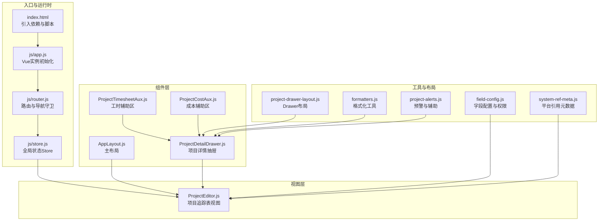
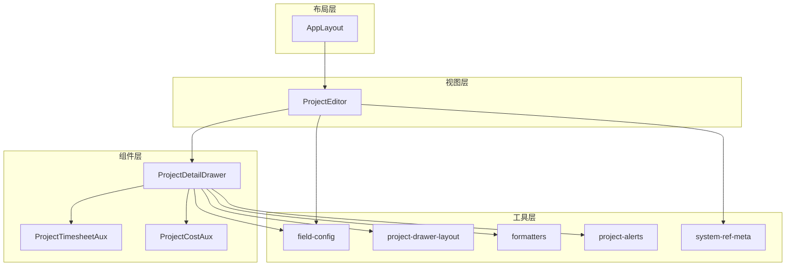
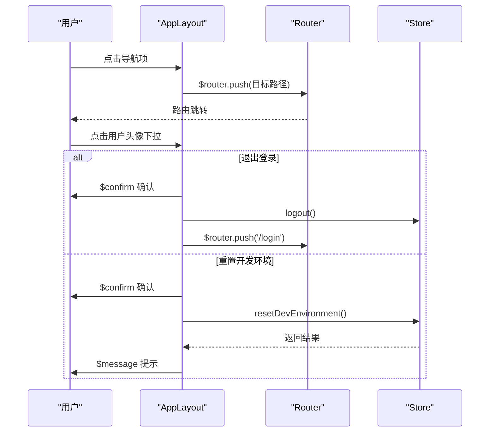
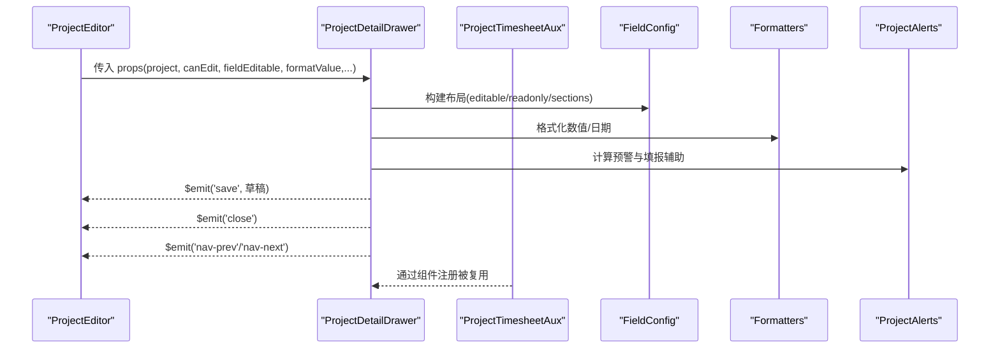
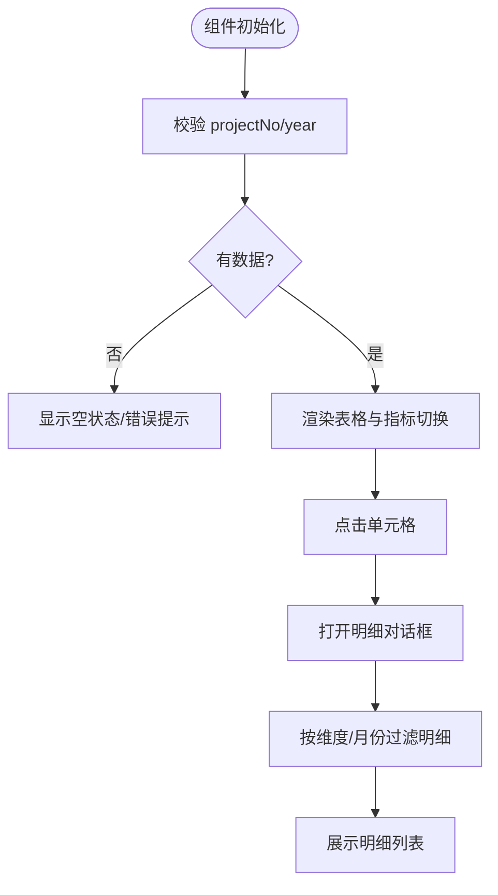
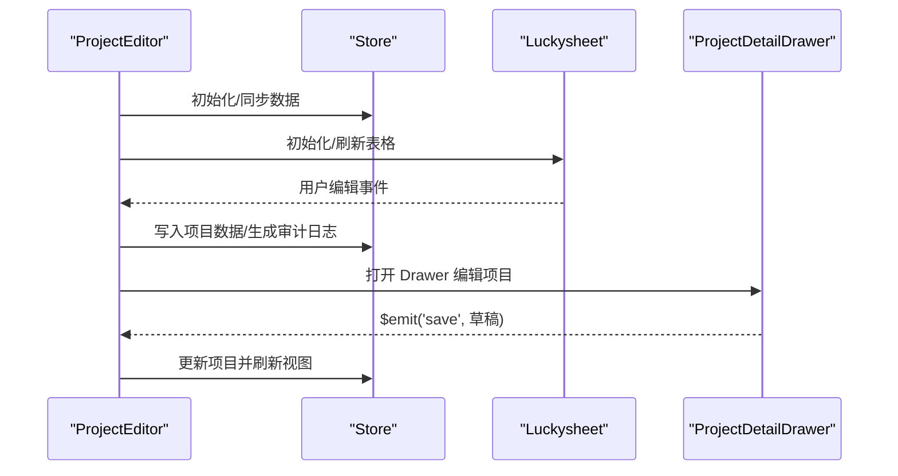
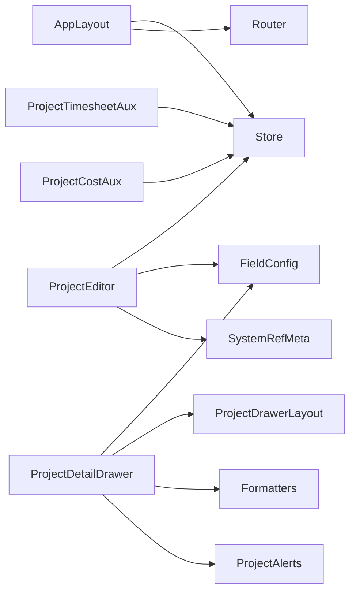

# 组件系统

<cite>
**本文引用的文件**
- [index.html](file://index.html)
- [js/app.js](file://js/app.js)
- [js/router.js](file://js/router.js)
- [js/store.js](file://js/store.js)
- [js/components/AppLayout.js](file://js/components/AppLayout.js)
- [js/components/ProjectDetailDrawer.js](file://js/components/ProjectDetailDrawer.js)
- [js/components/ProjectTimesheetAux.js](file://js/components/ProjectTimesheetAux.js)
- [js/components/ProjectCostAux.js](file://js/components/ProjectCostAux.js)
- [js/project-drawer-layout.js](file://js/project-drawer-layout.js)
- [js/views/ProjectEditor.js](file://js/views/ProjectEditor.js)
- [js/field-config.js](file://js/field-config.js)
- [js/formatters.js](file://js/formatters.js)
- [js/project-alerts.js](file://js/project-alerts.js)
- [js/system-ref-meta.js](file://js/system-ref-meta.js)
</cite>

## 目录
1. [简介](#简介)
2. [项目结构](#项目结构)
3. [核心组件](#核心组件)
4. [架构总览](#架构总览)
5. [组件详解](#组件详解)
6. [依赖关系分析](#依赖关系分析)
7. [性能考量](#性能考量)
8. [故障排查指南](#故障排查指南)
9. [结论](#结论)
10. [附录](#附录)

## 简介
本项目采用 Vue 2 + Element UI + Luckysheet 的前端技术栈，围绕“主布局 + 视图 + 组件 + 工具模块”的分层组织方式构建。组件系统以 AppLayout 为主布局容器，承载侧边导航、顶部用户信息与内容区域；ProjectDetailDrawer 作为核心交互组件，负责项目数据的查看与编辑；ProjectTimesheetAux 与 ProjectCostAux 作为 Drawer 的辅助区，提供工时与成本的多维统计与明细查看；ProjectEditor 作为主视图，集成 Luckysheet 表格与权限控制、差异高亮、快照对比等功能。

## 项目结构
- 入口与运行时
  - index.html 引入 Vue、Element UI、Luckysheet 与各脚本，按序加载数据层、组件层与视图层脚本。
  - js/app.js 初始化 Vue 实例，注册全局过滤器，挂载路由。
  - js/router.js 定义路由与导航守卫，控制访问权限与重定向。
  - js/store.js 提供全局状态 Store，封装与后端 API 的交互。
- 组件层
  - js/components/AppLayout.js：主布局组件，包含侧边栏、顶部栏与内容区。
  - js/components/ProjectDetailDrawer.js：项目详情抽屉，支持编辑、月度条带、辅助区联动。
  - js/components/ProjectTimesheetAux.js：工时统计辅助区。
  - js/components/ProjectCostAux.js：成本中心统计辅助区。
- 视图层
  - js/views/ProjectEditor.js：项目追踪表视图，集成 Luckysheet、权限控制、快照对比、导入导出等。
- 工具与布局
  - js/project-drawer-layout.js：Drawer 字段分区与控件类型推断。
  - js/field-config.js：字段配置与权限矩阵。
  - js/formatters.js：全局格式化工具。
  - js/project-alerts.js：项目预警与完成额填报辅助。
  - js/system-ref-meta.js：工程平台引用列的显示与覆盖逻辑。

**图表来源**
- [index.html:70-107](file://index.html#L70-L107)
- [js/app.js:22-46](file://js/app.js#L22-L46)
- [js/router.js:12-69](file://js/router.js#L12-L69)
- [js/store.js:97-128](file://js/store.js#L97-L128)
- [js/views/ProjectEditor.js:64-71](file://js/views/ProjectEditor.js#L64-L71)
- [js/components/AppLayout.js:31-238](file://js/components/AppLayout.js#L31-L238)
- [js/components/ProjectDetailDrawer.js:23-453](file://js/components/ProjectDetailDrawer.js#L23-L453)
- [js/components/ProjectTimesheetAux.js:21-192](file://js/components/ProjectTimesheetAux.js#L21-L192)
- [js/components/ProjectCostAux.js:24-156](file://js/components/ProjectCostAux.js#L24-L156)
- [js/project-drawer-layout.js:68-126](file://js/project-drawer-layout.js#L68-L126)
- [js/field-config.js:134-260](file://js/field-config.js#L134-L260)
- [js/formatters.js:13-165](file://js/formatters.js#L13-L165)
- [js/project-alerts.js:65-128](file://js/project-alerts.js#L65-L128)
- [js/system-ref-meta.js:93-168](file://js/system-ref-meta.js#L93-L168)

**章节来源**
- [index.html:70-107](file://index.html#L70-L107)
- [js/app.js:22-46](file://js/app.js#L22-L46)
- [js/router.js:12-69](file://js/router.js#L12-L69)
- [js/store.js:97-128](file://js/store.js#L97-L128)

## 核心组件
- AppLayout（主布局）
  - 职责：渲染侧边栏菜单、顶部用户信息、内容区；根据用户角色动态过滤导航项；提供切换侧边栏、退出登录、重置开发环境等能力。
  - 关键点：通过 Store 计算属性提供用户角色、导航项、锁定状态、当前页标题等；模板中使用 Element UI 的 el-menu 与 el-dropdown。
- ProjectDetailDrawer（项目详情抽屉）
  - 职责：基于字段配置与权限矩阵构建 Drawer 布局；支持可编辑字段、只读字段、月度条带、辅助区联动；提供保存、前后项目导航、预警提示等。
  - 关键点：依赖 ProjectDrawerLayout 构建布局；依赖 FieldConfig 决定可编辑性；依赖 Formatters 格式化数值；依赖 ProjectAlerts 生成预警与填报辅助。
- ProjectTimesheetAux（工时辅助区）
  - 职责：按专业/板块维度展示月度工时与工时成本统计，支持点击单元格查看明细。
- ProjectCostAux（成本辅助区）
  - 职责：按成本项维度展示月度成本统计，支持点击单元格查看明细。
- ProjectEditor（项目追踪表视图）
  - 职责：集成 Luckysheet 表格，实现权限控制、差异高亮、快照对比、导入导出、提交归档等。

**章节来源**
- [js/components/AppLayout.js:31-238](file://js/components/AppLayout.js#L31-L238)
- [js/components/ProjectDetailDrawer.js:23-453](file://js/components/ProjectDetailDrawer.js#L23-L453)
- [js/components/ProjectTimesheetAux.js:21-192](file://js/components/ProjectTimesheetAux.js#L21-L192)
- [js/components/ProjectCostAux.js:24-156](file://js/components/ProjectCostAux.js#L24-L156)
- [js/views/ProjectEditor.js:64-71](file://js/views/ProjectEditor.js#L64-L71)

## 架构总览
组件系统围绕“布局-视图-组件-工具”四层展开：
- 布局层：AppLayout 提供统一的导航与用户交互入口。
- 视图层：ProjectEditor 作为主视图，承载 Luckysheet 与业务功能。
- 组件层：ProjectDetailDrawer 及其辅助区（Timesheet/Cost）提供深度编辑体验。
- 工具层：field-config、project-drawer-layout、formatters、project-alerts、system-ref-meta 等提供权限、布局、格式化、预警与平台引用等支撑能力。

**图表来源**
- [js/components/AppLayout.js:31-238](file://js/components/AppLayout.js#L31-L238)
- [js/views/ProjectEditor.js:64-71](file://js/views/ProjectEditor.js#L64-L71)
- [js/components/ProjectDetailDrawer.js:23-453](file://js/components/ProjectDetailDrawer.js#L23-L453)
- [js/components/ProjectTimesheetAux.js:21-192](file://js/components/ProjectTimesheetAux.js#L21-L192)
- [js/components/ProjectCostAux.js:24-156](file://js/components/ProjectCostAux.js#L24-L156)
- [js/field-config.js:134-260](file://js/field-config.js#L134-L260)
- [js/project-drawer-layout.js:68-126](file://js/project-drawer-layout.js#L68-L126)
- [js/formatters.js:13-165](file://js/formatters.js#L13-L165)
- [js/project-alerts.js:65-128](file://js/project-alerts.js#L65-L128)
- [js/system-ref-meta.js:93-168](file://js/system-ref-meta.js#L93-L168)

## 组件详解

### AppLayout 组件
- 职责与交互
  - 根据用户角色动态生成导航项，隐藏/禁用特定路径。
  - 提供侧边栏折叠切换、用户信息下拉菜单、退出登录、重置开发环境等。
  - 通过 Store 计算属性提供锁定状态、当前页标题、报表月等。
- 通信与事件
  - 模板中通过 $router.push 导航；通过 $confirm/$message 与用户交互；通过 Store.logout 触发登出。
- 生命周期与状态
  - 使用 data 提供局部状态 resetDevLoading；通过 Store.toggleSidebar 控制侧边栏状态。

**图表来源**
- [js/components/AppLayout.js:88-133](file://js/components/AppLayout.js#L88-L133)
- [js/router.js:85-132](file://js/router.js#L85-L132)
- [js/store.js:283-288](file://js/store.js#L283-L288)

**章节来源**
- [js/components/AppLayout.js:31-238](file://js/components/AppLayout.js#L31-L238)
- [js/router.js:77-132](file://js/router.js#L77-L132)
- [js/store.js:310-318](file://js/store.js#L310-L318)

### ProjectDetailDrawer 组件
- 职责与布局
  - 基于 ProjectDrawerLayout 与 FieldConfig 动态构建“摘要区 + 跟踪信息填报 + 其他跟踪数据 + 辅助区”四段布局。
  - 支持可编辑字段（含长文本、金额、比率、日期）、只读字段、月度条带（完成/开票/回款）。
  - 通过辅助区（Timesheet/Cost）提供填报参考与明细查看。
- 通信与事件
  - 通过 visible 与 $emit('close') 控制抽屉显隐；通过 $emit('save') 传递草稿数据；通过 $emit('nav-prev'/'nav-next') 实现项目导航。
- 数据与格式化
  - 使用 Formatters 格式化金额/百分比/日期；使用 ProjectAlerts 生成预警标签与完成额填报辅助。
- 性能与复用
  - 通过 watch(visible/project/systemYear) 控制抽屉打开/关闭时的数据加载与清理；使用 $set 确保响应式更新草稿数据。

**图表来源**
- [js/components/ProjectDetailDrawer.js:31-453](file://js/components/ProjectDetailDrawer.js#L31-L453)
- [js/project-drawer-layout.js:68-126](file://js/project-drawer-layout.js#L68-L126)
- [js/field-config.js:134-260](file://js/field-config.js#L134-L260)
- [js/formatters.js:13-165](file://js/formatters.js#L13-L165)
- [js/project-alerts.js:65-128](file://js/project-alerts.js#L65-L128)

**章节来源**
- [js/components/ProjectDetailDrawer.js:23-453](file://js/components/ProjectDetailDrawer.js#L23-L453)
- [js/project-drawer-layout.js:68-126](file://js/project-drawer-layout.js#L68-L126)
- [js/field-config.js:134-260](file://js/field-config.js#L134-L260)
- [js/formatters.js:13-165](file://js/formatters.js#L13-L165)
- [js/project-alerts.js:65-128](file://js/project-alerts.js#L65-L128)

### ProjectTimesheetAux 与 ProjectCostAux
- 职责与交互
  - Timesheet：按专业/板块维度展示月度工时与工时成本，支持点击单元格查看明细；支持切换指标（工时/工时成本）。
  - Cost：按成本项维度展示月度成本，支持点击单元格查看明细。
- 数据加载与错误处理
  - 通过 fetch 请求 /api/projects/:projectNo/timesheet 或 /cost-center 接口；失败时显示错误文案；空数据时提示暂无。
- 复用与插槽
  - 作为 Drawer 的子组件被复用；内部使用 Element UI 的 el-table/el-dialog 展示统计与明细。

**图表来源**
- [js/components/ProjectTimesheetAux.js:121-192](file://js/components/ProjectTimesheetAux.js#L121-L192)
- [js/components/ProjectCostAux.js:96-156](file://js/components/ProjectCostAux.js#L96-L156)

**章节来源**
- [js/components/ProjectTimesheetAux.js:21-192](file://js/components/ProjectTimesheetAux.js#L21-L192)
- [js/components/ProjectCostAux.js:24-156](file://js/components/ProjectCostAux.js#L24-L156)

### ProjectEditor 视图
- 职责与功能
  - 集成 Luckysheet 表格，实现权限控制、差异高亮、快照对比、导入导出、提交归档等。
  - 通过 Store 同步数据与状态，支持板块管理员工作流与系统管理员平台数据刷新。
- 生命周期与状态
  - mounted/activated/beforeDestroy 中进行字段字典监听、Luckysheet 初始化/刷新/销毁、侧边栏变化监听与布局调整。
- 与 Drawer 的协作
  - 通过组件注册引入 ProjectDetailDrawer；通过 props 与事件与 Drawer 交互（打开/关闭、保存、导航）。

**图表来源**
- [js/views/ProjectEditor.js:112-167](file://js/views/ProjectEditor.js#L112-L167)
- [js/views/ProjectEditor.js:448-514](file://js/views/ProjectEditor.js#L448-L514)
- [js/views/ProjectEditor.js:64-71](file://js/views/ProjectEditor.js#L64-L71)
- [js/store.js:320-336](file://js/store.js#L320-L336)

**章节来源**
- [js/views/ProjectEditor.js:64-71](file://js/views/ProjectEditor.js#L64-L71)
- [js/views/ProjectEditor.js:112-167](file://js/views/ProjectEditor.js#L112-L167)
- [js/views/ProjectEditor.js:448-514](file://js/views/ProjectEditor.js#L448-L514)
- [js/store.js:320-336](file://js/store.js#L320-L336)

## 依赖关系分析
- 组件间依赖
  - AppLayout 依赖 Store 提供用户与导航信息；依赖 Router 进行导航。
  - ProjectDetailDrawer 依赖 FieldConfig、ProjectDrawerLayout、Formatters、ProjectAlerts、SystemRefMeta。
  - ProjectTimesheetAux/ProjectCostAux 依赖 Store 提供的 API 基址与项目号/年份参数。
  - ProjectEditor 依赖 Store、FieldConfig、SystemRefMeta、ProjectAlerts 等。
- 工具模块耦合
  - field-config 与 project-drawer-layout 为 Drawer 布局与权限提供基础；formatters 为数值/日期格式化提供统一入口；project-alerts 与 system-ref-meta 为预警与平台引用提供支撑。

**图表来源**
- [js/components/AppLayout.js:36-87](file://js/components/AppLayout.js#L36-L87)
- [js/views/ProjectEditor.js:64-71](file://js/views/ProjectEditor.js#L64-L71)
- [js/components/ProjectDetailDrawer.js:23-42](file://js/components/ProjectDetailDrawer.js#L23-L42)
- [js/components/ProjectTimesheetAux.js:21-36](file://js/components/ProjectTimesheetAux.js#L21-L36)
- [js/components/ProjectCostAux.js:24-37](file://js/components/ProjectCostAux.js#L24-L37)
- [js/field-config.js:134-260](file://js/field-config.js#L134-L260)
- [js/project-drawer-layout.js:68-126](file://js/project-drawer-layout.js#L68-L126)
- [js/formatters.js:13-165](file://js/formatters.js#L13-L165)
- [js/project-alerts.js:65-128](file://js/project-alerts.js#L65-L128)
- [js/system-ref-meta.js:93-168](file://js/system-ref-meta.js#L93-L168)

**章节来源**
- [js/components/AppLayout.js:36-87](file://js/components/AppLayout.js#L36-L87)
- [js/views/ProjectEditor.js:64-71](file://js/views/ProjectEditor.js#L64-L71)
- [js/components/ProjectDetailDrawer.js:23-42](file://js/components/ProjectDetailDrawer.js#L23-L42)
- [js/components/ProjectTimesheetAux.js:21-36](file://js/components/ProjectTimesheetAux.js#L21-L36)
- [js/components/ProjectCostAux.js:24-37](file://js/components/ProjectCostAux.js#L24-L37)
- [js/field-config.js:134-260](file://js/field-config.js#L134-L260)
- [js/project-drawer-layout.js:68-126](file://js/project-drawer-layout.js#L68-L126)
- [js/formatters.js:13-165](file://js/formatters.js#L13-L165)
- [js/project-alerts.js:65-128](file://js/project-alerts.js#L65-L128)
- [js/system-ref-meta.js:93-168](file://js/system-ref-meta.js#L93-L168)

## 性能考量
- 响应式与渲染优化
  - 使用 Vue.observable 的 Store 集中管理状态，减少跨组件重复请求；Drawer 通过 watch(visible/project/systemYear) 控制加载时机与资源释放。
  - ProjectEditor 在 activated 钩子中按角色同步工作流与数据，避免不必要的刷新。
- 网络与缓存
  - Store 的 apiFetch 统一封装 fetch 请求与错误处理；抽屉与辅助区按需发起 timesheet/cost-center 请求，失败时短路渲染。
- 表格与输入
  - Formatters 提供统一格式化，避免重复计算；ProjectDetailDrawer 使用 $set 确保草稿数据响应式更新，减少不必要的重渲染。
- 可维护性
  - 通过工具模块（field-config、project-drawer-layout、formatters、project-alerts、system-ref-meta）解耦权限、布局、格式化、预警与平台引用逻辑，提升可维护性。

[本节为通用指导，无需具体文件引用]

## 故障排查指南
- 登录与权限
  - 若出现权限不足或被重定向至首页，检查路由导航守卫与 Store.currentUser 角色；确认 admin/audit/fields 路由仅系统管理员可访问。
- 数据加载失败
  - Store.init 与 Store.ensureFieldDictionary 失败时会抛错；检查后端 /bootstrap 与 /fields 接口可用性；确认 config/fields 下存在字段字典文件。
- 抽屉与辅助区
  - Timesheet/Cost 加载失败时显示错误文案；检查项目号与年份参数；确认 /api/projects/:projectNo/timesheet 或 /cost-center 接口返回正确 JSON。
- 审计日志与快照
  - Store.addAuditLog 与 Store.fetchSnapshot 失败时会抛错；检查后端 /audit 与 /snapshots 接口；确认快照版本名称与数据存在。

**章节来源**
- [js/router.js:77-132](file://js/router.js#L77-L132)
- [js/store.js:268-275](file://js/store.js#L268-L275)
- [js/store.js:338-342](file://js/store.js#L338-L342)
- [js/store.js:383-393](file://js/store.js#L383-L393)
- [js/components/ProjectTimesheetAux.js:121-144](file://js/components/ProjectTimesheetAux.js#L121-L144)
- [js/components/ProjectCostAux.js:96-119](file://js/components/ProjectCostAux.js#L96-L119)

## 结论
本组件系统以 AppLayout 为核心入口，结合 ProjectDetailDrawer 与辅助区实现深度编辑体验，配合 ProjectEditor 的 Luckysheet 表格与权限控制、差异高亮、快照对比等能力，形成完整的项目追踪与审批流程。通过工具模块的解耦设计，系统具备良好的可维护性与扩展性；通过 Store 的集中状态管理与按需加载策略，兼顾性能与用户体验。

[本节为总结，无需具体文件引用]

## 附录
- 典型使用示例（步骤说明）
  - 打开项目详情抽屉：在 ProjectEditor 中点击项目号，触发 Drawer 打开。
  - 编辑可编辑字段：在 Drawer 的“跟踪信息填报”区域输入/选择对应字段。
  - 查看工时与成本：在 Drawer 辅助区切换维度与指标，点击单元格查看明细。
  - 保存与导航：点击保存按钮触发 $emit('save')，随后在 Drawer 关闭时触发 $emit('close')；使用导航按钮在多个项目间切换。
  - 登录与权限：通过 AppLayout 的用户下拉菜单进行切换角色、退出登录或重置开发环境。

[本节为概念性说明，无需具体文件引用]