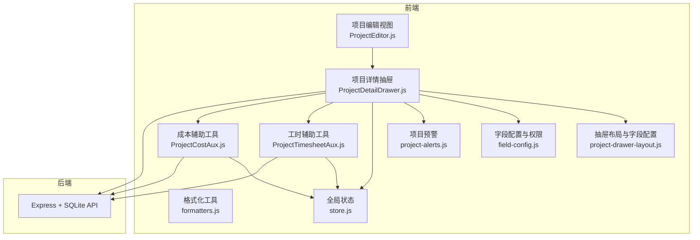
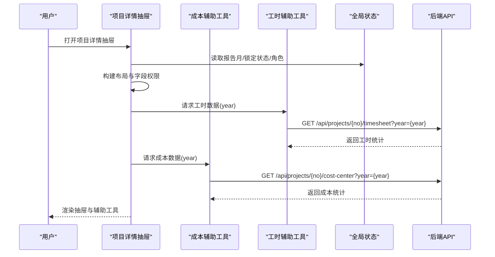
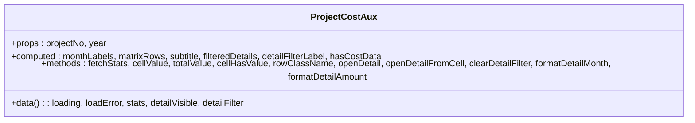
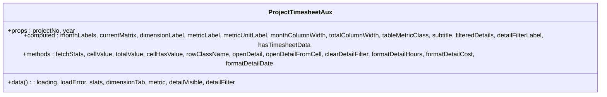
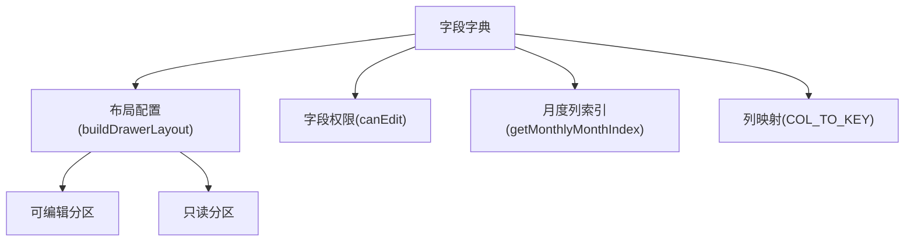
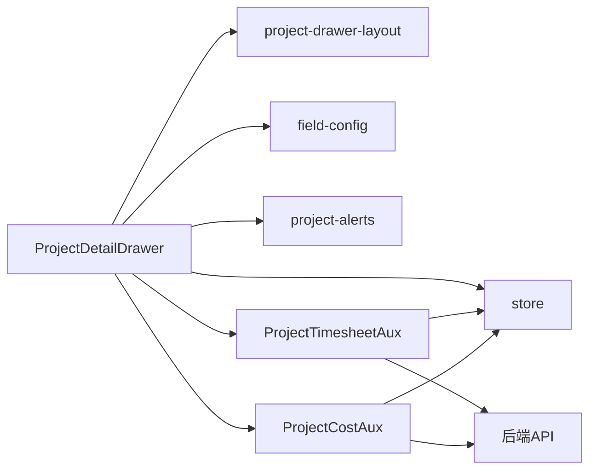

# 项目相关组件

<cite>
**本文引用的文件**
- [ProjectDetailDrawer.js](file://js/components/ProjectDetailDrawer.js)
- [ProjectCostAux.js](file://js/components/ProjectCostAux.js)
- [ProjectTimesheetAux.js](file://js/components/ProjectTimesheetAux.js)
- [project-drawer-layout.js](file://js/project-drawer-layout.js)
- [field-config.js](file://js/field-config.js)
- [formatters.js](file://js/formatters.js)
- [store.js](file://js/store.js)
- [project-alerts.js](file://js/project-alerts.js)
- [ProjectEditor.js](file://js/views/ProjectEditor.js)
- [DESIGN.md](file://docs/设计文档/DESIGN.md)
- [DASHBOARD.md](file://docs/设计文档/DASHBOARD.md)
- [LIST_FORM.md](file://docs/设计文档/LIST_FORM.md)
- [package.json](file://package.json)
</cite>

## 目录
1. [简介](#简介)
2. [项目结构](#项目结构)
3. [核心组件](#核心组件)
4. [架构总览](#架构总览)
5. [组件详细分析](#组件详细分析)
6. [依赖关系分析](#依赖关系分析)
7. [性能考量](#性能考量)
8. [故障排查指南](#故障排查指南)
9. [结论](#结论)
10. [附录](#附录)

## 简介
本文件围绕项目追踪平台中的“项目详情抽屉”、“项目成本辅助工具”和“项目工时辅助工具”三大组件，系统阐述其设计思路、实现细节与协作关系。重点解释这些组件如何支撑项目数据的查看、编辑与分析，包括：
- 项目详情抽屉：基于字段字典构建的可编辑/只读分区布局，支持月度完成、开票、回款等数据的输入与展示。
- 成本辅助工具：按成本中心聚合的成本数据矩阵，支持按月度与成本项筛选，提供明细对话框。
- 工时辅助工具：按专业/板块维度的工时与工时成本矩阵，支持按月度与维度筛选，提供明细对话框。

同时，文档分析组件间的数据流、事件通信机制、可复用性设计与最佳实践，帮助读者快速理解与高效使用这些组件。

## 项目结构
项目采用前端组件化与后端 API 驱动的架构。核心前端组件位于 js/components，布局与字段配置位于 js/project-drawer-layout.js 与 js/field-config.js，全局状态位于 js/store.js，格式化工具位于 js/formatters.js，项目编辑视图位于 js/views/ProjectEditor.js。后端服务通过 Express + SQLite 提供数据与接口。

**图表来源**
- [ProjectDetailDrawer.js:1-846](file://js/components/ProjectDetailDrawer.js#L1-L846)
- [ProjectCostAux.js:1-264](file://js/components/ProjectCostAux.js#L1-L264)
- [ProjectTimesheetAux.js:1-312](file://js/components/ProjectTimesheetAux.js#L1-L312)
- [project-drawer-layout.js:1-154](file://js/project-drawer-layout.js#L1-L154)
- [field-config.js:1-262](file://js/field-config.js#L1-L262)
- [formatters.js:1-167](file://js/formatters.js#L1-L167)
- [store.js:1-602](file://js/store.js#L1-L602)
- [project-alerts.js:1-143](file://js/project-alerts.js#L1-L143)
- [ProjectEditor.js:1-3101](file://js/views/ProjectEditor.js#L1-L3101)

**章节来源**
- [ProjectDetailDrawer.js:1-846](file://js/components/ProjectDetailDrawer.js#L1-L846)
- [ProjectCostAux.js:1-264](file://js/components/ProjectCostAux.js#L1-L264)
- [ProjectTimesheetAux.js:1-312](file://js/components/ProjectTimesheetAux.js#L1-L312)
- [project-drawer-layout.js:1-154](file://js/project-drawer-layout.js#L1-L154)
- [field-config.js:1-262](file://js/field-config.js#L1-L262)
- [formatters.js:1-167](file://js/formatters.js#L1-L167)
- [store.js:1-602](file://js/store.js#L1-L602)
- [project-alerts.js:1-143](file://js/project-alerts.js#L1-L143)
- [ProjectEditor.js:1-3101](file://js/views/ProjectEditor.js#L1-L3101)
- [package.json:1-19](file://package.json#L1-L19)

## 核心组件
- 项目详情抽屉（ProjectDetailDrawer）
  - 负责渲染项目基本信息与跟踪信息分区，支持可编辑字段与只读字段混合布局，提供月度完成/开票/回款的输入与展示，集成项目预警与填报参考。
- 项目成本辅助工具（ProjectCostAux）
  - 负责按成本中心展示成本矩阵，支持按月度与成本项筛选，提供明细对话框查看具体成本记录。
- 项目工时辅助工具（ProjectTimesheetAux）
  - 负责按专业/板块维度展示工时与工时成本矩阵，支持按月度与维度筛选，提供明细对话框查看具体工时记录。

**章节来源**
- [ProjectDetailDrawer.js:23-56](file://js/components/ProjectDetailDrawer.js#L23-L56)
- [ProjectCostAux.js:24-38](file://js/components/ProjectCostAux.js#L24-L38)
- [ProjectTimesheetAux.js:21-37](file://js/components/ProjectTimesheetAux.js#L21-L37)

## 架构总览
组件间协作关系如下：
- 项目详情抽屉通过字段字典与布局配置生成可编辑/只读分区，并根据角色与锁定状态动态控制字段可编辑性。
- 抽屉内部嵌入成本与工时辅助工具，二者通过项目编号与年份参数从后端 API 拉取数据，分别渲染成本矩阵与工时矩阵。
- 全局状态 store 提供报告月、锁定状态、用户角色等上下文，影响字段权限与界面行为。
- 格式化工具统一处理金额、百分比、日期等格式化输出，确保界面一致性。
- 项目编辑视图负责承载抽屉并协调保存、提交等流程。

**图表来源**
- [ProjectDetailDrawer.js:427-452](file://js/components/ProjectDetailDrawer.js#L427-L452)
- [ProjectCostAux.js:96-120](file://js/components/ProjectCostAux.js#L96-L120)
- [ProjectTimesheetAux.js:121-145](file://js/components/ProjectTimesheetAux.js#L121-L145)
- [store.js:97-128](file://js/store.js#L97-L128)

**章节来源**
- [ProjectDetailDrawer.js:427-452](file://js/components/ProjectDetailDrawer.js#L427-L452)
- [ProjectCostAux.js:96-120](file://js/components/ProjectCostAux.js#L96-L120)
- [ProjectTimesheetAux.js:121-145](file://js/components/ProjectTimesheetAux.js#L121-L145)
- [store.js:97-128](file://js/store.js#L97-L128)

## 组件详细分析

### 项目详情抽屉（ProjectDetailDrawer）
- 设计要点
  - 基于字段字典与布局配置生成可编辑/只读分区，支持长文本、金额、比率、日期等控件类型。
  - 月度数据按完成/开票/回款三类组织，支持当前月聚焦时的填报参考弹层。
  - 集成项目预警与库存预警，提供可视化提示。
- 数据流
  - 初始化时根据项目号与系统年份请求工时统计数据，用于完成额填报参考与预警判断。
  - 通过 draft 对象维护本地草稿，保存时将草稿扁平化并通过事件向外抛出。
- 事件与参数
  - 接收参数：visible、project、canEdit、saving、monthIdx、fieldEditable、formatValue、stockWarningField、navIndex、navTotal。
  - 抛出事件：close、nav-prev、nav-next、save。
- 可复用性
  - 通过 props 与事件解耦，可在不同视图中复用。
  - 依赖字段字典与布局配置，确保与后端字段定义一致。

```mermaid
classDiagram
class ProjectDetailDrawer {
+props : visible, project, canEdit, saving, monthIdx, fieldEditable, formatValue, stockWarningField, navIndex, navTotal
+data() : draft, primaryActive, readonlyActive, auxActive, timesheetStats, timesheetLoading, timesheetLoadFailed, completionAuxVisible, completionAuxBlurTimer, numFocusKey
+computed : layout, monthLabels, projectTitle, projectSubtitle, headerSummaryFields, headerTagFields, headerClientField, headerDateRange, headerMetaItems, showSave, hasNavPrev, hasNavNext, navPositionLabel, drawerVisible, systemYear, projectAlerts, hasProjectAlerts, completionFillAux, completionAuxLoading
+methods : resetDraft, numInputKey, isNumInputFocused, formatNumInputDisplay, onNumInputFocus, onNumInputInput, onNumInputBlur, onMonthNumInputFocus, onMonthNumInputBlur, draftKey, draftVal, setDraftVal, widgetType, isLongText, formatField, formatReadonly, formatHeaderMetaValue, isStockWarning, monthIndexForField, isMonthCellEditable, handleClose, handleNavPrev, handleNavNext, handleSave, monthlyRowLabel, monthlyKinds, fieldsForMonthKind, fieldAtMonth, headerTagClass, sectionIcon, isWipExclTaxZero, showNoWipHint, sectionUsesEditableBg, isEditableField, isSystemRefOverridden, systemRefTooltip, isReportMonthCompletionCell, formatAuxAmount, formatAuxHours, showCompletionAux, hideCompletionAuxSoon, fetchTimesheetStats
}
```

**图表来源**
- [ProjectDetailDrawer.js:23-56](file://js/components/ProjectDetailDrawer.js#L23-L56)
- [ProjectDetailDrawer.js:204-453](file://js/components/ProjectDetailDrawer.js#L204-L453)

**章节来源**
- [ProjectDetailDrawer.js:23-56](file://js/components/ProjectDetailDrawer.js#L23-L56)
- [ProjectDetailDrawer.js:204-453](file://js/components/ProjectDetailDrawer.js#L204-L453)

### 项目成本辅助工具（ProjectCostAux）
- 设计要点
  - 按成本中心展示 12 月成本矩阵，支持点击单元格查看该成本项/月份的明细。
  - 支持按成本项与月份筛选，提供明细对话框。
- 数据流
  - 通过项目编号与年份请求后端 API，解析返回的统计结构，渲染矩阵与明细。
- 事件与参数
  - 接收参数：projectNo、year。
  - 内部状态：loading、loadError、stats、detailVisible、detailFilter。
- 可复用性
  - 通过 props 与模板解耦，可独立使用于任意需要成本数据展示的场景。

**图表来源**
- [ProjectCostAux.js:24-38](file://js/components/ProjectCostAux.js#L24-L38)
- [ProjectCostAux.js:95-156](file://js/components/ProjectCostAux.js#L95-L156)

**章节来源**
- [ProjectCostAux.js:24-38](file://js/components/ProjectCostAux.js#L24-L38)
- [ProjectCostAux.js:95-156](file://js/components/ProjectCostAux.js#L95-L156)

### 项目工时辅助工具（ProjectTimesheetAux）
- 设计要点
  - 支持按专业与板块两个维度展示工时与工时成本矩阵，支持切换维度与指标（工时/成本）。
  - 支持点击单元格查看该维度/月份的明细。
- 数据流
  - 通过项目编号与年份请求后端 API，解析返回的统计结构，渲染矩阵与明细。
- 事件与参数
  - 接收参数：projectNo、year。
  - 内部状态：loading、loadError、stats、dimensionTab、metric、detailVisible、detailFilter。
- 可复用性
  - 通过 props 与模板解耦，可独立使用于任意需要工时数据展示的场景。

**图表来源**
- [ProjectTimesheetAux.js:21-37](file://js/components/ProjectTimesheetAux.js#L21-L37)
- [ProjectTimesheetAux.js:120-192](file://js/components/ProjectTimesheetAux.js#L120-L192)

**章节来源**
- [ProjectTimesheetAux.js:21-37](file://js/components/ProjectTimesheetAux.js#L21-L37)
- [ProjectTimesheetAux.js:120-192](file://js/components/ProjectTimesheetAux.js#L120-L192)

### 布局与字段配置（project-drawer-layout.js 与 field-config.js）
- 作用
  - project-drawer-layout.js：将字段按分区与月度列进行分组，决定可编辑/只读分区与控件类型。
  - field-config.js：提供字段权限判断、月度列索引、列字母与键映射、数组与扁平化转换等能力。
- 与组件的关系
  - 项目详情抽屉依赖布局配置生成分区与控件类型；依赖字段配置判断字段可编辑性与月度列索引。

**图表来源**
- [project-drawer-layout.js:68-126](file://js/project-drawer-layout.js#L68-L126)
- [field-config.js:134-260](file://js/field-config.js#L134-L260)

**章节来源**
- [project-drawer-layout.js:68-126](file://js/project-drawer-layout.js#L68-L126)
- [field-config.js:134-260](file://js/field-config.js#L134-L260)

### 格式化与全局状态（formatters.js 与 store.js）
- 作用
  - formatters.js：统一金额、百分比、日期、布尔等格式化输出。
  - store.js：提供全局状态（用户、项目、报告月、锁定状态、字段字典等），并封装 API 调用。
- 与组件的关系
  - 项目详情抽屉使用格式化工具展示金额与日期；使用全局状态决定系统年份与锁定状态。
  - 成本与工时辅助工具通过全局状态获取 API 基础地址与字段字典。

**章节来源**
- [formatters.js:13-165](file://js/formatters.js#L13-L165)
- [store.js:97-128](file://js/store.js#L97-L128)
- [store.js:66-93](file://js/store.js#L66-L93)

### 项目预警（project-alerts.js）
- 作用
  - 计算项目预警标签（如完成额与工时不匹配、库存预警等），并提供完成额填报辅助参考。
- 与组件的关系
  - 项目详情抽屉在渲染时调用预警函数与辅助参考函数，结合工时统计与报告月索引生成提示与参考面板。

**章节来源**
- [project-alerts.js:65-89](file://js/project-alerts.js#L65-L89)
- [project-alerts.js:120-128](file://js/project-alerts.js#L120-L128)

### 项目编辑视图（ProjectEditor.js）
- 作用
  - 承载项目详情抽屉，负责字段字典加载、权限控制、数据计算与保存流程。
- 与组件的关系
  - 项目编辑视图在激活时初始化字段字典与数据，将项目详情抽屉作为子组件使用，并通过事件与状态协调保存与提交。

**章节来源**
- [ProjectEditor.js:64-111](file://js/views/ProjectEditor.js#L64-L111)
- [ProjectEditor.js:193-207](file://js/views/ProjectEditor.js#L193-L207)

## 依赖关系分析
- 组件耦合
  - 项目详情抽屉与布局/字段配置强耦合，通过 props 与计算属性解耦。
  - 成本与工时辅助工具与全局状态与后端 API 强耦合，通过 props 与内部状态解耦。
- 外部依赖
  - 后端 API：/api/projects/{no}/timesheet、/api/projects/{no}/cost-center。
  - 第三方库：better-sqlite3、express、xlsx（后端依赖）。

**图表来源**
- [ProjectDetailDrawer.js:25-30](file://js/components/ProjectDetailDrawer.js#L25-L30)
- [ProjectTimesheetAux.js:23-26](file://js/components/ProjectTimesheetAux.js#L23-L26)
- [ProjectCostAux.js:27-28](file://js/components/ProjectCostAux.js#L27-L28)

**章节来源**
- [ProjectDetailDrawer.js:25-30](file://js/components/ProjectDetailDrawer.js#L25-L30)
- [ProjectTimesheetAux.js:23-26](file://js/components/ProjectTimesheetAux.js#L23-L26)
- [ProjectCostAux.js:27-28](file://js/components/ProjectCostAux.js#L27-L28)

## 性能考量
- 数据加载
  - 成本与工时辅助工具在项目编号或年份变化时触发请求，应避免频繁切换导致的重复请求；可通过节流/去抖优化。
- 渲染优化
  - 大表格（成本/工时矩阵）建议使用虚拟滚动或分页，减少 DOM 节点数量。
- 格式化
  - 金额与日期格式化应避免重复计算，可利用缓存或计算属性。
- 网络
  - 统一使用全局 API 基础地址，减少硬编码带来的维护成本。

[本节为通用指导，不直接分析具体文件]

## 故障排查指南
- 成本/工时数据加载失败
  - 检查项目编号与年份参数是否正确；确认后端 API 可用；查看组件内部 loadError 与 loading 状态。
- 金额格式异常
  - 检查格式化工具的输入值与返回值；确认数值精度与千分位分隔符。
- 字段权限问题
  - 检查全局状态中的角色、锁定状态与报告月索引；确认字段配置中的权限判断逻辑。
- 抽屉无法关闭或保存无效
  - 检查事件绑定与 props 传递；确认保存时草稿对象已正确扁平化。

**章节来源**
- [ProjectCostAux.js:96-120](file://js/components/ProjectCostAux.js#L96-L120)
- [ProjectTimesheetAux.js:121-145](file://js/components/ProjectTimesheetAux.js#L121-L145)
- [formatters.js:13-165](file://js/formatters.js#L13-L165)
- [field-config.js:104-122](file://js/field-config.js#L104-L122)
- [ProjectDetailDrawer.js:326-337](file://js/components/ProjectDetailDrawer.js#L326-L337)

## 结论
项目详情抽屉、成本辅助工具与工时辅助工具共同构成了项目数据查看、编辑与分析的核心能力。它们通过字段字典与布局配置实现灵活的分区与控件类型，借助全局状态与格式化工具保障一致性与可维护性，并通过后端 API 提供实时数据支持。组件间通过 props 与事件实现松耦合，具备良好的可复用性与扩展性。

[本节为总结，不直接分析具体文件]

## 附录
- 视觉与交互规范参考
  - 设计系统与组件规范：[DESIGN.md](file://docs/设计文档/DESIGN.md)
  - 数据看板规范：[DASHBOARD.md](file://docs/设计文档/DASHBOARD.md)
  - 列表/表单规范：[LIST_FORM.md](file://docs/设计文档/LIST_FORM.md)

**章节来源**
- [DESIGN.md:1-464](file://docs/设计文档/DESIGN.md#L1-L464)
- [DASHBOARD.md:1-199](file://docs/设计文档/DASHBOARD.md#L1-L199)
- [LIST_FORM.md:1-302](file://docs/设计文档/LIST_FORM.md#L1-L302)