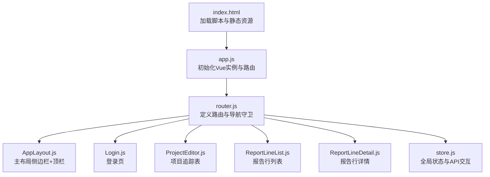
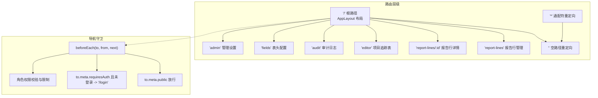
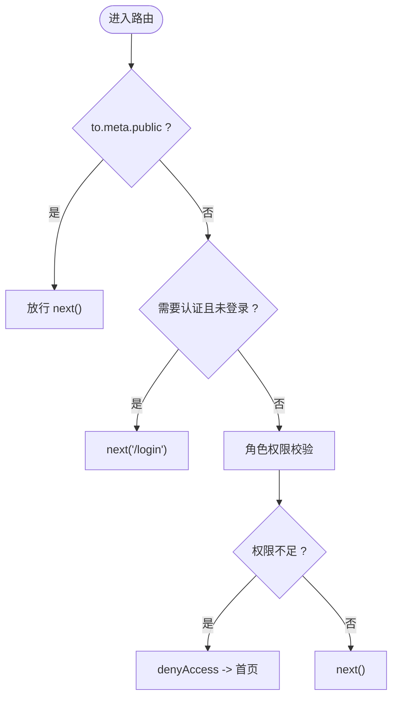
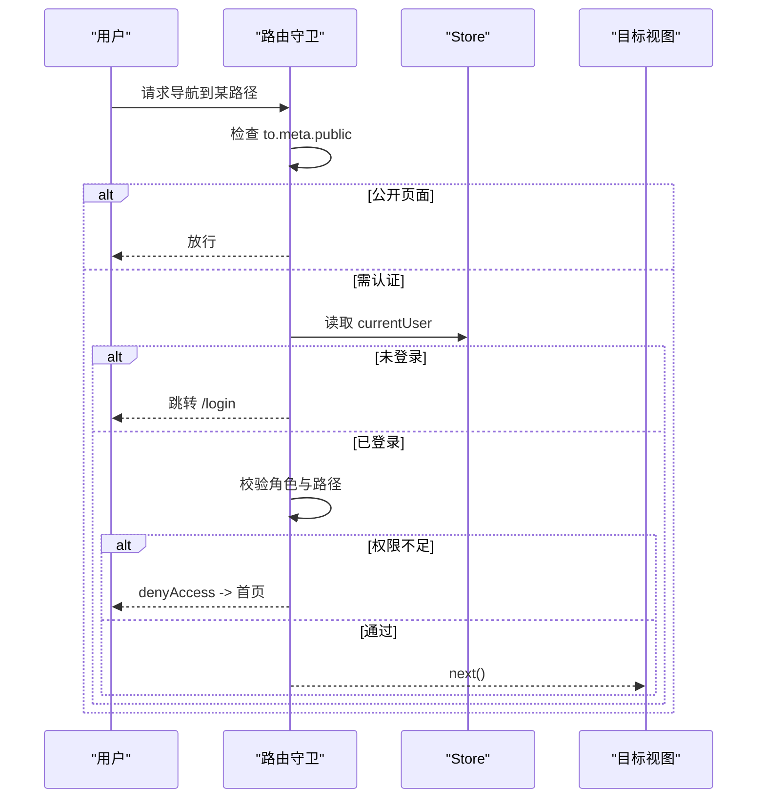
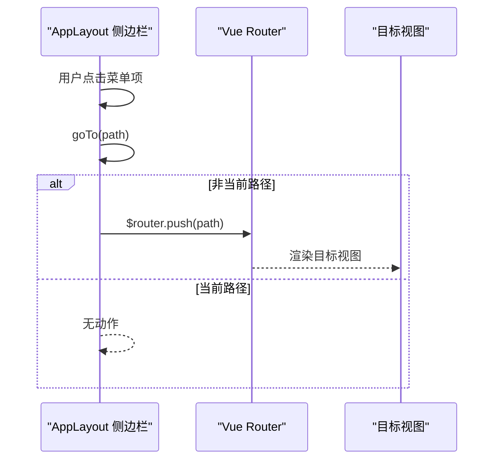
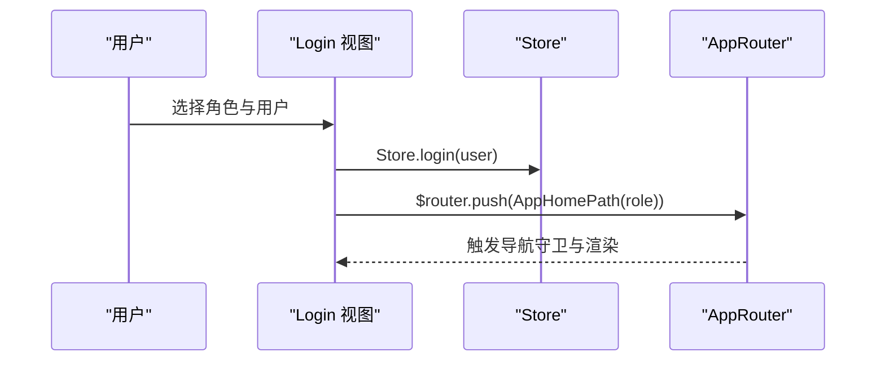
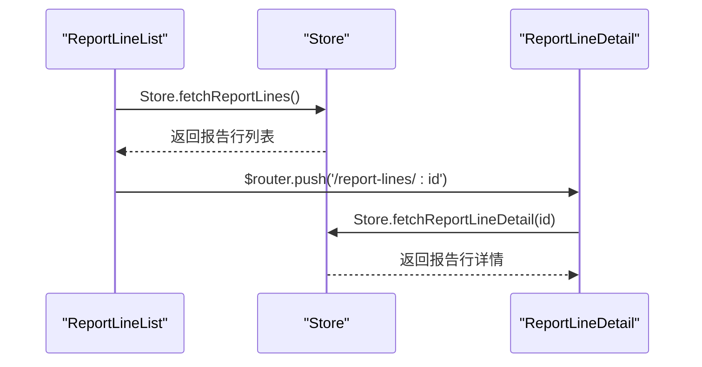
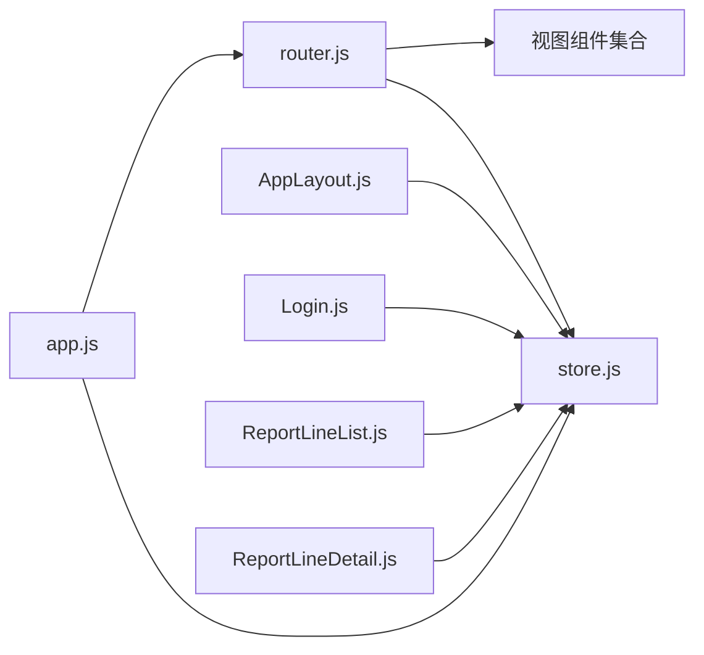

# 路由系统

<cite>
**本文档引用的文件**
- [router.js](file://js/router.js)
- [app.js](file://js/app.js)
- [index.html](file://index.html)
- [AppLayout.js](file://js/components/AppLayout.js)
- [Login.js](file://js/views/Login.js)
- [ProjectEditor.js](file://js/views/ProjectEditor.js)
- [Approval.js](file://js/views/Approval.js)
- [ReportLineList.js](file://js/views/ReportLineList.js)
- [ReportLineDetail.js](file://js/views/ReportLineDetail.js)
- [store.js](file://js/store.js)
</cite>

## 更新摘要
**所做更改**
- 更新路由配置以反映从审批导向转向报告行导向的核心变更
- 新增 ReportLineList.js 和 ReportLineDetail.js 组件的详细分析
- 更新首页重定向策略，从审批页转向报告行列表页
- 更新导航结构，简化审批相关路由并保留兼容性重定向
- 更新权限控制逻辑，适应新的报告行管理模式

## 目录
1. [简介](#简介)
2. [项目结构](#项目结构)
3. [核心组件](#核心组件)
4. [架构概览](#架构概览)
5. [详细组件分析](#详细组件分析)
6. [依赖关系分析](#依赖关系分析)
7. [性能考量](#性能考量)
8. [故障排除指南](#故障排除指南)
9. [结论](#结论)
10. [附录](#附录)

## 简介
本文件系统性梳理项目中的路由系统，涵盖 Vue Router 配置、嵌套路由、导航守卫与权限控制、页面切换行为、路由元信息使用、以及与应用状态（Store）的集成方式。文档同时提供路由结构图与导航流程示例，帮助开发者快速理解与优化路由体验。

**更新重点**：路由系统已从传统的审批导向模式完全转向报告行导向模式，新增 ReportLineList.js 和 ReportLineDetail.js 组件，简化了导航结构并优化了用户体验。

## 项目结构
路由系统位于前端单页应用中，采用 hash 模式，通过全局变量注入视图组件与布局组件，并在应用启动时初始化路由与导航守卫。页面通过 `<router-view>` 渲染，主布局组件负责侧边栏与顶部导航，不同角色根据权限访问不同的报告行管理页面。

**图表来源**
- [index.html:105-107](file://index.html#L105-L107)
- [app.js:22-28](file://js/app.js#L22-L28)
- [router.js:12-78](file://js/router.js#L12-L78)
- [AppLayout.js:31-238](file://js/components/AppLayout.js#L31-L238)
- [Login.js:52-214](file://js/views/Login.js#L52-L214)
- [ProjectEditor.js:64-800](file://js/views/ProjectEditor.js#L64-L800)
- [ReportLineList.js:8-493](file://js/views/ReportLineList.js#L8-L493)
- [ReportLineDetail.js:29-372](file://js/views/ReportLineDetail.js#L29-L372)
- [store.js:97-128](file://js/store.js#L97-L128)

**章节来源**
- [index.html:105-107](file://index.html#L105-L107)
- [app.js:22-28](file://js/app.js#L22-L28)
- [router.js:12-78](file://js/router.js#L12-L78)

## 核心组件
- **路由配置与导航守卫**：集中于 router.js，定义路由表、hash 模式、滚动行为与全局 beforeEach 守卫。
- **主布局组件**：AppLayout.js 提供侧边导航、头部信息与内容区域，内部通过 $router.push 触发导航。
- **登录视图**：Login.js 提供角色选择与用户模拟登录，登录后根据角色跳转首页。
- **页面视图**：ProjectEditor.js 与 ReportLineList.js、ReportLineDetail.js 分别承载"项目追踪表"和"报告行管理"两大功能页。
- **应用状态**：store.js 提供全局状态、用户信息、报告行数据与API交互，导航守卫与页面逻辑均依赖 Store。

**更新**：新增 ReportLineList.js 和 ReportLineDetail.js 组件，替代原有的审批相关功能，提供完整的报告行管理能力。

**章节来源**
- [router.js:71-75](file://js/router.js#L71-L75)
- [AppLayout.js:88-98](file://js/components/AppLayout.js#L88-L98)
- [Login.js:111-123](file://js/views/Login.js#L111-L123)
- [store.js:97-128](file://js/store.js#L97-L128)

## 架构概览
路由系统采用嵌套路由设计：根路径 '/' 对应 AppLayout 布局组件，其 children 包含 report-lines、editor、audit、fields、admin 等子路由。导航守卫在 beforeEach 中统一校验公开页面、认证状态与角色权限，确保访问安全。

**更新**：首页重定向策略已从审批页转向报告行列表页，所有角色的默认首页均为 '/report-lines'。

**图表来源**
- [router.js:12-78](file://js/router.js#L12-L78)
- [router.js:84-140](file://js/router.js#L84-L140)

## 详细组件分析

### 路由配置与嵌套路由
- **路由表定义**：包含登录页（公开）、根布局（children 子路由）与兜底重定向。
- **嵌套路由**：根路径 '/' 下的 children 定义了多个子页面，形成主布局内的多视图切换。
- **滚动行为**：scrollBehavior 设置为回到顶部，保证页面切换时的视觉一致性。
- **首页重定向**：空路径根据用户角色动态重定向至 '/report-lines'。

**更新**：首页重定向策略已更新，homePathForRole 函数直接返回 '/report-lines'，体现了从审批导向向报告行导向的转变。

**图表来源**
- [router.js:84-140](file://js/router.js#L84-L140)

**章节来源**
- [router.js:12-78](file://js/router.js#L12-L78)
- [router.js:7-9](file://js/router.js#L7-L9)
- [router.js:71-75](file://js/router.js#L71-L75)

### 导航守卫与权限控制
- **公开页面**：meta.public 为 true 的路由（如登录页）直接放行。
- **认证要求**：meta.requiresAuth 且未登录时强制跳转登录页。
- **角色限制**：
  - system_admin 可访问 admin 与 fields。
  - 审计日志仅 system_admin 可访问。
  - pm 仅能访问 editor 和 report-lines。
  - executive_viewer 仅能访问 editor 和 report-lines。
  - sector_director/group_leader 仅能访问 report-lines。
- **权限不足时统一提示并返回对应角色首页**。

**更新**：权限控制已适配新的报告行管理模式，所有角色的默认首页均为 '/report-lines'，审批相关路由已简化并保留兼容性重定向。

**图表来源**
- [router.js:84-140](file://js/router.js#L84-L140)
- [store.js:97-98](file://js/store.js#L97-L98)

**章节来源**
- [router.js:77-82](file://js/router.js#L77-L82)
- [router.js:95-139](file://js/router.js#L95-L139)

### 页面导航机制与布局集成
- **主布局**：AppLayout.js 通过 $router.push 触发导航，侧边菜单项绑定路径，点击后调用 goTo 方法。
- **顶部标题**：根据当前激活路径动态计算页面标题，结合 NAV_ITEMS 映射。
- **用户登出**：通过 $router.push('/login') 切换到登录页。
- **侧边栏折叠**：通过 Store 控制布局样式与菜单状态。

**更新**：导航结构已简化，侧边栏主要包含"填报管理"、"项目追踪表"等核心功能，审批相关功能已整合到报告行管理中。

**图表来源**
- [AppLayout.js:88-98](file://js/components/AppLayout.js#L88-L98)
- [AppLayout.js:151-159](file://js/components/AppLayout.js#L151-L159)

**章节来源**
- [AppLayout.js:88-98](file://js/components/AppLayout.js#L88-L98)
- [AppLayout.js:151-159](file://js/components/AppLayout.js#L151-L159)

### 登录与角色首页
- **登录页**：Login.js 提供角色与用户选择，确认登录后调用 Store.login 并根据角色计算首页路径，随后 push 到首页。
- **首页策略**：homePathForRole 根据角色返回 '/report-lines'。

**更新**：首页策略已完全转向报告行导向，所有角色的默认首页均为 '/report-lines'。

**图表来源**
- [Login.js:111-123](file://js/views/Login.js#L111-L123)
- [router.js:7-9](file://js/router.js#L7-L9)

**章节来源**
- [Login.js:111-123](file://js/views/Login.js#L111-L123)
- [router.js:7-9](file://js/router.js#L7-L9)

### 报告行管理视图
- **报告行列表**：ReportLineList.js 提供完整的报告行管理界面，包括筛选、分页、操作按钮等功能。
- **报告行详情**：ReportLineDetail.js 继承 ProjectEditorView，提供完整的填报和审批功能。
- **数据管理**：通过 Store.fetchReportLines 和 Store.fetchReportLineDetail 管理报告行数据。

**新增**：ReportLineList.js 和 ReportLineDetail.js 是本次更新的核心组件，提供了完整的报告行管理解决方案。

**图表来源**
- [ReportLineList.js:97-104](file://js/views/ReportLineList.js#L97-L104)
- [ReportLineDetail.js:169-182](file://js/views/ReportLineDetail.js#L169-L182)
- [store.js:598-629](file://js/store.js#L598-L629)

**章节来源**
- [ReportLineList.js:8-493](file://js/views/ReportLineList.js#L8-L493)
- [ReportLineDetail.js:29-372](file://js/views/ReportLineDetail.js#L29-L372)

### 页面视图与生命周期
- **项目追踪表**：ProjectEditor.js 在 activated 生命周期中根据角色与锁定期同步数据，构建表格与 Luckysheet。
- **报告行管理**：ReportLineList.js 和 ReportLineDetail.js 提供完整的报告行管理功能，包括数据加载、状态管理、操作处理等。

**更新**：原有的审批相关视图已简化，主要功能已整合到 ReportLineList.js 和 ReportLineDetail.js 中。

**章节来源**
- [ProjectEditor.js:128-147](file://js/views/ProjectEditor.js#L128-L147)
- [ReportLineList.js:93-104](file://js/views/ReportLineList.js#L93-L104)
- [ReportLineDetail.js:161-165](file://js/views/ReportLineDetail.js#L161-L165)

## 依赖关系分析
- **路由依赖**：router.js 依赖全局视图组件（LoginView、AppLayoutComponent、ReportLineListView、ReportLineDetailView 等）与 Store。
- **布局依赖**：AppLayout.js 依赖 Store 用户信息、导航项配置与页面标题计算。
- **登录依赖**：Login.js 依赖 Store 用户列表与登录流程，并通过 $router.push 触发导航。
- **报告行管理依赖**：ReportLineList.js 和 ReportLineDetail.js 依赖 Store 的报告行 API。
- **应用初始化**：app.js 在 Store.init 成功后挂载 Vue 实例并传入 AppRouter。

**更新**：新增 ReportLineList.js 和 ReportLineDetail.js 的依赖关系，移除了对原有审批相关组件的依赖。

**图表来源**
- [router.js:12-78](file://js/router.js#L12-L78)
- [AppLayout.js:36-86](file://js/components/AppLayout.js#L36-L86)
- [Login.js:52-123](file://js/views/Login.js#L52-L123)
- [ReportLineList.js:8-26](file://js/views/ReportLineList.js#L8-L26)
- [ReportLineDetail.js:29-38](file://js/views/ReportLineDetail.js#L29-L38)
- [app.js:22-28](file://js/app.js#L22-L28)

**章节来源**
- [router.js:12-78](file://js/router.js#L12-L78)
- [app.js:22-28](file://js/app.js#L22-L28)

## 性能考量
- **路由切换性能**：使用 hash 模式与简单组件结构，减少首屏与切换开销。
- **滚动行为**：scrollBehavior 回到顶部，避免页面滚动记忆带来的抖动。
- **视图懒加载**：当前路由配置未体现异步组件加载，可在大型视图（如 ReportLineList.js）按需拆分并使用异步组件以降低首屏体积。
- **导航守卫**：守卫逻辑集中在单处，避免重复判断，建议保持职责单一，必要时拆分为更细粒度的权限模块。

**更新**：报告行管理组件的性能优化建议，特别是 ReportLineList.js 的大数据量处理能力。

## 故障排除指南
- **无法访问受保护页面**
  - 检查 Store.currentUser 是否存在；若为空，守卫会强制跳转登录页。
  - 确认目标路径的 meta.requiresAuth 与角色权限是否匹配。
- **权限不足被重定向**
  - 守卫会在权限不足时弹出提示并返回角色首页；检查 denyAccess 与 homePathForRole 的逻辑。
- **登录后未跳转预期首页**
  - 确认 Login.js 中的 AppHomePath 与 Store.login 的调用顺序正确。
- **布局导航无效**
  - 检查 AppLayout.js 的 goTo 方法与菜单项绑定路径是否一致。
- **报告行数据加载失败**
  - 检查 Store.fetchReportLines 和 Store.fetchReportLineDetail 的 API 调用是否正常。
  - 确认网络连接和服务器响应状态。

**更新**：新增报告行管理相关的故障排除指导。

**章节来源**
- [router.js:84-140](file://js/router.js#L84-L140)
- [Login.js:111-123](file://js/views/Login.js#L111-L123)
- [AppLayout.js:88-98](file://js/components/AppLayout.js#L88-L98)
- [ReportLineList.js:97-104](file://js/views/ReportLineList.js#L97-L104)
- [ReportLineDetail.js:169-182](file://js/views/ReportLineDetail.js#L169-L182)

## 结论
本路由系统已成功从审批导向模式转向报告行导向模式，通过新增 ReportLineList.js 和 ReportLineDetail.js 组件，实现了更加直观和高效的报告行管理体验。系统以简洁清晰的方式实现了基于角色的权限控制与嵌套路由布局，配合全局状态 Store 完成登录、权限与页面渲染的闭环。建议后续引入异步组件与更细粒度的权限模块，进一步提升可维护性与性能。

**更新**：路由系统的核心架构已完全适配新的报告行管理模式，简化了导航结构并提升了用户体验。

## 附录
- **最佳实践**
  - 使用 meta 字段明确页面属性（公开/需认证/标题），便于守卫与标题管理。
  - 将权限规则抽象为独立模块，便于扩展与测试。
  - 对大型视图采用异步组件与路由级懒加载，优化首屏性能。
  - 在导航守卫中增加日志或错误提示，便于排查问题。
  - 报告行管理组件应支持大数据量的虚拟滚动和分页加载。
- **SEO 考虑**
  - 项目采用 hash 模式，不利于传统 SEO；如需 SEO，可迁移到 history 模式并配置服务端回退。
  - 页面标题通过 meta.title 与布局计算，建议在服务端渲染或预渲染场景中同步标题。
- **迁移建议**
  - 从审批导向向报告行导向的迁移已完全完成，无需额外的迁移步骤。
  - 旧的审批相关路由已保留兼容性重定向，确保现有链接仍然有效。

**更新**：新增报告行管理相关的最佳实践和迁移建议。