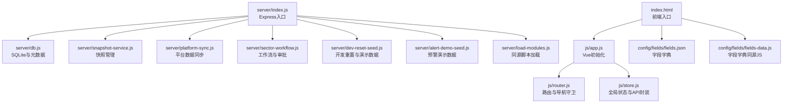
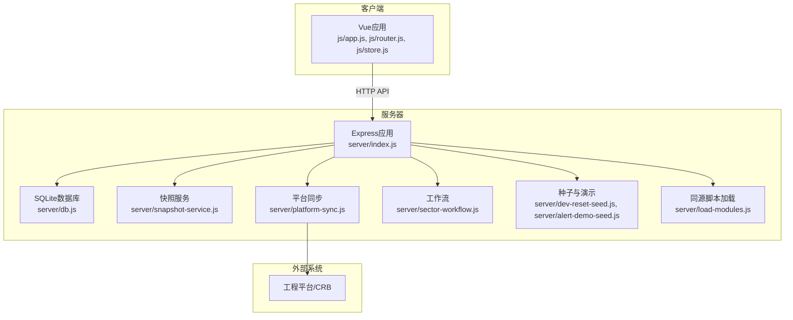
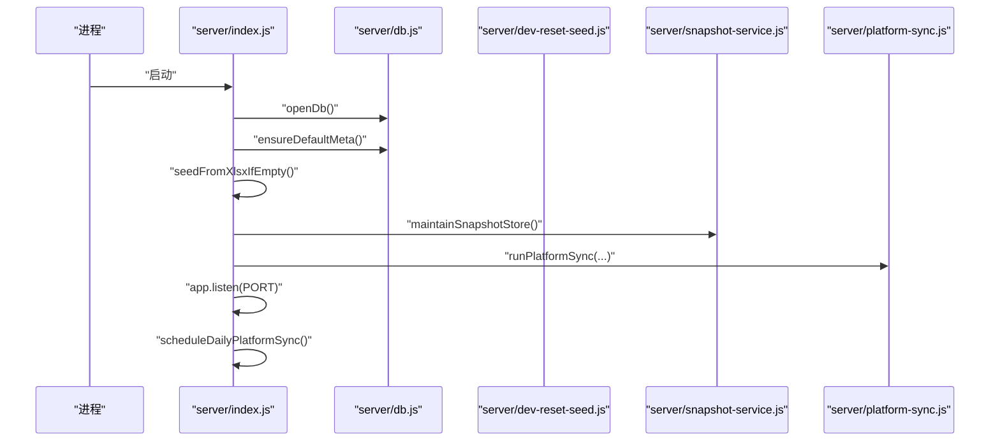
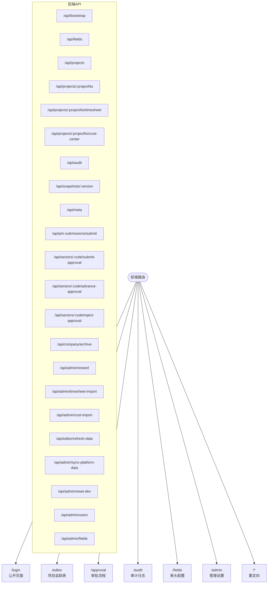
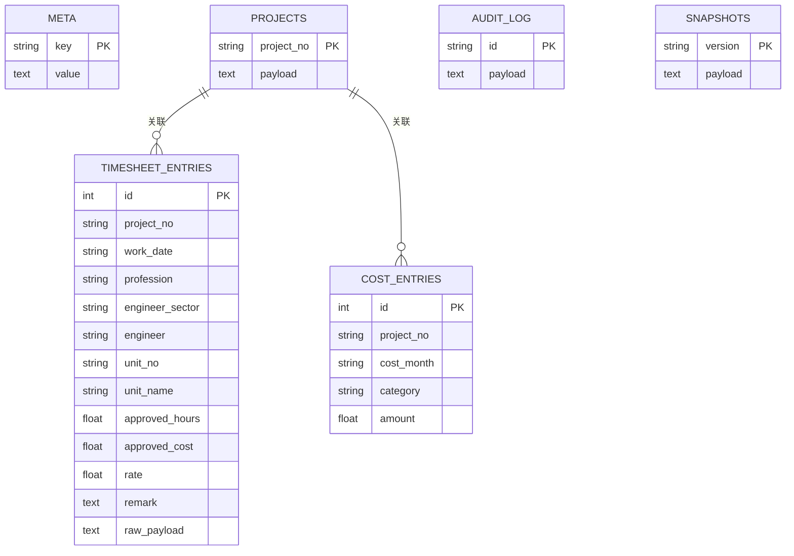
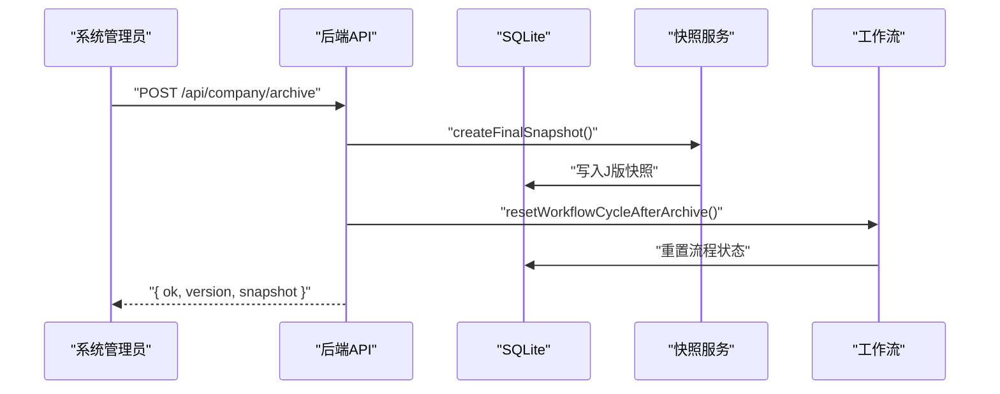
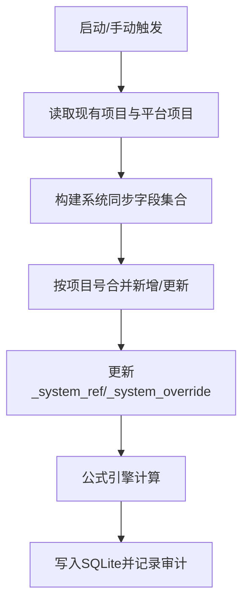
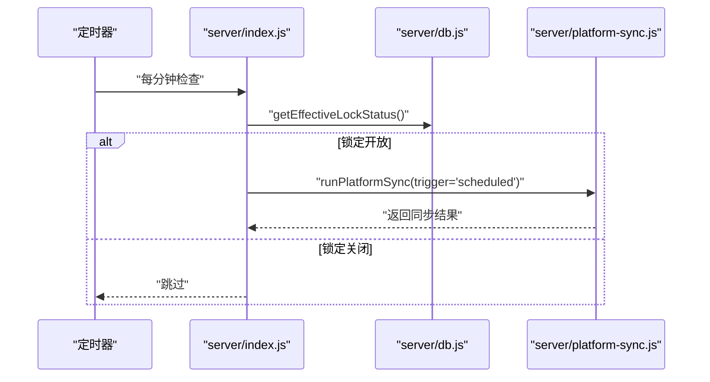
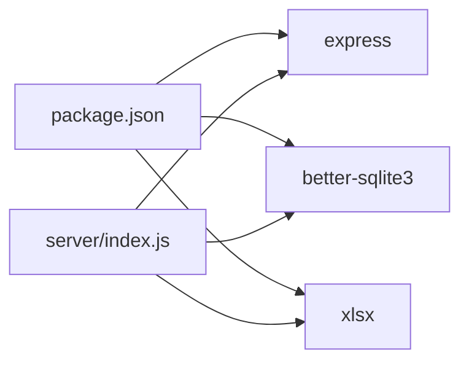

# Express应用设计

<cite>
**本文档引用的文件**
- [server/index.js](file://server/index.js)
- [package.json](file://package.json)
- [server/db.js](file://server/db.js)
- [server/load-modules.js](file://server/load-modules.js)
- [index.html](file://index.html)
- [server/snapshot-service.js](file://server/snapshot-service.js)
- [server/platform-sync.js](file://server/platform-sync.js)
- [server/dev-reset-seed.js](file://server/dev-reset-seed.js)
- [server/sector-workflow.js](file://server/sector-workflow.js)
- [server/alert-demo-seed.js](file://server/alert-demo-seed.js)
- [js/app.js](file://js/app.js)
- [js/router.js](file://js/router.js)
- [js/store.js](file://js/store.js)
- [config/fields/fields-data.js](file://config/fields/fields-data.js)
- [config/fields/fields.json](file://config/fields/fields.json)
</cite>

## 目录
1. [引言](#引言)
2. [项目结构](#项目结构)
3. [核心组件](#核心组件)
4. [架构总览](#架构总览)
5. [详细组件分析](#详细组件分析)
6. [依赖关系分析](#依赖关系分析)
7. [性能考虑](#性能考虑)
8. [故障排查指南](#故障排查指南)
9. [结论](#结论)
10. [附录](#附录)

## 引言
本设计文档面向“项目执行追踪平台”Express应用，系统性阐述应用启动流程、中间件与静态资源配置、路由组织结构、数据库初始化与种子数据加载、环境配置与平台同步、CORS与请求体解析、应用生命周期与定时任务、错误处理机制、部署与环境变量管理、性能优化策略以及开发调试与生产监控建议。文档旨在帮助开发者快速理解并高效维护该应用。

## 项目结构
项目采用前后端一体化的单页应用（SPA）架构：前端通过Vue生态在浏览器中运行，后端基于Express提供REST API与SQLite持久化，静态资源由Express统一托管。关键目录与职责如下：
- server：后端入口与核心服务（数据库、快照、平台同步、工作流、种子数据等）
- js：前端脚本（Vue组件、视图、路由、状态管理、工具函数等）
- config/fields：字段字典（JSON与同源JS两套来源）
- css：样式资源
- index.html：前端入口页面，加载所有前端脚本与样式

图表来源
- [server/index.js:1-775](file://server/index.js#L1-L775)
- [js/app.js:1-47](file://js/app.js#L1-L47)
- [js/router.js:1-137](file://js/router.js#L1-L137)
- [js/store.js:1-602](file://js/store.js#L1-L602)
- [server/db.js:1-525](file://server/db.js#L1-L525)
- [server/snapshot-service.js:1-292](file://server/snapshot-service.js#L1-L292)
- [server/platform-sync.js:1-272](file://server/platform-sync.js#L1-L272)
- [server/sector-workflow.js:1-273](file://server/sector-workflow.js#L1-L273)
- [server/dev-reset-seed.js:1-144](file://server/dev-reset-seed.js#L1-L144)
- [server/alert-demo-seed.js:1-176](file://server/alert-demo-seed.js#L1-L176)
- [server/load-modules.js:1-41](file://server/load-modules.js#L1-L41)
- [config/fields/fields-data.js:1-800](file://config/fields/fields-data.js#L1-L800)
- [config/fields/fields.json:1-800](file://config/fields/fields.json#L1-L800)

章节来源
- [server/index.js:1-775](file://server/index.js#L1-L775)
- [package.json:1-19](file://package.json#L1-L19)
- [index.html:1-110](file://index.html#L1-L110)

## 核心组件
- 应用入口与启动：Express实例创建、端口监听、静态资源托管、中间件与路由注册、定时任务调度
- 数据库与元数据：SQLite连接、表结构初始化、默认元数据、锁状态与周期配置、审计日志、快照存储
- 快照服务：版本号生成、导入/草稿/最终快照创建、基线修复、旧版快照清理
- 平台同步：字段映射、系统引用合并、新旧项目年度滚动、定时与手动触发
- 工作流与审批：板块注册、审批状态、公司归档状态同步
- 种子数据与演示：首次导入、开发重置、预警演示工时注入
- 前端集成：Vue应用初始化、路由守卫、全局状态管理、字段字典加载

章节来源
- [server/index.js:88-775](file://server/index.js#L88-L775)
- [server/db.js:1-525](file://server/db.js#L1-L525)
- [server/snapshot-service.js:1-292](file://server/snapshot-service.js#L1-L292)
- [server/platform-sync.js:1-272](file://server/platform-sync.js#L1-L272)
- [server/sector-workflow.js:1-273](file://server/sector-workflow.js#L1-L273)
- [server/dev-reset-seed.js:1-144](file://server/dev-reset-seed.js#L1-L144)
- [server/alert-demo-seed.js:1-176](file://server/alert-demo-seed.js#L1-L176)
- [js/app.js:1-47](file://js/app.js#L1-L47)
- [js/router.js:1-137](file://js/router.js#L1-L137)
- [js/store.js:1-602](file://js/store.js#L1-L602)

## 架构总览
应用采用“前端SPA + 后端REST API + SQLite”的轻量级架构。前端通过fetch与后端交互，后端负责数据持久化、业务规则与工作流控制。静态资源由Express统一托管，便于本地开发与部署。

图表来源
- [server/index.js:88-775](file://server/index.js#L88-L775)
- [server/db.js:1-525](file://server/db.js#L1-L525)
- [server/snapshot-service.js:1-292](file://server/snapshot-service.js#L1-L292)
- [server/platform-sync.js:1-272](file://server/platform-sync.js#L1-L272)
- [server/sector-workflow.js:1-273](file://server/sector-workflow.js#L1-L273)
- [server/dev-reset-seed.js:1-144](file://server/dev-reset-seed.js#L1-L144)
- [server/alert-demo-seed.js:1-176](file://server/alert-demo-seed.js#L1-L176)
- [server/load-modules.js:1-41](file://server/load-modules.js#L1-L41)

## 详细组件分析

### 应用启动与初始化流程
- 读取端口环境变量（默认3000），加载同源脚本模块，打开SQLite数据库
- 初始化默认元数据，检查项目表是否为空，若为空则尝试从“初始数据.xlsx”导入
- 进行快照库维护（清理旧版、修复基线、必要时重建I版）
- 导入工时与成本数据，写入预警演示工时
- 创建Express实例，注册中间件与路由，启动定时平台同步任务

图表来源
- [server/index.js:67-86](file://server/index.js#L67-L86)
- [server/index.js:745-775](file://server/index.js#L745-L775)
- [server/db.js:144-169](file://server/db.js#L144-L169)
- [server/snapshot-service.js:229-274](file://server/snapshot-service.js#L229-L274)
- [server/platform-sync.js:214-262](file://server/platform-sync.js#L214-L262)

章节来源
- [server/index.js:1-775](file://server/index.js#L1-L775)
- [server/db.js:1-525](file://server/db.js#L1-L525)

### 中间件与静态资源
- 请求体解析：启用JSON解析，限制大小为80MB
- 静态资源：托管项目根目录，供前端SPA与静态资源访问
- CORS：未显式配置，默认行为遵循Express默认策略

章节来源
- [server/index.js:88-743](file://server/index.js#L88-L743)

### 路由组织结构
- 前端路由：Vue Router定义，包含登录、编辑器、审批、审计、字段配置、管理设置等页面，支持导航守卫与角色权限控制
- 后端路由：提供项目、工时、成本、审计、快照、元数据、PM提交、板块审批、公司归档、管理员操作、字段字典等REST端点

图表来源
- [js/router.js:12-69](file://js/router.js#L12-L69)
- [server/index.js:91-742](file://server/index.js#L91-L742)

章节来源
- [js/router.js:1-137](file://js/router.js#L1-L137)
- [server/index.js:91-742](file://server/index.js#L91-L742)

### 数据库初始化与种子数据
- 表结构：projects、audit_log、snapshots、meta、timesheet_entries、cost_entries，含索引优化
- 默认元数据：周期配置、报告月、审批状态、用户与权限、板块管理员、新旧项目年份等
- 种子数据：首次导入“初始数据.xlsx”，生成I版快照，开发重置后写入演示数据与预警工时

图表来源
- [server/db.js:16-57](file://server/db.js#L16-L57)

章节来源
- [server/db.js:1-525](file://server/db.js#L1-L525)
- [server/dev-reset-seed.js:62-118](file://server/dev-reset-seed.js#L62-L118)
- [server/alert-demo-seed.js:141-169](file://server/alert-demo-seed.js#L141-L169)

### 快照与工作流
- 快照版本：I（导入）、D（草稿）、J（最终）三类，版本号包含阶段、日期、作用域与序号
- 基线修复：启动时清理旧版快照键，修复基线版本缺失，必要时重建I版
- 工作流：板块注册、审批状态（draft/approve1/approve2）、公司归档状态同步

图表来源
- [server/index.js:419-446](file://server/index.js#L419-L446)
- [server/snapshot-service.js:139-158](file://server/snapshot-service.js#L139-L158)
- [server/db.js:350-370](file://server/db.js#L350-L370)
- [server/sector-workflow.js:188-221](file://server/sector-workflow.js#L188-L221)

章节来源
- [server/snapshot-service.js:1-292](file://server/snapshot-service.js#L1-L292)
- [server/sector-workflow.js:1-273](file://server/sector-workflow.js#L1-L273)

### 平台同步与字段字典
- 字段映射：根据字段配置构建系统同步字段集合，动态映射月度发票/付款
- 合并策略：以项目号为键合并平台数据，更新系统引用与显示字段
- 字典来源：优先通过API获取，其次读取静态JSON，最后加载同源JS中的FIELD_DICTIONARY

图表来源
- [server/platform-sync.js:83-150](file://server/platform-sync.js#L83-L150)
- [server/platform-sync.js:214-262](file://server/platform-sync.js#L214-L262)
- [js/store.js:186-235](file://js/store.js#L186-L235)

章节来源
- [server/platform-sync.js:1-272](file://server/platform-sync.js#L1-L272)
- [js/store.js:1-602](file://js/store.js#L1-L602)

### 生命周期管理与定时任务
- 启动：初始化数据库、种子数据、快照维护、平台同步
- 定时：每日在配置的小时执行平台同步（受锁状态与周期配置控制）
- 关闭：未实现显式关闭钩子，进程退出即停止

图表来源
- [server/index.js:745-775](file://server/index.js#L745-L775)
- [server/db.js:372-379](file://server/db.js#L372-L379)
- [server/platform-sync.js:214-262](file://server/platform-sync.js#L214-L262)

章节来源
- [server/index.js:745-775](file://server/index.js#L745-L775)
- [server/db.js:372-379](file://server/db.js#L372-L379)

### 错误处理机制
- 后端：各路由均包裹try/catch，捕获异常并返回JSON错误信息，状态码依据错误类型设置
- 前端：fetch封装统一处理HTTP错误与JSON解析，向用户展示可读错误消息

章节来源
- [server/index.js:91-742](file://server/index.js#L91-L742)
- [js/store.js:66-93](file://js/store.js#L66-L93)

## 依赖关系分析
- 依赖声明：Express、better-sqlite3、xlsx
- 运行脚本：start启动后端入口，test运行单元测试，导出/同步辅助脚本
- 前端依赖：Vue 2、Element UI、jQuery、Popper、Luckysheet、SheetJS等

图表来源
- [package.json:13-18](file://package.json#L13-L18)
- [server/index.js:5-11](file://server/index.js#L5-L11)

章节来源
- [package.json:1-19](file://package.json#L1-19)
- [server/index.js:1-24](file://server/index.js#L1-L24)

## 性能考虑
- 数据库优化：WAL模式、关键查询建立索引（工时与成本表），事务批量写入
- 请求体大小：JSON解析限制80MB，避免超大负载
- 定时任务：按日执行，受锁状态与周期配置控制，减少不必要的同步
- 前端渲染：字段字典缓存、快照按需拉取、审计日志截断

章节来源
- [server/db.js:14-57](file://server/db.js#L14-L57)
- [server/index.js:89](file://server/index.js#L89)
- [js/store.js:340-393](file://js/store.js#L340-L393)

## 故障排查指南
- 无法加载数据：检查后端是否启动、端口占用、静态资源路径、初始Excel文件是否存在
- 字段字典加载失败：确认config/fields/fields.json存在，或确保同源JS加载成功
- 平台同步失败：检查PTRACK_PLATFORM_API_URL配置与stub实现，查看定时任务日志
- 锁定状态异常：核对周期配置与锁日志，必要时通过API重置锁状态
- 审计日志过多：前端默认最多保留500条，超出自动截断

章节来源
- [js/app.js:30-44](file://js/app.js#L30-L44)
- [js/store.js:186-235](file://js/store.js#L186-L235)
- [server/platform-sync.js:200-206](file://server/platform-sync.js#L200-L206)
- [js/store.js:338-342](file://js/store.js#L338-L342)

## 结论
该Express应用以SQLite为核心，结合前端SPA与后端REST API，实现了项目追踪、工作流审批、平台数据同步与演示数据管理的完整闭环。通过明确的启动流程、完善的快照与工作流机制、可配置的定时任务与严格的错误处理，系统具备良好的可维护性与扩展性。建议在生产环境中加强CORS与安全中间件配置，并引入更完善的日志与监控体系。

## 附录

### 部署配置与环境变量
- 端口：PTACK_PORT（默认3000）
- 平台API：PTRACK_PLATFORM_API_URL（当前为占位，需实现真实API）
- 静态资源：Express托管项目根目录
- 启动命令：npm start

章节来源
- [server/index.js:22](file://server/index.js#L22)
- [server/platform-sync.js:200-206](file://server/platform-sync.js#L200-L206)
- [package.json:6-11](file://package.json#L6-L11)

### 开发调试技巧
- 使用/复用初始Excel：将“初始数据.xlsx”置于项目根目录，重启服务自动导入
- 开发重置：调用POST /api/admin/reset-dev恢复默认流程与配置
- 字段字典：通过/fields或/admin/fields获取与更新，支持同源JS与静态JSON两种来源
- 定时任务：观察日志确认定时同步是否按预期执行

章节来源
- [server/index.js:492-516](file://server/index.js#L492-L516)
- [server/index.js:628-645](file://server/index.js#L628-L645)
- [js/store.js:583-598](file://js/store.js#L583-L598)

### 生产环境监控方案
- 进程监控：使用PM2或systemd守护进程，自动重启异常退出
- 日志采集：集中化收集后端日志与定时任务输出
- 健康检查：暴露/health端点（建议新增），定期探测服务可用性
- 性能指标：监控CPU、内存、磁盘IO与数据库查询耗时
- 安全加固：启用CORS白名单、HTTPS、请求速率限制与敏感信息脱敏

[本节为通用建议，不直接分析具体文件，故无章节来源]