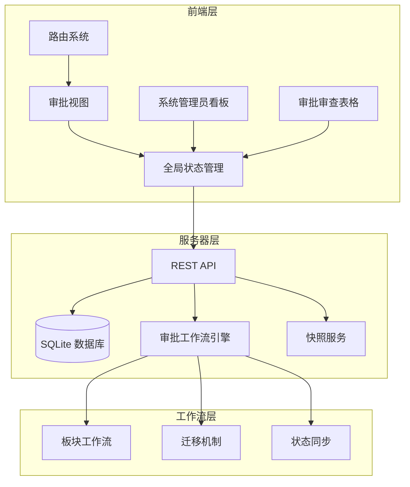
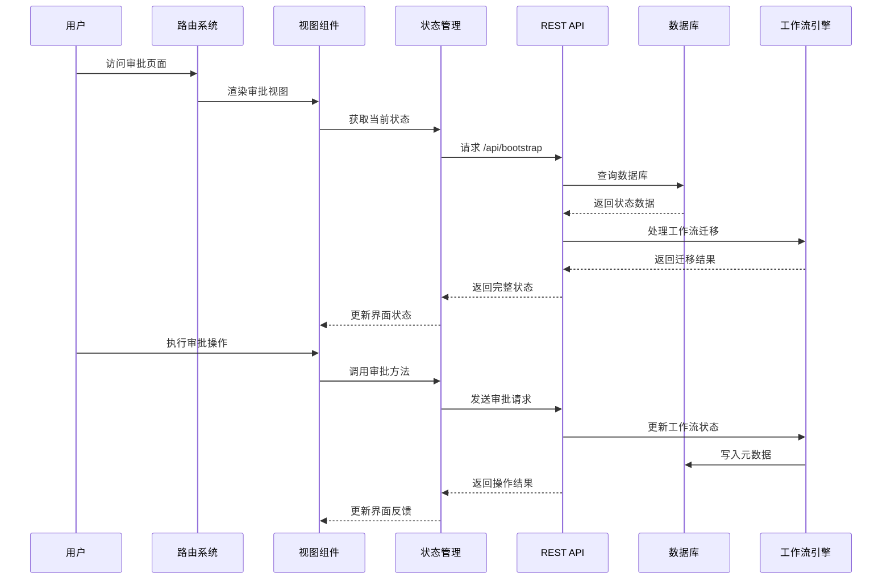
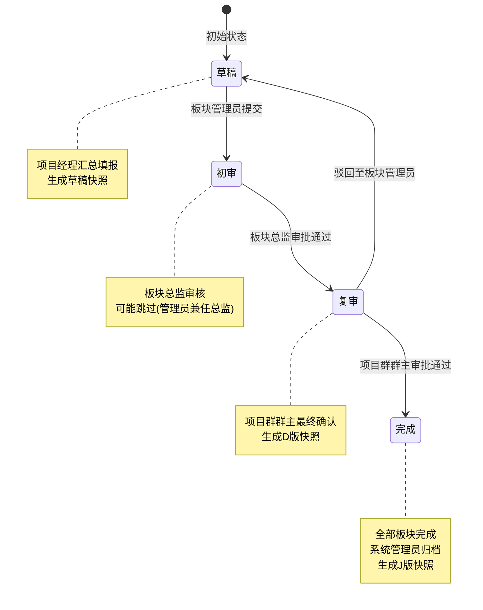
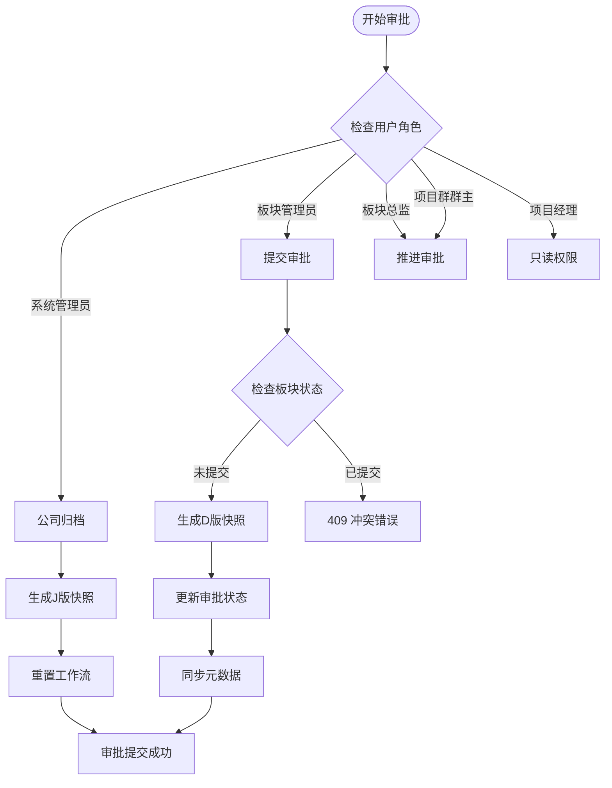
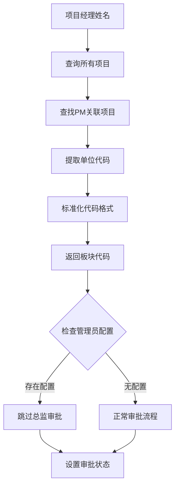
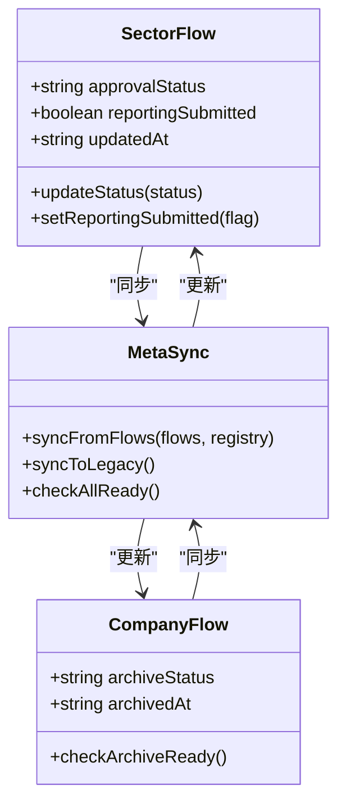
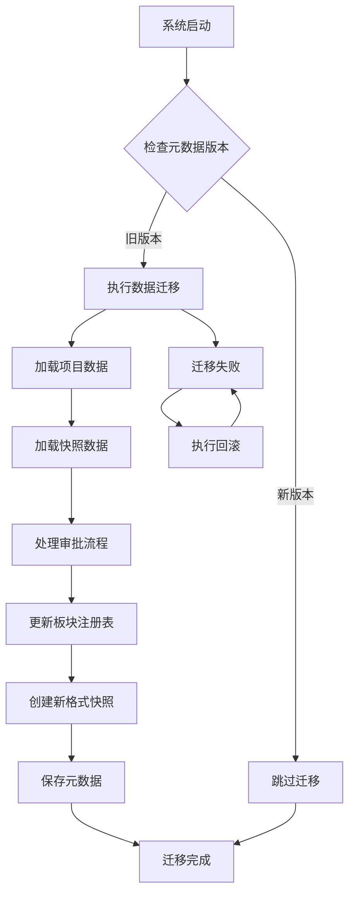
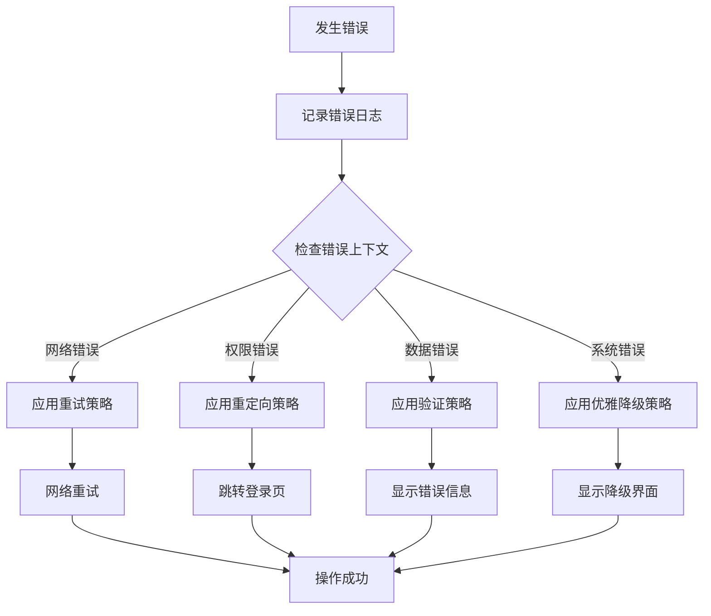
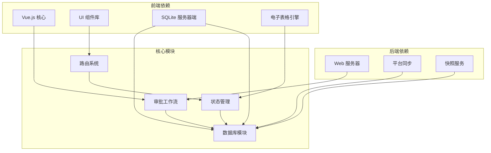

# 审批工作流管理

<cite>
**本文引用的文件**
- [server/sector-workflow.js](file://server/sector-workflow.js)
- [js/sector-workflow.js](file://js/sector-workflow.js)
- [js/views/Approval.js](file://js/views/Approval.js)
- [js/components/SystemAdminApprovalBoard.js](file://js/components/SystemAdminApprovalBoard.js)
- [js/components/ApprovalReviewSheet.js](file://js/components/ApprovalReviewSheet.js)
- [js/router.js](file://js/router.js)
- [server/index.js](file://server/index.js)
- [server/db.js](file://server/db.js)
- [js/store.js](file://js/store.js)
</cite>

## 目录
1. [简介](#简介)
2. [项目结构](#项目结构)
3. [核心组件](#核心组件)
4. [架构概览](#架构概览)
5. [详细组件分析](#详细组件分析)
6. [依赖关系分析](#依赖关系分析)
7. [性能考虑](#性能考虑)
8. [故障排除指南](#故障排除指南)
9. [结论](#结论)

## 简介
本系统实现了一个多层级审批工作流管理，支持十二个板块的并行审批流程。系统采用前后端分离架构，后端基于 Node.js + SQLite，前端使用 Vue.js 构建用户界面。审批流程包含三个阶段：草稿(draft)、初审(approve1)、复审(approve2)，并通过快照机制确保数据一致性。

## 项目结构
系统采用模块化设计，主要分为以下层次：
- **服务器层(server)**：提供 RESTful API 接口，处理业务逻辑和数据持久化
- **前端层(js)**：Vue.js 应用，包含视图组件、状态管理和路由控制
- **工作流层**：独立的审批流程引擎，负责状态管理和迁移逻辑

**图表来源**
- [server/index.js:88-775](file://server/index.js#L88-L775)
- [js/router.js:12-137](file://js/router.js#L12-L137)
- [js/store.js:97-602](file://js/store.js#L97-L602)

**章节来源**
- [server/index.js:1-775](file://server/index.js#L1-L775)
- [js/router.js:1-137](file://js/router.js#L1-L137)
- [js/store.js:1-602](file://js/store.js#L1-L602)

## 核心组件
系统的核心组件包括审批工作流引擎、权限控制系统和状态管理机制。

### 审批工作流引擎
审批工作流引擎负责管理多板块的并行审批流程，包含以下关键功能：
- **状态管理**：跟踪每个板块的审批状态(draft/approve1/approve2)
- **迁移机制**：处理历史数据迁移和兼容性
- **快照管理**：生成和管理不同阶段的项目快照
- **权限控制**：根据角色和板块分配权限

### 权限控制系统
系统实现了细粒度的权限控制，支持多种角色：
- **系统管理员(system_admin)**：最高权限，可进行公司级归档
- **板块管理员(sector_admin)**：负责本板块的项目提交和审批
- **板块总监(sector_director)**：负责初审环节
- **项目群群主(group_leader)**：负责复审环节
- **项目经理(pm)**：只能查看和提交项目数据
- **经营管理(executive_viewer)**：只读权限

### 状态管理机制
系统通过全局状态管理器协调各个组件的状态同步，确保前后端数据一致性。

**章节来源**
- [server/sector-workflow.js:1-273](file://server/sector-workflow.js#L1-L273)
- [js/sector-workflow.js:1-180](file://js/sector-workflow.js#L1-L180)
- [js/store.js:97-602](file://js/store.js#L97-L602)

## 架构概览
系统采用分层架构设计，确保职责分离和可维护性。

**图表来源**
- [js/router.js:85-132](file://js/router.js#L85-L132)
- [js/views/Approval.js:183-198](file://js/views/Approval.js#L183-L198)
- [server/index.js:302-385](file://server/index.js#L302-L385)
- [server/db.js:194-266](file://server/db.js#L194-L266)

## 详细组件分析

### 审批工作流状态机
系统实现了严格的审批状态机，确保流程的有序性和可追溯性。

**图表来源**
- [server/sector-workflow.js:50-82](file://server/sector-workflow.js#L50-L82)
- [js/views/Approval.js:9-46](file://js/views/Approval.js#L9-L46)

#### 状态转换规则
1. **草稿(draft) → 初审(approve1)**：板块管理员提交后触发
2. **初审(approve1) → 复审(approve2)**：板块总监审批通过后触发  
3. **复审(approve2) → 完成(final)**：项目群群主审批通过后触发
4. **任意状态 → 草稿(draft)**：被驳回时触发

#### 权限验证流程

**图表来源**
- [server/index.js:302-385](file://server/index.js#L302-L385)
- [server/index.js:419-446](file://server/index.js#L419-L446)

**章节来源**
- [server/sector-workflow.js:50-82](file://server/sector-workflow.js#L50-L82)
- [js/views/Approval.js:9-46](file://js/views/Approval.js#L9-L46)
- [server/index.js:302-385](file://server/index.js#L302-L385)

### 板块管理员权限控制
板块管理员拥有特定的权限范围和限制：

#### 权限范围
- **项目提交**：可以提交本板块的项目数据
- **快照生成**：生成D版快照供审批使用
- **状态更新**：推进本板块的审批流程
- **配置管理**：管理本板块的管理员配置

#### 权限限制
- 不能直接生成J版快照（需要系统管理员）
- 不能修改其他板块的数据
- 不能绕过系统定义的审批流程

#### 板块归属计算

**图表来源**
- [server/sector-workflow.js:113-117](file://server/sector-workflow.js#L113-L117)
- [server/index.js:319-325](file://server/index.js#L319-L325)

**章节来源**
- [server/sector-workflow.js:113-117](file://server/sector-workflow.js#L113-L117)
- [server/index.js:319-325](file://server/index.js#L319-L325)

### 审批状态同步逻辑
系统实现了多层次的状态同步机制，确保数据一致性：

#### 前端状态同步
- **实时更新**：每次审批操作后立即更新本地状态
- **批量同步**：定期从服务器拉取最新状态
- **冲突解决**：处理并发操作导致的状态冲突

#### 后端状态同步
- **原子操作**：使用事务确保状态更新的原子性
- **一致性检查**：验证状态转换的有效性
- **审计日志**：记录所有状态变更的历史

#### 元数据同步

**图表来源**
- [server/sector-workflow.js:198-221](file://server/sector-workflow.js#L198-L221)
- [server/sector-workflow.js:223-230](file://server/sector-workflow.js#L223-L230)

**章节来源**
- [server/sector-workflow.js:198-221](file://server/sector-workflow.js#L198-L221)
- [server/sector-workflow.js:223-230](file://server/sector-workflow.js#L223-L230)

### 审批流程迁移机制
系统支持历史数据的平滑迁移，确保向后兼容性：

#### 迁移策略
- **自动检测**：启动时自动检测需要迁移的数据
- **安全备份**：迁移前创建数据备份
- **增量迁移**：支持部分数据的增量迁移
- **回滚机制**：提供完整的数据回滚能力

#### 兼容性处理

**图表来源**
- [server/sector-workflow.js:119-186](file://server/sector-workflow.js#L119-L186)
- [server/db.js:227-235](file://server/db.js#L227-L235)

**章节来源**
- [server/sector-workflow.js:119-186](file://server/sector-workflow.js#L119-L186)
- [server/db.js:227-235](file://server/db.js#L227-L235)

### 异常处理策略
系统实现了全面的异常处理机制：

#### 前端异常处理
- **网络错误**：自动重试和用户提示
- **权限错误**：引导用户到正确的页面
- **数据错误**：提供友好的错误信息
- **状态错误**：防止非法状态转换

#### 后端异常处理
- **数据库异常**：事务回滚和错误恢复
- **业务异常**：详细的错误日志和用户提示
- **系统异常**：优雅降级和故障转移
- **安全异常**：权限验证和访问控制

#### 错误恢复机制

**图表来源**
- [js/store.js:66-93](file://js/store.js#L66-L93)
- [js/router.js:77-82](file://js/router.js#L77-L82)

**章节来源**
- [js/store.js:66-93](file://js/store.js#L66-L93)
- [js/router.js:77-82](file://js/router.js#L77-L82)

## 依赖关系分析

**图表来源**
- [server/index.js:1-25](file://server/index.js#L1-L25)
- [js/store.js:1-30](file://js/store.js#L1-L30)

### 组件耦合度分析
系统采用了松耦合的设计原则：
- **前端组件**：通过状态管理器解耦，避免直接依赖
- **后端服务**：通过 API 接口解耦，支持独立扩展
- **工作流引擎**：独立模块，可单独测试和部署

### 外部依赖
- **SQLite**：轻量级数据库，支持本地存储
- **Express**：高性能 Web 服务器框架
- **Element UI**：企业级 UI 组件库
- **Luckysheet**：开源电子表格引擎

**章节来源**
- [server/index.js:1-25](file://server/index.js#L1-L25)
- [js/store.js:1-30](file://js/store.js#L1-L30)

## 性能考虑
系统在设计时充分考虑了性能优化：

### 数据库优化
- **索引优化**：为常用查询字段建立索引
- **事务处理**：批量操作使用事务提高效率
- **连接池**：合理配置数据库连接池
- **查询优化**：避免 N+1 查询问题

### 前端性能
- **懒加载**：组件按需加载，减少初始包大小
- **虚拟滚动**：大数据量表格使用虚拟滚动
- **缓存策略**：合理使用浏览器缓存
- **异步渲染**：长任务异步处理，保持界面响应

### API 性能
- **请求合并**：多个小请求合并为批量请求
- **响应压缩**：启用 Gzip 压缩
- **CDN 支持**：静态资源使用 CDN 加速
- **缓存中间件**：实现智能缓存策略

## 故障排除指南

### 常见问题诊断
1. **审批状态异常**
   - 检查数据库中的元数据状态
   - 验证工作流引擎的迁移是否完成
   - 查看审计日志了解状态变更历史

2. **权限问题**
   - 确认用户角色配置正确
   - 检查板块管理员配置
   - 验证路由守卫逻辑

3. **数据不一致**
   - 检查快照数据完整性
   - 验证状态同步机制
   - 查看事务处理日志

### 调试工具
- **审计日志**：记录所有重要操作
- **状态监控**：实时监控系统状态
- **性能分析**：分析系统性能瓶颈
- **错误追踪**：定位错误发生位置

### 维护建议
- **定期备份**：定期备份数据库和配置
- **监控告警**：设置系统健康监控
- **版本升级**：及时更新依赖包
- **安全检查**：定期进行安全审计

**章节来源**
- [server/db.js:306-321](file://server/db.js#L306-L321)
- [js/store.js:338-342](file://js/store.js#L338-L342)

## 结论
本审批工作流管理系统通过精心设计的架构和完善的机制，实现了多层级审批流程的高效管理。系统的主要优势包括：

1. **清晰的架构设计**：前后端分离，职责明确
2. **严格的状态控制**：确保审批流程的合规性
3. **完善的权限体系**：支持多角色的精细化权限控制
4. **强大的迁移能力**：支持历史数据的平滑迁移
5. **可靠的异常处理**：提供全面的错误处理和恢复机制

系统在保证功能完整性的同时，也充分考虑了性能和可维护性，为后续的功能扩展奠定了良好的基础。通过持续的优化和改进，该系统能够满足复杂的企业级审批需求。