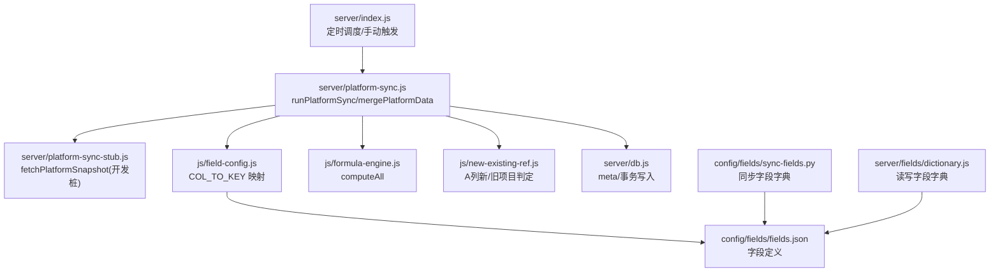
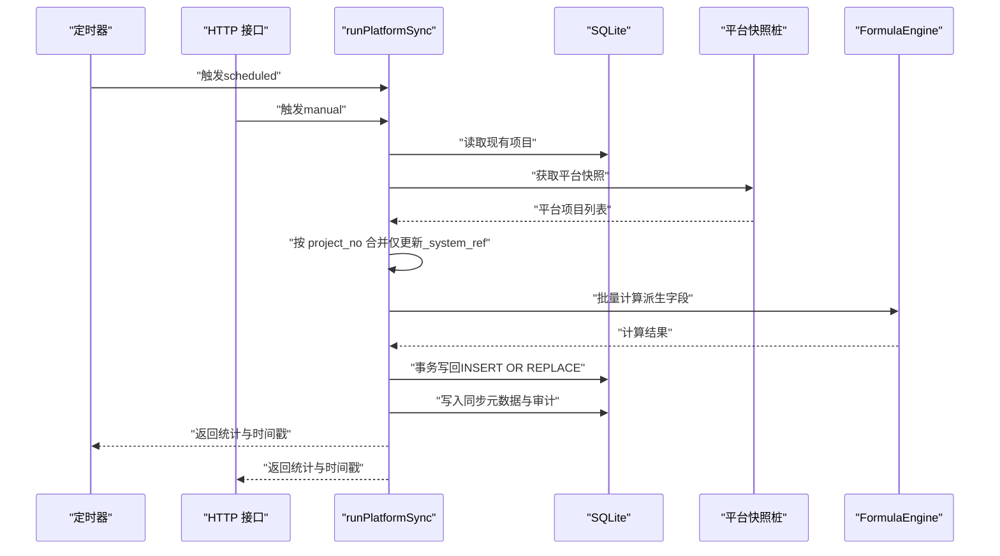
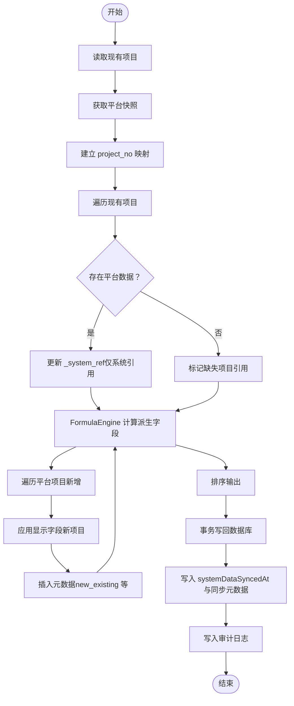
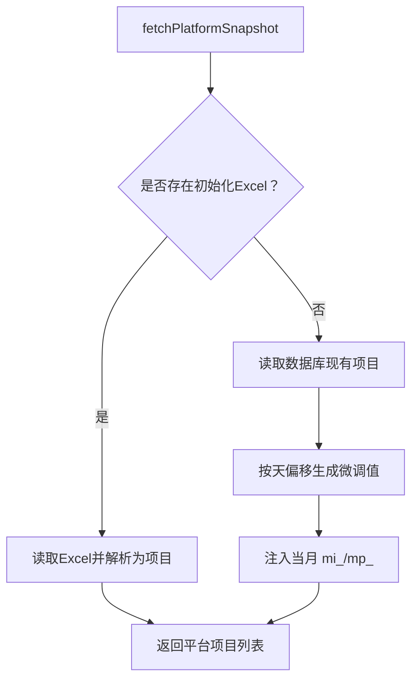
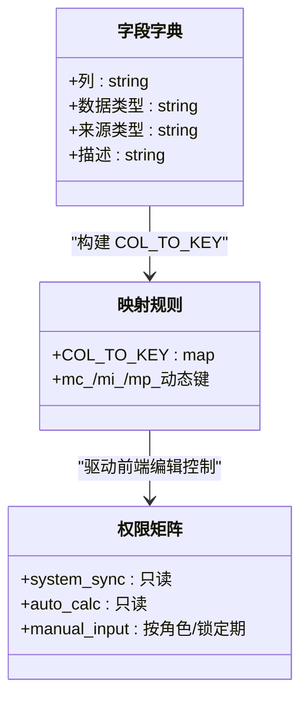
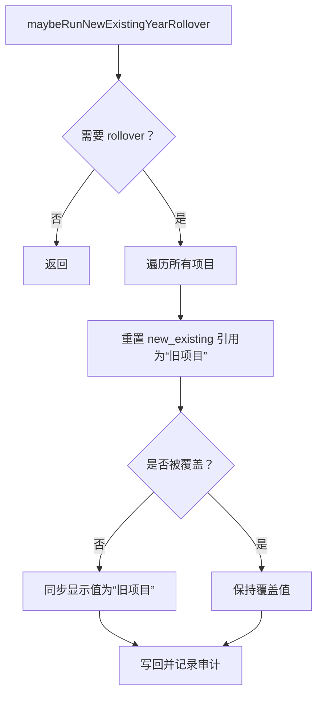
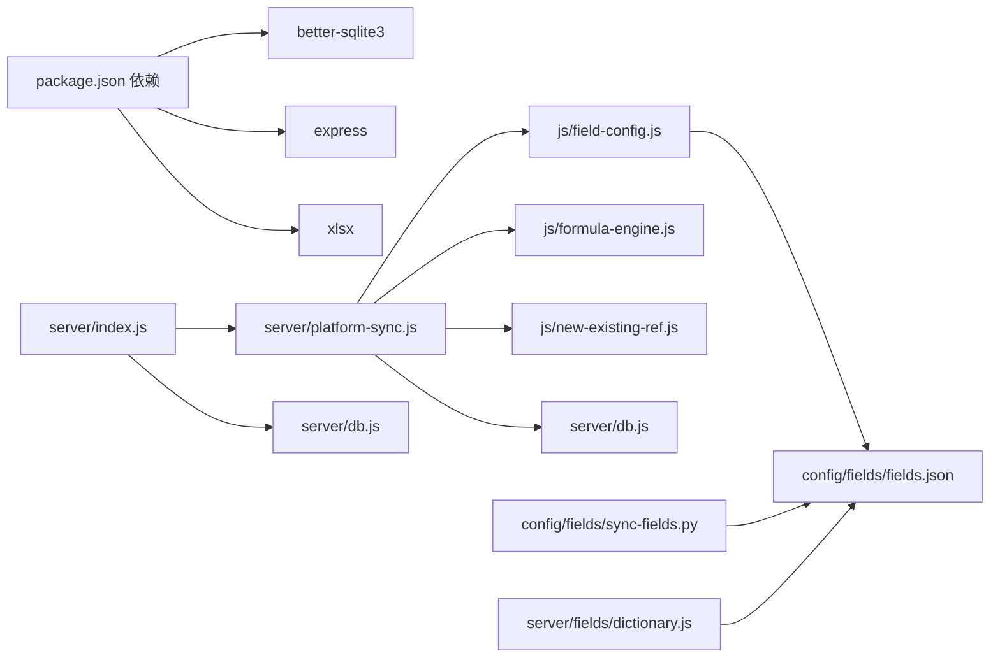

# 平台数据同步

<cite>
**本文引用的文件**
- [server/platform-sync.js](file://server/platform-sync.js)
- [server/platform-sync-stub.js](file://server/platform-sync-stub.js)
- [server/index.js](file://server/index.js)
- [js/field-config.js](file://js/field-config.js)
- [js/formula-engine.js](file://js/formula-engine.js)
- [js/new-existing-ref.js](file://js/new-existing-ref.js)
- [server/db.js](file://server/db.js)
- [config/fields/fields.json](file://config/fields/fields.json)
- [config/fields/sync-fields.py](file://config/fields/sync-fields.py)
- [server/fields/dictionary.js](file://server/fields/dictionary.js)
- [package.json](file://package.json)
</cite>

## 目录
1. [简介](#简介)
2. [项目结构](#项目结构)
3. [核心组件](#核心组件)
4. [架构总览](#架构总览)
5. [详细组件分析](#详细组件分析)
6. [依赖分析](#依赖分析)
7. [性能考量](#性能考量)
8. [故障排除指南](#故障排除指南)
9. [结论](#结论)
10. [附录](#附录)

## 简介
本文件面向“平台数据同步”主题，聚焦与外部平台（CRB 系统）的工程平台引用数据同步机制。内容涵盖同步触发条件、数据传输协议与来源、冲突与覆盖策略、增量同步算法、数据映射规则、验证机制、状态管理、错误重试与一致性保障、配置管理、性能优化与监控告警建议，并提供流程图、数据映射表与故障排除指南。

## 项目结构
围绕同步功能的关键模块与文件如下：
- 同步入口与调度：server/index.js
- 同步主流程与合并：server/platform-sync.js
- 平台快照获取（开发期桩）：server/platform-sync-stub.js
- 字段字典与映射：js/field-config.js、config/fields/fields.json、config/fields/sync-fields.py、server/fields/dictionary.js
- 公式计算与派生字段：js/formula-engine.js
- “新/旧项目”引用与年末 rollover：js/new-existing-ref.js
- 数据库与元数据：server/db.js
- 依赖声明：package.json

**图表来源**
- [server/index.js:745-774](file://server/index.js#L745-L774)
- [server/platform-sync.js:208-262](file://server/platform-sync.js#L208-L262)
- [server/platform-sync-stub.js:34-59](file://server/platform-sync-stub.js#L34-L59)
- [js/field-config.js:196-218](file://js/field-config.js#L196-L218)
- [js/formula-engine.js:88-101](file://js/formula-engine.js#L88-L101)
- [js/new-existing-ref.js:11-71](file://js/new-existing-ref.js#L11-L71)
- [server/db.js:16-57](file://server/db.js#L16-L57)
- [config/fields/fields.json:1-120](file://config/fields/fields.json#L1-L120)
- [config/fields/sync-fields.py:1-13](file://config/fields/sync-fields.py#L1-L13)
- [server/fields/dictionary.js:11-60](file://server/fields/dictionary.js#L11-L60)

**章节来源**
- [server/index.js:745-774](file://server/index.js#L745-L774)
- [server/platform-sync.js:208-262](file://server/platform-sync.js#L208-L262)
- [server/platform-sync-stub.js:34-59](file://server/platform-sync-stub.js#L34-L59)
- [js/field-config.js:196-218](file://js/field-config.js#L196-L218)
- [js/formula-engine.js:88-101](file://js/formula-engine.js#L88-L101)
- [js/new-existing-ref.js:11-71](file://js/new-existing-ref.js#L11-L71)
- [server/db.js:16-57](file://server/db.js#L16-L57)
- [config/fields/fields.json:1-120](file://config/fields/fields.json#L1-L120)
- [config/fields/sync-fields.py:1-13](file://config/fields/sync-fields.py#L1-L13)
- [server/fields/dictionary.js:11-60](file://server/fields/dictionary.js#L11-L60)

## 核心组件
- 同步入口与调度
  - 定时任务：每日固定小时运行，受锁定期限制；成功/失败均有控制台日志。
  - 手动触发：管理员或前端调用接口触发。
- 同步主流程
  - 读取现有项目与平台快照，按 project_no 合并，仅更新 _system_ref，不覆盖显示字段。
  - 计算派生字段，批量写回数据库。
- 平台快照来源
  - 生产环境：预留 CRB API 地址变量，当前抛出提示使用开发桩。
  - 开发桩：优先读取初始化 Excel；否则基于当前库克隆并微调当月开票/回款。
- 字段映射与权限
  - 字段字典定义 source_type/system_sync/auto_calc/manual_input。
  - COL_TO_KEY 将列字母映射为 JS 字段名；月度列动态映射至 mc_/mi_/mp_ 索引。
- 年末 rollover
  - “新/旧项目”引用按报告年度切换，支持 rollover 与覆盖。

**章节来源**
- [server/index.js:745-774](file://server/index.js#L745-L774)
- [server/index.js:580-625](file://server/index.js#L580-L625)
- [server/platform-sync.js:208-262](file://server/platform-sync.js#L208-L262)
- [server/platform-sync-stub.js:34-59](file://server/platform-sync-stub.js#L34-L59)
- [js/field-config.js:196-218](file://js/field-config.js#L196-L218)
- [js/new-existing-ref.js:58-66](file://js/new-existing-ref.js#L58-L66)

## 架构总览
平台数据同步采用“服务端定时/手动触发 + 字段字典驱动 + 公式引擎计算”的架构。核心流程如下：

**图表来源**
- [server/index.js:745-774](file://server/index.js#L745-L774)
- [server/index.js:580-625](file://server/index.js#L580-L625)
- [server/platform-sync.js:208-262](file://server/platform-sync.js#L208-L262)
- [server/platform-sync-stub.js:34-59](file://server/platform-sync-stub.js#L34-L59)
- [js/formula-engine.js:88-101](file://js/formula-engine.js#L88-L101)

## 详细组件分析

### 组件A：同步主流程与合并策略
- 关键函数
  - runPlatformSync：统一入口，负责读取现有项目、获取平台快照、合并、计算、写回、记录元数据与审计。
  - mergePlatformData：核心合并逻辑，按 project_no 建立映射，仅更新 _system_ref，不覆盖显示字段；对新增项目设置标志位与插入元数据。
  - maybeRunNewExistingYearRollover：年度切换时对全部项目执行 rollover。
- 冲突与覆盖策略
  - 仅更新 _system_ref 与 _system_override 中的系统引用字段，不覆盖显示字段。
  - 新项目默认标记为“新项目”，已有项目按年份判定。
  - 年末 rollover 会重置引用值，除非被系统管理员覆盖。
- 增量同步算法
  - 基于 project_no 的集合差集识别新增与缺失项目，分别处理。
  - 月度引用键（mi_/mp_）按报告月索引动态拼接。
- 数据一致性
  - 使用事务批量写回，确保原子性。
  - 计算完成后排序输出，便于审计与比对。

**图表来源**
- [server/platform-sync.js:83-150](file://server/platform-sync.js#L83-L150)
- [server/platform-sync.js:155-198](file://server/platform-sync.js#L155-L198)
- [server/platform-sync.js:214-262](file://server/platform-sync.js#L214-L262)
- [js/formula-engine.js:19-83](file://js/formula-engine.js#L19-L83)

**章节来源**
- [server/platform-sync.js:83-150](file://server/platform-sync.js#L83-L150)
- [server/platform-sync.js:155-198](file://server/platform-sync.js#L155-L198)
- [server/platform-sync.js:214-262](file://server/platform-sync.js#L214-L262)
- [js/formula-engine.js:19-83](file://js/formula-engine.js#L19-L83)

### 组件B：平台快照获取（开发期桩）
- 优先从初始化 Excel 读取作为“平台真值”。
- 若无 Excel，则基于当前库克隆，按天偏移微调当月开票/回款，保证同日多次同步结果一致。
- 生产环境预留 CRB API 地址变量，当前抛出提示使用开发桩。

**图表来源**
- [server/platform-sync-stub.js:34-59](file://server/platform-sync-stub.js#L34-L59)

**章节来源**
- [server/platform-sync-stub.js:34-59](file://server/platform-sync-stub.js#L34-L59)
- [server/platform-sync.js:200-206](file://server/platform-sync.js#L200-L206)

### 组件C：字段映射与权限
- 字段字典
  - fields.json 定义列、数据类型、来源类型（system_sync/auto_calc/manual_input）等。
  - COL_TO_KEY 将列字母映射为 JS 字段名，支持 mc_/mi_/mp_ 动态键。
- 权限与可见性
  - system_sync/auto_calc 默认只读；manual_input 按角色与锁定期决定可编辑范围。
  - 月度列在报告月当月及之后的编辑窗口不同，确保与平台同步值的一致性。

**图表来源**
- [config/fields/fields.json:1-120](file://config/fields/fields.json#L1-L120)
- [js/field-config.js:196-218](file://js/field-config.js#L196-L218)
- [js/field-config.js:104-122](file://js/field-config.js#L104-L122)

**章节来源**
- [config/fields/fields.json:1-120](file://config/fields/fields.json#L1-L120)
- [js/field-config.js:196-218](file://js/field-config.js#L196-L218)
- [js/field-config.js:104-122](file://js/field-config.js#L104-L122)

### 组件D：“新/旧项目”引用与年末 rollover
- 新项目：平台同步新增项目默认标记为“新项目”，并写入 _system_ref。
- 年度切换：若报告年度大于存储年度，则对全部项目执行 rollover，将引用值统一为“旧项目”，未覆盖的显示值同步更新。
- 覆盖机制：系统管理员可在前端覆盖显示值，不影响引用快照。

**图表来源**
- [server/platform-sync.js:155-198](file://server/platform-sync.js#L155-L198)
- [js/new-existing-ref.js:58-66](file://js/new-existing-ref.js#L58-L66)

**章节来源**
- [server/platform-sync.js:155-198](file://server/platform-sync.js#L155-L198)
- [js/new-existing-ref.js:58-66](file://js/new-existing-ref.js#L58-L66)

### 组件E：公式计算与派生字段
- FormulaEngine 接收项目对象与报告月索引，计算派生字段（如累计完成、WIP、应收账款等）。
- 支持批量计算 computeAll，确保合并后一次性产出完整项目对象。

**章节来源**
- [js/formula-engine.js:19-83](file://js/formula-engine.js#L19-L83)
- [js/formula-engine.js:88-101](file://js/formula-engine.js#L88-L101)

## 依赖分析
- 外部依赖
  - better-sqlite3：本地 SQLite 存储。
  - express：HTTP 服务与路由。
  - xlsx：Excel 解析。
- 内部模块耦合
  - server/index.js 依赖 platform-sync 与 db。
  - platform-sync 依赖 field-config、formula-engine、new-existing-ref、db。
  - 前端字段字典与映射由 js/field-config.js 与 config/fields/fields.json 驱动。

**图表来源**
- [package.json:13-18](file://package.json#L13-L18)
- [server/index.js:1-25](file://server/index.js#L1-L25)
- [server/platform-sync.js:1-17](file://server/platform-sync.js#L1-L17)
- [js/field-config.js:1-16](file://js/field-config.js#L1-L16)
- [js/formula-engine.js:1-10](file://js/formula-engine.js#L1-L10)
- [js/new-existing-ref.js:1-6](file://js/new-existing-ref.js#L1-L6)
- [server/db.js:1-10](file://server/db.js#L1-L10)
- [config/fields/fields.json:1-120](file://config/fields/fields.json#L1-L120)
- [config/fields/sync-fields.py:1-13](file://config/fields/sync-fields.py#L1-L13)
- [server/fields/dictionary.js:1-10](file://server/fields/dictionary.js#L1-L10)

**章节来源**
- [package.json:13-18](file://package.json#L13-L18)
- [server/index.js:1-25](file://server/index.js#L1-L25)
- [server/platform-sync.js:1-17](file://server/platform-sync.js#L1-L17)
- [js/field-config.js:1-16](file://js/field-config.js#L1-L16)
- [js/formula-engine.js:1-10](file://js/formula-engine.js#L1-L10)
- [js/new-existing-ref.js:1-6](file://js/new-existing-ref.js#L1-L6)
- [server/db.js:1-10](file://server/db.js#L1-L10)
- [config/fields/fields.json:1-120](file://config/fields/fields.json#L1-L120)
- [config/fields/sync-fields.py:1-13](file://config/fields/sync-fields.py#L1-L13)
- [server/fields/dictionary.js:1-10](file://server/fields/dictionary.js#L1-L10)

## 性能考量
- 数据库事务
  - 合并后批量写回，使用事务确保原子性，减少锁竞争与 IO 次数。
- 计算批量化
  - FormulaEngine 提供 computeAll，避免逐条计算带来的重复开销。
- 索引与查询
  - 项目表按 project_no 主键存储，查询与排序效率较高。
- 定时调度节流
  - 按日定时，避免重复执行；结合锁定期状态过滤，防止并发冲突。
- 开发桩优化
  - 基于现有库克隆并按天偏移微调，减少 IO 与解析成本。

**章节来源**
- [server/platform-sync.js:231-237](file://server/platform-sync.js#L231-L237)
- [js/formula-engine.js:88-101](file://js/formula-engine.js#L88-L101)
- [server/db.js:16-57](file://server/db.js#L16-L57)
- [server/index.js:757-774](file://server/index.js#L757-L774)
- [server/platform-sync-stub.js:44-58](file://server/platform-sync-stub.js#L44-L58)

## 故障排除指南
- 定时同步未执行
  - 检查锁定期状态与平台同步小时配置；确认定时器运行。
  - 查看控制台日志中的“定时平台同步失败”提示。
- 同步后显示值未更新
  - 确认字段来源类型为 system_sync/auto_calc；这些字段默认只读。
  - 如需覆盖，使用系统管理员权限进行覆盖。
- 新项目未标记为“新项目”
  - 确认平台同步新增项目路径是否正确；检查 _system_ref 与 _new_existing_year 是否写入。
- 年末 rollover 未生效
  - 检查 reportingMonth 与 stored year 的关系；确认 needsYearRollover 条件满足。
- 字段字典异常
  - 使用 /api/admin/fields 接口校验与更新字段字典；确保字段 col 唯一且 source_type 合法。
- 平台快照为空
  - 确认初始化 Excel 是否存在；否则开发桩将基于现有库生成快照。

**章节来源**
- [server/index.js:745-774](file://server/index.js#L745-L774)
- [js/field-config.js:104-122](file://js/field-config.js#L104-L122)
- [js/new-existing-ref.js:68-71](file://js/new-existing-ref.js#L68-L71)
- [server/fields/dictionary.js:20-41](file://server/fields/dictionary.js#L20-L41)
- [server/platform-sync-stub.js:34-59](file://server/platform-sync-stub.js#L34-L59)

## 结论
本同步机制以“字段字典驱动 + 公式引擎计算 + 事务写回”为核心，实现了与 CRB 平台的工程平台引用同步。通过仅更新 _system_ref、严格的权限控制与年末 rollover，确保了显示值与系统引用的分离与一致性。定时调度与开发桩设计兼顾生产可用性与开发调试效率。建议后续完善 CRB API 集成与监控告警，进一步提升稳定性与可观测性。

## 附录

### 同步触发条件与方式
- 定时触发：每日固定小时（可配置），仅在锁定期为 open 时执行。
- 手动触发：管理员或前端调用接口触发。

**章节来源**
- [server/index.js:745-774](file://server/index.js#L745-L774)
- [server/index.js:580-625](file://server/index.js#L580-L625)

### 数据传输协议与来源
- 协议：HTTP REST API。
- 来源：开发期使用初始化 Excel 或现有库克隆生成平台快照；生产期预留 CRB API 地址变量。

**章节来源**
- [server/platform-sync-stub.js:34-59](file://server/platform-sync-stub.js#L34-L59)
- [server/platform-sync.js:200-206](file://server/platform-sync.js#L200-L206)

### 冲突解决与覆盖策略
- 仅更新 _system_ref 与 _system_override 中的系统引用字段。
- 新项目默认“新项目”，已有项目按年份判定。
- 年末 rollover 重置引用值，未覆盖的显示值同步更新。

**章节来源**
- [server/platform-sync.js:48-58](file://server/platform-sync.js#L48-L58)
- [server/platform-sync.js:155-198](file://server/platform-sync.js#L155-L198)
- [js/new-existing-ref.js:28-43](file://js/new-existing-ref.js#L28-L43)

### 增量同步算法要点
- 基于 project_no 的集合差集识别新增与缺失项目。
- 月度引用键（mi_/mp_）按报告月索引动态拼接。
- 仅更新 _system_ref，不覆盖显示字段。

**章节来源**
- [server/platform-sync.js:83-150](file://server/platform-sync.js#L83-L150)
- [server/platform-sync.js:19-24](file://server/platform-sync.js#L19-L24)

### 数据映射规则与验证
- 列字母到 JS 字段名映射：COL_TO_KEY。
- 月度列动态映射：mc_0..mc_11、mi_0..mi_11、mp_0..mp_11。
- 字段字典校验：col 唯一、source_type 合法、id 自动补齐。

**章节来源**
- [js/field-config.js:196-218](file://js/field-config.js#L196-L218)
- [js/field-config.js:223-240](file://js/field-config.js#L223-L240)
- [server/fields/dictionary.js:20-41](file://server/fields/dictionary.js#L20-L41)

### 同步状态管理与审计
- 元数据：systemDataSyncedAt、systemDataSyncMeta。
- 审计：记录操作类型、触发来源、统计信息与操作人。

**章节来源**
- [server/platform-sync.js:244-259](file://server/platform-sync.js#L244-L259)
- [server/db.js:93-106](file://server/db.js#L93-L106)

### 性能优化建议
- 批量写回与事务：已实现。
- 公式批量化：已实现。
- 索引与查询：项目表主键高效。
- 定时节流：已实现。
- 开发桩微调：已实现。

**章节来源**
- [server/platform-sync.js:231-237](file://server/platform-sync.js#L231-L237)
- [js/formula-engine.js:88-101](file://js/formula-engine.js#L88-L101)
- [server/db.js:16-57](file://server/db.js#L16-L57)
- [server/index.js:757-774](file://server/index.js#L757-L774)
- [server/platform-sync-stub.js:23-26](file://server/platform-sync-stub.js#L23-L26)

### 监控告警机制建议
- 控制台日志：定时同步成功/失败日志。
- 审计日志：记录每次同步的触发来源、统计与操作人。
- 元数据：systemDataSyncedAt 与 systemDataSyncMeta 便于前端展示与告警。

**章节来源**
- [server/index.js:745-774](file://server/index.js#L745-L774)
- [server/platform-sync.js:244-259](file://server/platform-sync.js#L244-L259)