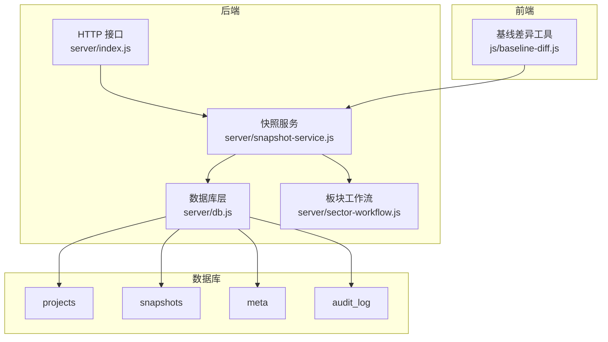
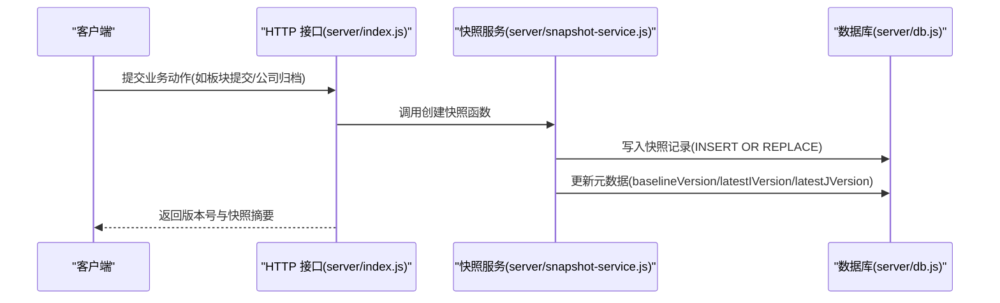
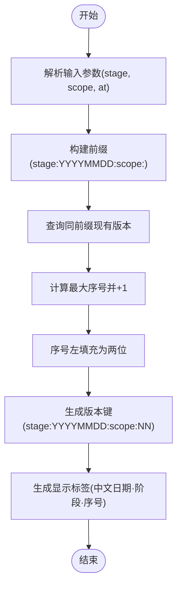
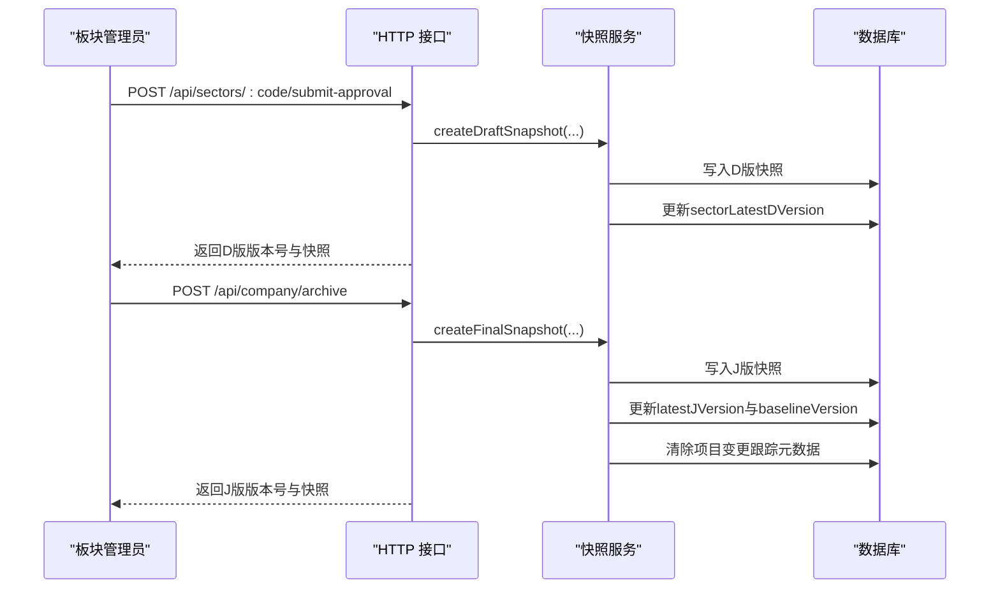
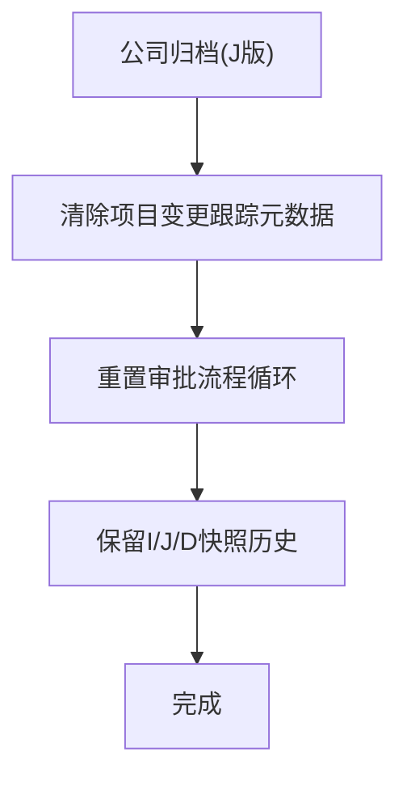
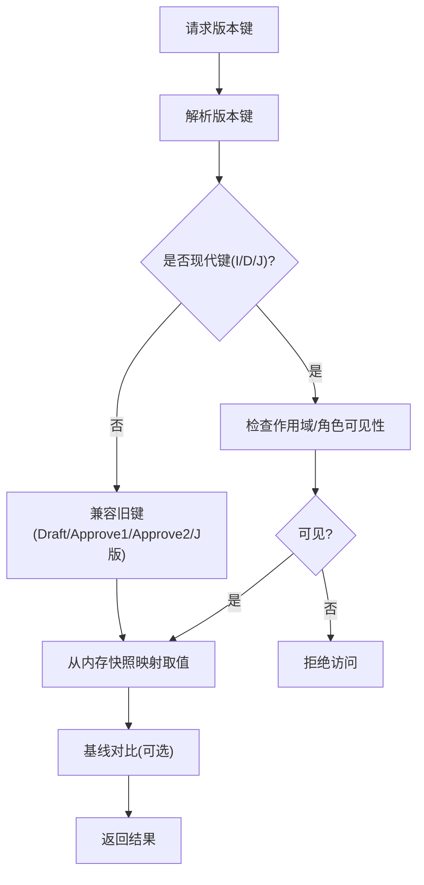
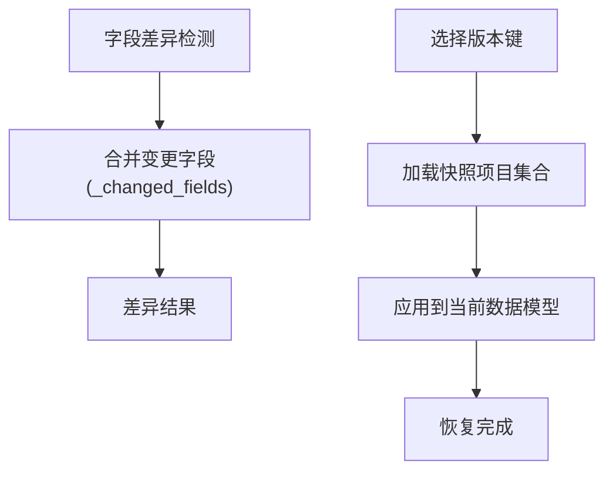
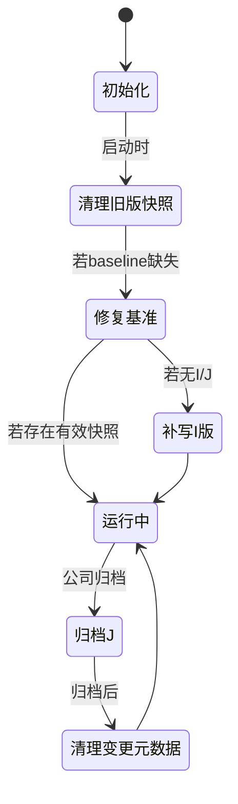
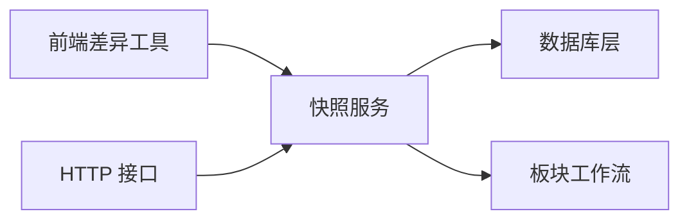
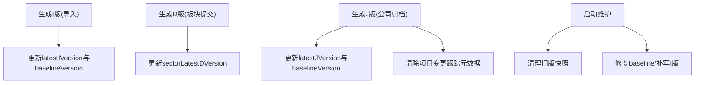

# 快照服务

<cite>
**本文引用的文件**
- [server/snapshot-service.js](file://server/snapshot-service.js)
- [server/index.js](file://server/index.js)
- [server/db.js](file://server/db.js)
- [server/sector-workflow.js](file://server/sector-workflow.js)
- [js/baseline-diff.js](file://js/baseline-diff.js)
- [test/snapshot-change-log.test.js](file://test/snapshot-change-log.test.js)
- [database-schema.sql](file://database-schema.sql)
</cite>

## 目录
1. [简介](#简介)
2. [项目结构](#项目结构)
3. [核心组件](#核心组件)
4. [架构总览](#架构总览)
5. [详细组件分析](#详细组件分析)
6. [依赖关系分析](#依赖关系分析)
7. [性能考量](#性能考量)
8. [故障排查指南](#故障排查指南)
9. [结论](#结论)
10. [附录](#附录)

## 简介
本文件系统性阐述“快照服务”的设计与实现，覆盖快照版本管理、数据归档策略、历史数据保存、生成时机、序列化格式、存储结构、检索算法、版本比较逻辑、数据恢复机制、生命周期管理、存储优化与并发控制方案，并提供流程图、数据结构设计与性能监控指标建议。目标是帮助开发者与运维人员快速理解并高效使用快照能力。

## 项目结构
快照服务位于后端 server 目录，前端在 js 目录中提供差异对比与可见性判断工具。数据库采用 SQLite，核心表为 projects、snapshots、meta、audit_log 等。

图表来源
- [server/snapshot-service.js:1-292](file://server/snapshot-service.js#L1-L292)
- [server/index.js:1-775](file://server/index.js#L1-L775)
- [server/db.js:1-525](file://server/db.js#L1-L525)
- [server/sector-workflow.js:1-273](file://server/sector-workflow.js#L1-L273)
- [js/baseline-diff.js:1-117](file://js/baseline-diff.js#L1-L117)

章节来源
- [server/snapshot-service.js:1-292](file://server/snapshot-service.js#L1-L292)
- [server/index.js:1-775](file://server/index.js#L1-L775)
- [server/db.js:1-525](file://server/db.js#L1-L525)
- [server/sector-workflow.js:1-273](file://server/sector-workflow.js#L1-L273)
- [js/baseline-diff.js:1-117](file://js/baseline-diff.js#L1-L117)

## 核心组件
- 快照版本管理与生成
  - 导入快照（I）、草稿快照（D）、最终归档快照（J）
  - 版本键规则：阶段:日期:作用域:序号
  - 元数据维护：baselineVersion、latestIVersion、latestJVersion、sectorLatestDVersion
- 数据归档策略
  - 归档后清除项目变更跟踪元数据，重置审批流程循环
- 历史数据保存
  - snapshots 表持久化快照；bootstrap 时合并迁移旧版快照
- 快照检索与可见性
  - 前端基于版本键解析与可见性判断
- 生命周期与维护
  - 启动时清理旧版快照、修复 baseline 与快照行不一致、必要时补写 I 版

章节来源
- [server/snapshot-service.js:53-158](file://server/snapshot-service.js#L53-L158)
- [server/snapshot-service.js:160-189](file://server/snapshot-service.js#L160-L189)
- [server/snapshot-service.js:229-274](file://server/snapshot-service.js#L229-L274)
- [server/db.js:194-266](file://server/db.js#L194-L266)
- [js/baseline-diff.js:75-102](file://js/baseline-diff.js#L75-L102)

## 架构总览
快照服务围绕“不可变快照 + 元数据驱动”展开：
- 生成阶段：根据业务动作（导入、板块提交、公司归档）生成对应快照
- 存储阶段：以 JSON 文本形式存入 snapshots 表，版本键唯一
- 查询阶段：bootstrap 时加载到内存，前端按版本键检索
- 维护阶段：启动时清理旧版快照、修复 baseline、必要时补写 I 版

图表来源
- [server/index.js:302-346](file://server/index.js#L302-L346)
- [server/index.js:419-446](file://server/index.js#L419-L446)
- [server/snapshot-service.js:88-158](file://server/snapshot-service.js#L88-L158)
- [server/db.js:310-313](file://server/db.js#L310-L313)

## 详细组件分析

### 版本键与序列化
- 版本键规则
  - I/D/J 阶段键：I/日期/作用域/序号；D/日期/板块/序号；J/日期/作用域/序号
  - 日期格式：YYYYMMDD；序号两位左填充
- 序列化格式
  - 快照 payload 为 JSON 文本，包含版本、时间、用户、角色、报告月、范围、标签、项目集合等
  - 项目集合在不同快照类型下进行元数据清洗，确保一致性与隐私
- 作用域与显示
  - 支持公司级（ALL）与板块级（SASxxx），显示标签包含中文日期、阶段与序号

图表来源
- [server/snapshot-service.js:53-68](file://server/snapshot-service.js#L53-L68)
- [server/snapshot-service.js:75-86](file://server/snapshot-service.js#L75-L86)

章节来源
- [server/snapshot-service.js:53-86](file://server/snapshot-service.js#L53-L86)
- [server/snapshot-service.js:106-157](file://server/snapshot-service.js#L106-L157)

### 快照生成时机与流程
- 导入快照（I）
  - 触发：首次导入或重导；自动设置 baselineVersion 与 latestIVersion
- 草稿快照（D）
  - 触发：板块管理员提交审批；按板块过滤项目；更新最新 D 版本
- 最终归档快照（J）
  - 触发：公司管理员归档；自动设置 baselineVersion 与 latestJVersion；清除项目变更跟踪元数据；重置审批流程循环

图表来源
- [server/index.js:302-346](file://server/index.js#L302-L346)
- [server/index.js:419-446](file://server/index.js#L419-L446)
- [server/snapshot-service.js:114-158](file://server/snapshot-service.js#L114-L158)
- [server/db.js:428-430](file://server/db.js#L428-L430)

章节来源
- [server/index.js:302-346](file://server/index.js#L302-L346)
- [server/index.js:419-446](file://server/index.js#L419-L446)
- [server/snapshot-service.js:88-158](file://server/snapshot-service.js#L88-L158)
- [server/db.js:428-430](file://server/db.js#L428-L430)

### 数据归档策略与历史数据保存
- 归档后行为
  - 清除项目变更跟踪元数据（_field_change_log、_changed_fields 等）
  - 重置审批流程循环（approvalStatus、reportingSubmitted、pmSubmissions、companyFlow、sectorFlows 等）
- 历史保留
  - I/J/D 快照作为不可变历史记录长期保存于 snapshots 表
  - bootstrap 时合并迁移旧版快照键，保证历史可追溯

图表来源
- [server/db.js:428-430](file://server/db.js#L428-L430)
- [server/db.js:351-370](file://server/db.js#L351-L370)
- [server/snapshot-service.js:229-274](file://server/snapshot-service.js#L229-L274)

章节来源
- [server/db.js:428-430](file://server/db.js#L428-L430)
- [server/db.js:351-370](file://server/db.js#L351-L370)
- [server/snapshot-service.js:229-274](file://server/snapshot-service.js#L229-L274)

### 快照检索算法与版本可见性
- 前端检索
  - 通过版本键直接从内存快照映射中取值
  - 支持解析版本键（阶段、日期、作用域、序号）
  - 对现代键（I/D/J）与旧键（Draft/Approve1/Approve2/J版等）做兼容
- 可见性控制
  - I/J 对所有角色可见
  - D 版仅对系统管理员或对应板块管理员可见
- 基线对比
  - 基于 baselineVersion 解析对应快照，用于新增项目标记与字段差异对比

图表来源
- [js/baseline-diff.js:75-102](file://js/baseline-diff.js#L75-L102)
- [server/index.js:287-300](file://server/index.js#L287-L300)
- [server/snapshot-service.js:160-170](file://server/snapshot-service.js#L160-L170)

章节来源
- [js/baseline-diff.js:75-102](file://js/baseline-diff.js#L75-L102)
- [server/index.js:287-300](file://server/index.js#L287-L300)
- [server/snapshot-service.js:160-170](file://server/snapshot-service.js#L160-L170)

### 版本比较逻辑与数据恢复机制
- 版本比较
  - 基于字段值差异检测，支持金额/比率精度比较
  - 合并变更字段集合（来自差异与变更日志）
- 数据恢复
  - 通过解析版本键定位快照，读取项目集合进行恢复
  - 启动时维护器可修复 baseline 与快照行不一致，必要时补写 I 版

图表来源
- [js/baseline-diff.js:34-73](file://js/baseline-diff.js#L34-L73)
- [server/snapshot-service.js:229-274](file://server/snapshot-service.js#L229-L274)

章节来源
- [js/baseline-diff.js:34-73](file://js/baseline-diff.js#L34-L73)
- [server/snapshot-service.js:229-274](file://server/snapshot-service.js#L229-L274)

### 生命周期管理与存储优化
- 生命周期
  - 创建：生成版本键、写入快照、更新元数据
  - 访问：bootstrap 加载、前端按键检索
  - 维护：启动时清理旧版快照、修复 baseline、必要时补写 I 版
- 存储优化
  - 使用 WAL 模式提升并发读写性能
  - 快照以 JSON 文本存储，便于跨版本兼容
  - 元数据集中管理，避免冗余字段

图表来源
- [server/snapshot-service.js:229-274](file://server/snapshot-service.js#L229-L274)
- [server/db.js:14-14](file://server/db.js#L14-L14)

章节来源
- [server/snapshot-service.js:229-274](file://server/snapshot-service.js#L229-L274)
- [server/db.js:14-14](file://server/db.js#L14-L14)

### 并发控制方案
- 数据库事务
  - 批量替换项目数据使用事务，保证一致性
- 锁定状态
  - 通过周期配置与锁定/解锁日期动态计算锁状态，影响快照生成时机
- 并发读写
  - WAL 模式提升读写并发度；快照写入为单版本键唯一插入

章节来源
- [server/db.js:268-278](file://server/db.js#L268-L278)
- [server/db.js:121-142](file://server/db.js#L121-L142)
- [server/db.js:14-14](file://server/db.js#L14-L14)

## 依赖关系分析
- 快照服务依赖数据库层进行快照写入与元数据读写
- 快照服务依赖板块工作流进行作用域规范化与项目筛选
- 前端差异工具依赖快照服务提供的版本键解析与可见性判断
- HTTP 接口在业务动作触发时调用快照服务并更新状态

图表来源
- [server/snapshot-service.js:1-6](file://server/snapshot-service.js#L1-L6)
- [js/baseline-diff.js:1-117](file://js/baseline-diff.js#L1-L117)
- [server/index.js:1-775](file://server/index.js#L1-L775)

章节来源
- [server/snapshot-service.js:1-6](file://server/snapshot-service.js#L1-L6)
- [js/baseline-diff.js:1-117](file://js/baseline-diff.js#L1-L117)
- [server/index.js:1-775](file://server/index.js#L1-L775)

## 性能考量
- 写入性能
  - 快照写入为单键插入，索引唯一；批量导入时建议分批处理
- 查询性能
  - bootstrap 一次性加载快照到内存，前端按键检索 O(1)
- 存储体积
  - JSON 文本存储；可通过定期清理旧版快照降低体积
- 并发读写
  - WAL 模式显著提升并发读写；注意避免同时大量写入快照

[本节为通用性能指导，不直接分析具体文件]

## 故障排查指南
- 快照缺失或不可见
  - 检查版本键是否为现代键（I/D/J）或兼容旧键
  - 确认角色与作用域可见性
- 基线不一致
  - 启动时维护器会尝试修复；若无有效快照则补写 I 版
- 归档后异常
  - 确认是否正确清除项目变更跟踪元数据与重置流程循环
- 单元测试参考
  - 测试验证 D/J 快照保留累积变更日志，I 快照清理瞬态日志

章节来源
- [test/snapshot-change-log.test.js:33-58](file://test/snapshot-change-log.test.js#L33-L58)
- [server/snapshot-service.js:229-274](file://server/snapshot-service.js#L229-L274)

## 结论
快照服务通过“不可变快照 + 元数据驱动”的方式，实现了项目数据在导入、草稿、归档等关键节点的历史记录与可追溯性。其版本键设计清晰、序列化简单、前端可见性控制合理、生命周期维护自动化，适合在生产环境中稳定运行。建议结合 WAL 模式与合理的清理策略，持续优化性能与存储占用。

[本节为总结性内容，不直接分析具体文件]

## 附录

### 数据结构设计
- 快照记录结构（JSON 文本）
  - version: 版本键
  - time: ISO 时间戳
  - user/role: 操作人与角色
  - reportingMonth: 报告月
  - scope: { kind, code }
  - label: 显示标签
  - projects: 项目集合（按类型清洗元数据）
- 元数据键
  - baselineVersion: 基线版本
  - latestIVersion: 最新 I 版
  - latestJVersion: 最新 J 版
  - sectorLatestDVersion: 各板块最新 D 版
- 数据库表
  - snapshots: version 唯一，payload JSON 文本
  - meta: key/value 存放元数据
  - projects: 项目 JSON 文本
  - audit_log: 审计日志 JSON 文本

章节来源
- [server/snapshot-service.js:96-157](file://server/snapshot-service.js#L96-L157)
- [server/db.js:25-57](file://server/db.js#L25-L57)
- [database-schema.sql:279-286](file://database-schema.sql#L279-L286)

### 快照流程图（生成与维护）

图表来源
- [server/snapshot-service.js:88-158](file://server/snapshot-service.js#L88-L158)
- [server/snapshot-service.js:229-274](file://server/snapshot-service.js#L229-L274)

### 性能监控指标建议
- 快照写入延迟（ms）
- 快照查询响应时间（ms）
- 快照数量与大小（条数、MB）
- 元数据更新频率（baselineVersion/latestIVersion/latestJVersion 变更次数）
- 启动维护耗时（清理旧版、修复/补写）

[本节为通用指标建议，不直接分析具体文件]