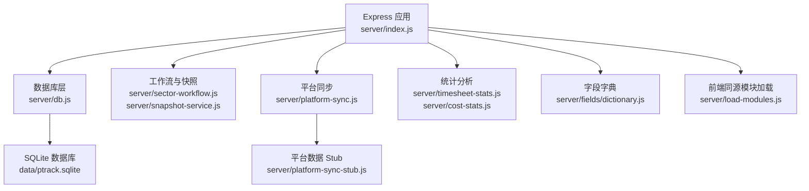
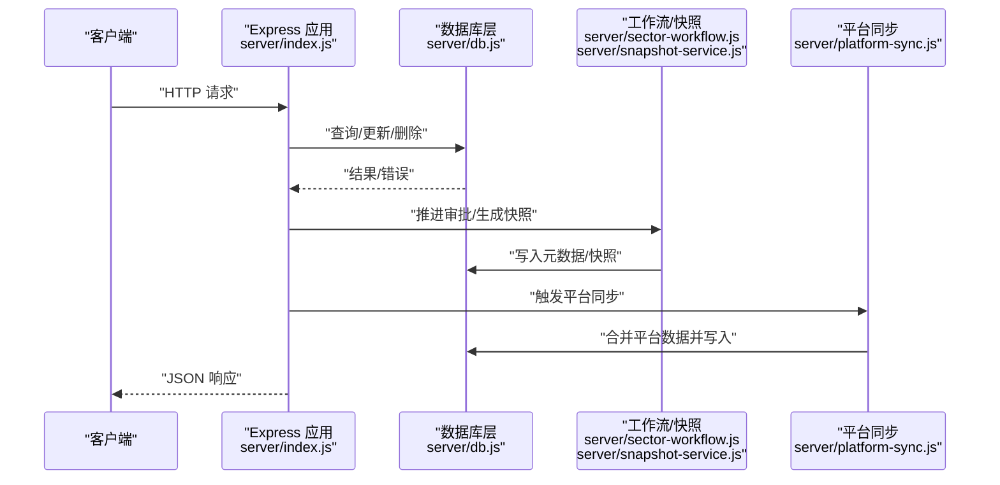
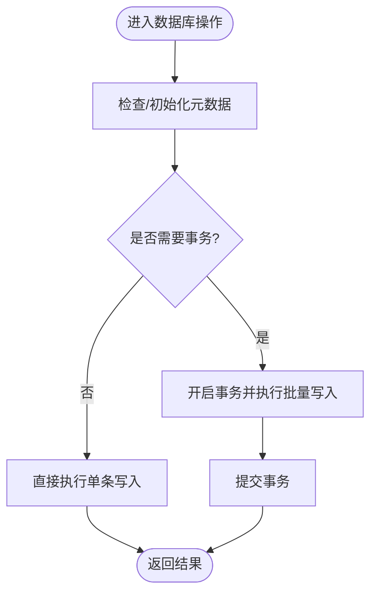
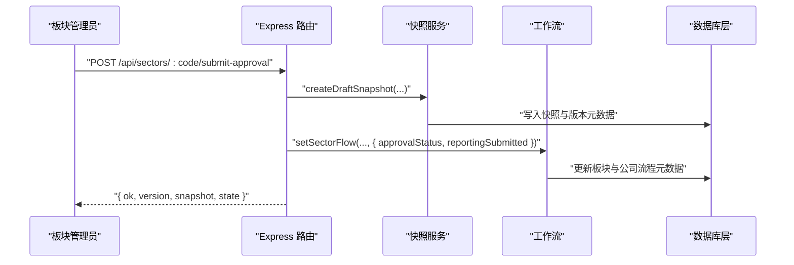
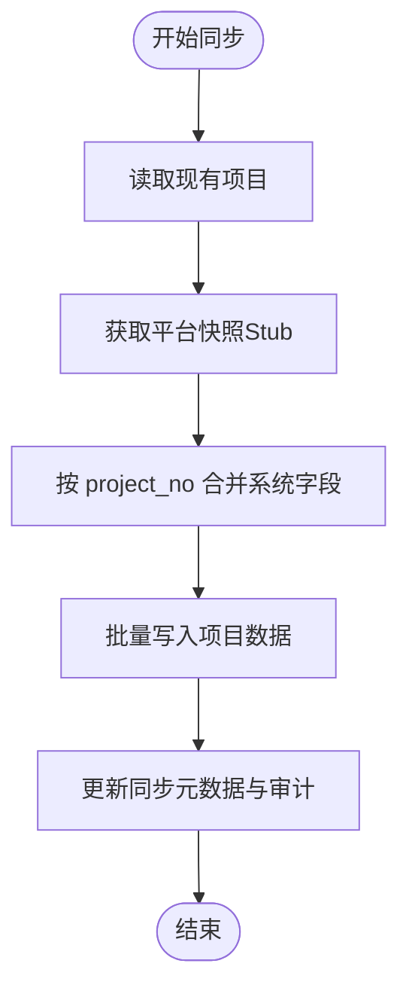
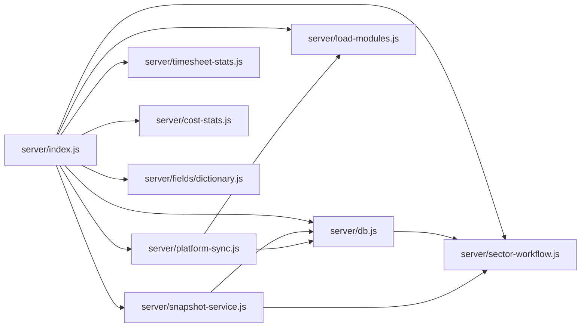

# 后端架构

<cite>
**本文引用的文件**
- [server/index.js](file://server/index.js)
- [server/db.js](file://server/db.js)
- [server/load-modules.js](file://server/load-modules.js)
- [server/sector-workflow.js](file://server/sector-workflow.js)
- [server/snapshot-service.js](file://server/snapshot-service.js)
- [server/platform-sync.js](file://server/platform-sync.js)
- [server/timesheet-stats.js](file://server/timesheet-stats.js)
- [server/cost-stats.js](file://server/cost-stats.js)
- [server/fields/dictionary.js](file://server/fields/dictionary.js)
- [server/cost-categories.js](file://server/cost-categories.js)
- [package.json](file://package.json)
- [database-schema.sql](file://database-schema.sql)
</cite>

## 目录
1. [简介](#简介)
2. [项目结构](#项目结构)
3. [核心组件](#核心组件)
4. [架构总览](#架构总览)
5. [详细组件分析](#详细组件分析)
6. [依赖关系分析](#依赖关系分析)
7. [性能考量](#性能考量)
8. [故障排查指南](#故障排查指南)
9. [结论](#结论)
10. [附录](#附录)

## 简介
本项目是一个基于 Express.js + SQLite 的“项目执行追踪平台”后端，提供 RESTful API 以支撑项目主数据、工时与成本统计、审批快照、平台数据同步、字段字典管理、以及开发环境重置等功能。系统采用模块化设计，围绕数据库层、业务工作流、快照服务、平台同步与统计分析等模块构建。

## 项目结构
后端主要位于 server 目录，入口为 server/index.js，负责启动服务、注册路由、加载前端同源脚本模块、初始化数据库与种子数据、并调度定时任务。数据库层封装在 server/db.js，工作流与快照在 server/sector-workflow.js 与 server/snapshot-service.js，平台同步在 server/platform-sync.js，统计分析在 server/timesheet-stats.js 与 server/cost-stats.js，字段字典在 server/fields/dictionary.js，成本分类在 server/cost-categories.js。

图表来源
- [server/index.js:88-775](file://server/index.js#L88-L775)
- [server/db.js:11-60](file://server/db.js#L11-L60)
- [server/sector-workflow.js:1-273](file://server/sector-workflow.js#L1-L273)
- [server/snapshot-service.js:1-292](file://server/snapshot-service.js#L1-L292)
- [server/platform-sync.js:1-272](file://server/platform-sync.js#L1-L272)
- [server/timesheet-stats.js:1-87](file://server/timesheet-stats.js#L1-L87)
- [server/cost-stats.js:1-82](file://server/cost-stats.js#L1-L82)
- [server/fields/dictionary.js:1-70](file://server/fields/dictionary.js#L1-L70)
- [server/load-modules.js:1-41](file://server/load-modules.js#L1-L41)

章节来源
- [server/index.js:1-775](file://server/index.js#L1-L775)
- [package.json:1-19](file://package.json#L1-L19)

## 核心组件
- 应用入口与路由：server/index.js 注册所有 API 路由，包括项目 CRUD、报表统计、快照管理、审批流程、管理员功能、平台同步触发等。
- 数据库层：server/db.js 封装 SQLite 连接、元数据管理、项目与审计日志、快照存储、工时与成本数据的增删改查。
- 工作流与快照：server/sector-workflow.js 定义板块工作流状态机与快照版本规则；server/snapshot-service.js 负责快照生成、版本号构建、基线修复与清理。
- 平台同步：server/platform-sync.js 负责合并平台数据到项目数据，支持定时与手动触发，记录同步元数据与审计。
- 统计分析：server/timesheet-stats.js 与 server/cost-stats.js 提供工时与成本的月度聚合统计。
- 字段字典：server/fields/dictionary.js 提供字段定义的读写与校验，同步到前端同源脚本。
- 前端同源模块：server/load-modules.js 使用 vm 在 Node 环境加载前端字段配置、公式引擎与参考数据，确保前后端字段一致性。

章节来源
- [server/index.js:88-775](file://server/index.js#L88-L775)
- [server/db.js:11-525](file://server/db.js#L11-L525)
- [server/sector-workflow.js:1-273](file://server/sector-workflow.js#L1-L273)
- [server/snapshot-service.js:1-292](file://server/snapshot-service.js#L1-L292)
- [server/platform-sync.js:1-272](file://server/platform-sync.js#L1-L272)
- [server/timesheet-stats.js:1-87](file://server/timesheet-stats.js#L1-L87)
- [server/cost-stats.js:1-82](file://server/cost-stats.js#L1-L82)
- [server/fields/dictionary.js:1-70](file://server/fields/dictionary.js#L1-L70)
- [server/load-modules.js:1-41](file://server/load-modules.js#L1-L41)

## 架构总览
系统采用单体后端架构，Express 作为 Web 框架，SQLite 作为持久化存储，配合内存中的前端同源脚本模块，实现前后端字段与计算的一致性。核心数据流包括：
- 请求进入 Express，路由根据资源与动作分发到对应处理器。
- 处理器调用数据库层进行数据读写与事务管理。
- 工作流与快照模块参与审批状态推进与快照生成。
- 平台同步模块拉取外部平台数据并合并到项目数据。
- 统计分析模块对工时与成本进行聚合输出。

图表来源
- [server/index.js:112-446](file://server/index.js#L112-L446)
- [server/db.js:194-266](file://server/db.js#L194-L266)
- [server/sector-workflow.js:232-248](file://server/sector-workflow.js#L232-L248)
- [server/snapshot-service.js:114-158](file://server/snapshot-service.js#L114-L158)
- [server/platform-sync.js:214-262](file://server/platform-sync.js#L214-L262)

## 详细组件分析

### RESTful API 设计与路由组织
- 资源与动作
  - 项目资源：GET/PUT/POST 项目集合与单项目；支持替换全量项目与按编号更新。
  - 报表统计：按项目号查询工时与成本统计，支持按年过滤。
  - 审批与快照：按板块提交审批、推进审批、驳回、公司归档；支持获取与写入快照。
  - 管理员：重导数据、导入工时/成本、刷新平台数据、重置开发环境、用户与字段字典管理。
  - 引导与字段：引导数据与字段字典只读与写入。
- 路由组织
  - 顶层路由集中于 server/index.js，按资源域分组（如 /api/projects、/api/snapshots、/api/sectors、/api/admin 等），便于扩展与维护。
- 请求与响应
  - 统一使用 JSON；错误通过 4xx/5xx 状态码与 { error } 结构返回；成功响应包含 { ok } 或具体数据对象。
- 版本管理
  - 代码未显式实现路径版本号（如 /v1/...），但快照版本采用 I/D/J 前缀与日期序列号，形成内部版本语义。

章节来源
- [server/index.js:88-775](file://server/index.js#L88-L775)

### 中间件与请求处理
- 中间件
  - 默认启用 express.json({ limit: '80mb' })，支持较大的批量导入请求。
  - 静态文件托管：app.use(express.static(ROOT))，用于前端资源。
- 错误处理
  - 路由层统一 try/catch 包裹，捕获异常并返回 500 与错误消息；部分管理员端点使用 e.status 控制 HTTP 码。
- 定时任务
  - 每日定时平台同步：scheduleDailyPlatformSync 基于周期配置在指定小时运行 runScheduledPlatformSync。

章节来源
- [server/index.js:88-90](file://server/index.js#L88-L90)
- [server/index.js:745-775](file://server/index.js#L745-L775)

### 数据库连接管理与事务
- 连接与初始化
  - openDb 创建 SQLite 连接，设置 WAL 模式；创建 projects、audit_log、snapshots、meta、timesheet_entries、cost_entries 等表与索引。
- 元数据管理
  - getMeta/setMeta 提供键值对存储，用于周期配置、锁状态、审批状态、用户与板块管理员配置、快照版本等。
- 事务与批量操作
  - replaceAllProjects、replaceProjectTimesheet、replaceProjectCostEntries 使用事务包裹，保证批量写入原子性。
- 查询与统计
  - 提供 getTimesheetEntries/getCostEntries 等查询方法，配合 timesheet-stats.js 与 cost-stats.js 输出聚合结果。
- 锁定与周期
  - getEffectiveLockStatus/_calcLockStatus/_normalizeLockStatus 基于周期配置与当前日期计算锁定状态，影响编辑与提交权限。

图表来源
- [server/db.js:144-169](file://server/db.js#L144-L169)
- [server/db.js:268-278](file://server/db.js#L268-L278)
- [server/db.js:385-413](file://server/db.js#L385-L413)
- [server/db.js:447-460](file://server/db.js#L447-L460)

章节来源
- [server/db.js:11-525](file://server/db.js#L11-L525)

### 工作流与快照（sector-workflow.js、snapshot-service.js）
- 工作流
  - 板块状态：draft → approve1 → approve2；支持按板块查询/设置状态，支持 PM 提交与板块管理员推进。
  - 公司级状态：基于板块状态汇总，决定整体审批状态与归档条件。
- 快照
  - 版本规则：I（导入）、D（草稿）、J（最终）三类，带日期与序号，支持按板块切片。
  - 维护：启动时自动清理旧版快照键、修复基线版本、必要时重建 I 版。
- 审批流程端点
  - /api/sectors/:code/submit-approval：生成 D 版快照并推进状态。
  - /api/sectors/:code/advance-approval：推进审批状态。
  - /api/sectors/:code/reject-approval：驳回并回退。
  - /api/company/archive：生成 J 版并归档。

图表来源
- [server/index.js:302-346](file://server/index.js#L302-L346)
- [server/snapshot-service.js:114-137](file://server/snapshot-service.js#L114-L137)
- [server/sector-workflow.js:240-248](file://server/sector-workflow.js#L240-L248)

章节来源
- [server/sector-workflow.js:1-273](file://server/sector-workflow.js#L1-L273)
- [server/snapshot-service.js:1-292](file://server/snapshot-service.js#L1-L292)
- [server/index.js:302-446](file://server/index.js#L302-L446)

### 平台同步（platform-sync.js）
- 功能概述
  - 获取现有项目与平台项目，按 project_no 合并系统同步字段，更新 _system_ref 与 _system_override。
  - 支持新项目插入并标记 _added_this_month，支持按月索引更新 monthly_invoice/payment。
  - 定时与手动触发，记录 systemDataSyncedAt 与 systemDataSyncMeta。
- 年度翻转
  - maybeRunNewExistingYearRollover 在报告年度切换时对“新/旧项目”分类进行翻转。

图表来源
- [server/platform-sync.js:214-262](file://server/platform-sync.js#L214-L262)
- [server/platform-sync.js:155-198](file://server/platform-sync.js#L155-L198)

章节来源
- [server/platform-sync.js:1-272](file://server/platform-sync.js#L1-L272)

### 统计分析（timesheet-stats.js、cost-stats.js）
- 工时统计
  - 按年过滤，支持按专业与板块聚合，输出月度汇总与明细。
- 成本统计
  - 固定成本分类，按年过滤，输出月度汇总与明细。

章节来源
- [server/timesheet-stats.js:1-87](file://server/timesheet-stats.js#L1-L87)
- [server/cost-stats.js:1-82](file://server/cost-stats.js#L1-L82)
- [server/cost-categories.js:1-16](file://server/cost-categories.js#L1-L16)

### 字段字典与前端同源（fields/dictionary.js、load-modules.js）
- 字段字典
  - 读写 fields.json，并同步到前端同源脚本（fields-data.js），提供校验与去重。
- 前端同源模块
  - 通过 vm 在 Node 环境加载前端字段配置、公式引擎与参考数据，确保前后端字段一致。

章节来源
- [server/fields/dictionary.js:1-70](file://server/fields/dictionary.js#L1-L70)
- [server/load-modules.js:1-41](file://server/load-modules.js#L1-L41)

### 认证授权与权限控制
- 当前实现
  - 代码未发现显式的鉴权中间件或路由守卫；部分管理员端点通过角色字符串判断（如 sector_admin/system_admin），但未见统一的鉴权拦截器。
- 建议
  - 引入统一鉴权中间件，结合角色与资源粒度的权限矩阵，对敏感端点（如 /api/admin/*）强制鉴权与审计。

章节来源
- [server/index.js:586-604](file://server/index.js#L586-L604)
- [server/index.js:661-702](file://server/index.js#L661-L702)

### 数据访问模式
- 读写分离与事务
  - 读取：直接查询表与视图（如 projects、snapshots、audit_log）。
  - 写入：优先使用事务（replaceAllProjects、replaceProjectTimesheet、replaceProjectCostEntries）。
- 元数据驱动
  - 大量业务状态（周期、锁、审批、用户与板块管理员）通过 meta 表存储，路由层读取并写回，形成“状态即数据”的模式。

章节来源
- [server/db.js:194-266](file://server/db.js#L194-L266)
- [server/db.js:268-348](file://server/db.js#L268-L348)

## 依赖关系分析
- 外部依赖
  - express：Web 框架
  - better-sqlite3：SQLite 驱动
  - xlsx：Excel 导入导出
- 内部模块依赖
  - server/index.js 依赖 db、sector-workflow、snapshot-service、platform-sync、timesheet-stats、cost-stats、fields/dictionary。
  - db.js 依赖 sector-workflow（迁移与同步）。
  - snapshot-service.js 依赖 db.js 与 sector-workflow。
  - platform-sync.js 依赖前端同源模块（通过 load-modules.js 注入）。

图表来源
- [server/index.js:11-20](file://server/index.js#L11-L20)
- [server/db.js:6](file://server/db.js#L6)
- [server/snapshot-service.js:3-4](file://server/snapshot-service.js#L3-L4)
- [server/platform-sync.js:3](file://server/platform-sync.js#L3)
- [server/load-modules.js:11](file://server/load-modules.js#L11)

章节来源
- [server/index.js:11-20](file://server/index.js#L11-L20)
- [package.json:13-18](file://package.json#L13-L18)

## 性能考量
- 数据库
  - WAL 模式提升并发写入性能；为 timesheet_entries、cost_entries 建立复合索引，加速按项目与年份的查询。
- 事务
  - 批量写入使用事务，减少多次提交带来的开销与数据不一致风险。
- 缓存与序列化
  - 对大型响应（如全量项目、快照）建议引入缓存与分页，避免一次性传输大量数据。
- 并发与限流
  - 对导入与同步端点增加速率限制与队列，防止瞬时高负载。
- 监控
  - 记录慢查询与错误日志，结合数据库 PRAGMA 与 SQL 执行计划分析热点。

章节来源
- [server/db.js:14](file://server/db.js#L14)
- [server/db.js:48](file://server/db.js#L48)
- [server/db.js:56](file://server/db.js#L56)

## 故障排查指南
- 常见错误与定位
  - 400 错误：请求参数缺失或格式不正确（如 projects 必须为数组、project_no 不匹配）。
  - 403 错误：仅系统/板块管理员可刷新或修改用户权限。
  - 409 冲突：板块已提交审批或 PM 重复提交。
  - 500 错误：服务器内部异常，查看日志定位具体路由与处理器。
- 快照修复
  - 启动时会自动清理旧版快照键并修复基线版本；若出现快照缺失，可通过维护函数重建 I 版。
- 平台同步
  - 若平台 API 未实现，将使用 Stub；检查 PTRACK_PLATFORM_API_URL 环境变量与同步元数据。
- 审计与回溯
  - 审计日志记录所有关键操作，可用于问题回溯与责任认定。

章节来源
- [server/index.js:112-138](file://server/index.js#L112-L138)
- [server/index.js:230-285](file://server/index.js#L230-L285)
- [server/index.js:302-446](file://server/index.js#L302-L446)
- [server/snapshot-service.js:229-274](file://server/snapshot-service.js#L229-L274)
- [server/platform-sync.js:200-206](file://server/platform-sync.js#L200-L206)

## 结论
本后端以 Express + SQLite 为基础，围绕项目数据、工作流与快照、平台同步与统计分析构建了清晰的模块化架构。通过元数据驱动的状态管理与事务化的数据写入，系统在功能完整性与一致性方面表现良好。建议后续增强鉴权与审计、引入缓存与限流、完善 API 文档与版本语义，以进一步提升安全性与可运维性。

## 附录
- 数据库表结构概览
  - projects：项目主表，包含系统同步字段、手工填报字段、计算字段与审批状态。
  - monthly_records：月度填报记录，支持历史追溯与月度清零。
  - project_yearly_baseline：年度基线表，记录每年冻结的基准数据。
  - prepayment_writeoffs：预收款核销流水表。
  - audit_log：变更审计日志表。
  - snapshots：审批快照表。
  - timesheet_entries：工时明细表。
  - cost_entries：成本明细表。

章节来源
- [database-schema.sql:1-286](file://database-schema.sql#L1-L286)