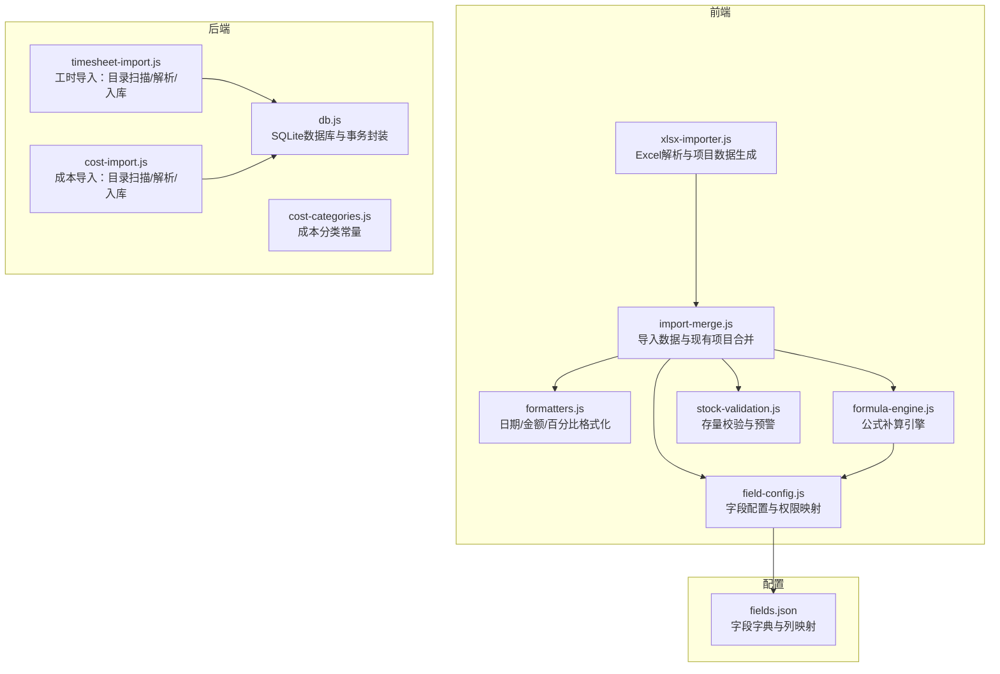
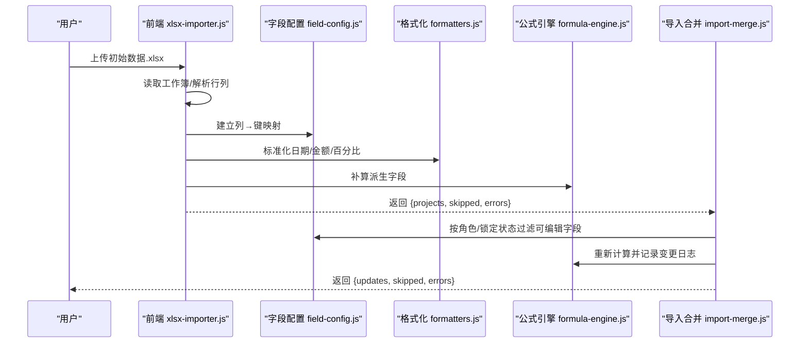
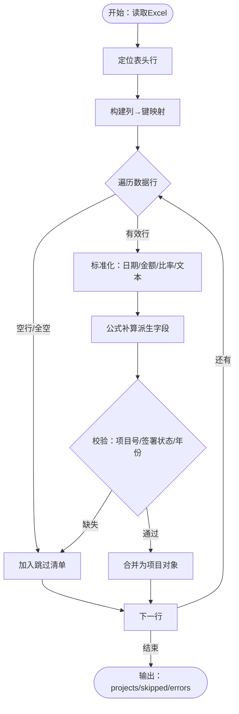
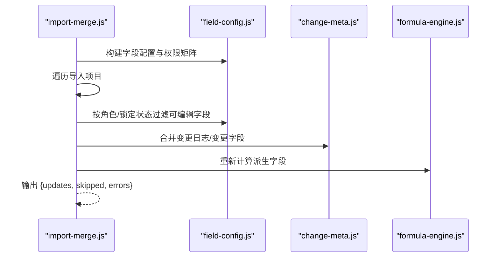
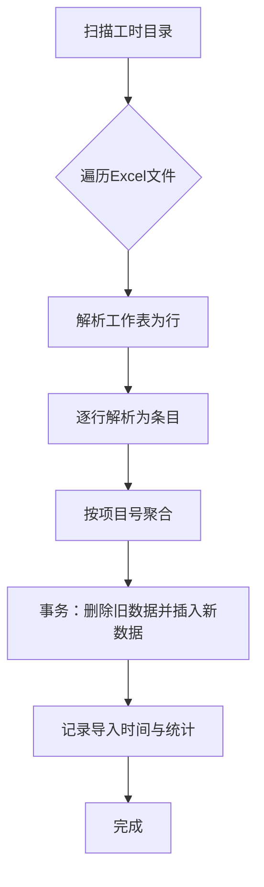
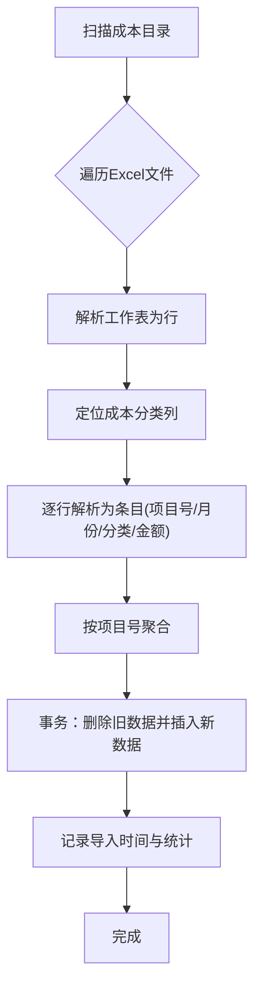
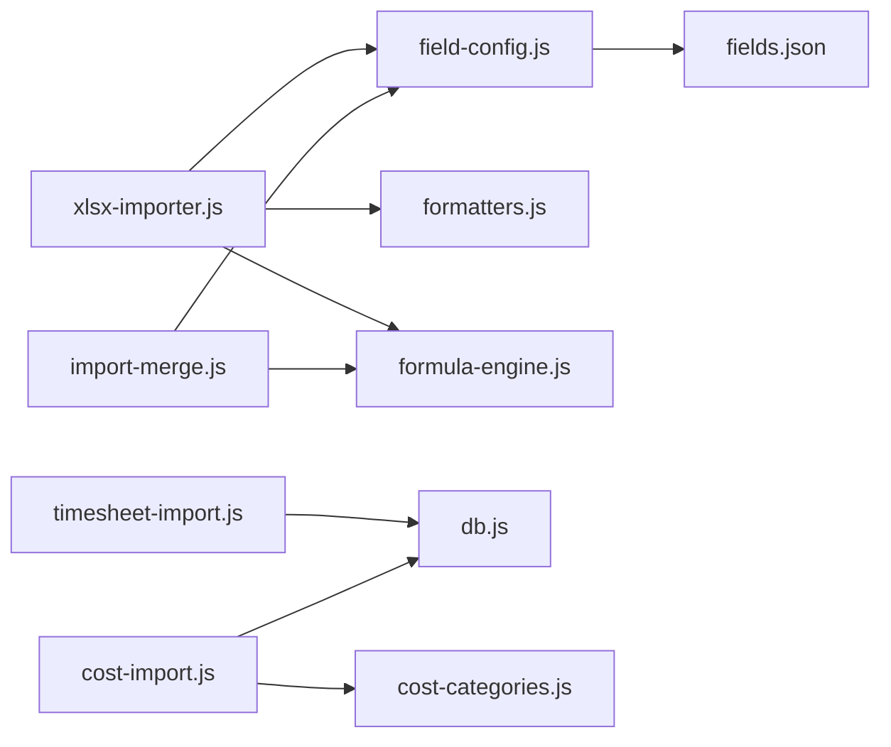

# 数据导入处理

<cite>
**本文引用的文件**
- [xlsx-importer.js](file://js/xlsx-importer.js)
- [import-merge.js](file://js/import-merge.js)
- [field-config.js](file://js/field-config.js)
- [formatters.js](file://js/formatters.js)
- [formula-engine.js](file://js/formula-engine.js)
- [timesheet-import.js](file://server/timesheet-import.js)
- [cost-import.js](file://server/cost-import.js)
- [cost-categories.js](file://server/cost-categories.js)
- [db.js](file://server/db.js)
- [fields.json](file://config/fields/fields.json)
- [stock-validation.js](file://js/stock-validation.js)
</cite>

## 目录
1. [简介](#简介)
2. [项目结构](#项目结构)
3. [核心组件](#核心组件)
4. [架构总览](#架构总览)
5. [详细组件分析](#详细组件分析)
6. [依赖关系分析](#依赖关系分析)
7. [性能考量](#性能考量)
8. [故障排查指南](#故障排查指南)
9. [结论](#结论)
10. [附录](#附录)

## 简介
本文件面向“项目追踪表线上化”系统的数据导入处理，围绕三类数据的批量导入与处理进行系统性说明：
- 项目基础数据导入（Excel 初始数据.xlsx → 项目主表）
- 工时数据导入（按项目维度批量导入工时明细）
- 成本数据导入（按项目维度批量导入成本中心数据）

文档涵盖数据解析、字段映射、格式转换、业务规则校验、批量处理策略、错误恢复与重试机制、数据质量检查、重复与缺失处理、完整性保障以及性能优化建议。

## 项目结构
系统采用前后端分离的导入处理模式：
- 前端负责 Excel 文件读取、字段映射、格式标准化、公式补算与合并策略
- 后端负责工时与成本两类数据的目录扫描、解析、聚合与持久化
- 数据库存储采用 SQLite（better-sqlite3），包含项目主表、审计日志、快照、元数据以及工时/成本明细表

图表来源
- [xlsx-importer.js:1-186](file://js/xlsx-importer.js#L1-L186)
- [import-merge.js:1-103](file://js/import-merge.js#L1-L103)
- [field-config.js:1-262](file://js/field-config.js#L1-L262)
- [formatters.js:1-167](file://js/formatters.js#L1-L167)
- [formula-engine.js:1-105](file://js/formula-engine.js#L1-L105)
- [timesheet-import.js:1-178](file://server/timesheet-import.js#L1-L178)
- [cost-import.js:1-157](file://server/cost-import.js#L1-L157)
- [cost-categories.js:1-16](file://server/cost-categories.js#L1-L16)
- [db.js:1-525](file://server/db.js#L1-L525)
- [fields.json:1-800](file://config/fields/fields.json#L1-L800)

章节来源
- [xlsx-importer.js:1-186](file://js/xlsx-importer.js#L1-L186)
- [timesheet-import.js:1-178](file://server/timesheet-import.js#L1-L178)
- [cost-import.js:1-157](file://server/cost-import.js#L1-L157)
- [db.js:1-525](file://server/db.js#L1-L525)

## 核心组件
- Excel 项目数据导入器：负责读取 Excel、定位表头、建立列映射、数值与日期标准化、公式补算、生成项目数组，并输出跳过与错误清单
- 导入合并器：将导入数据与现有项目进行字段级合并，遵循角色权限与锁定状态，仅覆盖可编辑字段，记录变更日志并重新计算
- 字段配置与格式化：提供字段字典、列到键映射、权限矩阵、金额/日期/百分比格式化与Excel序列日互转
- 公式引擎：对项目对象进行批量补算，产出派生字段（如累计完成、WIP、应收账款等）
- 工时导入器：扫描指定目录、解析工时明细、按项目聚合、批量替换入库
- 成本导入器：扫描成本中心表、识别成本分类、按项目聚合、批量替换入库
- 数据库层：提供事务封装、索引、统计查询与元数据管理

章节来源
- [xlsx-importer.js:1-186](file://js/xlsx-importer.js#L1-L186)
- [import-merge.js:1-103](file://js/import-merge.js#L1-L103)
- [field-config.js:1-262](file://js/field-config.js#L1-L262)
- [formatters.js:1-167](file://js/formatters.js#L1-L167)
- [formula-engine.js:1-105](file://js/formula-engine.js#L1-L105)
- [timesheet-import.js:1-178](file://server/timesheet-import.js#L1-L178)
- [cost-import.js:1-157](file://server/cost-import.js#L1-L157)
- [db.js:1-525](file://server/db.js#L1-L525)

## 架构总览
以下序列图展示了“项目基础数据导入”的端到端流程：

图表来源
- [xlsx-importer.js:108-175](file://js/xlsx-importer.js#L108-L175)
- [field-config.js:134-260](file://js/field-config.js#L134-L260)
- [formatters.js:65-76](file://js/formatters.js#L65-L76)
- [formula-engine.js:19-82](file://js/formula-engine.js#L19-L82)
- [import-merge.js:17-99](file://js/import-merge.js#L17-L99)

## 详细组件分析

### 项目基础数据导入（Excel → 项目主表）
- 解析与表头定位：自动查找包含“项目号”或“Project No”的行作为表头，后续行视为数据行
- 列映射与字段类型：依据字段字典将列字母映射为内部键，区分金额、比率、日期、文本等类型
- 数值与日期标准化：金额/比率统一去除千分位并转为数字；日期支持Excel序列日、ISO字符串与多种格式
- 公式补算：对项目对象进行公式补算，生成派生字段（累计完成、WIP、应收账款等）
- 业务规则：必须存在项目号；若缺少签合同年份，则从开始日期提取；根据合同状态设置签署状态
- 输出：返回项目数组、跳过的空行索引、错误清单

图表来源
- [xlsx-importer.js:95-175](file://js/xlsx-importer.js#L95-L175)
- [formatters.js:65-76](file://js/formatters.js#L65-L76)
- [formula-engine.js:19-82](file://js/formula-engine.js#L19-L82)
- [field-config.js:196-240](file://js/field-config.js#L196-L240)

章节来源
- [xlsx-importer.js:95-175](file://js/xlsx-importer.js#L95-L175)
- [formatters.js:65-76](file://js/formatters.js#L65-L76)
- [formula-engine.js:19-82](file://js/formula-engine.js#L19-L82)
- [field-config.js:196-240](file://js/field-config.js#L196-L240)

### 导入数据与现有项目合并（仅覆盖可编辑字段）
- 合并策略：按项目号匹配现有项目；仅对当前角色可编辑字段进行覆盖；记录字段变更日志与变更字段集合
- 权限与锁定：结合角色、锁定状态与报告月索引，判断字段是否可编辑；系统管理员在锁定期内仍可编辑系统引用列
- 变更追踪：合并过程中维护字段变更日志与变更字段列表，确保审计可追溯
- 重新计算：合并完成后对项目对象进行公式补算，保持派生字段一致性

图表来源
- [import-merge.js:17-99](file://js/import-merge.js#L17-L99)
- [field-config.js:104-122](file://js/field-config.js#L104-L122)
- [formula-engine.js:88-90](file://js/formula-engine.js#L88-L90)

章节来源
- [import-merge.js:17-99](file://js/import-merge.js#L17-L99)
- [field-config.js:104-122](file://js/field-config.js#L104-L122)

### 工时数据导入（timesheet-import.js）
- 目录扫描：从环境变量或默认路径扫描包含“工时”的Excel文件
- 文件解析：读取第一个工作表，按行解析为条目；支持从文件名推断项目号
- 字段映射：日期、项目编码、专业、工程师归属、工程师、单元号/名称、已审工时/H、已审工时成本、费率、备注等
- 聚合与入库：按项目号聚合条目，使用事务批量替换入库；记录导入元数据与统计信息

图表来源
- [timesheet-import.js:105-160](file://server/timesheet-import.js#L105-L160)
- [db.js:385-413](file://server/db.js#L385-L413)

章节来源
- [timesheet-import.js:105-160](file://server/timesheet-import.js#L105-L160)
- [db.js:385-413](file://server/db.js#L385-L413)

### 成本数据导入（cost-import.js）
- 目录扫描：从环境变量或默认路径扫描包含“成本中心”的Excel文件
- 表头识别：在前若干行中识别成本分类列（固定分类集合）
- 字段映射：解析“月份/总计”首列为成本月份，表头为成本分类，单元格值为金额
- 聚合与入库：按项目号聚合条目，使用事务批量替换入库；记录导入元数据与统计信息

图表来源
- [cost-import.js:96-139](file://server/cost-import.js#L96-L139)
- [cost-categories.js:4-13](file://server/cost-categories.js#L4-L13)
- [db.js:447-460](file://server/db.js#L447-L460)

章节来源
- [cost-import.js:96-139](file://server/cost-import.js#L96-L139)
- [cost-categories.js:4-13](file://server/cost-categories.js#L4-L13)
- [db.js:447-460](file://server/db.js#L447-L460)

### 数据格式转换与字段映射
- 列到键映射：通过字段字典将列字母映射为内部键（如 mc_0..mc_11、mi_0..mp_11 等）
- 类型转换：金额/比率统一去除千分位并转为数字；日期支持Excel序列日、Date对象与字符串
- 数组与扁平互转：将月度数组（monthly_completion/invoice/payment）与扁平键（mc_i）互转，便于存储与计算

章节来源
- [field-config.js:196-240](file://js/field-config.js#L196-L240)
- [formatters.js:65-76](file://js/formatters.js#L65-L76)
- [fields.json:1-800](file://config/fields/fields.json#L1-L800)

### 业务规则验证与数据质量检查
- 存量校验：在填报开放期自动对冲“累计完成超过总合同额”的风险；提交时阻断存量合同额为负的项目
- 金额输入校验：仅校验数值格式，避免非数字输入导致的异常
- 预警样式：R（累计开票差）与S（累计完成差）为负时高亮提示

章节来源
- [stock-validation.js:75-106](file://js/stock-validation.js#L75-L106)
- [stock-validation.js:131-149](file://js/stock-validation.js#L131-L149)

## 依赖关系分析
- 前端依赖链：xlsx-importer 依赖字段配置、格式化与公式引擎；导入合并依赖字段配置与变更追踪
- 后端依赖链：工时/成本导入依赖数据库事务封装；成本导入依赖成本分类常量
- 配置依赖：字段字典提供列映射与权限矩阵，支撑前端渲染与导入合并

图表来源
- [xlsx-importer.js:1-186](file://js/xlsx-importer.js#L1-L186)
- [import-merge.js:1-103](file://js/import-merge.js#L1-L103)
- [field-config.js:1-262](file://js/field-config.js#L1-L262)
- [formatters.js:1-167](file://js/formatters.js#L1-L167)
- [formula-engine.js:1-105](file://js/formula-engine.js#L1-L105)
- [timesheet-import.js:1-178](file://server/timesheet-import.js#L1-L178)
- [cost-import.js:1-157](file://server/cost-import.js#L1-L157)
- [cost-categories.js:1-16](file://server/cost-categories.js#L1-L16)
- [db.js:1-525](file://server/db.js#L1-L525)
- [fields.json:1-800](file://config/fields/fields.json#L1-L800)

## 性能考量
- 前端解析
  - 使用 SheetJS 一次性读取工作簿，避免多次 IO
  - 批量补算：对项目数组进行批量公式补算，减少重复计算
  - 合并策略：仅覆盖可编辑字段，降低变更追踪与重算成本
- 后端导入
  - 事务批量替换：对每个项目使用事务删除旧数据并插入新数据，保证一致性与性能
  - 目录扫描：仅处理包含关键字的文件，减少无关文件解析
  - 索引优化：数据库对 timesheet_entries 与 cost_entries 建有复合索引，加速查询与聚合
- 内存管理
  - 前端：按项目号聚合，避免大对象长期持有；及时释放中间数组
  - 后端：逐文件读取与解析，避免一次性加载过多文件
- 并发控制
  - 导入过程建议串行或受控并发，避免数据库写入竞争
  - 可通过队列限制同时导入的项目数量

章节来源
- [xlsx-importer.js:108-175](file://js/xlsx-importer.js#L108-L175)
- [import-merge.js:17-99](file://js/import-merge.js#L17-L99)
- [timesheet-import.js:118-160](file://server/timesheet-import.js#L118-L160)
- [cost-import.js:104-139](file://server/cost-import.js#L104-L139)
- [db.js:385-460](file://server/db.js#L385-L460)

## 故障排查指南
- Excel 解析失败
  - 确认文件为合法的 .xlsx；检查表头是否包含“项目号”或“Project No”
  - 若解析异常，查看返回的错误清单，定位具体行号
- 项目号缺失
  - 导入数据必须包含项目号；缺失项目号的行会被跳过
- 权限与锁定
  - 若字段被跳过，请确认当前角色与锁定状态是否允许编辑该字段
- 工时/成本导入未生效
  - 检查导入目录是否存在且包含目标文件；确认文件名可解析出项目号
  - 如已存在历史数据且未启用强制覆盖，导入会被拒绝
- 数据质量异常
  - 存量合同额为负：在开放期会自动对冲，提交时会阻断；请调减完成额或先在 CRB 办理合同变更
  - 金额输入非数字：请检查输入格式，确保为有效数值

章节来源
- [xlsx-importer.js:156-175](file://js/xlsx-importer.js#L156-L175)
- [import-merge.js:34-46](file://js/import-merge.js#L34-L46)
- [timesheet-import.js:125-128](file://server/timesheet-import.js#L125-L128)
- [cost-import.js:111-114](file://server/cost-import.js#L111-L114)
- [stock-validation.js:131-149](file://js/stock-validation.js#L131-L149)

## 结论
本系统通过前后端协同实现了三类数据的高效、可控导入：
- 项目基础数据导入：严格的表头识别、字段映射与格式标准化，配合公式引擎补算与合并策略，确保数据一致性与可追溯性
- 工时与成本导入：以项目号为中心的聚合与事务批量入库，具备完善的错误与统计反馈
- 数据质量保障：通过存量校验、输入校验与预警提示，降低业务风险
建议在生产环境中结合并发控制与内存管理策略，进一步提升导入吞吐与稳定性。

## 附录
- 字段字典与列映射：详见字段配置与字段字典文件
- 数据库表结构：包含项目主表、审计日志、快照、元数据以及工时/成本明细表

章节来源
- [fields.json:1-800](file://config/fields/fields.json#L1-L800)
- [database-schema.sql:1-286](file://database-schema.sql#L1-L286)