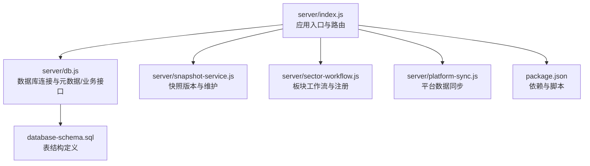
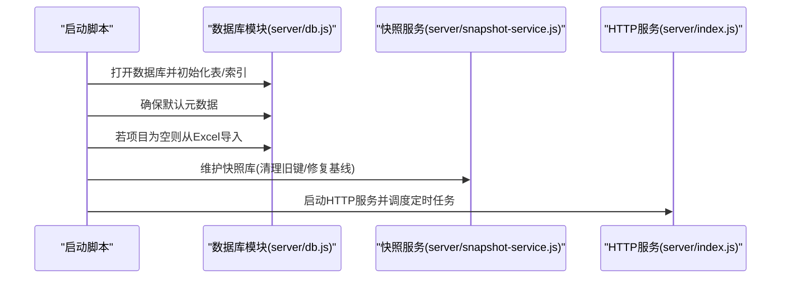
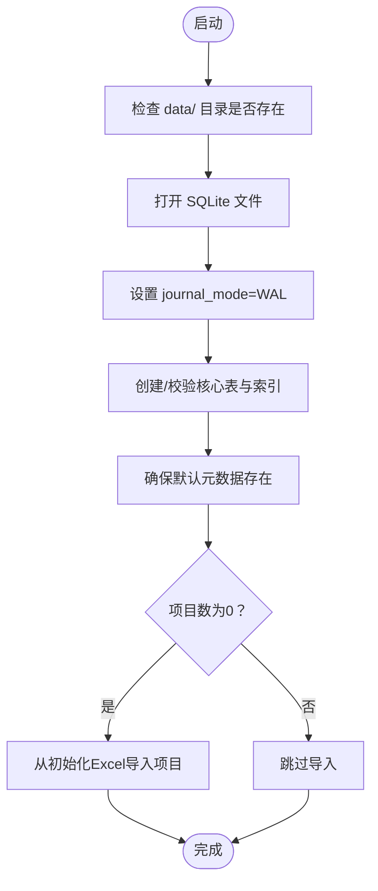
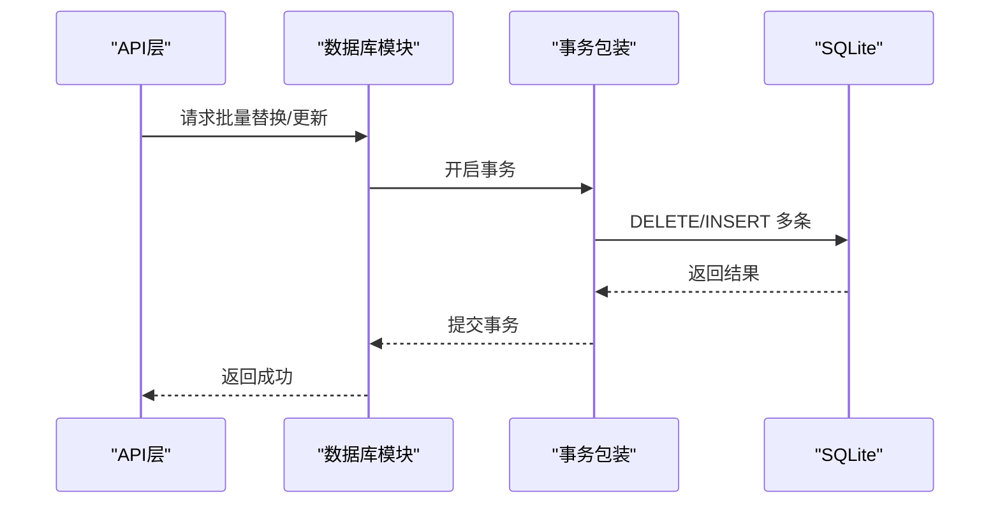
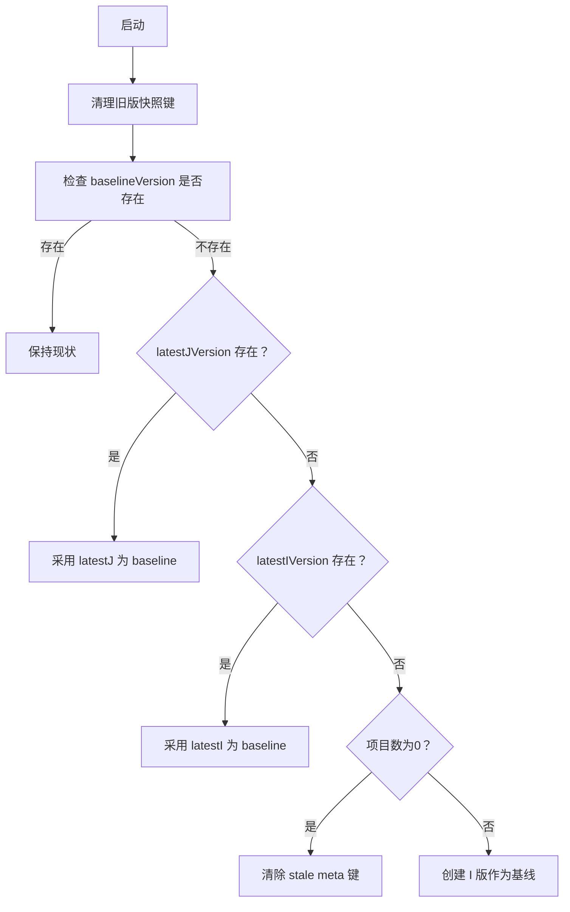
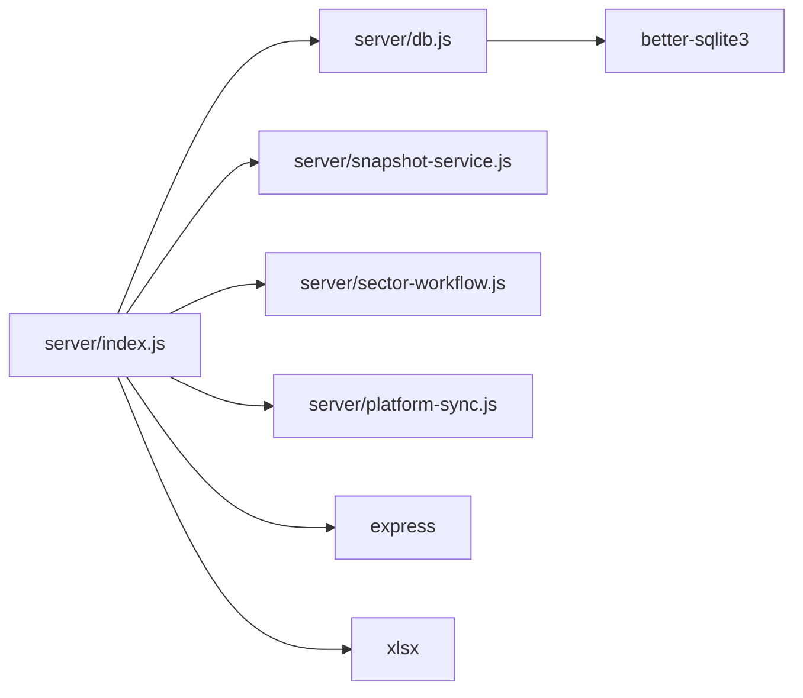

# 数据库管理

<cite>
**本文引用的文件**
- [server/db.js](file://server/db.js)
- [server/index.js](file://server/index.js)
- [server/snapshot-service.js](file://server/snapshot-service.js)
- [server/sector-workflow.js](file://server/sector-workflow.js)
- [server/platform-sync.js](file://server/platform-sync.js)
- [database-schema.sql](file://database-schema.sql)
- [package.json](file://package.json)
</cite>

## 目录
1. [简介](#简介)
2. [项目结构](#项目结构)
3. [核心组件](#核心组件)
4. [架构总览](#架构总览)
5. [详细组件分析](#详细组件分析)
6. [依赖关系分析](#依赖关系分析)
7. [性能考量](#性能考量)
8. [故障排查指南](#故障排查指南)
9. [结论](#结论)
10. [附录](#附录)

## 简介
本文件面向数据库管理与运维，围绕 SQLite 在本项目中的连接管理、事务处理、查询优化、初始化流程、表结构与索引策略、数据访问模式、并发控制、迁移与版本管理、备份与恢复、性能监控与慢查询分析、以及安全与访问控制等方面进行系统化说明。文档基于仓库中的实际实现与脚本，确保内容可落地、可验证。

## 项目结构
本项目采用“服务端 + SQLite”架构，数据库位于本地文件系统，通过 better-sqlite3 连接。核心入口为服务端启动脚本，负责数据库初始化、快照维护、定时任务与 API 路由。

图示来源
- [server/index.js:67-80](file://server/index.js#L67-L80)
- [server/db.js:11-60](file://server/db.js#L11-L60)
- [server/snapshot-service.js:229-274](file://server/snapshot-service.js#L229-L274)
- [server/sector-workflow.js:1-273](file://server/sector-workflow.js#L1-L273)
- [server/platform-sync.js:1-200](file://server/platform-sync.js#L1-L200)
- [database-schema.sql:1-286](file://database-schema.sql#L1-L286)
- [package.json:1-19](file://package.json#L1-L19)

章节来源
- [server/index.js:67-80](file://server/index.js#L67-L80)
- [server/db.js:11-60](file://server/db.js#L11-L60)
- [package.json:1-19](file://package.json#L1-L19)

## 核心组件
- 数据库连接与初始化
  - 连接路径与目录：数据目录位于 data/ptrack.sqlite，启动时自动创建目录并打开数据库。
  - 日志模式：启用 WAL（Write-Ahead Logging），提升并发读写性能与可靠性。
  - 初始化建表：首次运行时创建核心表与索引（项目、审计、快照、元数据、工时、成本等）。
- 元数据与配置
  - 使用 meta 表存储系统配置、审批状态、锁定期、版本信息等。
  - 默认配置与演示数据注入，保证首次运行可用。
- 快照与版本管理
  - I/D/J 三阶段快照体系，支持按公司/板块范围生成与维护。
  - 启动时自动清理旧版快照键，修复基线与快照行不一致问题。
- 工作流与板块
  - 板块注册、默认流程、状态机与审批推进逻辑。
- 平台数据同步
  - 从外部平台拉取字段与月度指标，合并到项目数据，支持“新/旧项目”年度翻转。
- API 与数据访问
  - 提供项目、工时、成本、审计、快照、元数据等读写接口。
  - 大多数读取使用 prepare + get/all，写入多采用事务批量处理。

章节来源
- [server/db.js:11-60](file://server/db.js#L11-L60)
- [server/db.js:93-106](file://server/db.js#L93-L106)
- [server/db.js:144-169](file://server/db.js#L144-L169)
- [server/snapshot-service.js:88-158](file://server/snapshot-service.js#L88-L158)
- [server/snapshot-service.js:229-274](file://server/snapshot-service.js#L229-L274)
- [server/sector-workflow.js:119-186](file://server/sector-workflow.js#L119-L186)
- [server/platform-sync.js:83-150](file://server/platform-sync.js#L83-L150)
- [server/index.js:112-138](file://server/index.js#L112-L138)

## 架构总览
下图展示启动阶段的关键流程：连接数据库 → 确保默认元数据 → 若无项目则从 Excel 初始化 → 快照库维护 → 种子数据与演示数据注入 → 启动 HTTP 服务。

图示来源
- [server/index.js:30-69](file://server/index.js#L30-L69)
- [server/db.js:11-60](file://server/db.js#L11-L60)
- [server/snapshot-service.js:229-274](file://server/snapshot-service.js#L229-L274)

## 详细组件分析

### 数据库连接与初始化
- 连接管理
  - 自动创建 data/ 目录，打开 SQLite 文件。
  - 设置 journal_mode=WAL，提升并发读取与写入吞吐。
- 初始化建表
  - 创建 projects、audit_log、snapshots、meta、timesheet_entries、cost_entries 等表。
  - 创建复合索引以支撑高频查询（如 timesheet_entries(project_no, work_date)、cost_entries(project_no, cost_month)）。
- 元数据接口
  - getMeta/setMeta 封装对 meta 表的读写，支持 JSON 序列化存储复杂配置。
- 默认配置与演示
  - 注入默认周期配置、用户、板块管理员、群组等，保证首次可用。

图示来源
- [server/db.js:11-60](file://server/db.js#L11-L60)
- [server/db.js:144-169](file://server/db.js#L144-L169)
- [server/index.js:30-69](file://server/index.js#L30-L69)

章节来源
- [server/db.js:11-60](file://server/db.js#L11-L60)
- [server/db.js:93-106](file://server/db.js#L93-L106)
- [server/db.js:144-169](file://server/db.js#L144-L169)
- [server/index.js:30-69](file://server/index.js#L30-L69)

### 事务处理与批量写入
- 事务封装
  - replaceAllProjects、replaceProjectTimesheet、replaceProjectCostEntries、clearProjectChangeTracking 等均使用事务包裹，确保批量写入原子性。
- 事务语义
  - better-sqlite3 支持显式事务，事务内失败会回滚，避免部分写入导致数据不一致。
- 写入策略
  - 批量删除 + 批量插入，减少单条语句开销。
  - 对 JSON 字段统一序列化存储，读取时反序列化。

图示来源
- [server/db.js:268-278](file://server/db.js#L268-L278)
- [server/db.js:385-413](file://server/db.js#L385-L413)
- [server/db.js:447-460](file://server/db.js#L447-L460)
- [server/db.js:285-304](file://server/db.js#L285-L304)

章节来源
- [server/db.js:268-278](file://server/db.js#L268-L278)
- [server/db.js:385-413](file://server/db.js#L385-L413)
- [server/db.js:447-460](file://server/db.js#L447-L460)
- [server/db.js:285-304](file://server/db.js#L285-L304)

### 查询优化与索引策略
- 表与索引
  - timesheet_entries：复合索引 idx_ts_project_date(project_no, work_date)，用于按项目与年份检索工时明细。
  - cost_entries：复合索引 idx_cost_project_month(project_no, cost_month)，用于按项目与月份检索成本明细。
  - projects：常见查询字段建立索引（如 sector_code、pm_name、reporting_month、approval_status）。
- 查询模式
  - 读取项目列表、审计日志、快照等使用 prepare + get/all，避免全表扫描。
  - 年度过滤使用 substr(...) 匹配年份，建议在高基数场景考虑冗余 year 字段以进一步优化。
- 建议
  - 对高频过滤条件（如 reporting_month、sector_code）建立复合索引。
  - 对大表分页查询时使用 LIMIT/OFFSET 或基于游标的方式，避免一次性加载过多数据。

章节来源
- [server/db.js:48-57](file://server/db.js#L48-L57)
- [database-schema.sql:89-94](file://database-schema.sql#L89-L94)
- [database-schema.sql:198-200](file://database-schema.sql#L198-L200)
- [database-schema.sql:225-227](file://database-schema.sql#L225-L227)
- [server/db.js:415-437](file://server/db.js#L415-L437)
- [server/db.js:462-476](file://server/db.js#L462-L476)

### 数据访问模式与并发控制
- 连接模型
  - 单进程内共享一个数据库连接，所有请求复用同一连接实例。
  - 由于 better-sqlite3 是同步库，不支持多线程并发写入；可通过进程外并发或连接池替代方案（见“性能考量”）。
- 并发读写
  - WAL 模式下允许多个读事务与单个写事务并发，降低阻塞概率。
- 事务隔离
  - 事务内读取遵循一致性视图，跨事务可见性受 WAL/提交时机影响。

章节来源
- [server/db.js:14](file://server/db.js#L14)
- [server/index.js:67-69](file://server/index.js#L67-L69)

### 快照与版本管理
- 快照键规则
  - I/D/J 三阶段，格式为 stage:yyyyMMdd:scope:seq，支持按日期与序号排序。
- 版本维护
  - 启动时清理旧版键（如 Month:/PM:/Draft 等），修复 baseline 与快照行不一致，必要时重建 I 版。
- 版本选择
  - baselineVersion 优先指向 J 版，其次 I 版；若都不存在且项目非空，则创建 I 版作为基线。

图示来源
- [server/snapshot-service.js:194-210](file://server/snapshot-service.js#L194-L210)
- [server/snapshot-service.js:229-274](file://server/snapshot-service.js#L229-L274)

章节来源
- [server/snapshot-service.js:88-158](file://server/snapshot-service.js#L88-L158)
- [server/snapshot-service.js:229-274](file://server/snapshot-service.js#L229-L274)

### 数据迁移与版本演进
- 板块工作流迁移
  - 将旧版 approvalStatus/reportingSubmitted 同步到新版 per-sector 流水线，并补齐缺失板块默认项。
- 年度“新/旧项目”翻转
  - 年度切换时对项目 A 列引用进行 rollover，触发批量更新与审计记录。
- 快照键迁移
  - 旧版 Draft/S520 等键映射到新版 D:YYYYMMDD:SASxxx:NN 格式，必要时补写新键。

章节来源
- [server/sector-workflow.js:119-186](file://server/sector-workflow.js#L119-L186)
- [server/platform-sync.js:155-198](file://server/platform-sync.js#L155-L198)
- [server/snapshot-service.js:172-187](file://server/snapshot-service.js#L172-L187)

### 平台数据同步与变更审计
- 同步流程
  - 从平台获取字段与月度指标，合并到现有项目，更新 _system_ref 与显示字段。
  - 对新增项目应用平台字段与标记，计算公式引擎后返回。
- 变更审计
  - 所有项目写入与关键操作均记录到 audit_log，包含字段名、前后值、操作人、时间等。

章节来源
- [server/platform-sync.js:83-150](file://server/platform-sync.js#L83-L150)
- [server/db.js:306-321](file://server/db.js#L306-L321)

### API 与数据访问
- 项目管理
  - GET /api/projects/:projectNo/timesheet、GET /api/projects/:projectNo/cost-center 提供按年查询工时/成本统计。
  - PUT /api/projects/:projectNo 更新单项目。
  - POST /api/projects 批量替换项目。
- 元数据与快照
  - PATCH /api/meta 更新周期、锁定期、审批状态等。
  - PUT /api/snapshots/:version 写入快照；GET /api/snapshots/:version 读取。
- 审计与用户
  - POST /api/audit 写入审计记录。
  - GET /api/admin/users、PATCH /api/admin/users 管理用户与权限。

章节来源
- [server/index.js:112-138](file://server/index.js#L112-L138)
- [server/index.js:140-168](file://server/index.js#L140-L168)
- [server/index.js:184-196](file://server/index.js#L184-L196)
- [server/index.js:170-182](file://server/index.js#L170-L182)
- [server/index.js:647-702](file://server/index.js#L647-L702)

## 依赖关系分析
- 组件耦合
  - server/index.js 依赖 server/db.js、server/snapshot-service.js、server/sector-workflow.js、server/platform-sync.js。
  - server/db.js 依赖 better-sqlite3，负责连接、建表、事务与元数据。
  - server/snapshot-service.js 依赖 server/db.js 与板块工作流，负责快照版本与维护。
  - server/sector-workflow.js 提供板块注册、默认流程与状态机。
  - server/platform-sync.js 依赖字段配置与公式引擎，负责平台数据合并。
- 外部依赖
  - better-sqlite3：高性能 SQLite 绑定，支持 WAL 与事务。
  - express：Web 服务器与路由。
  - xlsx：Excel 导入导出工具。

图示来源
- [server/index.js:1-25](file://server/index.js#L1-L25)
- [package.json:13-18](file://package.json#L13-L18)

章节来源
- [server/index.js:1-25](file://server/index.js#L1-L25)
- [package.json:13-18](file://package.json#L13-L18)

## 性能考量
- WAL 模式
  - 已启用 WAL，显著提升并发读写能力；建议结合合适的索引与查询模式使用。
- 事务批量写入
  - 大量插入/更新应使用事务，减少提交次数，降低磁盘写放大。
- 查询优化
  - 为高频过滤字段建立复合索引；避免在 WHERE 中对列做函数运算（如 substr），可考虑冗余列或覆盖索引。
- 并发与连接
  - better-sqlite3 为同步库，单进程内共享连接；若需要更高并发，可考虑：
    - 多进程部署 + 连接池（如自研连接池或第三方库）。
    - 将热点表拆分或引入只读副本。
- 监控与慢查询
  - 建议在应用层记录 SQL 执行耗时与错误码，结合数据库 PRAGMA（如 stats）与系统层面的 IO/内存监控定位瓶颈。
  - 对大查询增加 LIMIT 与分页，避免一次性加载过多数据。

章节来源
- [server/db.js:14](file://server/db.js#L14)
- [server/db.js:268-278](file://server/db.js#L268-L278)
- [server/db.js:415-437](file://server/db.js#L415-L437)
- [server/db.js:462-476](file://server/db.js#L462-L476)

## 故障排查指南
- 数据库无法打开/路径异常
  - 检查 data/ 目录权限与磁盘空间；确认 DB_PATH 指向正确。
- 启动后无项目数据
  - 确认初始化 Excel 是否存在且可读；查看导入日志与审计记录。
- 快照维护失败
  - 查看清理旧键与修复基线的日志输出；确认 snapshots 表与 meta 表一致性。
- 审计日志缺失
  - 确认写入接口调用与参数；检查 audit_log 表是否存在及索引是否完整。
- 并发写入冲突
  - 确认是否在同一进程内串行执行事务；避免多线程同时写入。

章节来源
- [server/index.js:30-69](file://server/index.js#L30-L69)
- [server/snapshot-service.js:229-274](file://server/snapshot-service.js#L229-L274)
- [server/db.js:306-321](file://server/db.js#L306-L321)

## 结论
本项目以 better-sqlite3 为核心，结合 WAL、事务与索引策略，在单机场景下实现了稳定的项目追踪与报表能力。通过 I/D/J 快照体系与工作流迁移，保障了数据版本与流程演进的可控性。建议在生产环境中配合多进程部署、连接池与监控体系，持续优化查询与写入性能，并完善备份与恢复流程。

## 附录

### 表结构与索引概览
- projects：项目主表，包含系统同步字段、计算字段、审批状态、变更元数据等。
- monthly_records：月度填报记录，支持历史追溯与月度清零。
- project_yearly_baseline：年度基线表，记录每年冻结的基准数据。
- prepayment_writeoffs：预收款核销流水表。
- audit_log：全量审计日志。
- snapshots：审批快照，不可变。
- meta：系统配置与状态元数据。

章节来源
- [database-schema.sql:8-87](file://database-schema.sql#L8-L87)
- [database-schema.sql:96-196](file://database-schema.sql#L96-L196)
- [database-schema.sql:202-227](file://database-schema.sql#L202-L227)
- [database-schema.sql:229-249](file://database-schema.sql#L229-L249)
- [database-schema.sql:251-274](file://database-schema.sql#L251-L274)
- [database-schema.sql:276-286](file://database-schema.sql#L276-L286)