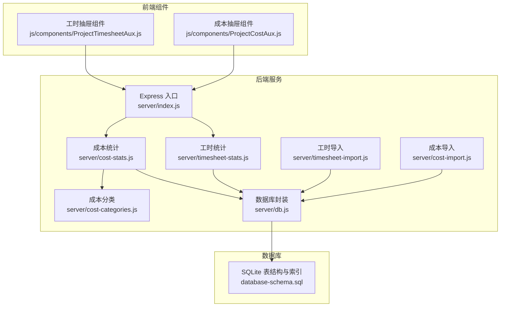
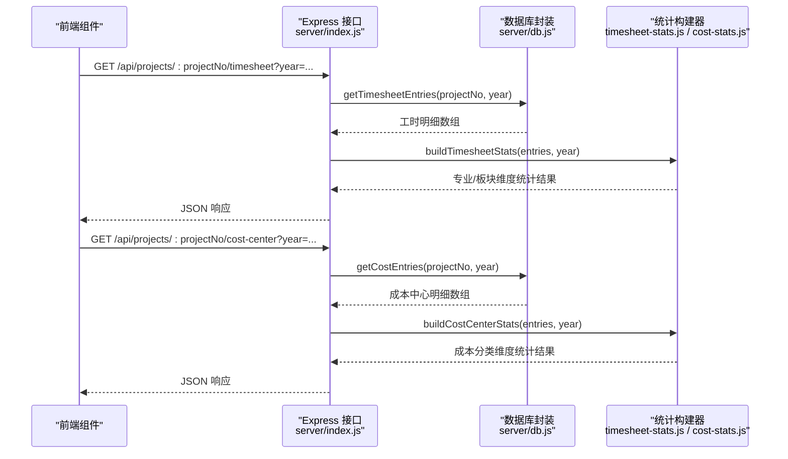
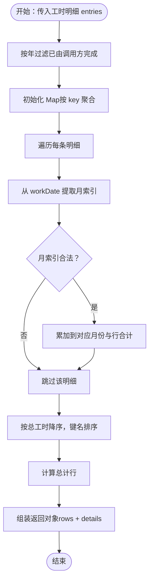
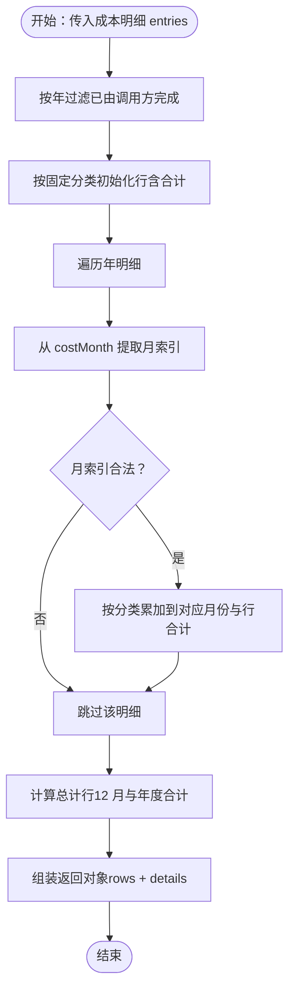
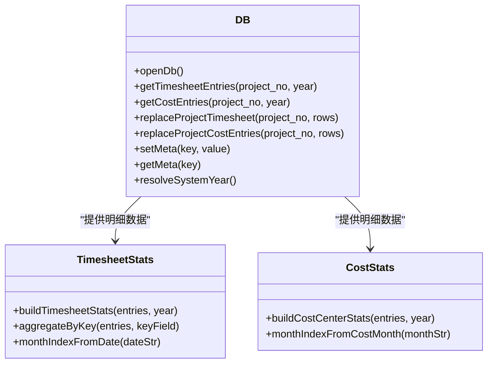
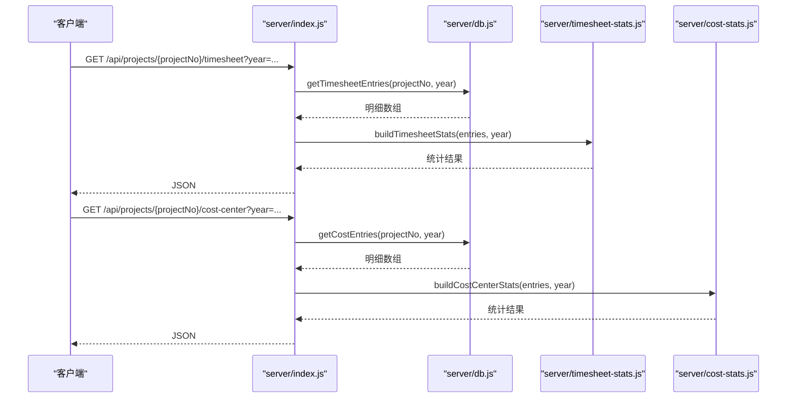
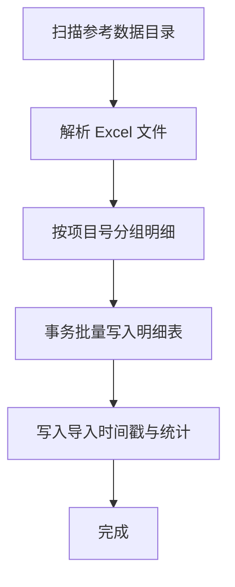
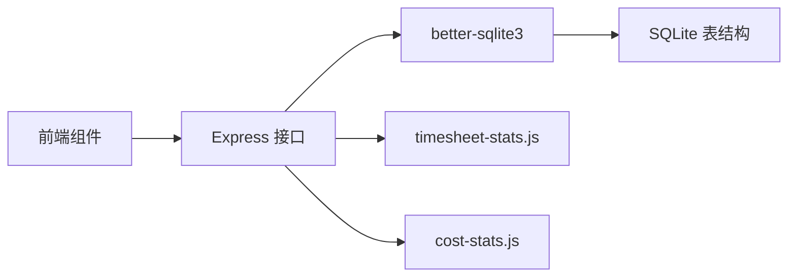

# 统计分析服务

<cite>
**本文引用的文件**
- [server/timesheet-stats.js](file://server/timesheet-stats.js)
- [server/cost-stats.js](file://server/cost-stats.js)
- [server/db.js](file://server/db.js)
- [server/index.js](file://server/index.js)
- [server/cost-categories.js](file://server/cost-categories.js)
- [server/timesheet-import.js](file://server/timesheet-import.js)
- [server/cost-import.js](file://server/cost-import.js)
- [database-schema.sql](file://database-schema.sql)
- [js/components/ProjectTimesheetAux.js](file://js/components/ProjectTimesheetAux.js)
- [js/components/ProjectCostAux.js](file://js/components/ProjectCostAux.js)
- [docs/设计文档/DASHBOARD.md](file://docs/设计文档/DASHBOARD.md)
- [docs/设计文档/DESIGN.md](file://docs/设计文档/DESIGN.md)
- [package.json](file://package.json)
</cite>

## 目录
1. [简介](#简介)
2. [项目结构](#项目结构)
3. [核心组件](#核心组件)
4. [架构总览](#架构总览)
5. [详细组件分析](#详细组件分析)
6. [依赖关系分析](#依赖关系分析)
7. [性能考量](#性能考量)
8. [故障排查指南](#故障排查指南)
9. [结论](#结论)
10. [附录](#附录)

## 简介
本文件面向“统计分析服务”的使用者与维护者，系统化阐述工时统计与成本中心统计的计算逻辑、数据聚合方法、时间维度分析、项目维度汇总与部门维度统计的实现方式；并结合现有数据库与接口，说明统计数据的缓存策略、更新机制与实时性保障；最后提供性能优化、索引设计、查询优化策略，以及数据可视化支持、图表生成与报表输出能力的现状与建议。

## 项目结构
后端采用 Express + better-sqlite3 的轻量架构，核心统计逻辑位于 server 目录：
- 统计构建：timesheet-stats.js（按专业/板块维度统计工时）、cost-stats.js（按成本项维度统计成本中心）
- 数据访问：db.js（SQLite 表结构、索引、查询与事务封装）
- 接口入口：index.js（提供 /api/projects/:projectNo/timesheet 与 /api/projects/:projectNo/cost-center 等统计接口）
- 数据导入：timesheet-import.js、cost-import.js（从本地 Excel 导入工时与成本中心明细）
- 成本分类：cost-categories.js（固定成本中心分类清单）
- 前端组件：ProjectTimesheetAux.js、ProjectCostAux.js（工时/成本中心统计的可视化与交互）
- 设计文档：DASHBOARD.md、DESIGN.md（数据看板与图表规范）

**图表来源**
- [server/index.js:140-168](file://server/index.js#L140-L168)
- [server/db.js:33-57](file://server/db.js#L33-L57)
- [server/timesheet-stats.js:60-80](file://server/timesheet-stats.js#L60-L80)
- [server/cost-stats.js:20-76](file://server/cost-stats.js#L20-L76)
- [server/timesheet-import.js:118-160](file://server/timesheet-import.js#L118-L160)
- [server/cost-import.js:104-139](file://server/cost-import.js#L104-L139)
- [server/cost-categories.js:4-13](file://server/cost-categories.js#L4-L13)
- [js/components/ProjectTimesheetAux.js:96-120](file://js/components/ProjectTimesheetAux.js#L96-L120)
- [js/components/ProjectCostAux.js:96-120](file://js/components/ProjectCostAux.js#L96-L120)

**章节来源**
- [server/index.js:140-168](file://server/index.js#L140-L168)
- [server/db.js:33-57](file://server/db.js#L33-L57)
- [database-schema.sql:12-94](file://database-schema.sql#L12-L94)

## 核心组件
- 工时统计构建器（timesheet-stats.js）
  - 输入：按年过滤后的工时明细（approvedHours、approvedCost、workDate、profession、engineerSector 等）
  - 输出：按专业与板块两套维度的月度矩阵与合计，以及明细列表
  - 关键函数：buildTimesheetStats、aggregateByKey、monthIndexFromDate
- 成本中心统计构建器（cost-stats.js）
  - 输入：按年过滤后的成本中心明细（costMonth、category、amount）
  - 输出：按成本分类的月度矩阵与合计，以及明细列表
  - 关键函数：buildCostCenterStats、monthIndexFromCostMonth
- 数据访问层（db.js）
  - 提供 timesheet_entries 与 cost_entries 的查询、替换、事务与索引
  - 提供 getTimesheetEntries、getCostEntries、replaceProjectTimesheet、replaceProjectCostEntries 等
- 接口层（index.js）
  - 对外暴露 /api/projects/:projectNo/timesheet 与 /api/projects/:projectNo/cost-center
  - 年度参数 year 从查询参数或系统年份解析
- 成本分类（cost-categories.js）
  - 固定的成本中心分类清单，用于初始化与聚合
- 数据导入（timesheet-import.js、cost-import.js）
  - 从 docs/参考数据 目录批量解析 Excel，写入对应明细表
- 前端组件（ProjectTimesheetAux.js、ProjectCostAux.js）
  - 通过 /api/projects/:projectNo/timesheet 与 /api/projects/:projectNo/cost-center 获取数据
  - 提供月度矩阵、合计、明细筛选与弹窗

**章节来源**
- [server/timesheet-stats.js:33-80](file://server/timesheet-stats.js#L33-L80)
- [server/cost-stats.js:16-76](file://server/cost-stats.js#L16-L76)
- [server/db.js:415-480](file://server/db.js#L415-L480)
- [server/index.js:140-168](file://server/index.js#L140-L168)
- [server/cost-categories.js:4-13](file://server/cost-categories.js#L4-L13)
- [server/timesheet-import.js:118-160](file://server/timesheet-import.js#L118-L160)
- [server/cost-import.js:104-139](file://server/cost-import.js#L104-L139)
- [js/components/ProjectTimesheetAux.js:96-120](file://js/components/ProjectTimesheetAux.js#L96-L120)
- [js/components/ProjectCostAux.js:96-120](file://js/components/ProjectCostAux.js#L96-L120)

## 架构总览
统计分析服务围绕“接口层 → 统计构建器 → 数据访问层 → 数据库”的链路工作。接口层负责参数解析与响应封装；统计构建器负责按维度聚合与排序；数据访问层负责高效查询与事务；数据库层提供表结构与索引支撑。

**图表来源**
- [server/index.js:140-168](file://server/index.js#L140-L168)
- [server/db.js:415-476](file://server/db.js#L415-L476)
- [server/timesheet-stats.js:60-80](file://server/timesheet-stats.js#L60-L80)
- [server/cost-stats.js:20-76](file://server/cost-stats.js#L20-L76)

## 详细组件分析

### 工时统计组件分析（timesheet-stats.js）
- 时间维度分析
  - 依据 workDate 提取月份索引，构造 12 个月的空数组，按月累加 approvedHours 与 approvedCost
  - monthIndexFromDate 负责从日期字符串提取合法月份数值
- 项目维度汇总
  - aggregateByKey 支持按 profession 与 engineerSector 两个维度聚合
  - 每个维度返回 rows（含每行 12 月数据与合计）与总计行
- 部门维度统计
  - 通过 engineerSector 维度即可得到部门/板块层面的统计
- 排序与总计
  - 按总工时降序排序，再按键名本地化排序
  - buildTotalRow 计算总计行的 12 月与年度合计
- 明细输出
  - 输出原始明细列表，便于前端弹窗筛选与导出

**图表来源**
- [server/timesheet-stats.js:33-54](file://server/timesheet-stats.js#L33-L54)
- [server/timesheet-stats.js:60-80](file://server/timesheet-stats.js#L60-L80)

**章节来源**
- [server/timesheet-stats.js:33-80](file://server/timesheet-stats.js#L33-L80)

### 成本中心统计组件分析（cost-stats.js）
- 时间维度分析
  - 依据 costMonth 提取月份索引，构造 12 个月的空数组，按月累加 amount
  - monthIndexFromCostMonth 负责从 YYYY-MM 字符串提取合法月份数值
- 项目维度汇总
  - 以固定成本分类清单为基准，初始化每类的行与合计
  - 遍历年数据，按分类与月份累加
- 成本分类维度统计
  - 通过 COST_CATEGORIES 固定分类，确保统计矩阵结构稳定
- 明细输出
  - 过滤掉绝对值为 0 的明细，按成本月与分类排序输出

**图表来源**
- [server/cost-stats.js:20-76](file://server/cost-stats.js#L20-L76)
- [server/cost-categories.js:4-13](file://server/cost-categories.js#L4-L13)

**章节来源**
- [server/cost-stats.js:16-76](file://server/cost-stats.js#L16-L76)
- [server/cost-categories.js:4-13](file://server/cost-categories.js#L4-L13)

### 数据访问层（db.js）
- 表与索引
  - timesheet_entries：按 project_no + work_date 建有复合索引，支持按项目与年份高效查询
  - cost_entries：按 project_no + cost_month 建有复合索引，支持按项目与年份高效查询
- 查询与替换
  - getTimesheetEntries：按项目与年份查询明细并映射为标准结构
  - getCostEntries：按项目与年份查询明细并映射为标准结构
  - replaceProjectTimesheet / replaceProjectCostEntries：事务批量替换项目明细
- 元数据与时序
  - 通过 meta 表存储 timesheetImportedAt、costImportedAt 等导入时间戳，用于前端显示“导入时间”
  - resolveSystemYear 从周期配置与报告月解析系统年份

**图表来源**
- [server/db.js:415-480](file://server/db.js#L415-L480)
- [server/timesheet-stats.js:60-80](file://server/timesheet-stats.js#L60-L80)
- [server/cost-stats.js:20-76](file://server/cost-stats.js#L20-L76)

**章节来源**
- [server/db.js:33-57](file://server/db.js#L33-L57)
- [server/db.js:415-480](file://server/db.js#L415-L480)

### 接口层（index.js）
- 统计接口
  - /api/projects/:projectNo/timesheet：返回按专业与板块维度的工时统计
  - /api/projects/:projectNo/cost-center：返回按成本分类维度的成本统计
- 参数与默认值
  - year 从查询参数解析，若为空则使用 resolveSystemYear
- 响应扩展
  - 返回 projectNo、importedAt（导入时间戳）等上下文信息

**图表来源**
- [server/index.js:140-168](file://server/index.js#L140-L168)
- [server/db.js:415-476](file://server/db.js#L415-L476)
- [server/timesheet-stats.js:60-80](file://server/timesheet-stats.js#L60-L80)
- [server/cost-stats.js:20-76](file://server/cost-stats.js#L20-L76)

**章节来源**
- [server/index.js:140-168](file://server/index.js#L140-L168)

### 数据导入与更新机制
- 工时导入
  - timesheet-import.js：扫描 docs/参考数据，解析 Excel，按项目号分组后批量写入 timesheet_entries
  - 导入后写入 timesheetImportedAt 与 timesheetImportStats 元数据
- 成本导入
  - cost-import.js：扫描 docs/参考数据，解析成本中心透视表，按项目号分组后批量写入 cost_entries
  - 导入后写入 costImportedAt 与 costImportStats 元数据
- 更新策略
  - replaceProjectTimesheet / replaceProjectCostEntries 使用事务批量替换，确保一致性
  - 通过元数据导入时间戳，前端可显示“导入时间”

**图表来源**
- [server/timesheet-import.js:118-160](file://server/timesheet-import.js#L118-L160)
- [server/cost-import.js:104-139](file://server/cost-import.js#L104-L139)
- [server/db.js:385-413](file://server/db.js#L385-L413)
- [server/db.js:447-460](file://server/db.js#L447-L460)

**章节来源**
- [server/timesheet-import.js:118-160](file://server/timesheet-import.js#L118-L160)
- [server/cost-import.js:104-139](file://server/cost-import.js#L104-L139)
- [server/db.js:385-413](file://server/db.js#L385-L413)
- [server/db.js:447-460](file://server/db.js#L447-L460)

### 数据可视化与报表输出
- 前端组件
  - ProjectTimesheetAux.js：支持按专业/板块维度切换，按工时或成本两种指标，月度矩阵与合计，明细弹窗
  - ProjectCostAux.js：按成本分类维度展示月度矩阵与合计，明细弹窗
- 设计规范
  - DASHBOARD.md 与 DESIGN.md 提供了数据看板的格式、单位、小数位、颜色语义、图表类型与交互规范
- 报表输出
  - 统计接口返回 JSON，前端可直接导出 Excel（弹窗表格支持排序与筛选）

**章节来源**
- [js/components/ProjectTimesheetAux.js:96-120](file://js/components/ProjectTimesheetAux.js#L96-L120)
- [js/components/ProjectCostAux.js:96-120](file://js/components/ProjectCostAux.js#L96-L120)
- [docs/设计文档/DASHBOARD.md:10-199](file://docs/设计文档/DASHBOARD.md#L10-L199)
- [docs/设计文档/DESIGN.md:319-341](file://docs/设计文档/DESIGN.md#L319-L341)

## 依赖关系分析
- 组件耦合
  - index.js 依赖 db.js 提供数据访问，依赖 timesheet-stats.js 与 cost-stats.js 提供统计
  - timesheet-stats.js 与 cost-stats.js 仅依赖 db.js 提供的明细数据
  - 前端组件依赖 index.js 提供的统计接口
- 外部依赖
  - better-sqlite3：高性能 SQLite 驱动
  - express：Web 服务器
  - xlsx：Excel 解析

**图表来源**
- [server/index.js:140-168](file://server/index.js#L140-L168)
- [server/db.js:33-57](file://server/db.js#L33-L57)
- [package.json:13-18](file://package.json#L13-L18)

**章节来源**
- [package.json:13-18](file://package.json#L13-L18)

## 性能考量
- 查询性能
  - timesheet_entries 与 cost_entries 均建立复合索引，按项目号与时间维度查询具备良好性能
  - getTimesheetEntries 与 getCostEntries 使用 substr 进行年份过滤，建议确保索引命中
- 聚合性能
  - aggregateByKey 与 buildCostCenterStats 为单次遍历聚合，时间复杂度 O(N)，内存占用与 Map 结构相关
- 缓存策略
  - 当前未见服务端缓存实现；可通过中间层（如 Redis）缓存热点项目的统计结果，结合导入时间戳做失效控制
- 实时性
  - 导入完成后写入 timesheetImportedAt/costImportedAt，前端可据此判断数据新鲜度
- 索引与查询优化建议
  - 在 work_date 与 cost_month 上建立合适索引，确保 substr 过滤仍能利用索引
  - 对高频查询维度（如 project_no、year）考虑物化视图或汇总表（按项目/年/维度组合）
  - 对前端分页与筛选，建议在接口层增加分页参数与排序字段，减少一次性传输大量明细

[本节为通用性能指导，不直接分析具体文件]

## 故障排查指南
- 工时/成本导入失败
  - 检查 docs/参考数据 目录是否存在匹配文件，文件名是否包含“工时”或“成本中心”
  - 查看导入接口返回的错误信息与统计（文件数、项目数、行数）
- 统计为空
  - 确认导入是否成功（检查 timesheetImportedAt/costImportedAt）
  - 确认 year 参数是否正确，或使用系统年份解析
- 数据不一致
  - 检查事务替换是否成功（replaceProjectTimesheet/replaceProjectCostEntries）
  - 核对明细表字段映射（日期、专业、板块、成本分类等）

**章节来源**
- [server/timesheet-import.js:118-160](file://server/timesheet-import.js#L118-L160)
- [server/cost-import.js:104-139](file://server/cost-import.js#L104-L139)
- [server/db.js:385-413](file://server/db.js#L385-L413)
- [server/db.js:447-460](file://server/db.js#L447-L460)

## 结论
本统计分析服务以“接口层-统计构建器-数据访问层-数据库”清晰分层，实现了工时与成本中心的多维度统计与可视化支持。通过合理的索引与事务封装，保证了查询与导入的稳定性；通过前端组件与设计规范，提供了直观的月度矩阵、合计与明细筛选能力。建议后续引入服务端缓存与物化汇总，进一步提升性能与实时性。

## 附录
- 数据库表结构与索引
  - projects、monthly_records、project_yearly_baseline、prepayment_writeoffs、audit_log、snapshots 等（详见 database-schema.sql）
- 依赖工具
  - better-sqlite3、express、xlsx（详见 package.json）

**章节来源**
- [database-schema.sql:12-94](file://database-schema.sql#L12-L94)
- [package.json:13-18](file://package.json#L13-L18)