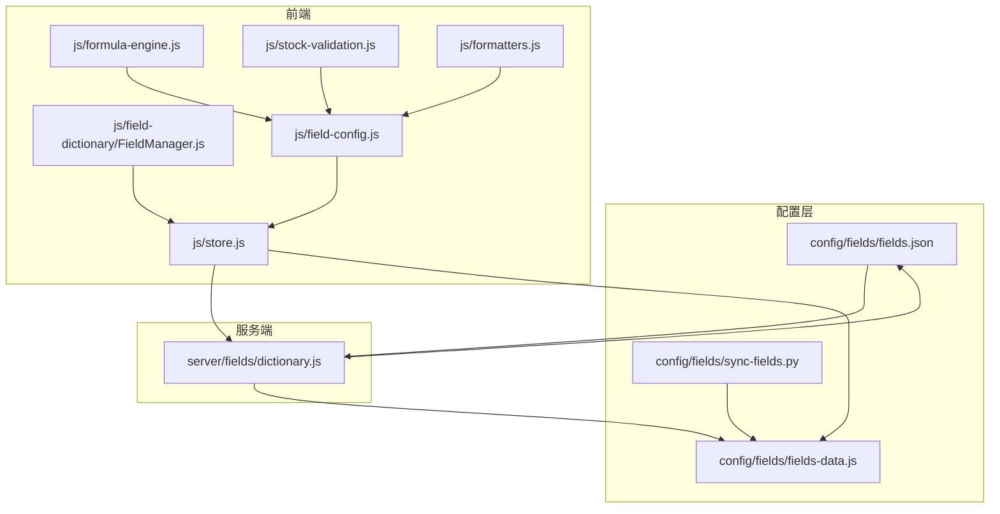
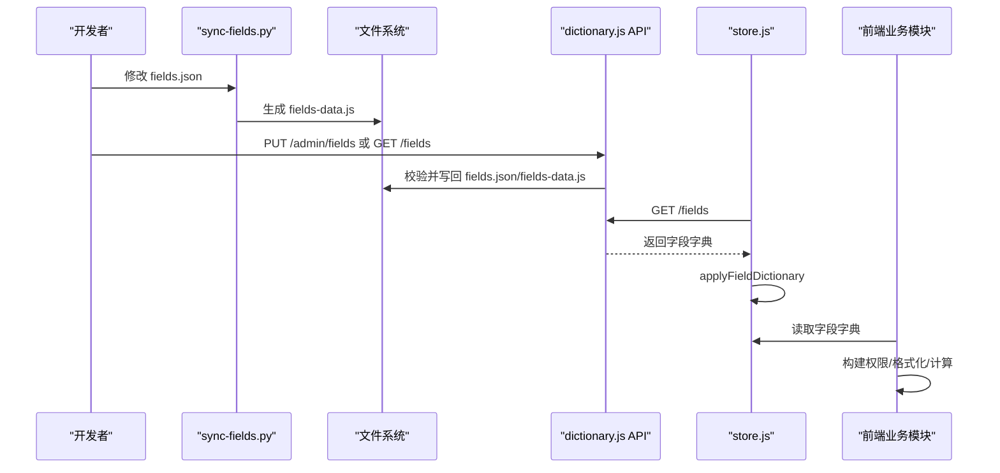
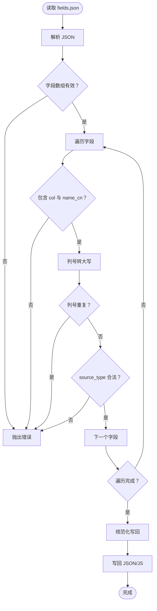
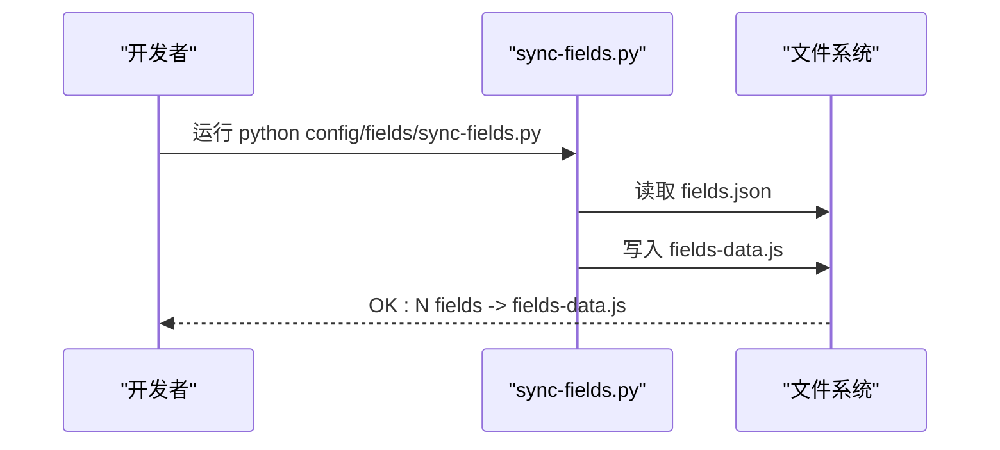
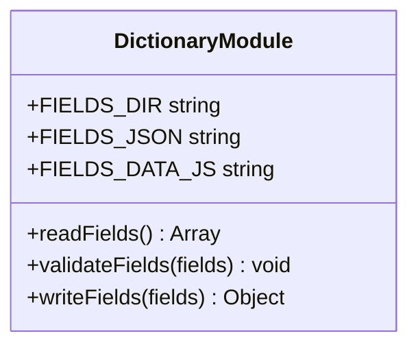
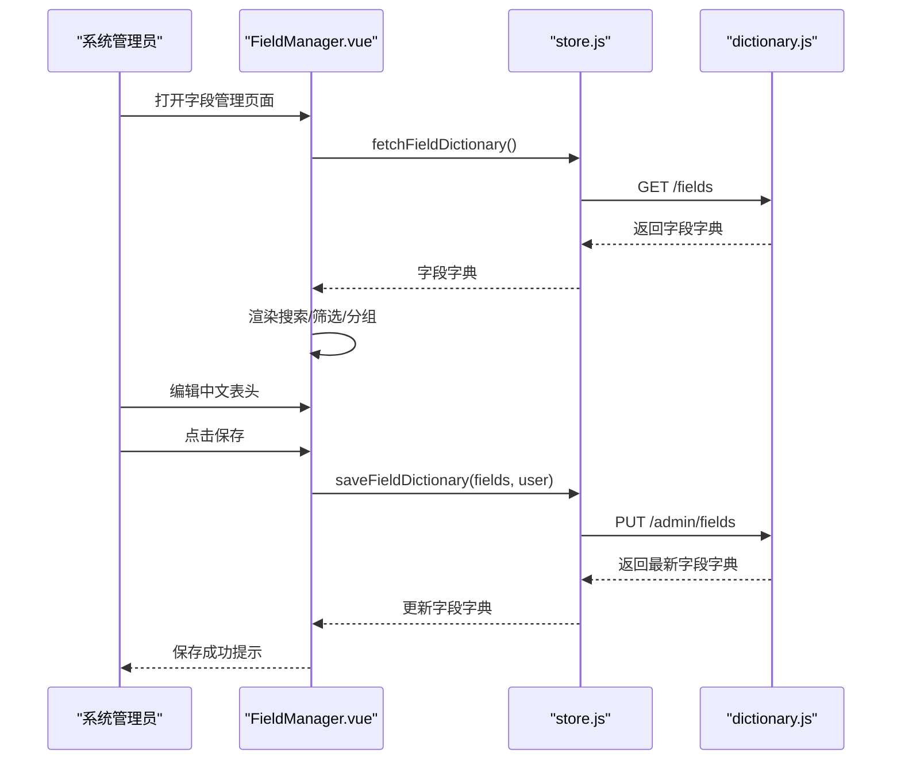
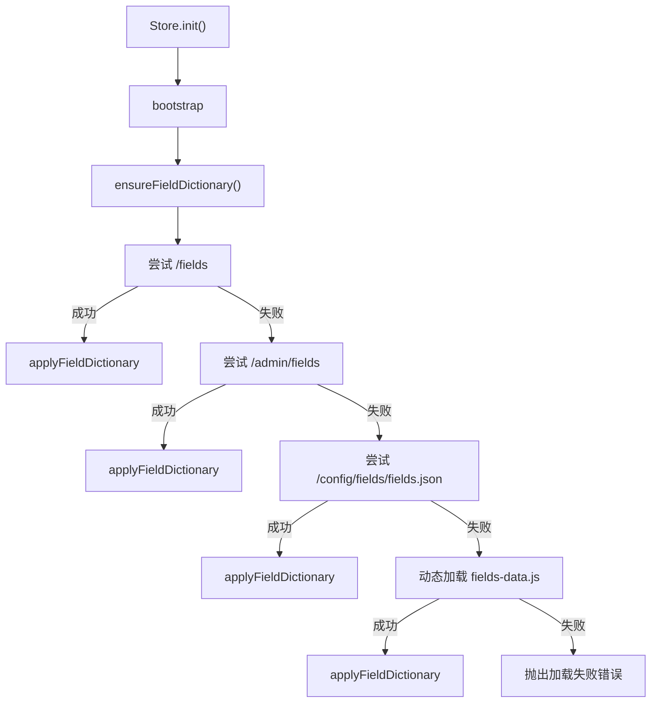
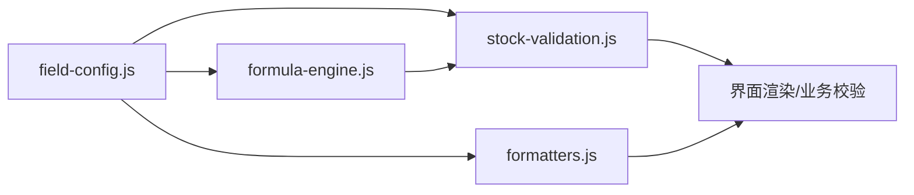
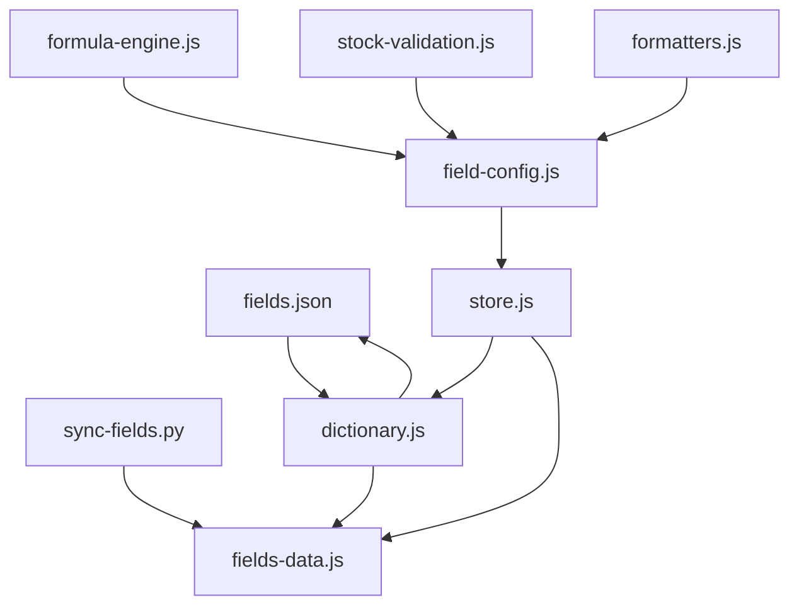

# 字段字典系统

<cite>
**本文档引用的文件**
- [fields.json](file://config/fields/fields.json)
- [fields-data.js](file://config/fields/fields-data.js)
- [sync-fields.py](file://config/fields/sync-fields.py)
- [dictionary.js](file://server/fields/dictionary.js)
- [FieldManager.js](file://js/field-dictionary/FieldManager.js)
- [store.js](file://js/store.js)
- [field-config.js](file://js/field-config.js)
- [formatters.js](file://js/formatters.js)
- [formula-engine.js](file://js/formula-engine.js)
- [stock-validation.js](file://js/stock-validation.js)
- [package.json](file://package.json)
</cite>

## 目录
1. [简介](#简介)
2. [项目结构](#项目结构)
3. [核心组件](#核心组件)
4. [架构总览](#架构总览)
5. [详细组件分析](#详细组件分析)
6. [依赖分析](#依赖分析)
7. [性能考量](#性能考量)
8. [故障排查指南](#故障排查指南)
9. [结论](#结论)
10. [附录](#附录)

## 简介
本文件系统性阐述“字段字典系统”的设计与实现，涵盖数据标准化与验证机制、字段配置文件结构、字段同步工具、字段管理器、字段缓存与动态加载、以及字段字典在数据验证、界面渲染与业务计算中的作用。同时提供字段扩展策略、自定义字段支持与配置管理最佳实践，并给出维护与升级操作指南。

## 项目结构
字段字典系统围绕“配置文件 + 同步工具 + 服务端校验 + 前端管理 + 业务引擎”五部分协同工作：
- 配置文件：fields.json 定义字段元数据；fields-data.js 作为静态资源供前端直接加载。
- 同步工具：Python 脚本将 JSON 同步为 JS，确保前后端一致。
- 服务端：Node 服务读取/校验/写回字段配置，提供 API。
- 前端：FieldManager 管理表头配置；Store 统一加载与缓存字段字典；FieldConfig/Formatter/FormulaEngine/StockValidation 使用字段字典驱动界面与业务。
- 业务引擎：公式引擎与库存校验基于字段字典进行计算与验证。

**图表来源**
- [fields.json:1-1101](file://config/fields/fields.json#L1-L1101)
- [fields-data.js:1-1101](file://config/fields/fields-data.js#L1-L1101)
- [sync-fields.py:1-13](file://config/fields/sync-fields.py#L1-L13)
- [dictionary.js:1-70](file://server/fields/dictionary.js#L1-L70)
- [store.js:1-602](file://js/store.js#L1-L602)
- [FieldManager.js:1-387](file://js/field-dictionary/FieldManager.js#L1-L387)
- [field-config.js:1-262](file://js/field-config.js#L1-L262)
- [formula-engine.js:1-105](file://js/formula-engine.js#L1-L105)
- [stock-validation.js:1-181](file://js/stock-validation.js#L1-L181)
- [formatters.js:1-167](file://js/formatters.js#L1-L167)

**章节来源**
- [fields.json:1-1101](file://config/fields/fields.json#L1-L1101)
- [fields-data.js:1-1101](file://config/fields/fields-data.js#L1-L1101)
- [sync-fields.py:1-13](file://config/fields/sync-fields.py#L1-L13)
- [dictionary.js:1-70](file://server/fields/dictionary.js#L1-L70)
- [store.js:1-602](file://js/store.js#L1-L602)
- [FieldManager.js:1-387](file://js/field-dictionary/FieldManager.js#L1-L387)
- [field-config.js:1-262](file://js/field-config.js#L1-L262)
- [formula-engine.js:1-105](file://js/formula-engine.js#L1-L105)
- [stock-validation.js:1-181](file://js/stock-validation.js#L1-L181)
- [formatters.js:1-167](file://js/formatters.js#L1-L167)

## 核心组件
- 字段配置文件（fields.json）：定义字段元数据（列号、分区、数据类型、来源类型、计算逻辑、枚举值、说明等），作为系统权威配置。
- 字段同步工具（sync-fields.py）：将 JSON 转换为 JS，注入 window.FIELD_DICTIONARY，便于前端静态加载。
- 服务端字段字典模块（dictionary.js）：提供读取、校验、写回能力，保证字段配置一致性与完整性。
- 字段管理器（FieldManager.js）：系统管理员界面，支持搜索、筛选、分组、详情查看与保存表头配置。
- 前端存储与加载（store.js）：统一加载字段字典，优先 API，其次静态 JSON，最后动态注入的 JS。
- 字段配置与权限（field-config.js）：构建增强字段配置，含权限矩阵、列索引、Luckysheet 渲染参数、分组等。
- 格式化工具（formatters.js）：按字段数据类型进行格式化与解析。
- 公式引擎（formula-engine.js）：基于字段字典进行派生字段计算。
- 库存校验（stock-validation.js）：基于字段字典进行业务规则校验与预警。

**章节来源**
- [fields.json:1-1101](file://config/fields/fields.json#L1-L1101)
- [fields-data.js:1-1101](file://config/fields/fields-data.js#L1-L1101)
- [sync-fields.py:1-13](file://config/fields/sync-fields.py#L1-L13)
- [dictionary.js:1-70](file://server/fields/dictionary.js#L1-L70)
- [FieldManager.js:1-387](file://js/field-dictionary/FieldManager.js#L1-L387)
- [store.js:1-602](file://js/store.js#L1-L602)
- [field-config.js:1-262](file://js/field-config.js#L1-L262)
- [formatters.js:1-167](file://js/formatters.js#L1-L167)
- [formula-engine.js:1-105](file://js/formula-engine.js#L1-L105)
- [stock-validation.js:1-181](file://js/stock-validation.js#L1-L181)

## 架构总览
字段字典系统采用“配置中心 + 同步工具 + 服务端校验 + 前端缓存 + 业务引擎”的分层架构：
- 配置中心：fields.json 为单一事实来源；fields-data.js 为前端静态资源。
- 同步工具：Python 脚本确保 JSON 与 JS 一致，避免前后端不一致。
- 服务端校验：读取 JSON，严格校验字段完整性与合法性，写回时统一规范化。
- 前端缓存：Store.ensureFieldDictionary 多路径加载，统一应用到全局与 window.FIELD_DICTIONARY。
- 业务引擎：FieldConfig/FormulaEngine/StockValidation 基于字段字典进行权限、格式化、计算与校验。

**图表来源**
- [sync-fields.py:1-13](file://config/fields/sync-fields.py#L1-L13)
- [dictionary.js:1-70](file://server/fields/dictionary.js#L1-L70)
- [store.js:186-235](file://js/store.js#L186-L235)
- [field-config.js:127-155](file://js/field-config.js#L127-L155)
- [formula-engine.js:19-83](file://js/formula-engine.js#L19-L83)
- [stock-validation.js:131-149](file://js/stock-validation.js#L131-L149)

## 详细组件分析

### 字段配置文件（fields.json）结构设计
- 字段元数据字段：
  - id：字段唯一标识（可选，写回时自动生成）。
  - col：列号（必填，大写标准化）。
  - section：分区名称（必填，用于界面分组）。
  - section_range：分区列范围（用于界面标注）。
  - name_cn/name_en：中文/英文表头名称（必填，表头配置页仅允许编辑中文名）。
  - data_type：数据类型（金额/比率/日期/文本/布尔等）。
  - source_type：来源类型（system_sync/manual_input/auto_calc）。
  - calc_logic：计算逻辑（公式或说明文本）。
  - enum_values：枚举值（分类字段的可选项）。
  - description：字段说明。
- 数据标准化：
  - 列号统一转为大写。
  - 枚举值强制为数组。
  - 缺省 id 写回时以时间戳生成。
- 验证规则：
  - 字段数组必须非空。
  - 每个字段必须包含 col 与 name_cn。
  - 列号必须唯一。
  - source_type 必须为三者之一。

**图表来源**
- [dictionary.js:20-60](file://server/fields/dictionary.js#L20-L60)

**章节来源**
- [fields.json:1-1101](file://config/fields/fields.json#L1-L1101)
- [dictionary.js:11-60](file://server/fields/dictionary.js#L11-L60)

### 字段同步工具（sync-fields.py）工作原理
- 输入：config/fields/fields.json。
- 输出：config/fields/fields-data.js，内容为 window.FIELD_DICTIONARY = JSON。
- 作用：确保前端静态资源与服务端 JSON 保持一致，便于前端直接加载。
- 使用方式：npm 脚本提供 sync:fields 命令，便于 CI/CD 或本地开发流程集成。

**图表来源**
- [sync-fields.py:1-13](file://config/fields/sync-fields.py#L1-L13)
- [package.json:6-12](file://package.json#L6-L12)

**章节来源**
- [sync-fields.py:1-13](file://config/fields/sync-fields.py#L1-L13)
- [package.json:6-12](file://package.json#L6-L12)

### 服务端字段字典模块（dictionary.js）实现逻辑
- 读取：读取并解析 fields.json，要求为数组。
- 校验：逐字段校验完整性与合法性。
- 写回：规范化字段（列号大写、枚举值数组、缺省 id），写回 JSON 与 JS。
- 导出：提供读取、写入、校验方法与文件路径常量。

**图表来源**
- [dictionary.js:11-69](file://server/fields/dictionary.js#L11-L69)

**章节来源**
- [dictionary.js:11-69](file://server/fields/dictionary.js#L11-L69)

### 字段管理器（FieldManager.js）实现逻辑
- 视图组件：基于 Vue 的字段管理界面，系统管理员专用。
- 功能特性：
  - 字段加载：调用 Store.fetchFieldDictionary 获取字段字典。
  - 搜索与筛选：支持列号、中文名、英文名、分区、描述搜索与来源类型筛选。
  - 分组与折叠：按分区分组，支持展开/折叠。
  - 表头名称编辑：仅允许编辑中文表头名称，保存后同步至服务端。
  - 公式渲染：将公式中的列号替换为中文名称，便于阅读。
  - 详情查看：弹窗展示字段详情（来源、类型、分区、列范围、计算逻辑、枚举值、说明）。
- 交互流程：加载 → 搜索/筛选 → 编辑 → 保存 → 同步至 Luckysheet 表头。

**图表来源**
- [FieldManager.js:96-191](file://js/field-dictionary/FieldManager.js#L96-L191)
- [store.js:583-598](file://js/store.js#L583-L598)
- [dictionary.js:43-60](file://server/fields/dictionary.js#L43-L60)

**章节来源**
- [FieldManager.js:26-387](file://js/field-dictionary/FieldManager.js#L26-L387)
- [store.js:583-598](file://js/store.js#L583-L598)

### 字段字典在前端的缓存与动态加载机制
- 多路径加载：ensureFieldDictionary 依次尝试：
  - API：/fields 与 /admin/fields。
  - 静态 JSON：/config/fields/fields.json。
  - 动态 JS：/config/fields/fields-data.js 注入 window.FIELD_DICTIONARY。
- 应用与缓存：applyFieldDictionary 将字段字典复制到 Store.fieldDictionary，并同步到 window.FIELD_DICTIONARY。
- 初始化：init 中先 bootstrap，再 ensureFieldDictionary，若仍为空则抛错。

**图表来源**
- [store.js:186-235](file://js/store.js#L186-L235)

**章节来源**
- [store.js:186-235](file://js/store.js#L186-L235)

### 字段配置与权限、格式化、计算与校验
- 字段配置增强（field-config.js）：
  - 构建增强字段配置：添加列索引、金额/比率/文本标记、Luckysheet 渲染参数、列宽等。
  - 权限矩阵：基于角色、锁定状态、报告月索引判断字段是否可编辑。
  - 月度列时间窗：完成额（当月及以后）、开票/回款（当月之后）。
  - 列字母与索引转换、分区分组、扁平/数组转换。
- 格式化工具（formatters.js）：
  - 金额、百分比、日期、布尔、税务等格式化与解析。
  - 统一日期处理（Excel 序列日、ISO）。
- 公式引擎（formula-engine.js）：
  - 基于字段字典计算派生字段（如总合同额、不含税金额、WIP、应收账款等）。
  - 支持批量计算与报告月索引。
- 库存校验（stock-validation.js）：
  - R/S 存量列预警与违规校验。
  - 填报期自动对冲（仅开放期）。
  - 提交时严格校验。

**图表来源**
- [field-config.js:127-155](file://js/field-config.js#L127-L155)
- [formula-engine.js:19-83](file://js/formula-engine.js#L19-L83)
- [stock-validation.js:131-149](file://js/stock-validation.js#L131-L149)
- [formatters.js:118-126](file://js/formatters.js#L118-L126)

**章节来源**
- [field-config.js:1-262](file://js/field-config.js#L1-L262)
- [formatters.js:1-167](file://js/formatters.js#L1-L167)
- [formula-engine.js:1-105](file://js/formula-engine.js#L1-L105)
- [stock-validation.js:1-181](file://js/stock-validation.js#L1-L181)

## 依赖分析
- 配置文件与同步工具：
  - fields.json 与 fields-data.js 互为镜像，通过 sync-fields.py 同步。
  - package.json 提供 sync:fields 脚本，便于自动化。
- 服务端与前端：
  - dictionary.js 读写 fields.json/fields-data.js，提供 /fields 与 /admin/fields。
  - store.js 通过 API 与静态资源加载字段字典。
- 业务模块：
  - FieldConfig/FormulaEngine/StockValidation/Formaters 均依赖字段字典进行权限、格式化、计算与校验。

**图表来源**
- [sync-fields.py:1-13](file://config/fields/sync-fields.py#L1-L13)
- [fields.json:1-1101](file://config/fields/fields.json#L1-L1101)
- [fields-data.js:1-1101](file://config/fields/fields-data.js#L1-L1101)
- [dictionary.js:1-70](file://server/fields/dictionary.js#L1-L70)
- [store.js:186-235](file://js/store.js#L186-L235)
- [field-config.js:127-155](file://js/field-config.js#L127-L155)
- [formula-engine.js:19-83](file://js/formula-engine.js#L19-L83)
- [stock-validation.js:131-149](file://js/stock-validation.js#L131-L149)
- [formatters.js:118-126](file://js/formatters.js#L118-L126)

**章节来源**
- [package.json:6-12](file://package.json#L6-L12)
- [dictionary.js:1-70](file://server/fields/dictionary.js#L1-L70)
- [store.js:186-235](file://js/store.js#L186-L235)

## 性能考量
- 字段字典加载：
  - 优先使用 API，减少静态资源体积与网络请求。
  - 首次加载失败时再降级到静态资源，确保可用性。
- 字段管理器：
  - 使用深拷贝与快照比较，避免不必要的响应式更新。
  - 分组与筛选在前端完成，注意大数据量时的渲染优化。
- 公式与校验：
  - 批量计算与校验时尽量复用中间结果，减少重复计算。
  - 金额与日期格式化采用本地化设置，兼顾性能与一致性。

[本节为通用指导，无需特定文件来源]

## 故障排查指南
- 字段字典加载失败：
  - 检查 /fields 与 /admin/fields 接口是否可用。
  - 确认 /config/fields/fields.json 存在且为合法 JSON。
  - 确认 /config/fields/fields-data.js 已生成并可访问。
  - 若均失败，检查浏览器控制台与网络面板。
- 字段保存失败：
  - 确认表头中文名不为空。
  - 确认当前用户具备系统管理员权限。
  - 查看服务端返回的错误信息，定位具体字段问题。
- 字段同步异常：
  - 重新运行 npm run sync:fields，确保 fields-data.js 与 fields.json 一致。
  - 检查 Python 环境与文件编码（UTF-8）。
- 权限与编辑限制：
  - 检查角色、锁定状态与报告月索引，确认字段是否在可编辑时间窗内。
  - 注意系统引用列（system_sync）与工程平台引用列（MI/MP）的特殊规则。

**章节来源**
- [store.js:272-275](file://js/store.js#L272-L275)
- [FieldManager.js:167-191](file://js/field-dictionary/FieldManager.js#L167-L191)
- [field-config.js:104-122](file://js/field-config.js#L104-L122)
- [sync-fields.py:1-13](file://config/fields/sync-fields.py#L1-L13)

## 结论
字段字典系统通过严格的配置文件结构、可靠的同步工具、严谨的服务端校验与灵活的前端缓存机制，实现了数据标准化与验证的一致性。字段管理器提供了直观的系统管理员界面，业务引擎基于字段字典实现了强大的权限控制、格式化、计算与校验能力。整体架构清晰、职责分离明确，具备良好的扩展性与维护性。

[本节为总结性内容，无需特定文件来源]

## 附录

### 字段扩展策略与自定义字段支持
- 新增字段：
  - 在 fields.json 中添加字段条目，确保 col 与 name_cn 唯一。
  - 如为分类字段，补充 enum_values。
  - 如为自动计算字段，提供 calc_logic。
- 自定义字段：
  - 通过 source_type 区分 system_sync/manual_input/auto_calc。
  - 通过 data_type 控制格式化与渲染。
  - 通过 section/section_range 组织界面布局。
- 权限与可见性：
  - 使用 field-config.js 的权限矩阵控制不同角色的可编辑范围。
  - 通过列索引与时间窗限制月度列的编辑时机。

[本节为通用指导，无需特定文件来源]

### 配置管理最佳实践
- 版本控制：fields.json 与 fields-data.js 均纳入版本控制，确保一致性。
- 同步流程：修改字段配置后，务必运行 npm run sync:fields 并提交变更。
- 校验前置：服务端写回前会进行严格校验，建议在本地开发环境先行验证。
- 文档与注释：calc_logic 与 description 应保持清晰，便于后续维护。

[本节为通用指导，无需特定文件来源]

### 字段字典维护与升级操作指南
- 日常维护：
  - 通过字段管理器修改表头中文名，保存后自动同步。
  - 通过 /admin/fields 接口进行批量更新。
- 升级步骤：
  - 修改 fields.json。
  - 运行 npm run sync:fields。
  - 重启服务端或刷新前端缓存。
  - 回归测试：检查界面渲染、权限、格式化与业务计算。
- 回滚策略：
  - 保留历史版本的 fields.json。
  - 通过 /admin/fields 回滚到上一个稳定版本。
  - 如需恢复静态资源，重新生成 fields-data.js。

**章节来源**
- [FieldManager.js:167-191](file://js/field-dictionary/FieldManager.js#L167-L191)
- [store.js:590-598](file://js/store.js#L590-L598)
- [sync-fields.py:1-13](file://config/fields/sync-fields.py#L1-L13)