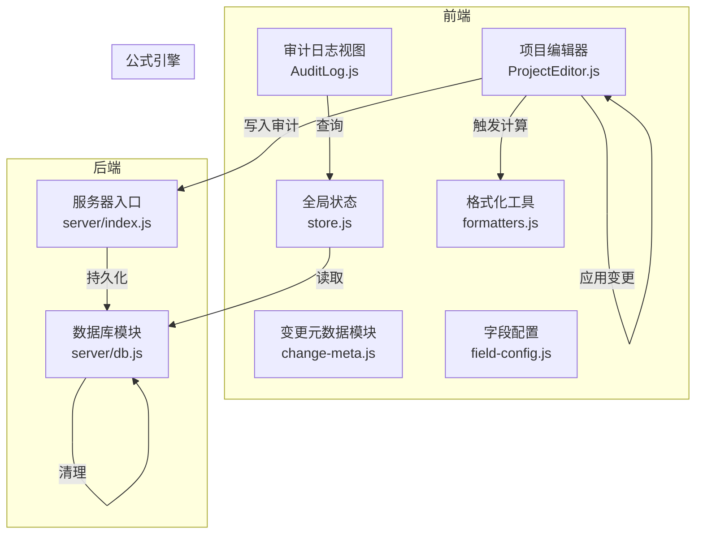
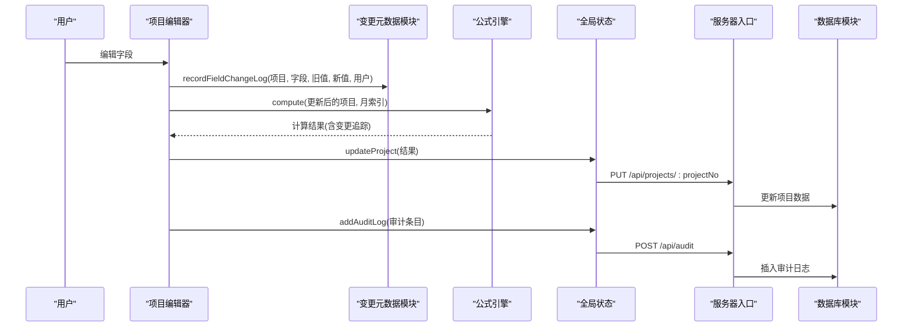
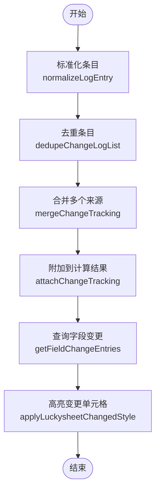
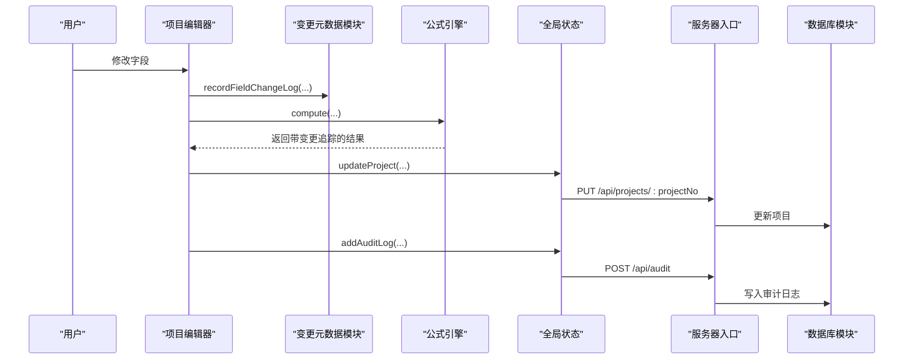
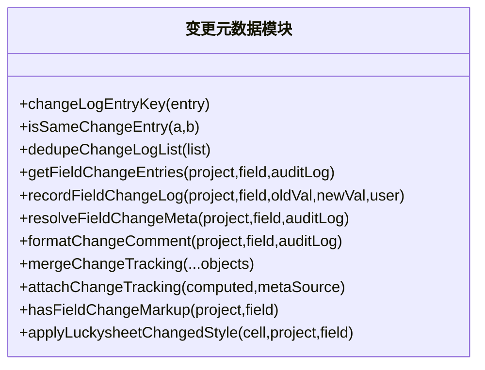
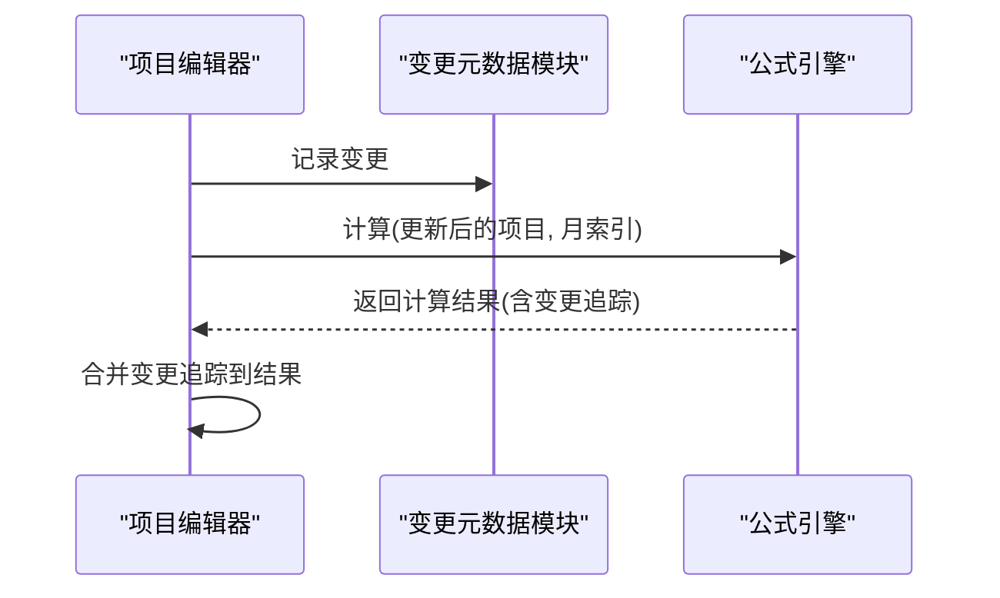
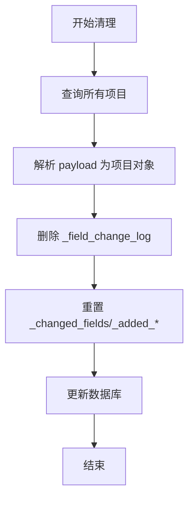
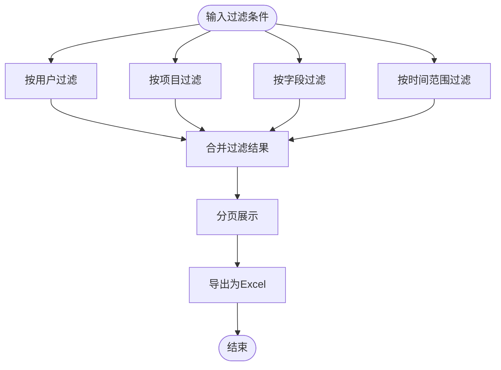
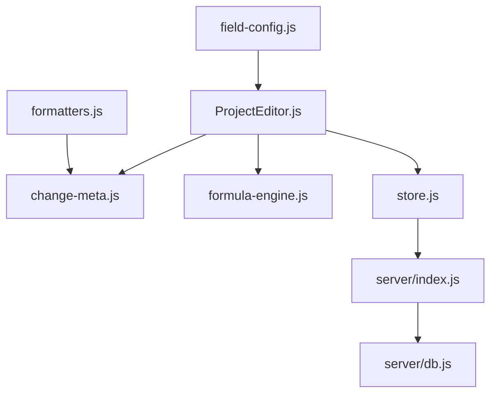

# 变更追踪机制

<cite>
**本文档引用的文件**
- [change-meta.js](file://js/change-meta.js)
- [formula-engine.js](file://js/formula-engine.js)
- [ProjectEditor.js](file://js/views/ProjectEditor.js)
- [db.js](file://server/db.js)
- [AuditLog.js](file://js/views/AuditLog.js)
- [store.js](file://js/store.js)
- [index.js](file://server/index.js)
- [field-config.js](file://js/field-config.js)
- [formatters.js](file://js/formatters.js)
- [snapshot-change-log.test.js](file://test/snapshot-change-log.test.js)
</cite>

## 目录
1. [简介](#简介)
2. [项目结构](#项目结构)
3. [核心组件](#核心组件)
4. [架构概览](#架构概览)
5. [详细组件分析](#详细组件分析)
6. [依赖关系分析](#依赖关系分析)
7. [性能考量](#性能考量)
8. [故障排查指南](#故障排查指南)
9. [结论](#结论)
10. [附录](#附录)

## 简介
本文件系统性阐述项目数据变更追踪机制，涵盖变更日志的数据结构、触发时机、与公式引擎的集成、清理机制、查询接口与过滤条件，以及在审计日志中的作用。重点解释项目对象中的变更追踪字段：_field_change_log、_changed_fields、_added_this_month 等的作用与更新逻辑，并提供可视化图表帮助理解整体流程。

## 项目结构
变更追踪涉及前端 JavaScript 模块与后端数据库模块的协同：
- 前端模块负责变更记录的采集、去重、合并与展示
- 后端模块负责持久化存储、清理与审计日志写入
- 公式引擎在计算后保留变更追踪元数据，以支持后续优化

**图表来源**
- [change-meta.js:1-260](file://js/change-meta.js#L1-L260)
- [ProjectEditor.js:716-752](file://js/views/ProjectEditor.js#L716-L752)
- [AuditLog.js:1-239](file://js/views/AuditLog.js#L1-L239)
- [store.js:325-342](file://js/store.js#L325-L342)
- [index.js:170-182](file://server/index.js#L170-L182)
- [db.js:285-304](file://server/db.js#L285-L304)
- [field-config.js:223-240](file://js/field-config.js#L223-L240)
- [formatters.js:118-126](file://js/formatters.js#L118-L126)

**章节来源**
- [change-meta.js:1-260](file://js/change-meta.js#L1-L260)
- [ProjectEditor.js:716-752](file://js/views/ProjectEditor.js#L716-L752)
- [AuditLog.js:1-239](file://js/views/AuditLog.js#L1-L239)
- [store.js:325-342](file://js/store.js#L325-L342)
- [index.js:170-182](file://server/index.js#L170-L182)
- [db.js:285-304](file://server/db.js#L285-L304)
- [field-config.js:223-240](file://js/field-config.js#L223-L240)
- [formatters.js:118-126](file://js/formatters.js#L118-L126)

## 核心组件
- 变更元数据模块（change-meta.js）：提供变更日志条目的标准化、去重、合并与查询能力，以及变更字段高亮样式应用。
- 项目编辑器（ProjectEditor.js）：在用户编辑后收集变更，调用公式引擎重新计算，并将变更追踪信息附加到结果对象。
- 公式引擎（formula-engine.js）：执行项目字段的派生计算，返回包含所有计算字段的新对象。
- 审计日志视图（AuditLog.js）：提供按用户、项目、字段、时间段的过滤与导出。
- 全局状态（store.js）：封装 API 请求、更新项目与审计日志，维护前端状态。
- 服务器入口（index.js）：提供审计日志写入接口。
- 数据库模块（db.js）：提供清理项目变更追踪的批量处理函数。
- 字段配置（field-config.js）：提供列到键映射与扁平化/数组化转换，支撑变更追踪字段的识别与合并。
- 格式化工具（formatters.js）：根据字段数据类型格式化旧值与新值，确保日志一致性。

**章节来源**
- [change-meta.js:96-119](file://js/change-meta.js#L96-L119)
- [ProjectEditor.js:716-752](file://js/views/ProjectEditor.js#L716-L752)
- [formula-engine.js:19-82](file://js/formula-engine.js#L19-L82)
- [AuditLog.js:23-34](file://js/views/AuditLog.js#L23-L34)
- [store.js:338-342](file://js/store.js#L338-L342)
- [index.js:170-182](file://server/index.js#L170-L182)
- [db.js:285-304](file://server/db.js#L285-L304)
- [field-config.js:223-240](file://js/field-config.js#L223-L240)
- [formatters.js:118-126](file://js/formatters.js#L118-L126)

## 架构概览
变更追踪贯穿“用户编辑 → 记录变更 → 触发计算 → 写入审计 → 持久化”的闭环。前端负责变更采集与去重，公式引擎负责计算与保留变更元数据，后端负责持久化与清理。

**图表来源**
- [ProjectEditor.js:716-752](file://js/views/ProjectEditor.js#L716-L752)
- [change-meta.js:96-119](file://js/change-meta.js#L96-L119)
- [formula-engine.js:19-82](file://js/formula-engine.js#L19-L82)
- [store.js:325-342](file://js/store.js#L325-L342)
- [index.js:170-182](file://server/index.js#L170-L182)
- [db.js:285-304](file://server/db.js#L285-L304)

## 详细组件分析

### 变更日志数据结构与字段语义
- _field_change_log：按列（col）聚合的变更记录数组。每个条目包含：
  - oldVal/newVal：按字段数据类型格式化后的值
  - roleLabel/userName/userId：操作者标识
  - at：ISO 时间戳
- _changed_fields：本次计算或编辑过程中发生变化的列集合（去重后的列名集合）
- _added_this_month/_added_since_baseline：用于标识新增项目或自基线以来新增项目的布尔标志（在清理函数中被重置）

这些字段在前端计算后保留，在导入 I 版本时会被清空，而在 D/J 版本快照中会保留累积的变更日志。

**章节来源**
- [change-meta.js:96-119](file://js/change-meta.js#L96-L119)
- [change-meta.js:165-207](file://js/change-meta.js#L165-L207)
- [snapshot-change-log.test.js:18-44](file://test/snapshot-change-log.test.js#L18-L44)
- [db.js:285-304](file://server/db.js#L285-L304)

### 变更追踪字段的作用与更新逻辑
- 记录字段变更：recordFieldChangeLog 将每次变更标准化并去重，避免重复记录相同值的连续变更。
- 合并多个来源的变更：mergeChangeTracking 将多个项目对象的变更日志与变更字段集合合并，去重并汇总。
- 查询与展示：getFieldChangeEntries 从项目对象中提取指定字段的变更记录，支持从审计日志回退解析。
- 高亮样式：hasFieldChangeMarkup 与 applyLuckysheetChangedStyle 用于在界面中标记发生过变更的单元格。

**图表来源**
- [change-meta.js:38-77](file://js/change-meta.js#L38-L77)
- [change-meta.js:165-216](file://js/change-meta.js#L165-L216)
- [change-meta.js:79-94](file://js/change-meta.js#L79-L94)
- [change-meta.js:218-239](file://js/change-meta.js#L218-L239)

**章节来源**
- [change-meta.js:38-77](file://js/change-meta.js#L38-L77)
- [change-meta.js:165-216](file://js/change-meta.js#L165-L216)
- [change-meta.js:79-94](file://js/change-meta.js#L79-L94)
- [change-meta.js:218-239](file://js/change-meta.js#L218-L239)

### 变更追踪的触发时机
- 用户编辑：用户在项目编辑器中修改字段后，编辑器收集变更并通过 recordFieldChangeLog 记录。
- 公式计算：编辑完成后，编辑器调用公式引擎重新计算，计算结果保留变更追踪元数据。
- 系统更新：通过系统接口（如平台数据同步）更新项目时，可在相应流程中记录审计日志并持久化。

**图表来源**
- [ProjectEditor.js:716-752](file://js/views/ProjectEditor.js#L716-L752)
- [change-meta.js:96-119](file://js/change-meta.js#L96-L119)
- [formula-engine.js:19-82](file://js/formula-engine.js#L19-L82)
- [store.js:325-342](file://js/store.js#L325-L342)
- [index.js:170-182](file://server/index.js#L170-L182)
- [db.js:285-304](file://server/db.js#L285-L304)

**章节来源**
- [ProjectEditor.js:716-752](file://js/views/ProjectEditor.js#L716-L752)
- [change-meta.js:96-119](file://js/change-meta.js#L96-L119)
- [formula-engine.js:19-82](file://js/formula-engine.js#L19-L82)
- [store.js:325-342](file://js/store.js#L325-L342)
- [index.js:170-182](file://server/index.js#L170-L182)
- [db.js:285-304](file://server/db.js#L285-L304)

### 变更日志的数据结构详解
- 条目键：changeLogEntryKey 通过角色标签、旧值、新值组合生成唯一键，用于去重判断。
- 标准化：normalizeLogEntry 统一字段结构，确保字段存在性与类型正确。
- 去重：dedupeChangeLogList 基于键去重，避免重复记录。
- 合并：mergeColChangeLogs 与 mergeChangeTracking 支持多来源合并，汇总列集合与条目列表。

**图表来源**
- [change-meta.js:50-239](file://js/change-meta.js#L50-L239)

**章节来源**
- [change-meta.js:50-239](file://js/change-meta.js#L50-L239)

### 变更追踪与公式引擎的集成
- 编辑阶段：编辑器将变更写入临时变更日志，随后调用公式引擎重新计算。
- 计算阶段：公式引擎返回新的项目对象，编辑器将变更日志与变更字段集合附加到结果上。
- 性能优化：通过 _changed_fields 与 _field_change_log，公式引擎可仅对受影响的列进行增量计算或高亮提示，减少不必要的重算。

**图表来源**
- [ProjectEditor.js:716-752](file://js/views/ProjectEditor.js#L716-L752)
- [change-meta.js:165-207](file://js/change-meta.js#L165-L207)
- [formula-engine.js:19-82](file://js/formula-engine.js#L19-L82)

**章节来源**
- [ProjectEditor.js:716-752](file://js/views/ProjectEditor.js#L716-L752)
- [change-meta.js:165-207](file://js/change-meta.js#L165-L207)
- [formula-engine.js:19-82](file://js/formula-engine.js#L19-L82)

### 清理机制：clearProjectChangeTracking
- 功能：遍历所有项目，删除 _field_change_log，重置 _changed_fields、_added_this_month、_added_since_baseline。
- 场景：周期性清理或迁移后重置，避免历史变更日志污染新周期数据。
- 实现：在事务中逐条更新，保证一致性。

**图表来源**
- [db.js:285-304](file://server/db.js#L285-L304)

**章节来源**
- [db.js:285-304](file://server/db.js#L285-L304)

### 查询接口与过滤条件
- 审计日志视图提供：
  - 操作人过滤：按用户名过滤
  - 项目过滤：按项目号或名称过滤
  - 字段过滤：按字段中文名过滤
  - 时间范围过滤：按时间区间过滤
- 分页与导出：支持分页展示与导出为 Excel。

**图表来源**
- [AuditLog.js:23-34](file://js/views/AuditLog.js#L23-L34)
- [AuditLog.js:61-81](file://js/views/AuditLog.js#L61-L81)

**章节来源**
- [AuditLog.js:23-34](file://js/views/AuditLog.js#L23-L34)
- [AuditLog.js:61-81](file://js/views/AuditLog.js#L61-L81)

### 审计日志与变更追踪的关系
- 审计日志来源于用户操作与系统更新，记录操作人、项目、字段、原值、新值与时间戳。
- 变更追踪在前端计算后保留，审计日志在后端持久化，二者互补：前者面向合规与审计，后者面向前端交互与性能优化。
- 审计日志视图支持导出，便于离线审计与存档。

**章节来源**
- [store.js:338-342](file://js/store.js#L338-L342)
- [index.js:170-182](file://server/index.js#L170-L182)
- [db.js:306-308](file://server/db.js#L306-L308)
- [AuditLog.js:61-81](file://js/views/AuditLog.js#L61-L81)

## 依赖关系分析
- 前端依赖链：ProjectEditor → ChangeMeta → FormulaEngine → Store → Server
- 后端依赖链：Server → DB → AuditLog 表
- 字段配置与格式化：FieldConfig 提供列到键映射，Formatters 提供值格式化，二者共同支撑变更日志的准确性与一致性。

**图表来源**
- [ProjectEditor.js:716-752](file://js/views/ProjectEditor.js#L716-L752)
- [change-meta.js:96-119](file://js/change-meta.js#L96-L119)
- [formula-engine.js:19-82](file://js/formula-engine.js#L19-L82)
- [store.js:325-342](file://js/store.js#L325-L342)
- [index.js:170-182](file://server/index.js#L170-L182)
- [db.js:285-304](file://server/db.js#L285-L304)
- [field-config.js:223-240](file://js/field-config.js#L223-L240)
- [formatters.js:118-126](file://js/formatters.js#L118-L126)

**章节来源**
- [ProjectEditor.js:716-752](file://js/views/ProjectEditor.js#L716-L752)
- [change-meta.js:96-119](file://js/change-meta.js#L96-L119)
- [formula-engine.js:19-82](file://js/formula-engine.js#L19-L82)
- [store.js:325-342](file://js/store.js#L325-L342)
- [index.js:170-182](file://server/index.js#L170-L182)
- [db.js:285-304](file://server/db.js#L285-L304)
- [field-config.js:223-240](file://js/field-config.js#L223-L240)
- [formatters.js:118-126](file://js/formatters.js#L118-L126)

## 性能考量
- 变更去重：通过 changeLogEntryKey 与 dedupeChangeLogList 减少重复记录，降低存储与渲染压力。
- 变更字段集合：_changed_fields 有助于公式引擎进行增量计算，避免全量重算。
- 批量清理：clearProjectChangeTracking 在事务中批量更新，保证一致性与性能。
- 前端高亮：仅对存在变更的单元格应用样式，减少 DOM 渲染负担。

[本节为通用性能讨论，不直接分析具体文件]

## 故障排查指南
- 变更未记录：检查 recordFieldChangeLog 的调用是否传入了正确的项目、字段、旧值、新值与用户信息。
- 变更重复：确认 dedupeChangeLogList 是否正确执行，检查 changeLogEntryKey 的键生成逻辑。
- 计算结果缺少变更追踪：确认编辑器在调用公式引擎后是否将 _field_change_log 与 _changed_fields 附加到结果对象。
- 审计日志为空：确认 addAuditLog 是否被调用，以及 /api/audit 接口是否正常工作。
- 清理无效：确认 clearProjectChangeTracking 是否在事务中执行，且目标字段是否正确重置。

**章节来源**
- [change-meta.js:96-119](file://js/change-meta.js#L96-L119)
- [change-meta.js:64-77](file://js/change-meta.js#L64-L77)
- [ProjectEditor.js:716-752](file://js/views/ProjectEditor.js#L716-L752)
- [store.js:338-342](file://js/store.js#L338-L342)
- [index.js:170-182](file://server/index.js#L170-L182)
- [db.js:285-304](file://server/db.js#L285-L304)

## 结论
变更追踪机制通过前端变更采集、去重与合并、公式引擎集成与后端持久化，实现了对项目数据变更的实时追踪与记录。结合审计日志与查询过滤，既满足了合规审计需求，又提升了前端交互体验与计算性能。清理机制确保历史数据不会干扰新周期，保障系统的长期稳定运行。

[本节为总结性内容，不直接分析具体文件]

## 附录
- 快照版本行为验证：D/J 版本保留累积变更日志，I 版本清空临时变更日志，测试用例覆盖此行为。

**章节来源**
- [snapshot-change-log.test.js:33-58](file://test/snapshot-change-log.test.js#L33-L58)