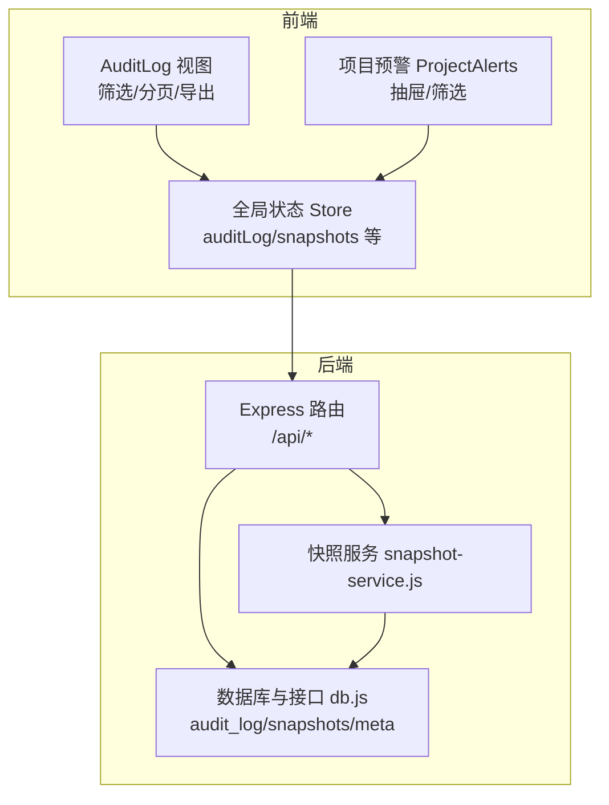
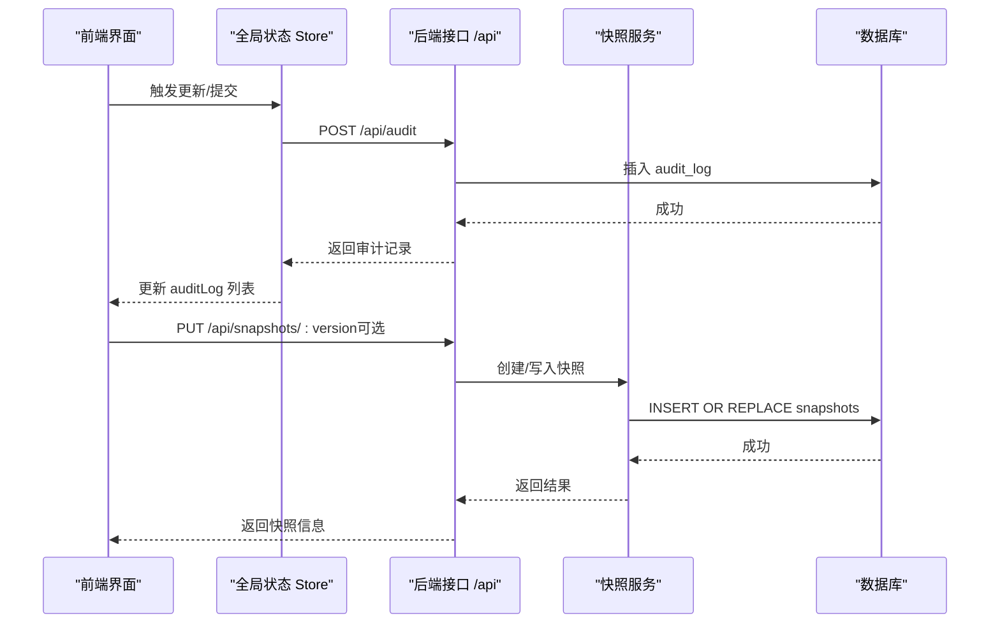
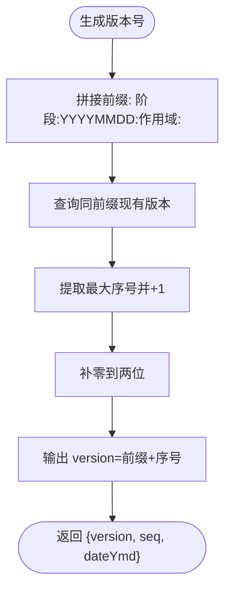
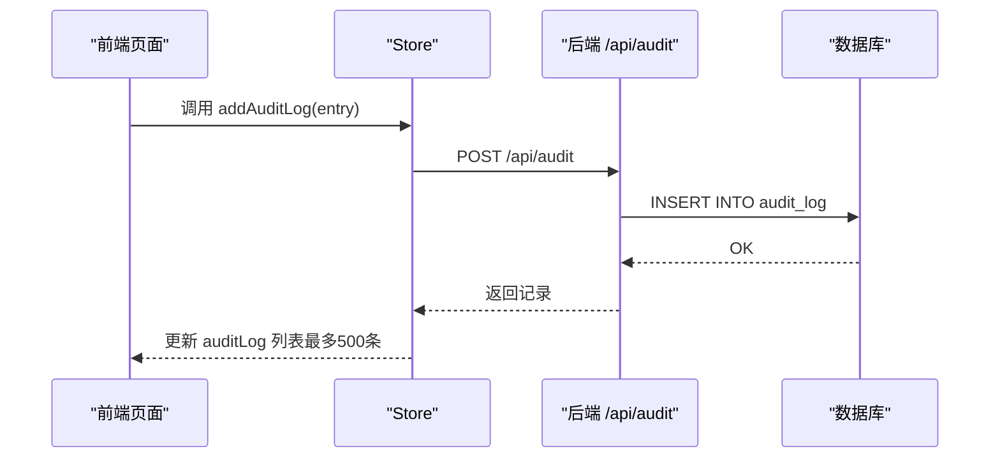
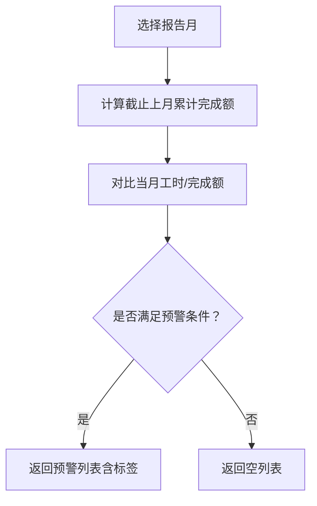
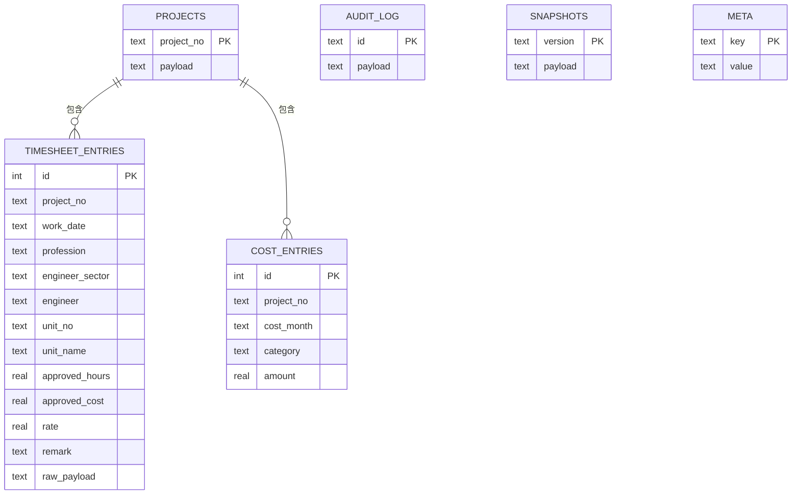
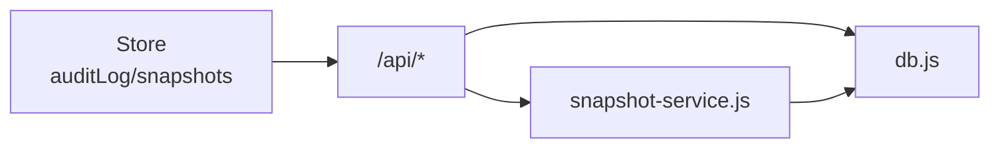

# 审计与日志

<cite>
**本文引用的文件**
- [server/snapshot-service.js](file://server/snapshot-service.js)
- [server/index.js](file://server/index.js)
- [server/db.js](file://server/db.js)
- [js/views/AuditLog.js](file://js/views/AuditLog.js)
- [js/store.js](file://js/store.js)
- [js/project-alerts.js](file://js/project-alerts.js)
- [js/components/ProjectDetailDrawer.js](file://js/components/ProjectDetailDrawer.js)
- [test/snapshot-change-log.test.js](file://test/snapshot-change-log.test.js)
- [server/sector-workflow.js](file://server/sector-workflow.js)
</cite>

## 目录
1. [简介](#简介)
2. [项目结构](#项目结构)
3. [核心组件](#核心组件)
4. [架构总览](#架构总览)
5. [组件详解](#组件详解)
6. [依赖关系分析](#依赖关系分析)
7. [性能考量](#性能考量)
8. [故障排查指南](#故障排查指南)
9. [结论](#结论)
10. [附录](#附录)

## 简介
本文件系统化阐述项目的审计与日志体系，覆盖数据变更追踪、版本控制（快照）、变更日志、项目预警、查询与权限控制、隐私保护、审计分析工具、合规报告与数据恢复策略，并给出性能优化建议。

## 项目结构
围绕审计与日志的关键模块分布如下：
- 服务端数据库与接口
  - 快照服务：负责版本号生成、快照创建与基线维护
  - 核心接口：审计日志写入、快照持久化、工作流推进与归档
  - 元数据与项目存储：项目、审计日志、快照、元信息
- 前端状态与视图
  - 全局状态：审计日志缓存、字段字典、快照集合
  - 审计日志视图：筛选、分页、导出
  - 项目预警：基于工时与完成额的异常检测与提示

图表来源
- [server/index.js:170-196](file://server/index.js#L170-L196)
- [server/snapshot-service.js:276-291](file://server/snapshot-service.js#L276-L291)
- [server/db.js:21-57](file://server/db.js#L21-L57)
- [js/views/AuditLog.js:8-239](file://js/views/AuditLog.js#L8-L239)
- [js/store.js:338-342](file://js/store.js#L338-L342)

章节来源
- [server/index.js:88-100](file://server/index.js#L88-L100)
- [server/db.js:21-57](file://server/db.js#L21-L57)
- [js/views/AuditLog.js:8-239](file://js/views/AuditLog.js#L8-L239)
- [js/store.js:97-128](file://js/store.js#L97-L128)

## 核心组件
- 快照服务（snapshot-service.js）
  - 版本号生成规则（阶段:YYYYMMDD:作用域:序号）
  - 创建导入/I版、草稿/D版、终稿/J版快照
  - 基线修复与遗留快照清理
- 审计日志（/api/audit）
  - 写入审计记录（含唯一ID、时间戳、用户、项目、字段、原值/新值）
  - 前端 Store 缓存与限制长度
- 项目预警（project-alerts.js）
  - 基于工时与完成额的异常检测
  - 抽屉与筛选展示
- 数据库层（db.js）
  - 表结构：projects、audit_log、snapshots、meta
  - 审计写入、快照持久化、元数据管理

章节来源
- [server/snapshot-service.js:53-158](file://server/snapshot-service.js#L53-L158)
- [server/index.js:170-182](file://server/index.js#L170-L182)
- [js/store.js:338-342](file://js/store.js#L338-L342)
- [js/project-alerts.js:65-89](file://js/project-alerts.js#L65-L89)
- [server/db.js:21-57](file://server/db.js#L21-L57)

## 架构总览
审计与日志的端到端流程包括：前端编辑触发变更，后端写入审计日志与项目变更元数据，必要时生成快照；前端通过 Store 获取审计日志并在视图中展示与导出。

图表来源
- [server/index.js:170-196](file://server/index.js#L170-L196)
- [server/snapshot-service.js:114-158](file://server/snapshot-service.js#L114-L158)
- [server/db.js:306-321](file://server/db.js#L306-L321)
- [js/store.js:338-342](file://js/store.js#L338-L342)

## 组件详解

### 快照服务（snapshot-service.js）
- 版本号设计
  - 格式：阶段(I/D/J):YYYYMMDD:作用域:序号
  - 作用域：公司级（ALL）或板块代码
  - 序号按同一天同作用域递增
- 快照类型
  - I（导入初始化）：用于首次导入与基线修复
  - D（草稿）：板块提交审批前的草稿版本
  - J（终稿）：公司归档后的最终版本
- 关键行为
  - 保留 D/J 的累积变更日志，I 清除瞬态变更日志
  - 基线修复：当 baseline 与快照行不一致时，尝试修复或重建 I 版
  - 遗留快照清理：迁移期间清理旧版键（如 Draft/Approve1/Approve2/J版）

图表来源
- [server/snapshot-service.js:53-68](file://server/snapshot-service.js#L53-L68)

章节来源
- [server/snapshot-service.js:53-158](file://server/snapshot-service.js#L53-L158)
- [test/snapshot-change-log.test.js:33-58](file://test/snapshot-change-log.test.js#L33-L58)

### 审计日志（/api/audit 与前端视图）
- 接口行为
  - POST /api/audit：生成唯一ID与时间戳，写入 audit_log
- 前端展示
  - 支持按日期范围、操作人、项目号/名称、字段名筛选
  - 分页与导出 Excel
  - 仅系统管理员可见完整审计日志，其他角色清空
- 记录内容
  - 时间戳、用户ID/姓名、项目号/名称、字段名/中文、原值/新值、操作类型等

图表来源
- [js/store.js:338-342](file://js/store.js#L338-L342)
- [server/index.js:170-182](file://server/index.js#L170-L182)
- [server/db.js:306-308](file://server/db.js#L306-L308)
- [js/views/AuditLog.js:23-81](file://js/views/AuditLog.js#L23-L81)

章节来源
- [server/index.js:170-182](file://server/index.js#L170-L182)
- [js/views/AuditLog.js:20-81](file://js/views/AuditLog.js#L20-L81)
- [js/store.js:164-166](file://js/store.js#L164-L166)

### 项目预警（project-alerts.js 与 ProjectDetailDrawer.js）
- 预警规则
  - 存量合同/开票额为负
  - 有完成额但无工时或有工时但无完成额（阈值）
- 展示位置
  - 项目详情抽屉：实时计算并高亮提示
  - 支持“完成额填报辅助参考”帮助输入
- 与审计联动
  - 预警触发时可伴随审计记录（如工时/完成额字段变更）

图表来源
- [js/project-alerts.js:65-89](file://js/project-alerts.js#L65-L89)
- [js/components/ProjectDetailDrawer.js:152-163](file://js/components/ProjectDetailDrawer.js#L152-L163)

章节来源
- [js/project-alerts.js:65-141](file://js/project-alerts.js#L65-L141)
- [js/components/ProjectDetailDrawer.js:152-172](file://js/components/ProjectDetailDrawer.js#L152-L172)

### 数据模型（数据库）
- 表结构要点
  - projects：项目数据（JSON payload）
  - audit_log：审计日志（JSON payload）
  - snapshots：快照（version 主键，payload JSON）
  - meta：系统元数据（key/value JSON）
- 索引与统计
  - timesheet_entries、cost_entries 建有索引，支持按项目/月份查询
  - 提供统计接口（如工时/成本中心）

图表来源
- [server/db.js:21-57](file://server/db.js#L21-L57)

章节来源
- [server/db.js:21-57](file://server/db.js#L21-L57)

## 依赖关系分析
- 前端 Store 依赖后端 /api/bootstrap 同步状态，其中包含审计日志与快照集合
- 审计日志写入通过 /api/audit，前端 Store.addAuditLog 会限制列表长度
- 快照创建通过 /api/snapshots/:version，涉及 snapshot-service 的版本号生成与持久化
- 工作流推进与归档也会产生审计记录，便于追溯审批链路

图表来源
- [js/store.js:130-168](file://js/store.js#L130-L168)
- [server/index.js:170-196](file://server/index.js#L170-L196)
- [server/snapshot-service.js:276-291](file://server/snapshot-service.js#L276-L291)
- [server/db.js:306-321](file://server/db.js#L306-L321)

章节来源
- [js/store.js:130-168](file://js/store.js#L130-L168)
- [server/index.js:170-196](file://server/index.js#L170-L196)

## 性能考量
- 数据库模式
  - 使用 WAL 模式提升并发写入性能
  - 对高频查询表建立索引（如 timesheet_entries、cost_entries）
- 审计日志容量
  - 前端限制最多保留 500 条审计日志，避免内存膨胀
  - 后端查询审计日志时按时间倒序限制数量
- 快照体积
  - 快照仅保存必要字段，瞬态元数据在 I/D/J 中处理策略不同
  - 基线修复与遗留快照清理降低存储冗余
- 导出与筛选
  - 前端筛选在内存中进行，建议控制筛选粒度与分页大小

章节来源
- [server/db.js:14](file://server/db.js#L14)
- [server/db.js:212-215](file://server/db.js#L212-L215)
- [js/views/AuditLog.js:35-38](file://js/views/AuditLog.js#L35-L38)
- [js/store.js:340-342](file://js/store.js#L340-L342)

## 故障排查指南
- 审计日志为空
  - 确认当前登录角色是否为 system_admin（非系统管理员会清空审计日志）
  - 检查 /api/audit 是否正常写入
- 快照缺失或版本不一致
  - 启动时会执行快照维护，检查是否存在遗留键并尝试修复
  - 若基线版本不对应，尝试重建 I 版或采用最新 J 版作为基线
- 预警不显示
  - 确认工时统计已加载且 timesheetReady 为真
  - 检查阈值设置与字段映射

章节来源
- [js/store.js:164-166](file://js/store.js#L164-L166)
- [server/index.js:70-79](file://server/index.js#L70-L79)
- [js/project-alerts.js:79-86](file://js/project-alerts.js#L79-L86)

## 结论
本系统通过“审计日志 + 快照版本”的双轨机制，实现了对数据变更的可追溯与可恢复。前端提供便捷的筛选与导出能力，后端通过严格的接口与数据模型保障一致性与性能。结合项目预警与基线差异分析，可进一步提升数据质量与治理水平。

## 附录

### 审计数据查询接口与权限
- 查询审计日志
  - 方法：GET /api/bootstrap
  - 返回：包含 auditLog 的状态对象
- 写入审计日志
  - 方法：POST /api/audit
  - 请求体：包含用户、项目、字段、原值/新值等上下文
  - 返回：写入成功的记录
- 快照管理
  - PUT /api/snapshots/:version：写入指定版本快照
  - GET /api/snapshots/:version：读取指定版本快照

章节来源
- [server/index.js:88-100](file://server/index.js#L88-L100)
- [server/index.js:170-182](file://server/index.js#L170-L182)
- [server/index.js:184-196](file://server/index.js#L184-L196)

### 权限控制与隐私保护
- 权限控制
  - 仅 system_admin 可查看完整审计日志
  - 非 system_admin 登录时，前端会清空审计日志列表
- 隐私保护
  - 审计记录中不包含敏感字段的原始值
  - 快照在 I/D/J 中对瞬态元数据处理策略不同，避免泄露临时状态

章节来源
- [js/store.js:164-166](file://js/store.js#L164-L166)
- [server/snapshot-service.js:8-30](file://server/snapshot-service.js#L8-L30)

### 合规性报告与数据恢复
- 合规性报告
  - 基于审计日志导出 Excel，支持按时间、用户、项目、字段筛选
  - 快照版本可作为合规证据链的一部分
- 数据恢复
  - 通过快照版本回滚到历史状态
  - 归档后清除项目变更跟踪，确保流程闭环

章节来源
- [js/views/AuditLog.js:61-81](file://js/views/AuditLog.js#L61-L81)
- [server/index.js:419-446](file://server/index.js#L419-L446)
- [server/db.js:428-429](file://server/db.js#L428-L429)