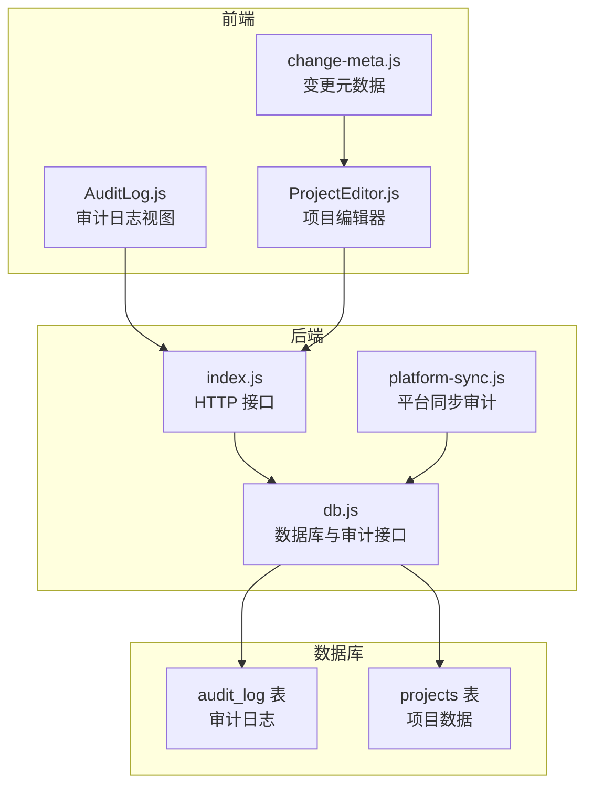
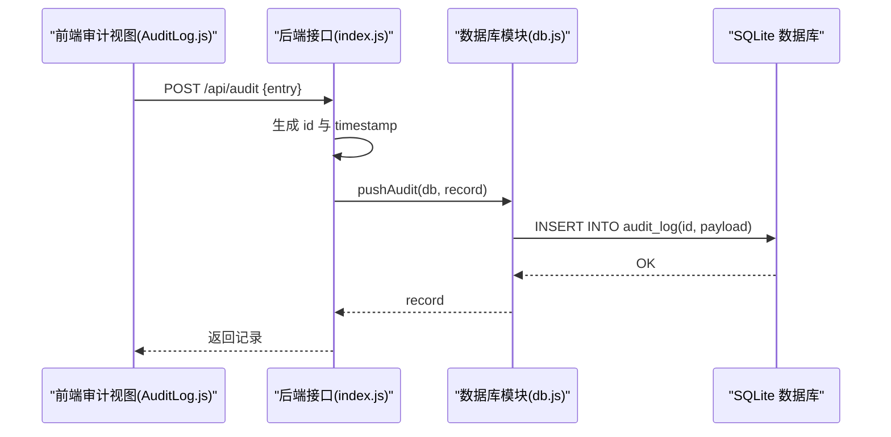
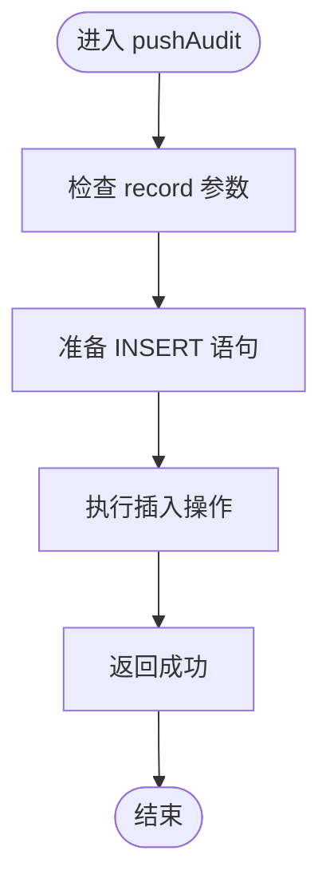
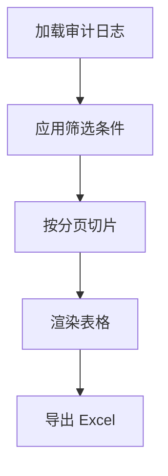
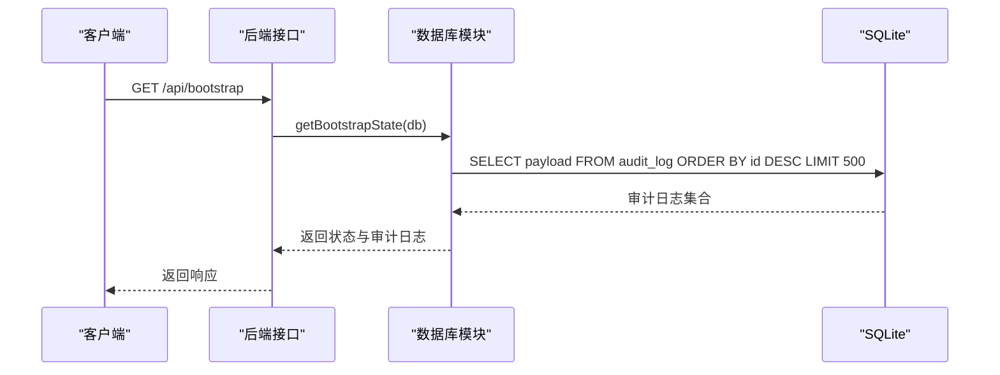

# 审计日志系统

<cite>
**本文引用的文件**
- [AuditLog.js](file://js/views/AuditLog.js)
- [db.js](file://server/db.js)
- [database-schema.sql](file://database-schema.sql)
- [index.js](file://server/index.js)
- [platform-sync.js](file://server/platform-sync.js)
- [ProjectEditor.js](file://js/views/ProjectEditor.js)
- [change-meta.js](file://js/change-meta.js)
</cite>

## 目录
1. [简介](#简介)
2. [项目结构](#项目结构)
3. [核心组件](#核心组件)
4. [架构概览](#架构概览)
5. [详细组件分析](#详细组件分析)
6. [依赖关系分析](#依赖关系分析)
7. [性能考量](#性能考量)
8. [故障排查指南](#故障排查指南)
9. [结论](#结论)
10. [附录](#附录)

## 简介
本文件系统性阐述审计日志系统的设计原理与实现机制，重点围绕审计日志表结构、生成时机、记录格式与存储策略展开，并深入解析 pushAudit 函数的实现逻辑，涵盖时间戳生成、用户信息记录与操作类型标识。同时，结合前端审计日志视图与后端 API，说明审计日志在数据变更追踪、操作审计与合规性方面的应用场景，给出查询接口、过滤条件与分页机制，以及清理策略、存储优化与性能考虑，并解释审计日志与项目数据的关系及在数据恢复与问题排查中的作用。

## 项目结构
审计日志系统横跨前端与后端：
- 前端负责展示与交互：提供审计日志视图，支持多维筛选、分页与导出。
- 后端负责数据持久化与接口：提供审计日志写入接口与查询接口，维护审计日志表结构与索引。
- 项目数据与变更追踪：项目数据采用 JSON 字段存储，配合字段级变更日志，用于生成审计记录。

图表来源
- [AuditLog.js:1-239](file://js/views/AuditLog.js#L1-L239)
- [db.js:1-525](file://server/db.js#L1-L525)
- [database-schema.sql:250-274](file://database-schema.sql#L250-L274)
- [index.js:170-182](file://server/index.js#L170-L182)
- [platform-sync.js:180-272](file://server/platform-sync.js#L180-L272)

章节来源
- [AuditLog.js:1-239](file://js/views/AuditLog.js#L1-L239)
- [db.js:1-525](file://server/db.js#L1-L525)
- [database-schema.sql:250-274](file://database-schema.sql#L250-L274)
- [index.js:170-182](file://server/index.js#L170-L182)
- [platform-sync.js:180-272](file://server/platform-sync.js#L180-L272)

## 核心组件
- 审计日志表结构（audit_log）：定义主键 id、项目号、字段名、中文名、原值、新值、修改原因、操作人、操作类型、报告月与创建时间等字段，并建立多维索引以支持高效查询。
- pushAudit 函数：封装审计记录的插入逻辑，统一写入数据库。
- 审计日志前端视图：提供筛选、分页与导出能力，支持按时间、用户、项目、字段等条件过滤。
- 审计日志接口：提供 POST /api/audit 写入接口，以及从数据库读取审计日志的查询逻辑。

章节来源
- [database-schema.sql:250-274](file://database-schema.sql#L250-L274)
- [db.js:306-308](file://server/db.js#L306-L308)
- [AuditLog.js:10-87](file://js/views/AuditLog.js#L10-L87)
- [index.js:170-182](file://server/index.js#L170-L182)

## 架构概览
审计日志系统遵循“前端展示 + 后端接口 + 数据库存储”的三层架构：
- 前端通过 HTTP 请求向后端写入审计记录，或读取现有审计日志进行展示。
- 后端在收到请求后调用数据库模块的 pushAudit 方法，将记录持久化到 audit_log 表。
- 数据库层使用 SQLite，审计日志表具备完善的索引，便于按时间、项目、操作人等维度检索。

图表来源
- [index.js:170-182](file://server/index.js#L170-L182)
- [db.js:306-308](file://server/db.js#L306-L308)

## 详细组件分析

### 审计日志表结构设计
- 主键 id：自增整型，确保每条审计记录唯一且有序。
- 字段设计要点：
  - project_no：关联项目编号，便于按项目维度检索。
  - field_name / field_cn：字段英文名与中文名，便于前端展示与过滤。
  - old_value / new_value：变更前后值，支持差异对比。
  - change_reason：修改原因（可选），用于合规审计。
  - operator：操作人标识，支持按操作人筛选。
  - operation_type：操作类型（insert/update/delete/import/unlock_edit 等），用于区分操作场景。
  - report_month：所属报告月，便于按月度维度统计。
  - created_at：记录创建时间，用于排序与筛选。
- 索引设计：
  - idx_audit_project：按项目号索引，加速项目维度查询。
  - idx_audit_month：按报告月索引，加速月度统计。
  - idx_audit_operator：按操作人索引，加速人员维度查询。
  - idx_audit_time：按创建时间索引，加速时间范围查询。

章节来源
- [database-schema.sql:250-274](file://database-schema.sql#L250-L274)

### 审计记录生成时机与格式
- 生成时机：
  - 项目编辑器保存变更时，会生成字段级变更日志，供后续审计记录使用。
  - PM 提交、板块提交审批、平台同步、系统归档等关键动作均会触发审计记录写入。
  - 平台同步模块在执行同步后，会记录一次系统级审计记录。
- 记录格式：
  - 前端/后端统一生成 id 与 timestamp，确保时间精度与唯一性。
  - 记录包含项目号、项目名称、字段名、中文名、原值、新值、操作人、操作类型、报告月等字段。
  - 对于系统级操作（如平台同步、新旧项目年度翻转），记录中 projectNo 通常为占位符，fieldName 与 fieldCN 用于标识系统功能。

章节来源
- [index.js:264-276](file://server/index.js#L264-L276)
- [index.js:330-341](file://server/index.js#L330-L341)
- [platform-sync.js:184-196](file://server/platform-sync.js#L184-L196)
- [platform-sync.js:247-259](file://server/platform-sync.js#L247-L259)
- [change-meta.js:96-119](file://js/change-meta.js#L96-L119)

### pushAudit 函数实现逻辑
- 功能职责：将传入的审计记录对象写入 audit_log 表。
- 实现要点：
  - 使用参数化 SQL 插入，避免注入风险。
  - 记录对象中的 id 与 payload 字段分别对应表中的 id 与 payload 字段。
  - 该函数被多个业务场景调用，保证审计记录的一致性与完整性。

图表来源
- [db.js:306-308](file://server/db.js#L306-L308)

章节来源
- [db.js:306-308](file://server/db.js#L306-L308)

### 审计日志前端视图与查询
- 筛选条件：
  - 时间范围：基于 timestamp 进行范围筛选。
  - 用户：基于 userName 进行模糊匹配。
  - 项目：基于 projectNo 或 projectName 进行模糊匹配。
  - 字段：基于 fieldCN 或 fieldName 进行模糊匹配。
- 分页机制：
  - 前端维护 currentPage 与 pageSize，对过滤后的日志进行切片展示。
  - 支持导出 Excel，便于离线分析。
- 展示样式：
  - 新增记录与系统级记录有特殊样式标识，便于识别。

图表来源
- [AuditLog.js:23-38](file://js/views/AuditLog.js#L23-L38)
- [AuditLog.js:35-38](file://js/views/AuditLog.js#L35-L38)
- [AuditLog.js:61-81](file://js/views/AuditLog.js#L61-L81)

章节来源
- [AuditLog.js:10-87](file://js/views/AuditLog.js#L10-L87)
- [AuditLog.js:23-38](file://js/views/AuditLog.js#L23-L38)
- [AuditLog.js:35-38](file://js/views/AuditLog.js#L35-L38)
- [AuditLog.js:61-81](file://js/views/AuditLog.js#L61-L81)

### 审计日志接口与存储策略
- 写入接口：POST /api/audit，接收审计记录体，生成 id 与 timestamp 后调用 pushAudit 写入数据库。
- 查询策略：启动时从 audit_log 表读取最近若干条记录（示例中为 500 条），用于前端展示。
- 清理策略：提供 clearAudit 方法，用于清空审计日志表，便于测试或重置环境。
- 存储优化：
  - 使用 SQLite WAL 模式提升并发写入性能。
  - 为审计日志表建立多维索引，支持高频查询场景。
  - 限制启动时读取的审计日志数量，避免一次性加载过多数据影响性能。

图表来源
- [db.js:212-215](file://server/db.js#L212-L215)
- [index.js:170-182](file://server/index.js#L170-L182)

章节来源
- [index.js:170-182](file://server/index.js#L170-L182)
- [db.js:212-215](file://server/db.js#L212-L215)
- [db.js:319-321](file://server/db.js#L319-L321)

### 审计日志的应用场景
- 数据变更追踪：通过字段级变更日志与审计记录，完整记录项目数据的变更轨迹。
- 操作审计：记录 PM 提交、板块审批推进、平台同步、系统归档等关键操作，满足合规审计需求。
- 合规性要求：提供可追溯的操作记录，支持监管与内部审计检查。

章节来源
- [index.js:264-276](file://server/index.js#L264-L276)
- [index.js:330-341](file://server/index.js#L330-L341)
- [platform-sync.js:184-196](file://server/platform-sync.js#L184-L196)
- [platform-sync.js:247-259](file://server/platform-sync.js#L247-L259)

### 审计日志与项目数据的关系
- 项目数据存储：项目数据以 JSON 形式存储在 projects 表的 payload 字段中，包含字段级变更日志与变更字段列表。
- 变更追踪：前端在项目编辑器中维护字段级变更日志，保存时合并到项目对象，供后续生成审计记录。
- 审计关联：审计记录中的 project_no 与项目数据关联，便于按项目维度进行审计与回溯。

章节来源
- [db.js:209-211](file://server/db.js#L209-L211)
- [change-meta.js:96-119](file://js/change-meta.js#L96-L119)
- [ProjectEditor.js:716-752](file://js/views/ProjectEditor.js#L716-L752)

## 依赖关系分析
- 前端依赖后端接口：审计日志视图通过 HTTP 请求与后端交互，读取与写入审计记录。
- 后端依赖数据库模块：审计记录写入与查询均由数据库模块统一管理。
- 数据库依赖 SQLite：审计日志表结构与索引在 SQLite 中实现，确保查询效率与一致性。

图表来源
- [AuditLog.js:1-239](file://js/views/AuditLog.js#L1-L239)
- [index.js:170-182](file://server/index.js#L170-L182)
- [db.js:1-525](file://server/db.js#L1-L525)

章节来源
- [AuditLog.js:1-239](file://js/views/AuditLog.js#L1-L239)
- [index.js:170-182](file://server/index.js#L170-L182)
- [db.js:1-525](file://server/db.js#L1-L525)

## 性能考量
- 写入性能：使用参数化 SQL 与事务（如批量更新）减少开销；SQLite WAL 模式提升并发写入能力。
- 查询性能：为审计日志表建立多维索引，支持按项目号、报告月、操作人、创建时间等维度快速检索。
- 启动性能：限制启动时读取的审计日志数量，避免一次性加载过多数据导致页面卡顿。
- 前端性能：分页与本地过滤减少 DOM 渲染压力，导出功能支持离线分析，降低实时查询压力。

## 故障排查指南
- 审计记录缺失：
  - 检查后端接口是否正确调用 pushAudit。
  - 确认请求体是否包含必要字段（如 id、timestamp、projectNo、userName 等）。
  - 查看数据库是否存在 clearAudit 被误调用的情况。
- 查询异常：
  - 确认索引是否存在且有效。
  - 检查时间范围与筛选条件是否合理。
- 导出失败：
  - 确认 SheetJS 是否正确加载。
  - 检查过滤后的日志数量是否过大导致导出超时。

章节来源
- [index.js:170-182](file://server/index.js#L170-L182)
- [db.js:319-321](file://server/db.js#L319-L321)
- [AuditLog.js:61-81](file://js/views/AuditLog.js#L61-L81)

## 结论
审计日志系统通过清晰的表结构设计、统一的写入接口与完善的前端展示，实现了对项目数据变更与关键操作的全面追踪。系统在性能方面通过索引与分页策略保障了查询效率，在合规方面提供了可追溯的操作记录。建议在生产环境中定期清理过期审计数据，并根据业务增长调整索引与分页策略，以维持长期稳定运行。

## 附录
- 审计日志表结构字段说明：
  - id：自增整型，主键。
  - project_no：项目编号，关联项目数据。
  - field_name / field_cn：字段英文名与中文名。
  - old_value / new_value：变更前与变更后值。
  - change_reason：修改原因（可选）。
  - operator：操作人标识。
  - operation_type：操作类型（insert/update/delete/import/unlock_edit 等）。
  - report_month：所属报告月。
  - created_at：记录创建时间。
- 常用查询与过滤：
  - 按时间范围：WHERE created_at BETWEEN start AND end。
  - 按项目号：WHERE project_no = 'xxx'。
  - 按操作人：WHERE operator = 'user_id'。
  - 按字段名：WHERE field_name = 'field'。
- 清理策略：
  - 使用 clearAudit 清空审计日志表，适用于测试或重置环境。
  - 建议在合规要求下制定定期归档与清理计划。

章节来源
- [database-schema.sql:250-274](file://database-schema.sql#L250-L274)
- [db.js:319-321](file://server/db.js#L319-L321)