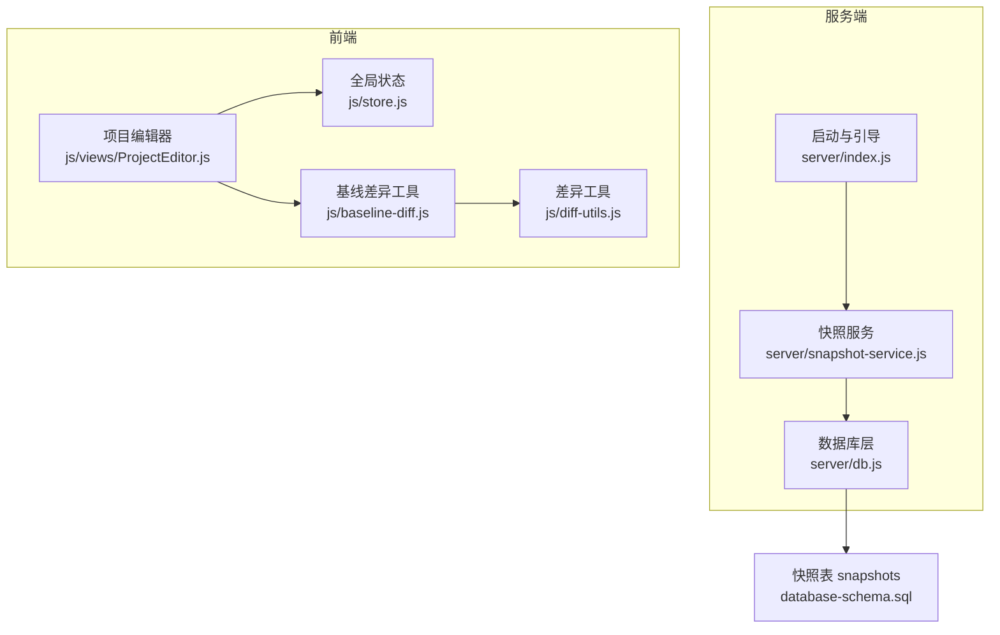
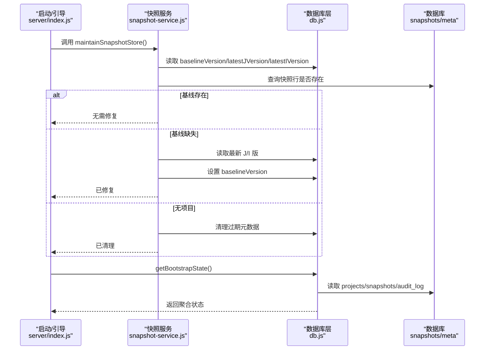
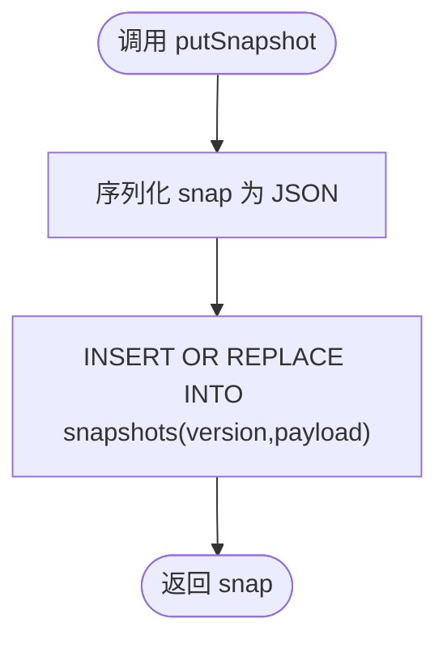
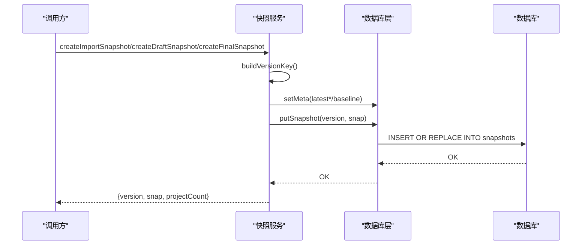
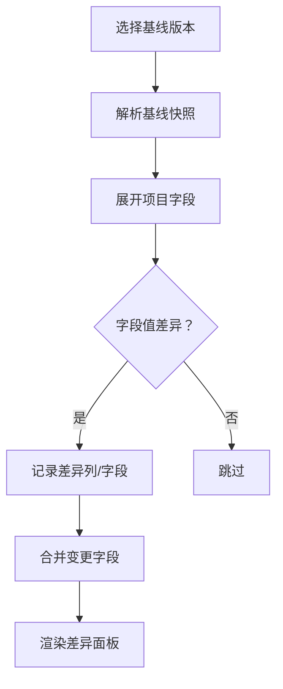
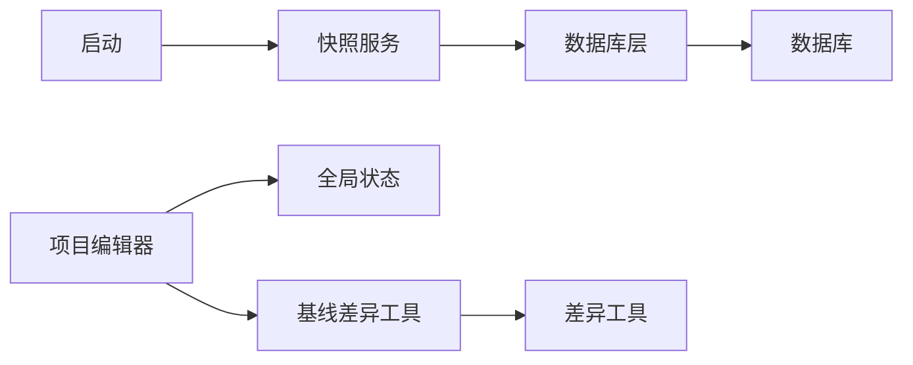

# 快照管理系统

<cite>
**本文引用的文件**
- [server/snapshot-service.js](file://server/snapshot-service.js)
- [server/db.js](file://server/db.js)
- [database-schema.sql](file://database-schema.sql)
- [test/snapshot-change-log.test.js](file://test/snapshot-change-log.test.js)
- [js/baseline-diff.js](file://js/baseline-diff.js)
- [js/diff-utils.js](file://js/diff-utils.js)
- [js/views/ProjectEditor.js](file://js/views/ProjectEditor.js)
- [js/store.js](file://js/store.js)
- [server/index.js](file://server/index.js)
</cite>

## 目录
1. [简介](#简介)
2. [项目结构](#项目结构)
3. [核心组件](#核心组件)
4. [架构总览](#架构总览)
5. [详细组件分析](#详细组件分析)
6. [依赖关系分析](#依赖关系分析)
7. [性能考量](#性能考量)
8. [故障排查指南](#故障排查指南)
9. [结论](#结论)
10. [附录](#附录)

## 简介
本文件系统性阐述快照管理系统的实现原理与版本控制策略，重点覆盖：
- 快照表（snapshots）的结构设计与版本键规则
- putSnapshot 函数的实现逻辑与数据序列化
- 快照版本管理策略（版本号规则、继承关系、冲突处理）
- 快照在审批流程中的作用与可见性控制
- 查询接口、版本比较与差异分析能力
- 清理策略、存储优化与版本归档机制
- 与项目数据的同步机制及回滚、历史查询能力

## 项目结构
快照系统由服务端快照服务、数据库层、前端展示与工具模块协同组成：
- 服务端：快照服务负责版本生成、快照创建与维护；数据库层负责元数据与快照持久化
- 前端：项目编辑器负责快照选择、标签显示与差异对比；工具模块提供字段级差异计算
- 测试：验证变更日志在不同快照类型中的保留与清理行为

图表来源
- [server/snapshot-service.js:1-292](file://server/snapshot-service.js#L1-L292)
- [server/db.js:1-525](file://server/db.js#L1-L525)
- [database-schema.sql:275-286](file://database-schema.sql#L275-L286)
- [js/views/ProjectEditor.js:648-2977](file://js/views/ProjectEditor.js#L648-L2977)
- [js/baseline-diff.js:1-117](file://js/baseline-diff.js#L1-L117)
- [js/diff-utils.js:1-56](file://js/diff-utils.js#L1-L56)
- [server/index.js:60-259](file://server/index.js#L60-L259)

章节来源
- [server/snapshot-service.js:1-292](file://server/snapshot-service.js#L1-L292)
- [server/db.js:1-525](file://server/db.js#L1-L525)
- [database-schema.sql:275-286](file://database-schema.sql#L275-L286)
- [js/views/ProjectEditor.js:648-2977](file://js/views/ProjectEditor.js#L648-L2977)
- [js/baseline-diff.js:1-117](file://js/baseline-diff.js#L1-L117)
- [js/diff-utils.js:1-56](file://js/diff-utils.js#L1-L56)
- [server/index.js:60-259](file://server/index.js#L60-L259)

## 核心组件
- 快照服务（server/snapshot-service.js）
  - 版本键生成：buildVersionKey，按阶段、日期、范围、序号生成唯一版本键
  - 快照创建：createImportSnapshot、createDraftSnapshot、createFinalSnapshot
  - 基线解析：resolveBaselineSnapshot，基于元数据 baselineVersion 获取基线快照
  - 版本解析与兼容：parseSnapshotKey、isLegacySnapshotKey
  - 清理与修复：purgeLegacySnapshots、maintainSnapshotStore
- 数据库层（server/db.js）
  - 元数据管理：getMeta、setMeta
  - 快照持久化：putSnapshot
  - 引导加载：getBootstrapState，聚合项目、审计日志与快照
- 前端差异与展示（js/baseline-diff.js、js/diff-utils.js、js/views/ProjectEditor.js）
  - 基线解析与可见性：resolveBaselineSnapshot、isSnapshotVisibleToUser
  - 字段级差异：fieldValuesDiffer、diffProjectSets
  - 快照选项与标签：editorSnapshotOptions、formatSnapshotOptionLabel
- 测试（test/snapshot-change-log.test.js）
  - 验证导入、草稿、终版快照对变更日志的保留或清理行为

章节来源
- [server/snapshot-service.js:53-187](file://server/snapshot-service.js#L53-L187)
- [server/snapshot-service.js:160-187](file://server/snapshot-service.js#L160-L187)
- [server/snapshot-service.js:193-274](file://server/snapshot-service.js#L193-L274)
- [server/db.js:93-106](file://server/db.js#L93-L106)
- [server/db.js:310-313](file://server/db.js#L310-L313)
- [server/db.js:194-266](file://server/db.js#L194-L266)
- [js/baseline-diff.js:9-116](file://js/baseline-diff.js#L9-L116)
- [js/diff-utils.js:7-54](file://js/diff-utils.js#L7-L54)
- [js/views/ProjectEditor.js:648-2977](file://js/views/ProjectEditor.js#L648-L2977)
- [test/snapshot-change-log.test.js:33-58](file://test/snapshot-change-log.test.js#L33-L58)

## 架构总览
快照系统围绕“不可变快照 + 元数据驱动”的模式构建：
- 快照表采用 version 主键，payload 存储完整项目集合与元信息
- 元数据表保存 baselineVersion、latestIVersion、latestJVersion 等关键指针
- 前端通过 bootstrap 接口一次性拉取快照与项目数据，支持差异对比与历史查看
- 服务端在启动时执行快照库维护，确保基线一致性与兼容性

图表来源
- [server/index.js:67-80](file://server/index.js#L67-L80)
- [server/snapshot-service.js:229-274](file://server/snapshot-service.js#L229-L274)
- [server/db.js:194-266](file://server/db.js#L194-L266)

## 详细组件分析

### 快照表结构与版本键设计
- 快照表（snapshots）
  - version：主键，唯一标识一次快照
  - payload：JSON 文本，存储快照对象（含 snapshotType、time、user、role、reportingMonth、scope、label、projects 等）
- 版本键规则（I/D/J 阶段）
  - 格式：阶段:YYYYMMDD:范围:序号
  - 阶段：I（导入）、D（草稿）、J（终版）
  - 范围：全公司或板块代码（如 S520）
  - 序号：当日同阶段同范围内的递增编号，两位左填充
- 解析与兼容
  - parseSnapshotKey：解析阶段、日期、范围、序号
  - isLegacySnapshotKey：识别旧版键（如 Draft:、J版 等），用于迁移与清理

章节来源
- [database-schema.sql:279-286](file://database-schema.sql#L279-L286)
- [server/snapshot-service.js:53-68](file://server/snapshot-service.js#L53-L68)
- [server/snapshot-service.js:172-187](file://server/snapshot-service.js#L172-L187)

### putSnapshot 函数实现逻辑
- 输入：version、snap 对象
- 处理：将 snap 序列化为 JSON，写入 snapshots 表（INSERT OR REPLACE）
- 输出：返回 snap
- 作用：统一快照写入入口，保证幂等与一致性

图表来源
- [server/db.js:310-313](file://server/db.js#L310-L313)

章节来源
- [server/db.js:310-313](file://server/db.js#L310-L313)

### 快照版本生成与创建流程
- 导入快照（I）
  - 生成版本键（I:YYYYMMDD:ALL:NN）
  - 保存 reportingMonth、scope、label、projects
  - 更新元数据：latestIVersion、baselineVersion
- 草稿快照（D）
  - 限定到板块范围，生成版本键（D:YYYYMMDD:SECTOR:NN）
  - 过滤项目至目标板块，克隆项目并清理视图相关元数据
  - 更新元数据：按板块记录最新 D 版本
- 终版快照（J）
  - 生成版本键（J:YYYYMMDD:ALL:NN）
  - 保存公司级数据，更新元数据：latestJVersion、baselineVersion

图表来源
- [server/snapshot-service.js:88-158](file://server/snapshot-service.js#L88-L158)
- [server/db.js:310-313](file://server/db.js#L310-L313)

章节来源
- [server/snapshot-service.js:88-158](file://server/snapshot-service.js#L88-L158)
- [server/db.js:310-313](file://server/db.js#L310-L313)

### 快照版本管理策略
- 版本号规则
  - I/D/J 阶段 + YYYYMMDD + 范围 + 两位序号
  - 同阶段同范围同日自增，避免冲突
- 版本继承关系
  - I 版作为基线（baselineVersion），J 版同样作为基线
  - D 版仅对板块生效，不改变基线
- 版本冲突处理
  - 通过 buildVersionKey 自动递增序号，确保唯一性
  - 启动时通过 maintainSnapshotStore 修复基线与快照行不一致问题

章节来源
- [server/snapshot-service.js:53-68](file://server/snapshot-service.js#L53-L68)
- [server/snapshot-service.js:229-274](file://server/snapshot-service.js#L229-L274)

### 快照在审批流程中的作用与可见性
- 作用
  - I 版：导入初始化，作为基线
  - D 版：板块草稿，供板块管理员与 PM 查看
  - J 版：终版，作为最终基线
- 可见性控制
  - 前端根据用户角色与快照阶段决定可见性
  - I/J 对所有人可见；D 仅对系统管理员与对应板块可见

章节来源
- [js/views/ProjectEditor.js:2945-2970](file://js/views/ProjectEditor.js#L2945-L2970)
- [js/baseline-diff.js:85-102](file://js/baseline-diff.js#L85-L102)

### 查询接口、版本比较与差异分析
- 查询接口
  - 服务端 PUT /api/snapshots/:version：写入指定版本快照
  - 前端通过 bootstrap 获取全部快照与项目数据
- 版本比较
  - 基线解析：resolveBaselineSnapshot，基于 baselineVersion 获取基线快照
  - 字段级差异：fieldValuesDiffer，金额/比率使用高精度比较
  - 项目集差异：diffProjectSets，输出字段差异明细
- 差异分析
  - 新增项目标记：applyAddedSinceBaselineFlags
  - 合并变更字段：mergeBaselineChangedFields，整合基线差异与变更日志

图表来源
- [js/baseline-diff.js:17-73](file://js/baseline-diff.js#L17-L73)
- [js/diff-utils.js:14-49](file://js/diff-utils.js#L14-L49)

章节来源
- [js/baseline-diff.js:9-116](file://js/baseline-diff.js#L9-L116)
- [js/diff-utils.js:7-54](file://js/diff-utils.js#L7-L54)
- [server/index.js:91-100](file://server/index.js#L91-L100)

### 清理策略、存储优化与版本归档
- 旧版快照清理
  - purgeLegacySnapshots：删除旧版键（Month:/PM:/Draft/Approve1/Approve2/J版）
- 启动维护
  - maintainSnapshotStore：修复基线与快照行不一致，必要时重建 I 版
- 存储优化
  - 元数据表 meta 仅存键值字符串，避免冗余
  - 快照 payload 以 JSON 文本存储，便于序列化与检索
- 归档机制
  - J 版归档后重置流程状态，不清理快照与项目数据，支持新一轮流程

章节来源
- [server/snapshot-service.js:193-210](file://server/snapshot-service.js#L193-L210)
- [server/snapshot-service.js:229-274](file://server/snapshot-service.js#L229-L274)
- [server/db.js:350-370](file://server/db.js#L350-L370)

### 与项目数据的同步机制与回滚、历史查询
- 同步机制
  - bootstrap 接口一次性拉取项目、审计日志与快照，前端 Store 应用状态
  - 项目数据以 JSON 文本存储于 projects 表，快照数据以 JSON 文本存储于 snapshots 表
- 回滚与历史查询
  - 通过切换 baselineVersion 与快照版本，实现历史数据回放
  - 前端提供快照选项排序与标签格式化，支持快速定位与对比

章节来源
- [server/db.js:194-266](file://server/db.js#L194-L266)
- [js/views/ProjectEditor.js:648-672](file://js/views/ProjectEditor.js#L648-L672)
- [js/store.js:130-168](file://js/store.js#L130-L168)

## 依赖关系分析
- 组件耦合
  - 快照服务依赖数据库层进行元数据与快照写入
  - 前端依赖快照服务提供的版本解析与可见性判断
  - 启动流程依赖快照服务进行库维护
- 外部依赖
  - better-sqlite3 用于本地 SQLite 存储
  - 前端 Vue 生态用于状态管理与视图渲染

图表来源
- [server/snapshot-service.js:1-292](file://server/snapshot-service.js#L1-L292)
- [server/db.js:1-525](file://server/db.js#L1-L525)
- [js/views/ProjectEditor.js:648-2977](file://js/views/ProjectEditor.js#L648-L2977)
- [js/baseline-diff.js:1-117](file://js/baseline-diff.js#L1-L117)
- [js/diff-utils.js:1-56](file://js/diff-utils.js#L1-L56)
- [server/index.js:60-259](file://server/index.js#L60-L259)

## 性能考量
- 写入性能
  - 使用 INSERT OR REPLACE，避免重复主键冲突带来的额外开销
  - 事务批量写入（如 replaceAllProjects）可进一步提升大批量更新性能
- 查询性能
  - 快照表按 version 主键查询，索引命中良好
  - 前端一次性拉取 bootstrap 数据，减少多次往返
- 存储体积
  - JSON 文本存储简洁直观，但可能产生重复字段
  - 建议定期清理旧版快照与审计日志，控制增长

## 故障排查指南
- 快照库维护失败
  - 现象：启动日志提示维护失败
  - 排查：检查 baselineVersion 与快照行一致性，确认 latestJ/ latestI 是否存在
- 基线不一致
  - 现象：基线版本指向不存在的快照
  - 处理：通过 maintainSnapshotStore 修复，必要时重建 I 版
- 变更日志异常
  - 现象：导入快照仍保留临时变更日志
  - 处理：确认 stripEphemeralMeta 与 cloneProjectsForSnapshot 的清理逻辑
- 差异对比异常
  - 现象：金额/比率差异不准确
  - 处理：使用 fieldValuesDiffer 的高精度比较逻辑

章节来源
- [server/index.js:70-79](file://server/index.js#L70-L79)
- [server/snapshot-service.js:229-274](file://server/snapshot-service.js#L229-L274)
- [test/snapshot-change-log.test.js:33-58](file://test/snapshot-change-log.test.js#L33-L58)
- [js/diff-utils.js:7-12](file://js/diff-utils.js#L7-L12)

## 结论
快照管理系统通过“阶段化版本键 + 不可变快照 + 元数据驱动”的设计，实现了对项目数据在审批流程中的完整历史记录与可控回滚能力。服务端维护与前端差异工具共同保障了可用性与可审计性。建议持续清理旧版快照、优化序列化策略，并在大规模数据场景下引入增量快照与压缩存储以进一步提升性能。

## 附录
- 快照类型与用途
  - I：导入初始化，作为基线
  - D：板块草稿，供板块管理员与 PM 查看
  - J：终版，作为最终基线
- 关键元数据
  - baselineVersion：当前基线版本
  - latestIVersion：最新 I 版版本
  - latestJVersion：最新 J 版版本
  - sectorLatestDVersion：各板块最新 D 版版本