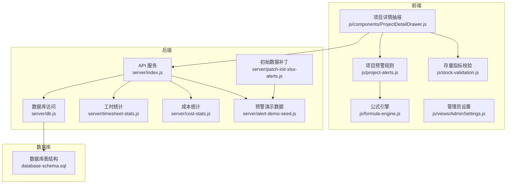
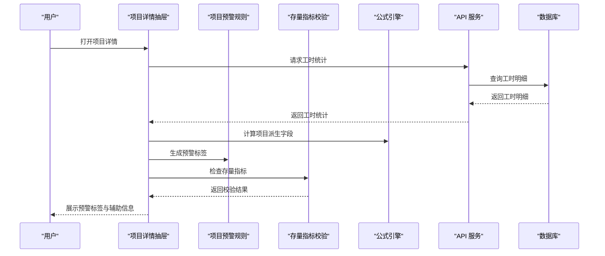
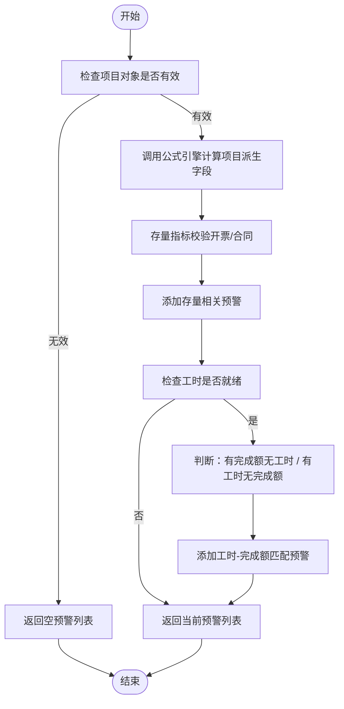
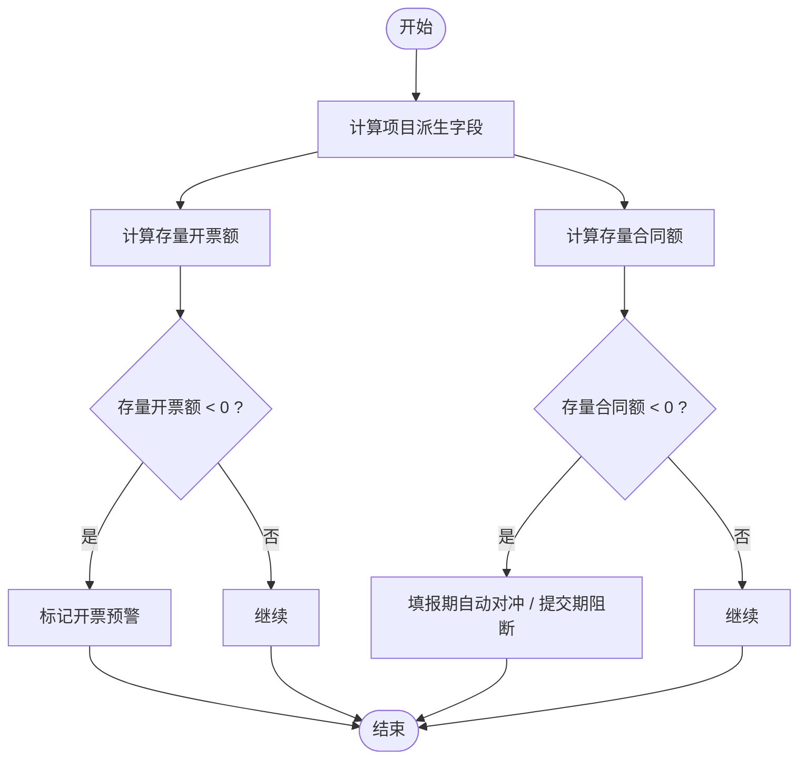
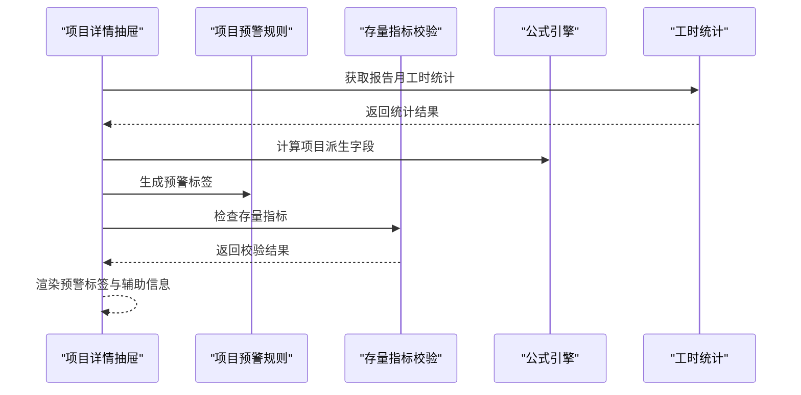
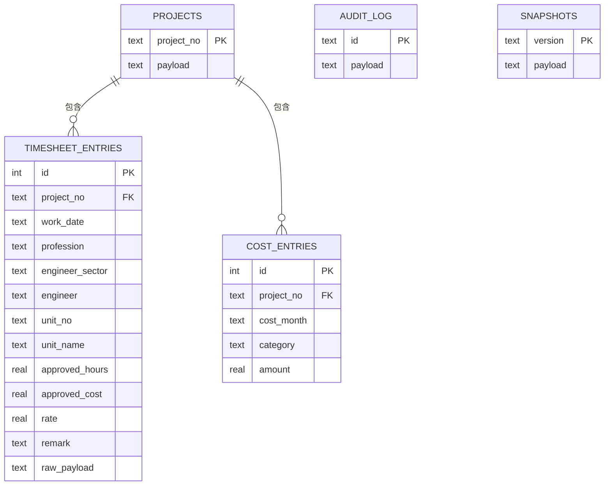
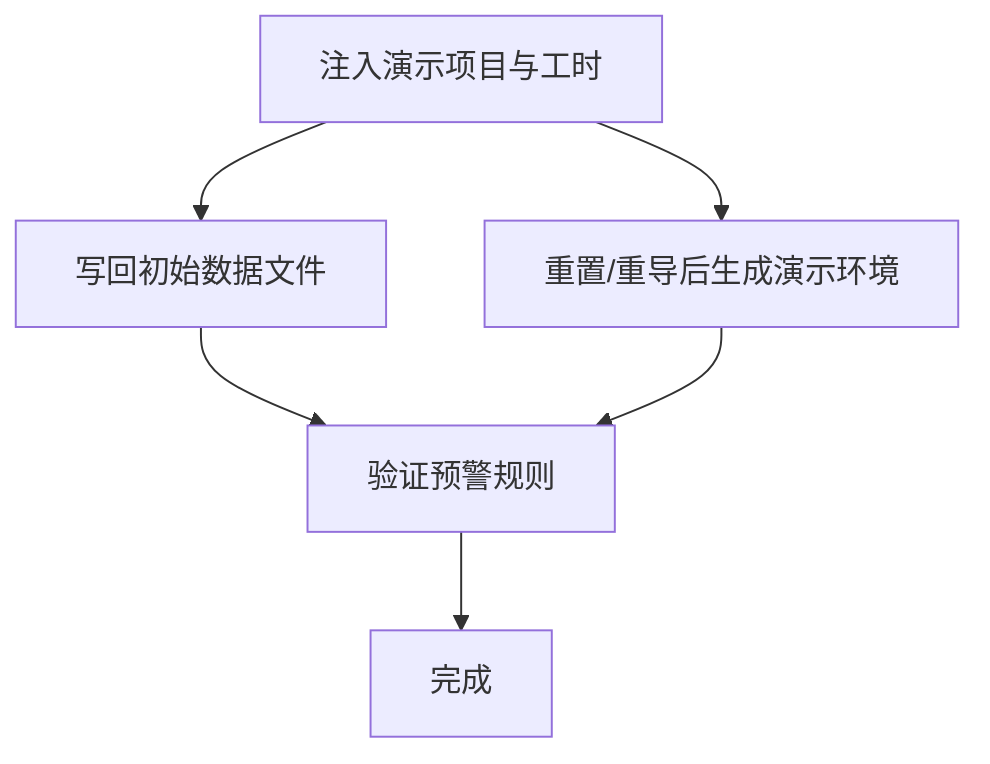
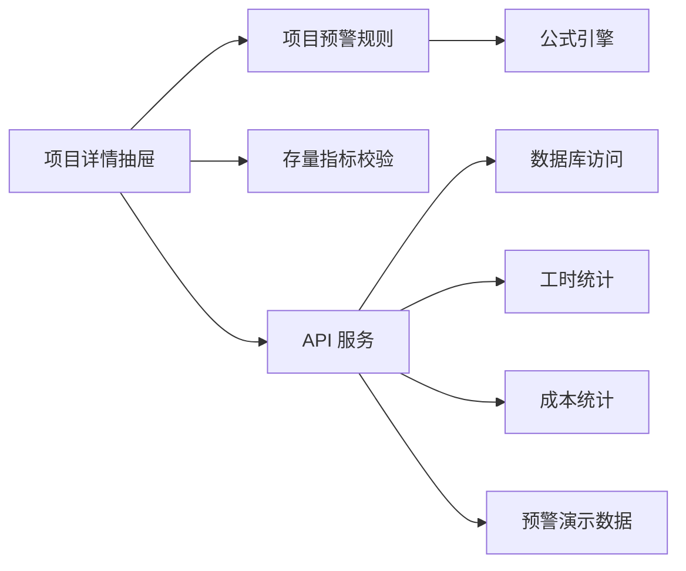

# 项目预警系统

<cite>
**本文档引用的文件**
- [js/project-alerts.js](file://js/project-alerts.js)
- [js/stock-validation.js](file://js/stock-validation.js)
- [js/formula-engine.js](file://js/formula-engine.js)
- [js/components/ProjectDetailDrawer.js](file://js/components/ProjectDetailDrawer.js)
- [js/views/AdminSettings.js](file://js/views/AdminSettings.js)
- [server/db.js](file://server/db.js)
- [server/index.js](file://server/index.js)
- [server/alert-demo-seed.js](file://server/alert-demo-seed.js)
- [server/patch-init-xlsx-alerts.js](file://server/patch-init-xlsx-alerts.js)
- [server/timesheet-stats.js](file://server/timesheet-stats.js)
- [server/cost-stats.js](file://server/cost-stats.js)
- [database-schema.sql](file://database-schema.sql)
- [package.json](file://package.json)
</cite>

## 目录
1. [简介](#简介)
2. [项目结构](#项目结构)
3. [核心组件](#核心组件)
4. [架构概览](#架构概览)
5. [详细组件分析](#详细组件分析)
6. [依赖关系分析](#依赖关系分析)
7. [性能考量](#性能考量)
8. [故障排查指南](#故障排查指南)
9. [结论](#结论)
10. [附录](#附录)

## 简介
本项目预警系统围绕“项目追踪表线上化”平台构建，旨在通过前端实时计算与后端数据库支撑，实现对项目财务指标异常、进度与工时不匹配等风险的自动识别与可视化提示。系统采用“前端规则 + 后端数据”的组合策略：前端根据公式引擎计算结果与工时统计进行阈值判断，后端提供项目、工时、成本等数据存储与查询能力，并通过审计日志与快照机制保障可追溯性。

预警系统主要包含以下能力：
- 实时监控：在项目详情抽屉中基于当前报告月与工时统计即时生成预警标签
- 阈值判断：基于财务指标（存量合同额、存量开票额）与工时-完成额匹配度进行判断
- 可视化呈现：在项目详情抽屉顶部以标签形式展示预警信息
- 演示与初始化：提供预警演示数据注入与初始数据补丁工具
- 集成与扩展：与项目数据、工时统计、成本统计、审计日志等模块深度集成

## 项目结构
预警系统涉及前后端多模块协作：
- 前端模块
  - 项目预警规则：js/project-alerts.js
  - 存量指标校验：js/stock-validation.js
  - 公式引擎：js/formula-engine.js
  - 项目详情抽屉：js/components/ProjectDetailDrawer.js
  - 管理员设置：js/views/AdminSettings.js
- 后端模块
  - 数据库访问：server/db.js
  - API 服务：server/index.js
  - 预警演示数据：server/alert-demo-seed.js
  - 初始数据补丁：server/patch-init-xlsx-alerts.js
  - 工时统计：server/timesheet-stats.js
  - 成本统计：server/cost-stats.js
- 数据库与脚本
  - 数据库表结构：database-schema.sql
  - 项目启动与脚本：package.json

**图表来源**
- [js/project-alerts.js:1-143](file://js/project-alerts.js#L1-L143)
- [js/stock-validation.js:1-181](file://js/stock-validation.js#L1-L181)
- [js/formula-engine.js:1-105](file://js/formula-engine.js#L1-L105)
- [js/components/ProjectDetailDrawer.js:1-846](file://js/components/ProjectDetailDrawer.js#L1-L846)
- [server/index.js:1-200](file://server/index.js#L1-L200)
- [server/db.js:1-525](file://server/db.js#L1-L525)
- [server/timesheet-stats.js:1-86](file://server/timesheet-stats.js#L1-L86)
- [server/cost-stats.js:1-81](file://server/cost-stats.js#L1-L81)
- [server/alert-demo-seed.js:1-176](file://server/alert-demo-seed.js#L1-L176)
- [server/patch-init-xlsx-alerts.js:1-125](file://server/patch-init-xlsx-alerts.js#L1-L125)
- [database-schema.sql:1-286](file://database-schema.sql#L1-L286)

**章节来源**
- [js/project-alerts.js:1-143](file://js/project-alerts.js#L1-L143)
- [js/stock-validation.js:1-181](file://js/stock-validation.js#L1-L181)
- [js/formula-engine.js:1-105](file://js/formula-engine.js#L1-L105)
- [js/components/ProjectDetailDrawer.js:1-846](file://js/components/ProjectDetailDrawer.js#L1-L846)
- [server/index.js:1-200](file://server/index.js#L1-L200)
- [server/db.js:1-525](file://server/db.js#L1-L525)
- [server/timesheet-stats.js:1-86](file://server/timesheet-stats.js#L1-L86)
- [server/cost-stats.js:1-81](file://server/cost-stats.js#L1-L81)
- [server/alert-demo-seed.js:1-176](file://server/alert-demo-seed.js#L1-L176)
- [server/patch-init-xlsx-alerts.js:1-125](file://server/patch-init-xlsx-alerts.js#L1-L125)
- [database-schema.sql:1-286](file://database-schema.sql#L1-L286)

## 核心组件
- 项目预警规则（js/project-alerts.js）
  - 提供月度完成额、已审工时、已审成本的提取函数
  - 基于阈值判断生成“有完成额无工时”“有工时无完成额”两类预警
  - 提供预警辅助信息（合同总额、累计完成、当月工时/成本、工时是否就绪）
- 存量指标校验（js/stock-validation.js）
  - 基于公式引擎计算结果，判断“存量开票额”“存量合同额”是否为负
  - 提供填报期自动对冲与提交期阻断逻辑
- 公式引擎（js/formula-engine.js）
  - 计算项目派生字段，包括累计完成、累计开票、累计回款、WIP、应收账款等
  - 为预警规则提供基础数据
- 项目详情抽屉（js/components/ProjectDetailDrawer.js）
  - 在抽屉头部展示项目预警标签
  - 按月聚焦时提供完成额填报辅助信息
- API 服务与数据库（server/index.js、server/db.js）
  - 提供项目、工时、成本数据查询接口
  - 提供审计日志与快照管理接口
- 预警演示与初始数据补丁（server/alert-demo-seed.js、server/patch-init-xlsx-alerts.js）
  - 注入演示项目与工时数据，验证预警规则
  - 将演示字段写回初始数据文件

**章节来源**
- [js/project-alerts.js:1-143](file://js/project-alerts.js#L1-L143)
- [js/stock-validation.js:1-181](file://js/stock-validation.js#L1-L181)
- [js/formula-engine.js:1-105](file://js/formula-engine.js#L1-L105)
- [js/components/ProjectDetailDrawer.js:1-846](file://js/components/ProjectDetailDrawer.js#L1-L846)
- [server/index.js:140-168](file://server/index.js#L140-L168)
- [server/db.js:415-480](file://server/db.js#L415-L480)

## 架构概览
预警系统采用“前端规则 + 后端数据”的架构：
- 前端负责规则计算与界面展示：项目详情抽屉调用项目预警规则与存量指标校验，结合公式引擎计算结果与工时统计生成预警标签
- 后端负责数据存储与查询：提供项目、工时、成本、审计日志、快照等接口
- 数据库层提供项目主表、工时明细、成本明细、审计日志、快照等表结构

**图表来源**
- [js/components/ProjectDetailDrawer.js:427-452](file://js/components/ProjectDetailDrawer.js#L427-L452)
- [js/project-alerts.js:65-89](file://js/project-alerts.js#L65-L89)
- [js/stock-validation.js:47-61](file://js/stock-validation.js#L47-L61)
- [js/formula-engine.js:19-83](file://js/formula-engine.js#L19-L83)
- [server/index.js:140-153](file://server/index.js#L140-L153)
- [server/db.js:415-437](file://server/db.js#L415-L437)

## 详细组件分析

### 项目预警规则组件分析
- 核心函数
  - 月度完成额提取：monthCompletionAmount
  - 已审工时提取：monthApprovedHours
  - 已审成本提取：monthApprovedCost
  - 预警判断：hasCompletionNoHours、hasHoursNoCompletion
  - 预警生成：getProjectAlerts
  - 预警辅助：getCompletionFillAux
- 阈值与精度
  - 金额与工时的极小阈值（EPS_AMOUNT、EPS_HOURS）用于避免浮点误差导致的误判
- 数据来源
  - 项目对象（扁平化字段）
  - 工时统计（按专业/管理归属聚合）

**图表来源**
- [js/project-alerts.js:65-89](file://js/project-alerts.js#L65-L89)
- [js/stock-validation.js:47-61](file://js/stock-validation.js#L47-L61)
- [js/formula-engine.js:19-83](file://js/formula-engine.js#L19-L83)

**章节来源**
- [js/project-alerts.js:1-143](file://js/project-alerts.js#L1-L143)

### 存量指标校验组件分析
- 核心指标
  - 存量开票额：总合同额 - 累计开票
  - 存量合同额：总合同额 - 累计完成
- 规则逻辑
  - 开票负值：预警
  - 合同负值：违规（填报期可自动对冲，提交期阻断）
- 自动对冲与提交阻断
  - 填报开放期：将报告月完成额调减使合同存量归零
  - 提交期：若合同存量为负，阻止提交并提示调整

**图表来源**
- [js/stock-validation.js:39-61](file://js/stock-validation.js#L39-L61)
- [js/stock-validation.js:75-106](file://js/stock-validation.js#L75-L106)
- [js/stock-validation.js:131-149](file://js/stock-validation.js#L131-L149)

**章节来源**
- [js/stock-validation.js:1-181](file://js/stock-validation.js#L1-L181)

### 项目详情抽屉与预警展示
- 预警展示位置：抽屉头部“项目预警”区域
- 数据来源：getProjectAlerts 返回的预警标签集合
- 辅助信息：完成额填报辅助（合同总额、累计完成、当月工时/成本、工时是否就绪）

**图表来源**
- [js/components/ProjectDetailDrawer.js:152-172](file://js/components/ProjectDetailDrawer.js#L152-L172)
- [js/components/ProjectDetailDrawer.js:427-452](file://js/components/ProjectDetailDrawer.js#L427-L452)
- [js/project-alerts.js:65-89](file://js/project-alerts.js#L65-L89)
- [js/stock-validation.js:47-61](file://js/stock-validation.js#L47-L61)

**章节来源**
- [js/components/ProjectDetailDrawer.js:531-543](file://js/components/ProjectDetailDrawer.js#L531-L543)
- [js/components/ProjectDetailDrawer.js:152-172](file://js/components/ProjectDetailDrawer.js#L152-L172)

### API 与数据库集成
- 工时统计接口
  - GET /api/projects/:projectNo/timesheet?year=YYYY
  - 返回按专业/管理归属聚合的工时统计
- 成本统计接口
  - GET /api/projects/:projectNo/cost-center?year=YYYY
  - 返回按成本中心分类的统计
- 审计日志接口
  - POST /api/audit：写入审计日志
- 数据库表结构
  - 项目主表、工时明细、成本明细、审计日志、快照等

**图表来源**
- [database-schema.sql:12-87](file://database-schema.sql#L12-L87)
- [database-schema.sql:96-196](file://database-schema.sql#L96-L196)
- [database-schema.sql:202-223](file://database-schema.sql#L202-L223)
- [database-schema.sql:229-249](file://database-schema.sql#L229-L249)
- [database-schema.sql:251-273](file://database-schema.sql#L251-L273)
- [database-schema.sql:276-286](file://database-schema.sql#L276-L286)

**章节来源**
- [server/index.js:140-168](file://server/index.js#L140-L168)
- [server/db.js:33-57](file://server/db.js#L33-L57)
- [server/db.js:415-480](file://server/db.js#L415-L480)

### 预警演示与初始数据补丁
- 演示场景
  - 存量开票额为负
  - 存量合同额为负
  - 有完成额无工时
  - 有工时无完成额
- 数据注入
  - 通过 server/alert-demo-seed.js 修改项目字段并重算公式
  - 通过 server/patch-init-xlsx-alerts.js 将演示字段写回初始数据文件
- 脚本入口
  - package.json 中提供 patch:init-alerts 脚本

**图表来源**
- [server/alert-demo-seed.js:40-78](file://server/alert-demo-seed.js#L40-L78)
- [server/alert-demo-seed.js:141-169](file://server/alert-demo-seed.js#L141-L169)
- [server/patch-init-xlsx-alerts.js:35-125](file://server/patch-init-xlsx-alerts.js#L35-L125)
- [package.json](file://package.json#L9)

**章节来源**
- [server/alert-demo-seed.js:1-176](file://server/alert-demo-seed.js#L1-L176)
- [server/patch-init-xlsx-alerts.js:1-125](file://server/patch-init-xlsx-alerts.js#L1-L125)
- [package.json](file://package.json#L9)

## 依赖关系分析
- 前端依赖
  - 项目预警规则依赖公式引擎与工时统计
  - 项目详情抽屉依赖项目预警规则与存量指标校验
- 后端依赖
  - API 服务依赖数据库访问与统计模块
  - 预警演示依赖公式引擎与数据库访问
- 数据库依赖
  - 工时明细与成本明细为统计与预警提供数据基础

**图表来源**
- [js/components/ProjectDetailDrawer.js:152-172](file://js/components/ProjectDetailDrawer.js#L152-L172)
- [js/project-alerts.js:65-89](file://js/project-alerts.js#L65-L89)
- [js/stock-validation.js:47-61](file://js/stock-validation.js#L47-L61)
- [js/formula-engine.js:19-83](file://js/formula-engine.js#L19-L83)
- [server/index.js:140-168](file://server/index.js#L140-L168)
- [server/db.js:415-480](file://server/db.js#L415-L480)
- [server/timesheet-stats.js:60-80](file://server/timesheet-stats.js#L60-L80)
- [server/cost-stats.js:20-76](file://server/cost-stats.js#L20-L76)
- [server/alert-demo-seed.js:40-78](file://server/alert-demo-seed.js#L40-L78)

**章节来源**
- [js/components/ProjectDetailDrawer.js:1-846](file://js/components/ProjectDetailDrawer.js#L1-L846)
- [js/project-alerts.js:1-143](file://js/project-alerts.js#L1-L143)
- [js/stock-validation.js:1-181](file://js/stock-validation.js#L1-L181)
- [js/formula-engine.js:1-105](file://js/formula-engine.js#L1-L105)
- [server/index.js:140-168](file://server/index.js#L140-L168)
- [server/db.js:1-525](file://server/db.js#L1-L525)
- [server/timesheet-stats.js:1-86](file://server/timesheet-stats.js#L1-L86)
- [server/cost-stats.js:1-81](file://server/cost-stats.js#L1-L81)
- [server/alert-demo-seed.js:1-176](file://server/alert-demo-seed.js#L1-L176)

## 性能考量
- 前端计算
  - 项目预警规则与存量指标校验均为轻量计算，阈值判断复杂度低
  - 工时统计按月聚合，避免全量扫描
- 后端查询
  - 工时明细与成本明细均建立索引，查询效率较高
  - 统计模块按年过滤，减少无关数据处理
- 数据库事务
  - 批量写入使用事务，确保一致性与性能
- 建议
  - 控制报告月数据规模，避免过长的历史数据影响渲染
  - 合理使用缓存（如工时统计结果），减少重复请求

[本节为通用性能建议，不直接分析具体文件]

## 故障排查指南
- 预警标签不显示
  - 检查项目详情抽屉是否正确请求工时统计接口
  - 确认公式引擎计算结果是否正常
- 预警阈值误判
  - 检查 EPS_AMOUNT 与 EPS_HOURS 阈值是否合理
  - 确认工时统计是否为空或缺失
- 存量指标异常
  - 检查公式引擎是否正确计算“存量开票额/存量合同额”
  - 确认填报期自动对冲是否生效
- 数据库问题
  - 检查工时明细与成本明细是否存在
  - 确认审计日志与快照是否正常写入

**章节来源**
- [js/components/ProjectDetailDrawer.js:427-452](file://js/components/ProjectDetailDrawer.js#L427-L452)
- [js/project-alerts.js:7-8](file://js/project-alerts.js#L7-L8)
- [js/stock-validation.js:17-18](file://js/stock-validation.js#L17-L18)
- [server/db.js:415-480](file://server/db.js#L415-L480)

## 结论
项目预警系统通过前端规则与后端数据的协同，实现了对财务指标异常与进度-工时不匹配等风险的实时识别与可视化提示。系统具备良好的可扩展性与可维护性，能够随着业务需求演进而逐步完善预警规则与阈值配置。通过审计日志与快照机制，系统提供了完整的数据可追溯能力，有助于风险控制与决策支持。

[本节为总结性内容，不直接分析具体文件]

## 附录
- 预警规则设计要点
  - 使用极小阈值避免浮点误差
  - 将“有完成额无工时”“有工时无完成额”两类异常纳入预警
  - 结合存量指标（开票/合同）进行综合判断
- 预警触发机制
  - 实时监控：项目详情抽屉打开时触发
  - 数据驱动：基于公式引擎计算结果与工时统计
- 预警消息与展示
  - 以标签形式在抽屉头部展示
  - 提供完成额填报辅助信息
- 与项目数据集成
  - 通过 API 获取工时与成本统计
  - 通过公式引擎计算派生字段
- 配置与管理
  - 通过管理员设置调整周期与锁定状态
  - 通过演示脚本注入测试数据
- 应用场景
  - 风险控制：及时发现财务与进度异常
  - 决策支持：为管理层提供数据依据
  - 问题预防：通过阈值与自动对冲降低风险

[本节为概念性内容，不直接分析具体文件]