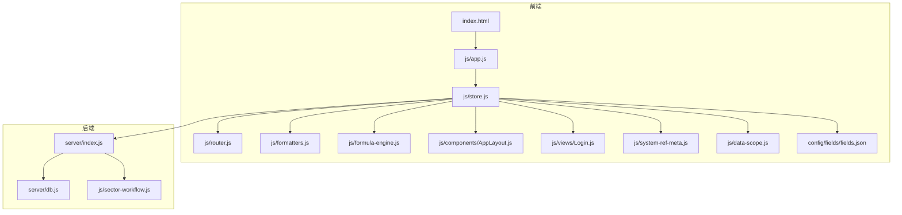
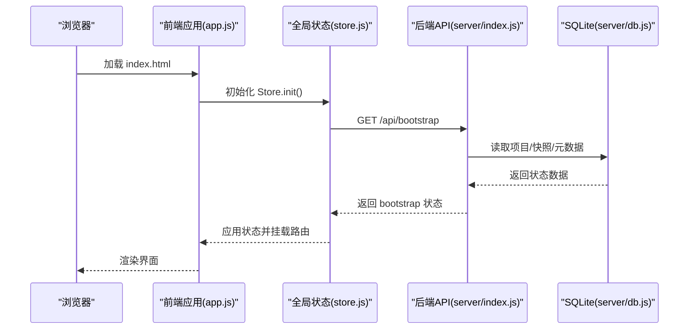
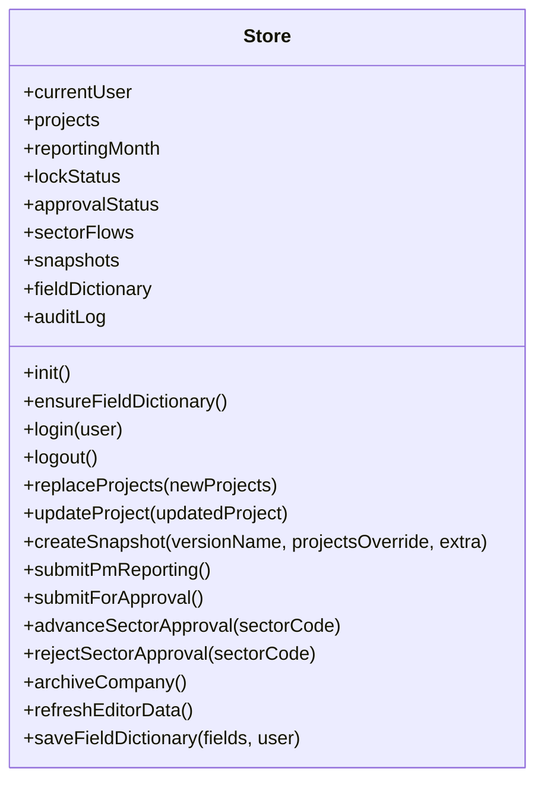
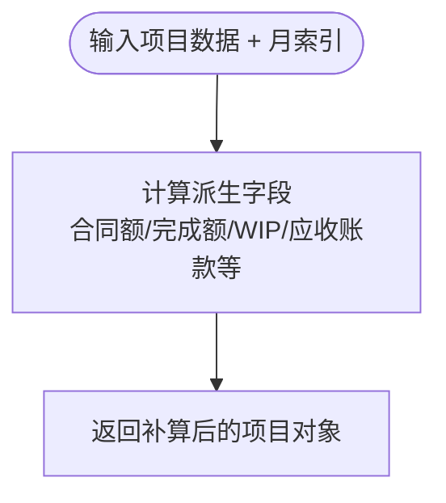
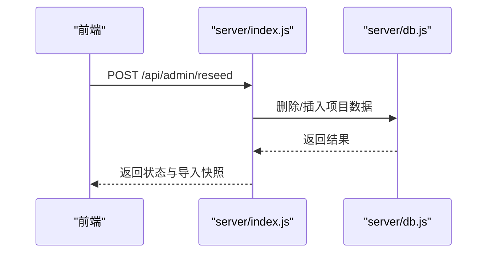
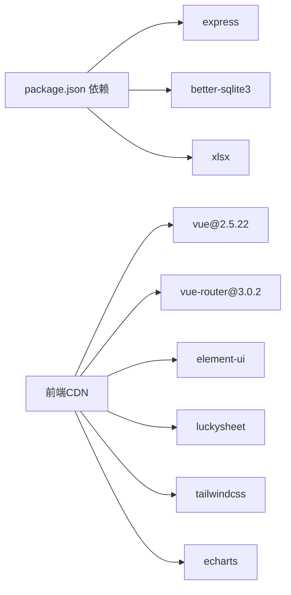

# 开发指南

<cite>
**本文引用的文件**
- [package.json](file://package.json)
- [技术栈与开发规范.md](file://docs/需求文档/技术栈与开发规范.md)
- [app.js](file://js/app.js)
- [store.js](file://js/store.js)
- [router.js](file://js/router.js)
- [formatters.js](file://js/formatters.js)
- [formula-engine.js](file://js/formula-engine.js)
- [AppLayout.js](file://js/components/AppLayout.js)
- [Login.js](file://js/views/Login.js)
- [db.js](file://server/db.js)
- [index.js](file://server/index.js)
- [sector-workflow.js](file://js/sector-workflow.js)
- [system-ref-meta.js](file://js/system-ref-meta.js)
- [data-scope.js](file://js/data-scope.js)
- [fields.json](file://config/fields/fields.json)
- [snapshot-change-log.test.js](file://test/snapshot-change-log.test.js)
</cite>

## 目录
1. [简介](#简介)
2. [项目结构](#项目结构)
3. [核心组件](#核心组件)
4. [架构总览](#架构总览)
5. [详细组件分析](#详细组件分析)
6. [依赖关系分析](#依赖关系分析)
7. [性能考量](#性能考量)
8. [故障排查指南](#故障排查指南)
9. [结论](#结论)
10. [附录](#附录)

## 简介
本开发指南面向参与“项目执行追踪平台”的开发者，提供从代码风格、命名约定、注释标准，到开发流程、分支管理、代码评审与合并策略的完整规范；同时涵盖项目结构组织、模块划分、依赖管理原则，以及调试技巧、性能优化、错误处理模式，并给出开发工具配置、IDE 设置与插件推荐，帮助团队高效协作、持续交付高质量产品。

## 项目结构
项目采用“前端静态 + Node/Express 后端 + SQLite 存储”的轻量级架构，不依赖构建工具，所有前端依赖通过 CDN 引入，部署简单，便于企业内部快速迭代。

**图表来源**
- [index.js:1-775](file://server/index.js#L1-L775)
- [db.js:1-525](file://server/db.js#L1-L525)
- [app.js:1-47](file://js/app.js#L1-L47)
- [store.js:1-602](file://js/store.js#L1-L602)
- [router.js:1-137](file://js/router.js#L1-L137)
- [formatters.js:1-167](file://js/formatters.js#L1-L167)
- [formula-engine.js:1-105](file://js/formula-engine.js#L1-L105)
- [AppLayout.js:1-240](file://js/components/AppLayout.js#L1-L240)
- [Login.js:1-215](file://js/views/Login.js#L1-L215)
- [system-ref-meta.js:1-171](file://js/system-ref-meta.js#L1-L171)
- [data-scope.js:1-73](file://js/data-scope.js#L1-L73)
- [fields.json:1-1101](file://config/fields/fields.json#L1-L1101)

**章节来源**
- [技术栈与开发规范.md:1-144](file://docs/需求文档/技术栈与开发规范.md#L1-L144)
- [package.json:1-19](file://package.json#L1-L19)

## 核心组件
- 前端应用入口与初始化：负责挂载 Vue 实例、注册全局过滤器、引导状态初始化与错误兜底。
- 全局状态管理：集中管理业务数据、工作流状态、快照、字段字典、审计日志等，并与后端 API 交互。
- 路由与导航：基于角色的路由守卫与页面权限控制，支持多角色访问限制。
- 格式化与公式引擎：统一金额/百分比/日期/布尔等格式化输出，以及项目字段计算引擎。
- 组件与视图：主布局、登录页、审批/编辑/审计/管理等页面。
- 后端服务：基于 Express 的 API 服务，SQLite 数据持久化，工作流与快照管理。
- 字段字典：前后端共享的字段元数据，支撑表头配置与系统引用列。

**章节来源**
- [app.js:1-47](file://js/app.js#L1-L47)
- [store.js:1-602](file://js/store.js#L1-L602)
- [router.js:1-137](file://js/router.js#L1-L137)
- [formatters.js:1-167](file://js/formatters.js#L1-L167)
- [formula-engine.js:1-105](file://js/formula-engine.js#L1-L105)
- [AppLayout.js:1-240](file://js/components/AppLayout.js#L1-L240)
- [Login.js:1-215](file://js/views/Login.js#L1-L215)
- [index.js:1-775](file://server/index.js#L1-L775)
- [db.js:1-525](file://server/db.js#L1-L525)
- [fields.json:1-1101](file://config/fields/fields.json#L1-L1101)

## 架构总览
系统采用“前端单页应用 + 后端 REST API + SQLite”三层架构，前端通过 fetch 与后端通信，后端负责数据持久化与业务规则执行，字段字典与工作流状态贯穿前后端。

**图表来源**
- [app.js:1-47](file://js/app.js#L1-L47)
- [store.js:268-275](file://js/store.js#L268-L275)
- [index.js:91-100](file://server/index.js#L91-L100)
- [db.js:194-266](file://server/db.js#L194-L266)

## 详细组件分析

### 前端应用入口与初始化
- 职责：注册全局过滤器、初始化 Store、在初始化失败时渲染错误提示。
- 关键点：错误兜底提示包含命令与步骤，引导本地启动与数据导入。

**章节来源**
- [app.js:1-47](file://js/app.js#L1-L47)

### 全局状态管理（Store）
- 职责：集中管理业务数据、工作流状态、快照、字段字典、审计日志；封装与后端 API 的交互；提供便捷方法（如提交、归档、刷新数据等）。
- 设计要点：
  - 使用 Vue.observable 维护响应式状态。
  - 通过 apiFetch 统一处理请求与错误。
  - 字段字典加载顺序：优先 /api/fields，其次 /api/admin/fields，再回退到静态文件或 window.FIELD_DICTIONARY。
  - 与工作流、审批、快照、PM 提交流程紧密耦合。

**图表来源**
- [store.js:97-601](file://js/store.js#L97-L601)

**章节来源**
- [store.js:1-602](file://js/store.js#L1-L602)

### 路由与导航守卫
- 职责：基于角色的页面访问控制，公开页面与需要认证页面区分，管理员/审计/字段配置等页面仅系统管理员可访问。
- 设计要点：通过 meta 字段声明页面属性，beforeEach 中统一校验。

**章节来源**
- [router.js:1-137](file://js/router.js#L1-L137)

### 格式化与公式引擎
- 格式化工具：统一金额、百分比、日期、布尔、税务等格式化输出，支持解析输入与缩写展示。
- 公式引擎：根据报告月份索引计算项目派生字段，包括合同额、完成额、WIP、应收账款等。

**图表来源**
- [formula-engine.js:19-83](file://js/formula-engine.js#L19-L83)

**章节来源**
- [formatters.js:1-167](file://js/formatters.js#L1-L167)
- [formula-engine.js:1-105](file://js/formula-engine.js#L1-L105)

### 组件与视图
- 主布局：侧边栏、顶栏、角色信息、周期状态、重置为初始状态等。
- 登录页：角色选择与用户选择，支持演示用户与角色权限注入。

**章节来源**
- [AppLayout.js:1-240](file://js/components/AppLayout.js#L1-L240)
- [Login.js:1-215](file://js/views/Login.js#L1-L215)

### 后端服务与数据层
- 服务端点：提供 bootstrap、字段字典、项目 CRUD、工时/成本导入、PM 提交、板块审批、公司归档、审计日志、平台同步等接口。
- 数据层：SQLite 表结构（projects、audit_log、snapshots、meta、timesheet_entries、cost_entries），提供元数据、锁定期、工作流状态、快照维护等方法。

**图表来源**
- [index.js:492-516](file://server/index.js#L492-L516)
- [db.js:268-278](file://server/db.js#L268-L278)

**章节来源**
- [index.js:1-775](file://server/index.js#L1-L775)
- [db.js:1-525](file://server/db.js#L1-L525)

### 字段字典与系统引用元数据
- 字段字典：前后端共享的字段元数据，支撑表头配置与系统引用列显示/覆盖。
- 系统引用元数据：管理 _system_ref/_system_override，支持覆盖显示值与评论提示。

**章节来源**
- [fields.json:1-1101](file://config/fields/fields.json#L1-L1101)
- [system-ref-meta.js:1-171](file://js/system-ref-meta.js#L1-L171)

### 工作流与数据范围
- 工作流：板块审批流（草稿/初审/终审）、状态迁移、归档条件等。
- 数据范围：针对经营管理（只读）角色按公司/板块/项目群维度过滤数据。

**章节来源**
- [sector-workflow.js:1-180](file://js/sector-workflow.js#L1-L180)
- [data-scope.js:1-73](file://js/data-scope.js#L1-L73)

## 依赖关系分析
- 前端依赖：Vue 2、Vue Router、Element UI、Luckysheet、Tailwind CSS、ECharts 通过 CDN 引入。
- 后端依赖：Express、better-sqlite3、xlsx。
- 项目脚本：启动服务、测试、字段同步、初始化导出等。

**图表来源**
- [package.json:13-17](file://package.json#L13-L17)
- [技术栈与开发规范.md:36-46](file://docs/需求文档/技术栈与开发规范.md#L36-L46)

**章节来源**
- [package.json:1-19](file://package.json#L1-L19)
- [技术栈与开发规范.md:1-144](file://docs/需求文档/技术栈与开发规范.md#L1-L144)

## 性能考量
- 前端性能
  - 使用 CDN 引入第三方库，减少打包体积与构建复杂度。
  - 通过 Vue.observable 降低不必要的响应式开销，合理拆分组件。
  - 图表与表格组件按需渲染，避免一次性加载大量数据。
- 后端性能
  - SQLite 使用 WAL 模式提升并发写入性能。
  - 为 timesheet_entries、cost_entries 建立索引，加速查询。
  - 控制审计日志数量上限，避免内存膨胀。
- 数据一致性
  - 字段字典加载顺序与回退策略确保前端稳定可用。
  - 快照版本与变更日志在导入/归档过程中保持累积。

[本节为通用指导，无需具体文件引用]

## 故障排查指南
- 启动与数据导入
  - 若初始化失败，检查是否存在“初始数据.xlsx”，并确认服务端已正确读取与导入。
  - 查看服务端日志中的“未找到初始化 xlsx”提示。
- 字段字典加载失败
  - 确认 /api/fields 或 /api/admin/fields 可用，或静态 fields.json/fields-data.js 可访问。
  - Store.init() 中对字段字典加载失败会抛出错误，需重启服务并确认文件存在。
- 审计与日志
  - 审计日志最多保留 500 条，超出则截断。
- 测试用例
  - 快照变更日志在 D/J 版本中应被保留，I 版本导入时应清空临时字段变更日志。

**章节来源**
- [index.js:30-65](file://server/index.js#L30-L65)
- [store.js:268-275](file://js/store.js#L268-L275)
- [db.js:319-321](file://server/db.js#L319-L321)
- [snapshot-change-log.test.js:33-58](file://test/snapshot-change-log.test.js#L33-L58)

## 结论
本项目以“轻量级、低门槛、可运维”为目标，前端通过 CDN 快速集成，后端以 Express + SQLite 提供稳定的数据与业务能力。遵循本文的开发规范与最佳实践，可确保代码质量、协作效率与系统稳定性，满足企业内部快速迭代的需求。

[本节为总结，无需具体文件引用]

## 附录

### 代码风格规范与命名约定
- 文件命名
  - 前端模块：采用驼峰命名，如 AppLayout.js、Login.js、store.js、router.js、formatters.js、formula-engine.js。
  - 后端模块：采用小写加下划线，如 db.js、index.js、sector-workflow.js。
- 函数与变量
  - 前端：函数与变量采用 camelCase；常量采用 UPPER_SNAKE_CASE（如系统常量）。
  - 后端：函数与变量采用 camelCase；常量采用 UPPER_SNAKE_CASE（如数据库路径）。
- 类与模块
  - 前端模块以 IIFE 包裹，导出到 window 对象；模块名与文件名一致。
  - 后端模块以 module.exports 导出，文件名与导出对象名一致。
- 注释
  - 模块头部添加简要说明与作者信息。
  - 复杂函数/算法添加参数说明、返回值与注意事项。
  - 重要业务逻辑添加注释，解释状态流转与边界条件。

**章节来源**
- [AppLayout.js:1-4](file://js/components/AppLayout.js#L1-L4)
- [Login.js:1-4](file://js/views/Login.js#L1-L4)
- [store.js:1-6](file://js/store.js#L1-L6)
- [router.js:1-4](file://js/router.js#L1-L4)
- [formatters.js:1-6](file://js/formatters.js#L1-L6)
- [formula-engine.js:1-6](file://js/formula-engine.js#L1-L6)
- [db.js:1-6](file://server/db.js#L1-L6)
- [index.js:1-6](file://server/index.js#L1-L6)

### 注释标准
- 模块注释：说明模块职责、依赖与使用注意。
- 函数注释：参数类型/含义、返回值、异常与边界条件。
- 业务注释：关键状态、流程、字段含义与计算逻辑。

**章节来源**
- [formatters.js:8-167](file://js/formatters.js#L8-L167)
- [formula-engine.js:10-105](file://js/formula-engine.js#L10-L105)
- [sector-workflow.js:1-180](file://js/sector-workflow.js#L1-L180)

### 开发流程与分支管理
- 分支策略
  - main：发布分支，保护规则：禁止直接推送，必须通过 PR 合并。
  - develop：开发分支，每日构建，合并前需通过测试。
  - feature/*：功能开发分支，基于 develop 创建，完成后合并回 develop。
  - hotfix/*：紧急修复分支，基于 main 创建，修复后同时合并回 main 与 develop。
- 提交规范
  - 标题：type(scope): subject
  - 类型：feat/fix/docs/style/refactor/perf/test/build/ci/chore
  - 示例：feat(router): 添加角色权限控制

**章节来源**
- [技术栈与开发规范.md:1-144](file://docs/需求文档/技术栈与开发规范.md#L1-L144)

### 代码审查与合并策略
- PR 规范
  - 必须关联 Issue 或需求文档。
  - 代码需通过本地测试与 ESLint/Prettier 校验。
  - 至少一名 reviewer 通过，方可合并。
- 合并策略
  - Squash merge：保持提交历史整洁。
  - Rebase merge：适用于 hotfix，保证线性历史。

**章节来源**
- [技术栈与开发规范.md:1-144](file://docs/需求文档/技术栈与开发规范.md#L1-L144)

### 依赖管理原则
- 前端依赖：通过 CDN 引入，明确版本号，避免本地 node_modules。
- 后端依赖：使用 package.json 管理，定期更新安全补丁。
- 第三方库：优先选择稳定、社区活跃、文档完善的库。

**章节来源**
- [package.json:13-17](file://package.json#L13-L17)
- [技术栈与开发规范.md:15-17](file://docs/需求文档/技术栈与开发规范.md#L15-L17)

### 调试技巧
- 前端调试
  - 使用 Vue Devtools 检查 Store 状态与组件树。
  - 在浏览器 Network 面板观察 API 请求与响应。
  - 在 Console 输出关键状态与错误信息。
- 后端调试
  - 查看服务端日志，关注初始化、导入、快照与工作流状态。
  - 使用 SQLite 工具查看表结构与数据一致性。

**章节来源**
- [技术栈与开发规范.md:139-143](file://docs/需求文档/技术栈与开发规范.md#L139-L143)
- [index.js:745-775](file://server/index.js#L745-L775)

### 性能优化建议
- 前端
  - 按需加载图表与表格组件，减少首屏渲染压力。
  - 合理缓存 Store 中的静态数据与快照。
- 后端
  - 对高频查询建立索引，避免全表扫描。
  - 控制响应体大小，必要时分页或懒加载。

**章节来源**
- [db.js:48-56](file://server/db.js#L48-L56)

### 错误处理模式
- 前端
  - apiFetch 统一处理 HTTP 错误与 JSON 解析失败，抛出可读错误信息。
  - Store.init() 失败时渲染错误提示，包含启动命令与步骤。
- 后端
  - 所有 API 捕获异常并返回 JSON 错误，避免内部堆栈泄露。

**章节来源**
- [store.js:66-93](file://js/store.js#L66-L93)
- [app.js:30-44](file://js/app.js#L30-L44)
- [index.js:91-100](file://server/index.js#L91-L100)

### 开发工具配置与 IDE 设置
- 编辑器
  - VS Code：启用 ESLint、Prettier 插件，设置保存时自动格式化。
  - 设置 EditorConfig 与 Prettier 规则，统一缩进、换行与引号。
- 浏览器
  - 安装 Vue Devtools，便于调试前端状态与组件。
- 前端依赖
  - 通过 CDN 引入，无需本地安装 node_modules。

**章节来源**
- [技术栈与开发规范.md:139-143](file://docs/需求文档/技术栈与开发规范.md#L139-L143)

### 新功能开发流程
- 需求评审：明确功能目标、数据模型与接口设计。
- 前端开发：新增组件/视图，接入 Store 方法，补充路由与权限控制。
- 后端开发：新增 API 端点，更新数据模型与索引，补充审计日志。
- 字段字典：更新 fields.json，确保前后端一致。
- 测试：补充单元测试与集成测试，验证快照与变更日志。
- 文档：更新设计文档与需求文档，标注版本与变更。

**章节来源**
- [fields.json:1-1101](file://config/fields/fields.json#L1-L1101)
- [snapshot-change-log.test.js:1-59](file://test/snapshot-change-log.test.js#L1-L59)

### 测试要求
- 单元测试：覆盖关键函数（格式化、公式计算、工作流状态）。
- 集成测试：覆盖 API 端点与数据库交互，如快照变更日志保留。
- 端到端测试：模拟角色登录、提交、审批、归档全流程。

**章节来源**
- [snapshot-change-log.test.js:1-59](file://test/snapshot-change-log.test.js#L1-L59)

### 文档编写规范
- 设计文档：说明架构、模块职责、数据流与接口定义。
- 需求文档：记录字段字典、业务规则与流程图。
- API 文档：使用统一的请求/响应格式与状态码说明。

**章节来源**
- [技术栈与开发规范.md:1-144](file://docs/需求文档/技术栈与开发规范.md#L1-L144)

### 代码重构原则与技术债务管理
- 重构原则
  - 保持向后兼容，逐步替换旧实现。
  - 优先处理高风险与高耦合模块。
- 技术债务
  - 建立债务清单，设定偿还计划与优先级。
  - 在 PR 中评估债务影响，避免新增债务。

**章节来源**
- [技术栈与开发规范.md:1-144](file://docs/需求文档/技术栈与开发规范.md#L1-L144)

### 团队协作规范与沟通机制
- 角色分工：明确前端、后端、测试与文档职责。
- 沟通机制：每日站会、需求评审会、代码评审会。
- 文档共享：统一存放于 docs 目录，保持版本控制。

**章节来源**
- [技术栈与开发规范.md:1-144](file://docs/需求文档/技术栈与开发规范.md#L1-L144)