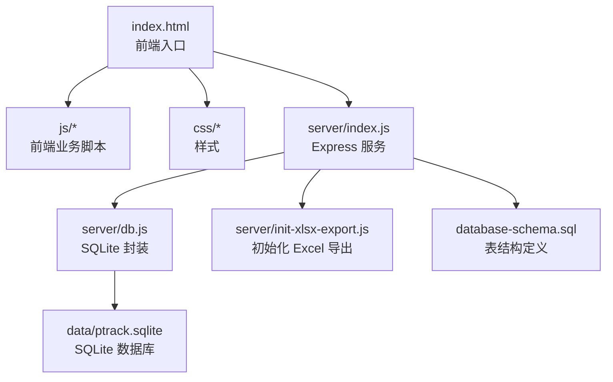
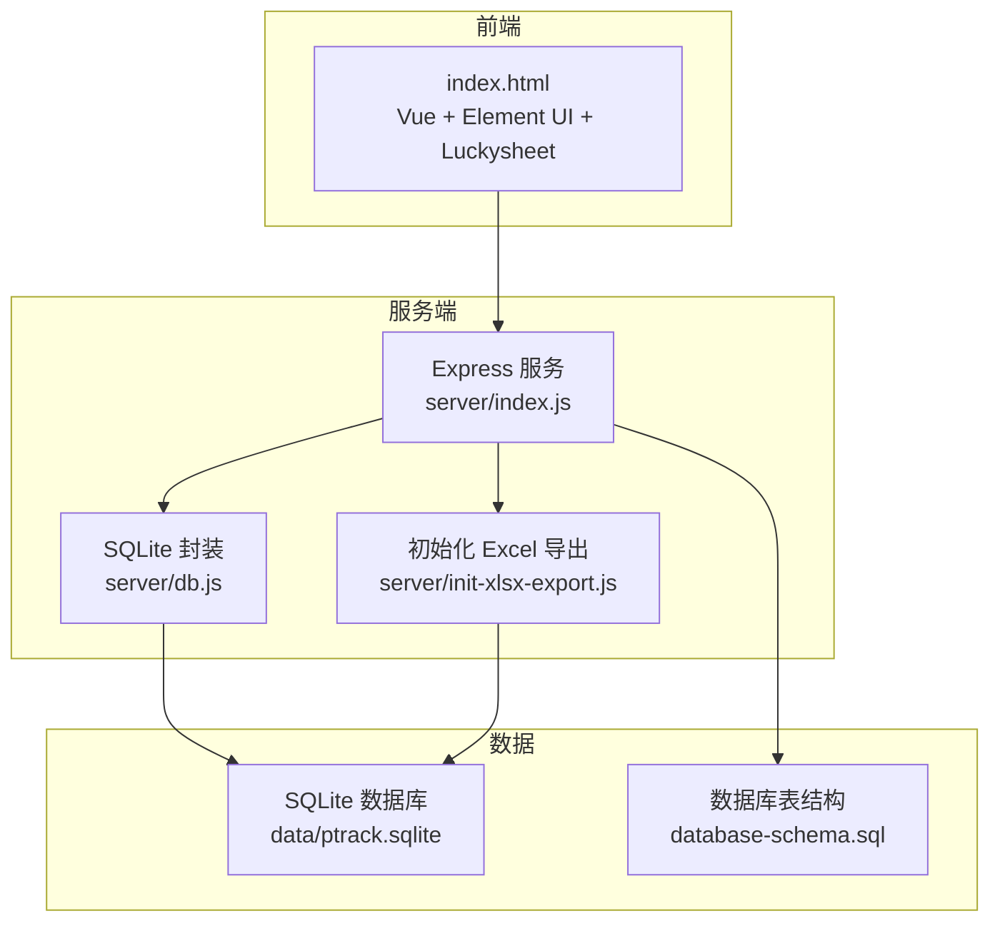
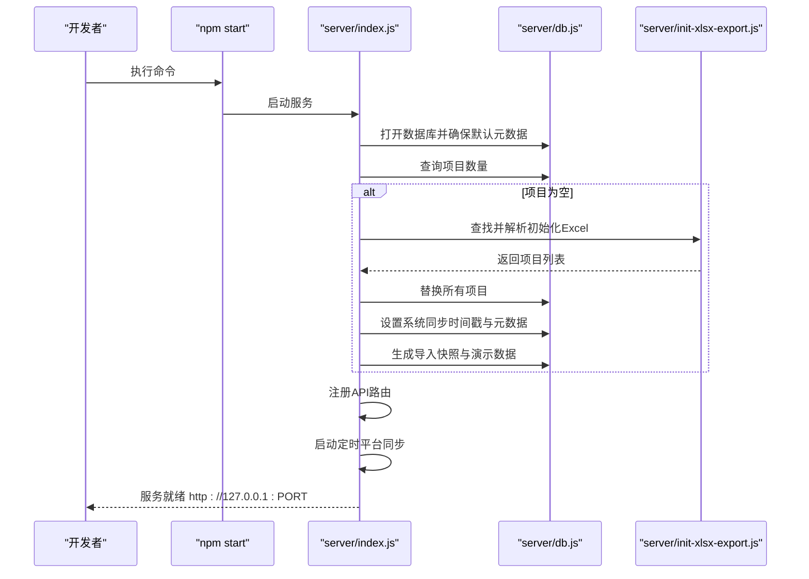
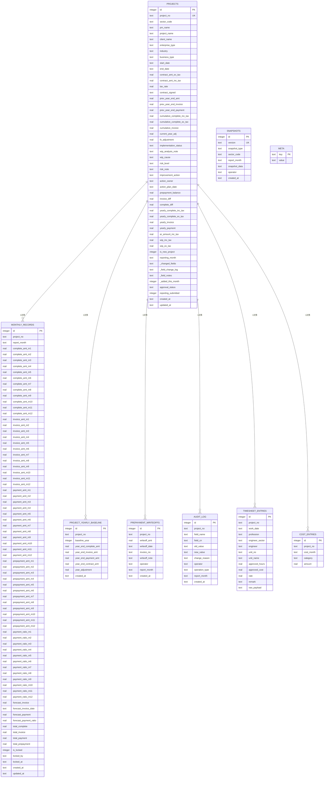
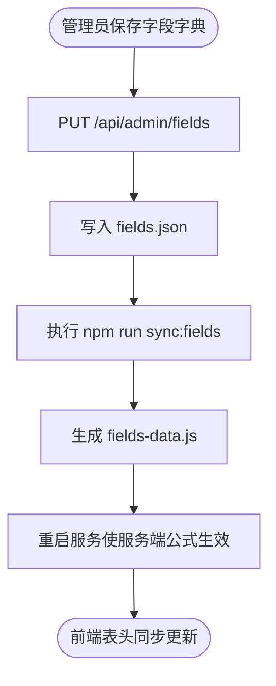
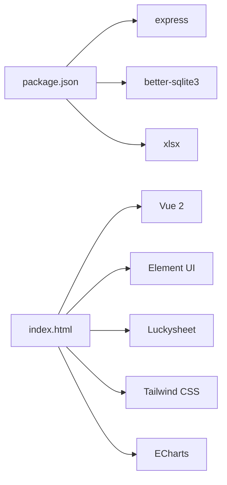

# 快速开始

<cite>
**本文引用的文件**
- [package.json](file://package.json)
- [index.html](file://index.html)
- [server/index.js](file://server/index.js)
- [server/db.js](file://server/db.js)
- [server/init-xlsx-export.js](file://server/init-xlsx-export.js)
- [database-schema.sql](file://database-schema.sql)
- [AGENTS.md](file://AGENTS.md)
- [docs/需求文档/技术栈与开发规范.md](file://docs/需求文档/技术栈与开发规范.md)
</cite>

## 目录
1. [简介](#简介)
2. [项目结构](#项目结构)
3. [核心组件](#核心组件)
4. [架构总览](#架构总览)
5. [详细组件分析](#详细组件分析)
6. [依赖关系分析](#依赖关系分析)
7. [性能考量](#性能考量)
8. [故障排查指南](#故障排查指南)
9. [结论](#结论)
10. [附录](#附录)

## 简介
本项目是“项目执行追踪平台”，基于 Node.js + Express + better-sqlite3 + 前端 CDN 技术栈，提供项目数据的在线填报、审批、统计与展示。项目强调“零构建、零安装成本”的轻量部署方式，通过本地服务启动即可运行，无需复杂的前端打包流程。

- 服务端：Express 提供 REST API，SQLite 作为持久化存储，支持初始化 Excel 导入、快照管理、流程审批、平台数据同步等。
- 前端：通过 CDN 引入 Vue 2、Element UI、Luckysheet 等，双击 index.html 即可运行（需通过本地服务访问）。

## 项目结构
项目采用“前后端分离 + 静态站点 + 本地服务”的组织方式：
- 根目录包含入口页面 index.html、静态资源（css、js）、服务端入口 server/index.js、数据库 schema 等。
- server/ 目录包含 API 服务、数据库封装、快照服务、字段字典、平台同步等模块。
- config/fields/ 包含字段字典的 JSON 定义与运行时镜像。
- docs/ 包含设计与需求文档，便于理解业务与技术规范。

**图表来源**
- [index.html:1-110](file://index.html#L1-L110)
- [server/index.js:1-775](file://server/index.js#L1-L775)
- [server/db.js:1-525](file://server/db.js#L1-L525)
- [server/init-xlsx-export.js:1-112](file://server/init-xlsx-export.js#L1-L112)
- [database-schema.sql:1-286](file://database-schema.sql#L1-L286)

**章节来源**
- [AGENTS.md:1-326](file://AGENTS.md#L1-L326)
- [docs/需求文档/技术栈与开发规范.md:1-144](file://docs/需求文档/技术栈与开发规范.md#L1-L144)

## 核心组件
- 服务端入口：负责启动 Express、加载浏览器脚本、初始化数据库、注册 API 路由、定时同步平台数据等。
- 数据库封装：负责 SQLite 连接、元数据管理、项目数据 CRUD、审计日志、快照管理、工时/成本数据等。
- 初始化 Excel：在数据库为空时，自动查找并导入初始化 Excel，生成 I 版 baseline 快照，并注入演示数据。
- 字段字典：提供字段定义的读写与同步，支撑前端表头配置与服务端公式计算。
- 前端入口：通过 CDN 引入 Vue、Element UI、Luckysheet 等，挂载应用并渲染视图。

**章节来源**
- [server/index.js:1-775](file://server/index.js#L1-L775)
- [server/db.js:1-525](file://server/db.js#L1-L525)
- [server/init-xlsx-export.js:1-112](file://server/init-xlsx-export.js#L1-L112)
- [index.html:1-110](file://index.html#L1-L110)

## 架构总览
系统采用“前端静态 + 本地服务 + 本地数据库”的轻量架构：
- 前端通过 index.html 加载 CDN 资源与业务脚本，运行 SPA。
- 服务端提供 REST API，处理数据读写、流程审批、平台同步、字段字典等。
- 数据库存储项目、审计、快照、元数据、工时/成本等。

**图表来源**
- [server/index.js:1-775](file://server/index.js#L1-L775)
- [server/db.js:1-525](file://server/db.js#L1-L525)
- [server/init-xlsx-export.js:1-112](file://server/init-xlsx-export.js#L1-L112)
- [database-schema.sql:1-286](file://database-schema.sql#L1-L286)

## 详细组件分析

### 服务启动与初始化流程
- 启动服务：执行 npm start，Express 监听 PTRACK_PORT（默认 3000），同时提供静态文件服务。
- 初始化数据库：打开 SQLite 数据库，确保基础表与索引存在。
- 检查项目数据：若 projects 表为空，查找初始化 Excel 并导入；导入成功后生成 I 版 baseline 快照并注入演示数据。
- 定时同步：若系统处于开放锁定期，每天在指定小时执行平台数据同步。

**图表来源**
- [server/index.js:67-86](file://server/index.js#L67-L86)
- [server/db.js:11-60](file://server/db.js#L11-L60)
- [server/init-xlsx-export.js:79-103](file://server/init-xlsx-export.js#L79-L103)

**章节来源**
- [server/index.js:67-86](file://server/index.js#L67-L86)
- [server/db.js:11-60](file://server/db.js#L11-L60)
- [server/init-xlsx-export.js:79-103](file://server/init-xlsx-export.js#L79-L103)

### 数据库初始化与表结构
- 数据库路径：data/ptrack.sqlite。
- 初始化时创建 projects、audit_log、snapshots、meta、timesheet_entries、cost_entries 等表，并建立必要索引。
- database-schema.sql 提供完整的表结构定义，包括项目主表、月度记录、年度基线、预收款核销、审计日志、快照、工时/成本等。

**图表来源**
- [database-schema.sql:12-286](file://database-schema.sql#L12-L286)

**章节来源**
- [server/db.js:11-60](file://server/db.js#L11-L60)
- [database-schema.sql:1-286](file://database-schema.sql#L1-L286)

### 字段字典与表头配置
- 字段字典权威源：config/fields/fields.json；运行时镜像：config/fields/fields-data.js。
- 前端通过 GET /api/bootstrap 获取字段字典，用于构建表头与权限控制。
- 管理员可通过 PUT /api/admin/fields 更新字段字典，服务端同步写入 JSON 并生成运行时镜像。

**图表来源**
- [server/index.js:714-741](file://server/index.js#L714-L741)
- [AGENTS.md:51-55](file://AGENTS.md#L51-L55)

**章节来源**
- [server/index.js:705-741](file://server/index.js#L705-L741)
- [AGENTS.md:51-55](file://AGENTS.md#L51-L55)

## 依赖关系分析
- 依赖管理：package.json 中声明了 express、better-sqlite3、xlsx 等依赖，以及 npm scripts。
- 前端依赖：index.html 通过 CDN 引入 Vue、Element UI、Luckysheet、Tailwind CSS、ECharts 等。
- 环境变量：PTRACK_PORT、PTRACK_INIT_XLSX、PTRACK_TIMESHEET_DIR、PTRACK_COST_DIR 等影响服务行为。

**图表来源**
- [package.json:13-17](file://package.json#L13-L17)
- [index.html:8-68](file://index.html#L8-L68)

**章节来源**
- [package.json:1-19](file://package.json#L1-L19)
- [index.html:1-110](file://index.html#L1-L110)
- [AGENTS.md:57-66](file://AGENTS.md#L57-L66)

## 性能考量
- SQLite 事务：批量导入项目时使用事务，减少磁盘写入次数，提升导入效率。
- 索引设计：针对常用查询字段（如项目号、报告月、板块编码、审批状态）建立索引，降低查询延迟。
- 定时同步：平台数据同步按日定时执行，避免频繁同步带来的性能压力。
- 前端资源：CDN 引入的库为全量包，建议在生产环境替换为预编译版本或按需引入，减小体积。

[本节为通用指导，不直接分析具体文件]

## 故障排查指南
- 服务启动失败
  - 确认 Node.js 版本满足要求（18+），并正确安装依赖。
  - 检查 PTRACK_PORT 是否被占用；可通过环境变量 PTRACK_PORT 更改端口。
- 数据库异常
  - 若 data/ptrack.sqlite 损坏，可删除后重启服务，系统会自动重建表结构。
  - 若导入 Excel 失败，检查初始化 Excel 路径与格式，确保列与字段字典一致。
- 字段字典未加载
  - 确认 /api/fields 可访问；修改字段字典后需重启服务使服务端公式生效。
- 定时同步未执行
  - 确认系统处于开放锁定期；检查 periodConfig 中 platformSyncHour 设置。

**章节来源**
- [AGENTS.md:57-82](file://AGENTS.md#L57-L82)
- [server/db.js:144-169](file://server/db.js#L144-L169)
- [server/index.js:745-774](file://server/index.js#L745-L774)

## 结论
本项目提供了“零构建、零安装成本”的轻量部署方案，通过本地服务与 SQLite 数据库即可快速运行。按照本文的环境准备、依赖安装、数据库初始化与服务启动步骤，开发者可在最短时间内完成本地环境搭建并运行项目。遇到问题时，可依据故障排查指南定位并解决。

[本节为总结，不直接分析具体文件]

## 附录

### 环境要求与安装步骤
- 环境要求
  - Node.js：18+（推荐 LTS）
  - npm：安装依赖、启动服务
  - Python 3：可选，仅在手动同步字段字典时需要
- 依赖安装
  - 在项目根目录执行 npm install 安装依赖。
- 数据库初始化
  - 首次启动时，若数据库为空，系统会自动查找并导入初始化 Excel（支持环境变量 PTRACK_INIT_XLSX、根目录“初始数据.xlsx”等）。
  - 导入成功后，系统生成 I 版 baseline 快照并注入演示数据。
- 本地服务器启动
  - 执行 npm start 启动服务，默认监听 PTRACK_PORT（默认 3000）。
  - 通过 http://127.0.0.1:3000/ 访问前端页面（请勿使用 file:// 直接打开 index.html）。
- 常用命令
  - npm start：启动 API + 静态站点
  - npm test：运行 Node 原生测试
  - npm run sync:fields：将 fields.json 同步到 fields-data.js
  - npm run export:init-xlsx：从当前库导出“初始数据.xlsx”
  - npm run patch:init-alerts：将预警演示字段写回“初始数据.xlsx”

**章节来源**
- [AGENTS.md:10-32](file://AGENTS.md#L10-L32)
- [AGENTS.md:83-92](file://AGENTS.md#L83-L92)
- [server/index.js:771-774](file://server/index.js#L771-L774)

### 验证安装成功的方法
- 登录系统管理员，进入“项目追踪表”，应看到 83 列表头与项目数据。
- “表头配置”（/#/fields）可加载竖向字段列表，修改表头名保存后填报页表头同步。
- 控制台无“field-config: 字段字典未加载”错误；若出现，确认服务已重启且 /api/fields 可访问。

**章节来源**
- [AGENTS.md:77-82](file://AGENTS.md#L77-L82)

### 基本使用示例
- 角色登录：系统管理员、板块管理员、板块总监、项目群主、财务总监、项目负责人等。
- 常用操作：项目数据填报、工时/成本导入、字段字典配置、流程审批、快照归档、平台数据同步等。
- 管理设置：周期配置、锁定策略、导入导出、用户与权限管理等。

**章节来源**
- [docs/需求文档/技术栈与开发规范.md:1-144](file://docs/需求文档/技术栈与开发规范.md#L1-L144)
- [AGENTS.md:67-76](file://AGENTS.md#L67-L76)