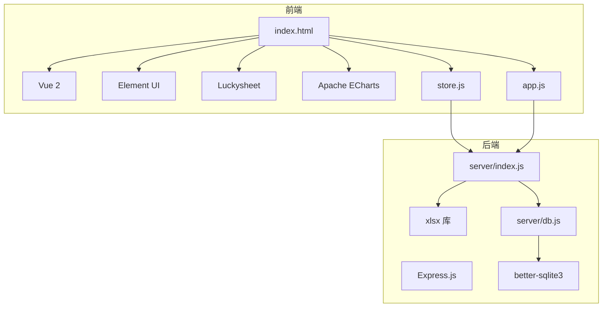
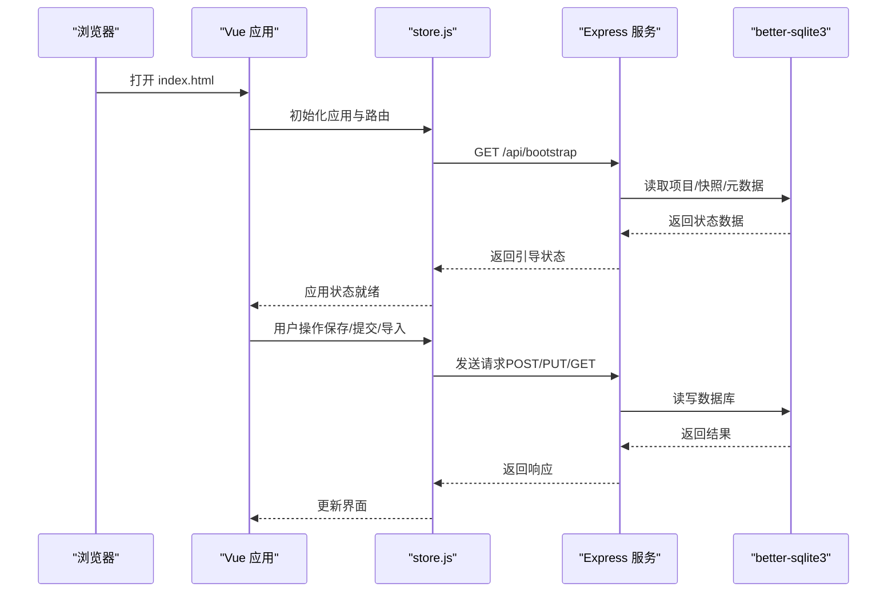
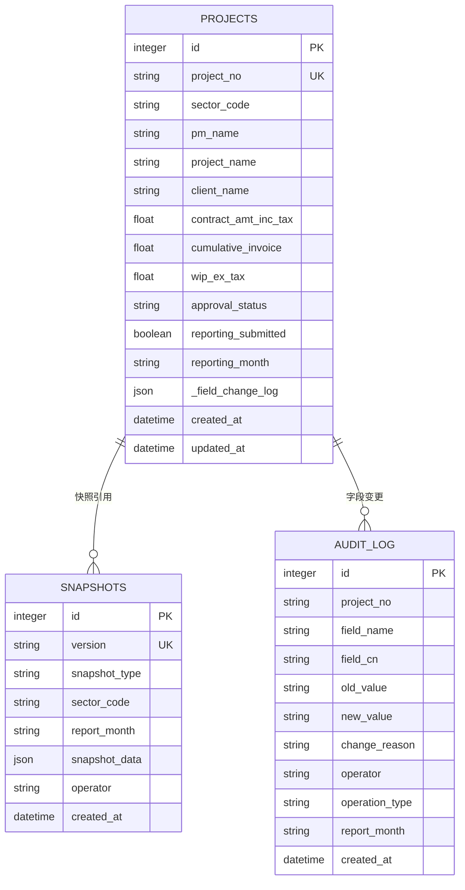
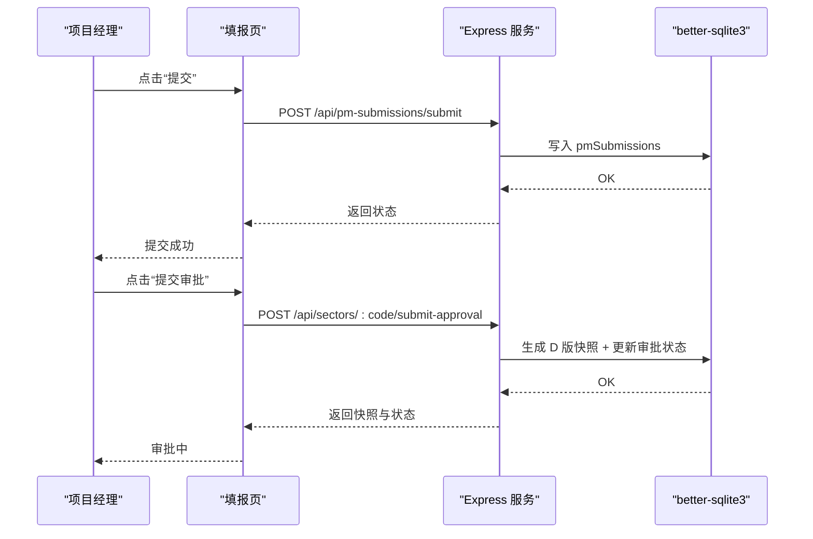
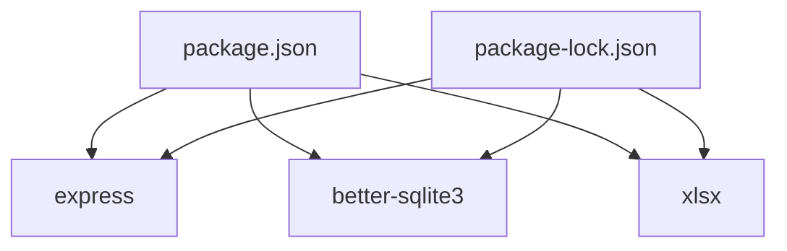

# 技术栈与依赖

<cite>
**本文档引用的文件**
- [package.json](file://package.json)
- [package-lock.json](file://package-lock.json)
- [index.html](file://index.html)
- [js/app.js](file://js/app.js)
- [js/store.js](file://js/store.js)
- [js/formatters.js](file://js/formatters.js)
- [js/formula-engine.js](file://js/formula-engine.js)
- [js/xlsx-importer.js](file://js/xlsx-importer.js)
- [server/index.js](file://server/index.js)
- [server/db.js](file://server/db.js)
- [docs/需求文档/技术栈与开发规范.md](file://docs/需求文档/技术栈与开发规范.md)
- [docs/需求文档/需求文档_开发版.md](file://docs/需求文档/需求文档_开发版.md)
- [database-schema.sql](file://database-schema.sql)
</cite>

## 目录
1. [简介](#简介)
2. [项目结构](#项目结构)
3. [核心组件](#核心组件)
4. [架构总览](#架构总览)
5. [详细组件分析](#详细组件分析)
6. [依赖分析](#依赖分析)
7. [性能考量](#性能考量)
8. [故障排查指南](#故障排查指南)
9. [结论](#结论)
10. [附录](#附录)

## 简介
本项目采用轻量级前端与 Node.js 后端组合，围绕 SQLite 数据库存储构建“项目执行追踪平台”。前端以 Vue 2 + Element UI + Luckysheet 为核心，结合 SheetJS 实现 Excel 导入导出；后端以 Express 提供 REST API，使用 better-sqlite3 访问本地 SQLite，xlsx 库用于种子数据解析与导入。

技术选型强调：
- 前端零构建、CDN 引入，降低部署与学习成本；
- 后端单进程、单文件数据库，简化运维与扩展；
- 通过公式引擎与快照机制保障数据一致性与可追溯性。

## 项目结构
项目采用“静态 HTML + 模块化 JS + Node 服务”的混合架构：
- 前端入口为 index.html，通过 CDN 引入 Vue、Element UI、Luckysheet、ECharts 等依赖；
- js/ 目录下按功能拆分模块（store、router、views、components、formatters、formula-engine、xlsx-importer 等）；
- server/ 目录提供 Express 服务，负责 API、数据库初始化与数据同步；
- docs/ 与 database-schema.sql 提供需求与数据库设计说明。

**图示来源**
- [index.html:1-110](file://index.html#L1-L110)
- [js/store.js:1-602](file://js/store.js#L1-L602)
- [js/app.js:1-47](file://js/app.js#L1-L47)
- [server/index.js:1-775](file://server/index.js#L1-L775)
- [server/db.js:1-525](file://server/db.js#L1-L525)

**章节来源**
- [index.html:1-110](file://index.html#L1-L110)
- [js/store.js:1-602](file://js/store.js#L1-L602)
- [js/app.js:1-47](file://js/app.js#L1-L47)
- [server/index.js:1-775](file://server/index.js#L1-L775)
- [server/db.js:1-525](file://server/db.js#L1-L525)

## 核心组件
- 前端应用入口与状态管理
  - app.js：初始化 Vue 实例、注册组件、挂载路由与全局过滤器，启动 Store 初始化流程。
  - store.js：封装全局状态（项目、审批状态、快照、用户、字段字典等），提供与后端 API 的交互方法（如 /api/bootstrap、/api/fields、/api/projects、/api/snapshots 等）。
- 数据格式化与公式引擎
  - formatters.js：金额、百分比、日期、布尔等格式化与解析工具，统一 Excel 日期序列号与 ISO 日期转换。
  - formula-engine.js：按报告月索引计算派生字段（如累计完成、WIP、应收账款等），支持批量计算。
- Excel 导入导出
  - xlsx-importer.js：基于 SheetJS（CDN 引入）解析 Excel 为项目数组，或按字段字典导出为 .xlsx。
- 后端服务与数据库
  - server/index.js：Express 入口，提供 /api/* REST 接口，负责引导状态、字段字典、项目 CRUD、快照、审批流程、平台同步、工时/成本导入等。
  - server/db.js：better-sqlite3 封装，提供数据库连接、表结构初始化、元数据管理、快照与审计日志存储、项目增删改查等。

**章节来源**
- [js/app.js:1-47](file://js/app.js#L1-L47)
- [js/store.js:1-602](file://js/store.js#L1-L602)
- [js/formatters.js:1-167](file://js/formatters.js#L1-L167)
- [js/formula-engine.js:1-105](file://js/formula-engine.js#L1-L105)
- [js/xlsx-importer.js:1-186](file://js/xlsx-importer.js#L1-L186)
- [server/index.js:1-775](file://server/index.js#L1-L775)
- [server/db.js:1-525](file://server/db.js#L1-L525)

## 架构总览
系统采用前后端分离的单页应用模式：
- 前端通过 fetch 与后端 API 通信，状态由 store.js 统一管理；
- 后端以 SQLite 作为持久化存储，提供 REST 接口；
- SheetJS 用于 Excel 数据的双向转换；
- Luckysheet 提供在线类 Excel 表格体验，结合公式引擎与权限控制实现精细化填报。

**图示来源**
- [index.html:1-110](file://index.html#L1-L110)
- [js/app.js:1-47](file://js/app.js#L1-L47)
- [js/store.js:1-602](file://js/store.js#L1-L602)
- [server/index.js:1-775](file://server/index.js#L1-L775)
- [server/db.js:1-525](file://server/db.js#L1-L525)

## 详细组件分析

### 前端技术栈设计与使用场景
- Vue 2.5.22
  - 用于组件化与响应式数据绑定，提供路由与视图切换能力；
  - 通过 CDN 引入，避免构建工具依赖，降低部署门槛。
- Element UI 2.15.x
  - 提供表格、表单、对话框、分页等企业级组件，提升开发效率与一致性。
- Luckysheet 2.1.13
  - 实现高保真 Excel 还原、在线编辑、单元格权限控制、公式链与列宽配置；
  - 与 SheetJS 协作实现 Excel 导入导出。
- Apache ECharts 5.4.3
  - 用于产值趋势、WIP 账龄分布、回款饼图等可视化展示。
- Tailwind CSS 3.x（Play CDN）
  - 原子化 CSS，快速布局与样式覆盖，减少自定义 CSS。

使用场景举例：
- 填报页：Luckysheet + Element UI 表单 + ECharts 图表；
- 审批页：只读表格 + 审批按钮；
- 管理页：字段字典维护、用户与权限配置、平台数据刷新、归档。

**章节来源**
- [index.html:1-110](file://index.html#L1-L110)
- [docs/需求文档/技术栈与开发规范.md:1-144](file://docs/需求文档/技术栈与开发规范.md#L1-L144)

### 后端技术栈设计与架构优势
- Express.js
  - 轻量、灵活，适合小型到中型应用；提供 REST API，便于前后端解耦。
- better-sqlite3
  - 原生绑定，性能优异；WAL 模式提升并发读写稳定性；单文件数据库，部署简单。
- xlsx 库
  - 用于解析 Excel 种子数据，支持批量导入与导出。

架构优势：
- 单进程单实例，运维成本低；
- SQLite 事务与索引支持复杂查询与审计；
- API 与数据库职责清晰，易于扩展与测试。

**章节来源**
- [server/index.js:1-775](file://server/index.js#L1-L775)
- [server/db.js:1-525](file://server/db.js#L1-L525)
- [package.json:1-19](file://package.json#L1-L19)

### 第三方依赖选择理由与版本兼容性
- Vue 2.5.22 + Element UI 2.15.x
  - 兼容性：Element UI 2.x 与 Vue 2.5.x 版本匹配良好；CDN 版本锁定避免线上自动更新导致的不兼容。
- Luckysheet 2.1.13
  - 与 jQuery 3.6.0、Popper.js 1.16.1 协作，满足在线表格与权限控制需求。
- SheetJS（CDN 引入的 xlsx-0.20.1）
  - 与 Luckysheet 导入导出流程无缝衔接，支持复杂列映射与数据清洗。
- Tailwind CSS（Play CDN）
  - 开发期使用，生产环境建议替换为预编译版本以减少运行时开销。

版本兼容性要点：
- Vue 2.5.22 与 Element UI 2.15.x 组合稳定；
- Luckysheet 依赖 jQuery 与 Popper.js，需确保版本匹配；
- SheetJS 与 Excel 列映射、日期序列号处理需与 formatters.js 保持一致。

**章节来源**
- [index.html:1-110](file://index.html#L1-L110)
- [js/formatters.js:1-167](file://js/formatters.js#L1-L167)
- [js/xlsx-importer.js:1-186](file://js/xlsx-importer.js#L1-L186)
- [docs/需求文档/技术栈与开发规范.md:1-144](file://docs/需求文档/技术栈与开发规范.md#L1-L144)

### 数据模型与存储设计
数据库采用 SQLite，核心表包括：
- projects：项目主表，存储 CRB 同步字段、手工输入字段与公式计算字段；
- snapshots：快照表，记录 I/D/J 版本；
- audit_log：审计日志，记录字段变更与操作；
- timesheet_entries / cost_entries：工时与成本明细（开发期数据源）。

**图示来源**
- [database-schema.sql:1-286](file://database-schema.sql#L1-L286)
- [server/db.js:1-525](file://server/db.js#L1-L525)

**章节来源**
- [database-schema.sql:1-286](file://database-schema.sql#L1-L286)
- [server/db.js:1-525](file://server/db.js#L1-L525)

### API 工作流（以“提交审批”为例）

**图示来源**
- [server/index.js:230-346](file://server/index.js#L230-L346)
- [server/db.js:1-525](file://server/db.js#L1-L525)

**章节来源**
- [server/index.js:230-346](file://server/index.js#L230-L346)
- [server/db.js:1-525](file://server/db.js#L1-L525)

## 依赖分析
- 前端依赖
  - Vue 2、Element UI、Luckysheet、ECharts、jQuery、Popper.js、Tailwind CSS（CDN）。
- 后端依赖
  - Express、better-sqlite3、xlsx（用于解析 Excel 种子数据）。
- 版本锁定与兼容
  - package.json 指定版本范围，package-lock.json 锁定具体版本，确保 CI/CD 与本地一致。

**图示来源**
- [package.json:1-19](file://package.json#L1-L19)
- [package-lock.json:1-800](file://package-lock.json#L1-L800)

**章节来源**
- [package.json:1-19](file://package.json#L1-L19)
- [package-lock.json:1-800](file://package-lock.json#L1-L800)

## 性能考量
- 前端
  - CDN 引入组件，减少打包体积；Tailwind Play CDN 生产环境建议替换为预编译版本。
  - Luckysheet 大表格建议分页或虚拟滚动（如后续引入）以降低渲染压力。
- 后端
  - better-sqlite3 使用 WAL 模式，提升并发读写；为高频查询建立索引（如项目号、报告月、板块等）。
  - Express 限制请求体大小（已设置 80MB），避免内存溢出。
- 数据导入
  - Excel 导入采用批量事务写入，减少磁盘 IO；注意字段映射与日期序列号转换的一致性。

[本节为通用指导，无需特定文件引用]

## 故障排查指南
常见问题与定位：
- 无法加载数据或初始化失败
  - 检查 /api/bootstrap 是否返回状态；确认 SQLite 初始化与种子数据是否存在。
- Excel 导入失败
  - 核对列映射与日期序列号处理；检查 formatters.js 与 xlsx-importer.js 的转换逻辑。
- 审批流程异常
  - 检查 /api/sectors/:code/submit-approval 与 /api/sectors/:code/advance-approval 的状态机与权限判断。
- 锁定与权限
  - 核对 periodConfig、lockStatus 与 reportingMonth 的计算逻辑；确认角色权限与字段级只读规则。

**章节来源**
- [js/store.js:268-288](file://js/store.js#L268-L288)
- [js/xlsx-importer.js:108-175](file://js/xlsx-importer.js#L108-L175)
- [server/index.js:302-385](file://server/index.js#L302-L385)
- [server/db.js:194-266](file://server/db.js#L194-L266)

## 结论
本项目通过“零构建前端 + Node.js + SQLite”的组合，实现了轻量、可部署、可扩展的项目追踪平台。前端以 Luckysheet 与 Element UI 提升填报体验，后端以 Express + better-sqlite3 提供稳定的数据服务能力。通过公式引擎与快照机制，保障了数据一致性与可追溯性。建议在生产环境中替换 Tailwind CDN、完善前端虚拟滚动与缓存策略，并持续优化数据库索引与查询路径。

[本节为总结性内容，无需特定文件引用]

## 附录
- 学习路径建议
  - 前端：Vue 2 基础 → Element UI 组件使用 → Luckysheet 权限与公式 → ECharts 图表集成。
  - 后端：Express 基础 → better-sqlite3 原生绑定 → REST API 设计 → 数据库设计与索引优化。
- 最佳实践
  - 前端：模块化组织、CDN 版本锁定、统一格式化与日期处理。
  - 后端：事务封装、错误处理、审计日志、接口幂等与鉴权。
- 依赖更新策略
  - 使用 package-lock.json 锁定版本；定期审查安全公告；对关键依赖进行回归测试。
- 安全考虑
  - 限制请求体大小、输入校验与权限控制；审计日志记录关键操作；敏感信息避免明文存储。
- 性能优化建议
  - 前端：懒加载、虚拟滚动、缓存策略；后端：索引优化、批量写入、连接池与查询缓存。

[本节为通用指导，无需特定文件引用]