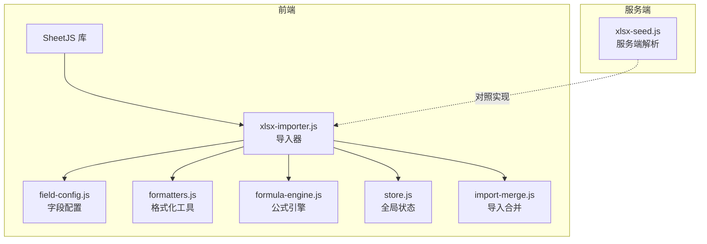
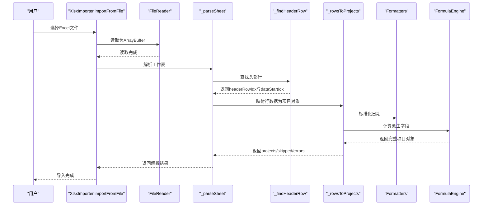
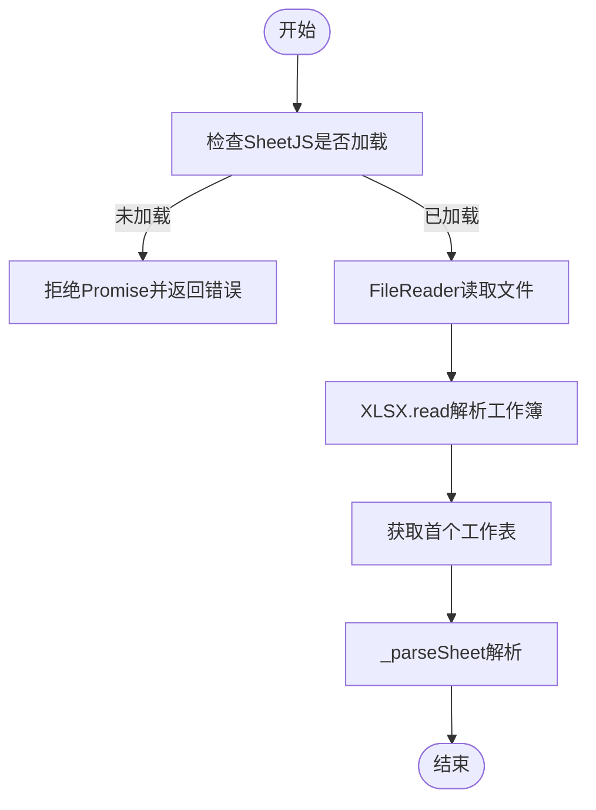
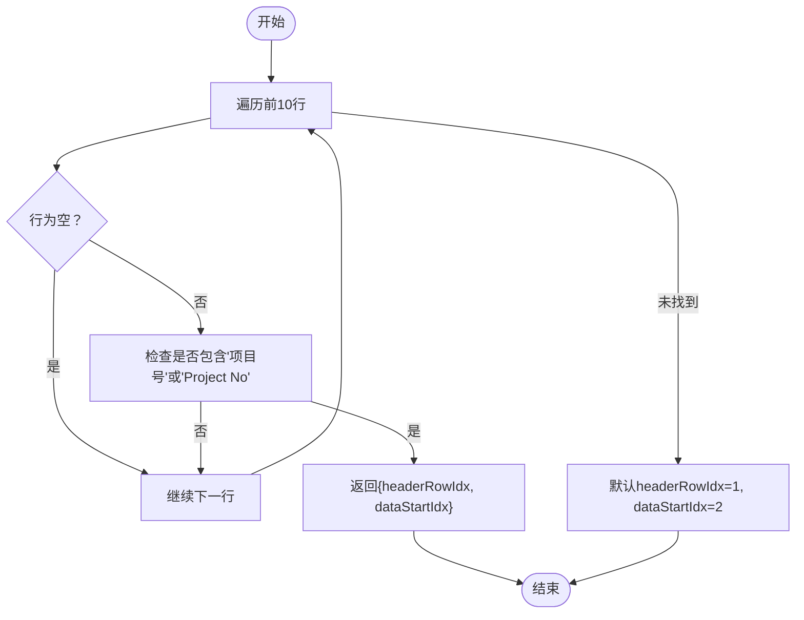
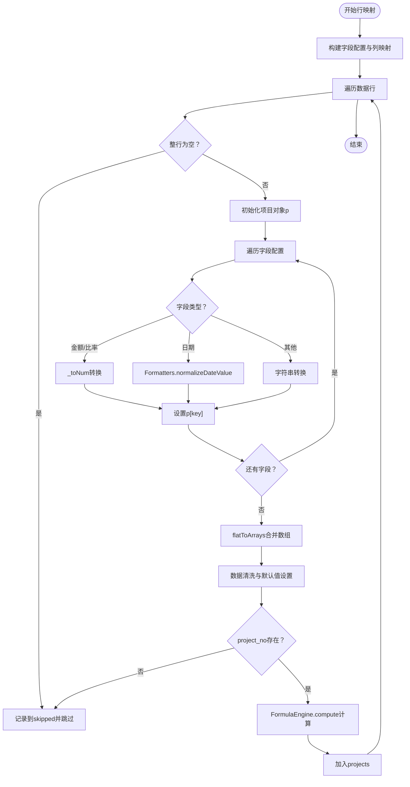
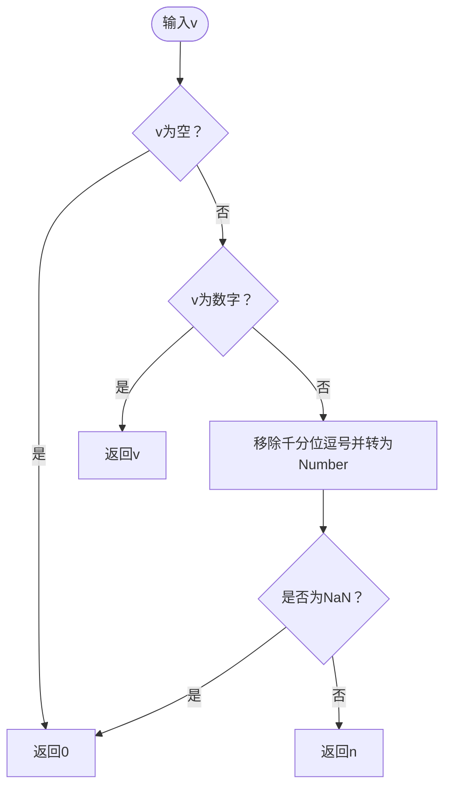
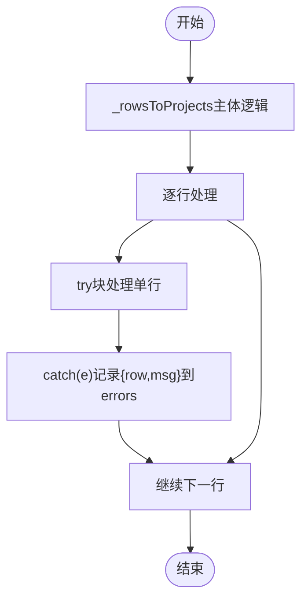
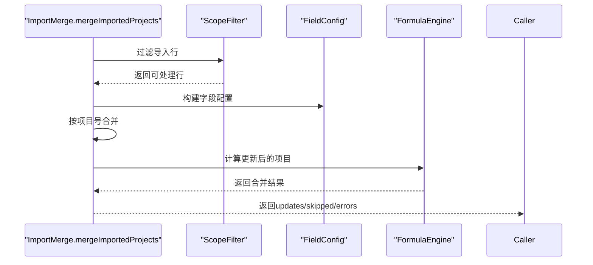
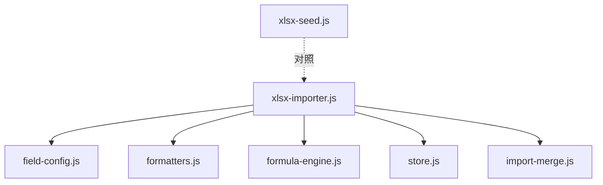

# Excel导入处理

<cite>
**本文档引用的文件**
- [xlsx-importer.js](file://js/xlsx-importer.js)
- [field-config.js](file://js/field-config.js)
- [formatters.js](file://js/formatters.js)
- [formula-engine.js](file://js/formula-engine.js)
- [store.js](file://js/store.js)
- [import-merge.js](file://js/import-merge.js)
- [xlsx-seed.js](file://server/xlsx-seed.js)
- [fields-data.js](file://config/fields/fields-data.js)
- [fields.json](file://config/fields/fields.json)
</cite>

## 目录
1. [简介](#简介)
2. [项目结构](#项目结构)
3. [核心组件](#核心组件)
4. [架构概览](#架构概览)
5. [详细组件分析](#详细组件分析)
6. [依赖关系分析](#依赖关系分析)
7. [性能考量](#性能考量)
8. [故障排查指南](#故障排查指南)
9. [结论](#结论)

## 简介
本文件面向Excel导入处理功能，聚焦xlsx-importer.js中的导入流程，系统性阐述以下内容：
- 文件读取与Sheet解析
- 数据行转换为项目对象的映射机制
- _headerRowIdx与_dataStartIdx的定位逻辑，_findHeaderRow如何识别数据头部
- _rowsToProjects函数的数据映射机制，包括字段类型处理（金额、比率、日期）、数据清洗与验证
- _numToVal转换函数的数值处理逻辑
- 错误处理与跳过行机制
- 导入过程中的数据类型转换、空值处理与异常捕获策略
- 导入失败的常见原因与解决方案

## 项目结构
Excel导入处理涉及前端JavaScript模块与服务端脚本的协同：
- 前端模块：xlsx-importer.js负责浏览器端Excel读取、解析与项目对象构建
- 字段配置：field-config.js提供字段字典、列映射与数组/扁平化转换
- 格式化工具：formatters.js提供日期标准化与格式化
- 公式引擎：formula-engine.js负责项目对象的派生字段计算
- 全局状态：store.js提供报告月等上下文信息
- 导入合并：import-merge.js负责将导入数据与现有项目进行合并
- 服务端对照：xlsx-seed.js提供与前端一致的解析逻辑，便于批量初始化

**图表来源**
- [xlsx-importer.js:12-28](file://js/xlsx-importer.js#L12-L28)
- [field-config.js:242-260](file://js/field-config.js#L242-L260)
- [formatters.js:65-76](file://js/formatters.js#L65-L76)
- [formula-engine.js:19-83](file://js/formula-engine.js#L19-L83)
- [store.js:579-581](file://js/store.js#L579-L581)
- [import-merge.js:17-99](file://js/import-merge.js#L17-L99)
- [xlsx-seed.js:15-27](file://server/xlsx-seed.js#L15-L27)

**章节来源**
- [xlsx-importer.js:1-186](file://js/xlsx-importer.js#L1-L186)
- [field-config.js:196-240](file://js/field-config.js#L196-L240)
- [formatters.js:65-76](file://js/formatters.js#L65-L76)
- [formula-engine.js:19-83](file://js/formula-engine.js#L19-L83)
- [store.js:579-581](file://js/store.js#L579-L581)
- [import-merge.js:17-99](file://js/import-merge.js#L17-L99)
- [xlsx-seed.js:15-27](file://server/xlsx-seed.js#L15-L27)

## 核心组件
- 导入器（xlsx-importer.js）
  - importFromFile：从File对象读取xlsx，返回Promise，包含projects、skipped、errors
  - _parseSheet：遍历工作表范围，逐单元格提取值
  - _cellValue：统一单元格值的提取与类型转换
  - _findHeaderRow：在前若干行中查找包含“项目号”或“Project No”的头部行
  - _rowsToProjects：将行数据映射为项目对象，执行类型转换、清洗与验证
  - _toNum：数值转换，处理空值、千分位与非数字字符
- 字段配置（field-config.js）
  - COL_TO_KEY：列字母到字段键的映射
  - arraysToFlat/flatToArrays：月度完成/开票/回款数组与mc_/mi_/mp_键之间的双向转换
  - buildFieldConfig：构建带权限与显示信息的字段配置
- 格式化工具（formatters.js）
  - normalizeDateValue：统一日期格式，支持Excel序列日、Date对象与文本
- 公式引擎（formula-engine.js）
  - compute：计算派生字段（如累计完成、WIP、应收账款等）
- 全局状态（store.js）
  - getMonthIdx：报告月索引，用于公式计算
- 导入合并（import-merge.js）
  - mergeImportedProjects：按项目号合并导入数据，仅覆盖当前角色可编辑字段
- 服务端对照（xlsx-seed.js）
  - sheetToRows/findHeaderRow/toNum：与前端一致的解析逻辑

**章节来源**
- [xlsx-importer.js:12-28](file://js/xlsx-importer.js#L12-L28)
- [xlsx-importer.js:70-83](file://js/xlsx-importer.js#L70-L83)
- [xlsx-importer.js:85-89](file://js/xlsx-importer.js#L85-L89)
- [xlsx-importer.js:95-106](file://js/xlsx-importer.js#L95-L106)
- [xlsx-importer.js:108-175](file://js/xlsx-importer.js#L108-L175)
- [xlsx-importer.js:177-182](file://js/xlsx-importer.js#L177-L182)
- [field-config.js:196-240](file://js/field-config.js#L196-L240)
- [formatters.js:65-76](file://js/formatters.js#L65-L76)
- [formula-engine.js:19-83](file://js/formula-engine.js#L19-L83)
- [store.js:579-581](file://js/store.js#L579-L581)
- [import-merge.js:17-99](file://js/import-merge.js#L17-L99)
- [xlsx-seed.js:15-27](file://server/xlsx-seed.js#L15-L27)

## 架构概览
导入流程从浏览器读取Excel文件开始，经过解析、映射、清洗与计算，最终输出项目数组。关键步骤如下：
- 文件读取：FileReader + SheetJS
- Sheet解析：解码范围、遍历行列、提取单元格值
- 头部定位：在前若干行中查找包含“项目号”的行，确定headerRowIdx与dataStartIdx
- 行映射：按字段配置将每行映射为项目对象，执行类型转换与数据清洗
- 公式计算：对每个项目计算派生字段
- 结果聚合：返回projects、skipped、errors

**图表来源**
- [xlsx-importer.js:12-28](file://js/xlsx-importer.js#L12-L28)
- [xlsx-importer.js:70-83](file://js/xlsx-importer.js#L70-L83)
- [xlsx-importer.js:95-106](file://js/xlsx-importer.js#L95-L106)
- [xlsx-importer.js:108-175](file://js/xlsx-importer.js#L108-L175)
- [formatters.js:65-76](file://js/formatters.js#L65-L76)
- [formula-engine.js:19-83](file://js/formula-engine.js#L19-L83)

## 详细组件分析

### 文件读取与Sheet解析
- importFromFile：校验SheetJS可用性，使用FileReader异步读取文件，解析为工作簿与工作表，调用_parseSheet继续处理
- _parseSheet：解码工作表范围，遍历行列，使用_cellValue提取单元格值，构建二维数组
- _cellValue：针对日期单元格（t='d'）提取ISO日期字符串；数值单元格（t='n'）保持数字；文本单元格优先使用value，否则回退到w

**图表来源**
- [xlsx-importer.js:12-28](file://js/xlsx-importer.js#L12-L28)
- [xlsx-importer.js:70-83](file://js/xlsx-importer.js#L70-L83)
- [xlsx-importer.js:85-89](file://js/xlsx-importer.js#L85-L89)

**章节来源**
- [xlsx-importer.js:12-28](file://js/xlsx-importer.js#L12-L28)
- [xlsx-importer.js:70-83](file://js/xlsx-importer.js#L70-L83)
- [xlsx-importer.js:85-89](file://js/xlsx-importer.js#L85-L89)

### 头部定位与索引逻辑
- _findHeaderRow：在前10行范围内扫描，若某行包含“项目号”或“Project No”，则认为该行为头部行，数据起始行=dataStartIdx=headerRowIdx+1；若未找到，则默认第2行为头部，第3行起为数据
- 关键点：使用字符串包含匹配，确保对中英文表头均有效；若Excel结构变化，可调整扫描范围

**图表来源**
- [xlsx-importer.js:95-106](file://js/xlsx-importer.js#L95-L106)

**章节来源**
- [xlsx-importer.js:95-106](file://js/xlsx-importer.js#L95-L106)

### 行映射与数据清洗（_rowsToProjects）
- 字段映射：使用FieldConfig.buildFieldConfig与COL_TO_KEY建立字段配置与列映射
- 行过滤：跳过全空行，记录到skipped
- 类型转换：
  - 金额/比率：统一走_toNum，处理空值、千分位与非数字字符
  - 日期：优先使用Formatters.normalizeDateValue，否则回退为字符串
  - 文本：统一转为字符串，空值转为空字符串
- 数据清洗：
  - 合并mc_/mi_/mp_数组为monthly_*对象
  - 若缺少sign_year，依据start_date推断年份
  - 设置crb_status与基础标志位
- 验证与跳过：
  - 必须存在project_no，否则跳过该行
  - 每行try/catch，异常记录到errors
- 公式计算：对每个项目调用FormulaEngine.compute，得到完整项目对象

**图表来源**
- [xlsx-importer.js:108-175](file://js/xlsx-importer.js#L108-L175)
- [field-config.js:223-240](file://js/field-config.js#L223-L240)
- [formatters.js:65-76](file://js/formatters.js#L65-L76)
- [formula-engine.js:19-83](file://js/formula-engine.js#L19-L83)

**章节来源**
- [xlsx-importer.js:108-175](file://js/xlsx-importer.js#L108-L175)
- [field-config.js:223-240](file://js/field-config.js#L223-L240)
- [formatters.js:65-76](file://js/formatters.js#L65-L76)
- [formula-engine.js:19-83](file://js/formula-engine.js#L19-L83)

### 数值转换函数（_toNum）
- 空值处理：null/undefined/''统一返回0
- 数字类型：直接返回
- 字符串类型：移除千分位逗号后转为Number，非法则返回0

**图表来源**
- [xlsx-importer.js:177-182](file://js/xlsx-importer.js#L177-L182)

**章节来源**
- [xlsx-importer.js:177-182](file://js/xlsx-importer.js#L177-L182)

### 错误处理与跳过行机制
- 行级异常：每行try/catch，异常以{row, msg}形式记录到errors
- 行级跳过：全空行记录到skipped；无project_no的行记录到skipped
- 文件级异常：FileReader或XLSX.read阶段的错误直接reject

**图表来源**
- [xlsx-importer.js:108-175](file://js/xlsx-importer.js#L108-L175)

**章节来源**
- [xlsx-importer.js:108-175](file://js/xlsx-importer.js#L108-L175)

### 导入合并（import-merge.js）
- 作用：将导入结果与现有项目按项目号合并，仅覆盖当前角色可编辑字段
- 流程：按项目号建立索引，逐行比较字段差异，记录更新、跳过与错误

**图表来源**
- [import-merge.js:17-99](file://js/import-merge.js#L17-L99)
- [field-config.js:242-260](file://js/field-config.js#L242-L260)
- [formula-engine.js:88-90](file://js/formula-engine.js#L88-L90)

**章节来源**
- [import-merge.js:17-99](file://js/import-merge.js#L17-L99)
- [field-config.js:242-260](file://js/field-config.js#L242-L260)
- [formula-engine.js:88-90](file://js/formula-engine.js#L88-L90)

### 服务端对照（xlsx-seed.js）
- 与前端逻辑对齐：sheetToRows、findHeaderRow、toNum等函数
- 用途：服务端批量初始化或离线解析

**章节来源**
- [xlsx-seed.js:15-27](file://server/xlsx-seed.js#L15-L27)
- [xlsx-seed.js:29-39](file://server/xlsx-seed.js#L29-L39)
- [xlsx-seed.js:41-46](file://server/xlsx-seed.js#L41-L46)

## 依赖关系分析
- 导入器依赖字段配置与格式化工具进行类型转换与日期标准化
- 公式引擎依赖全局状态提供的报告月索引进行派生字段计算
- 导入合并依赖字段配置与公式引擎进行差异计算与更新

**图表来源**
- [xlsx-importer.js:108-175](file://js/xlsx-importer.js#L108-L175)
- [field-config.js:242-260](file://js/field-config.js#L242-L260)
- [formatters.js:65-76](file://js/formatters.js#L65-L76)
- [formula-engine.js:88-90](file://js/formula-engine.js#L88-L90)
- [store.js:579-581](file://js/store.js#L579-L581)
- [import-merge.js:17-99](file://js/import-merge.js#L17-L99)
- [xlsx-seed.js:15-27](file://server/xlsx-seed.js#L15-L27)

**章节来源**
- [xlsx-importer.js:108-175](file://js/xlsx-importer.js#L108-L175)
- [field-config.js:242-260](file://js/field-config.js#L242-L260)
- [formatters.js:65-76](file://js/formatters.js#L65-L76)
- [formula-engine.js:88-90](file://js/formula-engine.js#L88-L90)
- [store.js:579-581](file://js/store.js#L579-L581)
- [import-merge.js:17-99](file://js/import-merge.js#L17-L99)
- [xlsx-seed.js:15-27](file://server/xlsx-seed.js#L15-L27)

## 性能考量
- 行遍历复杂度：O(R×C)，其中R为数据行数，C为字段数；可通过限制扫描行数与字段数量优化
- 数值转换：_toNum对每个单元格执行字符串处理，建议在上游减少非必要空格与特殊字符
- 公式计算：FormulaEngine.compute对每个项目计算多个派生字段，建议批量处理并缓存报告月索引
- 内存占用：二维数组与项目对象较多时，注意及时释放中间变量，避免重复拷贝

## 故障排查指南
- 常见失败原因
  - SheetJS未加载：importFromFile会立即拒绝
  - 表头缺失或不匹配：_findHeaderRow默认行为可能误判，导致后续列映射错位
  - 日期格式异常：Excel序列日、Date对象与文本混杂，需确保normalizeDateValue正确处理
  - 金额/比率解析失败：包含千分位逗号或非数字字符，_toNum会回退为0
  - 项目号缺失：无project_no的行会被跳过
  - 公式计算异常：字段依赖缺失或类型不符，try/catch会记录错误
- 解决方案
  - 确保引入SheetJS并在页面加载完成后再触发导入
  - 检查Excel表头是否包含“项目号”或“Project No”，必要时手动调整
  - 统一日期格式为标准ISO字符串或Excel序列日
  - 金额/比率字段去除多余字符，保留纯数字与千分位逗号
  - 为每行提供唯一项目号
  - 查看errors与skipped列表，定位具体行号与问题字段

**章节来源**
- [xlsx-importer.js:12-28](file://js/xlsx-importer.js#L12-L28)
- [xlsx-importer.js:95-106](file://js/xlsx-importer.js#L95-L106)
- [xlsx-importer.js:108-175](file://js/xlsx-importer.js#L108-L175)
- [formatters.js:65-76](file://js/formatters.js#L65-L76)
- [xlsx-importer.js:177-182](file://js/xlsx-importer.js#L177-L182)

## 结论
xlsx-importer.js提供了完整的Excel导入流程：从文件读取、Sheet解析、头部定位，到行映射、类型转换、数据清洗与公式计算。其设计强调了对日期、金额、比率等关键类型的统一处理，以及对异常与空行的稳健容错。结合字段配置、格式化工具与公式引擎，导入结果能够无缝融入系统状态与后续业务流程。建议在生产环境中严格规范Excel表头与数据格式，以提升导入成功率与一致性。