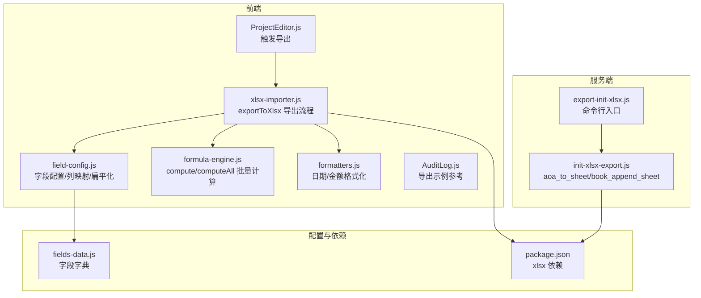
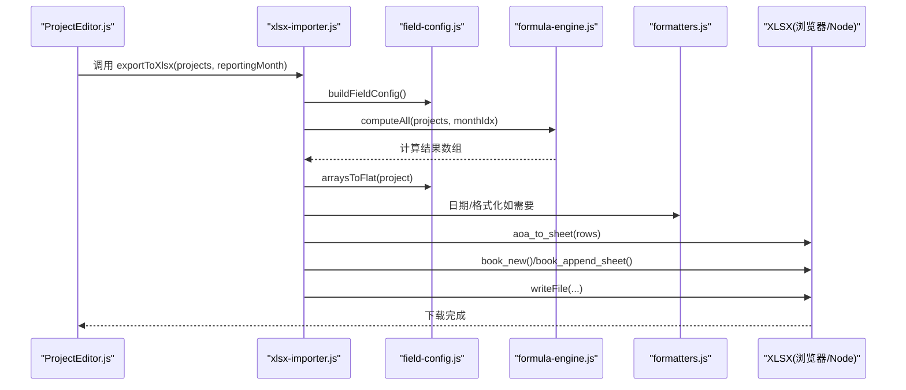
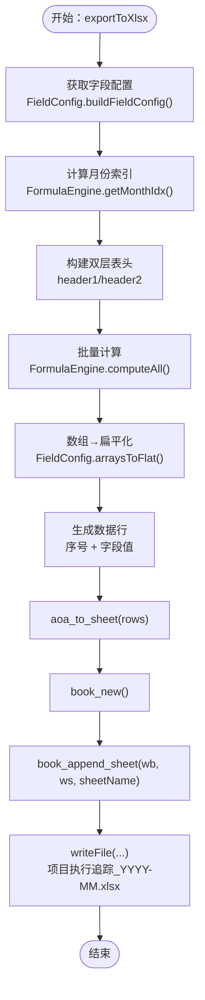
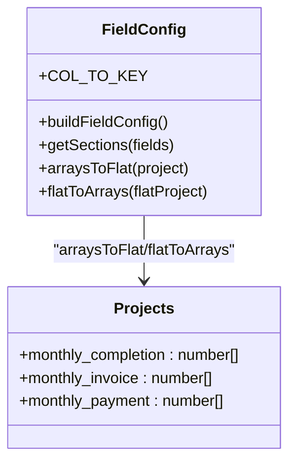
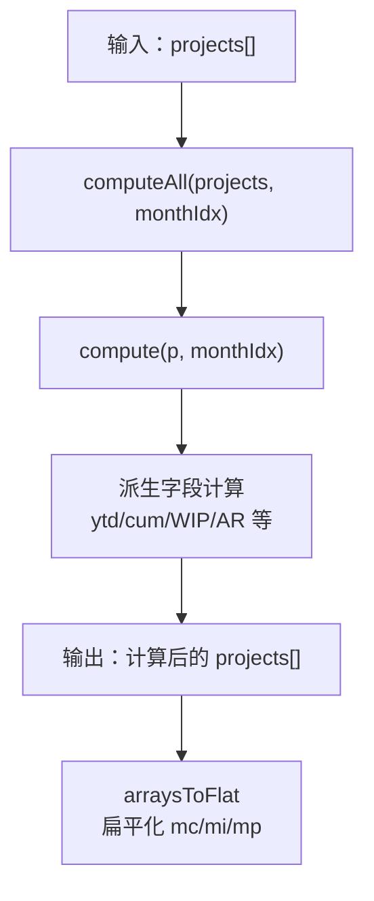
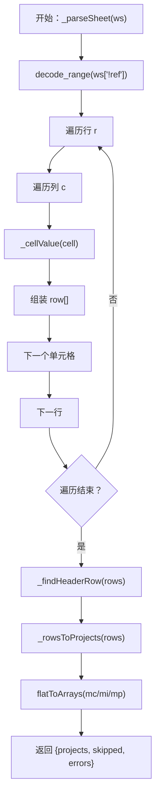
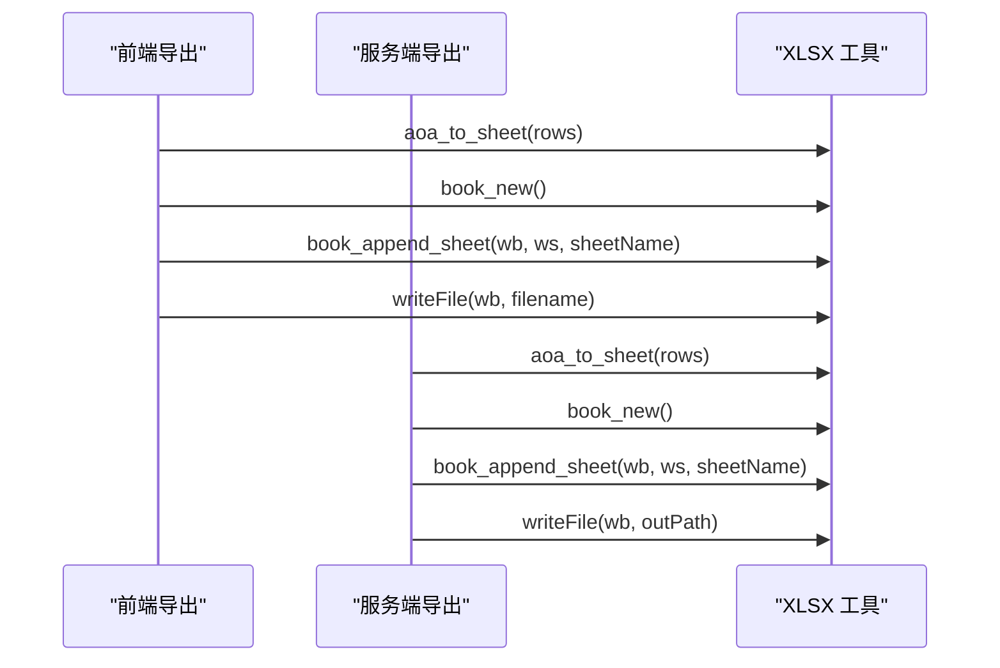
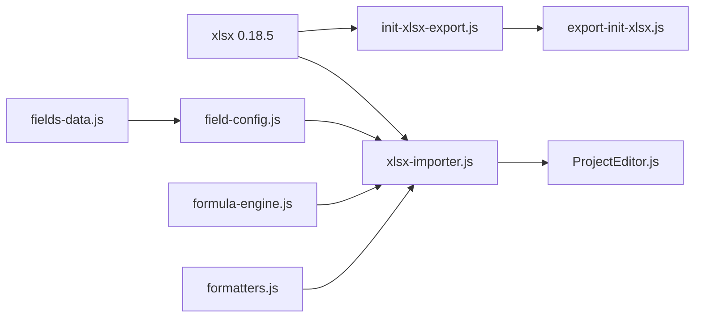

# Excel导出格式化

<cite>
**本文引用的文件**
- [xlsx-importer.js](file://js/xlsx-importer.js)
- [field-config.js](file://js/field-config.js)
- [formula-engine.js](file://js/formula-engine.js)
- [formatters.js](file://js/formatters.js)
- [ProjectEditor.js](file://js/views/ProjectEditor.js)
- [AuditLog.js](file://js/views/AuditLog.js)
- [init-xlsx-export.js](file://server/init-xlsx-export.js)
- [export-init-xlsx.js](file://server/export-init-xlsx.js)
- [fields-data.js](file://config/fields/fields-data.js)
- [package.json](file://package.json)
</cite>

## 目录
1. [简介](#简介)
2. [项目结构](#项目结构)
3. [核心组件](#核心组件)
4. [架构总览](#架构总览)
5. [详细组件分析](#详细组件分析)
6. [依赖分析](#依赖分析)
7. [性能考量](#性能考量)
8. [故障排查指南](#故障排查指南)
9. [结论](#结论)
10. [附录](#附录)

## 简介
本文件围绕“Excel导出格式化”主题，系统梳理前端导出流程与服务端初始化导出脚本，重点解释以下内容：
- exportToXlsx 函数的导出流程：表头构建（header1 和 header2 的双重结构）、数据行生成、样式与下载。
- 字段配置来源：FieldConfig.buildFieldConfig() 如何从字段字典构建配置。
- _parseSheet 如何处理 Luckysheet 导出数据。
- computeAll 的批量计算逻辑与数据扁平化/数组转换过程。
- XLSX 工具库的使用方式：aoa_to_sheet 与 book_append_sheet。
- 文件命名规则、月份参数处理与下载机制。
- 性能优化建议与大文件处理策略。

## 项目结构
与导出功能直接相关的前端与服务端模块如下：
- 前端导出入口与实现：js/xlsx-importer.js
- 字段配置与列映射：js/field-config.js
- 公式计算引擎：js/formula-engine.js
- 日期与格式化工具：js/formatters.js
- 导出触发点（视图）：js/views/ProjectEditor.js
- 审计日志导出示例：js/views/AuditLog.js
- 服务端初始化导出脚本：server/init-xlsx-export.js、server/export-init-xlsx.js
- 字段字典来源：config/fields/fields-data.js
- 依赖声明：package.json

**图表来源**
- [xlsx-importer.js:33-67](file://js/xlsx-importer.js#L33-L67)
- [field-config.js:134-260](file://js/field-config.js#L134-L260)
- [formula-engine.js:19-90](file://js/formula-engine.js#L19-L90)
- [formatters.js:65-85](file://js/formatters.js#L65-L85)
- [ProjectEditor.js:1148](file://js/views/ProjectEditor.js#L1148)
- [init-xlsx-export.js:31-68](file://server/init-xlsx-export.js#L31-L68)
- [export-init-xlsx.js:12-24](file://server/export-init-xlsx.js#L12-L24)
- [fields-data.js:1-200](file://config/fields/fields-data.js#L1-L200)
- [package.json:13-17](file://package.json#L13-L17)

**章节来源**
- [xlsx-importer.js:1-186](file://js/xlsx-importer.js#L1-L186)
- [field-config.js:1-262](file://js/field-config.js#L1-L262)
- [formula-engine.js:1-105](file://js/formula-engine.js#L1-L105)
- [formatters.js:1-167](file://js/formatters.js#L1-L167)
- [ProjectEditor.js:1140-1156](file://js/views/ProjectEditor.js#L1140-L1156)
- [AuditLog.js:60-81](file://js/views/AuditLog.js#L60-L81)
- [init-xlsx-export.js:1-112](file://server/init-xlsx-export.js#L1-L112)
- [export-init-xlsx.js:1-25](file://server/export-init-xlsx.js#L1-L25)
- [fields-data.js:1-200](file://config/fields/fields-data.js#L1-L200)
- [package.json:1-19](file://package.json#L1-L19)

## 核心组件
- 导出入口与流程控制：xlsx-importer.js 中的 exportToXlsx
- 字段配置与映射：field-config.js 中的 buildFieldConfig、getSections、COL_TO_KEY、arraysToFlat、flatToArrays
- 批量计算：formula-engine.js 中的 computeAll
- 日期与格式化：formatters.js 中的 normalizeDateValue、dateToExcelSerial
- 导出触发点：ProjectEditor.js 中的 handleExport
- 服务端初始化导出：init-xlsx-export.js 中的 exportProjectsToInitXlsx
- 字段字典来源：fields-data.js

**章节来源**
- [xlsx-importer.js:33-67](file://js/xlsx-importer.js#L33-L67)
- [field-config.js:134-260](file://js/field-config.js#L134-L260)
- [formula-engine.js:88-90](file://js/formula-engine.js#L88-L90)
- [formatters.js:65-85](file://js/formatters.js#L65-L85)
- [ProjectEditor.js:1148](file://js/views/ProjectEditor.js#L1148)
- [init-xlsx-export.js:31-68](file://server/init-xlsx-export.js#L31-L68)
- [fields-data.js:1-200](file://config/fields/fields-data.js#L1-L200)

## 架构总览
下图展示了前端导出的关键调用链路与数据流：

**图表来源**
- [ProjectEditor.js:1148](file://js/views/ProjectEditor.js#L1148)
- [xlsx-importer.js:33-67](file://js/xlsx-importer.js#L33-L67)
- [field-config.js:134-260](file://js/field-config.js#L134-L260)
- [formula-engine.js:88-90](file://js/formula-engine.js#L88-L90)
- [formatters.js:65-85](file://js/formatters.js#L65-L85)

## 详细组件分析

### 导出流程：exportToXlsx
- 字段配置获取：调用 FieldConfig.buildFieldConfig() 生成带权限与渲染信息的字段配置列表。
- 月份参数处理：FormulaEngine.getMonthIdx(reportingMonth || '2026-05') 将 'YYYY-MM' 转换为 0-11 的索引。
- 表头构建：
  - header1：按分区首列填充分区名，其余留空，形成“分区标题”行。
  - header2：按字段顺序填充中文名，形成“字段名”行。
  - 两行共同构成双层表头，便于阅读与对齐。
- 数据行生成：
  - 先写入两行表头。
  - 调用 FormulaEngine.computeAll(projects, monthIdx) 对每个项目进行批量计算，得到派生字段。
  - 遍历每个项目，先写入序号列，再按字段顺序从扁平化对象中取值（arraysToFlat），缺失值填空。
- 写入与下载：
  - 使用 XLSX.utils.aoa_to_sheet(rows) 将二维数组转为工作表。
  - 使用 XLSX.utils.book_new() 创建工作簿，book_append_sheet 添加工作表。
  - 使用 XLSX.writeFile(...) 下载文件，文件名为“项目执行追踪_YYYY-MM.xlsx”。

**图表来源**
- [xlsx-importer.js:33-67](file://js/xlsx-importer.js#L33-L67)
- [field-config.js:234-240](file://js/field-config.js#L234-L240)
- [formula-engine.js:88-90](file://js/formula-engine.js#L88-L90)

**章节来源**
- [xlsx-importer.js:33-67](file://js/xlsx-importer.js#L33-L67)

### 字段配置与映射：FieldConfig.buildFieldConfig()
- 字段字典来源：优先从 Store.fieldDictionary 或全局窗口变量 FIELD_DICTIONARY 获取；若为空则报错。
- 增强字段信息：为每个字段附加列索引、可编辑性、Luckysheet 渲染样式（fa/t）、列宽等。
- 分区分组：getSections 将字段按 section 分组，用于表头分区标题。
- 列映射：COL_TO_KEY 将列字母映射到 JS 字段键（如 mc_0..mc_11、mi_0..mp_11 等）。
- 扁平化/数组转换：
  - arraysToFlat：将 monthly_completion / monthly_invoice / monthly_payment 数组展开为 mc_*/mi_*/mp_* 键。
  - flatToArrays：将 mc_*/mi_*/mp_* 键合并为数组。

**图表来源**
- [field-config.js:134-260](file://js/field-config.js#L134-L260)

**章节来源**
- [field-config.js:134-260](file://js/field-config.js#L134-L260)
- [fields-data.js:1-200](file://config/fields/fields-data.js#L1-L200)

### 批量计算：computeAll 与数据扁平化
- computeAll(projects, monthIdx)：对 projects 数组逐项调用 compute(p, monthIdx)，返回计算后的项目数组。
- compute(p, monthIdx)：根据月度完成、开票、回款等数组，计算派生字段（如 ytd_completed、cum_completed、wip_incl_tax 等）。
- 数据扁平化：
  - 导出前：arraysToFlat 将数组还原为 mc_*/mi_*/mp_* 键，便于按字段顺序取值。
  - 导入后：_rowsToProjects 中调用 flatToArrays 将 mc_*/mi_*/mp_* 键合并为数组，确保后续公式计算与视图渲染一致。

**图表来源**
- [formula-engine.js:88-90](file://js/formula-engine.js#L88-L90)
- [formula-engine.js:19-83](file://js/formula-engine.js#L19-L83)
- [field-config.js:234-240](file://js/field-config.js#L234-L240)

**章节来源**
- [formula-engine.js:88-90](file://js/formula-engine.js#L88-L90)
- [formula-engine.js:19-83](file://js/formula-engine.js#L19-L83)
- [field-config.js:234-240](file://js/field-config.js#L234-L240)

### Luckysheet 导出数据解析：_parseSheet
- 解析范围：decode_range(ws['!ref']) 获取有效区域。
- 行列遍历：按行/列读取单元格，_cellValue 统一提取值（日期序列日、数值、文本）。
- 行转项目：_findHeaderRow 查找“项目号/Project No”所在行，确定字段名行与数据起始行，再按列映射 COL_TO_KEY 生成项目对象。
- 类型转换：金额/比率/日期按字段类型转换，日期通过 Formatters.normalizeDateValue 规范化。
- 合并数组：flatToArrays 将 mc_*/mi_*/mp_* 键合并为数组，保证后续 FormulaEngine.compute 正常运行。

**图表来源**
- [xlsx-importer.js:70-175](file://js/xlsx-importer.js#L70-L175)
- [field-config.js:223-240](file://js/field-config.js#L223-L240)
- [formatters.js:65-76](file://js/formatters.js#L65-L76)

**章节来源**
- [xlsx-importer.js:70-175](file://js/xlsx-importer.js#L70-L175)
- [field-config.js:223-240](file://js/field-config.js#L223-L240)
- [formatters.js:65-76](file://js/formatters.js#L65-L76)

### XLSX 工具库使用方式
- 浏览器端（前端导出）：
  - aoa_to_sheet：将二维数组 rows 转为工作表 ws。
  - book_new / book_append_sheet：创建工作簿并添加工作表。
  - writeFile：触发浏览器下载。
- 服务端（初始化导出）：
  - 同样使用 XLSX.utils.aoa_to_sheet、book_new、book_append_sheet。
  - fs.mkdirSync 与 XLSX.writeFile 写入磁盘文件。

**图表来源**
- [xlsx-importer.js:63-66](file://js/xlsx-importer.js#L63-L66)
- [init-xlsx-export.js:62-66](file://server/init-xlsx-export.js#L62-L66)

**章节来源**
- [xlsx-importer.js:63-66](file://js/xlsx-importer.js#L63-L66)
- [init-xlsx-export.js:62-66](file://server/init-xlsx-export.js#L62-L66)

### 文件命名规则、月份参数与下载机制
- 文件命名：前端导出文件名为“项目执行追踪_YYYY-MM.xlsx”，其中 YYYY-MM 来自 reportingMonth 参数或默认 '2026-05'。
- 月份参数处理：FormulaEngine.getMonthIdx 将 'YYYY-MM' 解析为 0-11 的索引，用于派生字段计算。
- 下载机制：
  - 前端：XLSX.writeFile 触发浏览器下载。
  - 服务端：fs.mkdirSync(outDir) 确保存在目录，XLSX.writeFile 写入指定 outPath。

**章节来源**
- [xlsx-importer.js:36](file://js/xlsx-importer.js#L36)
- [xlsx-importer.js:65-66](file://js/xlsx-importer.js#L65-L66)
- [formula-engine.js:97-101](file://js/formula-engine.js#L97-L101)
- [init-xlsx-export.js:61-67](file://server/init-xlsx-export.js#L61-L67)

### 导出触发点与样式应用
- 触发点：ProjectEditor.js 中 handleExport 调用 XlsxImporter.exportToXlsx(Store.projects, Store.reportingMonth)。
- 样式应用（Luckysheet 渲染侧）：formatters.js 中的 dateToExcelSerial 与 normalizeDateValue 保证日期在前端正确显示；xlsx-importer.js 中未直接设置单元格样式，主要通过 XLSX 写入与浏览器默认行为呈现。

**章节来源**
- [ProjectEditor.js:1148](file://js/views/ProjectEditor.js#L1148)
- [formatters.js:79-85](file://js/formatters.js#L79-L85)

## 依赖分析
- 外部依赖：xlsx 0.18.5（浏览器与 Node 环境均可使用）。
- 模块耦合：
  - xlsx-importer.js 依赖 field-config.js、formula-engine.js、formatters.js。
  - 服务端 init-xlsx-export.js 依赖 XLSX 与 snapshot-service（内部模块）。
  - 字段字典来源于 config/fields/fields-data.js，被 field-config.js 使用。

**图表来源**
- [package.json:13-17](file://package.json#L13-L17)
- [xlsx-importer.js:33-67](file://js/xlsx-importer.js#L33-L67)
- [init-xlsx-export.js:31-68](file://server/init-xlsx-export.js#L31-L68)
- [field-config.js:134-260](file://js/field-config.js#L134-L260)
- [formula-engine.js:19-90](file://js/formula-engine.js#L19-L90)
- [formatters.js:65-85](file://js/formatters.js#L65-L85)
- [fields-data.js:1-200](file://config/fields/fields-data.js#L1-L200)
- [ProjectEditor.js:1148](file://js/views/ProjectEditor.js#L1148)
- [export-init-xlsx.js:12-24](file://server/export-init-xlsx.js#L12-L24)

**章节来源**
- [package.json:13-17](file://package.json#L13-L17)
- [xlsx-importer.js:33-67](file://js/xlsx-importer.js#L33-L67)
- [init-xlsx-export.js:31-68](file://server/init-xlsx-export.js#L31-L68)
- [field-config.js:134-260](file://js/field-config.js#L134-L260)
- [formula-engine.js:19-90](file://js/formula-engine.js#L19-L90)
- [formatters.js:65-85](file://js/formatters.js#L65-L85)
- [fields-data.js:1-200](file://config/fields/fields-data.js#L1-L200)
- [ProjectEditor.js:1148](file://js/views/ProjectEditor.js#L1148)
- [export-init-xlsx.js:12-24](file://server/export-init-xlsx.js#L12-L24)

## 性能考量
- 批量计算优化：
  - computeAll 已通过 map 一次性计算，避免重复遍历。
  - arraysToFlat/flatToArrays 在导出前后各执行一次，建议在导出前仅做一次扁平化，减少重复转换。
- 内存与大数据：
  - 大量数据导出时，建议分批生成 rows，避免一次性构造超大数组导致内存峰值过高。
  - 使用流式写法（服务端）或分片写入（浏览器）以降低峰值内存占用。
- I/O 优化：
  - 服务端导出时，确保目标目录存在（mkdirSync）后再写入，减少异常重试。
  - 前端导出时，尽量在 UI 线程空闲时触发，避免阻塞交互。
- 样式与格式：
  - 导出阶段不设置复杂样式，减少 XLSX 库处理开销。
  - 如需样式，可在服务端模板基础上预设，或通过二次处理工具（如第三方库）在导出后追加样式。

## 故障排查指南
- SheetJS 未加载：
  - 现象：alert('SheetJS 未加载') 或错误提示。
  - 排查：确认页面已正确引入 xlsx 脚本；检查浏览器控制台网络与加载错误。
- 字段字典未加载：
  - 现象：buildFieldConfig 返回空数组并报错。
  - 排查：确认 Store.fieldDictionary 或全局 FIELD_DICTIONARY 是否已加载；检查 /api/fields 或静态资源加载。
- 日期格式异常：
  - 现象：日期显示为序列日或格式不一致。
  - 排查：使用 Formatters.normalizeDateValue 规范化输入；导出时注意日期列的 fa/t 设置（前端 Luckysheet 渲染侧）。
- 导入/导出空数据：
  - 现象：_findHeaderRow 未找到头行，或项目为空。
  - 排查：确认 Excel 第1-10行包含“项目号/Project No”；服务端导出前检查项目库是否为空。
- 下载失败：
  - 现象：浏览器未触发下载或 Node 环境报错。
  - 排查：浏览器端检查 writeFile 权限；服务端检查 outPath 目录权限与磁盘空间。

**章节来源**
- [xlsx-importer.js:14](file://js/xlsx-importer.js#L14)
- [xlsx-importer.js:34](file://js/xlsx-importer.js#L34)
- [xlsx-importer.js:109-110](file://js/xlsx-importer.js#L109-L110)
- [init-xlsx-export.js:18-21](file://server/init-xlsx-export.js#L18-L21)
- [formatters.js:65-76](file://js/formatters.js#L65-L76)

## 结论
本文系统梳理了前端导出与服务端初始化导出的实现细节，明确了：
- exportToXlsx 的完整流程：配置获取、表头构建、批量计算、扁平化与写入下载。
- 字段配置与映射：buildFieldConfig、getSections、COL_TO_KEY、arraysToFlat/flatToArrays 的作用与关系。
- computeAll 的批量计算逻辑与数据转换过程。
- XLSX 工具库在浏览器与服务端的一致使用方式。
- 文件命名、月份参数与下载机制。
- 性能优化与大文件处理策略。

这些知识有助于在保持一致性的同时，进一步扩展与维护导出功能。

## 附录
- 审计日志导出示例（参考）：使用 XLSX.utils.aoa_to_sheet、book_new、book_append_sheet、writeFile 的标准流程，可作为前端导出的参考模板。
- 初始化导出脚本：export-init-xlsx.js 作为命令行入口，调用 init-xlsx-export.js 完成从数据库导出到本地文件的流程。

**章节来源**
- [AuditLog.js:60-81](file://js/views/AuditLog.js#L60-L81)
- [export-init-xlsx.js:12-24](file://server/export-init-xlsx.js#L12-L24)
- [init-xlsx-export.js:31-68](file://server/init-xlsx-export.js#L31-L68)