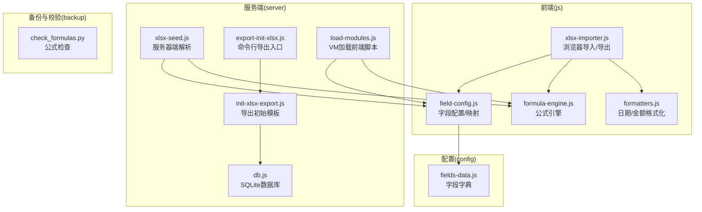
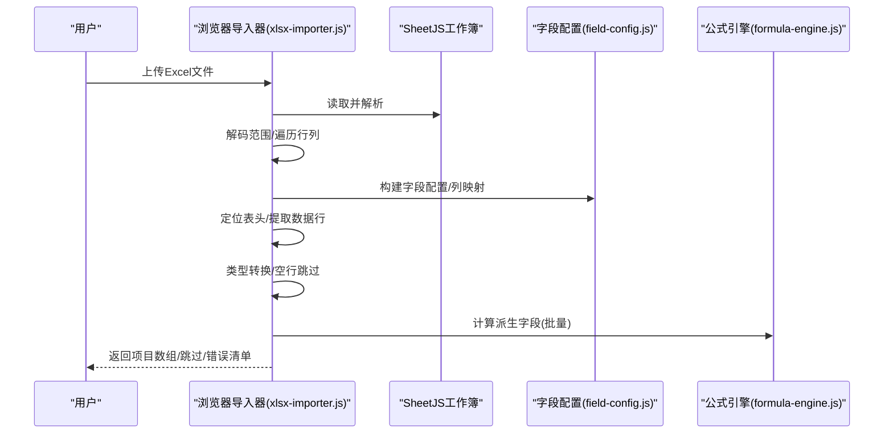
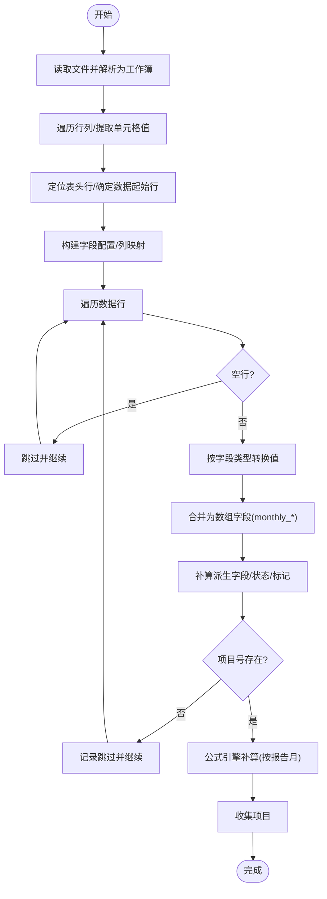
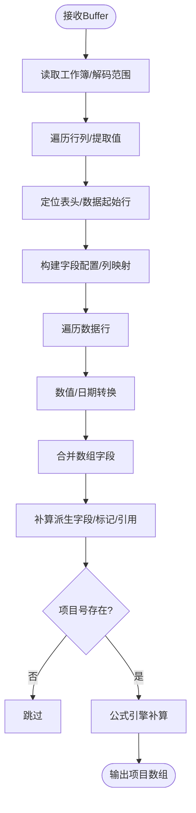
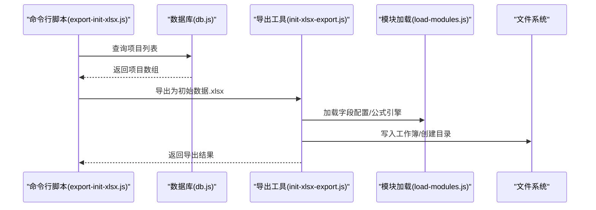
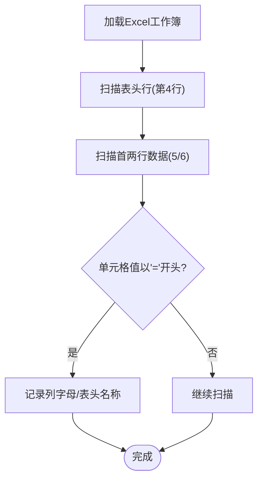
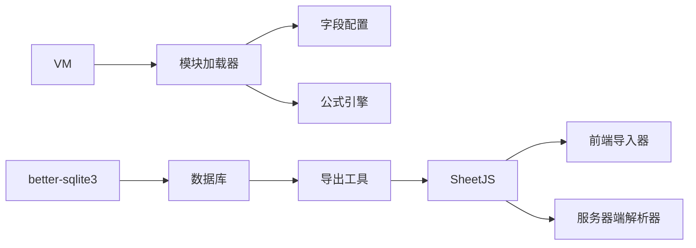

# 数据导入导出

<cite>
**本文引用的文件**
- [xlsx-importer.js](file://js/xlsx-importer.js)
- [xlsx-seed.js](file://server/xlsx-seed.js)
- [init-xlsx-export.js](file://server/init-xlsx-export.js)
- [export-init-xlsx.js](file://server/export-init-xlsx.js)
- [check_formulas.py](file://backup/check_formulas.py)
- [formatters.js](file://js/formatters.js)
- [field-config.js](file://js/field-config.js)
- [formula-engine.js](file://js/formula-engine.js)
- [load-modules.js](file://server/load-modules.js)
- [fields-data.js](file://config/fields/fields-data.js)
- [db.js](file://server/db.js)
- [package.json](file://package.json)
</cite>

## 目录
1. [简介](#简介)
2. [项目结构](#项目结构)
3. [核心组件](#核心组件)
4. [架构总览](#架构总览)
5. [详细组件分析](#详细组件分析)
6. [依赖分析](#依赖分析)
7. [性能考量](#性能考量)
8. [故障排查指南](#故障排查指南)
9. [结论](#结论)
10. [附录](#附录)

## 简介
本文件面向“项目执行追踪平台”的数据导入导出能力，围绕以下目标展开：
- Excel 数据处理的完整流程：从文件读取、解析、格式校验、批量处理到公式补算。
- Excel 导入器（xlsx-importer.js）的数据解析逻辑、格式验证与批量处理机制。
- 数据种子（xlsx-seed.js）的初始化流程、模板设计与数据生成。
- Excel 导出（init-xlsx-export.js）的格式化输出、样式设置与数据组织。
- 数据校验工具（check_formulas.py）的验证逻辑、错误检测与修复建议。
- 数据迁移策略、批量操作优化与错误处理机制。
- 最佳实践与性能优化建议。

## 项目结构
本项目采用前后端分离的模块化组织方式：
- 前端脚本位于 js/ 目录，负责浏览器侧的导入导出与格式化。
- 服务端脚本位于 server/ 目录，负责数据库交互、模板导出与批处理。
- 配置与字段定义位于 config/fields/ 与 config/fields-data.js。
- 备份与校验脚本位于 backup/ 与 scripts/。

图表来源
- [xlsx-importer.js:1-186](file://js/xlsx-importer.js#L1-L186)
- [xlsx-seed.js:1-130](file://server/xlsx-seed.js#L1-L130)
- [init-xlsx-export.js:1-112](file://server/init-xlsx-export.js#L1-L112)
- [export-init-xlsx.js:1-25](file://server/export-init-xlsx.js#L1-L25)
- [load-modules.js:1-41](file://server/load-modules.js#L1-L41)
- [fields-data.js:1-1101](file://config/fields/fields-data.js#L1-L1101)
- [formatters.js:1-167](file://js/formatters.js#L1-L167)
- [field-config.js:1-262](file://js/field-config.js#L1-L262)
- [formula-engine.js:1-105](file://js/formula-engine.js#L1-L105)
- [db.js:1-525](file://server/db.js#L1-L525)
- [check_formulas.py:1-29](file://backup/check_formulas.py#L1-L29)

章节来源
- [package.json:1-19](file://package.json#L1-L19)

## 核心组件
- 浏览器导入器：负责从文件读取 Excel，解析行列、定位表头、按字段类型转换、补算公式，并输出项目数组与跳过/错误清单。
- 服务器端解析器：与前端逻辑对齐，支持 Buffer 输入，统一日期与数值解析，生成项目数组。
- 导出工具：将数据库中的项目数据导出为“初始数据.xlsx”，保持与前端导入器一致的列布局与字段映射。
- 格式化工具：提供日期标准化、金额格式化、序列日转换等通用能力。
- 字段配置：提供列字母到字段键的映射、数组与扁平化的转换、权限与样式元信息。
- 公式引擎：基于报告月份索引，计算派生字段，支持批量计算。
- VM 加载器：在 Node 环境中加载前端脚本，复用字段字典与计算逻辑。
- 数据库：SQLite 存储项目与元数据，提供查询与导出入口。

章节来源
- [xlsx-importer.js:1-186](file://js/xlsx-importer.js#L1-L186)
- [xlsx-seed.js:1-130](file://server/xlsx-seed.js#L1-L130)
- [init-xlsx-export.js:1-112](file://server/init-xlsx-export.js#L1-L112)
- [formatters.js:1-167](file://js/formatters.js#L1-L167)
- [field-config.js:1-262](file://js/field-config.js#L1-L262)
- [formula-engine.js:1-105](file://js/formula-engine.js#L1-L105)
- [load-modules.js:1-41](file://server/load-modules.js#L1-L41)
- [db.js:1-525](file://server/db.js#L1-L525)

## 架构总览
导入/导出流程贯穿前端与服务端，关键路径如下：
- 导入：浏览器读取文件 → SheetJS 解析 → 定位表头 → 字段映射与类型转换 → 公式补算 → 输出项目数组。
- 导出：数据库读取项目 → 字段扁平化 → 组织为二维数组 → 写入工作簿 → 下载文件。
- 校验：Python 脚本扫描 Excel 公式，辅助发现模板问题。

图表来源
- [xlsx-importer.js:12-83](file://js/xlsx-importer.js#L12-L83)
- [field-config.js:134-155](file://js/field-config.js#L134-L155)
- [formula-engine.js:88-90](file://js/formula-engine.js#L88-L90)

## 详细组件分析

### Excel 导入器（xlsx-importer.js）
- 文件读取与解析
  - 使用 FileReader 读取 File 对象为 ArrayBuffer，再交由 SheetJS 以数组形式读取，开启日期单元格解析。
  - 解析整个工作表为二维数组，逐单元格提取值并标准化。
- 表头定位与数据行提取
  - 在前若干行中查找包含“项目号”或“Project No”的行作为表头，确定数据起始行。
  - 若未找到，退化为第二行为表头、第三行起为数据。
- 字段映射与类型转换
  - 依据字段配置构建列映射，按字段类型进行转换：
    - 金额/比率/月度完成/开票/回款：统一转为数字（千分位移除）。
    - 日期：使用前端格式化工具进行标准化（ISO 日期）。
    - 文本：统一为字符串，空值转为空字符串。
  - 将扁平字段合并为数组字段（monthly_*）。
- 补算与完整性
  - 自动补充签认状态、新增/变更标记等派生字段。
  - 以项目号作为主键，缺失项目号的行被跳过。
  - 使用公式引擎按报告月份索引计算派生字段，支持批量计算。
- 错误处理
  - 单行异常被捕获并记录行号与错误信息，不影响其他行处理。

图表来源
- [xlsx-importer.js:70-175](file://js/xlsx-importer.js#L70-L175)

章节来源
- [xlsx-importer.js:1-186](file://js/xlsx-importer.js#L1-L186)
- [formatters.js:65-76](file://js/formatters.js#L65-L76)
- [field-config.js:223-240](file://js/field-config.js#L223-L240)
- [formula-engine.js:19-83](file://js/formula-engine.js#L19-L83)

### 数据种子（xlsx-seed.js）
- 输入与解析
  - 接收 Excel Buffer，使用 SheetJS 解析为二维数组。
  - 与前端逻辑一致地定位表头与数据行。
- 类型转换与日期标准化
  - 数值类字段统一转为数字（移除千分位）。
  - 日期字段使用专用的日期标准化函数，兼容 Excel 序列日、ISO 与文本格式。
- 字段合并与派生
  - 将扁平字段合并为数组字段。
  - 补充签认状态、新增/变更标记、系统引用与覆盖字段。
  - 若存在新/旧项目引用模块，按报告年份与同步时间填充引用。
- 公式补算与输出
  - 使用公式引擎按报告月份索引计算派生字段。
  - 返回项目数组，供后续导入或导出使用。

图表来源
- [xlsx-seed.js:71-127](file://server/xlsx-seed.js#L71-L127)

章节来源
- [xlsx-seed.js:1-130](file://server/xlsx-seed.js#L1-L130)
- [xlsx-seed.js:50-64](file://server/xlsx-seed.js#L50-L64)

### Excel 导出（init-xlsx-export.js）
- 模板候选与定位
  - 支持环境变量指定路径、默认路径与备用路径，优先使用存在的文件。
- 数据准备
  - 从数据库读取项目，按字段配置扁平化并组织为二维数组。
  - 日期字段截断为 YYYY-MM-DD 字符串。
- 工作簿写入
  - 使用 SheetJS 将二维数组写入工作表，设置工作表名为报告月份。
  - 创建输出目录并写入文件，返回路径、数量与工作表名。
- 自动导出入口
  - 命令行脚本加载数据库与模块，若项目库为空则报错；否则导出为“初始数据.xlsx”。

图表来源
- [export-init-xlsx.js:1-25](file://server/export-init-xlsx.js#L1-L25)
- [init-xlsx-export.js:31-103](file://server/init-xlsx-export.js#L31-L103)
- [load-modules.js:13-38](file://server/load-modules.js#L13-L38)
- [db.js:70-73](file://server/db.js#L70-L73)

章节来源
- [init-xlsx-export.js:1-112](file://server/init-xlsx-export.js#L1-L112)
- [export-init-xlsx.js:1-25](file://server/export-init-xlsx.js#L1-L25)
- [load-modules.js:1-41](file://server/load-modules.js#L1-L41)
- [db.js:1-525](file://server/db.js#L1-L525)

### 数据校验工具（check_formulas.py）
- 功能概述
  - 读取指定 Excel 文件，扫描表头行与首两条数据行，识别以“=”开头的单元格（公式）。
  - 输出列字母与对应表头名称，便于定位问题列。
- 使用建议
  - 在导入前运行，检查模板是否存在意外公式。
  - 结合字段配置与表头命名，快速定位潜在问题列。

图表来源
- [check_formulas.py:1-29](file://backup/check_formulas.py#L1-L29)

章节来源
- [check_formulas.py:1-29](file://backup/check_formulas.py#L1-L29)

### 字段配置与映射（field-config.js）
- 字段字典来源
  - 字段定义来自前端字段字典文件，包含列字母、中文名、数据类型、来源类型、计算逻辑等。
- 映射与转换
  - 提供列字母到字段键的映射（COL_TO_KEY），支持数组字段与扁平字段之间的双向转换。
  - 提供按分区分组、列索引与宽度、Luckysheet 渲染元信息等。
- 权限与样式
  - 提供月度字段可编辑性判断、系统引用字段识别、财务敏感列集合等，支撑前端渲染与权限控制。

章节来源
- [field-config.js:196-260](file://js/field-config.js#L196-L260)
- [fields-data.js:1-1101](file://config/fields/fields-data.js#L1-L1101)

### 公式引擎（formula-engine.js）
- 报告月索引
  - 将 YYYY-MM 转换为 0-11 的索引，用于月度字段的动态映射与计算。
- 计算逻辑
  - 基于输入项目对象与报告月索引，计算派生字段：合同额、YTD 完成、WIP/应收、存量指标等。
  - 支持批量计算，返回完整项目对象。
- 与前端/后端一致性
  - 与前端导入器与服务器端解析器共享同一套计算逻辑，确保导入/导出一致性。

章节来源
- [formula-engine.js:19-83](file://js/formula-engine.js#L19-L83)
- [formula-engine.js:88-101](file://js/formula-engine.js#L88-L101)

### 格式化工具（formatters.js）
- 日期标准化
  - 兼容 Excel 序列日、Date 对象与 ISO 文本，统一输出 YYYY-MM-DD。
- 金额与百分比
  - 提供金额、万元单位、百分比、税率等格式化与解析能力。
- 与导入/导出协作
  - 导入器在日期字段使用前端格式化工具进行标准化；导出器在日期字段截断为字符串。

章节来源
- [formatters.js:65-76](file://js/formatters.js#L65-L76)
- [formatters.js:13-21](file://js/formatters.js#L13-L21)

## 依赖分析
- 前端依赖
  - SheetJS：Excel 读写与工作簿解析。
  - 自身模块：字段配置、公式引擎、格式化工具。
- 服务端依赖
  - better-sqlite3：SQLite 数据库访问。
  - SheetJS：Excel 写入。
  - VM：在 Node 环境中加载前端脚本，复用字段字典与计算逻辑。
- 关键耦合点
  - 字段配置与映射是前后端共同依赖的核心契约。
  - 公式引擎在前端与服务端保持一致，保证导入/导出一致性。
  - 导入/导出均依赖日期标准化与数值转换的一致实现。

图表来源
- [package.json:13-18](file://package.json#L13-L18)
- [xlsx-importer.js:1-186](file://js/xlsx-importer.js#L1-L186)
- [xlsx-seed.js:1-130](file://server/xlsx-seed.js#L1-L130)
- [init-xlsx-export.js:1-112](file://server/init-xlsx-export.js#L1-L112)
- [load-modules.js:1-41](file://server/load-modules.js#L1-L41)
- [db.js:1-525](file://server/db.js#L1-L525)

章节来源
- [package.json:1-19](file://package.json#L1-L19)

## 性能考量
- 批量处理
  - 导入器与导出工具均采用数组到数组的批量处理，避免逐行拼接字符串。
  - 公式引擎提供批量计算接口，减少重复计算。
- 内存与 I/O
  - 导入器在浏览器端解析，建议控制单次导入文件大小与行数，避免内存峰值过高。
  - 服务器端导出前先从数据库一次性读取项目，减少多次查询。
- 日期与数值转换
  - 统一使用标准化函数，避免重复解析与格式化造成的性能损耗。
- 并发与事务
  - 服务器端写入数据库时使用事务，确保一致性与性能平衡。

## 故障排查指南
- 导入失败或数据异常
  - 检查表头是否包含“项目号”或“Project No”，否则会退化为第二行作为表头。
  - 确认日期字段格式，避免混杂多种日期格式导致解析异常。
  - 检查金额字段是否包含千分位，导入器会移除逗号后转换为数字。
- 公式问题
  - 使用 Python 校验脚本扫描以“=”开头的单元格，定位模板中的公式。
  - 结合字段配置与表头命名，确认列含义与计算逻辑。
- 导出为空
  - 确认数据库中存在项目数据；若为空，导出工具会抛出错误提示。
  - 检查环境变量与默认路径，确保候选文件存在。
- 权限与锁定
  - 报告月之前的月度列默认只读，系统管理员在特定条件下可覆盖系统引用列。

章节来源
- [xlsx-importer.js:95-106](file://js/xlsx-importer.js#L95-L106)
- [xlsx-importer.js:170-172](file://js/xlsx-importer.js#L170-L172)
- [check_formulas.py:19-29](file://backup/check_formulas.py#L19-L29)
- [init-xlsx-export.js:88-95](file://server/init-xlsx-export.js#L88-L95)

## 结论
本系统的数据导入导出能力以“字段配置”为核心契约，前后端共享公式引擎与格式化工具，确保导入/导出一致性与可维护性。通过严格的表头识别、类型转换与批量处理，结合 Python 校验工具与数据库导出能力，形成了完整的数据生命周期闭环。建议在生产环境中持续使用校验脚本与批量优化策略，保障大规模数据处理的稳定性与性能。

## 附录
- 最佳实践
  - 模板设计：严格遵循字段配置与表头命名，避免混杂日期/金额格式。
  - 导入前：使用校验脚本扫描公式，清理意外公式。
  - 导入后：核对项目号、日期与金额字段，关注跳过/错误清单。
  - 导出后：确认工作表名与列顺序，确保与导入器一致。
- 性能优化建议
  - 控制单次导入文件规模，分批处理大批量数据。
  - 使用批量计算与事务写入，减少 I/O 与重复计算。
  - 统一日期与数值转换逻辑，避免重复解析。