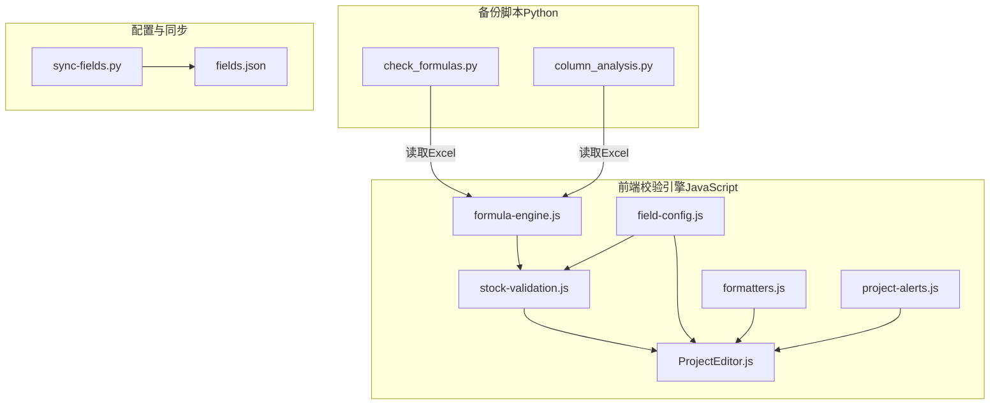
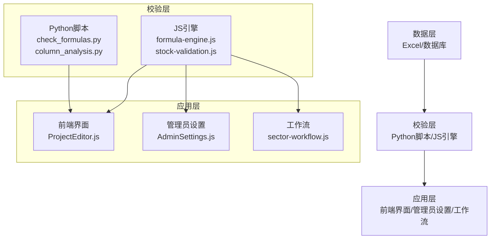
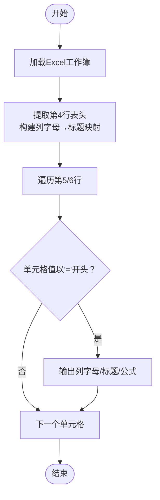
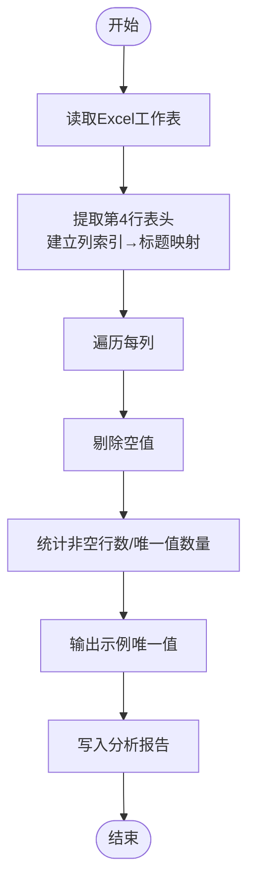
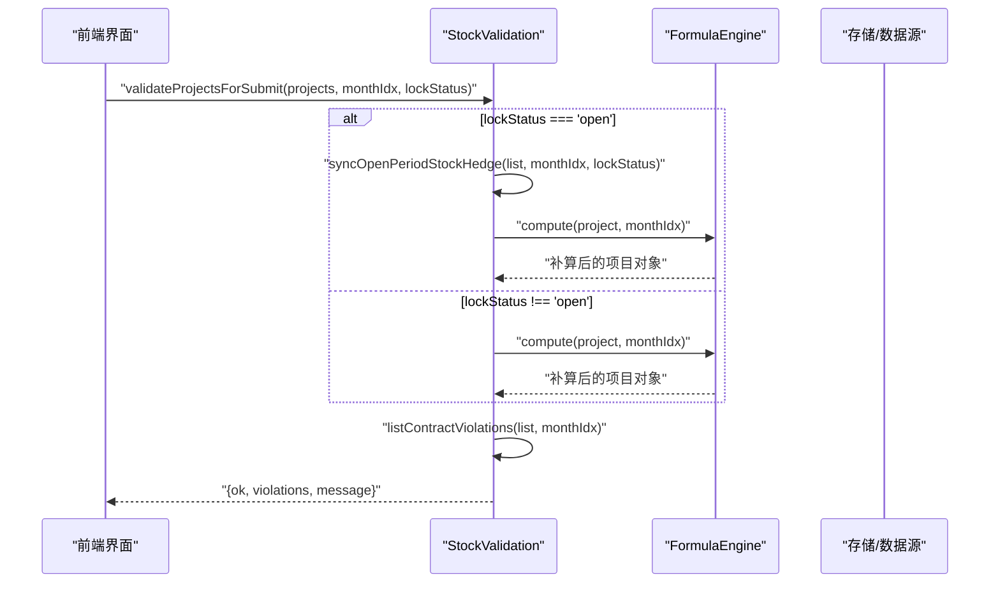
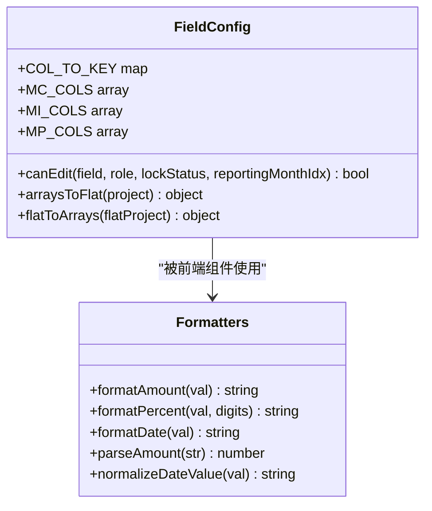
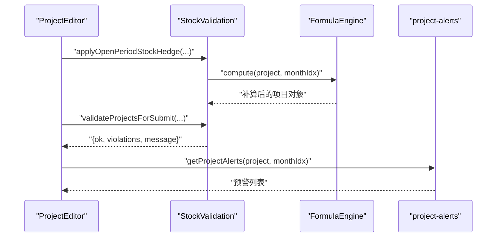
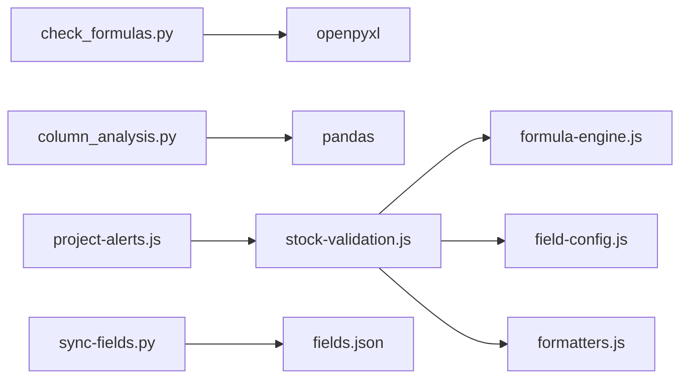

# 数据校验工具

<cite>
**本文档引用的文件**
- [check_formulas.py](file://backup/check_formulas.py)
- [column_analysis.py](file://backup/column_analysis.py)
- [formula-engine.js](file://js/formula-engine.js)
- [stock-validation.js](file://js/stock-validation.js)
- [field-config.js](file://js/field-config.js)
- [formatters.js](file://js/formatters.js)
- [fields.json](file://config/fields/fields.json)
- [sync-fields.py](file://config/fields/sync-fields.py)
- [ProjectEditor.js](file://js/views/ProjectEditor.js)
- [AdminSettings.js](file://js/views/AdminSettings.js)
- [project-alerts.js](file://js/project-alerts.js)
- [sector-workflow.js](file://js/sector-workflow.js)
</cite>

## 目录
1. [简介](#简介)
2. [项目结构](#项目结构)
3. [核心组件](#核心组件)
4. [架构概览](#架构概览)
5. [详细组件分析](#详细组件分析)
6. [依赖分析](#依赖分析)
7. [性能考量](#性能考量)
8. [故障排查指南](#故障排查指南)
9. [结论](#结论)
10. [附录](#附录)

## 简介
本文件面向“数据校验工具”的功能设计与实现，重点涵盖以下方面：
- 公式验证逻辑：检查财务公式正确性、数据依赖关系、计算结果准确性
- 列分析功能：字段分布统计、数据质量评估、异常检测机制
- Python 脚本与 JavaScript 代码的差异与选型理由
- 校验规则设计原理：业务逻辑验证、数据完整性检查、格式规范验证
- 校验报告生成与解读方法，以及发现错误后的修复建议
- 批量数据校验的性能优化策略与错误处理机制

## 项目结构
该项目采用前后端分离架构，数据校验工具主要由两部分组成：
- 备份脚本（Python）：用于离线 Excel 文件的公式扫描与列分析
- 前端校验引擎（JavaScript）：用于在线填报期间的实时校验与提交前校验

图表来源
- [check_formulas.py:1-29](file://backup/check_formulas.py#L1-L29)
- [column_analysis.py:1-45](file://backup/column_analysis.py#L1-L45)
- [formula-engine.js:1-105](file://js/formula-engine.js#L1-L105)
- [stock-validation.js:1-181](file://js/stock-validation.js#L1-L181)
- [field-config.js:1-262](file://js/field-config.js#L1-L262)
- [formatters.js:1-167](file://js/formatters.js#L1-L167)
- [fields.json:1-1101](file://config/fields/fields.json#L1-L1101)
- [sync-fields.py:1-13](file://config/fields/sync-fields.py#L1-L13)
- [ProjectEditor.js:1275-2425](file://js/views/ProjectEditor.js#L1275-L2425)
- [project-alerts.js:68-100](file://js/project-alerts.js#L68-L100)

章节来源
- [check_formulas.py:1-29](file://backup/check_formulas.py#L1-L29)
- [column_analysis.py:1-45](file://backup/column_analysis.py#L1-L45)
- [formula-engine.js:1-105](file://js/formula-engine.js#L1-L105)
- [stock-validation.js:1-181](file://js/stock-validation.js#L1-L181)
- [field-config.js:1-262](file://js/field-config.js#L1-L262)
- [formatters.js:1-167](file://js/formatters.js#L1-L167)
- [fields.json:1-1101](file://config/fields/fields.json#L1-L1101)
- [sync-fields.py:1-13](file://config/fields/sync-fields.py#L1-L13)
- [ProjectEditor.js:1275-2425](file://js/views/ProjectEditor.js#L1275-L2425)
- [project-alerts.js:68-100](file://js/project-alerts.js#L68-L100)

## 核心组件
- 公式扫描器（check_formulas.py）：扫描 Excel 中以“=”开头的单元格，输出公式所在列与标题，辅助定位财务公式问题
- 列分析器（column_analysis.py）：基于 pandas 统计每列的数据行数、唯一值数量与示例，输出列分析报告
- 公式引擎（formula-engine.js）：在线计算财务派生字段，包含合同额、累计完成、不含税金额、WIP、应收账款等
- 存量校验（stock-validation.js）：基于公式引擎结果进行存量开票额与存量合同额的预警与违规校验，支持填报期自动对冲
- 字段配置（field-config.js）：定义字段权限、列映射、数组与扁平键转换，支撑前端编辑与校验
- 格式化工具（formatters.js）：金额、百分比、日期等格式化与解析
- 字段字典（fields.json + sync-fields.py）：字段元数据与前端字典同步
- 前端集成（ProjectEditor.js、project-alerts.js）：将校验结果应用到表格样式与提交流程

章节来源
- [check_formulas.py:1-29](file://backup/check_formulas.py#L1-L29)
- [column_analysis.py:1-45](file://backup/column_analysis.py#L1-L45)
- [formula-engine.js:1-105](file://js/formula-engine.js#L1-L105)
- [stock-validation.js:1-181](file://js/stock-validation.js#L1-L181)
- [field-config.js:1-262](file://js/field-config.js#L1-L262)
- [formatters.js:1-167](file://js/formatters.js#L1-L167)
- [fields.json:1-1101](file://config/fields/fields.json#L1-L1101)
- [sync-fields.py:1-13](file://config/fields/sync-fields.py#L1-L13)
- [ProjectEditor.js:1275-2425](file://js/views/ProjectEditor.js#L1275-L2425)
- [project-alerts.js:68-100](file://js/project-alerts.js#L68-L100)

## 架构概览
整体架构分为三层：
- 数据层：Excel 文件（离线）与数据库（在线）
- 校验层：Python 脚本（离线）、JavaScript 引擎（在线）
- 应用层：前端界面（Luckysheet 表格）、管理员设置、工作流

图表来源
- [check_formulas.py:1-29](file://backup/check_formulas.py#L1-L29)
- [column_analysis.py:1-45](file://backup/column_analysis.py#L1-L45)
- [formula-engine.js:1-105](file://js/formula-engine.js#L1-L105)
- [stock-validation.js:1-181](file://js/stock-validation.js#L1-L181)
- [ProjectEditor.js:1275-2425](file://js/views/ProjectEditor.js#L1275-L2425)
- [AdminSettings.js:1-200](file://js/views/AdminSettings.js#L1-L200)
- [sector-workflow.js:126-157](file://js/sector-workflow.js#L126-L157)

## 详细组件分析

### 组件A：公式验证逻辑（check_formulas.py）
- 功能概述
  - 读取 Excel 工作簿，提取第4行作为表头
  - 遍历第5、6行，查找以“=”开头的单元格，输出其列字母、标题与公式内容
  - 用于快速定位财务公式位置，辅助后续校验与审计
- 关键流程
  - 加载工作簿与活动表
  - 提取表头映射（列字母→中文标题）
  - 遍历指定行，过滤公式并打印定位信息
- 适用场景
  - 离线审计：快速发现公式缺失或异常
  - 与公式引擎联动：确认公式与字段定义一致

图表来源
- [check_formulas.py:1-29](file://backup/check_formulas.py#L1-L29)

章节来源
- [check_formulas.py:1-29](file://backup/check_formulas.py#L1-L29)

### 组件B：列分析功能（column_analysis.py）
- 功能概述
  - 读取 Excel 指定工作表（如 S520），跳过前若干行表头
  - 从第4行提取列标题，建立列索引→标题映射
  - 对每列统计非空数据行数、唯一值数量，并输出示例值
  - 输出到文本文件，便于人工审查与自动化报告
- 关键流程
  - 读取 Excel 为 DataFrame
  - 提取表头并建立映射
  - 遍历每列，过滤空值，统计唯一值并输出样本
- 适用场景
  - 数据质量评估：识别空列、重复值过多、异常值
  - 异常检测：快速发现列级异常（如全空、极少数唯一值）

图表来源
- [column_analysis.py:1-45](file://backup/column_analysis.py#L1-L45)

章节来源
- [column_analysis.py:1-45](file://backup/column_analysis.py#L1-L45)

### 组件C：公式引擎与存量校验（formula-engine.js + stock-validation.js）
- 公式引擎（formula-engine.js）
  - 接收项目对象与报告月份索引，返回补算后的完整项目对象
  - 计算合同额、不含税金额、累计完成、WIP、应收账款等派生字段
  - 支持批量计算（computeAll）
- 存量校验（stock-validation.js）
  - 基于公式引擎结果，判断“存量开票额”与“存量合同额”是否为负
  - 填报期自动对冲：将当月完成额下调使“存量合同额”归零
  - 提交前校验：仅在提交时拦截“存量合同额”为负的项目
  - 提供警告样式与消息提示
- 关键接口
  - compute(project, monthIdx)：单项目计算
  - computeAll(projects, monthIdx)：批量计算
  - validateProjectsForSubmit(projects, monthIdx, lockStatus)：提交前校验
  - applyOpenPeriodStockHedge(project, monthIdx, lockStatus)：填报期自动对冲

图表来源
- [stock-validation.js:131-149](file://js/stock-validation.js#L131-L149)
- [formula-engine.js:88-90](file://js/formula-engine.js#L88-L90)

章节来源
- [formula-engine.js:1-105](file://js/formula-engine.js#L1-L105)
- [stock-validation.js:1-181](file://js/stock-validation.js#L1-L181)

### 组件D：字段配置与格式化（field-config.js + formatters.js）
- 字段配置（field-config.js）
  - 定义字段权限矩阵：哪些角色在何时可编辑哪些列
  - 提供列字母与 JS 字段名映射（COL_TO_KEY）
  - 提供数组与扁平键互转（arraysToFlat / flatToArrays）
  - 提供列索引与月份映射（getMonthlyMonthIndex）
- 格式化工具（formatters.js）
  - 金额、百分比、日期、布尔值格式化
  - 金额解析（parseAmount）
  - 日期标准化（normalizeDateValue）

图表来源
- [field-config.js:196-260](file://js/field-config.js#L196-L260)
- [formatters.js:118-165](file://js/formatters.js#L118-L165)

章节来源
- [field-config.js:1-262](file://js/field-config.js#L1-L262)
- [formatters.js:1-167](file://js/formatters.js#L1-L167)

### 组件E：前端集成与工作流（ProjectEditor.js + project-alerts.js + sector-workflow.js）
- ProjectEditor.js
  - 将 StockValidation 的警告样式应用到单元格
  - 在提交前调用 validateStockBeforeSubmit，触发自动对冲与校验
- project-alerts.js
  - 基于 StockValidation 结果生成项目级预警（如“存量开票额为负”、“存量合同额为负”）
- sector-workflow.js
  - 统计板块工作流状态（提交、审批等），与校验结果结合用于报表与审计

图表来源
- [ProjectEditor.js:1283-1294](file://js/views/ProjectEditor.js#L1283-L1294)
- [stock-validation.js:131-149](file://js/stock-validation.js#L131-L149)
- [project-alerts.js:68-89](file://js/project-alerts.js#L68-L89)

章节来源
- [ProjectEditor.js:1275-2425](file://js/views/ProjectEditor.js#L1275-L2425)
- [project-alerts.js:68-100](file://js/project-alerts.js#L68-L100)
- [sector-workflow.js:126-157](file://js/sector-workflow.js#L126-L157)

## 依赖分析
- Python 脚本依赖
  - openpyxl：读取 Excel 工作簿与活动表
  - re：正则匹配（当前未使用，可移除）
- 列分析依赖
  - pandas：读取 Excel、统计与输出
- JS 引擎依赖
  - FormulaEngine：计算派生字段
  - FieldConfig：字段映射与权限
  - formatters：格式化与解析
  - project-alerts：生成项目级预警
- 配置同步
  - sync-fields.py：将 fields.json 同步为前端可用的 fields-data.js

图表来源
- [check_formulas.py:1-2](file://backup/check_formulas.py#L1-L2)
- [column_analysis.py:1-2](file://backup/column_analysis.py#L1-L2)
- [stock-validation.js:1-181](file://js/stock-validation.js#L1-L181)
- [formula-engine.js:1-105](file://js/formula-engine.js#L1-L105)
- [field-config.js:1-262](file://js/field-config.js#L1-L262)
- [formatters.js:1-167](file://js/formatters.js#L1-L167)
- [project-alerts.js:68-100](file://js/project-alerts.js#L68-L100)
- [sync-fields.py:1-13](file://config/fields/sync-fields.py#L1-L13)
- [fields.json:1-1101](file://config/fields/fields.json#L1-L1101)

章节来源
- [check_formulas.py:1-29](file://backup/check_formulas.py#L1-L29)
- [column_analysis.py:1-45](file://backup/column_analysis.py#L1-L45)
- [stock-validation.js:1-181](file://js/stock-validation.js#L1-L181)
- [formula-engine.js:1-105](file://js/formula-engine.js#L1-L105)
- [field-config.js:1-262](file://js/field-config.js#L1-L262)
- [formatters.js:1-167](file://js/formatters.js#L1-L167)
- [project-alerts.js:68-100](file://js/project-alerts.js#L68-L100)
- [sync-fields.py:1-13](file://config/fields/sync-fields.py#L1-L13)
- [fields.json:1-1101](file://config/fields/fields.json#L1-L1101)

## 性能考量
- Python 批量处理
  - 使用 pandas 的向量化操作（dropna、unique、iloc）提升列分析效率
  - 避免逐行循环，优先使用内置函数
- JS 在线校验
  - computeAll 使用 map 并行计算多个项目
  - applyOpenPeriodStockHedge 仅在 lockStatus 为 open 时触发，减少不必要的计算
- I/O 优化
  - Python 脚本一次性读取整个工作表，避免多次 IO
  - 前端通过 FormulaEngine 一次性补算，减少重复计算
- 内存管理
  - 列分析输出到文件，避免在内存中累积大量文本
  - JS 引擎返回对象而非大数组，降低内存占用

[本节为通用性能建议，无需特定文件来源]

## 故障排查指南
- 公式扫描无结果
  - 检查 Excel 是否存在第4行表头与第5/6行数据
  - 确认公式以“=”开头且未被格式化为文本
- 列分析报告为空
  - 确认工作表名称与 header 参数正确
  - 检查第4行是否包含有效标题
- 提交被拦截
  - 查看 validateProjectsForSubmit 返回的 violations 列表
  - 若处于 open 状态，系统会尝试自动对冲；检查对冲后的完成额是否合理
- 样式未生效
  - 确认 applyLuckysheetStockWarning 调用链路正常
  - 检查 STOCK_WARNING_STYLE 配置是否正确
- 格式化异常
  - 使用 parseAmount 与 formatAmount 统一处理金额输入与展示
  - 日期使用 normalizeDateValue 标准化

章节来源
- [stock-validation.js:131-149](file://js/stock-validation.js#L131-L149)
- [ProjectEditor.js:1275-1281](file://js/views/ProjectEditor.js#L1275-L1281)
- [formatters.js:131-135](file://js/formatters.js#L131-L135)

## 结论
本数据校验工具通过 Python 脚本与 JavaScript 引擎的协同，实现了从离线审计到在线校验的全链路覆盖。公式扫描与列分析为财务数据提供了基础保障，而公式引擎与存量校验确保了业务规则的一致性与合规性。前端集成与工作流进一步提升了用户体验与可追溯性。建议在生产环境中持续完善字段字典、优化批量处理性能，并加强错误处理与日志记录。

[本节为总结性内容，无需特定文件来源]

## 附录

### 校验规则设计原理
- 业务逻辑验证
  - 合同额与累计完成/累计开票的差额应保持非负（或在允许范围内）
  - WIP 与应收账款的计算需遵循会计口径（含税/不含税）
- 数据完整性检查
  - 关键字段（如项目号、合同额、完成额）必须存在
  - 月度列需满足时间窗口编辑规则
- 格式规范验证
  - 金额字段统一使用千分位与两位小数
  - 日期字段统一为 YYYY-MM-DD
  - 分类字段使用枚举值，避免自由文本冲突

章节来源
- [fields.json:1-1101](file://config/fields/fields.json#L1-L1101)
- [field-config.js:104-122](file://js/field-config.js#L104-L122)
- [formatters.js:13-45](file://js/formatters.js#L13-L45)

### 校验报告生成与解读
- Python 报告
  - 公式扫描：输出列字母、标题与公式，便于定位问题
  - 列分析：输出每列的非空行数、唯一值数量与示例，辅助质量评估
- JS 报告
  - 提交前校验：返回 violations 列表与提示信息
  - 项目级预警：基于 StockValidation 结果生成预警标签
- 报告解读
  - 公式扫描：优先处理缺失或错误的财务公式
  - 列分析：关注唯一值比例异常、空列、异常值
  - JS 校验：优先处理“存量合同额为负”的项目

章节来源
- [check_formulas.py:17-29](file://backup/check_formulas.py#L17-L29)
- [column_analysis.py:20-43](file://backup/column_analysis.py#L20-L43)
- [stock-validation.js:131-149](file://js/stock-validation.js#L131-L149)
- [project-alerts.js:68-89](file://js/project-alerts.js#L68-L89)

### 发现错误后的修复建议
- 公式错误
  - 使用公式扫描结果定位列，核对字段定义与公式逻辑
  - 与字段字典（fields.json）对照，确保列映射正确
- 数据质量问题
  - 对唯一值比例异常的列，检查是否存在拼写差异或格式不一致
  - 对空列，确认是否应删除或补充数据
- 校验拦截
  - 若“存量合同额为负”，在提交前调减当月完成额或先在 CRB 办理合同变更
  - 填报期系统会自动对冲，需确认对冲后的数据合理性

章节来源
- [fields.json:1-1101](file://config/fields/fields.json#L1-L1101)
- [stock-validation.js:75-92](file://js/stock-validation.js#L75-L92)
- [stock-validation.js:131-149](file://js/stock-validation.js#L131-L149)

### Python 与 JavaScript 的差异与选型理由
- Python 优势
  - pandas 提供高效的列分析与统计能力
  - openpyxl 适合离线 Excel 处理与审计
  - 易于生成报告与导出结果
- JavaScript 优势
  - 实时在线校验，提升用户体验
  - 与前端框架深度集成，样式与交互更灵活
  - 支持批量计算与自动对冲
- 选型原则
  - 离线审计与批量分析使用 Python
  - 在线填报与提交校验使用 JavaScript

章节来源
- [check_formulas.py:1-29](file://backup/check_formulas.py#L1-L29)
- [column_analysis.py:1-45](file://backup/column_analysis.py#L1-L45)
- [formula-engine.js:1-105](file://js/formula-engine.js#L1-L105)
- [stock-validation.js:1-181](file://js/stock-validation.js#L1-L181)