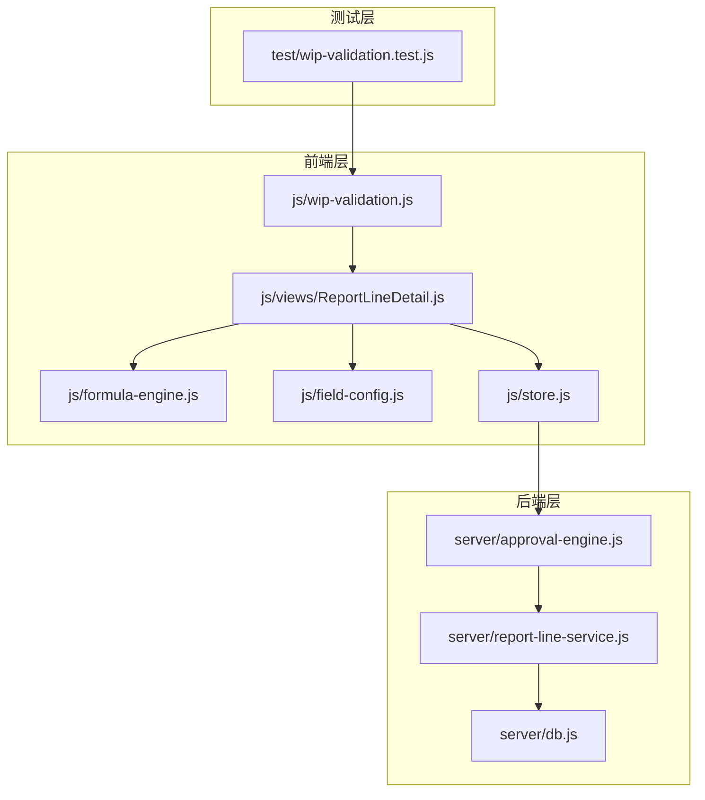
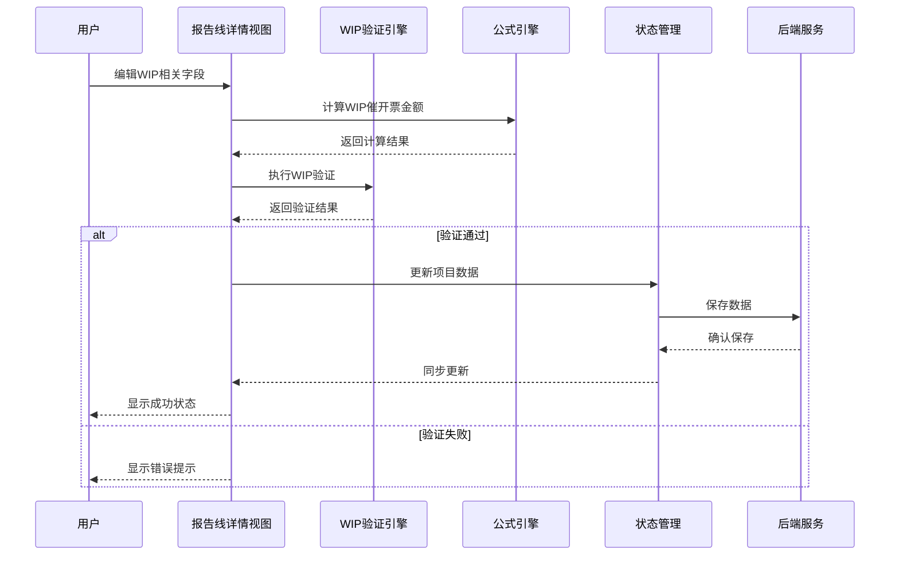
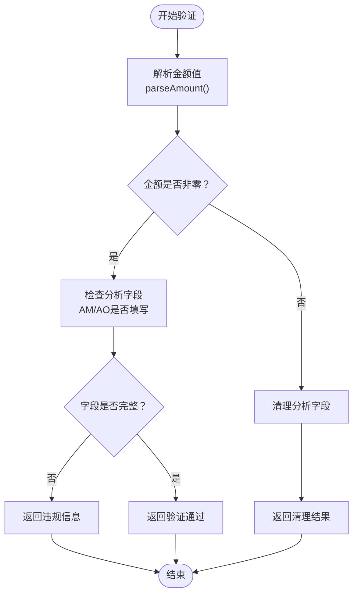
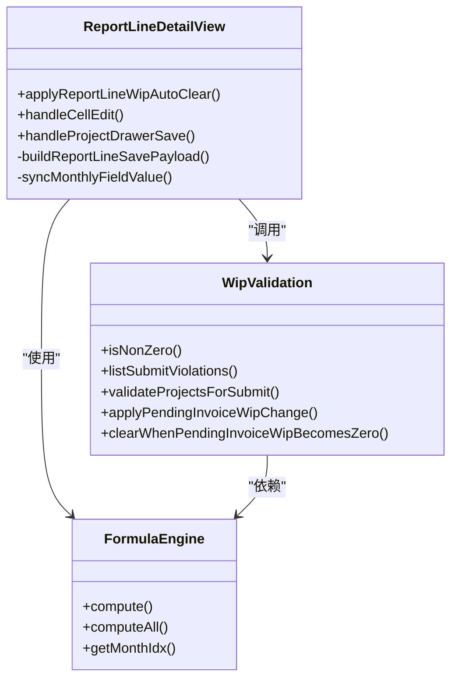
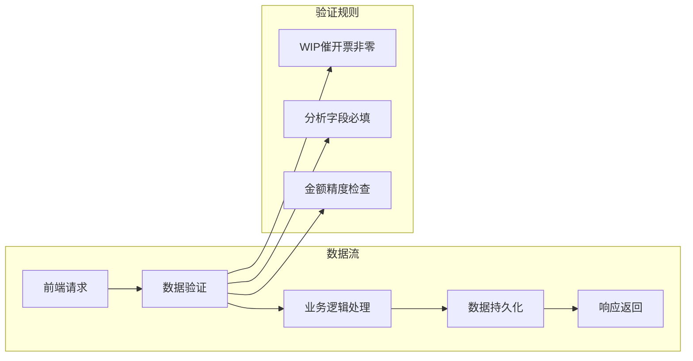
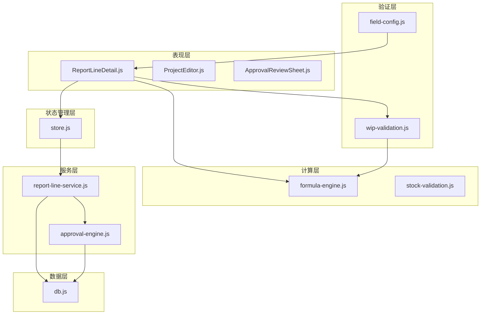

# WIP验证系统

<cite>
**本文档引用的文件**
- [wip-validation.js](file://js/wip-validation.js)
- [wip-validation.test.js](file://test/wip-validation.test.js)
- [ReportLineDetail.js](file://js/views/ReportLineDetail.js)
- [formula-engine.js](file://js/formula-engine.js)
- [field-config.js](file://js/field-config.js)
- [approval-engine.js](file://server/approval-engine.js)
- [report-line-service.js](file://server/report-line-service.js)
- [db.js](file://server/db.js)
- [store.js](file://js/store.js)
</cite>

## 目录
1. [简介](#简介)
2. [项目结构](#项目结构)
3. [核心组件](#核心组件)
4. [架构概览](#架构概览)
5. [详细组件分析](#详细组件分析)
6. [依赖关系分析](#依赖关系分析)
7. [性能考虑](#性能考虑)
8. [故障排除指南](#故障排除指南)
9. [结论](#结论)

## 简介

WIP验证系统是一个专门设计用于项目追踪表线上化的质量保证机制，主要负责监控和验证WIP（在产品）催开票状态的合规性。该系统通过自动化校验确保当WIP催开票金额非零时，相关的分析字段得到正确填写，从而维护财务数据的准确性和完整性。

该系统采用前后端分离的架构设计，前端负责用户界面交互和实时数据验证，后端提供数据存储和业务逻辑处理。系统特别关注WIP催开票字段（AL）与相关分析字段（AM、AN、AO）之间的逻辑关系，确保业务流程的规范执行。

## 项目结构

项目采用模块化组织方式，主要分为以下几个核心部分：

**图表来源**
- [wip-validation.js:1-105](file://js/wip-validation.js#L1-L105)
- [ReportLineDetail.js:1-800](file://js/views/ReportLineDetail.js#L1-L800)
- [approval-engine.js:1-332](file://server/approval-engine.js#L1-L332)

**章节来源**
- [wip-validation.js:1-105](file://js/wip-validation.js#L1-L105)
- [ReportLineDetail.js:1-800](file://js/views/ReportLineDetail.js#L1-L800)

## 核心组件

### WIP验证引擎

WIP验证引擎是系统的核心组件，负责实现WIP催开票状态的自动化验证逻辑。该引擎提供了完整的验证、清理和状态转换功能。

**关键特性：**
- **双重验证机制**：支持实时输入验证和提交前批量验证
- **智能清理功能**：当WIP催开票金额变为零时，自动清理相关分析字段
- **精度控制**：使用EPS常量（0.005）处理浮点数精度问题
- **字段映射**：清晰定义了WIP相关字段的键名映射关系

**章节来源**
- [wip-validation.js:14-104](file://js/wip-validation.js#L14-L104)

### 报告线详情视图

报告线详情视图集成了WIP验证功能，实现了用户界面与业务逻辑的无缝集成。该组件负责处理用户输入、执行实时验证，并提供相应的反馈信息。

**核心功能：**
- **实时WIP验证**：在用户编辑WIP相关字段时进行即时验证
- **自动清理机制**：当WIP催开票金额变为零时自动清理分析字段
- **变更跟踪**：记录所有字段变更并提供可视化反馈
- **公式计算集成**：与公式引擎协同工作，确保数据一致性

**章节来源**
- [ReportLineDetail.js:348-370](file://js/views/ReportLineDetail.js#L348-L370)
- [ReportLineDetail.js:428-456](file://js/views/ReportLineDetail.js#L428-L456)

### 公式引擎

公式引擎负责计算项目追踪表中的各种财务指标，包括WIP催开票金额的计算。该引擎确保所有衍生字段的计算准确性和一致性。

**计算逻辑：**
- **WIP催开票金额**：基于累计完成额与累计开票额的差值计算
- **相关财务指标**：包括应收账款、合同差值等多个财务指标
- **时间维度处理**：支持12个月度数据的累积计算

**章节来源**
- [formula-engine.js:19-83](file://js/formula-engine.js#L19-L83)

## 架构概览

系统采用分层架构设计，确保各组件职责明确、耦合度低：

**图表来源**
- [ReportLineDetail.js:428-456](file://js/views/ReportLineDetail.js#L428-L456)
- [wip-validation.js:76-92](file://js/wip-validation.js#L76-L92)

## 详细组件分析

### WIP验证算法详解

WIP验证系统的核心算法基于严格的数学逻辑和业务规则：

**图表来源**
- [wip-validation.js:38-92](file://js/wip-validation.js#L38-L92)

#### 关键算法实现

**金额解析函数** (`parseAmount`)
- 处理空值和空白字符
- 支持千分位分隔符去除
- 提供默认值处理

**非零判断函数** (`isNonZero`)
- 使用EPS常量（0.005）处理浮点数精度
- 确保小数值被正确识别为零

**字段清理机制**
- 自动清理WIP形成原因相关字段
- 支持批量字段清理操作
- 保持数据一致性

**章节来源**
- [wip-validation.js:20-92](file://js/wip-validation.js#L20-L92)

### 前端集成实现

报告线详情视图通过以下机制集成WIP验证功能：

**图表来源**
- [ReportLineDetail.js:348-370](file://js/views/ReportLineDetail.js#L348-L370)
- [wip-validation.js:94-104](file://js/wip-validation.js#L94-L104)

#### 实时验证流程

前端实现实时验证的关键流程：

1. **用户输入监听**：捕获WIP相关字段的变更事件
2. **公式重新计算**：调用公式引擎重新计算相关指标
3. **验证执行**：调用WIP验证引擎进行合规性检查
4. **自动清理**：如需清理相关字段则执行清理操作
5. **状态更新**：更新UI状态并提供用户反馈

**章节来源**
- [ReportLineDetail.js:372-456](file://js/views/ReportLineDetail.js#L372-L456)

### 后端数据处理

后端服务提供完整的数据持久化和业务逻辑处理：

**图表来源**
- [report-line-service.js:829-891](file://server/report-line-service.js#L829-L891)

**章节来源**
- [report-line-service.js:829-1015](file://server/report-line-service.js#L829-L1015)

## 依赖关系分析

系统各组件之间的依赖关系体现了清晰的分层架构：

**图表来源**
- [ReportLineDetail.js:1-800](file://js/views/ReportLineDetail.js#L1-L800)
- [wip-validation.js:1-105](file://js/wip-validation.js#L1-L105)
- [store.js:596-701](file://js/store.js#L596-L701)

### 关键依赖关系

**前端到验证层的依赖**：
- 报告线详情视图直接依赖WIP验证引擎
- 字段配置模块提供权限控制支持
- 公式引擎为验证提供数据基础

**后端到数据层的依赖**：
- 报告线服务依赖数据库访问层
- 审批引擎依赖用户和配置元数据
- 数据库层提供完整的事务支持

**章节来源**
- [store.js:631-641](file://js/store.js#L631-L641)
- [db.js:11-149](file://server/db.js#L11-L149)

## 性能考虑

系统在设计时充分考虑了性能优化和用户体验：

### 内存管理
- 使用对象浅拷贝避免不必要的深度克隆
- 合理的数组操作减少内存分配
- 及时清理不需要的数据引用

### 计算优化
- 公式计算采用增量更新策略
- 验证逻辑使用短路求值
- 批量操作支持延迟执行

### 网络优化
- 前端状态管理减少不必要的API调用
- 数据缓存机制提升响应速度
- 错误处理优化用户体验

## 故障排除指南

### 常见问题及解决方案

**WIP验证失败**
- 检查WIP催开票金额是否正确计算
- 确认分析字段是否完整填写
- 验证金额精度是否符合要求

**自动清理异常**
- 检查字段映射配置是否正确
- 确认公式计算结果是否准确
- 验证清理逻辑的触发条件

**性能问题**
- 监控公式计算的执行时间
- 检查前端渲染性能
- 优化数据库查询操作

**章节来源**
- [wip-validation.test.js:6-21](file://test/wip-validation.test.js#L6-L21)
- [wip-validation.test.js:23-38](file://test/wip-validation.test.js#L23-L38)

## 结论

WIP验证系统通过精心设计的架构和严格的业务逻辑，为项目追踪表线上化提供了可靠的质量保障。系统的主要优势包括：

**设计优势**：
- 清晰的分层架构确保了良好的可维护性
- 自动化的验证机制减少了人工错误
- 实时反馈提升了用户体验

**业务价值**：
- 确保财务数据的准确性和完整性
- 提高项目管理的透明度和可控性
- 降低业务风险和合规成本

**技术特色**：
- 智能的字段清理机制
- 精确的金额处理逻辑
- 完善的错误处理和恢复机制

该系统为项目追踪表线上化奠定了坚实的技术基础，为后续的功能扩展和业务发展提供了良好的支撑。