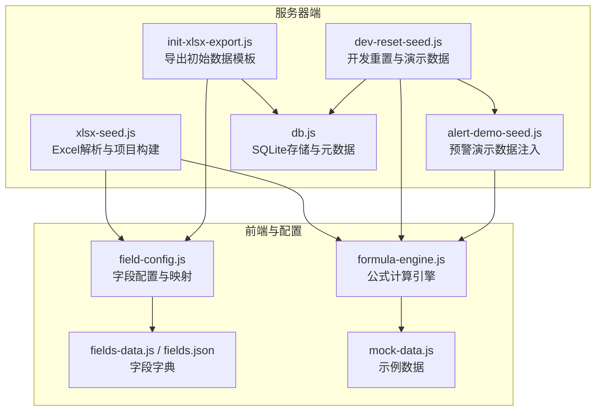
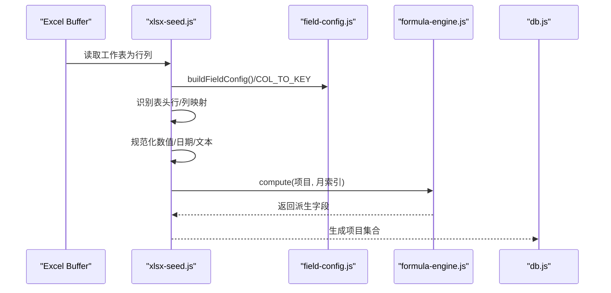
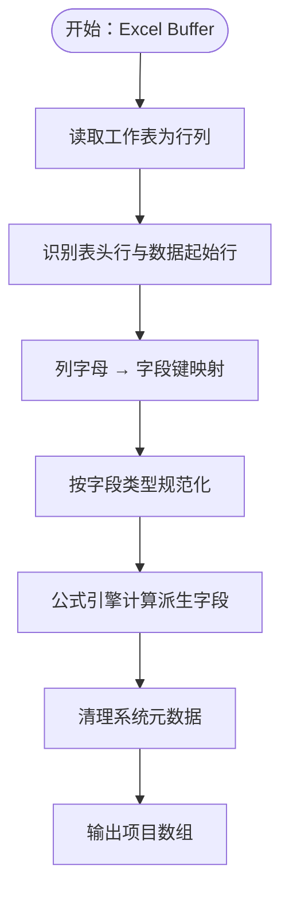
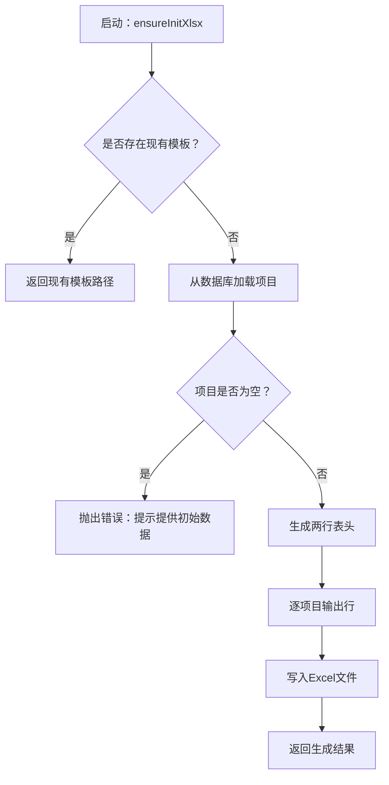
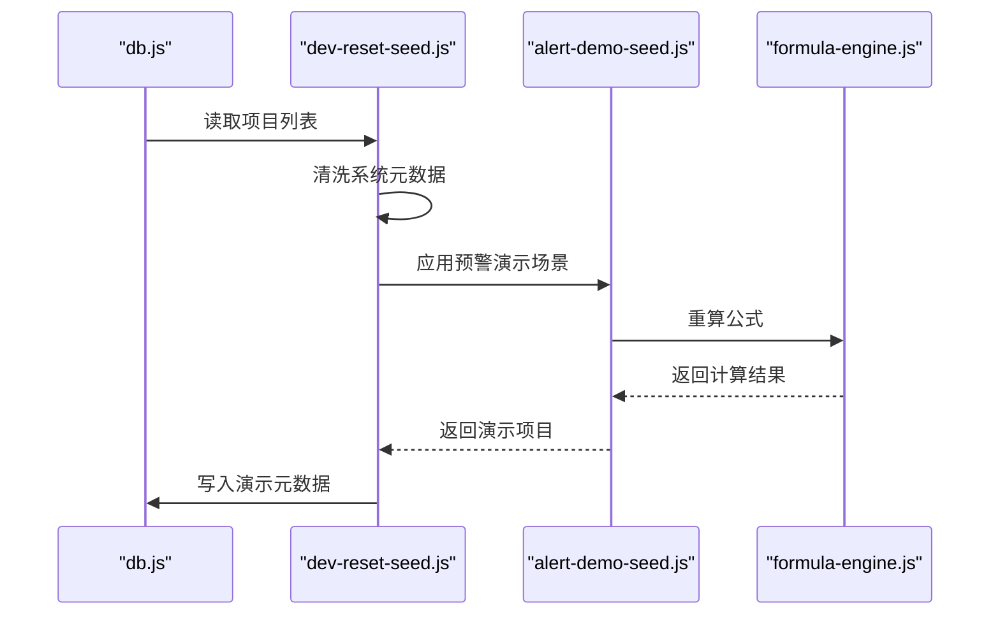
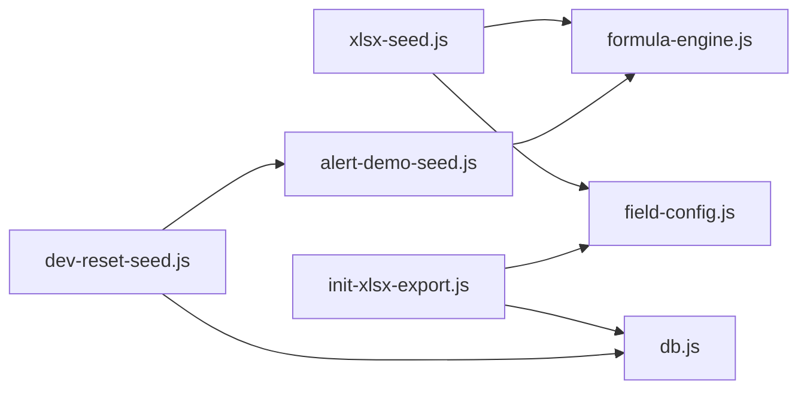

# 数据种子初始化

<cite>
**本文引用的文件**
- [xlsx-seed.js](file://server/xlsx-seed.js)
- [init-xlsx-export.js](file://server/init-xlsx-export.js)
- [dev-reset-seed.js](file://server/dev-reset-seed.js)
- [alert-demo-seed.js](file://server/alert-demo-seed.js)
- [fields-data.js](file://config/fields/fields-data.js)
- [fields.json](file://config/fields/fields.json)
- [field-config.js](file://js/field-config.js)
- [formula-engine.js](file://js/formula-engine.js)
- [db.js](file://server/db.js)
- [mock-data.js](file://js/mock-data.js)
- [初始数据.xlsx](file://初始数据.xlsx)
</cite>

## 目录
1. [简介](#简介)
2. [项目结构](#项目结构)
3. [核心组件](#核心组件)
4. [架构总览](#架构总览)
5. [详细组件分析](#详细组件分析)
6. [依赖关系分析](#依赖关系分析)
7. [性能考量](#性能考量)
8. [故障排查指南](#故障排查指南)
9. [结论](#结论)
10. [附录](#附录)

## 简介
本文件围绕“数据种子初始化”主题，系统性阐述以下内容：
- 如何基于 Excel 模板生成初始项目数据（xlsx-seed.js 的解析与映射逻辑）
- 导出模板的设计（init-xlsx-export.js 的表头结构、字段排列与样式配置）
- 数据种子在系统初始化中的作用与对新用户的帮助
- 数据质量保证机制、默认值设置与一致性检查
- 自定义数据种子的方法与最佳实践

## 项目结构
与数据种子初始化直接相关的模块分布如下：
- 服务器端数据处理与导出：server/xlsx-seed.js、server/init-xlsx-export.js、server/dev-reset-seed.js、server/alert-demo-seed.js、server/db.js
- 字段元数据与映射：config/fields/fields-data.js、config/fields/fields.json、js/field-config.js
- 前端公式引擎与示例数据：js/formula-engine.js、js/mock-data.js
- 初始数据模板：初始数据.xlsx

图表来源
- [xlsx-seed.js:1-130](file://server/xlsx-seed.js#L1-L130)
- [init-xlsx-export.js:1-112](file://server/init-xlsx-export.js#L1-L112)
- [dev-reset-seed.js:1-144](file://server/dev-reset-seed.js#L1-L144)
- [alert-demo-seed.js:1-176](file://server/alert-demo-seed.js#L1-L176)
- [field-config.js:1-262](file://js/field-config.js#L1-L262)
- [formula-engine.js:1-105](file://js/formula-engine.js#L1-L105)
- [fields-data.js:1-1101](file://config/fields/fields-data.js#L1-L1101)
- [fields.json:1-1101](file://config/fields/fields.json#L1-L1101)
- [db.js:1-200](file://server/db.js#L1-L200)
- [mock-data.js:1-748](file://js/mock-data.js#L1-L748)

章节来源
- [xlsx-seed.js:1-130](file://server/xlsx-seed.js#L1-L130)
- [init-xlsx-export.js:1-112](file://server/init-xlsx-export.js#L1-L112)
- [dev-reset-seed.js:1-144](file://server/dev-reset-seed.js#L1-L144)
- [alert-demo-seed.js:1-176](file://server/alert-demo-seed.js#L1-L176)
- [field-config.js:1-262](file://js/field-config.js#L1-L262)
- [formula-engine.js:1-105](file://js/formula-engine.js#L1-L105)
- [fields-data.js:1-1101](file://config/fields/fields-data.js#L1-L1101)
- [fields.json:1-1101](file://config/fields/fields.json#L1-L1101)
- [db.js:1-200](file://server/db.js#L1-L200)
- [mock-data.js:1-748](file://js/mock-data.js#L1-L748)

## 核心组件
- Excel 解析与项目构建（xlsx-seed.js）
  - 读取 Excel Buffer，解析工作表为行列结构
  - 识别表头行，建立列到字段键的映射
  - 按字段类型进行数值/日期/文本规范化
  - 计算派生字段，生成可用于系统的项目对象集合
- 初始数据模板导出（init-xlsx-export.js）
  - 从数据库导出项目，生成符合字段字典的两行表头
  - 输出到“初始数据.xlsx”，便于后续导入
- 开发重置与演示数据（dev-reset-seed.js + alert-demo-seed.js）
  - 清洗元数据、应用预警演示场景、生成演示新增项目集合
  - 支持稳定的演示环境，便于新用户理解系统行为
- 字段配置与映射（field-config.js + fields-data.json）
  - 提供列字母到字段键的映射、字段分组、权限与宽度等配置
- 公式引擎（formula-engine.js）
  - 基于报告月份索引计算派生字段，确保数据一致性
- 示例数据（mock-data.js）
  - 提供20条覆盖典型场景的示例项目，辅助理解字段含义与计算

章节来源
- [xlsx-seed.js:71-127](file://server/xlsx-seed.js#L71-L127)
- [init-xlsx-export.js:31-103](file://server/init-xlsx-export.js#L31-L103)
- [dev-reset-seed.js:62-118](file://server/dev-reset-seed.js#L62-L118)
- [alert-demo-seed.js:40-78](file://server/alert-demo-seed.js#L40-L78)
- [field-config.js:196-261](file://js/field-config.js#L196-L261)
- [formula-engine.js:19-83](file://js/formula-engine.js#L19-L83)
- [mock-data.js:16-748](file://js/mock-data.js#L16-L748)

## 架构总览
数据种子初始化的关键流程如下：
- 导入路径：Excel Buffer → 行列结构 → 字段映射 → 规范化 → 公式计算 → 项目集合
- 导出路径：数据库项目 → 字段映射 → 两行表头 → 写入 Excel 文件

图表来源
- [xlsx-seed.js:71-127](file://server/xlsx-seed.js#L71-L127)
- [field-config.js:134-155](file://js/field-config.js#L134-L155)
- [formula-engine.js:19-83](file://js/formula-engine.js#L19-L83)
- [db.js:17-57](file://server/db.js#L17-L57)

## 详细组件分析

### Excel 数据生成与映射（xlsx-seed.js）
- 表头识别与数据起始行定位
  - 通过扫描前若干行，查找包含“项目号/Project No”的行作为表头
  - 默认回退策略确保在缺失表头时仍能解析
- 列到字段键映射
  - 使用字段字典提供的列字母到字段键映射，将单元格值映射到项目对象
  - 对 mc_/mi_/mp_ 类字段（月度完成/开票/回款）统一转换为数值
- 数据类型规范化
  - 金额/比率：统一转换为数值
  - 日期：支持 Excel 序列日、ISO 日期字符串、数字序列日等格式
  - 文本：统一为字符串，空值转为空字符串
- 派生字段与一致性
  - 计算签认状态、新增年份、系统元数据清理
  - 使用公式引擎计算派生字段，确保与前端一致
- 输出
  - 返回项目数组，供导入或导出使用

图表来源
- [xlsx-seed.js:15-127](file://server/xlsx-seed.js#L15-L127)

章节来源
- [xlsx-seed.js:15-127](file://server/xlsx-seed.js#L15-L127)

### 导出模板设计（init-xlsx-export.js）
- 模板候选与定位
  - 支持通过环境变量指定模板路径，否则回退到默认路径与参考模板
- 表头结构
  - 两行表头：第一行为分组标题，第二行为字段中文名
  - 依据字段分组（section）生成表头区域范围
- 字段排列与样式
  - 按字段字典顺序输出列，保持与导入一致
  - 日期字段截断为“YYYY-MM-DD”
- 输出与回退
  - 若数据库为空，抛出错误提示，引导用户提供初始数据或完成导入
  - 成功导出后返回路径、数量与工作表名

图表来源
- [init-xlsx-export.js:79-103](file://server/init-xlsx-export.js#L79-L103)

章节来源
- [init-xlsx-export.js:12-103](file://server/init-xlsx-export.js#L12-L103)

### 开发重置与演示数据（dev-reset-seed.js + alert-demo-seed.js）
- 开发重置流程
  - 从数据库读取项目，清洗系统元数据
  - 注入预警演示场景，生成演示新增项目集合
  - 写入元数据（演示项目号、预警项目号、版本信息等）
- 预警演示场景
  - 注入不同类型的预警项目（如库存为负、无完成额但有工时等）
  - 重算公式，确保演示数据与系统计算一致
- 导入快照
  - 可选地创建“I版基线”快照（排除演示新增项目）

图表来源
- [dev-reset-seed.js:62-118](file://server/dev-reset-seed.js#L62-L118)
- [alert-demo-seed.js:40-78](file://server/alert-demo-seed.js#L40-L78)
- [formula-engine.js:19-83](file://js/formula-engine.js#L19-L83)

章节来源
- [dev-reset-seed.js:62-118](file://server/dev-reset-seed.js#L62-L118)
- [alert-demo-seed.js:40-78](file://server/alert-demo-seed.js#L40-L78)

### 字段映射与配置（field-config.js + fields-data.json）
- 列到字段键映射
  - 提供 COL_TO_KEY 映射，将 Excel 列字母映射到项目对象字段键
- 字段分组与权限
  - 按 section 分组，提供编辑权限与列宽等配置
- 月度字段与时间窗
  - 月度完成/开票/回款列与报告月索引的关系，决定可编辑时间窗

章节来源
- [field-config.js:196-261](file://js/field-config.js#L196-L261)
- [fields-data.js:1-1101](file://config/fields/fields-data.js#L1-L1101)
- [fields.json:1-1101](file://config/fields/fields.json#L1-L1101)

### 公式引擎与示例数据（formula-engine.js + mock-data.js）
- 公式引擎
  - 基于报告月索引计算派生字段，确保前后端一致
- 示例数据
  - 提供20条覆盖典型场景的示例项目，便于理解字段含义与计算

章节来源
- [formula-engine.js:19-83](file://js/formula-engine.js#L19-L83)
- [mock-data.js:16-748](file://js/mock-data.js#L16-L748)

## 依赖关系分析
- 组件耦合
  - xlsx-seed.js 依赖 field-config.js 的字段字典与映射
  - xlsx-seed.js 依赖 formula-engine.js 的计算能力
  - init-xlsx-export.js 依赖 field-config.js 与 snapshot-service（内部模块）以生成两行表头
  - dev-reset-seed.js 依赖 alert-demo-seed.js 与 db.js
- 外部依赖
  - XLSX 库用于 Excel 解析与写入
  - better-sqlite3 用于本地数据库操作

图表来源
- [xlsx-seed.js:71-127](file://server/xlsx-seed.js#L71-L127)
- [init-xlsx-export.js:31-103](file://server/init-xlsx-export.js#L31-L103)
- [dev-reset-seed.js:62-118](file://server/dev-reset-seed.js#L62-L118)
- [alert-demo-seed.js:40-78](file://server/alert-demo-seed.js#L40-L78)

章节来源
- [xlsx-seed.js:71-127](file://server/xlsx-seed.js#L71-L127)
- [init-xlsx-export.js:31-103](file://server/init-xlsx-export.js#L31-L103)
- [dev-reset-seed.js:62-118](file://server/dev-reset-seed.js#L62-L118)
- [alert-demo-seed.js:40-78](file://server/alert-demo-seed.js#L40-L78)

## 性能考量
- Excel 解析
  - sheetToRows 采用双层循环遍历单元格，复杂度 O(R×C)，其中 R 为行数，C 为列数
  - 建议控制单次导入行数上限，避免超大工作表导致内存压力
- 字段映射与规范化
  - 字典查找与类型转换为 O(1)，整体开销较小
- 公式计算
  - 每个项目计算派生字段为 O(M)，M 为月度字段数量（12）
  - 批量计算时注意并发与内存占用
- 导出
  - 两行表头 + 逐项目输出，内存占用与项目数量线性相关

[本节为通用性能建议，不直接分析具体文件]

## 故障排查指南
- “未找到初始数据.xlsx（或 S520 源表 / PTRACK_INIT_XLSX），且项目库为空，无法自动生成”
  - 现象：首次运行或缺少模板时，导出函数抛出错误
  - 处理：将“初始数据.xlsx”置于项目根目录，或先完成一次数据导入
- “项目库为空，无法生成演示数据”
  - 现象：开发重置流程在数据库为空时抛错
  - 处理：先导入有效项目数据，再执行重置流程
- Excel 日期解析异常
  - 现象：日期字段显示为原始值或空
  - 处理：确保日期格式为 ISO 或 Excel 序列日；检查 normalizeDateValue 的输入范围
- 字段映射错误
  - 现象：某些列未正确映射到字段键
  - 处理：核对字段字典中的列字母与表头是否一致；检查 COL_TO_KEY 映射

章节来源
- [init-xlsx-export.js:88-95](file://server/init-xlsx-export.js#L88-L95)
- [dev-reset-seed.js:69-71](file://server/dev-reset-seed.js#L69-L71)
- [xlsx-seed.js:50-64](file://server/xlsx-seed.js#L50-L64)
- [field-config.js:196-261](file://js/field-config.js#L196-L261)

## 结论
数据种子初始化通过“导入解析 + 导出模板 + 开发重置 + 演示注入”的闭环，实现了：
- 与前端字段字典与公式引擎完全对齐的数据一致性
- 便于新用户快速上手的初始模板与示例数据
- 可靠的质量保证与错误提示机制
- 可扩展的自定义种子方法与最佳实践

[本节为总结性内容，不直接分析具体文件]

## 附录

### 数据种子在系统初始化中的作用
- 为新部署提供可导入的初始数据模板
- 通过开发重置流程生成演示环境，降低学习成本
- 与前端字段字典和公式引擎保持一致，确保导入后即可正常使用

章节来源
- [init-xlsx-export.js:79-103](file://server/init-xlsx-export.js#L79-L103)
- [dev-reset-seed.js:62-118](file://server/dev-reset-seed.js#L62-L118)

### 数据质量保证机制与默认值
- 规范化处理
  - 金额/比率统一为数值
  - 日期支持多种格式并标准化
  - 文本统一为字符串
- 默认值与回退
  - 缺失表头时的默认起始行回退
  - 未设置签认状态时的默认推断
- 一致性检查
  - 公式引擎统一计算派生字段
  - 导出模板严格遵循字段字典顺序

章节来源
- [xlsx-seed.js:41-127](file://server/xlsx-seed.js#L41-L127)
- [init-xlsx-export.js:31-68](file://server/init-xlsx-export.js#L31-L68)
- [formula-engine.js:19-83](file://js/formula-engine.js#L19-L83)

### 自定义数据种子的方法与最佳实践
- 自定义字段映射
  - 修改字段字典（fields-data.js/fields.json）以适配业务字段
  - 更新 COL_TO_KEY 映射，确保列字母与字段键一致
- 自定义导入模板
  - 保持两行表头结构与字段顺序
  - 确保日期与数值格式符合规范化要求
- 自定义演示数据
  - 使用 dev-reset-seed.js 的模式，注入特定场景项目
  - 通过 alert-demo-seed.js 的方式重算公式并写入元数据
- 最佳实践
  - 先在小范围内验证导入/导出流程
  - 使用 mock-data.js 的示例项目作为对照
  - 在生产环境前进行一致性校验

章节来源
- [field-config.js:196-261](file://js/field-config.js#L196-L261)
- [fields-data.js:1-1101](file://config/fields/fields-data.js#L1-L1101)
- [fields.json:1-1101](file://config/fields/fields.json#L1-L1101)
- [dev-reset-seed.js:62-118](file://server/dev-reset-seed.js#L62-L118)
- [alert-demo-seed.js:40-78](file://server/alert-demo-seed.js#L40-L78)
- [mock-data.js:16-748](file://js/mock-data.js#L16-L748)