# 数据库设计

<cite>
**本文引用的文件**
- [database-schema.sql](file://database-schema.sql)
- [database-schema-design.md](file://database-schema-design.md)
- [server/db.js](file://server/db.js)
- [server/index.js](file://server/index.js)
- [server/platform-sync.js](file://server/platform-sync.js)
- [server/snapshot-service.js](file://server/snapshot-service.js)
- [server/sector-workflow.js](file://server/sector-workflow.js)
- [server/alert-service.js](file://server/alert-service.js)
- [server/alert-demo-seed.js](file://server/alert-demo-seed.js)
- [server/patch-init-xlsx-alerts.js](file://server/patch-init-xlsx-alerts.js)
- [js/project-alerts.js](file://js/project-alerts.js)
- [docs/设计文档/DASHBOARD.md](file://docs/设计文档/DASHBOARD.md)
</cite>

## 目录
1. [简介](#简介)
2. [项目结构](#项目结构)
3. [核心组件](#核心组件)
4. [架构总览](#架构总览)
5. [详细组件分析](#详细组件分析)
6. [依赖分析](#依赖分析)
7. [性能考量](#性能考量)
8. [故障排查指南](#故障排查指南)
9. [结论](#结论)
10. [附录](#附录)

## 简介
本文件基于仓库中的数据库脚本与服务端实现，系统化梳理了项目追踪表线上化的数据库设计。重点包括：
- 数据模型与表结构：项目主表、月度填报记录、年度基线、预收款核销、审计日志、审批快照、元数据与辅助表
- **新增**：项目预警系统（project_alerts、project_alert_dismissals表）及其状态管理机制
- 关系映射与完整性：主外键、唯一约束、索引设计与数据一致性保障
- ER 图与表结构图：直观展示实体间关系与数据流向
- 权衡考虑与优化策略：字段拆分、JSON 存储、快照不可变性、审计双层设计
- 迁移方案与维护建议：从现有 JSON 结构向结构化表演进的路径与最佳实践

## 项目结构
数据库相关代码主要分布在以下位置：
- database-schema.sql：标准 SQL 表结构定义（含注释与索引）
- server/db.js：SQLite 连接、基础表与元数据表的初始化、常用 CRUD 封装
- server/index.js：应用入口，提供 API 与调度平台同步、导入/重置等流程
- server/platform-sync.js：平台数据同步与字段映射、年度翻转逻辑
- server/snapshot-service.js：快照生成与维护（I/D/J 版本体系）
- server/sector-workflow.js：板块工作流与快照版本解析
- **新增**：server/alert-service.js：预警聚合服务，负责批量计算和同步预警状态
- **新增**：server/alert-demo-seed.js：预警演示数据种子，提供四种预警类型的演示场景
- **新增**：server/patch-init-xlsx-alerts.js：将预警演示字段写回初始数据Excel文件
- **新增**：js/project-alerts.js：前端预警计算逻辑，包含四种预警类型的检测算法
- database-schema-design.md：设计说明与迁移策略
- docs/设计文档/DASHBOARD.md：看板与指标口径规范（间接指导数据质量与一致性）

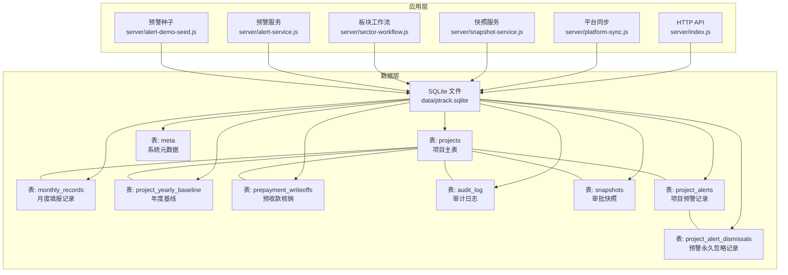

**图表来源**
- [server/index.js:1-775](file://server/index.js#L1-L775)
- [server/db.js:1-667](file://server/db.js#L1-L667)
- [server/platform-sync.js:1-272](file://server/platform-sync.js#L1-L272)
- [server/snapshot-service.js:1-292](file://server/snapshot-service.js#L1-L292)
- [server/sector-workflow.js:1-273](file://server/sector-workflow.js#L1-L273)
- [server/alert-service.js:1-336](file://server/alert-service.js#L1-L336)
- [server/alert-demo-seed.js:1-176](file://server/alert-demo-seed.js#L1-L176)

**章节来源**
- [database-schema.sql:1-331](file://database-schema.sql#L1-L331)
- [server/db.js:1-667](file://server/db.js#L1-L667)
- [server/index.js:1-775](file://server/index.js#L1-L775)

## 核心组件
- 项目主表 projects：存储项目核心信息、系统同步字段、计算字段、元数据与审批状态
- 月度填报记录 monthly_records：逐月手工填报数据，支持历史追溯与月度清零重置
- 年度基线 project_yearly_baseline：每年 1 月 1 日冻结上一年底数据，支持跨年翻转与历史追溯
- 预收款核销 prepayment_writeoffs：记录预收款→开票核销操作，财务审核期专属
- 审计日志 audit_log：全量记录数据增删改，满足审计要求
- 审批快照 snapshots：不可变版本快照，I/D/J 版本体系
- 元数据 meta：系统配置、周期参数、板块注册、流程状态等
- **新增**：项目预警记录 project_alerts：持久化存储项目预警，支持 active/resolved 状态流转
- **新增**：预警永久忽略记录 project_alert_dismissals：系统管理员手动消除预警后，该项目该类型预警在任何月份不再出现

**章节来源**
- [database-schema.sql:12-87](file://database-schema.sql#L12-L87)
- [database-schema.sql:99-196](file://database-schema.sql#L99-L196)
- [database-schema.sql:205-223](file://database-schema.sql#L205-L223)
- [database-schema.sql:232-245](file://database-schema.sql#L232-L245)
- [database-schema.sql:254-268](file://database-schema.sql#L254-L268)
- [database-schema.sql:279-286](file://database-schema.sql#L279-L286)
- [database-schema.sql:295-331](file://database-schema.sql#L295-L331)
- [server/db.js:29-32](file://server/db.js#L29-L32)

## 架构总览
数据库层采用 SQLite 文件存储，结合服务端封装实现：
- 服务启动时确保 WAL 模式与基础表存在
- 项目数据以 JSON 形式存储在 projects.payload（过渡期）
- 元数据与快照以独立表存储，版本键唯一
- 平台同步负责从外部系统拉取字段并合并到项目数据
- 快照服务负责生成 I/D/J 版本快照并维护基线一致性
- **新增**：预警服务负责批量计算所有项目的预警状态，与数据库持久化记录同步

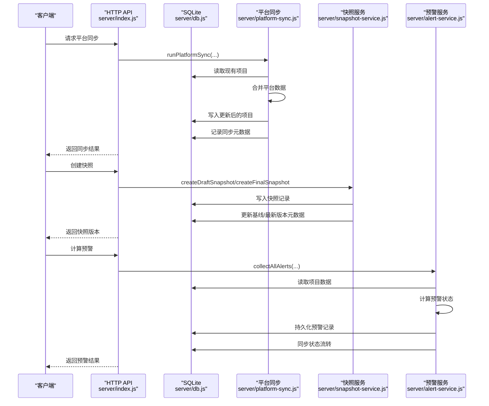

**图表来源**
- [server/index.js:590-625](file://server/index.js#L590-L625)
- [server/platform-sync.js:214-262](file://server/platform-sync.js#L214-L262)
- [server/snapshot-service.js:88-158](file://server/snapshot-service.js#L88-L158)
- [server/alert-service.js:83-299](file://server/alert-service.js#L83-L299)

## 详细组件分析

### 项目主表 projects
- 设计目的：集中存储项目核心信息、系统同步字段、计算字段与元数据
- 字段定义与约束：
  - 主键与唯一：project_no 唯一
  - 系统同步字段：sector_code、pm_name、project_name、client_name、enterprise_type、industry、business_type、start_date、end_date、contract_signed 等
  - 年度基线字段：prev_year_end_amt、prev_year_end_invoice、prev_year_end_payment
  - 始累与当年度字段：cumulative_complete_*、current_year_adj、fx_adjustment
  - 项目进展与 WIP：implementation_status、wip_analysis_note、wip_cause、risk_level、risk_note、improvement_action、action_owner、action_plan_date
  - 预收款汇总：prepayment_balance
  - 计算字段：invoice_diff、complete_diff、yearly_*、ar_amount_inc_tax、wip_* 等
  - 元数据：is_new_project、reporting_month、_changed_fields、_field_change_log、_field_notes、_added_this_month、approval_status、reporting_submitted、created_at、updated_at
- 索引：sector_code、pm_name、reporting_month、approval_status
- 数据完整性：通过唯一约束与触发器（如 FormulaEngine 计算）保障

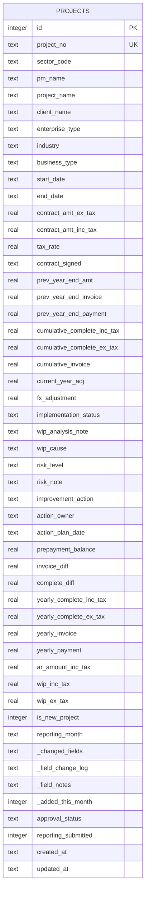

**图表来源**
- [database-schema.sql:12-87](file://database-schema.sql#L12-L87)

**章节来源**
- [database-schema.sql:12-87](file://database-schema.sql#L12-L87)
- [database-schema-design.md:99-123](file://database-schema-design.md#L99-L123)

### 月度填报记录 monthly_records
- 设计目的：逐月手工填报数据，支持历史追溯与月度清零重置
- 字段定义与约束：
  - 主键与唯一：(project_no, report_month) 唯一
  - 月度完成额、开票额、回款额、预收款：12 个月字段
  - 回款比例：按月计算
  - 预测数据：forecast_invoice、forecast_invoice_date、forecast_payment、forecast_payment_ratio
  - 统计汇总：total_complete、total_invoice、total_payment、total_prepayment
  - 元数据：is_locked、locked_by、locked_at、created_at、updated_at
- 索引：project_no、report_month
- 数据完整性：外键约束 projects.project_no，UNIQUE (project_no, report_month)

```mermaid
erDiagram
MONTHLY_RECORDS {
integer id PK
text project_no
text report_month
real complete_amt_m1
real complete_amt_m2
real complete_amt_m3
real complete_amt_m4
real complete_amt_m5
real complete_amt_m6
real complete_amt_m7
real complete_amt_m8
real complete_amt_m9
real complete_amt_m10
real complete_amt_m11
real complete_amt_m12
real invoice_amt_m1
real invoice_amt_m2
real invoice_amt_m3
real invoice_amt_m4
real invoice_amt_m5
real invoice_amt_m6
real invoice_amt_m7
real invoice_amt_m8
real invoice_amt_m9
real invoice_amt_m10
real invoice_amt_m11
real invoice_amt_m12
real payment_amt_m1
real payment_amt_m2
real payment_amt_m3
real payment_amt_m4
real payment_amt_m5
real payment_amt_m6
real payment_amt_m7
real payment_amt_m8
real payment_amt_m9
real payment_amt_m10
real payment_amt_m11
real payment_amt_m12
real prepayment_amt_m1
real prepayment_amt_m2
real prepayment_amt_m3
real prepayment_amt_m4
real prepayment_amt_m5
real prepayment_amt_m6
real prepayment_amt_m7
real prepayment_amt_m8
real prepayment_amt_m9
real prepayment_amt_m10
real prepayment_amt_m11
real prepayment_amt_m12
real payment_ratio_m1
real payment_ratio_m2
real payment_ratio_m3
real payment_ratio_m4
real payment_ratio_m5
real payment_ratio_m6
real payment_ratio_m7
real payment_ratio_m8
real payment_ratio_m9
real payment_ratio_m10
real payment_ratio_m11
real payment_ratio_m12
real forecast_invoice
text forecast_invoice_date
real forecast_payment
real forecast_payment_ratio
real total_complete
real total_invoice
real total_payment
real total_prepayment
integer is_locked
text locked_by
text locked_at
text created_at
text updated_at
}
PROJECTS ||--o{ MONTHLY_RECORDS : "外键: project_no"
```

**图表来源**
- [database-schema.sql:99-196](file://database-schema.sql#L99-L196)

**章节来源**
- [database-schema.sql:99-196](file://database-schema.sql#L99-L196)
- [database-schema-design.md:141-154](file://database-schema-design.md#L141-L154)

### 年度基线 project_yearly_baseline
- 设计目的：每年 1 月 1 日冻结上一年底数据，支持跨年翻转与历史追溯
- 字段定义与约束：
  - 主键与唯一：(project_no, baseline_year)
  - 冻结基准值：year_end_complete_amt、year_end_invoice_amt、year_end_payment_amt、year_end_contract_amt
  - 当年调整值：year_adjustment
  - created_at
- 索引：project_no、baseline_year
- 数据完整性：外键 projects.project_no，UNIQUE (project_no, baseline_year)

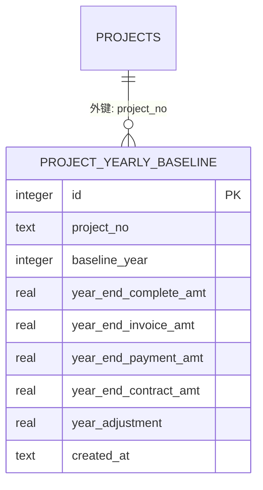

**图表来源**
- [database-schema.sql:205-223](file://database-schema.sql#L205-L223)

**章节来源**
- [database-schema.sql:205-223](file://database-schema.sql#L205-L223)
- [database-schema-design.md:156-177](file://database-schema-design.md#L156-L177)

### 预收款核销 prepayment_writeoffs
- 设计目的：记录预收款→开票核销操作，财务审核期专属
- 字段定义与约束：
  - 主键：id
  - 外键：project_no → projects.project_no
  - 字段：writeoff_amt、writeoff_date、invoice_no、writeoff_note、operator、report_month、created_at
- 索引：project_no、report_month
- 数据完整性：外键约束

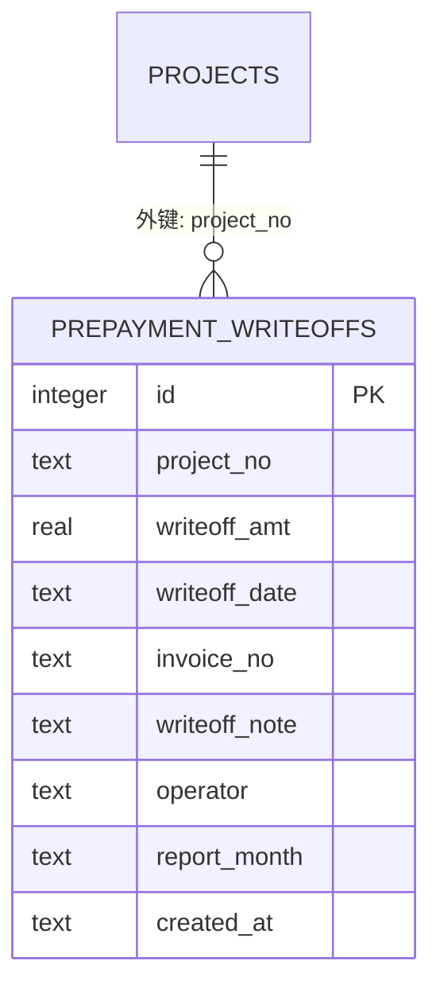

**图表来源**
- [database-schema.sql:232-245](file://database-schema.sql#L232-L245)

**章节来源**
- [database-schema.sql:232-245](file://database-schema.sql#L232-L245)
- [database-schema-design.md:179-195](file://database-schema-design.md#L179-L195)

### 审计日志 audit_log
- 设计目的：全量记录数据增删改，满足审计要求
- 字段定义与约束：
  - 主键：id
  - 外键：project_no → projects.project_no
  - 字段：field_name、field_cn、old_value、new_value、change_reason、operator、operation_type、report_month、created_at
- 索引：project_no、report_month、operator、created_at
- 数据完整性：外键约束

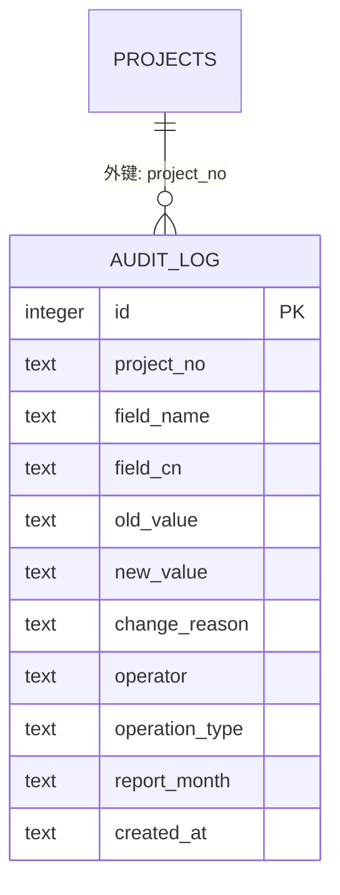

**图表来源**
- [database-schema.sql:254-268](file://database-schema.sql#L254-L268)

**章节来源**
- [database-schema.sql:254-268](file://database-schema.sql#L254-L268)
- [database-schema-design.md:59-72](file://database-schema-design.md#L59-L72)

### 审批快照 snapshots
- 设计目的：不可变版本快照，I/D/J 版本体系
- 字段定义与约束：
  - 主键：version（唯一）
  - 字段：snapshot_type、sector_code、report_month、snapshot_data（JSON）、operator
- 索引：version（唯一）
- 数据完整性：version 唯一

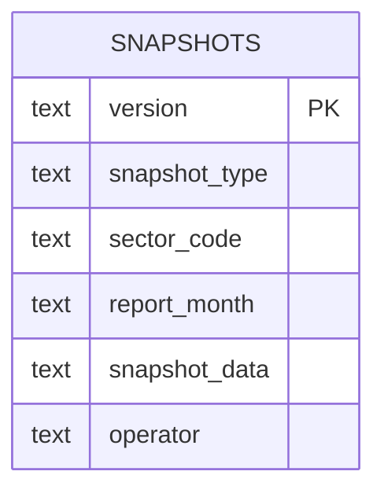

**图表来源**
- [database-schema.sql:279-286](file://database-schema.sql#L279-L286)

**章节来源**
- [database-schema.sql:279-286](file://database-schema.sql#L279-L286)
- [database-schema-design.md:73-94](file://database-schema-design.md#L73-L94)

### 元数据 meta
- 设计目的：存储系统配置、周期参数、板块注册、流程状态等
- 字段定义与约束：
  - 主键：key（唯一）
  - 字段：value（JSON/字符串）
- 索引：key（唯一）

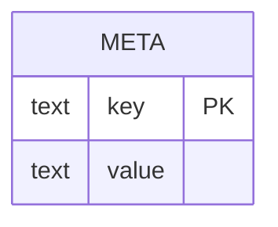

**图表来源**
- [server/db.js:29-32](file://server/db.js#L29-L32)

**章节来源**
- [server/db.js:29-32](file://server/db.js#L29-L32)
- [database-schema-design.md:226-228](file://database-schema-design.md#L226-L228)

### **新增** 项目预警记录 project_alerts
- 设计目的：持久化存储项目预警，支持 active/resolved 状态流转
- 字段定义与约束：
  - 主键：id
  - 外键：project_no → projects.project_no
  - 字段：project_no、project_name、sector_code、sector_name、alert_type、alert_label、detail、year、month_idx、status、first_detected_at、resolved_at、last_seen_at
  - 唯一约束：(project_no, alert_type, year, month_idx)
- 索引：status、project_no
- 数据完整性：外键约束，唯一约束保证同一项目在同一个月内同一类型的预警唯一

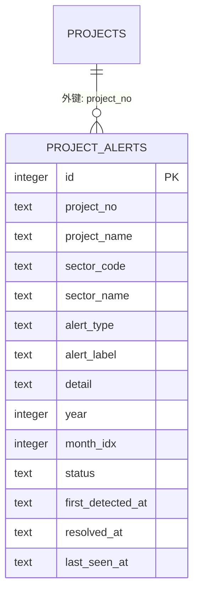

**图表来源**
- [database-schema.sql:295-319](file://database-schema.sql#L295-L319)

**章节来源**
- [database-schema.sql:295-319](file://database-schema.sql#L295-L319)
- [server/db.js:57-75](file://server/db.js#L57-L75)

### **新增** 预警永久忽略记录 project_alert_dismissals
- 设计目的：系统管理员手动消除预警后，该项目该类型预警在任何月份不再出现
- 字段定义与约束：
  - 主键：(project_no, alert_type)
  - 字段：project_no、alert_type、dismissed_at、dismissed_by
- 数据完整性：复合主键，确保项目-预警类型组合的唯一性

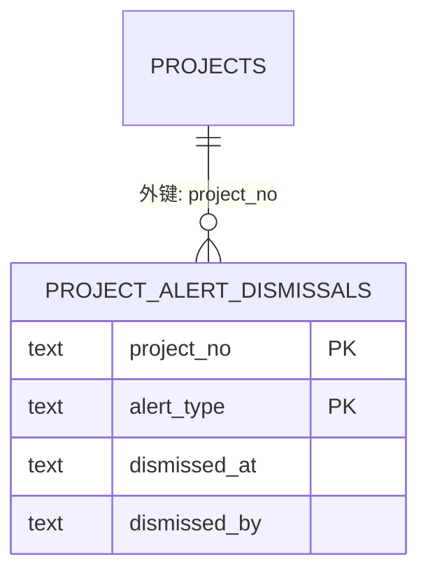

**图表来源**
- [database-schema.sql:320-331](file://database-schema.sql#L320-L331)

**章节来源**
- [database-schema.sql:320-331](file://database-schema.sql#L320-L331)
- [server/db.js:76-82](file://server/db.js#L76-L82)

## 依赖分析
- 项目主表 projects 是中心表，被其他表通过外键引用
- 月度记录 monthly_records 与项目主表一对多
- 年度基线 project_yearly_baseline 与项目主表一对多
- 预收款核销 prepayment_writeoffs 与项目主表一对多
- 审计日志 audit_log 与项目主表一对多
- 快照 snapshots 与项目主表无直接外键，但包含项目集合
- 元数据 meta 与项目主表无直接外键，但承载系统状态
- **新增**：项目预警记录 project_alerts 与项目主表一对多
- **新增**：预警永久忽略记录 project_alert_dismissals 与项目主表一对多，但不参与预警状态计算

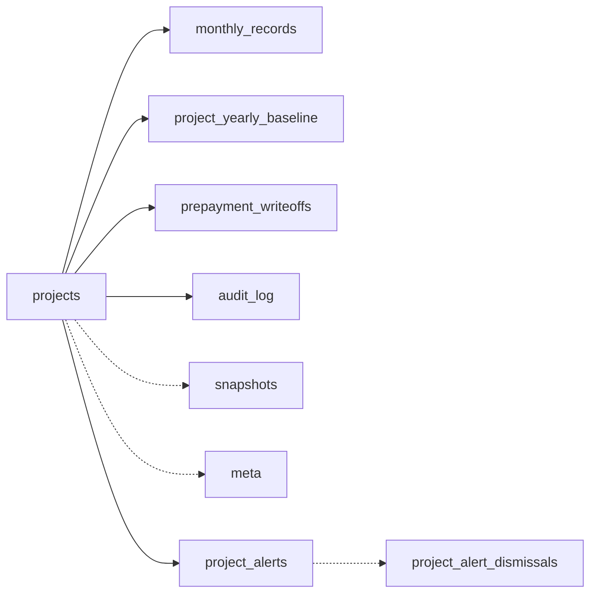

**图表来源**
- [database-schema.sql:12-87](file://database-schema.sql#L12-L87)
- [database-schema.sql:99-196](file://database-schema.sql#L99-L196)
- [database-schema.sql:205-223](file://database-schema.sql#L205-L223)
- [database-schema.sql:232-245](file://database-schema.sql#L232-L245)
- [database-schema.sql:254-268](file://database-schema.sql#L254-L268)
- [database-schema.sql:279-286](file://database-schema.sql#L279-L286)
- [database-schema.sql:295-331](file://database-schema.sql#L295-L331)
- [server/db.js:29-32](file://server/db.js#L29-L32)

**章节来源**
- [database-schema.sql:12-87](file://database-schema.sql#L12-L87)
- [database-schema.sql:99-196](file://database-schema.sql#L99-L196)
- [database-schema.sql:205-223](file://database-schema.sql#L205-L223)
- [database-schema.sql:232-245](file://database-schema.sql#L232-L245)
- [database-schema.sql:254-268](file://database-schema.sql#L254-L268)
- [database-schema.sql:279-286](file://database-schema.sql#L279-L286)
- [database-schema.sql:295-331](file://database-schema.sql#L295-L331)
- [server/db.js:29-32](file://server/db.js#L29-L32)

## 性能考量
- 索引策略
  - projects：按板块、PM、报告月、审批状态建立索引，支持常见筛选与排序
  - monthly_records：联合唯一索引 (project_no, report_month)，快速定位当月记录
  - audit_log：按项目+时间、操作人、创建时间建立索引，支持审计查询
  - prepayment_writeoffs：按项目+月建立索引，支持财务核销统计
  - **新增**：project_alerts：按 status 和 project_no 建立索引，支持预警状态查询和项目维度查询
- JSON 存储
  - projects.payload 与 snapshots.snapshot_data 使用 JSON 存储，减少表数量与 JOIN 复杂度
  - SQLite 对 JSON 函数支持良好，可使用 json_extract/json_each 进行查询
- WAL 模式
  - 启用 WAL 模式提升并发读写性能
- 查询优化
  - 月度数据初始化与跨年翻转采用批量 INSERT/UPDATE，减少事务次数
  - 审计日志按月度与操作人索引，避免全表扫描
  - **新增**：预警查询通过索引优化，支持按状态和项目号快速检索

**章节来源**
- [database-schema.sql:89-94](file://database-schema.sql#L89-L94)
- [database-schema.sql:198-199](file://database-schema.sql#L198-L199)
- [database-schema.sql:270-273](file://database-schema.sql#L270-L273)
- [database-schema.sql:247-248](file://database-schema.sql#L247-L248)
- [database-schema.sql:317-318](file://database-schema.sql#L317-L318)
- [server/db.js:14](file://server/db.js#L14)
- [database-schema-design.md:199-211](file://database-schema-design.md#L199-L211)

## 故障排查指南
- 快照库维护
  - 启动时清理遗留快照键（Draft/Approve1/Approve2/J版/Month/PM），修复基线与快照行不一致，必要时重建 I 版
- 锁定状态
  - 根据周期配置与当前日期计算锁定状态，支持自动解锁与手动解锁
- 平台同步
  - 定时/手动触发平台数据同步，合并系统引用字段，记录同步元数据与审计
- 数据一致性
  - 审计日志双层设计：单元格级 _field_change_log 与全局 audit_log，确保变更可追溯
- 元数据异常
  - 通过 resetDevMeta/resetWorkflowCycleAfterArchive 等函数重置流程与元数据，避免状态错乱
- **新增**：预警系统故障排查
  - 预警状态不正确：检查预警服务是否正常运行，确认数据库中 project_alerts 表的状态字段
  - 预警重复显示：检查是否存在重复的 (project_no, alert_type, year, month_idx) 记录
  - 预警被永久忽略：检查 project_alert_dismissals 表中是否有对应项目的忽略记录
  - 预警计算错误：验证 js/project-alerts.js 中的预警算法逻辑

**章节来源**
- [server/snapshot-service.js:229-274](file://server/snapshot-service.js#L229-L274)
- [server/db.js:121-142](file://server/db.js#L121-L142)
- [server/index.js:745-774](file://server/index.js#L745-L774)
- [database-schema-design.md:59-72](file://database-schema-design.md#L59-L72)
- [server/db.js:328-370](file://server/db.js#L328-L370)
- [server/alert-service.js:83-299](file://server/alert-service.js#L83-L299)

## 结论
本数据库设计围绕"项目主表为中心"的结构化表与 JSON 存储相结合的方式，实现了：
- 月度数据隔离与历史保留
- 年度基线冻结与跨年翻转
- 预收款核销的财务合规
- 审计双层设计与快照不可变性
- 板块工作流与版本控制
- **新增**：完善的项目预警系统，支持多种预警类型的检测、状态管理和永久忽略机制

在性能方面，通过索引与 WAL 模式提升查询与并发能力；在可维护性方面，提供快照维护与元数据管理工具链。**新增**的预警系统通过专门的索引优化了查询性能，并提供了灵活的状态管理机制。未来可进一步引入软删除、乐观锁与分区策略以增强扩展性与稳定性。

## 附录
- 迁移方案
  - 当前：projects.payload JSON 存储
  - 过渡：新增结构化列，保留 payload 兼容
  - 最终：完全移除 payload，使用结构化列 + 关联表
- 备份与恢复
  - 备份：定期复制 SQLite 文件 data/ptrack.sqlite
  - 恢复：停止服务后替换文件，启动后验证快照与元数据一致性
  - **新增**：预警数据备份：project_alerts 和 project_alert_dismissals 表同样重要，需要纳入常规备份策略
- 维护建议
  - 定期清理遗留快照键
  - 监控 WAL 文件大小与磁盘空间
  - 通过 API 触发平台同步与快照生成，确保数据时效性
  - **新增**：监控预警服务运行状态，定期检查预警数据的完整性和准确性
  - **新增**：定期清理过期的预警记录，保持数据库性能

**章节来源**
- [database-schema-design.md:214-229](file://database-schema-design.md#L214-L229)
- [server/snapshot-service.js:194-210](file://server/snapshot-service.js#L194-L210)
- [server/db.js:14](file://server/db.js#L14)
- [server/alert-service.js:83-299](file://server/alert-service.js#L83-L299)