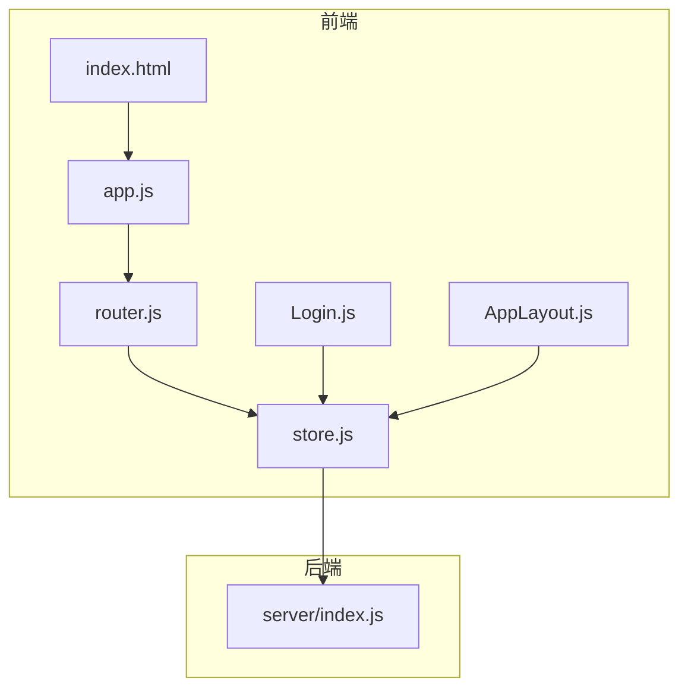
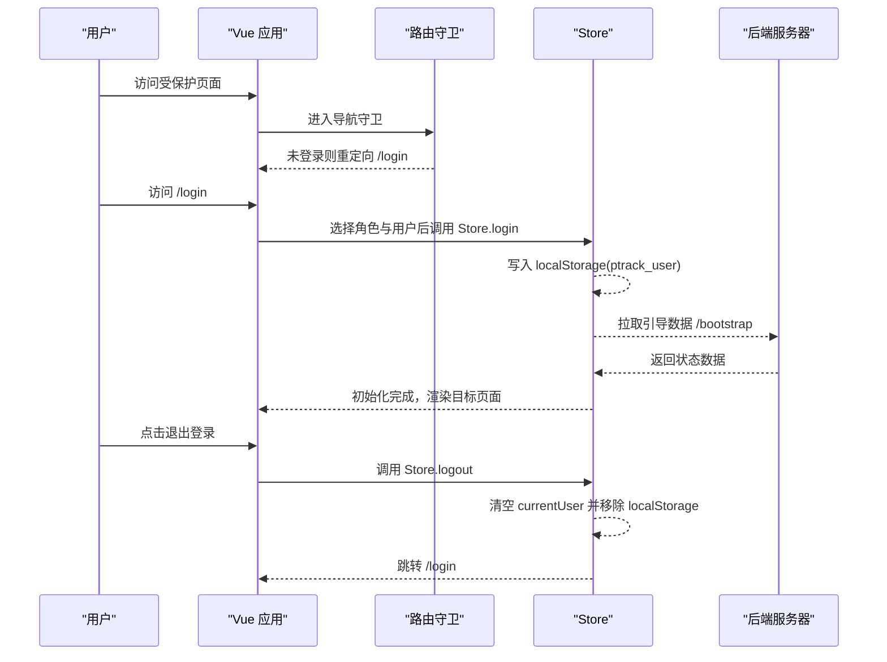
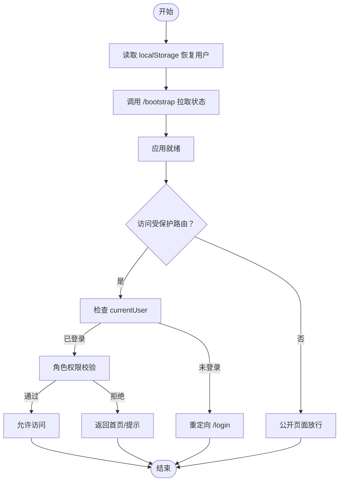
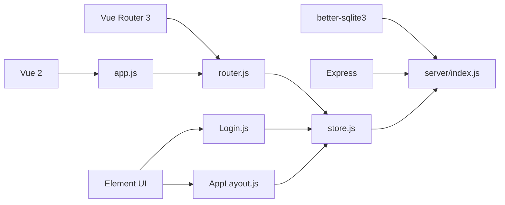

# 会话管理

<cite>
**本文引用的文件列表**
- [index.html](file://index.html)
- [app.js](file://js/app.js)
- [router.js](file://js/router.js)
- [store.js](file://js/store.js)
- [Login.js](file://js/views/Login.js)
- [AppLayout.js](file://js/components/AppLayout.js)
- [server/index.js](file://server/index.js)
- [package.json](file://package.json)
</cite>

## 目录
1. [简介](#简介)
2. [项目结构](#项目结构)
3. [核心组件](#核心组件)
4. [架构总览](#架构总览)
5. [详细组件分析](#详细组件分析)
6. [依赖关系分析](#依赖关系分析)
7. [性能考量](#性能考量)
8. [故障排查指南](#故障排查指南)
9. [结论](#结论)
10. [附录](#附录)

## 简介
本文件围绕前端会话管理系统进行深入文档化，聚焦用户会话生命周期、状态维护与安全机制。基于仓库中的实际实现，系统采用前端本地存储（localStorage）保存登录用户信息，并通过 Vue 全局状态与路由守卫实现会话验证与访问控制。后端提供受控的 API 接口，支持业务数据同步与管理功能。文档将详细解释会话创建、验证、续期与销毁流程，分析存储策略、超时与自动登出机制，以及会话劫持防护、CSRF 保护与跨站请求伪造防护现状与建议，并给出配置参数、安全设置与监控方法，最后总结最佳实践与异常处理策略。

## 项目结构
前端采用单页应用（SPA）模式，核心入口与会话相关的关键模块如下：
- 入口与挂载：index.html 引入脚本，app.js 初始化 Vue 实例并挂载路由视图。
- 路由与守卫：router.js 定义路由与导航守卫，实现访问控制与重定向。
- 全局状态与会话：store.js 管理全局状态、登录用户、本地存储读写与 API 请求封装。
- 登录视图：Login.js 提供角色选择与用户确认，触发 Store.login。
- 布局与登出：AppLayout.js 提供顶部下拉菜单与退出登录按钮，调用 Store.logout。
- 后端 API：server/index.js 提供受控的业务接口，包括引导数据、字段字典、快照、审批流等。

**图表来源**
- [index.html:105-107](file://index.html#L105-L107)
- [app.js:22-28](file://js/app.js#L22-L28)
- [router.js:71-75](file://js/router.js#L71-L75)
- [store.js:95-128](file://js/store.js#L95-L128)
- [Login.js:111-123](file://js/views/Login.js#L111-L123)
- [AppLayout.js:91-98](file://js/components/AppLayout.js#L91-L98)
- [server/index.js:91-100](file://server/index.js#L91-L100)

**章节来源**
- [index.html:105-107](file://index.html#L105-L107)
- [app.js:22-28](file://js/app.js#L22-L28)
- [router.js:12-69](file://js/router.js#L12-L69)
- [store.js:95-128](file://js/store.js#L95-L128)
- [Login.js:111-123](file://js/views/Login.js#L111-L123)
- [AppLayout.js:91-98](file://js/components/AppLayout.js#L91-L98)
- [server/index.js:91-100](file://server/index.js#L91-L100)

## 核心组件
- 前端会话状态与存储
  - 使用 localStorage 保存当前用户信息键值，便于页面刷新后恢复会话。
  - Store.login 设置当前用户并持久化；Store.logout 清空当前用户并移除本地存储键。
  - Store.init 在应用启动时拉取引导数据，同时读取本地存储以恢复用户状态。
- 路由守卫与访问控制
  - 对需要认证的路由进行拦截，未登录则重定向至登录页。
  - 对特定页面（如管理、审计、字段配置）进行角色校验，非系统管理员禁止访问。
- 登录与登出流程
  - 登录：选择角色与用户后，调用 Store.login 并根据角色重定向至首页。
  - 登出：弹窗确认后调用 Store.logout，清空状态并跳转登录页。
- API 请求封装
  - Store.apiFetch 统一封装 fetch 请求，自动拼接 /api 前缀与 JSON 头部，处理错误响应与文本解析。

**章节来源**
- [store.js:8-19](file://js/store.js#L8-L19)
- [store.js:95-128](file://js/store.js#L95-L128)
- [store.js:290-308](file://js/store.js#L290-L308)
- [store.js:66-93](file://js/store.js#L66-L93)
- [router.js:84-132](file://js/router.js#L84-L132)
- [Login.js:111-123](file://js/views/Login.js#L111-L123)
- [AppLayout.js:91-98](file://js/components/AppLayout.js#L91-L98)

## 架构总览
前端 SPA 与后端 API 的交互遵循“前端本地会话 + 后端受控接口”的模式：
- 前端负责会话状态与访问控制，后端负责业务数据与流程控制。
- Store.login 与 Store.logout 作为会话生命周期的入口与出口。
- 路由守卫确保未登录用户无法访问受保护页面。
- API 层提供受控端点，避免前端直接操作敏感元数据。

**图表来源**
- [router.js:84-132](file://js/router.js#L84-L132)
- [store.js:290-308](file://js/store.js#L290-L308)
- [store.js:268-275](file://js/store.js#L268-L275)
- [server/index.js:91-100](file://server/index.js#L91-L100)
- [Login.js:111-123](file://js/views/Login.js#L111-L123)
- [AppLayout.js:91-98](file://js/components/AppLayout.js#L91-L98)

## 详细组件分析

### 会话生命周期与状态维护
- 会话创建
  - 用户在登录页选择角色与用户后，调用 Store.login，将用户对象写入全局状态与 localStorage。
  - 应用初始化时，Store.init 会先读取本地存储恢复用户，再拉取 /bootstrap 获取业务状态。
- 会话验证
  - 路由守卫在进入受保护路由前检查 Store.currentUser，若为空则重定向至登录页。
  - 对特定页面进行角色校验，非授权角色被拒绝访问。
- 会话续期
  - 当前实现未显式提供会话续期逻辑；可通过定期发起轻量 API 请求维持活跃状态（建议在业务空闲时轮询）。
- 会话销毁
  - 登出时调用 Store.logout，清空 currentUser 并移除 localStorage 键，随后重定向至登录页。

**图表来源**
- [store.js:95-128](file://js/store.js#L95-L128)
- [store.js:268-275](file://js/store.js#L268-L275)
- [router.js:84-132](file://js/router.js#L84-L132)

**章节来源**
- [store.js:95-128](file://js/store.js#L95-L128)
- [store.js:268-275](file://js/store.js#L268-L275)
- [router.js:84-132](file://js/router.js#L84-L132)

### 会话存储策略（localStorage vs sessionStorage）
- 当前实现使用 localStorage 保存用户信息键值，以便页面刷新后恢复会话。
- 未使用 sessionStorage，因此关闭标签页或浏览器不会自动销毁会话。
- 若需更强的安全性，可考虑引入短期令牌并在内存中维护会话上下文，结合后端会话管理。

**章节来源**
- [store.js:8-19](file://js/store.js#L8-L19)
- [store.js:95-98](file://js/store.js#L95-L98)

### 会话超时与自动登出机制
- 当前未实现显式的会话超时与自动登出逻辑。
- 建议方案：
  - 前端：在 Store 中增加 lastActivity 时间戳，定时任务检测空闲时间，超过阈值则触发 Store.logout。
  - 后端：在 API 层增加会话有效性校验与超时策略（如 JWT 过期），前端收到 401 时自动跳转登录。
  - 两者结合：前端心跳 + 后端令牌过期，确保一致性。

**章节来源**
- [store.js:66-93](file://js/store.js#L66-L93)

### 会话劫持防护、CSRF 保护与跨站请求伪造防护
- 会话劫持
  - 当前未使用 HTTP-only Cookie 或短期令牌，存在会话信息暴露风险。
  - 建议：引入短期令牌与 HttpOnly Cookie，配合 SameSite 属性与安全传输。
- CSRF 保护
  - 未发现显式 CSRF Token 传递或校验逻辑。
  - 建议：在关键写操作端点启用 CSRF 校验，前端携带 Token 或使用 SameSite Cookie。
- 跨站请求伪造
  - 未见专门的跨站防护措施。
  - 建议：限制来源（CORS）、使用 SameSite Cookie、关键操作二次确认。

**章节来源**
- [store.js:66-93](file://js/store.js#L66-L93)
- [server/index.js:91-100](file://server/index.js#L91-L100)

### 多设备登录管理、会话冲突与并发访问控制
- 当前未实现多设备登录管理与会话冲突处理。
- 建议：
  - 后端维护用户在线会话列表，同一用户多设备登录时，旧会话失效或提示冲突。
  - 前端在 Store 中记录会话标识，关键操作前检查会话有效性，必要时弹窗提示并强制登出。
  - 并发写入：后端对关键资源加锁或采用乐观并发控制（ETag/版本号）。

**章节来源**
- [server/index.js:230-285](file://server/index.js#L230-L285)

### 会话配置参数、安全设置与监控方法
- 配置参数
  - 前端：默认周期配置（报告月、锁定期等）在 DEFAULT_CONFIG 中定义，可通过 Store.savePeriodConfig 与 /meta 接口更新。
  - 后端：周期配置与锁状态通过 /meta 端点更新，影响前端展示与业务流程。
- 安全设置
  - 建议：启用 HTTPS、SameSite Cookie、CSRF Token、短令牌与自动登出。
- 监控方法
  - 前端：记录登录/登出事件与异常错误，上报审计日志。
  - 后端：记录会话创建、失效与冲突事件，统计异常登录尝试。

**章节来源**
- [store.js:21-28](file://js/store.js#L21-L28)
- [store.js:541-552](file://js/store.js#L541-L552)
- [server/index.js:198-218](file://server/index.js#L198-L218)

## 依赖关系分析
- 前端依赖
  - Vue 2 与 Vue Router 3 提供 SPA 与路由能力。
  - Element UI 提供 UI 组件与消息提示。
  - better-sqlite3 与 Express 提供后端 API 与数据库访问。
- 关键依赖关系
  - app.js 依赖 router.js 与 store.js。
  - router.js 依赖 store.js 进行会话判断与重定向。
  - Login.js 与 AppLayout.js 依赖 store.js 进行登录与登出。
  - store.js 依赖 server/index.js 提供的 API。

**图表来源**
- [package.json:13-17](file://package.json#L13-L17)
- [index.html:54-61](file://index.html#L54-L61)
- [app.js:22-28](file://js/app.js#L22-L28)
- [router.js:71-75](file://js/router.js#L71-L75)
- [store.js:95-128](file://js/store.js#L95-L128)
- [Login.js:111-123](file://js/views/Login.js#L111-L123)
- [AppLayout.js:91-98](file://js/components/AppLayout.js#L91-L98)
- [server/index.js:91-100](file://server/index.js#L91-L100)

**章节来源**
- [package.json:13-17](file://package.json#L13-L17)
- [index.html:54-61](file://index.html#L54-L61)
- [app.js:22-28](file://js/app.js#L22-L28)
- [router.js:71-75](file://js/router.js#L71-L75)
- [store.js:95-128](file://js/store.js#L95-L128)
- [Login.js:111-123](file://js/views/Login.js#L111-L123)
- [AppLayout.js:91-98](file://js/components/AppLayout.js#L91-L98)
- [server/index.js:91-100](file://server/index.js#L91-L100)

## 性能考量
- 前端性能
  - Store.init 一次性拉取引导数据，减少后续请求次数。
  - 路由守卫仅做简单判断，避免阻塞。
- 后端性能
  - /bootstrap 一次性返回完整状态，适合 SPA 首屏渲染。
  - 关键写操作端点（如提交、审批）应进行幂等与并发控制，避免重复处理。

[本节为通用指导，无需具体文件分析]

## 故障排查指南
- 登录后无法访问受保护页面
  - 检查路由守卫逻辑与 Store.currentUser 是否正确设置。
  - 确认 /bootstrap 返回状态中包含必要的业务数据。
- 登出后仍可访问
  - 检查 Store.logout 是否被调用，localStorage 键是否被移除。
  - 确认路由守卫对 requiresAuth 的处理。
- API 请求失败
  - 查看 Store.apiFetch 的错误处理与状态码映射。
  - 检查后端 /api/* 端点是否可用与返回格式。

**章节来源**
- [router.js:84-132](file://js/router.js#L84-L132)
- [store.js:290-308](file://js/store.js#L290-L308)
- [store.js:66-93](file://js/store.js#L66-L93)
- [server/index.js:91-100](file://server/index.js#L91-L100)

## 结论
当前系统采用前端本地存储与路由守卫实现基础会话管理，满足原型演示需求。为提升安全性与稳定性，建议引入短期令牌、CSRF 保护、会话超时与自动登出、多设备冲突处理与并发控制，并完善前后端联动的会话监控与审计。通过渐进增强的方式逐步完善，可在保证用户体验的同时显著提升系统安全与可靠性。

[本节为总结，无需具体文件分析]

## 附录
- 会话安全最佳实践
  - 使用 HTTPS 与安全传输。
  - 引入短期令牌与 HttpOnly Cookie，启用 SameSite 与 Secure 属性。
  - 实施 CSRF Token 与来源校验。
  - 建立会话超时与自动登出机制。
  - 多设备登录冲突处理与并发写入控制。
- 异常处理策略
  - 前端：统一错误捕获与提示，记录错误日志。
  - 后端：对异常请求进行限流与审计，必要时临时封禁。

[本节为通用指导，无需具体文件分析]