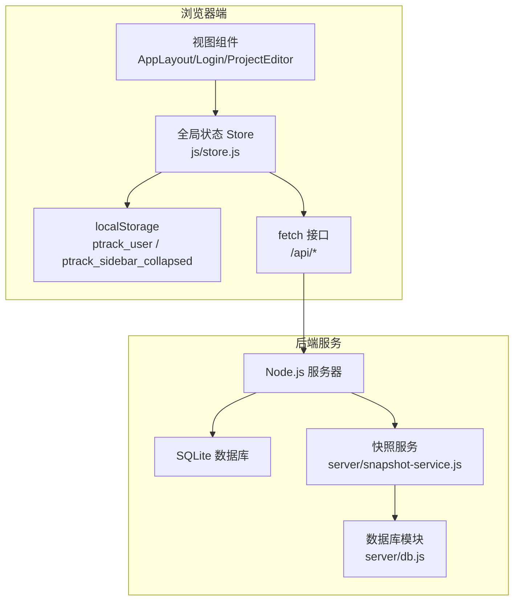
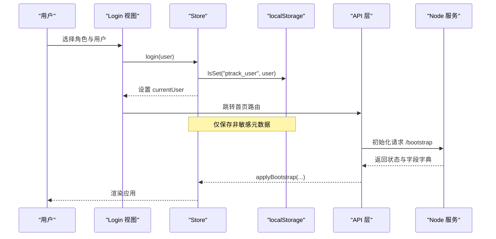
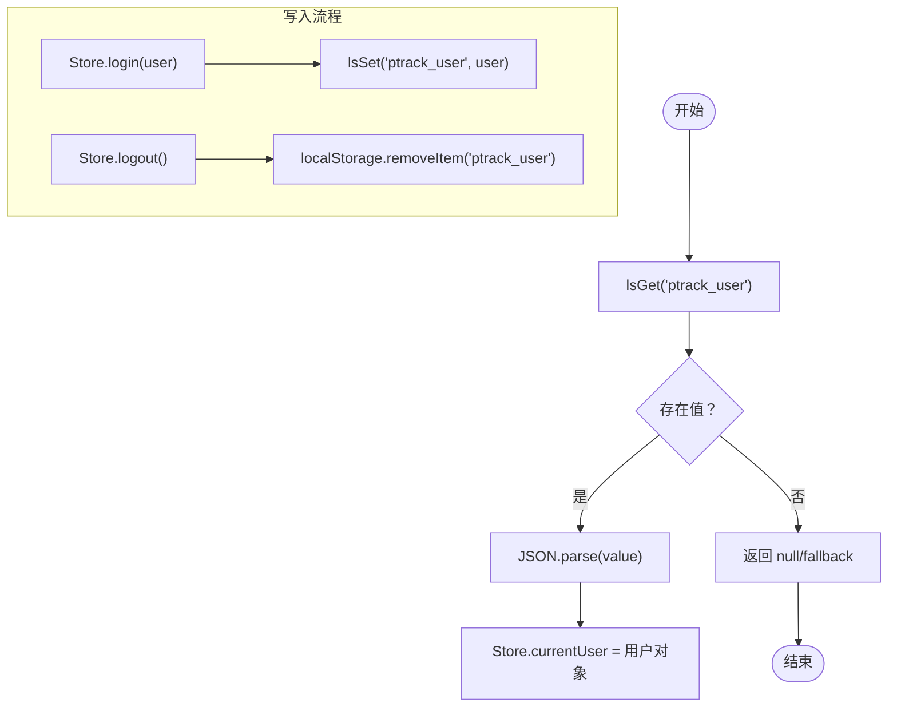
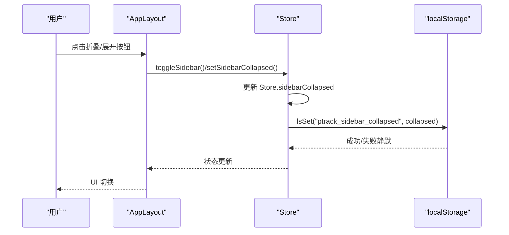
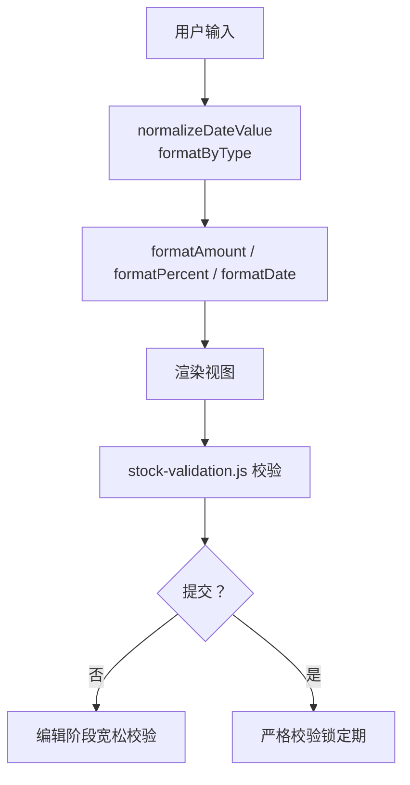
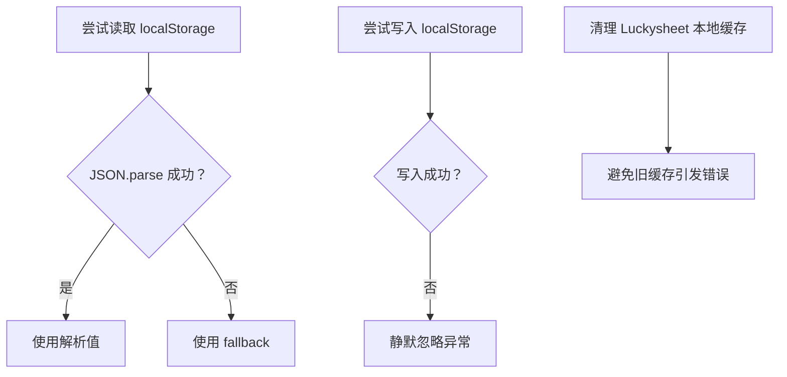
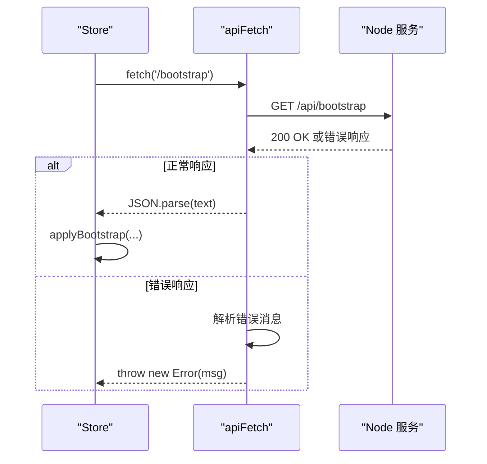
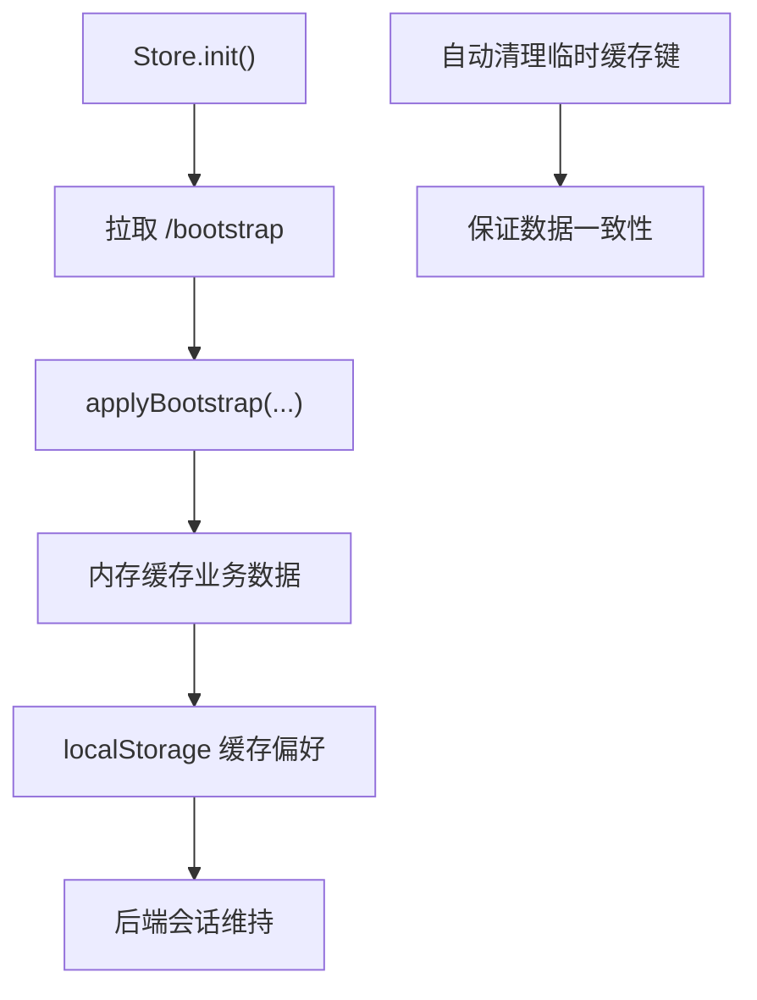
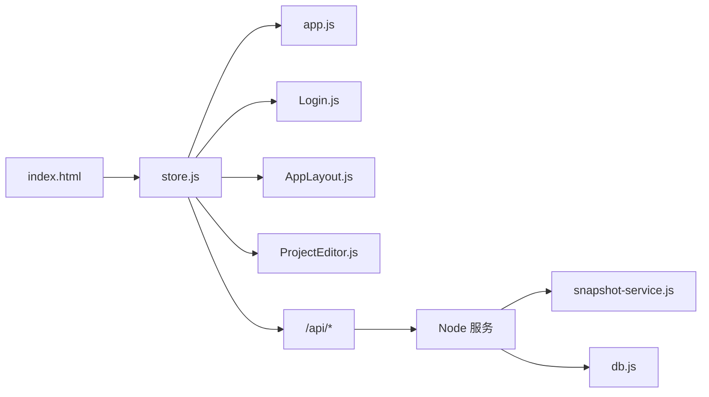

# 前端存储安全

<cite>
**本文档引用的文件**
- [store.js](file://js/store.js)
- [app.js](file://js/app.js)
- [Login.js](file://js/views/Login.js)
- [index.html](file://index.html)
- [AppLayout.js](file://js/components/AppLayout.js)
- [ProjectEditor.js](file://js/views/ProjectEditor.js)
- [formatters.js](file://js/formatters.js)
- [stock-validation.js](file://js/stock-validation.js)
- [db.js](file://server/db.js)
- [load-modules.js](file://server/load-modules.js)
- [snapshot-service.js](file://server/snapshot-service.js)
</cite>

## 目录
1. [简介](#简介)
2. [项目结构](#项目结构)
3. [核心组件](#核心组件)
4. [架构概览](#架构概览)
5. [详细组件分析](#详细组件分析)
6. [依赖关系分析](#依赖关系分析)
7. [性能考量](#性能考量)
8. [故障排查指南](#故障排查指南)
9. [结论](#结论)
10. [附录](#附录)

## 简介
本文件聚焦于前端存储安全机制，围绕 localStorage 安全策略、敏感数据保护与客户端数据存储最佳实践进行系统性阐述。重点覆盖登录信息存储（LS_KEY_USER）、侧边栏状态存储（LS_KEY_SIDEBAR）的安全考虑，以及前端状态管理中的数据隔离、跨站脚本攻击（XSS）防护、本地存储污染防护、数据序列化安全、错误处理与存储异常恢复策略、前端数据缓存与会话管理、自动清理机制、安全编码规范、数据验证与输入过滤方案。

## 项目结构
前端采用单页应用架构，核心状态通过全局 Store 管理，业务数据通过 API 与后端 SQLite 同步。登录信息与界面偏好（如侧边栏折叠状态）使用 localStorage 存储，其余业务数据在内存中维护并在需要时持久化至后端。

**图表来源**
- [index.html:70-107](file://index.html#L70-L107)
- [store.js:66-93](file://js/store.js#L66-L93)
- [db.js:103-142](file://server/db.js#L103-L142)
- [snapshot-service.js:229-274](file://server/snapshot-service.js#L229-L274)

**章节来源**
- [index.html:70-107](file://index.html#L70-L107)
- [store.js:1-602](file://js/store.js#L1-L602)

## 核心组件
- 全局状态 Store：负责用户会话、业务数据、界面状态（如侧边栏折叠）与 API 交互封装。
- 登录视图 Login：提供角色与用户选择，调用 Store.login 完成登录。
- 应用入口 app.js：初始化 Vue 应用并调用 Store.init 拉取初始数据。
- 侧边栏组件 AppLayout：绑定 Store.sidebarCollapsed，提供切换与登出功能。
- 项目编辑器 ProjectEditor：涉及 Luckysheet 表格与本地缓存清理逻辑。
- 格式化与校验工具：formatters.js、stock-validation.js 提供数据规范化与业务校验。
- 服务端模块：db.js、load-modules.js、snapshot-service.js 负责数据库与快照维护。

**章节来源**
- [store.js:95-128](file://js/store.js#L95-L128)
- [Login.js:52-129](file://js/views/Login.js#L52-L129)
- [app.js:22-44](file://js/app.js#L22-L44)
- [AppLayout.js:31-133](file://js/components/AppLayout.js#L31-L133)
- [ProjectEditor.js:1460-1475](file://js/views/ProjectEditor.js#L1460-L1475)
- [formatters.js:1-167](file://js/formatters.js#L1-L167)
- [stock-validation.js:1-181](file://js/stock-validation.js#L1-L181)
- [db.js:103-142](file://server/db.js#L103-L142)
- [load-modules.js:13-38](file://server/load-modules.js#L13-L38)
- [snapshot-service.js:229-274](file://server/snapshot-service.js#L229-L274)

## 架构概览
前端存储安全的关键点在于：
- 登录信息与界面偏好使用 localStorage，但仅存放非敏感元数据（用户名、角色、侧边栏状态等）。
- 敏感凭据（如令牌）不在前端存储；登录成功后通过 API 与后端会话保持交互。
- 业务数据在内存中管理并通过 API 同步至后端 SQLite，避免直接暴露在前端持久化层。
- 本地存储污染防护：对 localStorage 的读写进行 try/catch 包裹，解析失败返回默认值。
- XSS 防护：所有用户输入与展示均通过格式化与校验工具处理，避免直接注入。
- 自动清理：针对 Luckysheet 的本地缓存键进行清理，防止旧表结构导致的异常。

**图表来源**
- [Login.js:111-123](file://js/views/Login.js#L111-L123)
- [store.js:290-296](file://js/store.js#L290-L296)
- [store.js:95-128](file://js/store.js#L95-L128)
- [store.js:268-275](file://js/store.js#L268-L275)

**章节来源**
- [Login.js:52-129](file://js/views/Login.js#L52-L129)
- [store.js:95-128](file://js/store.js#L95-L128)
- [store.js:290-296](file://js/store.js#L290-L296)
- [store.js:268-275](file://js/store.js#L268-L275)

## 详细组件分析

### 登录信息存储（LS_KEY_USER）安全策略
- 存储内容：用户名、角色、所属板块等非敏感元数据；不包含密码或令牌。
- 读取与写入：通过 lsGet/lsSet 封装，读取时 JSON.parse，失败返回 fallback；写入时 JSON.stringify，异常静默忽略。
- 登出清理：调用 removeItem 清除用户键，确保本地无残留。
- 安全建议：
  - 不在前端存储任何敏感凭据；令牌应通过安全通道（如 HttpOnly Cookie）传递。
  - 对用户输入进行严格校验与格式化，避免注入风险。
  - 定期检查 localStorage 使用，移除不再使用的键以减少污染面。

**图表来源**
- [store.js:11-19](file://js/store.js#L11-L19)
- [store.js:95-98](file://js/store.js#L95-L98)
- [store.js:290-308](file://js/store.js#L290-L308)

**章节来源**
- [store.js:8-19](file://js/store.js#L8-L19)
- [store.js:95-98](file://js/store.js#L95-L98)
- [store.js:290-308](file://js/store.js#L290-L308)

### 侧边栏状态存储（LS_KEY_SIDEBAR）安全考虑
- 存储内容：布尔值表示侧边栏是否折叠。
- 读取与写入：通过 lsGet/lsSet 封装，异常静默处理，避免影响主流程。
- 界面绑定：AppLayout 计算属性与 Store.sidebarCollapsed 绑定，点击按钮触发 toggleSidebar/setSidebarCollapsed 更新状态并持久化。

**图表来源**
- [AppLayout.js:88-98](file://js/components/AppLayout.js#L88-L98)
- [store.js:310-318](file://js/store.js#L310-L318)

**章节来源**
- [AppLayout.js:88-98](file://js/components/AppLayout.js#L88-L98)
- [store.js:310-318](file://js/store.js#L310-L318)

### 前端状态管理中的数据隔离与 XSS 防护
- 数据隔离：Store 作为单一真相源，所有业务数据在内存中管理，仅通过 API 与后端交互，避免直接暴露在前端持久化层。
- XSS 防护：所有数值、百分比、日期等展示通过 formatters.js 格式化；金额解析与千分位处理在 parseAmount/formatAmount 中统一实现，避免直接拼接 HTML。
- 输入过滤：stock-validation.js 对完成额等关键字段进行数值合法性校验，仅在提交阶段进行严格约束，编辑阶段允许格式化输入。

**图表来源**
- [formatters.js:65-94](file://js/formatters.js#L65-L94)
- [formatters.js:118-126](file://js/formatters.js#L118-L126)
- [stock-validation.js:109-116](file://js/stock-validation.js#L109-L116)
- [stock-validation.js:131-149](file://js/stock-validation.js#L131-L149)

**章节来源**
- [formatters.js:1-167](file://js/formatters.js#L1-L167)
- [stock-validation.js:1-181](file://js/stock-validation.js#L1-L181)

### 本地存储污染防护与错误处理机制
- lsGet/lsSet 封装：读取时 JSON.parse 失败返回 fallback；写入时 try/catch 静默忽略，避免异常中断。
- 异常恢复策略：当 localStorage 抛出异常或容量不足时，应用仍能继续运行，仅丢失部分偏好设置；可通过重新登录恢复状态。
- 自动清理：ProjectEditor 在特定场景下清理 Luckysheet 的本地缓存键，防止旧表结构引发的异常。

**图表来源**
- [store.js:11-19](file://js/store.js#L11-L19)
- [ProjectEditor.js:1466-1475](file://js/views/ProjectEditor.js#L1466-L1475)

**章节来源**
- [store.js:11-19](file://js/store.js#L11-L19)
- [ProjectEditor.js:1460-1475](file://js/views/ProjectEditor.js#L1460-L1475)

### 数据序列化安全与 API 错误处理
- 序列化：所有写入 localStorage 的值先 JSON.stringify，读取后 JSON.parse，确保类型一致性。
- API 错误处理：apiFetch 对响应进行统一解析，遇到非 2xx 状态码抛出错误，错误消息优先从 JSON.error 提取，其次从 HTML 预格式文本中提取，最后回退到状态码描述。
- 会话管理：登录成功后 Store.currentUser 仅在前端内存中维护，不依赖前端令牌；后端通过会话机制控制访问。

**图表来源**
- [store.js:66-93](file://js/store.js#L66-L93)
- [store.js:268-275](file://js/store.js#L268-L275)

**章节来源**
- [store.js:66-93](file://js/store.js#L66-L93)
- [store.js:268-275](file://js/store.js#L268-L275)

### 前端数据缓存策略、会话管理与自动清理机制
- 缓存策略：业务数据在内存中缓存，通过 Store.init 一次性拉取，后续通过增量 API 更新；localStorage 仅缓存轻量级偏好。
- 会话管理：登录后 Store.currentUser 仅在前端内存中维护，不存储敏感令牌；后端负责会话生命周期。
- 自动清理：在导入/重置/快照切换等场景，清理临时缓存键，确保数据一致性。

**图表来源**
- [store.js:268-275](file://js/store.js#L268-L275)
- [store.js:130-168](file://js/store.js#L130-L168)
- [ProjectEditor.js:1466-1475](file://js/views/ProjectEditor.js#L1466-L1475)

**章节来源**
- [store.js:130-168](file://js/store.js#L130-L168)
- [store.js:268-275](file://js/store.js#L268-L275)
- [ProjectEditor.js:1460-1475](file://js/views/ProjectEditor.js#L1460-L1475)

### 前端安全编码规范与数据验证
- 编码规范：
  - 所有写入 localStorage 的值必须 JSON 序列化；读取后进行 JSON.parse 并提供 fallback。
  - 对用户输入进行格式化与校验，避免直接拼接 HTML 或注入脚本。
  - 严格区分编辑期与提交期的校验强度，编辑期宽松，提交期严格。
- 数据验证：
  - 金额解析：parseAmount 统一去除千分位，转换为数字。
  - 日期标准化：normalizeDateValue 统一为 YYYY-MM-DD，兼容 Excel 序列日。
  - 完成额校验：validateCompletionEdit 仅检查数值格式，提交时进行更严格约束。

**章节来源**
- [formatters.js:131-135](file://js/formatters.js#L131-L135)
- [formatters.js:65-76](file://js/formatters.js#L65-L76)
- [stock-validation.js:109-116](file://js/stock-validation.js#L109-L116)
- [stock-validation.js:131-149](file://js/stock-validation.js#L131-L149)

## 依赖关系分析
- 前端依赖：index.html 按序加载数据层、组件层与视图层脚本，最终初始化应用。
- 模块耦合：store.js 与各视图/组件通过全局 Store 通信；AppLayout 与 Login 分别依赖 Store 的用户与侧边栏状态。
- 服务端依赖：Node 服务通过 snapshot-service.js 与 db.js 维护快照与元数据，与前端通过 /api/* 接口交互。

**图表来源**
- [index.html:70-107](file://index.html#L70-L107)
- [store.js:1-602](file://js/store.js#L1-L602)
- [db.js:103-142](file://server/db.js#L103-L142)
- [snapshot-service.js:229-274](file://server/snapshot-service.js#L229-L274)

**章节来源**
- [index.html:70-107](file://index.html#L70-L107)
- [store.js:1-602](file://js/store.js#L1-L602)
- [db.js:103-142](file://server/db.js#L103-L142)
- [snapshot-service.js:229-274](file://server/snapshot-service.js#L229-L274)

## 性能考量
- 减少 localStorage 读写频率：仅在用户显式操作（如切换侧边栏）时写入，避免高频写入影响性能。
- 内存缓存优先：业务数据在内存中缓存，通过增量 API 更新，降低网络与数据库压力。
- 格式化与校验开销：在渲染与提交阶段分别进行格式化与校验，避免重复计算与无效渲染。

## 故障排查指南
- 登录后无数据：检查 Store.init 是否成功，关注 API 错误消息；确认 /bootstrap 返回状态。
- 侧边栏状态不持久：检查 lsSet 是否抛出异常；确认键名正确且未被其他逻辑清理。
- 表格编辑异常：清理 Luckysheet 本地缓存键，避免旧表结构引发的错误。
- 金额/日期显示异常：检查 formatAmount/formatDate 与 normalizeDateValue 的调用；确保输入符合预期格式。

**章节来源**
- [store.js:66-93](file://js/store.js#L66-L93)
- [store.js:268-275](file://js/store.js#L268-L275)
- [ProjectEditor.js:1466-1475](file://js/views/ProjectEditor.js#L1466-L1475)
- [formatters.js:131-135](file://js/formatters.js#L131-L135)
- [formatters.js:65-76](file://js/formatters.js#L65-L76)

## 结论
本项目在前端存储安全方面采取了务实而稳健的策略：登录信息与界面偏好使用 localStorage，但仅存放非敏感元数据；业务数据在内存中管理并通过 API 同步至后端 SQLite；通过 lsGet/lsSet 封装与 try/catch 静默处理，确保异常不影响主流程；结合格式化与校验工具，有效降低 XSS 风险；在特定场景下自动清理本地缓存，保障数据一致性。建议持续优化错误处理与监控，定期审查存储键的使用情况，确保前端存储安全与用户体验的平衡。

## 附录
- 关键常量与键名
  - LS_KEY_USER：登录用户信息键
  - LS_KEY_SIDEBAR：侧边栏折叠状态键
- 相关函数
  - lsGet/lsSet：localStorage 读写封装
  - apiFetch：统一 API 请求与错误处理
  - formatAmount/formatDate：数值与日期格式化
  - validateCompletionEdit：完成额编辑期校验
- 服务端支撑
  - db.js：数据库元数据与快照操作
  - snapshot-service.js：快照维护与修复
  - load-modules.js：浏览器脚本加载与上下文隔离

**章节来源**
- [store.js:8-19](file://js/store.js#L8-L19)
- [store.js:66-93](file://js/store.js#L66-L93)
- [formatters.js:131-135](file://js/formatters.js#L131-L135)
- [stock-validation.js:109-116](file://js/stock-validation.js#L109-L116)
- [db.js:103-142](file://server/db.js#L103-L142)
- [snapshot-service.js:229-274](file://server/snapshot-service.js#L229-L274)
- [load-modules.js:13-38](file://server/load-modules.js#L13-L38)