# 后端数据保护

<cite>
**本文引用的文件**
- [server/db.js](file://server/db.js)
- [server/index.js](file://server/index.js)
- [database-schema.sql](file://database-schema.sql)
- [package.json](file://package.json)
- [server/snapshot-service.js](file://server/snapshot-service.js)
- [server/platform-sync.js](file://server/platform-sync.js)
- [server/fields/dictionary.js](file://server/fields/dictionary.js)
- [js/views/Login.js](file://js/views/Login.js)
</cite>

## 目录
1. [简介](#简介)
2. [项目结构](#项目结构)
3. [核心组件](#核心组件)
4. [架构总览](#架构总览)
5. [详细组件分析](#详细组件分析)
6. [依赖关系分析](#依赖关系分析)
7. [性能考量](#性能考量)
8. [故障排查指南](#故障排查指南)
9. [结论](#结论)
10. [附录](#附录)

## 简介
本文件面向后端数据保护系统，围绕 SQLite 数据库安全、数据访问控制与数据完整性保障展开，同时覆盖数据库连接安全、事务处理与并发控制、SQL 注入防护、参数化查询与输入验证、数据加密存储与敏感信息脱敏、访问权限控制、备份策略与灾难恢复、以及性能优化与查询安全最佳实践。内容基于仓库中的实际实现进行分析与总结。

## 项目结构
后端采用 Express + better-sqlite3 的轻量架构，核心逻辑集中在 server 目录，数据库定义位于 database-schema.sql，前端登录与角色展示位于 js/views/Login.js，包管理与依赖声明位于 package.json。

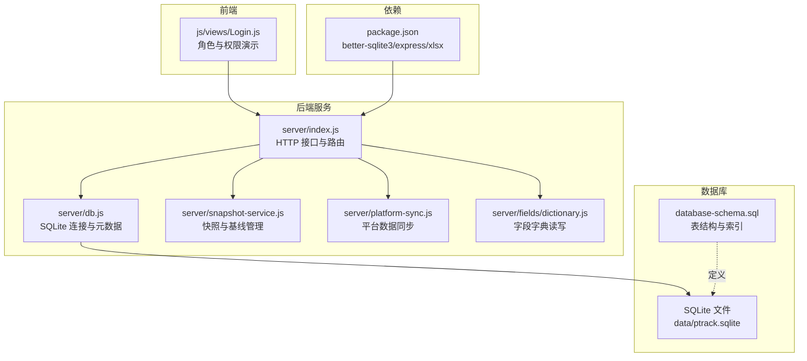

图示来源
- [server/index.js:1-775](file://server/index.js#L1-L775)
- [server/db.js:1-525](file://server/db.js#L1-L525)
- [server/snapshot-service.js:1-292](file://server/snapshot-service.js#L1-L292)
- [server/platform-sync.js:1-272](file://server/platform-sync.js#L1-L272)
- [server/fields/dictionary.js:1-70](file://server/fields/dictionary.js#L1-L70)
- [database-schema.sql:1-286](file://database-schema.sql#L1-L286)
- [package.json:1-19](file://package.json#L1-L19)

章节来源
- [server/index.js:1-775](file://server/index.js#L1-L775)
- [server/db.js:1-525](file://server/db.js#L1-L525)
- [database-schema.sql:1-286](file://database-schema.sql#L1-L286)
- [package.json:1-19](file://package.json#L1-L19)

## 核心组件
- 数据库连接与初始化：负责打开 SQLite 数据库、设置 WAL 模式、创建表与索引，并提供元数据（meta）、项目、审计、快照等 CRUD 方法。
- HTTP 服务与路由：提供 /api/* 接口，包含项目、工时、成本、审计、快照、元数据、平台同步、管理员操作等端点。
- 快照服务：生成导入/草稿/终审快照，维护基线版本，清理旧版快照键，确保快照库一致性。
- 平台同步：从外部平台抓取数据，合并到现有项目，触发公式计算与审计记录。
- 字段字典：读写 fields.json 并同步到前端脚本，用于字段元数据校验与前端展示。
- 登录与权限：前端演示角色与权限，后端通过元数据与流程控制实现访问限制。

章节来源
- [server/db.js:1-525](file://server/db.js#L1-L525)
- [server/index.js:1-775](file://server/index.js#L1-L775)
- [server/snapshot-service.js:1-292](file://server/snapshot-service.js#L1-L292)
- [server/platform-sync.js:1-272](file://server/platform-sync.js#L1-L272)
- [server/fields/dictionary.js:1-70](file://server/fields/dictionary.js#L1-L70)
- [js/views/Login.js:1-215](file://js/views/Login.js#L1-L215)

## 架构总览
后端以 Express 提供 REST API，better-sqlite3 直连本地 SQLite 文件，所有业务逻辑在单进程内完成，避免跨网络访问带来的安全风险。关键安全特性包括：
- 参数化查询与事务封装，降低注入与并发冲突风险
- 元数据驱动的权限控制与流程状态机
- 审计日志与快照不可变性，保障可追溯与可恢复
- 字段字典校验与输入验证，减少脏数据进入数据库

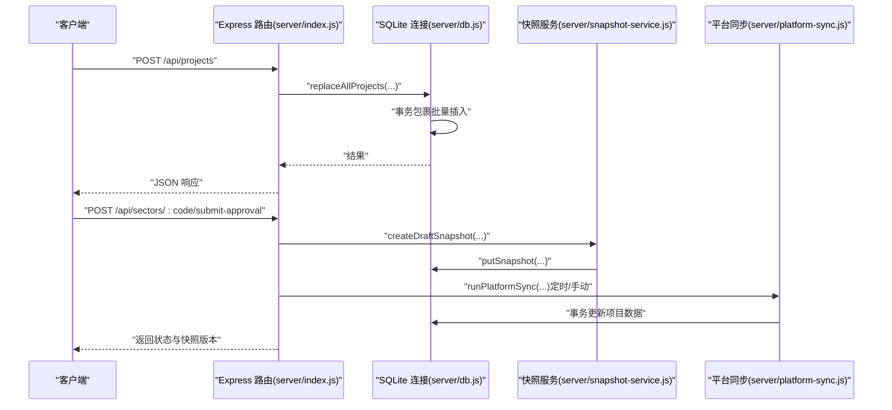

图示来源
- [server/index.js:112-138](file://server/index.js#L112-L138)
- [server/index.js:302-346](file://server/index.js#L302-L346)
- [server/db.js:268-278](file://server/db.js#L268-L278)
- [server/snapshot-service.js:114-137](file://server/snapshot-service.js#L114-L137)
- [server/platform-sync.js:214-262](file://server/platform-sync.js#L214-L262)

## 详细组件分析

### 数据库连接与安全
- 连接建立：在启动时创建 data/ptrack.sqlite，若目录不存在则自动创建；启用 WAL 模式提升并发读写性能与可靠性。
- 表与索引：在首次启动时创建 projects、audit_log、snapshots、meta、timesheet_entries、cost_entries 等表，并建立复合索引以优化查询。
- 元数据管理：通过 meta 表存储系统配置、流程状态、用户与组配置等，提供 getMeta/setMeta 读写方法，内部对 JSON 值进行序列化/反序列化。
- 默认数据：内置默认周期配置、用户、组注册表、板块管理员等，确保系统最小可用状态。

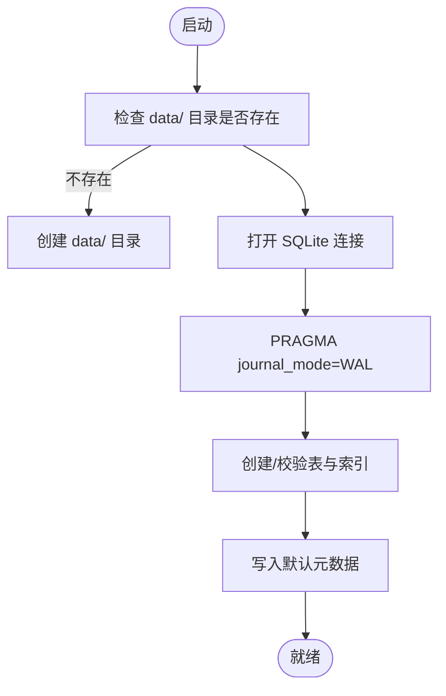

图示来源
- [server/db.js:11-60](file://server/db.js#L11-L60)
- [server/db.js:93-106](file://server/db.js#L93-L106)
- [server/db.js:144-169](file://server/db.js#L144-L169)

章节来源
- [server/db.js:1-525](file://server/db.js#L1-L525)

### 事务处理与并发控制
- 事务封装：批量替换项目、批量插入工时/成本、平台同步等关键写入路径均使用事务包裹，确保原子性与一致性。
- 并发模型：WAL 模式下允许多个读事务与一个写事务并发运行；better-sqlite3 在同一进程内串行执行命令，避免跨进程锁竞争。
- 锁状态：通过元数据 lockStatus 控制编辑锁，结合周期配置与自动解锁策略，避免并发写冲突。

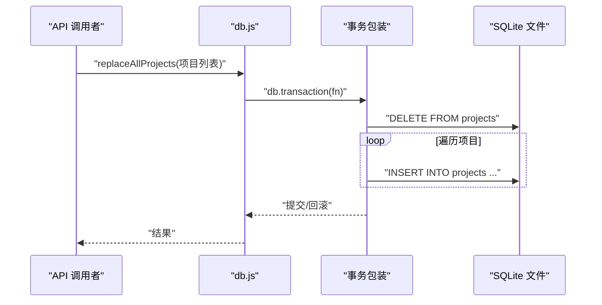

图示来源
- [server/db.js:268-278](file://server/db.js#L268-L278)
- [server/db.js:385-413](file://server/db.js#L385-L413)
- [server/db.js:447-460](file://server/db.js#L447-L460)

章节来源
- [server/db.js:268-278](file://server/db.js#L268-L278)
- [server/db.js:385-413](file://server/db.js#L385-L413)
- [server/db.js:447-460](file://server/db.js#L447-L460)

### SQL 注入防护与参数化查询
- 参数化查询：所有涉及用户输入的 SQL 使用占位符与 prepare/run 绑定参数，避免字符串拼接导致的注入风险。
- 输入验证：路由层对请求体进行基础校验（如 projects 必须为数组、字段字典必须为数组等），并在写入前进行 JSON 序列化与类型转换。
- 字段字典校验：写入字段字典前对数组格式、必填字段、枚举类型进行严格校验，防止异常字段进入系统。

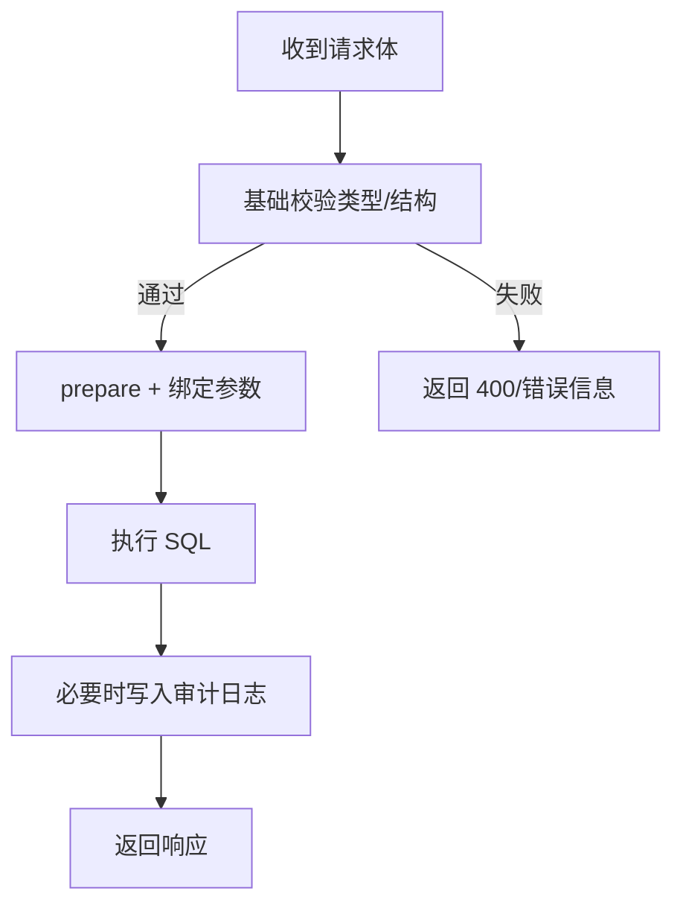

图示来源
- [server/index.js:112-138](file://server/index.js#L112-L138)
- [server/index.js:198-218](file://server/index.js#L198-L218)
- [server/fields/dictionary.js:20-41](file://server/fields/dictionary.js#L20-L41)

章节来源
- [server/index.js:112-138](file://server/index.js#L112-L138)
- [server/index.js:198-218](file://server/index.js#L198-L218)
- [server/fields/dictionary.js:20-41](file://server/fields/dictionary.js#L20-L41)

### 数据完整性与一致性
- 外键约束：monthly_records、prepayment_writeoffs、audit_log 等表对项目号建立外键约束，确保引用完整性。
- 唯一约束：monthly_records 对 (project_no, report_month) 唯一，snapshots 对 version 唯一，避免重复与歧义。
- 原子性：事务包裹批量写入，失败回滚，保持数据一致性。
- 快照不可变：快照版本作为不可变记录存入 snapshots 表，配合基线版本管理实现可追溯与可恢复。

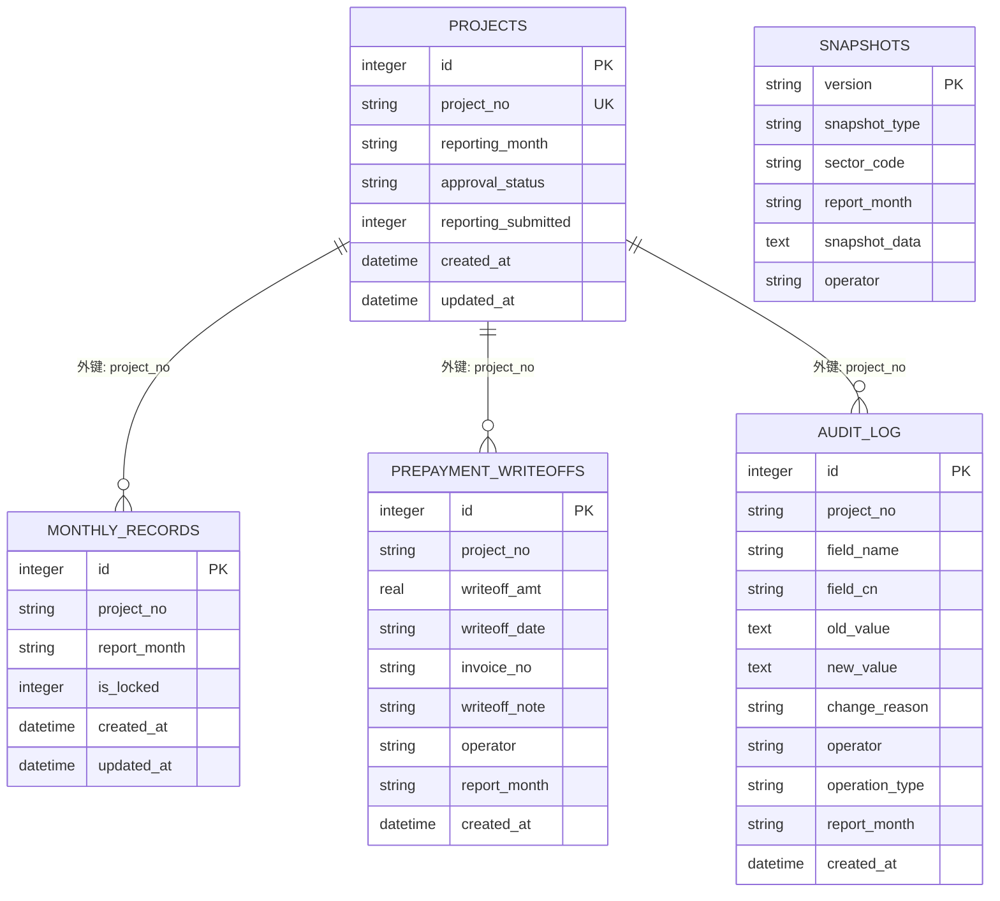

图示来源
- [database-schema.sql:12-87](file://database-schema.sql#L12-L87)
- [database-schema.sql:99-196](file://database-schema.sql#L99-L196)
- [database-schema.sql:205-223](file://database-schema.sql#L205-L223)
- [database-schema.sql:232-245](file://database-schema.sql#L232-L245)
- [database-schema.sql:254-268](file://database-schema.sql#L254-L268)

章节来源
- [database-schema.sql:1-286](file://database-schema.sql#L1-L286)

### 数据访问控制与权限
- 角色与权限：前端 Login.js 定义了 system_admin、executive_viewer、sector_admin、pm、sector_director、group_leader 等角色；后端通过元数据 users/groupRegistry/sectorAdmins 管理用户与权限。
- 路由级控制：部分管理端点仅允许 system_admin 或 sector_admin 访问；例如编辑器刷新数据端点要求角色为 system_admin 或 sector_admin。
- 流程与状态：通过 approvalStatus/reportingSubmitted/lockStatus 等状态控制不同角色的操作能力，避免越权修改。

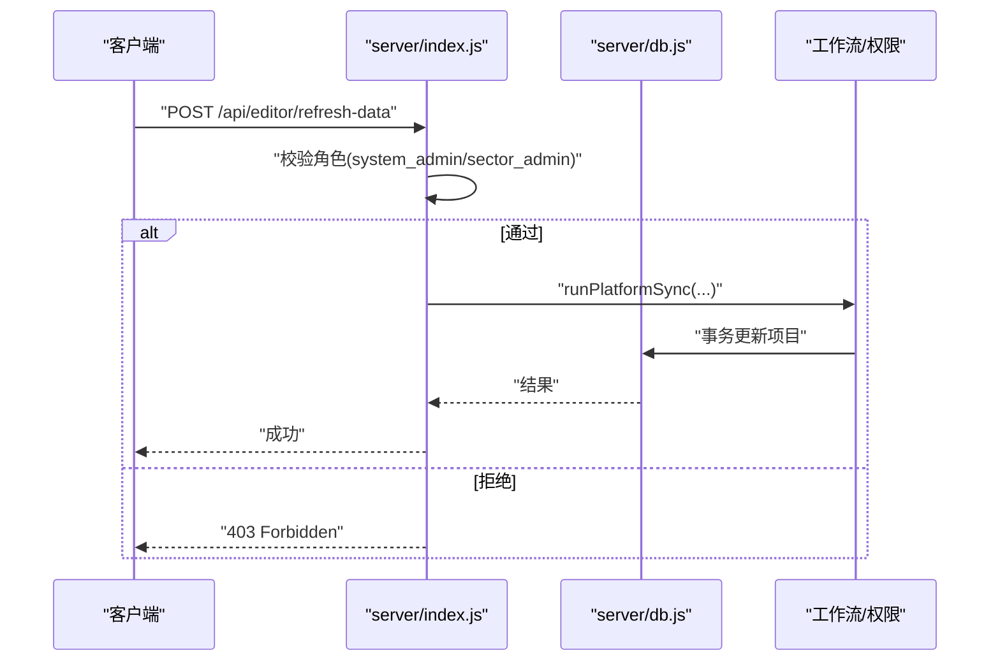

图示来源
- [js/views/Login.js:1-215](file://js/views/Login.js#L1-L215)
- [server/index.js:580-604](file://server/index.js#L580-L604)

章节来源
- [js/views/Login.js:1-215](file://js/views/Login.js#L1-L215)
- [server/index.js:580-604](file://server/index.js#L580-L604)

### 审计与可追溯性
- 审计日志：每次重要变更（如项目更新、导入、同步、提交、审批推进、归档）均写入 audit_log，包含字段名、中文名、旧值、新值、操作人、操作类型、报告月等。
- 快照不可变：快照版本作为不可变记录，配合基线版本管理，支持回溯与对比分析。
- 审计查询：提供审计日志查询接口，限制返回数量并按时间倒序排列，便于审计与取证。

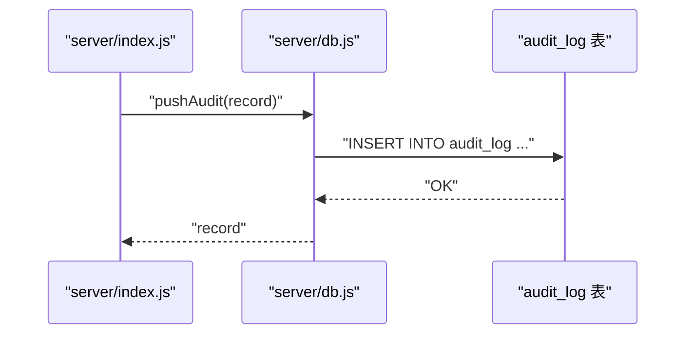

图示来源
- [server/index.js:170-182](file://server/index.js#L170-L182)
- [server/db.js:306-308](file://server/db.js#L306-L308)

章节来源
- [server/index.js:170-182](file://server/index.js#L170-L182)
- [server/db.js:306-308](file://server/db.js#L306-L308)

### 数据加密存储、敏感信息脱敏与访问权限
- 加密存储：当前实现未见数据库层面的透明加密（TDE）或列级加密；建议在部署层面对 SQLite 文件进行文件系统级加密（如 LUKS）或使用加密卷。
- 敏感信息脱敏：系统通过字段字典与前端展示控制敏感字段的可见范围；后端未对存储值进行加密或掩码处理。
- 访问权限：通过角色与元数据控制访问范围（公司/板块/群），并结合流程状态限制操作能力。

章节来源
- [server/fields/dictionary.js:11-18](file://server/fields/dictionary.js#L11-L18)
- [server/index.js:647-702](file://server/index.js#L647-L702)

### 备份策略、数据恢复与灾难恢复
- 快照与基线：通过快照服务生成 I/D/J 版本快照，维护 baselineVersion/ latestIVersion/latestJVersion，支持基线修复与旧版快照清理。
- 启动修复：启动时自动清理旧版快照键并尝试修复基线版本，若项目为空则清除相关元数据。
- 恢复流程：可通过重新导入初始化数据生成 I 版快照，或在归档后重置流程状态进入新一轮。

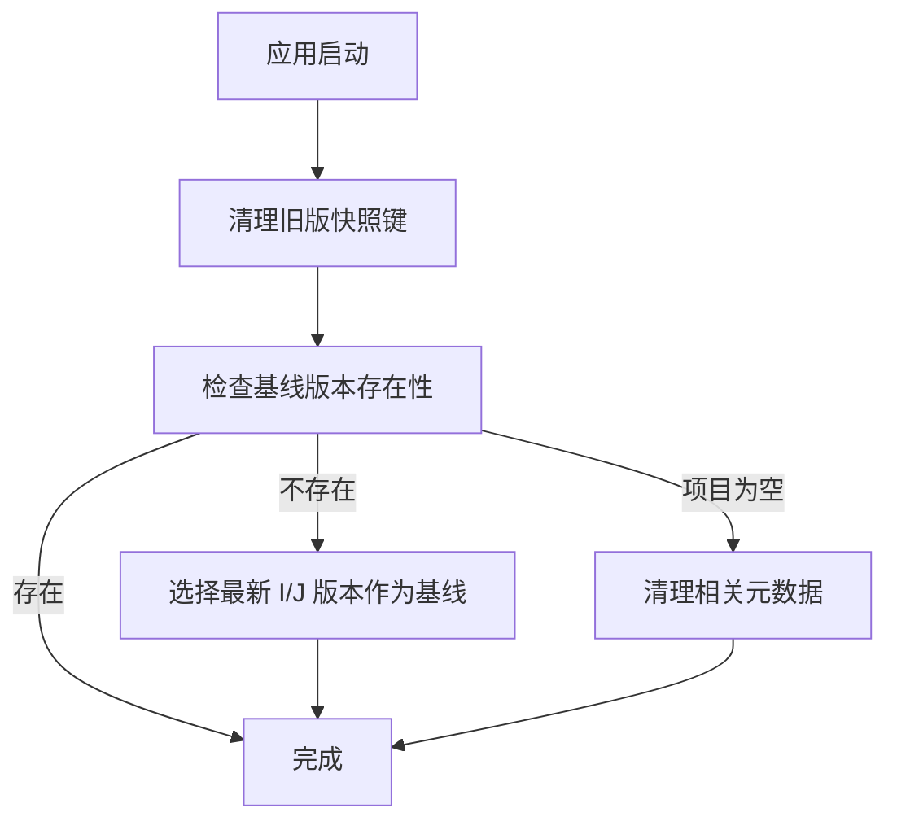

图示来源
- [server/snapshot-service.js:229-274](file://server/snapshot-service.js#L229-L274)

章节来源
- [server/snapshot-service.js:229-274](file://server/snapshot-service.js#L229-L274)

### 平台同步与数据一致性
- 同步策略：从外部平台抓取数据，合并到现有项目，仅更新 _system_ref，不覆盖已有显示字段；对新增项目应用平台显示字段并标记新增。
- 公式计算：合并后调用公式引擎计算派生字段，确保数据一致性。
- 审计记录：同步完成后写入审计日志，记录触发方式、统计信息与操作人。

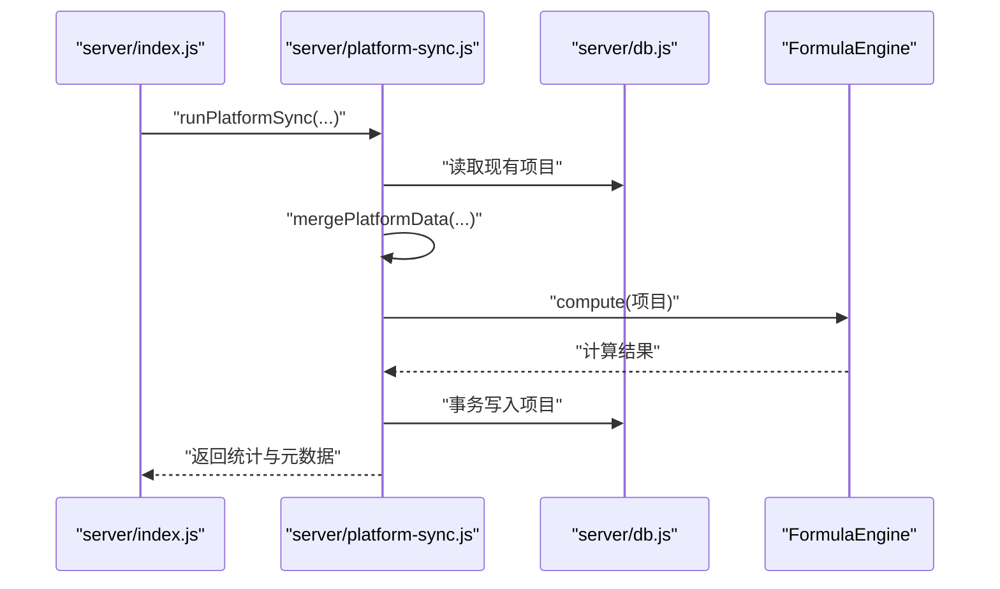

图示来源
- [server/platform-sync.js:214-262](file://server/platform-sync.js#L214-L262)
- [server/index.js:745-774](file://server/index.js#L745-L774)

章节来源
- [server/platform-sync.js:214-262](file://server/platform-sync.js#L214-L262)
- [server/index.js:745-774](file://server/index.js#L745-L774)

## 依赖关系分析
- Express：提供 HTTP 服务器与路由，限制请求体大小，处理静态资源。
- better-sqlite3：高性能本地 SQLite 驱动，支持 PRAGMA、事务与备份方法。
- xlsx：用于初始化数据与导入工时/成本数据。

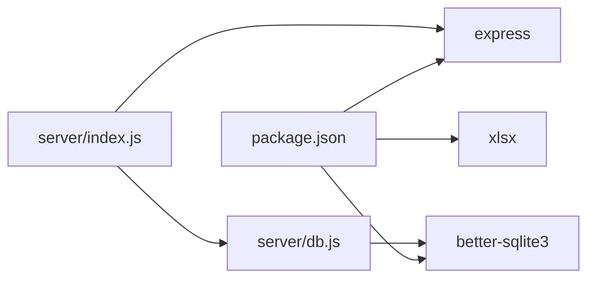

图示来源
- [package.json:13-17](file://package.json#L13-L17)
- [server/index.js:88-89](file://server/index.js#L88-L89)
- [server/db.js:3-5](file://server/db.js#L3-L5)

章节来源
- [package.json:1-19](file://package.json#L1-L19)
- [server/index.js:88-89](file://server/index.js#L88-L89)
- [server/db.js:3-5](file://server/db.js#L3-L5)

## 性能考量
- WAL 模式：启用 WAL 提升并发读性能与崩溃恢复能力。
- 索引策略：针对高频查询字段（如项目号、报告月、板块、状态）建立复合索引，减少全表扫描。
- 查询安全：使用参数化查询与 LIMIT 限制审计日志返回数量，避免大结果集导致的性能问题。
- 事务批处理：批量写入使用事务包裹，减少磁盘写入次数与锁持有时间。
- 定时同步：按配置小时数执行平台同步，避免频繁高负载。

章节来源
- [server/db.js:14](file://server/db.js#L14)
- [database-schema.sql:89-94](file://database-schema.sql#L89-L94)
- [server/index.js:89](file://server/index.js#L89)
- [server/index.js:757-774](file://server/index.js#L757-L774)

## 故障排查指南
- 数据库文件权限：确保 data/ 目录与 ptrack.sqlite 文件具备进程运行用户的读写权限。
- 启动失败：检查是否存在初始化 XLSX 文件；若缺失，服务会提示需要放置“初始数据.xlsx”后重启。
- 快照修复：启动时自动清理旧版快照键并尝试修复基线版本；若项目为空，相关元数据会被清理。
- 审计日志：若审计日志异常，检查 audit_log 表结构与索引是否正确创建。
- 平台同步：若同步失败，检查环境变量与平台 API 配置，当前实现依赖桩函数。

章节来源
- [server/index.js:30-65](file://server/index.js#L30-L65)
- [server/snapshot-service.js:229-274](file://server/snapshot-service.js#L229-L274)
- [server/platform-sync.js:200-206](file://server/platform-sync.js#L200-L206)

## 结论
本系统通过参数化查询、事务封装、WAL 模式与严格的元数据驱动权限控制，在本地 SQLite 环境下实现了较好的数据安全性与一致性。建议在生产环境中补充文件系统级加密、访问控制边界加固与定期备份演练，以进一步提升整体数据保护水平。

## 附录
- 数据库文件位置：data/ptrack.sqlite
- 依赖组件：better-sqlite3、express、xlsx
- 快照版本命名：I/J/D 前缀 + 日期 + 作用域 + 序号

章节来源
- [server/db.js:8-9](file://server/db.js#L8-L9)
- [package.json:13-17](file://package.json#L13-L17)
- [server/snapshot-service.js:54-68](file://server/snapshot-service.js#L54-L68)