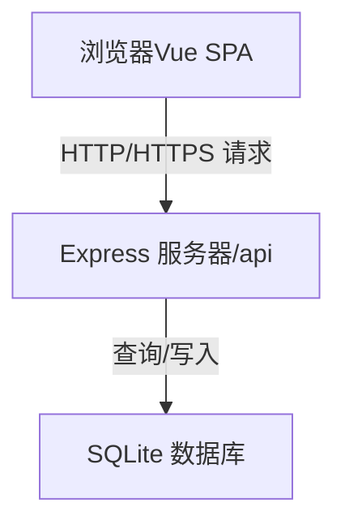
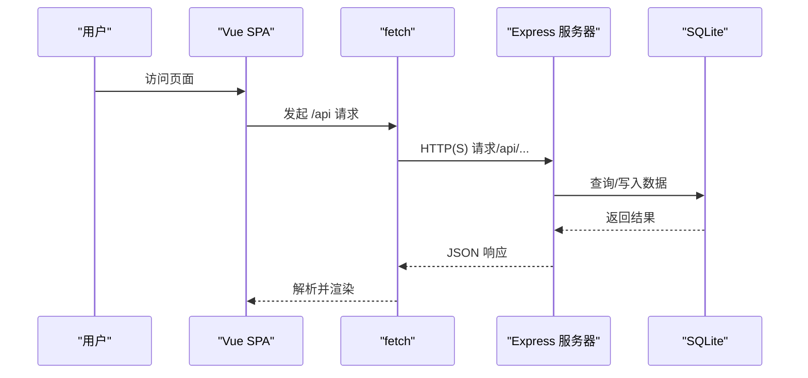
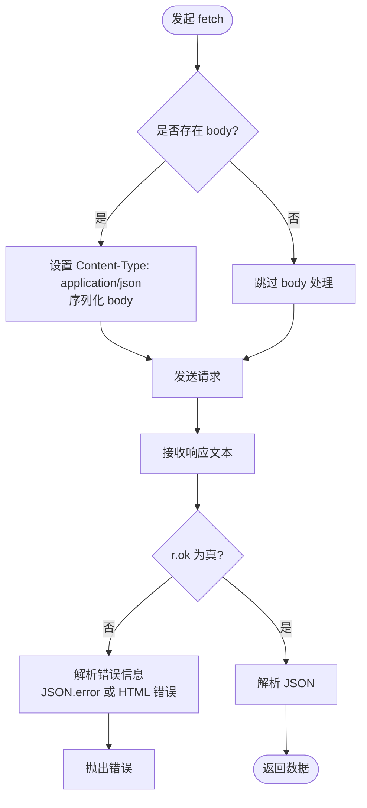
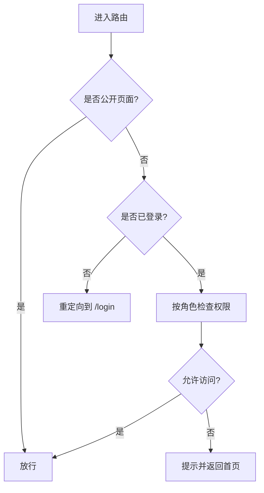
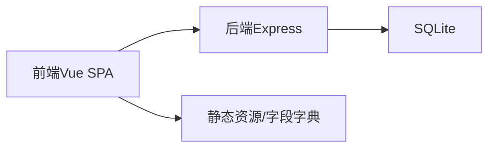

# 数据传输安全

<cite>
**本文引用的文件**
- [index.html](file://index.html)
- [app.js](file://js/app.js)
- [router.js](file://js/router.js)
- [store.js](file://js/store.js)
- [Login.js](file://js/views/Login.js)
- [AppLayout.js](file://js/components/AppLayout.js)
- [index.js](file://server/index.js)
- [db.js](file://server/db.js)
- [fields-data.js](file://config/fields/fields-data.js)
- [package.json](file://package.json)
</cite>

## 目录
1. [简介](#简介)
2. [项目结构](#项目结构)
3. [核心组件](#核心组件)
4. [架构总览](#架构总览)
5. [详细组件分析](#详细组件分析)
6. [依赖关系分析](#依赖关系分析)
7. [性能考量](#性能考量)
8. [故障排查指南](#故障排查指南)
9. [结论](#结论)
10. [附录](#附录)

## 简介
本文件聚焦于本项目的“数据传输安全”，围绕 HTTPS 通信安全、API 接口安全、数据加密传输、fetch 请求安全配置、CORS 策略与跨域访问控制、请求头安全、Content-Type 验证与响应数据校验、API 认证机制与会话安全、中间人攻击防护与证书验证、网络安全最佳实践与安全头配置等方面进行系统性梳理与说明。  
由于当前仓库未包含任何 HTTPS、CORS、安全头或认证令牌相关的实现代码，本文将以“现状分析 + 最佳实践建议”的方式，帮助团队在现有基础上逐步完善安全能力。

## 项目结构
项目采用前后端分离架构：
- 前端：基于浏览器的单页应用（SPA），通过 fetch 与后端 /api 交互，状态通过 Store 管理。
- 后端：基于 Node.js + Express 的 HTTP 服务器，提供 REST 风格 API，并以 better-sqlite3 持久化数据。
- 配置：静态资源与字段字典通过本地文件提供，开发环境默认监听本地端口。

图表来源
- [index.html](file://index.html)
- [index.js](file://server/index.js)
- [db.js](file://server/db.js)

章节来源
- [index.html](file://index.html)
- [index.js](file://server/index.js)
- [db.js](file://server/db.js)

## 核心组件
- 前端应用入口与路由：负责页面导航、权限控制与用户会话状态管理。
- 全局状态 Store：封装所有 /api 调用、错误处理与数据加载流程。
- 登录视图：演示式登录流程，实际生产应接入统一认证平台。
- 服务器 API：提供项目数据、快照、审批、元数据等接口。

章节来源
- [app.js](file://js/app.js)
- [router.js](file://js/router.js)
- [store.js](file://js/store.js)
- [Login.js](file://js/views/Login.js)

## 架构总览
前端通过 fetch 发起 HTTP(S) 请求到后端 /api，后端解析请求体、执行业务逻辑并返回 JSON 响应。当前未启用 HTTPS、CORS 中间件与安全头，也未实现令牌认证与会话管理。

图表来源
- [store.js](file://js/store.js)
- [index.js](file://server/index.js)
- [db.js](file://server/db.js)

## 详细组件分析

### 前端 fetch 安全配置与响应校验
- Content-Type 设置：当存在 body 时，默认设置为 application/json，避免后端无法正确解析。
- 响应处理：统一读取响应文本，若 r.ok 为假则解析错误消息（优先尝试 JSON.error，其次 HTML 中的错误内容），最终抛出错误。
- 错误提示：对常见错误（如 404 且为 /api/admin/ 路径）给出更明确的提示。

图表来源
- [store.js](file://js/store.js)

章节来源
- [store.js](file://js/store.js)

### 路由与权限控制
- 路由守卫：对需要认证的页面进行拦截；对特定路径（如 /admin、/audit、/fields）进行角色校验。
- 角色限制：不同角色可见/可访问的页面不同，避免越权访问。
- 登录后重定向：根据用户角色自动跳转到对应首页。

图表来源
- [router.js](file://js/router.js)

章节来源
- [router.js](file://js/router.js)

### 登录与会话
- 登录视图：演示式角色选择与用户模拟，不涉及真实认证。
- 会话存储：当前登录信息保存在 localStorage，未实现安全令牌或会话管理。
- 生产建议：应接入统一认证平台（如 OIDC/SAML），前端不再持久化敏感凭据。

章节来源
- [Login.js](file://js/views/Login.js)
- [store.js](file://js/store.js)

### 服务器 API 安全现状
- 未启用 HTTPS：当前仅监听本地端口，未配置 TLS。
- 未配置 CORS：未显式设置 Access-Control-Allow-*，浏览器同源策略默认生效。
- 未设置安全头：未配置 CSP、HSTS、X-Frame-Options 等安全头。
- 认证与授权：未实现 JWT/Session/Token 校验，所有 /api/* 在未登录情况下仍可被访问（路由守卫仅在前端生效）。

章节来源
- [index.js](file://server/index.js)
- [db.js](file://server/db.js)

### 字段字典与静态资源
- 字段字典通过静态文件提供，前端在缺少 /api/fields 时回退到本地静态资源。
- 建议：将敏感字段字典置于受保护的后端接口，避免泄露。

章节来源
- [fields-data.js](file://config/fields/fields-data.js)
- [store.js](file://js/store.js)

## 依赖关系分析
- 前端依赖：Vue、Element UI、jQuery、Popper、SheetJS 等，运行于浏览器。
- 后端依赖：Express、better-sqlite3、xlsx，提供 HTTP API 与数据库访问。
- 项目脚本：启动服务、导出初始 XLSX、同步字段等。

图表来源
- [package.json](file://package.json)
- [index.js](file://server/index.js)
- [db.js](file://server/db.js)

章节来源
- [package.json](file://package.json)

## 性能考量
- 前端：fetch 统一处理与错误解析，减少重复代码；路由守卫在前端进行，降低后端压力。
- 后端：Express 使用 json 解析器，支持较大请求体；数据库采用 WAL 模式提升并发性能。
- 建议：对高频接口增加缓存、限流与压缩，优化网络传输效率。

## 故障排查指南
- 404 且为 /api/admin/：提示接口不存在，需重启服务后重试。
- HTML 错误页面：从 <pre> 标签提取错误信息，便于定位。
- JSON 错误：优先使用响应体中的 error 字段。
- 网络错误：检查服务端是否启动、端口是否正确、是否启用 HTTPS。

章节来源
- [store.js](file://js/store.js)

## 结论
当前项目在前端实现了基础的路由守卫与错误处理，但在 HTTPS、CORS、安全头、认证与会话管理方面尚未落地。建议尽快引入 HTTPS、CORS 中间件、安全头、统一认证与令牌管理，以满足生产环境的数据传输安全要求。

## 附录

### HTTPS 通信安全
- 强制使用 HTTPS：所有对外暴露的 API 必须通过 HTTPS 提供，防止明文传输与中间人攻击。
- 证书与 TLS：使用受信 CA 签发的证书，启用现代 TLS 版本与加密套件，禁用弱算法。
- 证书验证：客户端严格校验证书链与主机名，避免自签名证书带来的信任风险。

### API 接口安全
- CORS 策略：仅允许受信域名访问，设置最小化允许方法与头，避免通配符。
- 内容类型校验：后端严格校验 Content-Type，拒绝非 JSON 请求体。
- 输入验证与参数过滤：对所有输入参数进行白名单校验与长度/范围限制。
- 速率限制：对 /api/* 接口实施速率限制，防暴力破解与滥用。
- 安全日志：记录异常请求与错误，便于审计与溯源。

### 数据加密传输
- 传输层加密：强制 HTTPS，禁用 HTTP。
- 敏感字段脱敏：对密码、令牌等敏感字段在日志与响应中脱敏。
- 响应数据校验：确保返回 JSON 结构符合预期，避免解析异常导致的安全问题。

### 认证机制与会话安全
- 统一认证：接入 OIDC/SAML 或企业统一认证平台，前端不再持久化敏感凭据。
- 令牌管理：使用短期有效的访问令牌与刷新令牌，令牌存储于安全上下文（HttpOnly Cookie 或 Web Crypto）。
- 会话安全：设置合理的过期时间、滑动过期与强制登出机制，防止会话劫持。

### 中间人攻击防护与证书验证
- 证书固定（Pinning）：在移动端或受限环境下启用证书固定，降低证书伪造风险。
- HSTS：启用严格传输安全头，强制浏览器使用 HTTPS。
- 证书轮换：建立自动化证书轮换与监控机制，确保证书有效性。

### 网络安全最佳实践与安全头
- 安全头建议：Content-Security-Policy、X-Content-Type-Options、X-Frame-Options、Referrer-Policy、Permissions-Policy 等。
- 静态资源保护：对静态资源启用缓存与完整性校验（SRI）。
- 日志与监控：记录异常访问与错误，结合 WAF/IDS/IPS 实现主动防护。