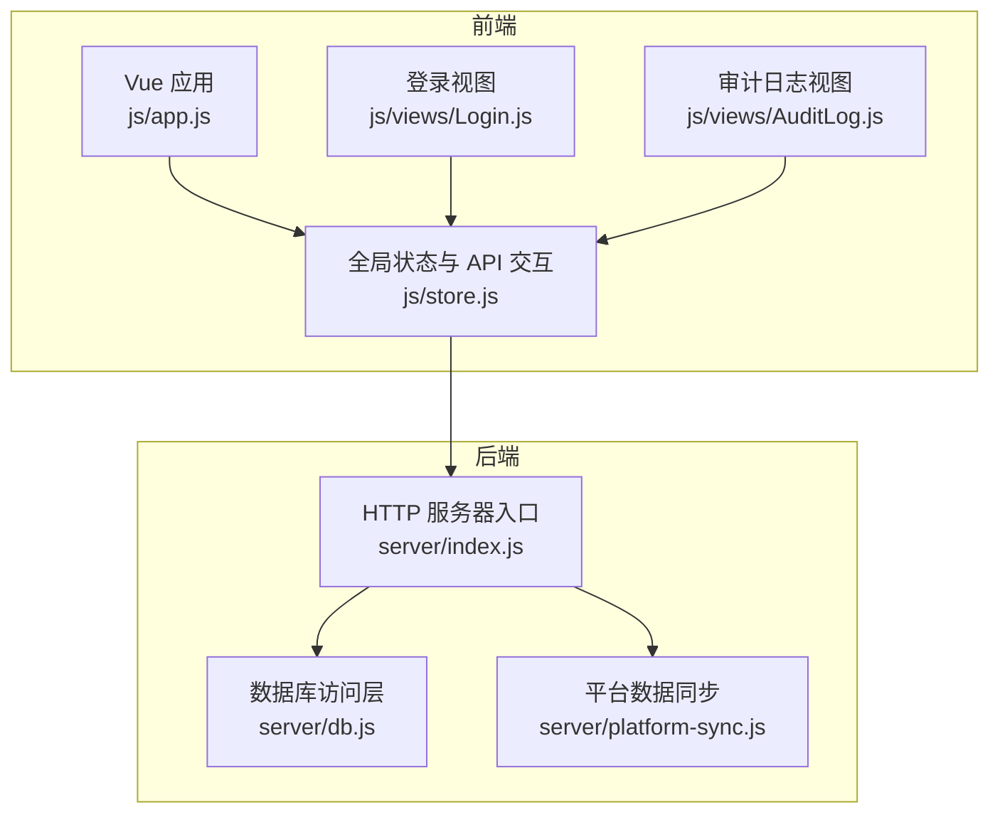
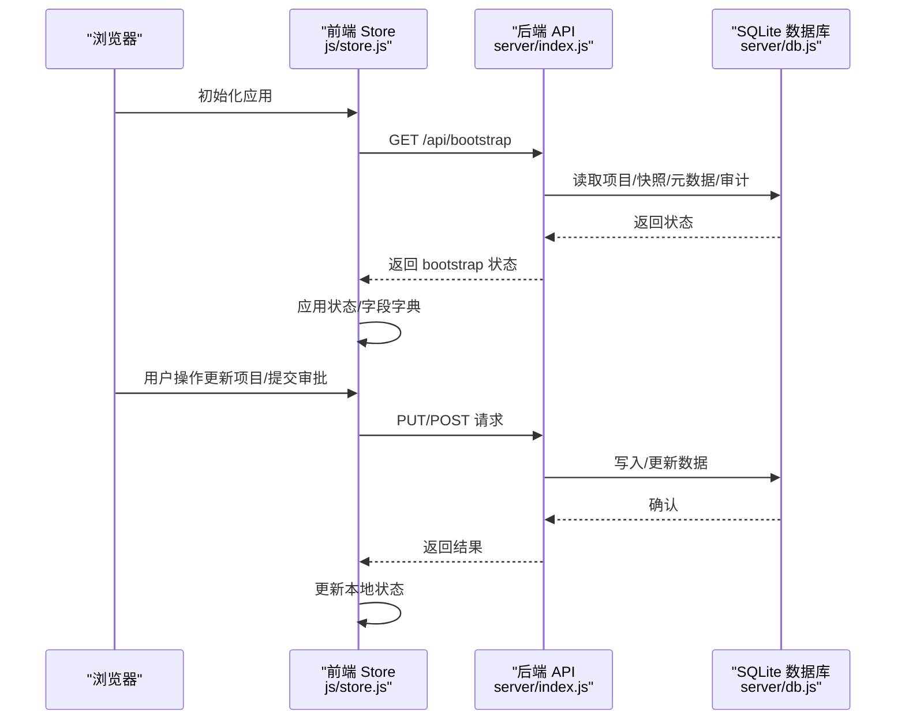
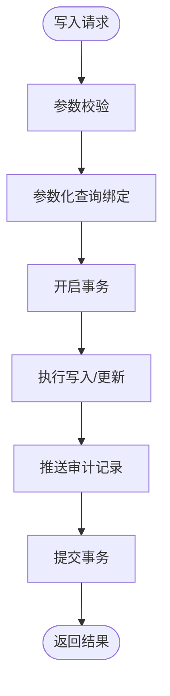
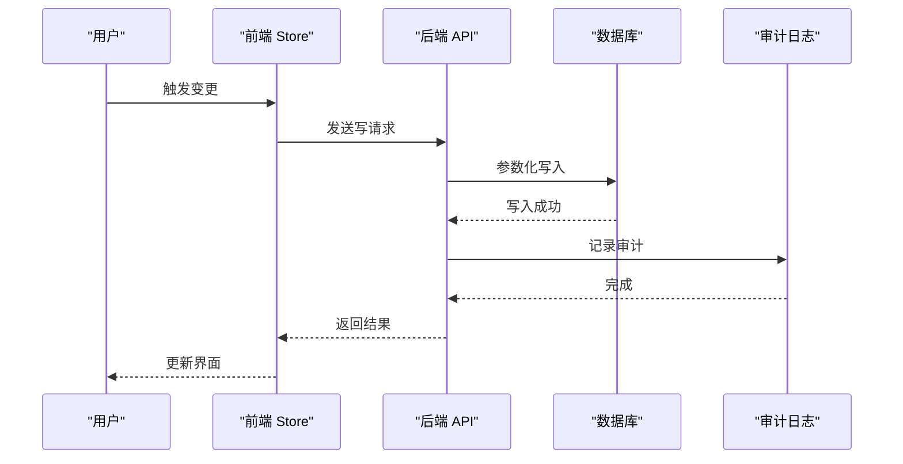
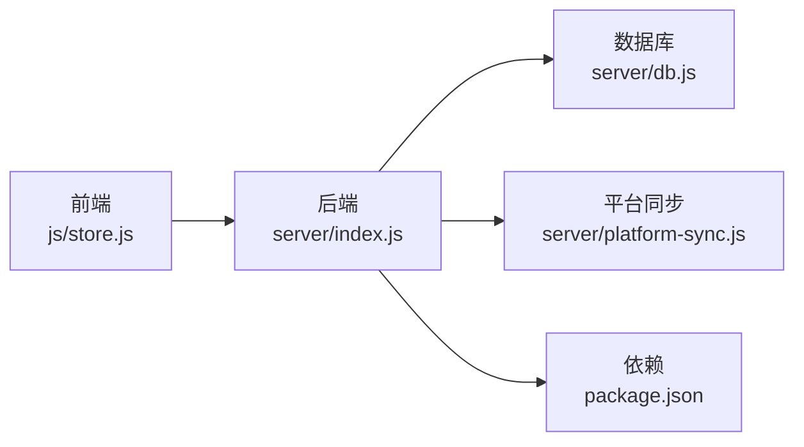

# 数据安全

<cite>
**本文引用的文件**
- [server/db.js](file://server/db.js)
- [server/index.js](file://server/index.js)
- [js/store.js](file://js/store.js)
- [js/views/Login.js](file://js/views/Login.js)
- [js/views/AuditLog.js](file://js/views/AuditLog.js)
- [server/platform-sync.js](file://server/platform-sync.js)
- [database-schema.sql](file://database-schema.sql)
- [package.json](file://package.json)
- [.gitignore](file://.gitignore)
</cite>

## 目录
1. [简介](#简介)
2. [项目结构](#项目结构)
3. [核心组件](#核心组件)
4. [架构总览](#架构总览)
5. [详细组件分析](#详细组件分析)
6. [依赖关系分析](#依赖关系分析)
7. [性能考量](#性能考量)
8. [故障排查指南](#故障排查指南)
9. [结论](#结论)
10. [附录](#附录)

## 简介
本文件面向“项目执行追踪平台”的数据安全保护体系，围绕前端数据存储安全、后端数据保护与传输加密机制展开，结合现有实现对本地存储安全（localStorage）、数据加密存储与敏感信息保护策略、数据库安全（db.js）中的数据访问控制、SQL 注入防护与数据完整性保障、API 通信安全与 HTTPS 使用、数据脱敏与访问日志、安全审计机制、数据备份与灾难恢复、数据泄露防护方案以及合规与监控措施进行系统性说明与建议。

## 项目结构
项目采用前后端分离架构：
- 前端：基于 Vue 的单页应用，通过 store.js 与后端 API 交互，业务数据经由 SQLite 同步；登录信息使用 localStorage。
- 后端：Express 服务，提供 REST API，使用 better-sqlite3 访问 SQLite 数据库，内置审计日志与快照管理。

图表来源
- [js/app.js:1-47](file://js/app.js#L1-L47)
- [js/store.js:1-602](file://js/store.js#L1-L602)
- [js/views/Login.js:1-215](file://js/views/Login.js#L1-L215)
- [js/views/AuditLog.js:1-239](file://js/views/AuditLog.js#L1-L239)
- [server/index.js:1-775](file://server/index.js#L1-L775)
- [server/db.js:1-525](file://server/db.js#L1-L525)
- [server/platform-sync.js:1-272](file://server/platform-sync.js#L1-L272)

章节来源
- [js/app.js:1-47](file://js/app.js#L1-L47)
- [js/store.js:1-602](file://js/store.js#L1-L602)
- [server/index.js:1-775](file://server/index.js#L1-L775)

## 核心组件
- 前端状态与 API 层（js/store.js）
  - 负责与后端 API 通信、状态管理、字段字典加载、快照与审批流程交互。
  - 登录信息存放在 localStorage，业务数据来自 SQLite（经 API 同步）。
- 后端 API 层（server/index.js）
  - 提供 /api/* 接口，包括项目、审计、快照、元数据、审批、平台同步等。
  - 对部分敏感端点进行访问控制（如刷新平台数据仅限系统/板块管理员）。
- 数据库访问层（server/db.js）
  - better-sqlite3 访问 SQLite，提供项目、审计、快照、元数据、工时/成本明细等 CRUD。
  - 包含默认元数据初始化、锁定期计算、工作流迁移与同步。
- 平台数据同步（server/platform-sync.js）
  - 合并外部平台数据，更新项目系统引用字段，支持定时与手动触发。
- 审计与日志（js/views/AuditLog.js）
  - 提供审计日志查询、筛选、导出能力，支持按用户、项目、字段、时间范围过滤。

章节来源
- [js/store.js:1-602](file://js/store.js#L1-L602)
- [server/index.js:1-775](file://server/index.js#L1-L775)
- [server/db.js:1-525](file://server/db.js#L1-L525)
- [server/platform-sync.js:1-272](file://server/platform-sync.js#L1-L272)
- [js/views/AuditLog.js:1-239](file://js/views/AuditLog.js#L1-L239)

## 架构总览
系统通过前端 store.js 与后端 index.js 交互，后端通过 db.js 访问 SQLite。平台数据通过 platform-sync.js 同步，审计日志贯穿所有写操作。

图表来源
- [js/store.js:268-275](file://js/store.js#L268-L275)
- [server/index.js:91-100](file://server/index.js#L91-L100)
- [server/db.js:194-266](file://server/db.js#L194-L266)

## 详细组件分析

### 前端数据存储安全（localStorage 与业务数据）
- 登录信息与界面偏好
  - 登录用户信息保存在 localStorage，便于会话保持与界面状态记忆。
  - 建议：对敏感字段进行最小化存储，避免在 localStorage 中存放高敏感凭据；若需持久化登录态，应结合后端安全令牌与安全 Cookie（见后续章节）。
- 业务数据来源
  - 业务数据来自 better-sqlite3（经 API 同步），前端不直接持久化敏感业务数据到 localStorage。
- 前端安全建议
  - 限制 localStorage 使用范围，仅存放非敏感配置与临时状态。
  - 对涉及用户输入的本地存储进行严格校验与最小化原则。
  - 若未来引入离线场景，建议采用受控的 IndexedDB 或服务端同步策略，避免敏感数据落盘。

章节来源
- [js/store.js:8-19](file://js/store.js#L8-L19)
- [js/store.js:95-128](file://js/store.js#L95-L128)
- [js/store.js:268-275](file://js/store.js#L268-L275)

### 后端数据保护与数据库安全（db.js）
- 数据库访问控制
  - 通过模块化封装数据库操作函数，集中管理读写与事务，降低越权风险。
  - 默认元数据初始化与工作流迁移逻辑集中在 db.js，减少外部误用风险。
- SQL 注入防护
  - 使用 better-sqlite3 的参数化查询（prepare + run），避免字符串拼接导致注入。
  - 示例：upsert、replace、insert/delete 等均通过参数绑定执行。
- 数据完整性保障
  - 使用事务（transaction）批量写入，确保一致性。
  - 表结构定义明确主键、唯一约束与外键，索引优化查询性能。
- 审计与日志
  - 所有写操作均推送审计记录，便于追踪与取证。
- 敏感信息保护策略
  - 当前实现未对数据库内容进行加密存储；建议在生产环境启用 SQLite 加密扩展（如 SQLCipher）或在文件系统层面进行磁盘加密。
  - 对审计日志中的敏感字段（如原始 payload）进行脱敏处理（见“数据脱敏”章节）。

图表来源
- [server/db.js:268-283](file://server/db.js#L268-L283)
- [server/db.js:306-308](file://server/db.js#L306-L308)

章节来源
- [server/db.js:11-60](file://server/db.js#L11-L60)
- [server/db.js:268-283](file://server/db.js#L268-L283)
- [server/db.js:306-308](file://server/db.js#L306-L308)
- [database-schema.sql:1-286](file://database-schema.sql#L1-L286)

### API 通信安全与 HTTPS 使用
- 当前实现
  - 前端通过 fetch 发起 HTTP 请求，未强制使用 HTTPS。
  - 后端监听本地端口（默认 3000），未内置 TLS/HTTPS。
- 安全建议
  - 强制使用 HTTPS，部署时启用 TLS 证书与安全套件。
  - 在前端设置安全响应头（如 CSP、HSTS），防止 XSS 与中间人攻击。
  - 对敏感端点增加鉴权与速率限制，避免暴力破解与滥用。

章节来源
- [js/store.js:66-93](file://js/store.js#L66-L93)
- [server/index.js:771-775](file://server/index.js#L771-L775)

### 数据脱敏、访问日志与安全审计
- 数据脱敏
  - 审计日志中可记录字段名与值，建议对敏感字段（如个人身份、账户、密码、原始 payload）进行脱敏或最小化展示。
- 访问日志
  - 后端未内置 HTTP 访问日志；可在 Express 中接入日志中间件，记录请求方法、路径、IP、UA、状态码与耗时。
- 安全审计
  - 审计日志视图支持按用户、项目、字段、时间范围筛选与导出，便于合规审计与问题定位。

图表来源
- [server/index.js:170-182](file://server/index.js#L170-L182)
- [server/db.js:306-308](file://server/db.js#L306-L308)
- [js/views/AuditLog.js:23-38](file://js/views/AuditLog.js#L23-L38)

章节来源
- [js/views/AuditLog.js:1-239](file://js/views/AuditLog.js#L1-L239)
- [server/index.js:170-182](file://server/index.js#L170-L182)
- [server/db.js:306-308](file://server/db.js#L306-L308)

### 数据备份策略、灾难恢复与数据泄露防护
- 备份策略
  - SQLite 文件位于 data 目录，建议定期备份 .sqlite、.sqlite-wal、.sqlite-shm 文件。
  - 结合增量备份与全量备份，保留多版本快照（利用现有快照机制）。
- 灾难恢复
  - 快照机制用于审批节点不可变数据保存；建议在恢复时优先使用最近可用快照。
  - 平台数据同步失败时，应具备回滚与重试机制。
- 泄露防护
  - 限制 .gitignore 中排除的敏感文件（如 .sqlite）不被纳入版本控制。
  - 对日志与导出文件进行最小化原则，避免敏感数据外泄。

章节来源
- [.gitignore:1-11](file://.gitignore#L1-L11)
- [server/db.js:310-313](file://server/db.js#L310-L313)
- [server/index.js:492-516](file://server/index.js#L492-L516)

### 数据加密存储与传输加密
- 加密存储
  - 当前未启用数据库加密；建议在生产环境启用 SQLCipher 或文件系统级磁盘加密。
- 传输加密
  - 建议在反向代理层（如 Nginx/Traefik）启用 TLS 终止，或在 Node 侧启用 HTTPS。
  - 前端与后端之间使用 HTTPS，避免中间人攻击与数据篡改。

章节来源
- [package.json:13-17](file://package.json#L13-L17)
- [server/index.js:771-775](file://server/index.js#L771-L775)

### 登录与权限控制
- 登录流程
  - 前端登录视图提供角色选择与用户模拟，实际上线后应由统一平台鉴权。
- 权限控制
  - 部分端点仅允许系统/板块管理员调用（如刷新平台数据），其余端点通过角色与状态控制访问。
- 建议
  - 引入 JWT 或会话令牌，结合安全 Cookie（HttpOnly、SameSite、Secure）与 CSRF 防护。
  - 对敏感操作（如重置、导入、归档）增加二次确认与审计记录。

章节来源
- [js/views/Login.js:1-215](file://js/views/Login.js#L1-L215)
- [server/index.js:581-604](file://server/index.js#L581-L604)

## 依赖关系分析
- 前端依赖
  - Vue 生态与第三方组件（Element UI），通过 store.js 统一发起 API 请求。
- 后端依赖
  - Express 提供 HTTP 服务，better-sqlite3 访问 SQLite，xlsx 用于导入导出。
- 安全依赖
  - 当前未引入专门的安全中间件（如 helmet、rate-limit、cors 等），建议补充。

图表来源
- [js/store.js:66-93](file://js/store.js#L66-L93)
- [server/index.js:1-775](file://server/index.js#L1-L775)
- [server/db.js:1-525](file://server/db.js#L1-L525)
- [server/platform-sync.js:1-272](file://server/platform-sync.js#L1-L272)
- [package.json:1-19](file://package.json#L1-L19)

章节来源
- [package.json:1-19](file://package.json#L1-L19)

## 性能考量
- SQLite 读写
  - 使用 WAL 模式提升并发读写性能；合理使用索引（如项目主表、审计日志、明细表）。
- 前端渲染
  - 审计日志分页与筛选，避免一次性加载大量数据。
- 平台同步
  - 定时同步与手动触发相结合，避免高峰时段造成性能抖动。

章节来源
- [server/db.js:11-60](file://server/db.js#L11-L60)
- [js/views/AuditLog.js:35-86](file://js/views/AuditLog.js#L35-L86)
- [server/index.js:745-775](file://server/index.js#L745-L775)

## 故障排查指南
- 常见问题
  - 无法加载数据：检查后端服务是否启动、端口占用与静态资源路径。
  - 审计日志为空：确认写操作是否成功推送审计记录。
  - 平台同步失败：检查触发条件与日志输出，必要时手动重试。
- 建议
  - 在后端增加统一错误处理与健康检查端点。
  - 对关键操作（导入、归档、重置）增加幂等性与回滚机制。

章节来源
- [js/app.js:30-44](file://js/app.js#L30-L44)
- [server/index.js:745-775](file://server/index.js#L745-L775)

## 结论
本系统在前端与后端层面均具备基础的数据安全能力：前端使用参数化查询与最小化敏感数据存储，后端通过事务与审计日志保障数据一致性与可追溯性。为进一步提升安全性，建议在生产环境中启用 HTTPS、数据库加密、统一鉴权与会话管理、访问日志与安全中间件，并完善数据脱敏与合规审计流程。

## 附录
- 数据库表结构概览（节选）
  - 项目主表、月度填报记录、年度基线、预收款核销、审计日志、审批快照等。
- 依赖清单
  - Express、better-sqlite3、xlsx 等。

章节来源
- [database-schema.sql:1-286](file://database-schema.sql#L1-L286)
- [package.json:1-19](file://package.json#L1-L19)