# 访问控制机制

<cite>
**本文档引用的文件**
- [server/index.js](file://server/index.js)
- [server/db.js](file://server/db.js)
- [server/sector-workflow.js](file://server/sector-workflow.js)
- [js/router.js](file://js/router.js)
- [js/store.js](file://js/store.js)
- [js/views/Login.js](file://js/views/Login.js)
- [js/data-scope.js](file://js/data-scope.js)
- [js/components/AppLayout.js](file://js/components/AppLayout.js)
- [js/views/AdminSettings.js](file://js/views/AdminSettings.js)
- [js/views/AuditLog.js](file://js/views/AuditLog.js)
- [js/app.js](file://js/app.js)
- [database-schema.sql](file://database-schema.sql)
</cite>

## 目录
1. [简介](#简介)
2. [项目结构](#项目结构)
3. [核心组件](#核心组件)
4. [架构概览](#架构概览)
5. [详细组件分析](#详细组件分析)
6. [依赖关系分析](#依赖关系分析)
7. [性能考虑](#性能考虑)
8. [故障排除指南](#故障排除指南)
9. [结论](#结论)
10. [附录](#附录)

## 简介

本项目实现了基于角色的访问控制（RBAC）机制，结合前端路由守卫和后端权限验证，构建了完整的权限管理体系。系统支持多层级角色定义、数据范围控制、权限继承和审计日志等功能。

## 项目结构

项目采用前后端分离的架构设计，主要分为以下几个层次：

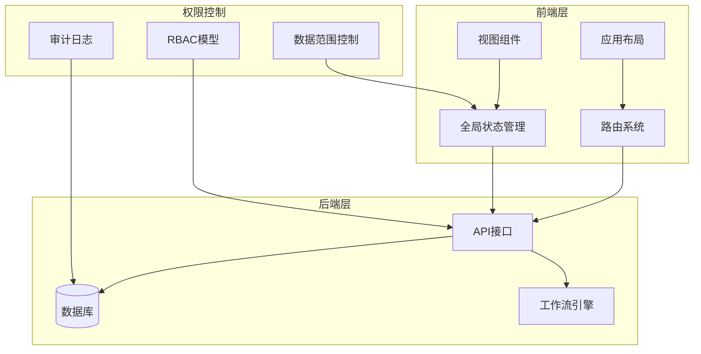

**图表来源**
- [js/router.js:1-137](file://js/router.js#L1-L137)
- [js/store.js:1-602](file://js/store.js#L1-L602)
- [server/index.js:1-775](file://server/index.js#L1-L775)

**章节来源**
- [js/router.js:1-137](file://js/router.js#L1-L137)
- [js/store.js:1-602](file://js/store.js#L1-L602)
- [server/index.js:1-775](file://server/index.js#L1-L775)

## 核心组件

### 角色管理系统

系统定义了六种核心角色，每种角色具有明确的权限边界：

| 角色 | ID | 描述 | 权限范围 |
|------|----|------|----------|
| 系统管理员 | system_admin | 全功能管理员 | 所有功能完全访问 |
| 经营管理（只读） | executive_viewer | 财务/管理层 | 只读访问，支持数据范围过滤 |
| 板块管理员 | sector_admin | 板块数据管理 | 板块内项目管理 |
| 项目经理 | pm | 项目数据填报 | 个人项目数据 |
| 板块总监 | sector_director | 审批流程 | 审批相关功能 |
| 项目群群主 | group_leader | 最终审批 | 公司级审批 |

### 权限矩阵

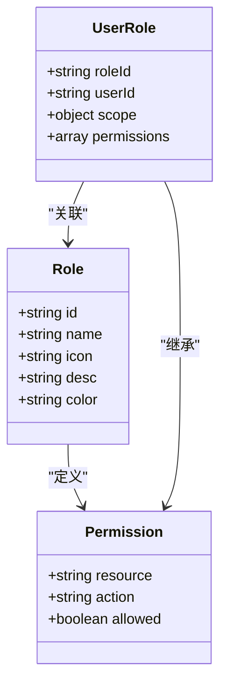

**图表来源**
- [js/views/Login.js:7-50](file://js/views/Login.js#L7-L50)
- [js/router.js:95-131](file://js/router.js#L95-L131)

### 数据范围控制

系统实现了三层数据访问控制：

1. **公司级访问**：全公司数据可见
2. **板块级访问**：仅限指定板块数据
3. **项目群访问**：跨板块项目群数据

**章节来源**
- [js/data-scope.js:13-42](file://js/data-scope.js#L13-L42)
- [js/views/Login.js:80-97](file://js/views/Login.js#L80-L97)

## 架构概览

系统采用混合权限模型，结合前端路由控制和后端API验证：

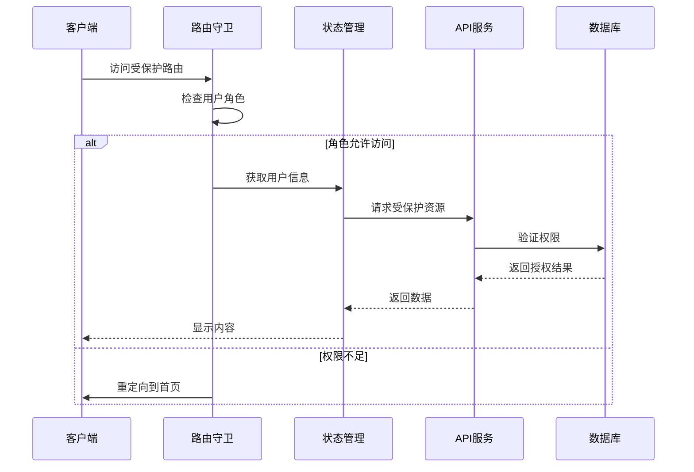

**图表来源**
- [js/router.js:84-132](file://js/router.js#L84-L132)
- [js/store.js:268-275](file://js/store.js#L268-L275)

## 详细组件分析

### 前端权限控制

前端采用Vue Router的导航守卫实现权限控制：

#### 路由守卫机制

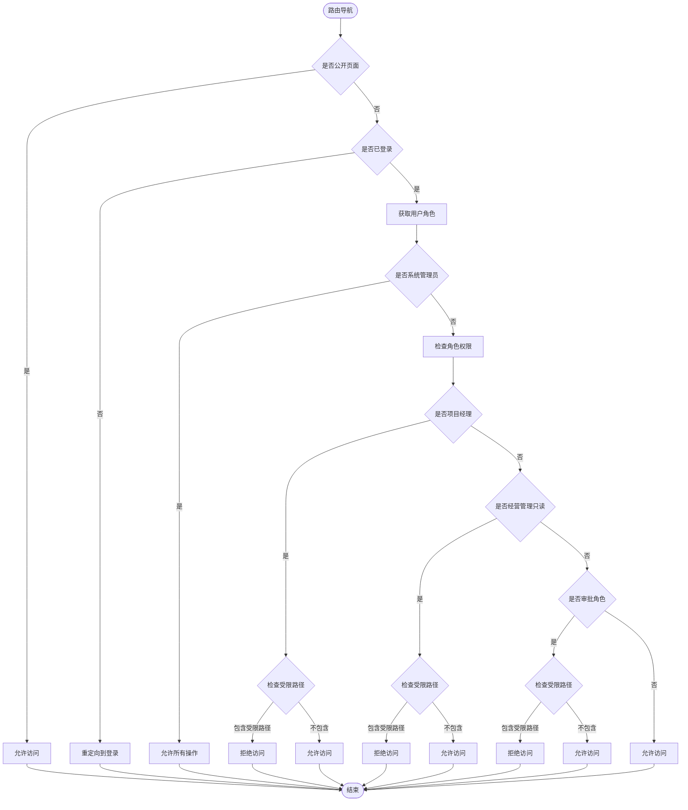

**图表来源**
- [js/router.js:84-132](file://js/router.js#L84-L132)

#### 布局权限控制

应用布局根据用户角色动态显示菜单项：

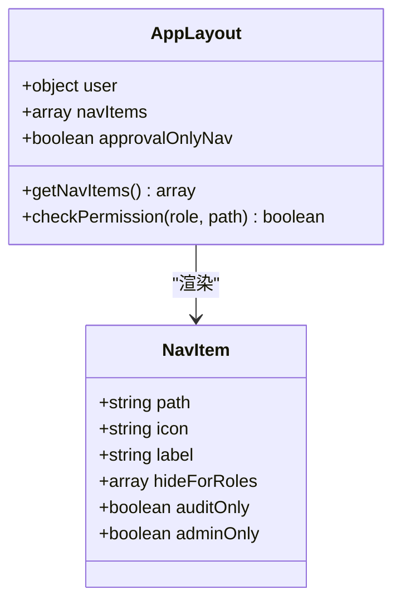

**图表来源**
- [js/components/AppLayout.js:18-54](file://js/components/AppLayout.js#L18-L54)

**章节来源**
- [js/router.js:77-132](file://js/router.js#L77-L132)
- [js/components/AppLayout.js:31-133](file://js/components/AppLayout.js#L31-L133)

### 后端权限验证

后端API接口实现细粒度的权限控制：

#### API权限控制

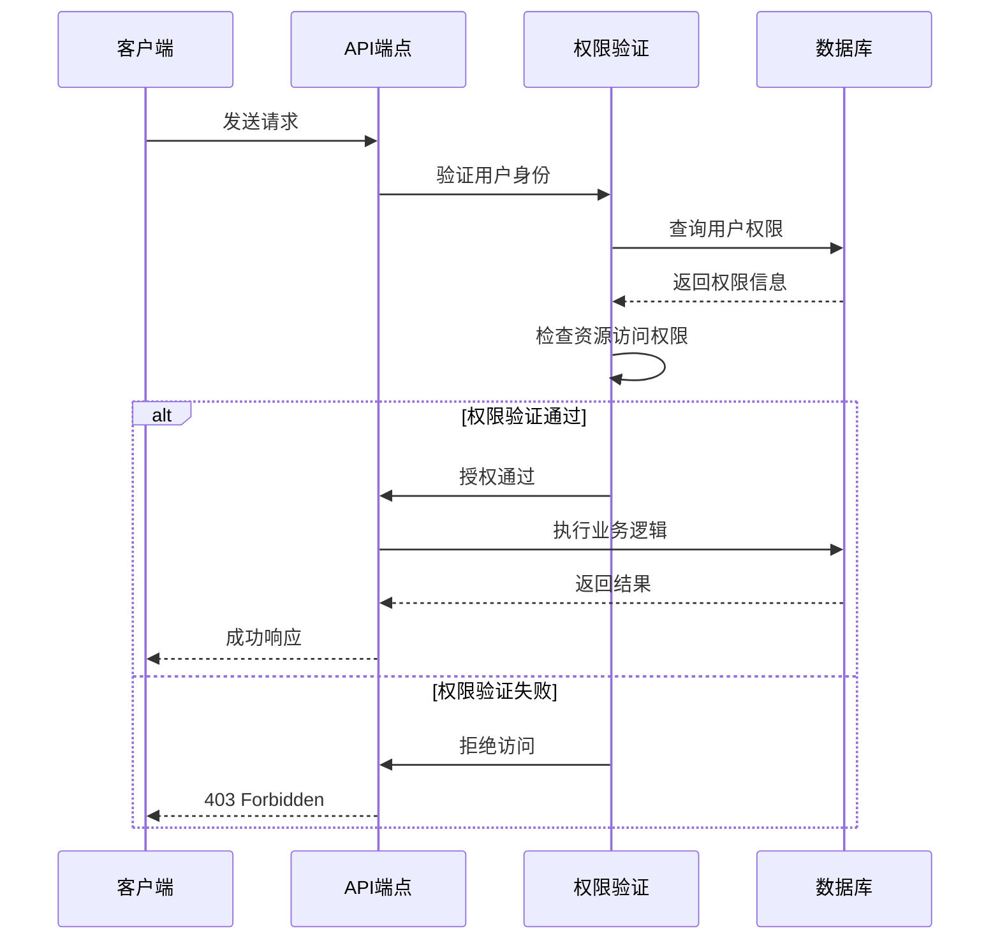

**图表来源**
- [server/index.js:586-590](file://server/index.js#L586-L590)

#### 数据访问控制

后端实现多层数据访问控制：

**章节来源**
- [server/index.js:198-218](file://server/index.js#L198-L218)
- [server/db.js:194-266](file://server/db.js#L194-L266)

### 混合权限模型

系统采用前端路由控制和后端API验证相结合的混合模型：

#### 前后端协同机制

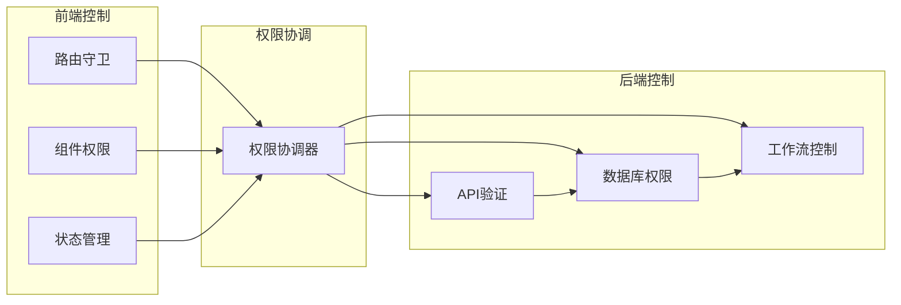

**图表来源**
- [js/router.js:84-132](file://js/router.js#L84-L132)
- [server/index.js:586-590](file://server/index.js#L586-L590)

**章节来源**
- [js/router.js:84-132](file://js/router.js#L84-L132)
- [server/index.js:586-590](file://server/index.js#L586-L590)

### 数据范围控制

系统实现了灵活的数据范围控制机制：

#### 数据过滤算法

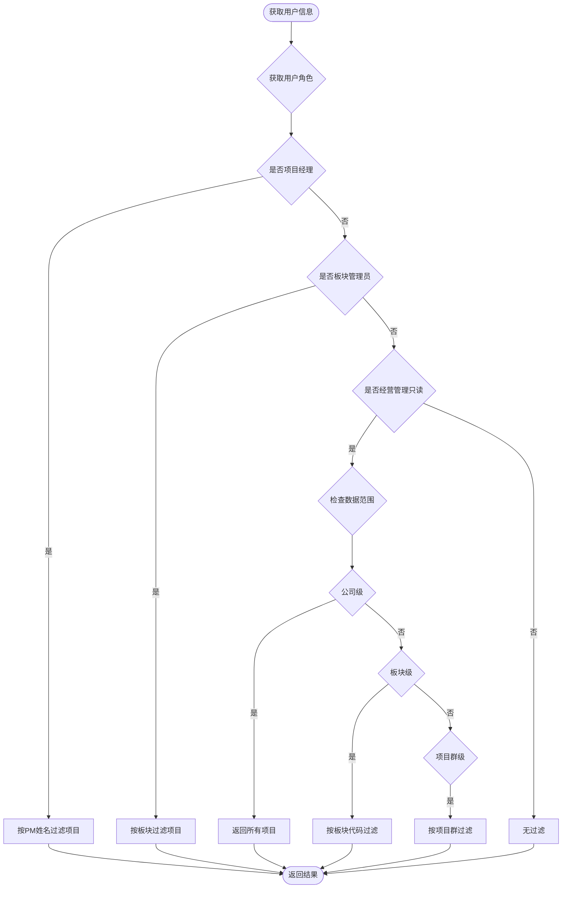

**图表来源**
- [js/data-scope.js:13-42](file://js/data-scope.js#L13-L42)

**章节来源**
- [js/data-scope.js:13-71](file://js/data-scope.js#L13-L71)

### 审计日志系统

系统实现了完整的审计日志机制：

#### 审计流程

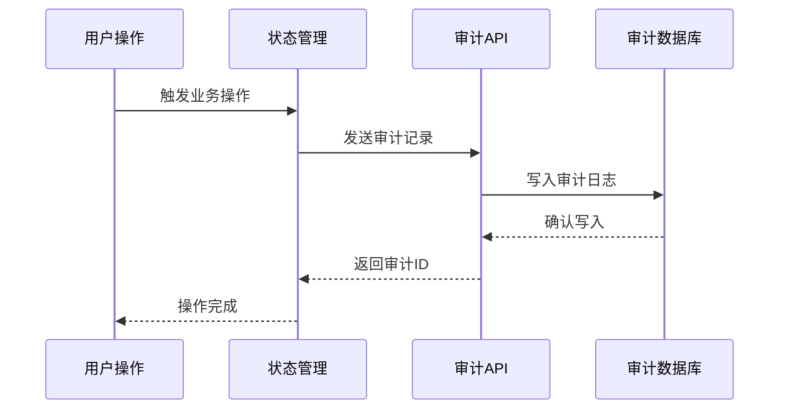

**图表来源**
- [js/store.js:338-342](file://js/store.js#L338-L342)
- [server/index.js:170-182](file://server/index.js#L170-L182)

**章节来源**
- [js/store.js:338-342](file://js/store.js#L338-L342)
- [server/index.js:170-182](file://server/index.js#L170-L182)

## 依赖关系分析

系统权限控制涉及多个组件的协作：

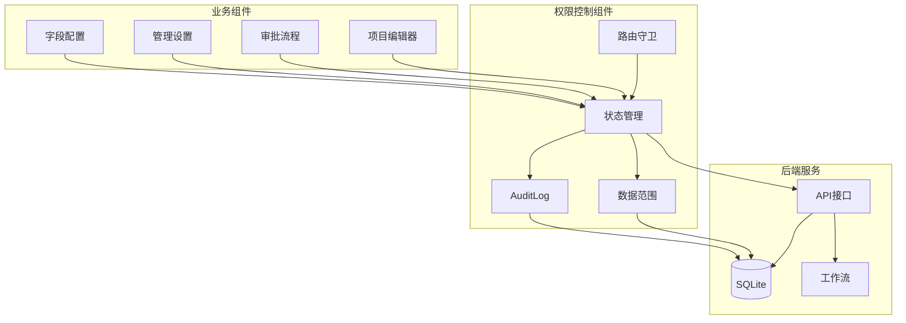

**图表来源**
- [js/router.js:1-137](file://js/router.js#L1-L137)
- [js/store.js:1-602](file://js/store.js#L1-L602)
- [server/index.js:1-775](file://server/index.js#L1-L775)

**章节来源**
- [js/router.js:1-137](file://js/router.js#L1-L137)
- [js/store.js:1-602](file://js/store.js#L1-L602)
- [server/index.js:1-775](file://server/index.js#L1-L775)

## 性能考虑

系统在权限控制方面采用了多项优化措施：

### 缓存策略
- 用户信息缓存在localStorage中
- 字段字典缓存在内存中
- 项目数据分页加载

### 数据库优化
- 审计日志限制500条记录
- 索引优化查询性能
- 事务批量操作

### 前端性能
- 路由懒加载
- 组件按需渲染
- 状态订阅优化

## 故障排除指南

### 常见权限问题

#### 登录后权限异常
1. 检查用户角色配置
2. 验证权限数据同步
3. 清除浏览器缓存

#### 页面访问被拒绝
1. 确认用户角色正确
2. 检查路由守卫配置
3. 验证后端权限设置

#### 数据访问范围错误
1. 检查数据范围配置
2. 验证用户所属板块
3. 确认项目群配置

**章节来源**
- [js/views/Login.js:111-123](file://js/views/Login.js#L111-L123)
- [js/router.js:77-82](file://js/router.js#L77-L82)

## 结论

本项目实现了完整的RBAC权限控制体系，通过前端路由守卫和后端API验证相结合的方式，提供了多层次的安全保障。系统支持灵活的角色定义、细粒度的权限控制和完整的审计日志，能够满足企业级应用的权限管理需求。

## 附录

### 权限管理最佳实践

1. **最小权限原则**：为每个角色分配必要的最小权限
2. **定期审查**：定期审查用户权限和访问日志
3. **职责分离**：避免单个用户拥有过多权限
4. **审计跟踪**：启用完整的操作审计日志
5. **安全更新**：及时更新权限配置和安全补丁

### 权限继承机制

系统支持角色间的权限继承：
- 系统管理员继承所有权限
- 板块管理员继承基础权限
- 经营管理只读角色权限受限

### 权限撤销策略

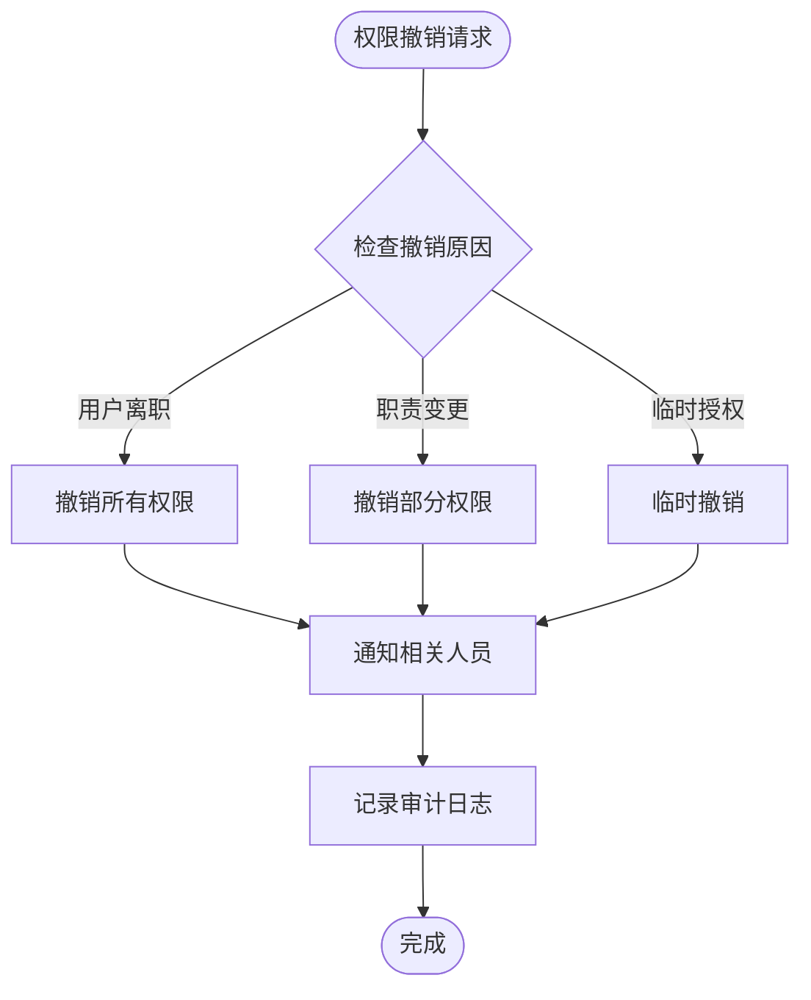