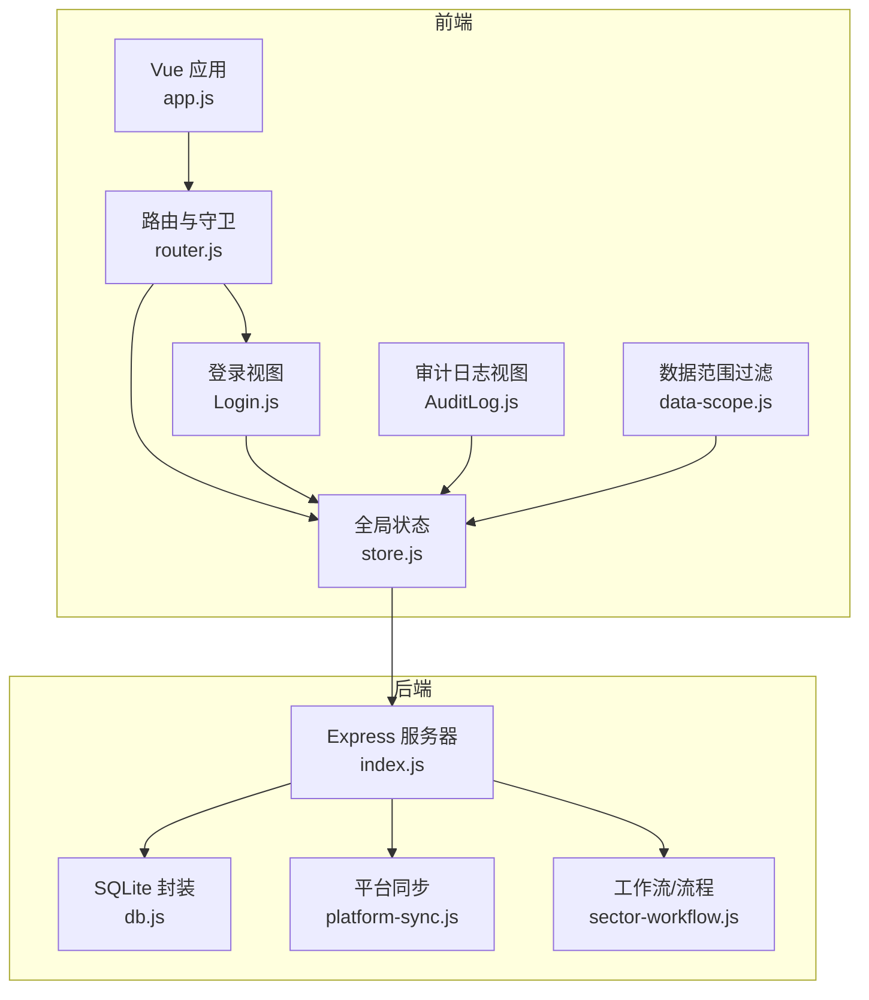
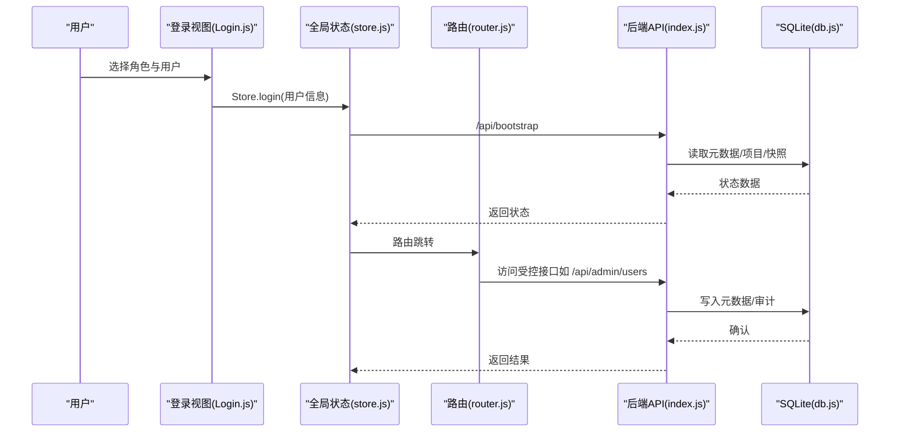
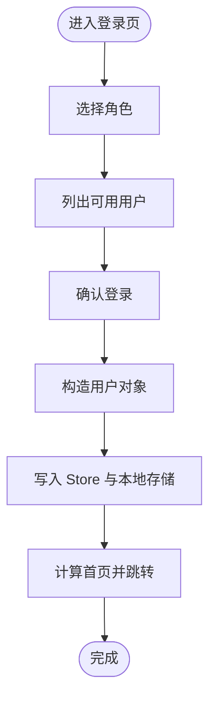
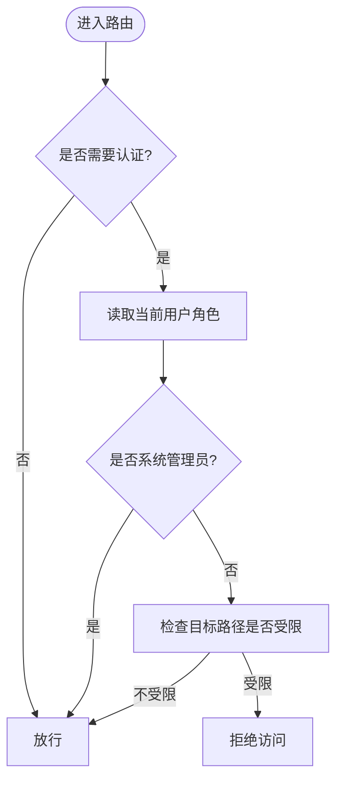
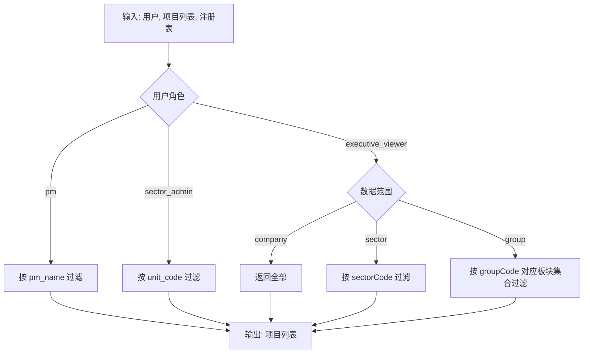
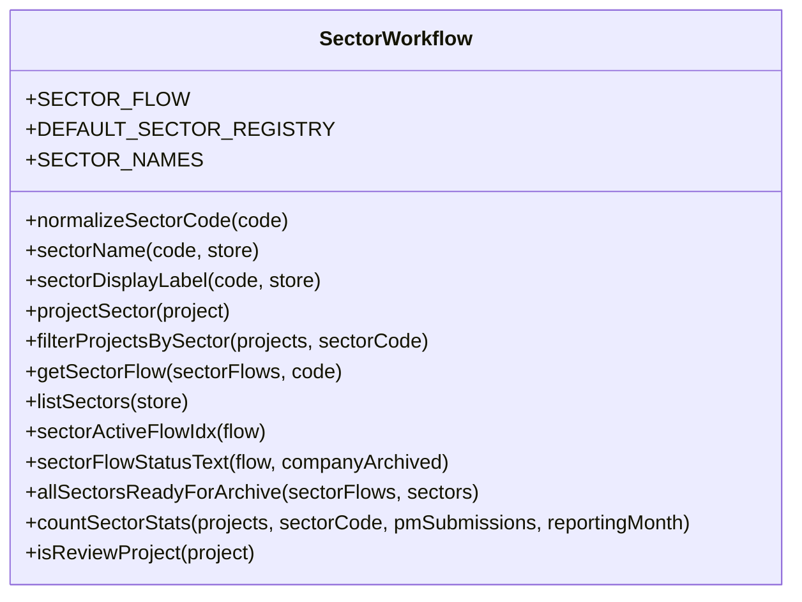
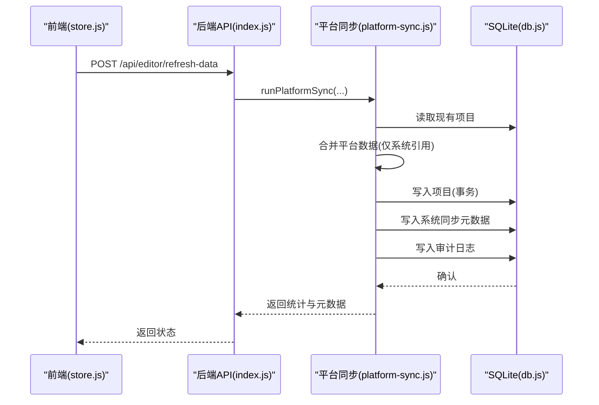
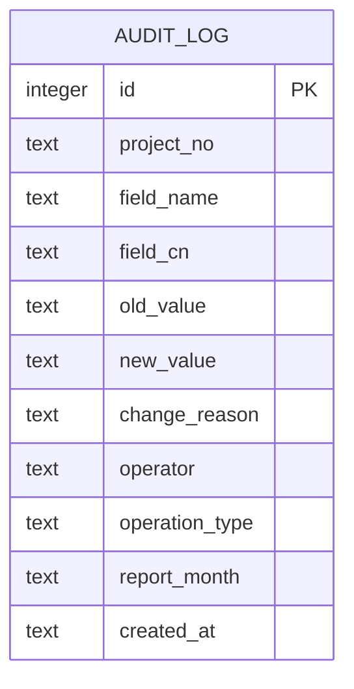
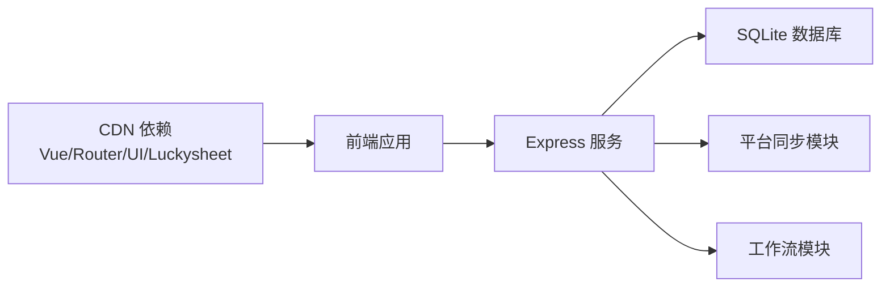

# 权限与安全

<cite>
**本文引用的文件**
- [Login.js](file://js/views/Login.js)
- [store.js](file://js/store.js)
- [router.js](file://js/router.js)
- [data-scope.js](file://js/data-scope.js)
- [sector-workflow.js](file://js/sector-workflow.js)
- [index.js](file://server/index.js)
- [db.js](file://server/db.js)
- [platform-sync.js](file://server/platform-sync.js)
- [AuditLog.js](file://js/views/AuditLog.js)
- [database-schema.sql](file://database-schema.sql)
- [database-schema-design.md](file://database-schema-design.md)
- [技术栈与开发规范.md](file://docs/需求文档/技术栈与开发规范.md)
- [AGENTS.md](file://AGENTS.md)
</cite>

## 目录
1. [简介](#简介)
2. [项目结构](#项目结构)
3. [核心组件](#核心组件)
4. [架构总览](#架构总览)
5. [详细组件分析](#详细组件分析)
6. [依赖分析](#依赖分析)
7. [性能考量](#性能考量)
8. [故障排查指南](#故障排查指南)
9. [结论](#结论)
10. [附录](#附录)

## 简介
本文件围绕“权限与安全”主题，系统梳理项目追踪平台的基于角色的访问控制（RBAC）、会话与令牌处理、权限控制、数据访问控制、API 权限验证、敏感数据保护、外部系统集成与安全传输、安全最佳实践、漏洞防护与合规要求、权限配置指南、安全审计与应急响应策略，以及前后端协同机制。

## 项目结构
项目采用“前端 Vue SPA + 后端 Express + SQLite”的轻量架构，强调“零构建工具链”，通过 CDN 引入依赖，部署与运行门槛低。权限与安全相关的关键模块包括：
- 前端：登录视图、全局状态 Store、路由守卫、数据范围过滤、审计日志视图
- 后端：Express 路由与控制器、SQLite 元数据与审计日志表、平台同步与工作流

**图表来源**
- [index.js:88-775](file://server/index.js#L88-L775)
- [store.js:268-602](file://js/store.js#L268-L602)
- [router.js:1-136](file://js/router.js#L1-L136)
- [Login.js:52-130](file://js/views/Login.js#L52-L130)
- [db.js:11-60](file://server/db.js#L11-L60)
- [platform-sync.js:214-262](file://server/platform-sync.js#L214-L262)
- [sector-workflow.js:159-178](file://js/sector-workflow.js#L159-L178)

**章节来源**
- [AGENTS.md:1-326](file://AGENTS.md#L1-L326)

## 核心组件
- 登录与会话管理：前端登录视图提供角色选择与用户模拟，登录后写入本地存储并进入应用；路由守卫根据角色决定可访问路径。
- 权限控制：前端路由守卫按角色限制访问；后端接口通过元数据与流程状态控制关键操作。
- 数据范围控制：针对“经营管理（只读）”等角色，提供按公司/板块/项目群的数据过滤。
- 审计与合规：全量审计日志表与前端审计视图，支持多维筛选与导出。
- 外部系统集成：平台同步模块负责与中台/CRB/财务系统对接，安全地合并系统字段与显示字段。

**章节来源**
- [Login.js:7-50](file://js/views/Login.js#L7-L50)
- [store.js:290-308](file://js/store.js#L290-L308)
- [router.js:7-136](file://js/router.js#L7-L136)
- [data-scope.js:13-42](file://js/data-scope.js#L13-L42)
- [index.js:170-182](file://server/index.js#L170-L182)
- [platform-sync.js:200-262](file://server/platform-sync.js#L200-L262)

## 架构总览
系统采用“前端角色选择 + 后端元数据与流程控制”的双层权限模型：
- 前端：角色卡片选择、路由守卫、数据范围过滤、审计日志视图
- 后端：用户与角色元数据、流程状态（锁定/提交/审批）、审计日志表、平台同步

**图表来源**
- [Login.js:111-123](file://js/views/Login.js#L111-L123)
- [store.js:268-275](file://js/store.js#L268-L275)
- [router.js:95-132](file://js/router.js#L95-L132)
- [index.js:647-702](file://server/index.js#L647-L702)
- [db.js:194-266](file://server/db.js#L194-L266)

## 详细组件分析

### 组件A：认证与会话管理（Login.js）
- 角色定义：前端内置六种角色卡片，包含系统管理员、经营管理（只读）、板块管理员、项目经理、板块总监、项目群群主。
- 用户选择与回退：根据所选角色列出可用用户，支持回退到角色选择。
- 登录流程：构造用户对象（含角色、部门/板块等），写入 Store 并持久化到本地存储，随后跳转到角色首页。
- 会话与令牌：原型阶段采用本地存储保存用户信息；上线后应由平台统一鉴权并下发令牌，本系统不再模拟角色切换。

**图表来源**
- [Login.js:105-123](file://js/views/Login.js#L105-L123)
- [store.js:290-296](file://js/store.js#L290-L296)

**章节来源**
- [Login.js:7-50](file://js/views/Login.js#L7-L50)
- [Login.js:105-123](file://js/views/Login.js#L105-L123)
- [store.js:290-296](file://js/store.js#L290-L296)

### 组件B：权限控制与路由守卫（router.js）
- 角色到路径映射：不同角色默认首页不同；审批角色仅能访问审批页，系统管理员可访问管理与审计。
- 访问限制：对管理与审计路径进行角色校验；项目经理、经营管理（只读）等角色被限制访问特定页面。
- 通用校验：未登录用户强制跳转登录；登录后根据角色自动重定向。

**图表来源**
- [router.js:7-136](file://js/router.js#L7-L136)

**章节来源**
- [router.js:7-136](file://js/router.js#L7-L136)

### 组件C：数据范围控制（data-scope.js）
- PM：按项目经理姓名过滤项目。
- 板块管理员：按板块编码过滤项目。
- 经营管理（只读）：支持按公司/板块/项目群三种范围过滤；提供范围标签展示。
- 标签生成：根据用户数据范围与注册表生成可读标签。

**图表来源**
- [data-scope.js:13-42](file://js/data-scope.js#L13-L42)

**章节来源**
- [data-scope.js:13-42](file://js/data-scope.js#L13-L42)

### 组件D：权限控制系统（sector-workflow.js）
- 板块注册与名称：内置十二板块注册表与名称映射，支持规范化板块编码。
- 流程状态：定义“草稿/初审/终审”三阶段，提供状态文本、活动流程索引、统计与归档判断等辅助函数。
- 前端纯函数：所有流程逻辑在前端实现，便于与后端流程状态协同。

**图表来源**
- [sector-workflow.js:159-178](file://js/sector-workflow.js#L159-L178)

**章节来源**
- [sector-workflow.js:14-178](file://js/sector-workflow.js#L14-L178)

### 组件E：平台同步与外部系统集成（platform-sync.js）
- 同步键构建：根据字段字典中的“system_sync”标识生成系统同步键集合。
- 引用键扩展：按报告月索引拼接“月度发票/付款”引用键。
- 平台值解析：支持“mi_/mp_”前缀的月度字段解析。
- 合并策略：以项目编号为键合并平台数据，仅更新系统引用字段，不覆盖显示字段；对新增项目补充显示字段与月度数组。
- 审计与元数据：记录同步时间、统计信息与操作者，写入系统元数据与审计日志。

**图表来源**
- [store.js:558-577](file://js/store.js#L558-L577)
- [index.js:580-625](file://server/index.js#L580-L625)
- [platform-sync.js:214-262](file://server/platform-sync.js#L214-L262)
- [db.js:194-266](file://server/db.js#L194-L266)

**章节来源**
- [platform-sync.js:5-262](file://server/platform-sync.js#L5-L262)
- [index.js:580-625](file://server/index.js#L580-L625)
- [db.js:194-266](file://server/db.js#L194-L266)

### 组件F：审计与合规（AuditLog.js 与数据库表）
- 前端审计视图：支持按日期、用户、项目、字段筛选，支持导出为 Excel。
- 数据库审计表：记录字段级变更、操作类型、操作人、时间戳等，支持多维查询与导出。
- 后端审计接口：接收前端审计记录并写入数据库。

**图表来源**
- [database-schema.sql:254-273](file://database-schema.sql#L254-L273)
- [index.js:170-182](file://server/index.js#L170-L182)

**章节来源**
- [AuditLog.js:1-239](file://js/views/AuditLog.js#L1-L239)
- [database-schema.sql:254-273](file://database-schema.sql#L254-L273)
- [index.js:170-182](file://server/index.js#L170-L182)

## 依赖分析
- 前端依赖：Vue、Vue Router、Element UI、Luckysheet、Tailwind CSS、ECharts 等通过 CDN 引入，降低构建复杂度。
- 后端依赖：Express、better-sqlite3、xlsx 等，提供 API 与 SQLite 数据持久化。
- 权限耦合点：前端路由守卫与后端接口共同保证访问控制；数据范围过滤与后端流程状态共同保证数据可见性。

**图表来源**
- [技术栈与开发规范.md:36-106](file://docs/需求文档/技术栈与开发规范.md#L36-L106)
- [index.js:1-25](file://server/index.js#L1-L25)
- [db.js:11-60](file://server/db.js#L11-L60)

**章节来源**
- [技术栈与开发规范.md:36-106](file://docs/需求文档/技术栈与开发规范.md#L36-L106)
- [AGENTS.md:116-131](file://AGENTS.md#L116-L131)

## 性能考量
- 前端：路由守卫与数据过滤均为内存操作，复杂度与项目数量线性相关；建议在大数据量场景下分页与懒加载。
- 后端：平台同步采用事务批量写入，减少磁盘 IO；审计日志写入与查询建立索引，提升检索效率。
- 存储：SQLite WAL 模式提升并发读写性能；审计与快照表按时间与项目号建立索引。

[本节为通用指导，无需特定文件引用]

## 故障排查指南
- 登录异常：检查本地存储中的用户信息是否正确；确认路由守卫是否正确识别角色。
- 权限受限：确认后端元数据中用户角色与注册表配置；检查流程状态（锁定/提交/审批）是否影响访问。
- 审计缺失：确认前端审计接口调用与后端审计写入；检查数据库审计表是否存在。
- 平台同步失败：检查环境变量与真实 API 配置；确认字段字典与系统同步键是否匹配。

**章节来源**
- [store.js:290-308](file://js/store.js#L290-L308)
- [index.js:647-702](file://server/index.js#L647-L702)
- [platform-sync.js:200-206](file://server/platform-sync.js#L200-L206)

## 结论
本系统通过“前端角色选择 + 路由守卫 + 数据范围过滤 + 后端元数据与流程控制 + 审计日志”的组合，实现了轻量而有效的权限与安全体系。平台同步模块提供了与外部系统的安全集成通道。建议在上线阶段引入统一平台鉴权与令牌机制，强化会话安全与传输加密，并持续完善字段字典与公式引擎的一致性校验。

[本节为总结，无需特定文件引用]

## 附录

### 安全最佳实践
- 会话与令牌：上线后由平台统一鉴权并下发短期令牌，前端仅持有令牌，避免在本地存储中保存敏感信息。
- 传输安全：启用 HTTPS，确保 API 与静态资源传输安全；对敏感接口增加 CORS 与速率限制。
- 输入验证：对所有用户输入与外部系统数据进行白名单校验与长度限制。
- 最小权限：接口与视图按角色最小化暴露，避免越权访问。
- 审计与监控：全量审计日志保留不少于 6 个月，定期导出与归档；对异常操作进行告警。

[本节为通用指导，无需特定文件引用]

### 漏洞防护
- XSS：对用户输入与富文本内容进行转义与白名单过滤；Luckysheet 单元格渲染需避免执行不受信任脚本。
- CSRF：对敏感操作（POST/PUT/DELETE）增加 CSRF Token 或 SameSite Cookie。
- 会话劫持：短时效令牌 + 定期刷新；登出时清除本地存储与服务端会话。
- 敏感数据泄露：对审计日志中的敏感字段进行脱敏；导出功能需二次确认与水印。

[本节为通用指导，无需特定文件引用]

### 合规要求
- 审计日志：满足财务与运营审计要求，保留字段级变更与操作轨迹。
- 数据最小化：仅收集与业务必需的用户信息；删除或匿名化演示数据。
- 数据保留：按法规要求设定数据保留期限，到期自动清理。

[本节为通用指导，无需特定文件引用]

### 权限配置指南
- 用户与角色：通过后端管理接口更新用户列表与角色；板块管理员配置需为对象格式。
- 字段字典：系统管理员方可编辑字段字典；保存后需重启服务使服务端公式与权限生效。
- 流程与周期：通过周期配置与锁定状态控制填报窗口；PM 提交与板块审批流程需严格遵循。

**章节来源**
- [index.js:647-702](file://server/index.js#L647-L702)
- [index.js:704-741](file://server/index.js#L704-L741)
- [db.js:144-169](file://server/db.js#L144-L169)

### 安全审计与应急响应
- 审计日志：前端支持筛选与导出；后端审计表支持多维查询；建议定期导出并离线归档。
- 应急响应：发现异常操作立即冻结账户、撤销令牌、回滚可疑变更；启动事件调查与修复。

**章节来源**
- [AuditLog.js:61-81](file://js/views/AuditLog.js#L61-L81)
- [database-schema.sql:254-273](file://database-schema.sql#L254-L273)

### 前后端安全协同机制
- 前端：角色选择、路由守卫、数据范围过滤、审计视图。
- 后端：用户与角色元数据、流程状态、审计日志、平台同步、定时任务与安全配置。

**章节来源**
- [router.js:7-136](file://js/router.js#L7-L136)
- [data-scope.js:13-42](file://js/data-scope.js#L13-L42)
- [index.js:170-182](file://server/index.js#L170-L182)
- [platform-sync.js:214-262](file://server/platform-sync.js#L214-L262)