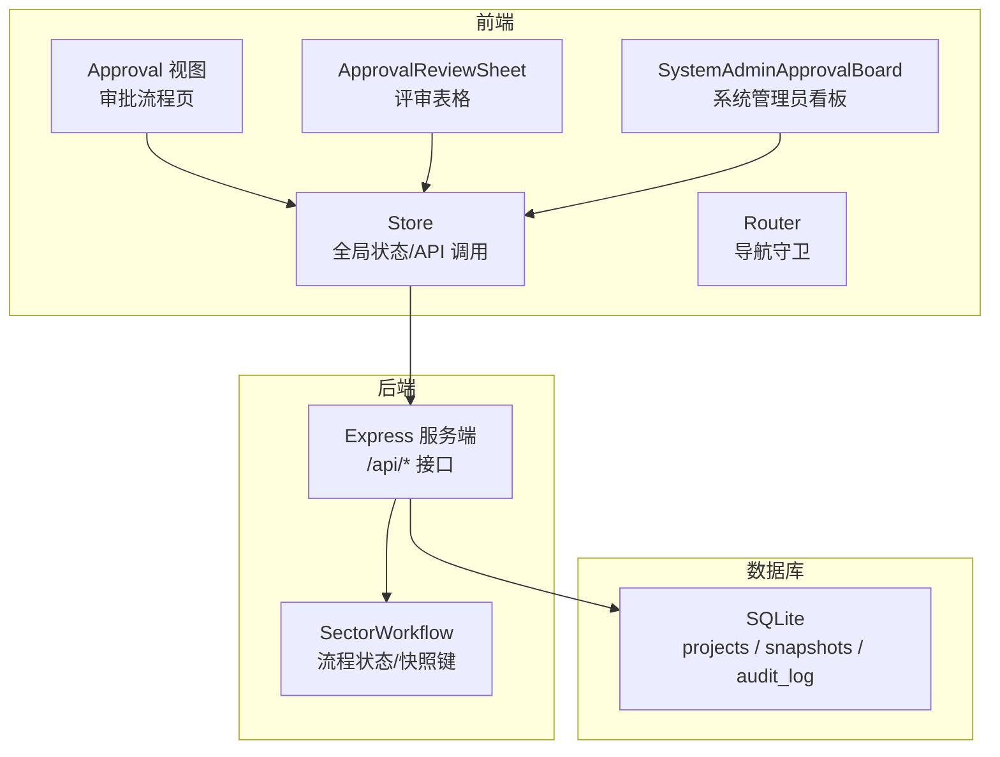
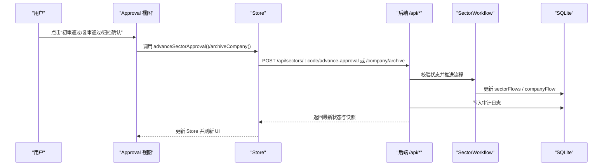
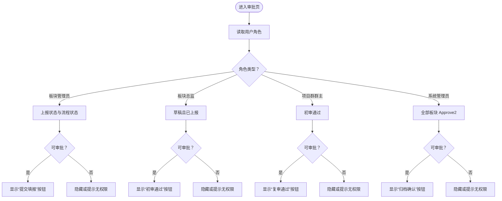
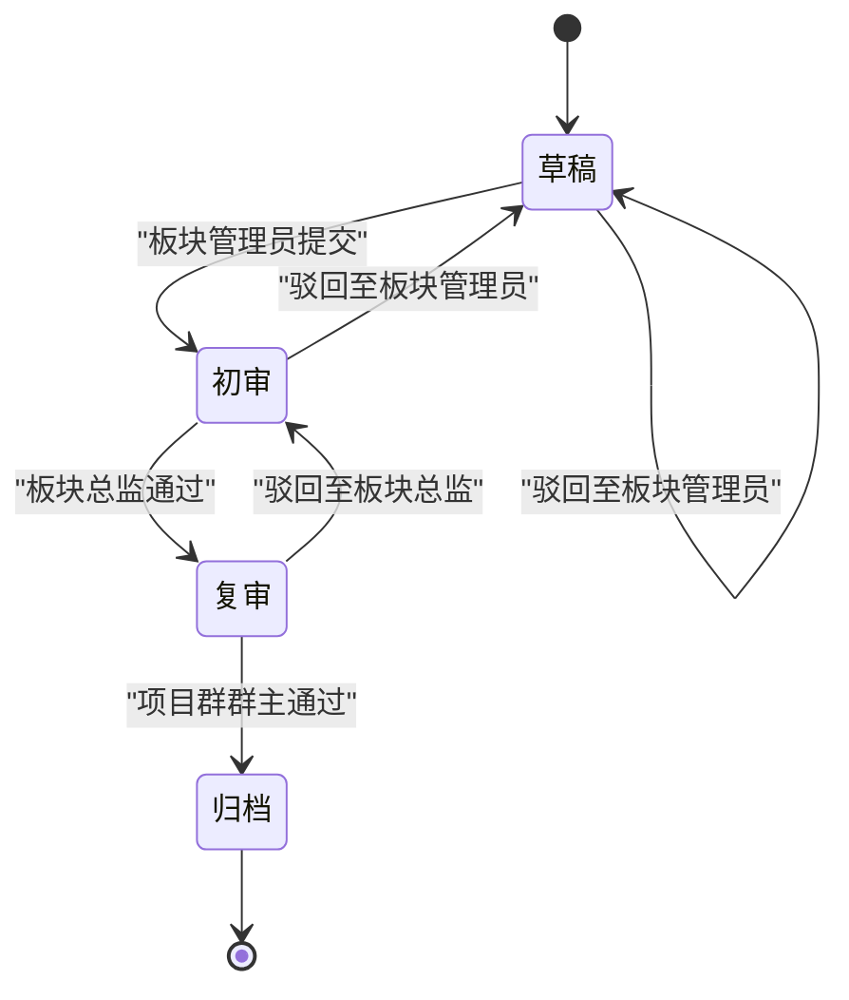
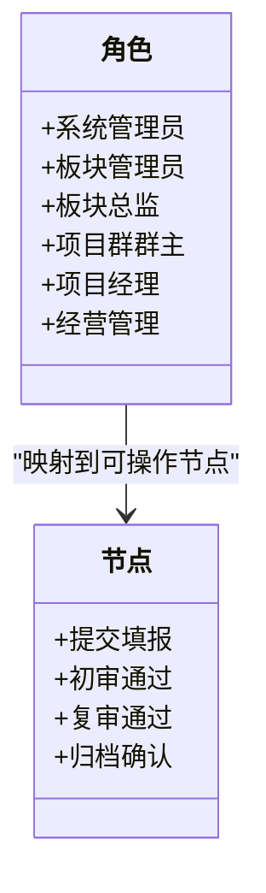
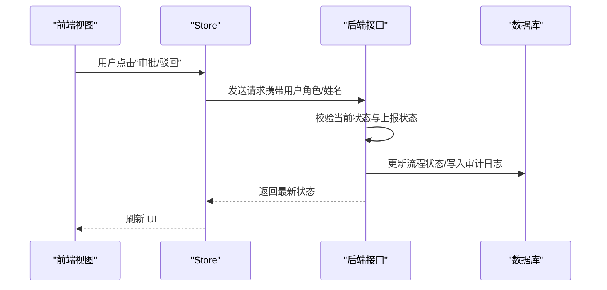
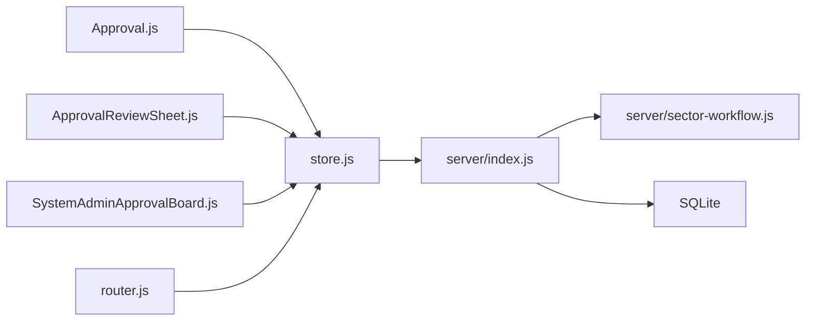

# 审批流程集成

<cite>
**本文引用的文件**
- [js/views/Approval.js](file://js/views/Approval.js)
- [js/components/ApprovalReviewSheet.js](file://js/components/ApprovalReviewSheet.js)
- [js/components/SystemAdminApprovalBoard.js](file://js/components/SystemAdminApprovalBoard.js)
- [js/store.js](file://js/store.js)
- [js/router.js](file://js/router.js)
- [server/sector-workflow.js](file://server/sector-workflow.js)
- [server/index.js](file://server/index.js)
- [database-schema.sql](file://database-schema.sql)
- [docs/需求文档/技术栈与开发规范.md](file://docs/需求文档/技术栈与开发规范.md)
</cite>

## 目录
1. [简介](#简介)
2. [项目结构](#项目结构)
3. [核心组件](#核心组件)
4. [架构总览](#架构总览)
5. [详细组件分析](#详细组件分析)
6. [依赖分析](#依赖分析)
7. [性能考量](#性能考量)
8. [故障排查指南](#故障排查指南)
9. [结论](#结论)
10. [附录](#附录)

## 简介
本文件围绕“审批流程与权限控制集成”进行系统化说明，聚焦以下主题：
- 审批节点权限控制：不同角色在流程各阶段的可操作权限与可见性
- 权限流转机制：从板块管理员提交、板块总监初审、项目群群主复审到系统管理员归档的权限推进
- 权限传递与回收：基于流程状态的权限授予与回收
- 权限状态管理：流程状态、上报状态与权限映射
- 权限与角色关联：角色到审批节点的映射与导航守卫
- 权限验证点与检查时机：前端计算属性与后端接口校验
- 权限配置示例、流转监控与异常处理
- 权限优化与审计策略

## 项目结构
项目采用前后端分离的轻量架构，前端通过 Vue 2 + Element UI + Luckysheet 实现审批界面与表格编辑，后端基于 Node.js + Express + SQLite 提供审批状态与快照服务。

**图表来源**
- [js/views/Approval.js:1-475](file://js/views/Approval.js#L1-L475)
- [js/components/ApprovalReviewSheet.js:1-171](file://js/components/ApprovalReviewSheet.js#L1-L171)
- [js/components/SystemAdminApprovalBoard.js:1-86](file://js/components/SystemAdminApprovalBoard.js#L1-L86)
- [js/store.js:1-602](file://js/store.js#L1-L602)
- [js/router.js:1-137](file://js/router.js#L1-L137)
- [server/index.js:1-200](file://server/index.js#L1-L200)
- [server/sector-workflow.js:1-273](file://server/sector-workflow.js#L1-L273)
- [database-schema.sql:1-286](file://database-schema.sql#L1-L286)

**章节来源**
- [js/views/Approval.js:1-475](file://js/views/Approval.js#L1-L475)
- [js/store.js:1-602](file://js/store.js#L1-L602)
- [js/router.js:1-137](file://js/router.js#L1-L137)
- [server/index.js:1-200](file://server/index.js#L1-L200)
- [server/sector-workflow.js:1-273](file://server/sector-workflow.js#L1-L273)
- [database-schema.sql:1-286](file://database-schema.sql#L1-L286)

## 核心组件
- 审批视图（ApprovalView）：渲染流程时间轴、审批按钮、版本快照与差异对比，根据用户角色与流程状态决定可操作项与可见性。
- 评审表格（ApprovalReviewSheet）：板块总监/群主视角下的 Luckysheet 表格，支持筛选与只读展示，编辑权限受流程状态控制。
- 系统管理员看板（SystemAdminApprovalBoard）：并行展示各板块审批状态，支持公司级归档。
- 全局状态与 API（Store）：封装 /api/* 请求，推进审批、驳回、归档、快照创建与状态同步。
- 路由与权限（Router）：基于角色的导航守卫，限制访问路径与操作。
- 流程与快照（SectorWorkflow）：定义流程状态、快照键、板块注册表与状态迁移。
- 数据库（SQLite）：持久化项目、快照与审计日志。

**章节来源**
- [js/views/Approval.js:52-475](file://js/views/Approval.js#L52-L475)
- [js/components/ApprovalReviewSheet.js:7-171](file://js/components/ApprovalReviewSheet.js#L7-L171)
- [js/components/SystemAdminApprovalBoard.js:7-86](file://js/components/SystemAdminApprovalBoard.js#L7-L86)
- [js/store.js:97-602](file://js/store.js#L97-L602)
- [js/router.js:77-132](file://js/router.js#L77-L132)
- [server/sector-workflow.js:50-273](file://server/sector-workflow.js#L50-L273)
- [database-schema.sql:12-87](file://database-schema.sql#L12-L87)

## 架构总览
审批流程与权限控制贯穿前端视图、全局状态、后端接口与数据库。前端通过 Store 发起审批推进/驳回/归档请求，后端根据 SectorWorkflow 更新流程状态并写入审计日志，最终通过快照服务生成不可变快照。

**图表来源**
- [js/views/Approval.js:183-227](file://js/views/Approval.js#L183-L227)
- [js/store.js:395-437](file://js/store.js#L395-L437)
- [server/index.js:348-417](file://server/index.js#L348-L417)
- [server/sector-workflow.js:232-273](file://server/sector-workflow.js#L232-L273)

## 详细组件分析

### 审批节点权限控制
- 角色到节点映射：
  - 板块管理员：发起“提交填报”，生成草稿快照，推进至“初审”。
  - 板块总监：在“草稿且已上报”状态下进行“初审通过”。
  - 项目群群主：在“初审通过”状态下进行“复审通过”。
  - 系统管理员：在全部板块 Approve2 后进行“归档确认”，生成 J 版全局快照。
- 前端权限判断：
  - canApprove/canReject：依据当前角色、流程状态与上报状态动态计算。
  - nodeStatus：根据当前状态与上报状态渲染“已完成/进行中/未完成”。

**图表来源**
- [js/views/Approval.js:107-129](file://js/views/Approval.js#L107-L129)
- [js/views/Approval.js:157-177](file://js/views/Approval.js#L157-L177)

**章节来源**
- [js/views/Approval.js:9-46](file://js/views/Approval.js#L9-L46)
- [js/views/Approval.js:107-129](file://js/views/Approval.js#L107-L129)
- [js/views/Approval.js:157-177](file://js/views/Approval.js#L157-L177)

### 权限传递与回收机制
- 权限传递：
  - 板块管理员提交后，流程从“草稿”进入“初审”，总监获得审批权限。
  - 总监通过后，流程进入“复审”，群主获得审批权限。
  - 全部板块 Approve2 后，系统管理员获得“归档确认”权限。
- 权限回收：
  - 驳回时，流程回到“草稿”，总监/群主权限回收，板块管理员重新获得提交权限。
  - 归档完成后，系统管理员权限仅限查看与审计。

**图表来源**
- [server/index.js:302-417](file://server/index.js#L302-L417)
- [server/sector-workflow.js:232-273](file://server/sector-workflow.js#L232-L273)

**章节来源**
- [server/index.js:302-417](file://server/index.js#L302-L417)
- [server/sector-workflow.js:232-273](file://server/sector-workflow.js#L232-L273)

### 权限状态管理与角色关联
- 角色与路径限制：
  - 系统管理员：仅可访问管理/审计/字段配置。
  - 板块总监/群主：仅可访问审批页。
  - 项目经理/经营管理只读：限制访问审批/审计/管理/字段配置。
- 角色与节点映射：
  - 板块管理员：发起提交。
  - 板块总监：初审。
  - 项目群群主：复审。
  - 系统管理员：归档。

**图表来源**
- [js/router.js:77-132](file://js/router.js#L77-L132)
- [js/views/Approval.js:9-46](file://js/views/Approval.js#L9-L46)

**章节来源**
- [js/router.js:77-132](file://js/router.js#L77-L132)
- [js/views/Approval.js:9-46](file://js/views/Approval.js#L9-L46)

### 权限验证点与检查时机
- 前端检查：
  - 计算属性：canApprove/canReject、nodeStatus、activeFlowIdx 等在渲染前即时计算。
  - 用户交互：点击审批/驳回前弹窗确认，避免误操作。
- 后端检查：
  - 接口校验：推进/驳回/归档前检查当前流程状态与上报状态，防止越权或重复操作。
  - 审计日志：每次审批动作写入审计日志，包含操作人、角色、旧值/新值。

**图表来源**
- [js/views/Approval.js:183-227](file://js/views/Approval.js#L183-L227)
- [js/store.js:395-437](file://js/store.js#L395-L437)
- [server/index.js:348-417](file://server/index.js#L348-L417)

**章节来源**
- [js/views/Approval.js:183-227](file://js/views/Approval.js#L183-L227)
- [js/store.js:395-437](file://js/store.js#L395-L437)
- [server/index.js:348-417](file://server/index.js#L348-L417)

### 审批流程权限配置示例
- 板块管理员配置：
  - 在管理设置中配置“跳过总监初审”开关，若启用，板块管理员提交后直接进入“初审”。
- 系统管理员归档：
  - 全部板块 Approve2 后，系统管理员可执行“归档确认”，生成 J 版全局快照。

**章节来源**
- [js/views/AdminSettings.js:338-385](file://js/views/AdminSettings.js#L338-L385)
- [js/store.js:418-437](file://js/store.js#L418-L437)

### 权限流转监控与审计
- 审计日志：
  - 记录审批状态变更、驳回原因、操作人与时间，支持导出与筛选。
- 流程状态监控：
  - 审批视图与系统管理员看板实时展示各板块流程状态与步骤。

**章节来源**
- [js/store.js:338-342](file://js/store.js#L338-L342)
- [js/views/AuditLog.js:1-239](file://js/views/AuditLog.js#L1-L239)
- [js/components/SystemAdminApprovalBoard.js:14-56](file://js/components/SystemAdminApprovalBoard.js#L14-L56)

### 权限异常处理
- 前端：
  - 操作失败时弹出错误消息，加载状态重置，避免重复提交。
- 后端：
  - 对越权/重复操作返回 409/500，并在审计日志中记录异常。

**章节来源**
- [js/views/Approval.js:195-197](file://js/views/Approval.js#L195-L197)
- [server/index.js:309-312](file://server/index.js#L309-L312)

## 依赖分析
- 前端依赖：
  - Approval.js 依赖 Store 与 SectorWorkflow，负责渲染与交互。
  - ApprovalReviewSheet 依赖 Store 与 FieldConfig，负责表格渲染与筛选。
  - SystemAdminApprovalBoard 依赖 Store 与 SectorWorkflow，负责并行流程展示。
  - Router 依赖 Store，负责角色级导航守卫。
- 后端依赖：
  - index.js 提供 /api/* 接口，依赖 SectorWorkflow 与快照服务。
  - SectorWorkflow 提供流程状态与快照键生成。
- 数据库依赖：
  - projects 表包含审批状态字段，snapshots 表存储不可变快照，audit_log 记录审计。

**图表来源**
- [js/views/Approval.js:52-58](file://js/views/Approval.js#L52-L58)
- [js/components/ApprovalReviewSheet.js:7-10](file://js/components/ApprovalReviewSheet.js#L7-L10)
- [js/components/SystemAdminApprovalBoard.js:7-13](file://js/components/SystemAdminApprovalBoard.js#L7-L13)
- [js/store.js:97-128](file://js/store.js#L97-L128)
- [js/router.js:77-132](file://js/router.js#L77-L132)
- [server/index.js:1-200](file://server/index.js#L1-L200)
- [server/sector-workflow.js:250-273](file://server/sector-workflow.js#L250-L273)
- [database-schema.sql:276-286](file://database-schema.sql#L276-L286)

**章节来源**
- [js/views/Approval.js:52-58](file://js/views/Approval.js#L52-L58)
- [js/components/ApprovalReviewSheet.js:7-10](file://js/components/ApprovalReviewSheet.js#L7-L10)
- [js/components/SystemAdminApprovalBoard.js:7-13](file://js/components/SystemAdminApprovalBoard.js#L7-L13)
- [js/store.js:97-128](file://js/store.js#L97-L128)
- [js/router.js:77-132](file://js/router.js#L77-L132)
- [server/index.js:1-200](file://server/index.js#L1-200)
- [server/sector-workflow.js:250-273](file://server/sector-workflow.js#L250-L273)
- [database-schema.sql:276-286](file://database-schema.sql#L276-L286)

## 性能考量
- 前端渲染：
  - 使用计算属性缓存审批状态与按钮可用性，减少重复计算。
  - 表格组件按需刷新，避免全量重绘。
- 后端接口：
  - 审批推进/驳回/归档均为幂等写操作，结合状态校验避免重复写入。
  - 审计日志写入异步化，不影响主流程响应。
- 数据库：
  - 审批状态与上报状态字段建立索引，提升查询效率。

[本节为通用指导，无需特定文件引用]

## 故障排查指南
- 常见问题
  - “当前无待您处理的审批节点”：检查当前流程状态与上报状态。
  - “操作失败”：查看错误消息，确认是否越权或重复操作。
  - “无权限访问”：确认角色是否被限制访问相应路径。
- 审计与回溯
  - 通过审计日志筛选“审批状态”变更，定位异常操作。
  - 对比快照版本，确认数据变更来源。

**章节来源**
- [js/views/Approval.js:295-305](file://js/views/Approval.js#L295-L305)
- [js/views/AuditLog.js:23-87](file://js/views/AuditLog.js#L23-L87)

## 结论
本系统通过“角色到节点”的权限映射与“状态驱动”的权限流转，实现了从板块管理员提交、总监初审、群主复审到系统管理员归档的完整闭环。前端通过计算属性与导航守卫实现权限控制，后端通过接口校验与审计日志保障安全性与可追溯性。配合快照机制，确保审批过程不可篡改，满足合规与审计要求。

[本节为总结，无需特定文件引用]

## 附录
- Luckysheet 权限控制参考：利用单元格属性与右键配置实现不同角色的可见/可编辑权限，建议在初始化时传入动态生成的权限配置。

**章节来源**
- [docs/需求文档/技术栈与开发规范.md:142-144](file://docs/需求文档/技术栈与开发规范.md#L142-L144)