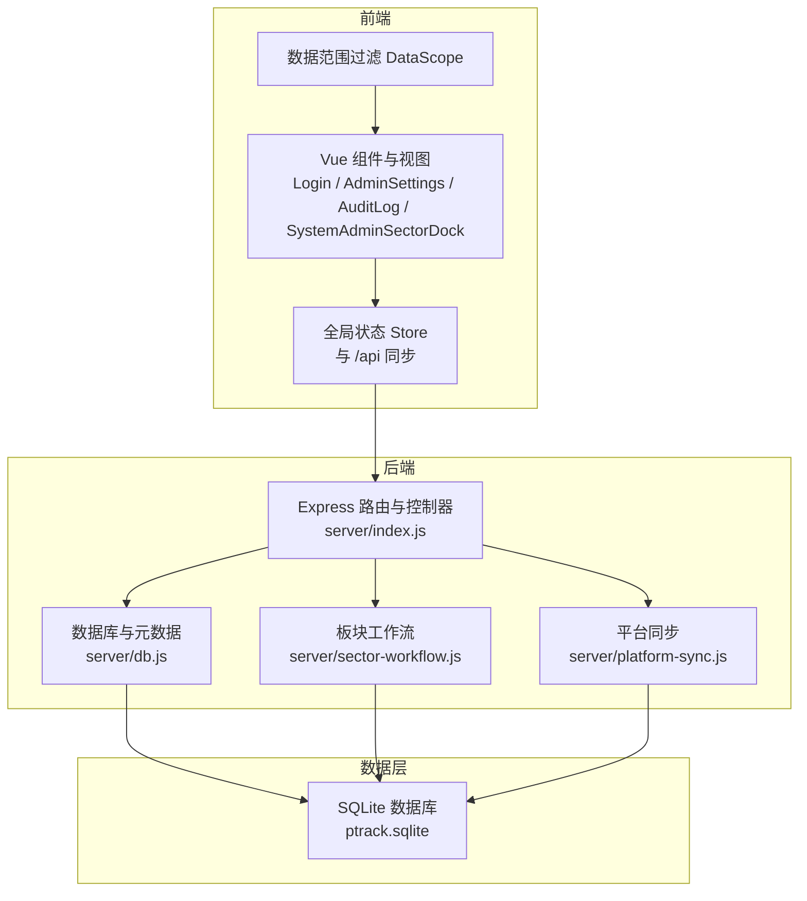
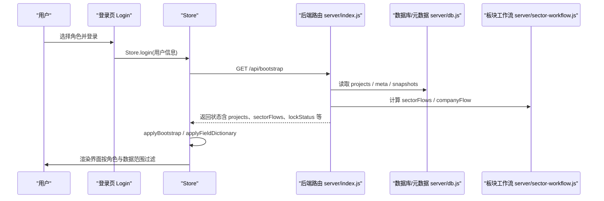
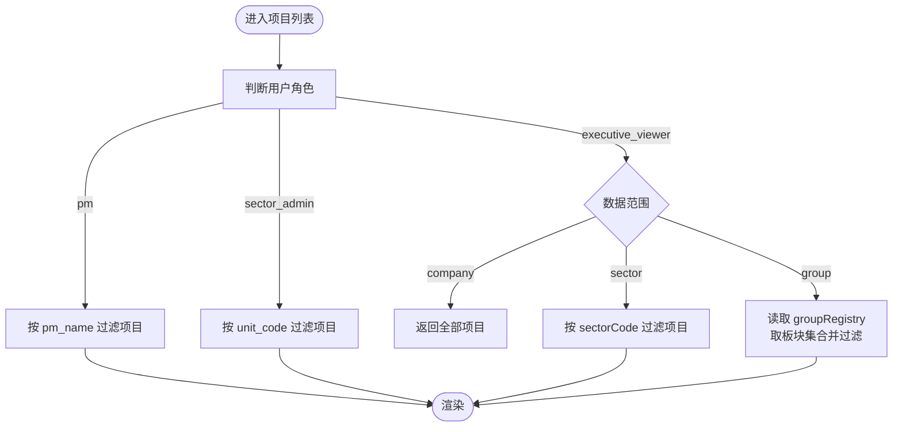
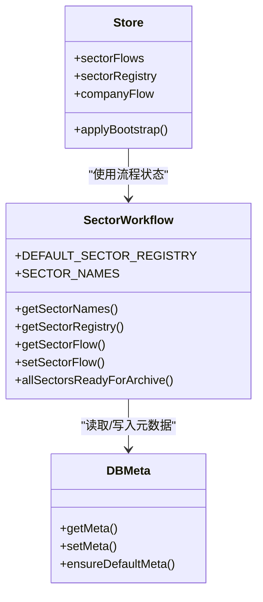
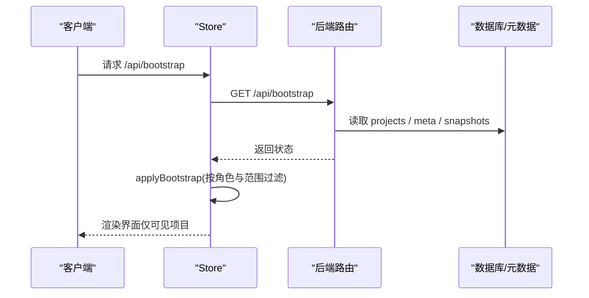
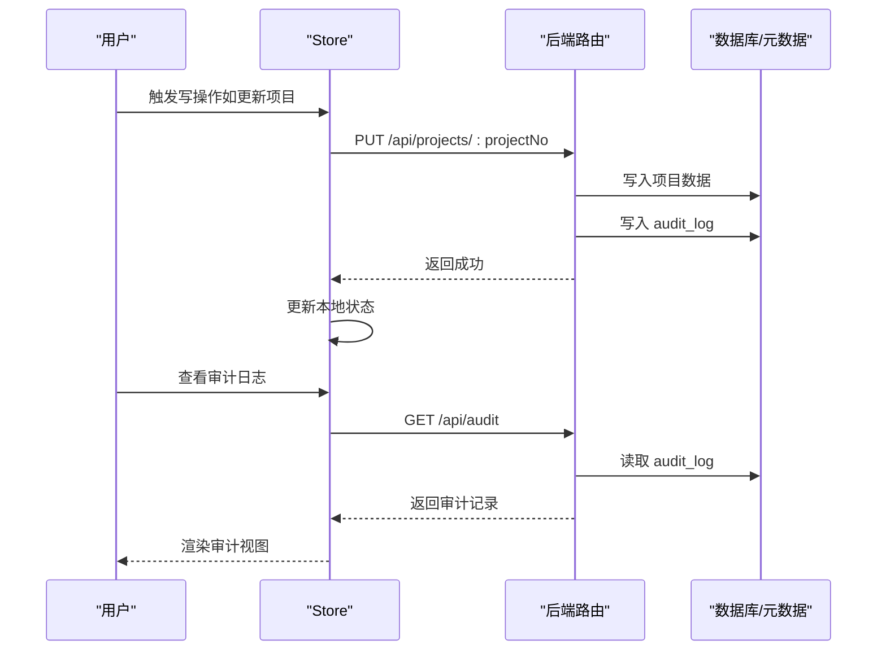
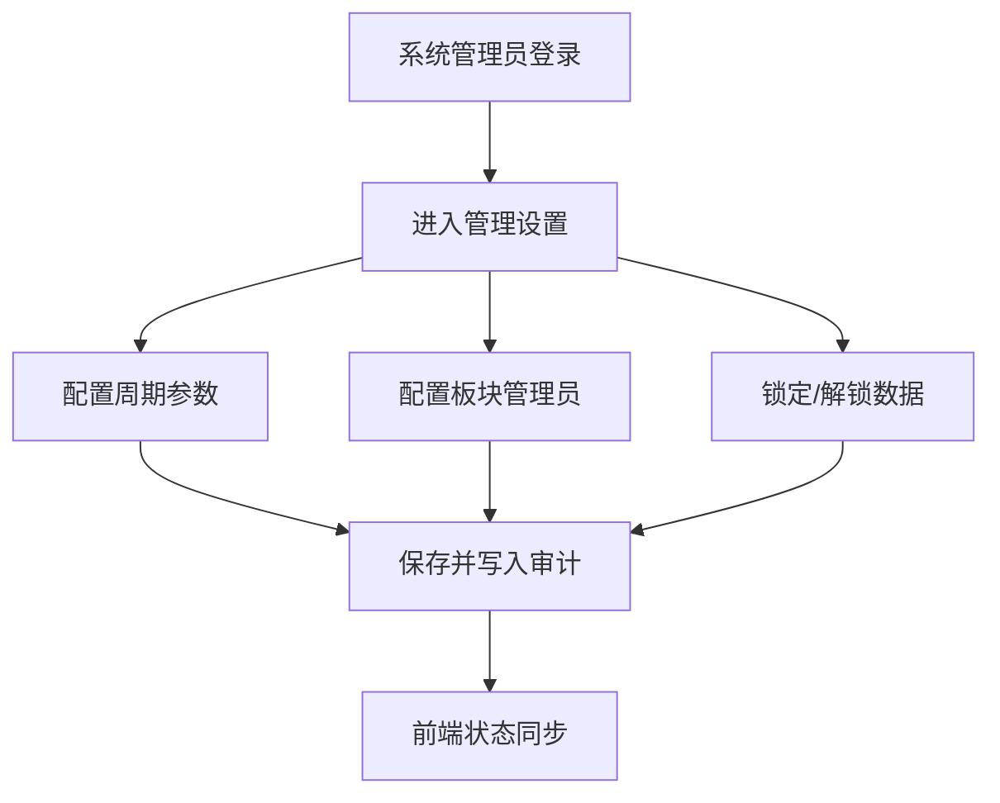
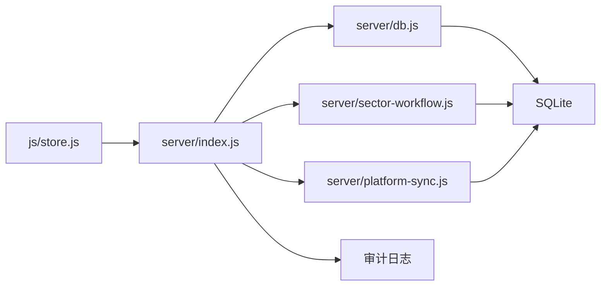

# 数据访问控制

<cite>
**本文引用的文件**
- [server/index.js](file://server/index.js)
- [server/db.js](file://server/db.js)
- [server/sector-workflow.js](file://server/sector-workflow.js)
- [server/platform-sync.js](file://server/platform-sync.js)
- [js/store.js](file://js/store.js)
- [js/data-scope.js](file://js/data-scope.js)
- [js/views/Login.js](file://js/views/Login.js)
- [js/views/AdminSettings.js](file://js/views/AdminSettings.js)
- [js/views/AuditLog.js](file://js/views/AuditLog.js)
- [js/components/SystemAdminSectorDock.js](file://js/components/SystemAdminSectorDock.js)
- [js/project-drawer-layout.js](file://js/project-drawer-layout.js)
- [js/formatters.js](file://js/formatters.js)
- [database-schema-design.md](file://database-schema-design.md)
</cite>

## 目录
1. [简介](#简介)
2. [项目结构](#项目结构)
3. [核心组件](#核心组件)
4. [架构总览](#架构总览)
5. [详细组件分析](#详细组件分析)
6. [依赖分析](#依赖分析)
7. [性能考量](#性能考量)
8. [故障排查指南](#故障排查指南)
9. [结论](#结论)
10. [附录](#附录)

## 简介
本文件系统化阐述本项目的“数据访问控制”体系，围绕“基于角色的数据范围控制与数据隔离机制”，深入解析权限实现原理、数据过滤逻辑与可见性控制，覆盖不同角色对项目数据的读取、修改、删除权限边界与数据范围限制；阐明数据访问控制与板块管理的关联关系及权限继承规则；说明数据访问日志记录、审计与异常访问检测机制；并提供配置示例、权限管理策略与安全防护建议，以及性能优化与权限冲突解决方法。

## 项目结构
系统采用前后端分离架构：
- 前端（浏览器）通过 Store 统一状态与 API 交互，负责界面渲染、权限可视化与用户操作。
- 后端（Node.js + Express）提供 REST API，负责业务规则、权限校验、数据持久化与审计。
- 数据层（SQLite）存储项目数据、快照、审计日志与系统元数据。

**图示来源**
- [server/index.js:1-775](file://server/index.js#L1-L775)
- [server/db.js:1-525](file://server/db.js#L1-L525)
- [server/sector-workflow.js:1-273](file://server/sector-workflow.js#L1-L273)
- [server/platform-sync.js:1-272](file://server/platform-sync.js#L1-L272)
- [js/store.js:1-602](file://js/store.js#L1-L602)
- [js/data-scope.js:1-73](file://js/data-scope.js#L1-L73)

**章节来源**
- [server/index.js:1-775](file://server/index.js#L1-L775)
- [server/db.js:1-525](file://server/db.js#L1-L525)
- [js/store.js:1-602](file://js/store.js#L1-L602)
- [js/data-scope.js:1-73](file://js/data-scope.js#L1-L73)

## 核心组件
- 角色与用户模型：系统内置角色（系统管理员、经营管理只读、板块管理员、项目经理、板块总监、项目群群主等），并通过元数据 users、groupRegistry、sectorAdmins 管理用户与数据范围。
- 数据范围过滤：针对经营管理只读角色，按公司/板块/项目群维度进行数据范围控制。
- 板块工作流：通过 sectorFlows、sectorRegistry、companyFlow 管理板块审批状态与数据可见性。
- 审计与日志：统一的审计日志表与前端审计视图，支持筛选、导出与异常检测。
- 平台同步：从外部平台同步系统引用字段，保障数据一致性与完整性。

**章节来源**
- [server/db.js:81-91](file://server/db.js#L81-L91)
- [js/data-scope.js:13-42](file://js/data-scope.js#L13-L42)
- [server/sector-workflow.js:34-48](file://server/sector-workflow.js#L34-L48)
- [server/index.js:170-182](file://server/index.js#L170-L182)
- [js/views/AuditLog.js:23-86](file://js/views/AuditLog.js#L23-L86)
- [server/platform-sync.js:83-150](file://server/platform-sync.js#L83-L150)

## 架构总览
数据访问控制贯穿“前端状态 → 后端路由 → 数据库/元数据 → 审计”的全链路，关键控制点包括：
- 登录与角色注入：前端登录页根据角色注入用户上下文，Store.login 设置 currentUser。
- 数据范围控制：前端 DataScope 根据用户角色与数据范围配置过滤项目列表。
- 板块工作流：后端通过 sector-workflow 管理板块审批状态，影响数据可见性与操作权限。
- 审计与异常检测：所有写操作均写入审计日志，前端提供审计视图与导出能力。

**图示来源**
- [js/views/Login.js:52-129](file://js/views/Login.js#L52-L129)
- [js/store.js:268-275](file://js/store.js#L268-L275)
- [server/index.js:91-100](file://server/index.js#L91-L100)
- [server/db.js:194-266](file://server/db.js#L194-L266)
- [server/sector-workflow.js:188-221](file://server/sector-workflow.js#L188-L221)

## 详细组件分析

### 角色与数据范围控制
- 角色与用户配置：系统默认用户与角色定义在元数据中，支持通过管理端更新。
- 数据范围过滤：经营管理只读角色（executive_viewer）支持按公司/板块/项目群三种范围过滤，前端 DataScope 提供过滤函数与标签展示。
- 板块管理员与项目经理：板块管理员按板块过滤，项目经理按自身 PM 名称过滤。

**图示来源**
- [js/data-scope.js:13-42](file://js/data-scope.js#L13-L42)
- [server/db.js:81-91](file://server/db.js#L81-L91)

**章节来源**
- [js/data-scope.js:13-60](file://js/data-scope.js#L13-L60)
- [server/db.js:81-91](file://server/db.js#L81-L91)

### 板块管理与数据权限继承
- 板块注册与流程：系统维护 sectorRegistry 与 sectorFlows，新项目或新板块会自动纳入注册表。
- 权限继承规则：板块管理员拥有其板块内的数据汇总与处理权限；板块总监在审批流程中具有初审/复审权限；项目群群主在公司层面归档阶段具有终审确认权限。
- 审批状态与可见性：sectorFlows 的 approvalStatus 与 reportingSubmitted 决定板块数据的可见性与可编辑性；companyFlow 的 archiveStatus 影响整体归档后的可见性。

**图示来源**
- [server/sector-workflow.js:84-105](file://server/sector-workflow.js#L84-L105)
- [server/sector-workflow.js:232-248](file://server/sector-workflow.js#L232-L248)
- [server/db.js:93-106](file://server/db.js#L93-L106)
- [js/store.js:130-168](file://js/store.js#L130-L168)

**章节来源**
- [server/sector-workflow.js:84-186](file://server/sector-workflow.js#L84-L186)
- [server/db.js:144-169](file://server/db.js#L144-L169)
- [js/store.js:130-168](file://js/store.js#L130-L168)

### 数据访问权限与可见性控制
- 读取权限：前端根据角色与数据范围过滤项目；后端 /api/bootstrap 返回当前状态（含 projects、sectorFlows、lockStatus 等）。
- 修改权限：系统管理员可锁定/解锁数据；板块管理员可推进审批；项目经理仅能修改其负责项目；经营管理只读角色仅能查看。
- 删除权限：系统未提供直接删除接口，项目数据通过替换/重导方式更新。

**图示来源**
- [js/store.js:268-275](file://js/store.js#L268-L275)
- [server/index.js:91-100](file://server/index.js#L91-L100)
- [server/db.js:194-266](file://server/db.js#L194-L266)

**章节来源**
- [js/store.js:130-168](file://js/store.js#L130-L168)
- [server/index.js:91-100](file://server/index.js#L91-L100)
- [server/db.js:194-266](file://server/db.js#L194-L266)

### 数据访问日志、审计与异常检测
- 审计日志：后端统一写入 audit_log，前端提供审计视图，支持按时间、用户、项目、字段筛选与导出。
- 异常检测：前端审计视图对新增字段与系统字段变更进行特殊标记；后端在关键操作（如锁定、导入、同步、归档）写入审计记录。
- 审计字段：包含操作时间、操作人、角色、项目号/名称、字段、原值、新值等。

**图示来源**
- [server/index.js:170-182](file://server/index.js#L170-L182)
- [js/views/AuditLog.js:23-86](file://js/views/AuditLog.js#L23-L86)
- [server/db.js:306-321](file://server/db.js#L306-L321)

**章节来源**
- [server/index.js:170-182](file://server/index.js#L170-L182)
- [js/views/AuditLog.js:23-86](file://js/views/AuditLog.js#L23-L86)
- [server/db.js:306-321](file://server/db.js#L306-L321)

### 数据访问控制配置示例与策略
- 用户与角色配置：通过管理端更新 users、groupRegistry、sectorAdmins，支持保存与审计记录。
- 板块管理员配置：支持为各板块配置管理员姓名与平台用户ID，并可设置“跳过总监初审”规则。
- 填报周期与锁定控制：系统管理员可配置报告月份、提醒日、月度锁定日、次月解禁日与自动解锁开关；支持立即锁定/解锁并写入审计。

**图示来源**
- [js/views/AdminSettings.js:59-136](file://js/views/AdminSettings.js#L59-L136)
- [js/views/AdminSettings.js:179-191](file://js/views/AdminSettings.js#L179-L191)
- [server/index.js:647-702](file://server/index.js#L647-L702)

**章节来源**
- [js/views/AdminSettings.js:59-136](file://js/views/AdminSettings.js#L59-L136)
- [js/views/AdminSettings.js:179-191](file://js/views/AdminSettings.js#L179-L191)
- [server/index.js:647-702](file://server/index.js#L647-L702)

### 数据安全防护措施
- 最小权限原则：前端按角色与数据范围过滤，后端在关键接口进行角色校验（如刷新数据仅系统/板块管理员可用）。
- 操作留痕：所有写操作均写入审计日志，支持导出与追溯。
- 审批驱动可见性：板块审批状态与公司归档状态决定数据可见性，避免越权访问。
- 平台同步安全：同步过程写入审计，支持按触发器与操作人记录。

**章节来源**
- [server/index.js:580-604](file://server/index.js#L580-L604)
- [server/platform-sync.js:214-262](file://server/platform-sync.js#L214-L262)

## 依赖分析
- 前端依赖后端 API 提供的状态与数据；Store 通过 /api/bootstrap 获取 projects、sectorFlows、lockStatus 等。
- 后端依赖数据库与元数据表（projects、audit_log、snapshots、meta）；板块工作流依赖 sectorFlows 与 sectorRegistry。
- 审计日志作为横切关注点，贯穿所有写操作。

**图示来源**
- [js/store.js:268-275](file://js/store.js#L268-L275)
- [server/index.js:91-100](file://server/index.js#L91-L100)
- [server/db.js:194-266](file://server/db.js#L194-L266)
- [server/sector-workflow.js:188-221](file://server/sector-workflow.js#L188-L221)
- [server/platform-sync.js:214-262](file://server/platform-sync.js#L214-L262)

**章节来源**
- [js/store.js:268-275](file://js/store.js#L268-L275)
- [server/index.js:91-100](file://server/index.js#L91-L100)
- [server/db.js:194-266](file://server/db.js#L194-L266)
- [server/sector-workflow.js:188-221](file://server/sector-workflow.js#L188-L221)
- [server/platform-sync.js:214-262](file://server/platform-sync.js#L214-L262)

## 性能考量
- 前端渲染优化：项目列表按角色与范围过滤，减少 DOM 与渲染压力。
- 审计日志容量：审计日志表默认限制为最近 500 条，避免前端过度渲染。
- 数据库索引：针对 projects、audit_log、snapshots 等关键表建立索引，提升查询效率。
- 平台同步：按需触发与定时任务结合，避免频繁同步造成性能抖动。

**章节来源**
- [js/store.js:164-167](file://js/store.js#L164-L167)
- [server/db.js:48-56](file://server/db.js#L48-L56)
- [server/platform-sync.js:745-775](file://server/platform-sync.js#L745-L775)

## 故障排查指南
- 登录与角色：确认登录页选择的角色与用户是否正确，Store.login 是否设置 currentUser。
- 数据范围：检查 executive_viewer 的 dataScope、sectorCode、groupCode 配置是否正确。
- 板块状态：检查 sectorFlows 与 companyFlow 状态，确认是否处于可编辑或已归档状态。
- 审计日志：通过审计视图筛选时间、用户、项目、字段，定位异常操作；必要时导出日志进行进一步分析。
- 平台同步：检查 systemDataSyncedAt 与 systemDataSyncMeta，确认同步是否成功。

**章节来源**
- [js/views/Login.js:52-129](file://js/views/Login.js#L52-L129)
- [js/data-scope.js:44-60](file://js/data-scope.js#L44-L60)
- [js/views/AuditLog.js:23-86](file://js/views/AuditLog.js#L23-L86)
- [server/index.js:558-577](file://server/index.js#L558-L577)

## 结论
本系统通过“角色 + 数据范围 + 板块工作流 + 审计日志”的组合实现了完整的数据访问控制：前端按角色与范围过滤，后端在关键接口进行权限校验与状态管理，审计日志提供全面的操作留痕与异常检测能力。板块管理与数据权限相互耦合，形成清晰的权限继承与可见性控制规则。建议在生产环境中持续完善权限矩阵、强化异常检测与告警，并结合性能监控与容量规划，确保系统在高并发与大规模数据下的稳定性与安全性。

## 附录
- 数据库表结构与设计要点参见数据库设计文档，涵盖 projects、audit_log、snapshots 等核心表及其索引策略与迁移策略。
- 前端格式化工具与布局组件为数据展示与交互提供基础能力，有助于提升用户体验与权限控制的可感知性。

**章节来源**
- [database-schema-design.md:1-240](file://database-schema-design.md#L1-L240)
- [js/formatters.js:118-166](file://js/formatters.js#L118-L166)
- [js/project-drawer-layout.js:68-126](file://js/project-drawer-layout.js#L68-L126)